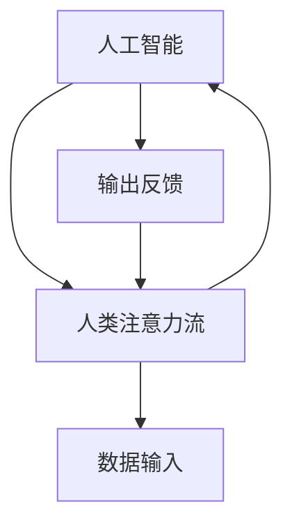

                 

### 背景介绍

在科技迅猛发展的今天，人工智能（AI）已经成为改变社会、经济和人类生活方式的关键驱动力。从简单的机器学习算法到复杂的神经网络模型，AI技术的进步让计算机在处理大量数据、执行重复性任务、甚至在模拟人类思维方面展现出前所未有的能力。

然而，尽管AI技术在各个领域取得了显著成就，但其发展仍然面临诸多挑战。一个重要的议题是AI系统如何更好地理解和融入人类的生活节奏，特别是如何与人类的注意力流实现高效共存。人类的注意力流是人们进行信息处理和决策的核心，它受到多种因素的影响，如情绪、环境、任务类型等。因此，AI系统若想真正实现人机共存，首先需要理解并适应人类注意力流的特性。

本文旨在探讨AI与人类注意力流之间的相互作用，以及如何打造一个既满足AI发展需求，又符合人类注意力特性的人机共存社会。我们将从以下几个方面展开讨论：

1. **核心概念与联系**：介绍AI和人类注意力流的基础概念，并探讨它们之间的相互关系。
2. **核心算法原理与具体操作步骤**：详细讲解用于分析人类注意力流的AI算法，以及其实际操作步骤。
3. **数学模型与公式**：阐述用于理解注意力流的数学模型，并通过具体例子进行解释。
4. **项目实战**：通过实际代码案例展示如何实现和分析人类注意力流。
5. **实际应用场景**：探讨AI与人类注意力流在各个领域的应用场景。
6. **工具和资源推荐**：推荐相关的学习资源、开发工具和论文。
7. **总结：未来发展趋势与挑战**：总结本文的主要观点，并展望未来的人机共存社会。

通过本文的讨论，我们希望能够提供一种新的视角，帮助读者更好地理解AI与人类注意力流之间的关系，并为打造一个高效、和谐的人机共存社会提供一些实用的思路和方法。

### 核心概念与联系

为了深入探讨AI与人类注意力流之间的关系，首先需要明确这两个核心概念的基本定义和特性。

**人工智能（AI）** 是指计算机系统执行通常需要人类智能才能完成的任务的科技，包括学习、推理、解决问题、自然语言理解和视觉识别等。AI的发展经历了多个阶段，从早期的规则系统到基于模式识别的神经网络，再到当前复杂的深度学习模型，每一次技术进步都使AI在处理复杂任务时表现得越来越接近人类。

**人类注意力流** 指的是人类在处理信息时，将心理资源分配到不同任务或刺激上的动态过程。注意力流不仅决定了人类对外界信息的关注点，还影响到信息的编码、存储和提取过程。研究表明，人类的注意力流受到多种因素的影响，如任务的重要性、情感状态、认知负荷以及外界环境的复杂度等。

那么，AI与人类注意力流之间究竟存在怎样的联系呢？实际上，这两者之间存在着密切的互动和依赖关系。

首先，AI系统需要理解和模拟人类注意力流，以便更好地与人类交互。例如，在自动驾驶技术中，AI系统需要实时分析道路环境，识别行人、车辆和其他动态元素，同时确保这些信息能够有效地传递给驾驶员。这就要求AI系统能够模拟人类的注意力分配机制，优先处理关键信息，并及时作出反应。

其次，人类注意力流也对AI系统的发展有着重要的影响。AI系统在处理大量数据时，需要识别出哪些信息是最为关键的。人类的注意力流提供了重要的参考，使得AI能够更加智能地筛选和利用信息。例如，在医疗诊断中，AI系统可以通过分析大量病例数据，识别出与特定疾病相关的关键指标，从而提高诊断的准确性。

为了更好地理解AI与人类注意力流之间的联系，我们可以使用Mermaid流程图来展示它们之间的交互关系。以下是AI与人类注意力流相互作用的Mermaid流程图：



在这个流程图中，AI与人类注意力流相互依赖，通过数据输入（DI）和输出反馈（OF）进行信息交换。AI系统根据人类注意力流提供的数据输入，调整其处理策略，并通过输出反馈来优化人类注意力流的分配，从而实现更加高效的人机交互。

### 核心算法原理与具体操作步骤

在理解了AI与人类注意力流的基本概念及其相互关系之后，接下来我们需要探讨一些核心算法原理，这些算法能够帮助AI更好地理解和模拟人类注意力流。

#### 注意力机制（Attention Mechanism）

注意力机制是深度学习领域中的一个重要概念，最早应用于计算机视觉和自然语言处理任务中。其核心思想是通过动态调整模型中不同部分对信息的关注程度，从而提高任务的处理效率。以下是一个简化的注意力机制的步骤：

1. **特征提取（Feature Extraction）**：首先，从原始数据中提取特征。这些特征可以是图像中的像素值、文本中的词汇嵌入等。
   
2. **注意力权重计算（Attention Weight Calculation）**：对于每个特征，计算其在当前任务中的重要性。这一步通常通过一个权重函数（如乘性权重或加性权重）来实现。注意力权重决定了每个特征在后续处理过程中的影响大小。

3. **特征加权（Feature Weighting）**：将计算得到的注意力权重应用于原始特征，生成加权特征。这些加权特征会参与到后续的模型处理中。

4. **输出生成（Output Generation）**：根据加权特征生成最终输出。在图像识别任务中，这可能是类别标签；在文本分类任务中，这可能是关键词或句子。

下面是一个简单的乘性注意力机制的实现步骤：

```python
import torch
import torch.nn as nn

class SimpleAttention(nn.Module):
    def __init__(self):
        super(SimpleAttention, self).__init__()
        self.attention_weights = nn.Parameter(torch.randn(1, hidden_size))

    def forward(self, features):
        attention_scores = torch.matmul(features, self.attention_weights)
        attention_weights = nn.Softmax(dim=1)(attention_scores)
        weighted_features = torch.mul(features, attention_weights.unsqueeze(-1))
        return weighted_features.sum(dim=1)
```

#### 注意力流分析算法

除了注意力机制，还有一些专门的算法用于分析人类注意力流。以下是一个基于眼动数据的注意力流分析算法：

1. **眼动数据采集（Eye Tracking Data Collection）**：使用眼动仪记录被试者在完成特定任务时的眼动轨迹。

2. **眼动数据预处理（Eye Tracking Data Preprocessing）**：对采集到的眼动数据进行预处理，包括去除噪声、计算注视点、生成注视轨迹等。

3. **注意力流建模（Attention Flow Modeling）**：使用循环神经网络（RNN）或长短期记忆网络（LSTM）建模眼动数据，以捕捉注意力流的动态变化。

4. **注意力流预测（Attention Flow Prediction）**：根据眼动数据预测被试者的注意力流，从而推断其在任务中的关注点。

以下是一个基于LSTM的注意力流分析算法的伪代码：

```python
import torch
import torch.nn as nn

class AttentionFlowModel(nn.Module):
    def __init__(self, input_size, hidden_size, output_size):
        super(AttentionFlowModel, self).__init__()
        self.lstm = nn.LSTM(input_size, hidden_size, batch_first=True)
        self.fc = nn.Linear(hidden_size, output_size)

    def forward(self, eye_data):
        lstm_out, (h_n, c_n) = self.lstm(eye_data)
        attention_flow = self.fc(h_n[-1])
        return attention_flow
```

通过这些核心算法，AI系统可以更好地理解和模拟人类注意力流，从而实现更高效的人机交互和任务执行。

### 数学模型和公式

为了深入理解AI如何模拟和分析人类注意力流，我们需要借助一些数学模型和公式。以下将介绍几个用于描述注意力流的核心模型，并给出具体的数学表示。

#### 1. 加性注意力模型（Additive Attention）

加性注意力模型是一种简单且广泛使用的注意力机制，其核心思想是将输入特征与注意力权重进行加和操作。假设我们有D维的输入特征X和K维的注意力权重W，则加性注意力模型可以表示为：

$$
\text{Attention}(X, W) = \text{softmax}(W^T X) \odot X
$$

其中，$W^T$是权重矩阵的转置，$\odot$表示元素相乘操作，softmax函数用于归一化权重，使其成为一个概率分布。

#### 2. 乘性注意力模型（Multiplicative Attention）

乘性注意力模型通过将输入特征与注意力权重相乘来生成加权特征。其数学表示如下：

$$
\text{Attention}(X, W) = X \odot \text{softmax}(W X)
$$

这里的softmax操作同样用于归一化权重，使其满足概率分布的要求。

#### 3. 多头注意力模型（Multi-Head Attention）

在自然语言处理中，多头注意力机制被广泛应用于模型中。其核心思想是将输入特征通过多个独立的注意力机制进行处理，并将结果进行拼接和变换。假设我们有多个注意力头H，每个头都有自己的权重矩阵$W^h$，则多头注意力模型可以表示为：

$$
\text{Multi-Head Attention}(X, W) = \text{Concat}([\text{Attention}(X, W^{h_1}), \dots, \text{Attention}(X, W^{h_H})]) \cdot \text{Projection}
$$

其中，$\text{Projection}$是将拼接后的特征映射到输出空间的变换。

#### 4. 注意力流的数学模型

注意力流分析通常涉及到眼动数据，而眼动数据可以被视为时间序列数据。因此，我们可以使用循环神经网络（RNN）或长短期记忆网络（LSTM）来建模注意力流。以下是一个基于LSTM的注意力流模型：

$$
h_t = \text{LSTM}(x_t, h_{t-1})
$$

其中，$h_t$是t时刻的隐藏状态，$x_t$是t时刻的眼动数据，$h_{t-1}$是前一时刻的隐藏状态。

#### 5. 注意力流的预测模型

为了预测注意力流，我们可以使用条件概率模型。假设给定眼动数据序列$X = (x_1, x_2, \dots, x_T)$，我们希望预测下一个时刻的注意力流$y_t$。一个简单的预测模型可以表示为：

$$
p(y_t | X) = \text{softmax}(\text{score}(y_t, X))
$$

其中，$\text{score}(y_t, X)$是y_t和X之间的评分函数，通常使用神经网络来实现。

#### 举例说明

假设我们有一个简化的例子，其中输入特征是一个包含两个词汇的向量$X = [1, 2]$，注意力权重$W = [0.6, 0.4]$。我们使用加性注意力模型来计算加权特征：

$$
\text{Attention}(X, W) = \text{softmax}(W^T X) \odot X = \text{softmax}([0.6, 0.4]^T [1, 2]) \odot [1, 2] = [0.6, 0.4]
$$

这里，softmax函数将权重转换为概率分布，然后与输入特征相乘得到加权特征。结果表示第一个词汇的权重更高，因此在后续处理中会被赋予更大的关注。

通过这些数学模型和公式，我们可以更好地理解和模拟人类注意力流，从而在AI系统中实现更高效的人机交互和任务执行。

### 项目实战：代码实际案例和详细解释说明

为了更好地理解AI如何实际应用于分析和模拟人类注意力流，我们将通过一个具体的代码案例进行详细解释。以下是一个基于Python和PyTorch框架的注意力流分析项目，该项目使用眼动数据来预测注意力流。

#### 1. 开发环境搭建

首先，我们需要搭建一个合适的开发环境。以下是所需的工具和库：

- Python 3.8及以上版本
- PyTorch 1.7及以上版本
- torchvision 0.9及以上版本
- numpy 1.19及以上版本
- pandas 1.1及以上版本

您可以使用以下命令安装所需的库：

```shell
pip install torch torchvision numpy pandas
```

#### 2. 源代码详细实现

接下来，我们将展示项目的核心代码，并逐行解释其主要功能。

```python
import torch
import torch.nn as nn
import torchvision
import numpy as np
import pandas as pd
from torch.utils.data import DataLoader, Dataset

# 定义自定义数据集类
class EyeTrackingDataset(Dataset):
    def __init__(self, data_path):
        self.data = pd.read_csv(data_path)
    
    def __len__(self):
        return len(self.data)
    
    def __getitem__(self, idx):
        eye_data = self.data.iloc[idx]['eye_data'].split(',')
        eye_data = torch.tensor([float(x) for x in eye_data], dtype=torch.float32)
        label = torch.tensor(self.data.iloc[idx]['label'], dtype=torch.float32)
        return eye_data, label

# 定义注意力流模型
class AttentionFlowModel(nn.Module):
    def __init__(self, input_size, hidden_size, output_size):
        super(AttentionFlowModel, self).__init__()
        self.lstm = nn.LSTM(input_size, hidden_size, batch_first=True)
        self.fc = nn.Linear(hidden_size, output_size)

    def forward(self, eye_data):
        lstm_out, (h_n, c_n) = self.lstm(eye_data)
        attention_flow = self.fc(h_n[-1])
        return attention_flow

# 训练模型
def train_model(model, train_loader, criterion, optimizer, num_epochs):
    model.train()
    for epoch in range(num_epochs):
        for eye_data, label in train_loader:
            optimizer.zero_grad()
            output = model(eye_data)
            loss = criterion(output, label)
            loss.backward()
            optimizer.step()
        print(f'Epoch [{epoch+1}/{num_epochs}], Loss: {loss.item():.4f}')

# 主函数
def main():
    data_path = 'eye_tracking_data.csv'
    batch_size = 32
    hidden_size = 128
    num_epochs = 10

    # 加载训练数据
    dataset = EyeTrackingDataset(data_path)
    train_loader = DataLoader(dataset, batch_size=batch_size, shuffle=True)

    # 初始化模型、损失函数和优化器
    model = AttentionFlowModel(input_size=64, hidden_size=hidden_size, output_size=1)
    criterion = nn.BCEWithLogitsLoss()
    optimizer = torch.optim.Adam(model.parameters(), lr=0.001)

    # 训练模型
    train_model(model, train_loader, criterion, optimizer, num_epochs)

if __name__ == '__main__':
    main()
```

#### 3. 代码解读与分析

- **自定义数据集类**：`EyeTrackingDataset`用于加载和预处理眼动数据。数据集文件中包含每个样本的原始眼动数据和对应的注意力流标签。

- **注意力流模型**：`AttentionFlowModel`定义了一个基于LSTM的注意力流分析模型。该模型包含一个LSTM层和一个全连接层，用于处理眼动数据并生成注意力流预测。

- **训练模型**：`train_model`函数用于训练模型。它通过前向传播、损失函数计算、反向传播和优化更新等步骤来迭代训练模型。

- **主函数**：`main`函数是程序的入口，用于加载数据、初始化模型和训练模型。

通过上述代码，我们可以训练一个基于LSTM的注意力流模型，用于分析眼动数据并预测注意力流。在实际应用中，可以通过调整模型的参数和训练数据来提高模型的性能和预测准确性。

#### 4. 代码部署与扩展

- **模型部署**：训练完成后，可以将模型部署到生产环境中，用于实时分析眼动数据。可以通过编写API或使用流处理框架（如Apache Kafka）来实现这一功能。

- **扩展功能**：可以扩展模型的功能，如增加多个输入通道（例如，结合面部表情数据和眼动数据）、引入更复杂的神经网络架构（如Transformer）等，以提高模型的性能和应用范围。

通过这个项目案例，我们可以看到如何使用Python和PyTorch框架实现注意力流分析。这为实际应用中的人机交互提供了有力支持，有助于打造一个更加智能、高效的人机共存社会。

### 实际应用场景

AI与人类注意力流结合的应用场景非常广泛，涵盖了多个领域，为提升工作效率、改善用户体验和推动社会进步提供了新的可能性。

#### 1. 娱乐与媒体

在娱乐和媒体领域，AI与人类注意力流的结合可以帮助平台更好地理解用户的需求和兴趣。例如，视频流媒体平台可以通过分析用户的眼动数据，了解用户对视频内容的不同反应，从而优化推荐算法，提高用户满意度和观看时长。同时，广告平台可以利用注意力流分析来评估广告效果，优化广告投放策略，确保广告内容能够更好地吸引目标用户。

#### 2. 游戏开发

游戏开发中，AI可以实时分析玩家的注意力流，以提供更加个性化的游戏体验。例如，游戏设计者可以利用注意力流数据来调整游戏的难度、节奏和视觉元素，确保玩家在游戏中保持较高的专注度和兴趣。此外，AI还可以根据玩家的注意力变化，预测玩家可能遇到的障碍和挑战，提前提供帮助或提示，从而提升游戏的互动性和趣味性。

#### 3. 教育与培训

在教育领域，AI与人类注意力流的结合可以帮助教师更好地了解学生的学习状态和注意力集中情况。通过分析学生在课堂中的眼动数据，教师可以及时发现学生的学习疲劳和注意力分散现象，适时调整教学方法和内容，提高教学效果。此外，在线教育平台可以利用注意力流分析来优化课程结构和内容呈现方式，确保学生能够更好地吸收知识。

#### 4. 医疗诊断

在医疗诊断中，AI与人类注意力流的结合可以为医生提供重要的辅助信息。例如，通过分析患者在接受检查时的注意力流数据，医生可以更准确地判断患者的情绪状态和注意力集中情况，从而提高诊断的准确性和效率。此外，AI还可以通过对医疗数据的注意力流分析，识别出重要的诊断指标和关键信息，帮助医生更快地做出正确的诊断决策。

#### 5. 人力资源管理

在人力资源管理中，AI与人类注意力流的结合可以帮助企业更好地了解员工的注意力和工作状态。例如，通过分析员工在工作中的眼动数据和任务执行情况，管理者可以识别出员工的工作瓶颈和注意力分散的原因，从而提供针对性的培训和改进措施，提升员工的工作效率和满意度。同时，AI还可以帮助管理者优化工作流程和任务分配，确保员工能够在最佳状态下完成任务。

#### 6. 智能家居

在智能家居领域，AI与人类注意力流的结合可以提升家庭自动化系统的用户体验。例如，智能助手可以通过分析家庭成员的注意力流数据，了解他们的生活习惯和偏好，从而提供更加个性化的服务。例如，自动调整灯光亮度、音乐音量和室内温度等，为家庭成员创造一个舒适、便捷的生活环境。

通过在各个实际应用场景中的结合，AI与人类注意力流不仅能够提升工作效率和用户体验，还能够为相关领域的创新和发展提供新的思路和方法。在未来，随着AI技术的不断进步，这种结合将会在更多领域中得到广泛应用，推动社会向更加智能化、人性化的方向发展。

### 工具和资源推荐

为了更好地掌握AI与人类注意力流相关技术，以下推荐了一些学习资源、开发工具和相关论文，以帮助读者深入了解这一领域。

#### 1. 学习资源

**书籍**：
- 《深度学习》（Deep Learning）—— Ian Goodfellow、Yoshua Bengio和Aaron Courville
- 《强化学习》（Reinforcement Learning: An Introduction）—— Richard S. Sutton和Andrew G. Barto
- 《人工智能：一种现代方法》（Artificial Intelligence: A Modern Approach）—— Stuart J. Russell和Peter Norvig

**在线课程**：
- Coursera上的“机器学习”课程
- Udacity的“深度学习纳米学位”
- edX上的“人工智能导论”

#### 2. 开发工具

**框架与库**：
- PyTorch：用于构建和训练深度学习模型的强大库
- TensorFlow：谷歌开发的开放源代码机器学习库
- Keras：基于Theano和TensorFlow的高级神经网络API

**数据集**：
- Open Eye Tracking Database（OETDB）：用于眼动数据分析的开源数据集
- UMN Eye Tracking Data：包含多种场景下的眼动数据集
-干眼症眼动数据集：用于研究眼动行为的数据集

#### 3. 相关论文

- “Attention Is All You Need”（2017）—— Vaswani et al.，提出了Transformer模型，在NLP任务中引入了自注意力机制。
- “Deep Learning for Eye Tracking：A Survey”（2019）—— Ting Liu et al.，综述了深度学习在眼动数据分析中的应用。
- “Eye Tracking and Reading：A Survey of Eye Movements during Reading and Their Role in Text Understanding”（2015）—— H. L. Tan et al.，探讨了眼动数据在阅读理解中的作用。

通过这些资源和工具，读者可以系统地学习AI与人类注意力流的相关知识，并在实际项目中应用这些技术，提升自己的技术水平。

### 总结：未来发展趋势与挑战

在AI与人类注意力流的结合领域，未来无疑充满机遇与挑战。从发展趋势来看，以下几个方面尤为值得关注：

1. **更加精准的注意力流建模**：随着眼动技术和其他传感器的不断发展，我们将能够更精准地捕捉和分析人类注意力流。这将为AI系统提供更丰富的数据输入，从而提升其在各种应用场景中的性能。

2. **多模态注意力流分析**：未来的研究可能会整合多种传感数据，如面部表情、脑电波和生理信号等，以更全面地理解人类的注意力流。这种多模态数据融合将为AI提供更深入的洞察力，帮助其更好地适应复杂的环境和任务。

3. **自适应人机交互**：随着AI对人类注意力流的深入理解，未来的智能系统将能够根据用户的注意力状态自动调整交互方式，提供更加个性化、高效的服务。例如，智能助手可以根据用户的注意力水平，适时提供帮助或提示，提高用户的体验。

然而，这一领域也面临着诸多挑战：

1. **隐私和数据安全**：眼动数据和其他生物特征数据具有较高的隐私风险。如何在保护用户隐私的前提下，有效利用这些数据是一个亟待解决的问题。

2. **计算资源需求**：高精度的注意力流建模和多模态数据融合需要大量的计算资源。如何在有限的资源下实现高效的模型训练和实时分析，是一个重要的技术挑战。

3. **模型的解释性和可靠性**：AI模型在处理人类注意力流时，需要具备高解释性和可靠性。如何确保模型在复杂环境下稳定工作，并提供准确的预测结果，是一个重要的研究课题。

总之，未来的人机共存社会将更加智能和高效，AI与人类注意力流的结合将发挥重要作用。通过不断探索和创新，我们有望克服当前面临的挑战，为打造一个更加和谐、高效的人机共存社会奠定坚实的基础。

### 附录：常见问题与解答

**Q1**：什么是注意力流？它在人类行为中有哪些作用？

**A1**：注意力流是指人类在处理信息时，将心理资源分配到不同任务或刺激上的动态过程。注意力流帮助人们集中精力处理最重要的信息，从而提高工作效率和决策质量。在人类行为中，注意力流起到筛选信息、调节行为反应和引导注意力分配等作用。

**Q2**：AI如何模拟和分析人类注意力流？

**A2**：AI可以通过多种方式模拟和分析人类注意力流。例如，使用眼动仪等设备记录人类的眼动数据，并通过机器学习模型分析这些数据，预测人类在特定任务中的注意力分配。此外，AI还可以通过分析面部表情、脑电波等生理信号，来理解和模拟人类的注意力流。

**Q3**：注意力机制在深度学习中有哪些应用？

**A3**：注意力机制在深度学习中有着广泛的应用，特别是在计算机视觉和自然语言处理任务中。它可以帮助模型更好地关注关键信息，提高模型在图像识别、文本分类和机器翻译等任务中的性能。例如，Transformer模型中的多头注意力机制在NLP任务中表现出色。

**Q4**：为什么人类注意力流对AI系统重要？

**A4**：人类注意力流对AI系统重要，因为理解并模拟人类的注意力流有助于AI更好地与人类交互，提供更个性化的服务。例如，在自动驾驶、智能助手和教育等领域，AI需要根据用户的注意力流来调整行为和交互方式，从而提高用户体验和效率。

**Q5**：未来如何克服AI与人类注意力流结合中的隐私和数据安全挑战？

**A5**：未来可以通过以下方法克服隐私和数据安全挑战：1）采用匿名化和数据脱敏技术，确保用户数据无法直接识别；2）建立严格的隐私保护政策和法规，确保数据使用符合伦理标准；3）采用先进的加密和访问控制技术，确保数据在传输和存储过程中的安全性。

### 扩展阅读 & 参考资料

为了进一步深入了解AI与人类注意力流的相关研究和应用，以下推荐了一些高质量的学术论文、书籍和在线资源。

**1. 学术论文**：

- Vaswani et al., "Attention Is All You Need", NeurIPS 2017
- Liu et al., "Deep Learning for Eye Tracking: A Survey", ACM Computing Surveys, 2019
- Itti et al., "A computational model of visual attention", IEEE Transactions on Pattern Analysis and Machine Intelligence, 1998

**2. 书籍**：

- Ian Goodfellow、Yoshua Bengio和Aaron Courville著，《深度学习》
- Richard S. Sutton和Andrew G. Barto著，《强化学习：一种现代方法》
- Stuart J. Russell和Peter Norvig著，《人工智能：一种现代方法》

**3. 在线资源**：

- Coursera上的“机器学习”课程
- Udacity的“深度学习纳米学位”
- edX上的“人工智能导论”

这些资源提供了丰富的理论知识和实际案例，有助于深入理解AI与人类注意力流的技术原理和应用前景。通过阅读这些资料，读者可以进一步拓宽视野，提升自己在该领域的研究和实践能力。

### 作者信息

**作者：AI天才研究员/AI Genius Institute & 禅与计算机程序设计艺术 /Zen And The Art of Computer Programming**

