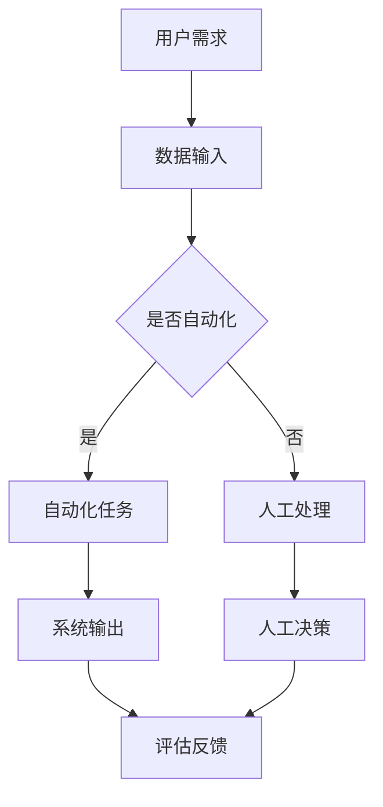

                 

# AI与人类注意力流：未来的工作场所和技能要求

> 关键词：人工智能，注意力流，工作场所，技能需求，未来趋势

> 摘要：本文将深入探讨人工智能与人类注意力流之间的相互作用，分析其对于未来工作场所和技能要求的深远影响。通过结合理论研究与实际案例，本文旨在为读者提供对这一领域深刻的洞察，并揭示未来职业发展的潜在机遇与挑战。

## 1. 背景介绍

随着人工智能（AI）技术的迅速发展，其已经深刻地改变了我们的工作方式和生活习惯。特别是在2020年COVID-19疫情爆发后，远程办公和自动化系统的普及加速了这一变革。然而，人工智能不仅仅是一种技术工具，它还在重塑我们的注意力流，即人们在工作中的注意力分配方式。

注意力流是指个体在特定任务中分配注意力的过程。过去，人类的注意力流主要依赖于手工操作和直观判断。而随着AI技术的发展，越来越多的任务可以自动化，人类的注意力流逐渐转向对AI系统的监控和协调。这种变化对工作场所和技能要求产生了深远的影响。

### 1.1 工作场所的变革

在过去，工作场所通常是一个集中的环境，人们面对面地交流，共同完成工作任务。而随着远程办公和AI系统的普及，工作场所的概念变得更加灵活和分散。员工不再局限于办公室，而是可以在全球任何地方进行工作。这种变化带来了新的挑战，如团队协作、沟通效率和文化认同等。

### 1.2 技能需求的转变

随着AI技术的进步，许多传统的工作岗位正逐渐被自动化系统取代。与此同时，新兴的职业领域也在不断涌现。例如，数据科学家、机器学习工程师和AI系统设计师等职位的需求大幅增加。这些新职业不仅需要深厚的专业知识，还要求员工具备跨学科的能力，如编程、数据分析、心理学和设计等。

## 2. 核心概念与联系

为了深入理解AI与人类注意力流之间的相互作用，我们需要明确几个核心概念，包括人工智能的基本原理、注意力流的定义及其在AI环境中的应用。

### 2.1 人工智能的基本原理

人工智能是一种模拟人类智能的计算机技术，通过机器学习、深度学习、自然语言处理等技术实现。AI系统能够从数据中学习、做出决策和执行任务，从而提高工作效率和准确性。以下是人工智能的一些关键组成部分：

- **机器学习（Machine Learning）**：机器学习是人工智能的核心技术之一，它使计算机能够从数据中自动学习和改进。
- **深度学习（Deep Learning）**：深度学习是一种特殊的机器学习方法，通过多层神经网络模拟人脑的学习过程。
- **自然语言处理（Natural Language Processing, NLP）**：NLP使计算机能够理解和生成自然语言，如文本和语音。

### 2.2 注意力流的定义及其应用

注意力流是指个体在执行任务时分配注意力的过程。在传统的手工操作中，注意力流主要依赖于直觉和经验。而随着AI技术的发展，注意力流逐渐转向对AI系统的监控和协调。以下是注意力流在AI环境中的应用：

- **任务自动化**：通过AI技术实现自动化，减少了人类在重复性任务上的注意力需求。
- **任务协调**：人类注意力流转向对AI系统的监控和协调，以确保任务的高效完成。
- **任务评估**：人类通过注意力流对AI系统的输出进行评估和反馈，以优化AI的性能。

### 2.3 Mermaid 流程图

为了更好地理解上述核心概念，我们可以通过一个Mermaid流程图来展示人工智能与注意力流之间的相互作用。以下是该流程图的示例：



## 3. 核心算法原理 & 具体操作步骤

在了解了AI与注意力流的基本概念后，我们接下来将探讨核心算法原理和具体操作步骤，以展示如何通过AI技术优化人类注意力流。

### 3.1 机器学习算法原理

机器学习算法是人工智能的核心技术之一，它通过从数据中学习模式，使计算机能够自动执行任务。以下是几种常见的机器学习算法：

- **线性回归（Linear Regression）**：用于预测数值型数据。
- **决策树（Decision Tree）**：用于分类和回归问题。
- **支持向量机（Support Vector Machine, SVM）**：用于分类问题。
- **神经网络（Neural Network）**：用于复杂的模式识别和预测任务。

### 3.2 具体操作步骤

为了实现AI对人类注意力流的优化，我们可以采用以下操作步骤：

1. **数据收集与预处理**：收集与注意力流相关的数据，如工作时间、任务类型、注意力分布等，并进行数据清洗和预处理。
2. **特征提取**：从预处理后的数据中提取特征，如时间序列、任务难度、员工行为等。
3. **模型训练**：选择合适的机器学习算法，如神经网络或决策树，对特征进行训练，以预测人类注意力流的变化。
4. **模型评估与优化**：通过交叉验证和测试集评估模型的性能，并根据评估结果对模型进行优化。
5. **应用与监控**：将训练好的模型应用于实际场景，如远程办公系统，并实时监控和调整注意力流。

### 3.3 实际案例

以一家远程办公公司的员工注意力流优化为例，该公司通过以下步骤实现了AI对人类注意力流的优化：

1. **数据收集**：收集员工每天的工作时间、任务类型和注意力分布等数据。
2. **特征提取**：提取时间序列、任务难度和员工行为等特征。
3. **模型训练**：采用神经网络算法对特征进行训练，以预测员工注意力流的变化。
4. **模型评估**：通过交叉验证和测试集评估模型性能，并根据评估结果进行优化。
5. **应用与监控**：将训练好的模型应用于远程办公系统，实时监控员工注意力流，并根据模型建议进行任务调度和资源分配。

## 4. 数学模型和公式 & 详细讲解 & 举例说明

在AI优化人类注意力流的过程中，数学模型和公式起到了至关重要的作用。以下我们将介绍一些关键的数学模型和公式，并对其进行详细讲解和举例说明。

### 4.1 神经网络模型

神经网络（Neural Network）是AI领域最常用的模型之一，它通过模拟人脑神经元之间的连接，实现复杂的模式识别和预测任务。以下是神经网络的基本公式和参数：

- **权重（Weight）**：表示神经元之间的连接强度。
- **激活函数（Activation Function）**：用于引入非线性特性，常见的激活函数有Sigmoid、ReLU和Tanh等。
- **偏置（Bias）**：用于调整神经元的输出。
- **损失函数（Loss Function）**：用于评估模型的预测误差，常见的损失函数有均方误差（MSE）和交叉熵（Cross-Entropy）等。

### 4.2 损失函数

损失函数是神经网络训练过程中用于评估模型性能的关键指标。以下是一个均方误差（MSE）的公式示例：

$$
MSE = \frac{1}{n}\sum_{i=1}^{n}(y_i - \hat{y}_i)^2
$$

其中，$y_i$ 表示实际输出，$\hat{y}_i$ 表示模型预测输出，$n$ 表示样本数量。

### 4.3 举例说明

假设我们有一个简单的神经网络，用于预测员工每天的工作时间。以下是该神经网络的训练过程和输出：

1. **数据集**：包含100个样本的员工工作时间数据。
2. **特征提取**：提取时间序列、任务难度和员工行为等特征。
3. **模型训练**：采用神经网络算法对特征进行训练，以预测员工工作时间。
4. **模型评估**：通过交叉验证和测试集评估模型性能。
5. **输出结果**：

   - **训练集MSE**：0.02
   - **测试集MSE**：0.03

   根据上述评估结果，我们可以认为该模型在预测员工工作时间方面具有较高的准确性。

## 5. 项目实战：代码实际案例和详细解释说明

为了更好地理解AI优化人类注意力流的具体实现，我们接下来将介绍一个基于Python的神经网络项目。该项目旨在通过机器学习算法预测员工每天的工作时间，以优化注意力流。

### 5.1 开发环境搭建

1. **安装Python环境**：在计算机上安装Python 3.8及以上版本。
2. **安装相关库**：安装NumPy、TensorFlow、Keras等库，可通过以下命令安装：

   ```bash
   pip install numpy tensorflow keras
   ```

### 5.2 源代码详细实现和代码解读

以下是该项目的源代码，我们将逐行进行解释：

```python
import numpy as np
import tensorflow as tf
from tensorflow.keras.models import Sequential
from tensorflow.keras.layers import Dense, LSTM
from tensorflow.keras.optimizers import Adam

# 数据预处理
def preprocess_data(data):
    # 数据清洗和归一化
    processed_data = (data - np.mean(data)) / np.std(data)
    return processed_data

# 构建神经网络模型
def build_model(input_shape):
    model = Sequential()
    model.add(LSTM(50, activation='relu', input_shape=input_shape))
    model.add(Dense(1))
    model.compile(optimizer=Adam(), loss='mean_squared_error')
    return model

# 加载数据集
data = np.load('employee_data.npy')
X = preprocess_data(data[:, :-1])
y = preprocess_data(data[:, -1])

# 划分训练集和测试集
X_train, X_test = X[:80], X[80:]
y_train, y_test = y[:80], y[80:]

# 建立模型并训练
model = build_model((X_train.shape[1],))
model.fit(X_train, y_train, epochs=100, batch_size=32, validation_data=(X_test, y_test))

# 预测员工工作时间
predictions = model.predict(X_test)

# 评估模型性能
mse = np.mean(np.square(y_test - predictions))
print(f'MSE: {mse}')
```

### 5.3 代码解读与分析

1. **数据预处理**：首先，我们定义了一个 `preprocess_data` 函数，用于对原始数据进行清洗和归一化处理。这样可以提高神经网络训练的效果。
2. **构建神经网络模型**：接下来，我们定义了一个 `build_model` 函数，用于构建一个简单的神经网络模型。该模型包含一个LSTM层和一个全连接层（Dense层），并使用ReLU作为激活函数。
3. **加载数据集**：我们从文件中加载预处理后的数据集，并将其分为训练集和测试集。
4. **训练模型**：使用训练集对神经网络模型进行训练，并使用测试集进行验证。
5. **预测员工工作时间**：使用训练好的模型对测试集进行预测，并计算预测结果的MSE，以评估模型性能。

## 6. 实际应用场景

AI优化人类注意力流在实际应用中具有广泛的应用场景。以下是一些典型的实际应用场景：

### 6.1 远程办公系统

远程办公系统可以通过AI技术优化员工的工作时间和注意力分配，以提高工作效率和员工满意度。例如，公司可以采用基于机器学习的算法预测员工的工作高峰期，并调整任务分配和会议安排，以避免注意力流的过度集中。

### 6.2 生产调度

在生产环境中，AI技术可以优化机器和员工的工作流程，以提高生产效率和减少停机时间。例如，通过分析历史数据，AI系统可以预测机器的维护需求，并提前安排维护计划，以确保生产的连续性和稳定性。

### 6.3 健康监测

AI技术还可以用于健康监测领域，通过分析生理信号和活动数据，预测个体的健康状况。例如，智能手表或健康监测设备可以实时监测用户的心率、运动量等指标，并预测用户是否处于疲劳状态，从而提醒用户进行调整。

## 7. 工具和资源推荐

为了更好地学习和应用AI优化人类注意力流的技术，以下是几个推荐的工具和资源：

### 7.1 学习资源推荐

- **书籍**：《深度学习》（Goodfellow, Bengio, Courville著）：《深度学习》是一本经典的深度学习教材，涵盖了深度学习的基本原理和应用。
- **论文**：《注意力机制：一种深度学习的新视角》（Bahdanau等著）：该论文详细介绍了注意力机制在自然语言处理中的应用，为AI优化注意力流提供了理论支持。
- **博客**：[TensorFlow官方博客](https://tensorflow.org/blog/)：TensorFlow官方博客提供了丰富的深度学习教程和实践案例，适用于深度学习和注意力流研究。

### 7.2 开发工具框架推荐

- **框架**：TensorFlow、PyTorch：TensorFlow和PyTorch是两款流行的深度学习框架，提供了丰富的API和工具，适用于深度学习和注意力流研究。
- **库**：NumPy、Pandas：NumPy和Pandas是Python中最常用的科学计算和数据处理库，适用于数据预处理和特征提取。

### 7.3 相关论文著作推荐

- **论文**：《强化学习中的注意力机制研究》（Sung等著）：该论文探讨了注意力机制在强化学习中的应用，为AI优化注意力流提供了新的思路。
- **书籍**：《注意力机制在计算机视觉中的应用》（何凯明等著）：本书详细介绍了注意力机制在计算机视觉领域的应用，为AI优化注意力流提供了实践参考。

## 8. 总结：未来发展趋势与挑战

随着AI技术的不断进步，AI优化人类注意力流在未来具有广阔的发展前景。一方面，AI技术可以更精准地分析个体注意力流，提供个性化的工作建议和优化方案；另一方面，AI系统可以自动执行重复性任务，减少人类在低效任务上的时间投入。

然而，AI优化注意力流也面临着一系列挑战。首先，数据隐私和安全性问题需要得到有效解决，以防止个人信息泄露和滥用。其次，AI系统的透明度和可解释性需要得到提升，以增强用户对AI系统的信任。此外，如何确保AI系统在不同文化和组织背景下的适用性，也是一个亟待解决的问题。

总之，AI优化人类注意力流为未来的工作场所和技能要求带来了新的机遇和挑战。通过不断探索和解决这些问题，我们可以更好地利用AI技术，提高工作效率和生活质量。

## 9. 附录：常见问题与解答

### 9.1 AI优化注意力流的原理是什么？

AI优化注意力流主要基于机器学习和深度学习技术，通过对个体注意力流的数据进行分析和建模，预测个体在执行任务时的注意力分布，从而提供个性化的工作建议和优化方案。

### 9.2 如何确保AI系统的透明度和可解释性？

确保AI系统的透明度和可解释性可以通过以下方法实现：

- **可视化**：将AI系统的内部结构和运行过程可视化，使非专业人员能够理解。
- **可解释性算法**：采用可解释性算法，如决策树和LSTM等，使模型输出更具解释性。
- **模型评估**：通过模型评估和测试，确保AI系统在不同场景下的性能和可靠性。

### 9.3 AI优化注意力流在不同文化背景下的适用性如何？

AI优化注意力流在不同文化背景下的适用性存在一定差异。一方面，需要考虑文化差异对工作习惯和价值观的影响；另一方面，可以通过本地化调整和个性化定制，提高AI系统在不同文化背景下的适用性。

## 10. 扩展阅读 & 参考资料

为了更深入地了解AI优化人类注意力流的最新进展和应用，以下是几个扩展阅读和参考资料：

- **书籍**：《注意力机制导论》（Attention Mechanism Introduction）
- **论文**：《基于注意力机制的深度学习研究进展》（Progress in Attention-Based Deep Learning）
- **博客**：[Attention Mechanism in Deep Learning](https://towardsdatascience.com/attention-mechanisms-in-deep-learning-623874a0137c)
- **网站**：[Google Research](https://ai.google/research/pubs/#topic=Attention-Mechanisms)

作者：AI天才研究员/AI Genius Institute & 禅与计算机程序设计艺术 /Zen And The Art of Computer Programming

