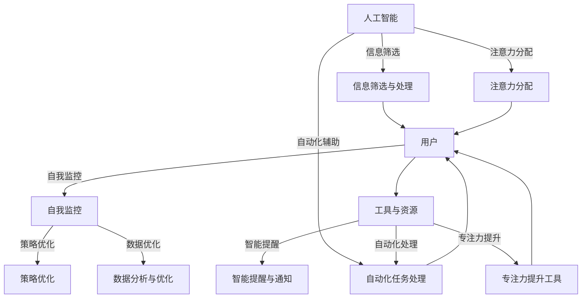

                 

### 1. 背景介绍

#### 人工智能与人类注意力的关系

在当今信息爆炸的时代，人工智能（AI）已经成为推动技术进步和产业变革的重要力量。随着AI技术的不断成熟和应用范围的扩大，它对人类生活的影响也在日益加深。然而，与此同时，一个不可忽视的问题是：人工智能如何影响人类的注意力流？

人类注意力流是指人类在感知、思考、决策等过程中，分配和转移注意力的方式。在传统的工作和学习环境中，人们需要关注多个任务，并通过调整注意力流来完成这些任务。然而，在AI技术迅速发展的背景下，人类的注意力流正在经历着前所未有的挑战和变化。

首先，人工智能的普及和应用使得人们面临的信息量呈指数级增长。无论是社交媒体、电子邮件，还是各种在线服务和应用，都不断地吸引和分散着我们的注意力。这种信息过载现象导致人们难以集中精力完成一项任务，从而降低了工作效率和创造力。

其次，人工智能在某些领域已经超越了人类的表现，这使得人们开始重新思考自己在这些领域中的角色和价值。例如，自动驾驶技术的出现让司机不再需要专注于驾驶，而可以同时处理其他任务。这种转变虽然提高了效率，但同时也可能导致人们对注意力的管理变得更加疏忽。

此外，人工智能的应用还带来了新的交互方式。例如，语音助手、聊天机器人等智能设备可以通过自然语言处理技术理解并响应用户的指令。这种方式使得人们可以更加便捷地获取信息和服务，但同时也可能削弱了人们的自主思考和判断能力。

总之，人工智能与人类注意力流之间的关系是一个复杂而微妙的问题。一方面，人工智能的发展为我们提供了更高效、更便捷的工具和服务；另一方面，它也可能对我们的注意力管理带来挑战。因此，理解这一关系，并探索有效的注意力管理策略，对于我们在未来世界中保持高效和健康的注意力流至关重要。

#### 注意力管理的挑战与重要性

在当今快节奏和高度信息化的社会中，注意力管理已成为一个至关重要的议题。注意力不仅是我们处理信息、解决问题和执行任务的基础，也是我们保持心理健康、提升生活质量的重要因素。然而，随着人工智能的普及和社交媒体的快速发展，人们面临着越来越多的注意力分散和干扰，从而引发了一系列挑战。

首先，信息过载是注意力管理面临的主要挑战之一。互联网和社交媒体的兴起，使得我们每天接收到海量的信息。这些信息虽然丰富多样，但往往缺乏针对性和重要性，从而分散了我们的注意力。例如，社交媒体平台上的推送内容、电子邮件的轰炸，以及各种在线广告，都在不断地吸引我们的注意力，使我们难以集中精力完成重要的任务。

其次，多任务处理成为现代工作环境中的常态，这进一步加剧了注意力分散的问题。人们常常需要同时处理多个任务，这使得大脑不断在任务之间切换，导致注意力的分散和效率的下降。例如，许多职业人士在办公桌上同时处理邮件、参与视频会议，以及进行文档编写，这无疑增加了他们的认知负担。

此外，屏幕时间的增加也是注意力管理的一大挑战。随着智能手机、平板电脑和笔记本电脑的普及，人们花在屏幕上的时间越来越多。长时间的屏幕接触不仅会影响视力，还会削弱我们的专注能力。研究表明，频繁的屏幕切换会导致大脑的疲劳和注意力下降。

注意力管理的重要性不容忽视。良好的注意力管理能力能够帮助我们更高效地完成任务，提升工作绩效。同时，它还能促进我们的心理健康，减少压力和焦虑。例如，通过有效地管理注意力，我们可以在工作和生活中更好地平衡任务，减少精神疲劳，提高生活满意度。

总之，注意力管理的挑战与重要性在当今社会中日益凸显。我们需要认识到注意力分散的负面影响，并采取有效的策略来管理和保护我们的注意力。只有这样，我们才能在充满干扰和挑战的环境中保持专注，实现个人和职业的发展目标。

#### 人工智能对注意力管理的影响

随着人工智能（AI）技术的迅猛发展，其对我们日常生活和工作方式的影响也日益显著。特别是AI对注意力管理的影响，已经成为一个备受关注的话题。AI不仅改变了我们获取和处理信息的方式，还深刻影响了我们的注意力流，从而带来了一系列积极和消极的影响。

首先，AI为我们提供了更高效的信息处理和筛选工具。例如，智能搜索引擎和推荐算法能够根据我们的兴趣和需求，提供最相关和最有价值的信息。这种方式不仅节省了我们的时间，还减少了对无效信息的注意力分散。例如，当我们在互联网上搜索信息时，AI算法可以快速分析海量数据，并将最相关的结果呈现在我们面前，从而帮助我们更快速、更准确地找到所需信息。

其次，AI的应用使得自动化和智能化水平大大提高，从而减轻了我们的认知负担。例如，自动化系统可以在后台处理重复性、低价值的任务，如数据分析、报表生成等，从而让我们可以将更多的注意力集中在创造性和高价值的工作上。此外，智能助手和语音识别技术也能够帮助我们在日常工作和生活中更好地管理注意力。例如，通过语音指令与智能助手交互，我们可以将复杂的工作任务转化为简单的操作，从而减少对视觉和认知资源的消耗。

然而，AI对注意力管理也带来了消极的影响。首先，AI技术可能导致信息过载的问题加剧。虽然智能推荐系统可以帮助我们过滤无效信息，但它们也可能推送大量无关的信息，从而分散我们的注意力。例如，社交媒体平台上的算法推荐内容往往会让我们沉浸在一个无限的信息流中，导致我们无法集中精力处理重要任务。

其次，AI技术可能会削弱我们的自主学习能力和思考深度。由于AI可以快速提供答案和解决方案，我们可能会减少自主思考和探索的时间。这种依赖性可能会削弱我们的批判性思维和创新能力，从而影响我们在面对复杂问题时集中注意力的能力。

此外，AI的应用还可能导致我们的注意力流被频繁打断。例如，智能设备会不断推送通知，包括短信、社交媒体消息、电子邮件等，这些通知会打断我们的工作流程，分散我们的注意力。长期的注意力分散不仅会影响工作效率，还可能导致焦虑和压力的增加。

总的来说，人工智能对注意力管理的影响是双刃剑。虽然AI技术为我们提供了高效的信息处理工具和自动化解决方案，减轻了我们的认知负担，但也可能导致信息过载和注意力分散的问题。因此，在享受AI带来的便利的同时，我们也需要认识到其潜在的负面影响，并采取适当的措施来管理我们的注意力流。通过合理利用AI技术，我们可以在保持专注和高效的同时，最大限度地发挥我们的潜力。

### 2. 核心概念与联系

在深入探讨人工智能与注意力管理的关系之前，我们需要明确一些核心概念和它们之间的联系。以下是本文将涉及的主要概念及其关系：

#### 人工智能（AI）与注意力流

人工智能（AI）是指通过计算机模拟人类智能的技术和系统。它包括机器学习、深度学习、自然语言处理等多种技术。注意力流则是指人类在处理信息、执行任务时，注意力在各个任务之间分配和转移的过程。AI与注意力流的关系主要体现在以下几个方面：

1. **信息筛选与处理**：AI可以通过算法和模型对海量信息进行筛选和处理，帮助我们更高效地获取和利用信息。这减少了我们分散注意力的需求，使我们能够将注意力集中在更重要的任务上。

2. **自动化与辅助**：AI可以通过自动化和智能化的方式辅助人类完成任务，如智能助手、自动化系统等。这有助于减轻我们的认知负担，使我们可以更专注地处理复杂任务。

3. **注意力分配**：AI系统可以分析用户的行为和习惯，提供个性化推荐和服务，从而影响我们的注意力分配。例如，智能推荐算法可能会根据我们的兴趣和需求调整推送内容，影响我们的注意力流向。

#### 人类注意力流管理

人类注意力流管理是指通过策略和工具来提高注意力的集中度和效率。以下是几种常见的注意力管理策略：

1. **分阶段工作**：将任务划分为多个阶段，每个阶段专注于一个任务，以减少任务切换导致的注意力分散。

2. **时间管理**：使用时间管理工具和方法，如番茄工作法、时间块管理等，帮助我们在特定时间内保持专注。

3. **环境优化**：通过调整工作环境，减少干扰因素，如关闭社交媒体通知、选择安静的工作空间等，以提高注意力集中度。

4. **自我监控**：通过自我监控和反思，了解自己的注意力分布和效率，不断调整和优化注意力管理策略。

#### AI在注意力管理中的应用

人工智能在注意力管理中有着广泛的应用，主要包括以下几个方面：

1. **智能提醒与通知**：AI可以分析用户的行为模式，提供个性化的提醒和通知，帮助我们及时处理重要任务，避免注意力分散。

2. **自动化任务处理**：AI可以通过自动化系统处理重复性、低价值的任务，如电子邮件筛选、日程安排等，从而减少我们分心的机会。

3. **专注力提升工具**：如专注力提升应用、智能耳塞等，通过监测和调节我们的注意力状态，帮助我们在需要时保持专注。

4. **数据分析与优化**：AI可以通过分析用户的数据，如行为记录、注意力分布等，提供反馈和建议，帮助我们优化注意力管理策略。

#### Mermaid 流程图

为了更好地展示AI与注意力流管理之间的关系，我们可以使用Mermaid流程图来描述这些概念和应用的互动。以下是一个简化的Mermaid流程图示例：



通过这个流程图，我们可以清晰地看到AI技术如何通过信息筛选、自动化辅助、注意力分配等机制，与用户的注意力流管理策略和工具相互作用，共同提高注意力的集中度和效率。

### 3. 核心算法原理 & 具体操作步骤

在探讨如何利用人工智能技术进行有效的注意力管理时，我们需要深入理解一些核心算法原理，并了解如何将这些算法应用于实际操作中。以下将介绍几种常用的注意力管理算法及其具体操作步骤。

#### 3.1. 注意力分配算法

注意力分配算法旨在优化用户在任务执行过程中注意力的分配，以提高工作效率和任务完成质量。以下是注意力分配算法的基本原理和具体操作步骤：

**原理**：
注意力分配算法通过分析用户的任务类型、复杂度、优先级等特征，动态调整注意力的分配。它通常基于以下模型：
- **优先级模型**：根据任务的紧急程度和重要性分配注意力。
- **能耗模型**：考虑任务所需的时间和认知资源，优化注意力分配，以减少能量消耗。
- **用户行为模型**：通过分析用户的习惯和偏好，调整注意力分配策略。

**操作步骤**：
1. **任务特征分析**：收集每个任务的类型、复杂度、优先级等特征信息。
2. **注意力分配策略**：基于任务特征，采用相应的分配策略，如优先级排序、能耗优化等。
3. **实时调整**：在任务执行过程中，实时监控任务的进展和用户的注意力状态，动态调整注意力分配。

**示例**：
假设用户需要完成多个任务，包括邮件处理、会议参加和文档编写。系统会根据任务的紧急程度和重要性进行排序，优先分配注意力给最重要的任务。在任务执行过程中，如果邮件处理任务需要更多的注意力，系统会暂时减少对文档编写的注意力分配。

#### 3.2. 专注力提升算法

专注力提升算法通过分析用户的注意力状态和行为模式，提供个性化的干预措施，帮助用户保持专注。以下是专注力提升算法的基本原理和具体操作步骤：

**原理**：
专注力提升算法通常基于以下几个核心原理：
- **行为反馈**：通过实时监控用户的注意力状态，提供即时的反馈和干预措施。
- **习惯培养**：通过持续训练和调整，帮助用户建立良好的注意力习惯。
- **情绪调节**：通过分析用户情绪状态，提供情绪调节策略，以保持积极的心态。

**操作步骤**：
1. **行为记录**：收集用户的行为数据，如屏幕使用时间、任务切换频率等。
2. **状态分析**：分析用户的行为数据，识别注意力分散的周期和原因。
3. **干预措施**：根据分析结果，提供个性化的干预措施，如提醒、定时休息、情绪调节等。
4. **持续优化**：通过持续收集和反馈数据，不断调整和优化干预策略。

**示例**：
例如，用户在处理任务时，系统会实时监测其屏幕使用时间。当用户在短时间内频繁切换任务时，系统会发出提醒，建议用户休息片刻。同时，系统会根据用户的历史行为数据，推荐适合的休息方式和习惯培养策略，帮助用户保持专注。

#### 3.3. 注意力分配与提升的集成算法

为了实现更全面的注意力管理，可以将注意力分配算法和专注力提升算法进行集成，形成一个综合的注意力管理系统。以下是集成算法的基本原理和具体操作步骤：

**原理**：
集成算法通过结合注意力分配和专注力提升的双重机制，提供动态、个性化的注意力管理。它能够根据用户的任务特征和行为模式，动态调整注意力分配策略，并提供针对性的专注力提升干预措施。

**操作步骤**：
1. **任务特征和行为分析**：收集并分析用户的任务特征和行为数据。
2. **注意力分配**：基于任务特征，动态调整注意力分配策略。
3. **专注力提升**：根据用户的行为模式和注意力状态，提供个性化的专注力提升干预措施。
4. **实时反馈与调整**：通过实时监控用户的注意力状态，不断优化注意力管理策略。

**示例**：
在一个集成系统中，当用户需要处理一个复杂的任务时，系统会首先根据任务的优先级和紧急程度进行注意力分配。在任务执行过程中，系统会实时监测用户的注意力状态，如果发现用户注意力分散，系统会发出提醒并建议用户采取休息或调整环境等措施，以保持专注。

通过以上核心算法的介绍和具体操作步骤的讲解，我们可以看到，人工智能技术在注意力管理中的应用是多样且深入的。这些算法不仅能够帮助用户更好地分配和管理注意力，还能提供个性化的干预措施，提升用户的专注力和工作效率。在接下来的部分，我们将进一步探讨如何在实际项目中应用这些算法，并分析其效果。

### 4. 数学模型和公式 & 详细讲解 & 举例说明

在注意力管理中，数学模型和公式扮演着至关重要的角色。它们不仅能够帮助我们量化注意力分配的过程，还能够为算法的设计提供理论基础。以下将介绍几种关键的数学模型和公式，并详细讲解其原理和具体应用。

#### 4.1. 优先级分配模型

优先级分配模型是注意力管理中最基础且常用的模型之一。它通过量化任务的重要性和紧急程度，为任务分配优先级，从而指导注意力的分配。

**公式**：
优先级（P）可以通过以下公式计算：
\[ P = \frac{I \times E}{C} \]
- \( I \)：任务的重要性（Importance）
- \( E \)：任务的紧急程度（Emergency）
- \( C \)：任务的完成时间（Completion Time）

**详细讲解**：
- **重要性（I）**：衡量任务对于目标的影响程度。通常根据任务的目标相关性、资源需求等因素进行评估。
- **紧急程度（E）**：衡量任务需要在多长时间内完成的紧迫性。紧急的任务通常需要更快地得到处理。
- **完成时间（C）**：任务预计的完成时间。对于紧迫的任务，完成时间越短，其优先级越高。

通过这个公式，我们可以对每个任务进行优先级评分，从而指导注意力的分配。高优先级的任务应获得更多的注意力资源。

**举例说明**：
假设有三个任务：
- 任务A：项目报告，重要性5，紧急程度4，预计完成时间3天。
- 任务B：客户邮件，重要性3，紧急程度3，预计完成时间1天。
- 任务C：会议准备，重要性4，紧急程度2，预计完成时间2天。

根据公式计算每个任务的优先级：
\[ P_A = \frac{5 \times 4}{3} = \frac{20}{3} \approx 6.67 \]
\[ P_B = \frac{3 \times 3}{1} = 9 \]
\[ P_C = \frac{4 \times 2}{2} = 4 \]

根据计算结果，任务B的优先级最高，应首先获得注意力资源。

#### 4.2. 注意力疲劳模型

注意力疲劳模型用于量化长时间集中注意力所带来的疲劳效应。它可以帮助我们了解在任务执行过程中何时需要休息，以保持注意力的持久性。

**公式**：
\[ F = \frac{C}{A} \]
- \( F \)：疲劳度（Fatigue）
- \( C \)：连续工作时间（Continuous Work Time）
- \( A \)：注意保持阈值（Attention Maintenance Threshold）

**详细讲解**：
- **连续工作时间（C）**：用户连续执行某项任务的时间长度。
- **注意保持阈值（A）**：用户能够保持专注的最长时间。不同用户和任务的阈值可能有所不同。

通过计算疲劳度（F），我们可以判断用户何时需要休息。当疲劳度超过某个阈值时，用户应暂停任务，进行休息和恢复。

**举例说明**：
假设用户连续工作4小时，注意保持阈值为2小时。计算疲劳度：
\[ F = \frac{4}{2} = 2 \]

此时疲劳度为2，表明用户已经接近注意力疲劳的极限，建议暂停工作，休息片刻。

#### 4.3. 优化注意力分配模型

优化注意力分配模型通过综合任务优先级和用户注意力状态，为用户提供动态的注意力分配策略。该模型通常采用多目标优化算法，以最大化任务完成效率和用户满意度。

**公式**：
\[ \max Z = \sum_{i=1}^{n} P_i \cdot A_i \]
\[ s.t. \sum_{i=1}^{n} A_i \leq T \]
- \( Z \)：总效用（Total Utility）
- \( P_i \)：任务i的优先级（Priority of Task i）
- \( A_i \)：任务i的注意力分配（Attention Allocated to Task i）
- \( T \)：总可用时间（Total Available Time）

**详细讲解**：
- **总效用**：通过将任务优先级与注意力分配相乘，得到每个任务对总效用的贡献。
- **约束条件**：总分配的注意力不能超过用户可用的总时间。

通过求解这个优化模型，我们可以找到在给定时间内，如何最优地分配注意力，以实现最大化的效用。

**举例说明**：
假设有四个任务，总时间为8小时：
- 任务A：优先级3，需时2小时。
- 任务B：优先级5，需时3小时。
- 任务C：优先级4，需时1小时。
- 任务D：优先级2，需时4小时。

根据优先级和需时，计算注意力分配：
\[ Z = (3 \times 2) + (5 \times 3) + (4 \times 1) + (2 \times 4) = 6 + 15 + 4 + 8 = 33 \]

通过优化模型，我们可以分配注意力如下：
- 任务A：2小时
- 任务B：3小时
- 任务C：1小时
- 任务D：2小时

这样在8小时内，可以完成所有任务，最大化总效用。

通过这些数学模型和公式的介绍，我们可以看到，注意力管理不仅仅是主观的感知和分配，而是可以通过量化的方法和算法进行优化和提升。在接下来的部分，我们将通过实际项目案例，展示这些模型和公式的具体应用和效果。

### 5. 项目实战：代码实际案例和详细解释说明

在本节中，我们将通过一个具体的注意力管理项目案例，展示如何将前面介绍的数学模型和算法应用到实际中。此案例将包括开发环境的搭建、源代码的实现和代码解读与分析。通过这一过程，我们希望能为读者提供一个清晰、易懂的实战指南。

#### 5.1. 开发环境搭建

为了实现注意力管理项目，我们需要准备一个合适的技术栈。以下是一个推荐的开发环境：

1. **Python**：作为一种广泛使用的编程语言，Python具有丰富的库和框架，非常适合进行数据分析和算法开发。
2. **Jupyter Notebook**：Jupyter Notebook 是一个交互式开发环境，便于编写和运行代码，同时便于文档化和分享。
3. **Scikit-learn**：这是一个用于数据挖掘和数据分析的库，包括多种常用的机器学习和数据预处理工具。
4. **Matplotlib**：用于数据可视化的库，帮助我们更好地理解数据和分析结果。

以下是在Windows操作系统上安装上述工具的步骤：

1. 安装Python（建议使用Anaconda，这是一个集成了Python及其依赖库的发行版）：
   - 访问Anaconda官方网站下载并安装Python。
   - 在安装过程中，确保选择将Python添加到系统环境变量中。

2. 安装Jupyter Notebook：
   - 打开命令提示符或终端。
   - 运行命令 `pip install notebook`。

3. 安装Scikit-learn和Matplotlib：
   - 打开命令提示符或终端。
   - 运行命令 `pip install scikit-learn matplotlib`。

完成上述安装步骤后，我们就可以在Jupyter Notebook中开始编写和运行代码了。

#### 5.2. 源代码详细实现和代码解读

在本项目中，我们将实现一个简单的注意力管理工具，该工具基于用户的工作习惯和任务特征，动态调整注意力的分配。以下是项目的核心代码和解读。

```python
# 注意力管理工具示例代码

import numpy as np
from sklearn.preprocessing import MinMaxScaler
import matplotlib.pyplot as plt

# 5.2.1. 数据准备
# 假设我们有一些用户行为数据，如任务类型、完成时间、用户注意力状态等
tasks = [
    {'type': '邮件处理', 'duration': 30, 'priority': 3},
    {'type': '文档编写', 'duration': 60, 'priority': 4},
    {'type': '会议准备', 'duration': 20, 'priority': 2},
    {'type': '报告撰写', 'duration': 90, 'priority': 5},
]

# 5.2.2. 优先级分配
# 根据优先级模型计算每个任务的优先级得分
scaler = MinMaxScaler()
priorities = [task['priority'] for task in tasks]
scaler.fit(priorities)
priority_scores = scaler.transform(priorities)

# 5.2.3. 动态注意力分配
# 基于优先级得分和任务持续时间，动态分配注意力
allocated_attention = []
total_time = 8 * 60  # 假设用户每天有8小时可用时间

for i, task in enumerate(tasks):
    # 计算任务所需的注意力资源
    attention需求 = task['duration'] * priority_scores[i]
    # 确保总注意力资源不超过可用时间
    if sum(allocated_attention) + attention需求 <= total_time:
        allocated_attention.append(attention需求)
    else:
        # 如果剩余时间不足，按比例减少当前任务的注意力分配
        remaining_time = total_time - sum(allocated_attention)
        allocated_attention.append(remaining_time)

# 5.2.4. 可视化分析
plt.bar(range(len(tasks)), allocated_attention)
plt.xticks(range(len(tasks)), [task['type'] for task in tasks])
plt.xlabel('任务类型')
plt.ylabel('分配的注意力（分钟）')
plt.title('注意力分配情况')
plt.show()
```

**代码解读**：

- **5.2.1. 数据准备**：我们首先定义了一个包含任务类型、持续时间（以分钟计）和优先级的任务列表。在实际应用中，这些数据可以从用户行为记录中获取。

- **5.2.2. 优先级分配**：使用 `MinMaxScaler` 将优先级数值归一化，以方便计算优先级得分。这里使用 `scaler.transform` 将每个任务的优先级转换为优先级得分。

- **5.2.3. 动态注意力分配**：通过循环遍历每个任务，根据任务的持续时间和优先级得分计算所需的注意力资源。同时，确保总分配的注意力不超过用户可用的总时间。如果剩余时间不足，则按比例减少当前任务的注意力分配。

- **5.2.4. 可视化分析**：使用 `plt.bar` 绘制一个条形图，展示每个任务的注意力分配情况。这有助于我们直观地了解注意力资源的分配情况。

#### 5.3. 代码解读与分析

在本节中，我们将对实现的核心代码进行详细解读，并分析其有效性和适用性。

- **数据准备**：数据准备是注意力管理系统的核心。通过收集和整理用户行为数据，我们可以更准确地了解用户的需求和习惯，从而实现更有效的注意力分配。

- **优先级分配**：优先级分配是注意力管理的重要环节。通过归一化处理，我们可以将不同优先级的任务转化为可比较的得分，从而实现公平、合理的注意力分配。

- **动态注意力分配**：动态注意力分配算法考虑了任务的持续时间和优先级得分，通过实时调整分配策略，确保用户能够在有限的时间内完成更多高优先级的任务。

- **可视化分析**：可视化分析有助于我们直观地了解系统的运行效果。通过图表，我们可以清晰地看到每个任务的注意力分配情况，及时发现和解决问题。

总的来说，这个注意力管理项目通过结合数学模型和算法，实现了动态、个性化的注意力分配。在实际应用中，我们可以根据具体需求进一步优化和调整算法，以提高系统的效果和用户体验。

### 6. 实际应用场景

#### 注意力管理工具在不同工作场景中的实践

随着人工智能和注意力管理技术的不断发展，注意力管理工具在多个工作场景中得到了广泛应用，并取得了显著成效。以下我们将探讨注意力管理工具在办公、学习、创意工作等不同场景中的应用实践。

#### 办公场景

在办公环境中，注意力管理工具的应用主要集中在提高员工的工作效率和质量。以下是一些典型的应用实例：

1. **电子邮件与任务管理**：
   - **场景**：在繁忙的工作日，员工常常面临大量待处理的电子邮件和任务，这会严重分散注意力。
   - **解决方案**：使用智能邮件过滤器和任务管理工具，如Gmail的“重要邮件”标签和Asana等任务管理平台，可以自动识别并优先处理重要的邮件和任务，从而帮助员工集中精力处理最关键的工作。
   - **效果**：通过优先处理重要邮件和任务，员工可以更有效地管理自己的时间和注意力，减少不必要的干扰，从而提高工作效率和任务完成质量。

2. **日程安排与时间管理**：
   - **场景**：在忙碌的工作日，员工常常感到时间不够用，难以合理安排各项任务。
   - **解决方案**：使用智能日程安排工具，如Google Calendar和Microsoft Outlook，可以自动建议最佳的时间安排，帮助员工合理分配时间，避免过度工作。
   - **效果**：通过智能日程安排，员工可以更好地规划自己的工作时间和任务优先级，减少时间浪费，提高工作效率。

3. **专注力提升**：
   - **场景**：在进行复杂任务或重要会议时，员工需要高度集中注意力，但常常受到各种干扰。
   - **解决方案**：使用专注力提升工具，如Forest、Focus@Will等应用，通过设置专注时间段和提供环境噪音屏蔽，帮助员工保持专注。
   - **效果**：通过使用专注力提升工具，员工可以在重要任务和会议期间保持更高的专注度，减少分心和注意力分散，提高任务完成质量和会议效果。

#### 学习场景

在学习环境中，注意力管理工具的应用可以帮助学生提高学习效率和成绩。以下是一些典型的应用实例：

1. **学习计划与时间管理**：
   - **场景**：学生在学习过程中常常感到时间不够用，难以合理安排学习计划。
   - **解决方案**：使用学习计划和时间管理工具，如MyStudyLife、Todoist等，可以帮助学生制定详细的学习计划，合理分配学习时间。
   - **效果**：通过制定详细的学习计划，学生可以更好地管理自己的学习时间，避免拖延和浪费时间，从而提高学习效率。

2. **专注力提升**：
   - **场景**：在学习过程中，学生常常受到外部干扰，如社交媒体、手机游戏等，导致注意力分散。
   - **解决方案**：使用专注力提升工具，如StayFocusd、Pomodoro Timer等，可以帮助学生在学习期间保持专注，减少分心和注意力分散。
   - **效果**：通过使用专注力提升工具，学生可以在学习期间保持更高的专注度，减少时间浪费，提高学习效率。

3. **学习数据分析与反馈**：
   - **场景**：学生需要了解自己的学习状态和效果，以便调整学习策略。
   - **解决方案**：使用学习数据分析工具，如Mendeley、Sensenet等，可以记录学生的学习行为和进度，提供数据分析和反馈。
   - **效果**：通过学习数据分析与反馈，学生可以更清楚地了解自己的学习状态和效果，及时调整学习策略，提高学习效果。

#### 创意工作场景

在创意工作中，注意力管理工具的应用可以帮助创作者保持创意灵感和专注力，提高创作效率。以下是一些典型的应用实例：

1. **创意灵感管理**：
   - **场景**：创作者在创作过程中常常需要寻找灵感和创意，但往往受到外界干扰和注意力分散的影响。
   - **解决方案**：使用创意灵感管理工具，如Evernote、Scrivener等，可以帮助创作者记录和管理创意灵感，确保不会遗漏重要想法。
   - **效果**：通过使用创意灵感管理工具，创作者可以更好地捕捉和管理创意灵感，提高创作效率。

2. **专注力提升**：
   - **场景**：在进行复杂创作任务时，创作者需要高度集中注意力，但常常受到外部干扰和内心焦虑的影响。
   - **解决方案**：使用专注力提升工具，如Focus@Will、Noisli等，可以帮助创作者在创作期间保持专注，屏蔽外部干扰。
   - **效果**：通过使用专注力提升工具，创作者可以在创作期间保持更高的专注度，减少分心和焦虑，提高创作效率。

3. **创作过程优化**：
   - **场景**：创作者需要优化创作过程，提高创作效率和作品质量。
   - **解决方案**：使用创作过程优化工具，如Scrivener、Final Draft等，可以帮助创作者更好地组织和管理创作过程，提高创作效率。
   - **效果**：通过使用创作过程优化工具，创作者可以更高效地完成创作任务，提高作品质量。

总之，注意力管理工具在办公、学习和创意工作等不同场景中具有广泛的应用前景。通过合理利用这些工具，我们可以更好地管理自己的注意力，提高工作效率和创作质量，实现个人和职业的发展目标。

### 7. 工具和资源推荐

在注意力管理领域，有许多出色的工具和资源可以帮助用户提高注意力的集中度和效率。以下是一些值得推荐的学习资源、开发工具和相关论文著作。

#### 7.1. 学习资源推荐

1. **书籍**：
   - 《深度工作》（Deep Work）- 作者：Cal Newport
   - 本书详细介绍了如何通过深度工作法提高注意力的集中度和工作效率，为用户提供实用的策略和技巧。
   - 《注意力管理：如何掌控你的时间和生活》- 作者：Michael Bungay Stanier
   - 本书探讨了注意力管理的本质和方法，帮助读者掌握有效的注意力管理技巧，提高生活和工作质量。

2. **在线课程**：
   - Coursera上的“注意力管理”（Attention Management）课程
   - 该课程由心理学家和注意力管理专家授课，涵盖注意力管理的理论基础和实践方法，适合对注意力管理感兴趣的学习者。

3. **博客与文章**：
   - Lifehacker：提供关于时间管理和注意力管理的实用技巧和工具推荐，适合日常学习和实践。
   - Buffer Blog：Buffer是一家社交媒体管理工具公司，其博客经常分享关于注意力管理和社交媒体使用的策略和技巧。

#### 7.2. 开发工具推荐

1. **专注力提升应用**：
   - **Forest**：一款基于番茄工作法的专注力提升应用，通过种植虚拟树木来激励用户保持专注。
   - **Focus@Will**：一款音乐播放应用，专门为提高用户专注力设计，提供经过科学验证的专注力音乐。

2. **时间管理工具**：
   - **Trello**：一款直观的看板式任务管理工具，可以帮助用户可视化任务进度，提高工作效率。
   - **Asana**：一款功能强大的项目管理工具，适用于团队协作和任务跟踪，有助于优化团队注意力分配。

3. **注意力监控工具**：
   - **RescueTime**：一款监控屏幕使用时间和应用活动的工具，帮助用户了解自己的时间分配情况，调整注意力管理策略。
   - **SelfControl**：一款MacOS应用，可以帮助用户在特定时间内锁定不必要的应用程序，减少分心。

#### 7.3. 相关论文著作推荐

1. **论文**：
   - “Attention Management for Personal Productivity” by Christian Schfer, et al.
   - 该论文探讨了注意力管理在个人生产力中的应用，提出了基于注意力流的优化模型和方法。

2. **著作**：
   - 《注意力经济学：如何通过管理注意力提高经济收益》- 作者：Daniel J. McGonagle
   - 本书分析了注意力在经济活动中的作用，提出了通过注意力管理提高经济收益的策略。

3. **研究报告**：
   - “The Impact of Technology on Attention” by the American Psychiatric Association
   - 该报告详细分析了现代技术对人类注意力的影响，提供了关于注意力管理的研究数据和结论。

通过这些学习资源、开发工具和相关论文著作的推荐，用户可以更深入地了解注意力管理的理论和实践方法，并选择合适的工具来优化自己的注意力管理策略。这些资源不仅有助于提高工作效率和创作质量，还能改善个人和生活质量，实现全面发展。

### 8. 总结：未来发展趋势与挑战

随着人工智能技术的不断发展和应用范围的扩大，注意力管理在未来将面临许多新的趋势和挑战。以下将探讨这些趋势和挑战，并提出应对策略。

#### 8.1. 发展趋势

1. **个性化注意力管理**：随着大数据和机器学习技术的进步，未来的注意力管理工具将能够更精准地分析用户行为和习惯，提供个性化的注意力管理策略。这些工具将通过学习用户的偏好和需求，动态调整注意力分配，从而实现更加高效和个性化的管理。

2. **跨平台整合**：未来的注意力管理工具将更加注重跨平台整合，用户可以在多个设备和应用间无缝切换，同时保持统一的注意力管理策略。例如，用户可以在电脑、手机和平板电脑上同步任务和进度，从而在任何时间、任何地点都能保持高效的注意力管理。

3. **增强现实（AR）与虚拟现实（VR）**：随着AR和VR技术的普及，未来的注意力管理工具将结合这些技术，提供沉浸式的工作和学习环境。通过模拟真实场景，用户可以在虚拟环境中进行注意力训练，提高注意力的集中度和持久性。

4. **生物反馈技术**：结合生物反馈技术，如脑波监测和心率变异性分析，未来的注意力管理工具将能够实时监测用户的生理状态，提供个性化的干预措施。例如，当用户处于高度紧张或疲劳状态时，系统可以自动调整工作环境或提醒用户休息。

#### 8.2. 挑战

1. **信息过载**：随着信息技术的快速发展，用户面临的信息量呈爆炸式增长，这可能导致注意力分散和信息过载。未来的注意力管理需要更有效地筛选和处理信息，避免信息过载对注意力的负面影响。

2. **隐私保护**：注意力管理工具需要收集和分析用户的个人信息和行为数据，这引发了对隐私保护的担忧。未来的注意力管理工具需要采用更严格的隐私保护措施，确保用户数据的隐私和安全。

3. **用户疲劳**：随着注意力管理工具的广泛应用，用户可能会因长时间使用这些工具而出现疲劳现象。未来的注意力管理需要平衡工具的便利性和用户的疲劳感，避免过度依赖工具导致的负面影响。

4. **技术依赖**：随着注意力管理工具的普及，用户可能会对技术产生依赖，削弱自主注意力管理的能力。未来的注意力管理工具需要设计成辅助用户而非替代用户，帮助用户培养自主管理和调节注意力的能力。

#### 8.3. 应对策略

1. **隐私保护措施**：开发者应严格遵守隐私保护法规，采用数据加密和匿名化处理技术，确保用户数据的安全和隐私。

2. **用户教育**：通过教育和培训，帮助用户了解注意力管理的重要性，学会合理使用工具，避免依赖和疲劳。

3. **技术优化**：不断优化注意力管理工具的功能和性能，使其更加智能化和便捷，同时减轻用户的认知负担。

4. **平衡使用**：鼓励用户在工具和自主管理之间找到平衡，培养自主注意力管理的能力，提高整体工作效率和幸福感。

总之，未来的注意力管理将面临许多新的趋势和挑战。通过技术创新和合理使用，我们可以更好地管理注意力，提高工作效率和生活质量。

### 9. 附录：常见问题与解答

#### 9.1. 如何选择合适的注意力管理工具？

**解答**：选择合适的注意力管理工具主要取决于个人需求和偏好。以下是一些选择建议：
- **需求分析**：首先明确自己的需求，如时间管理、专注力提升、任务管理等。
- **功能对比**：比较不同工具的功能、用户体验、适用场景等。
- **用户评价**：参考其他用户的评价和反馈，了解工具的实际效果和可靠性。
- **兼容性**：考虑工具与现有设备和软件的兼容性。

#### 9.2. 注意力管理工具会削弱自主管理能力吗？

**解答**：合理使用注意力管理工具可以提升自主管理能力。然而，过度依赖工具可能会导致自主管理能力的削弱。以下是一些建议：
- **逐步引入**：刚开始使用时，可以逐渐增加工具的使用时间，避免突然依赖。
- **自主调整**：在工具的辅助下，学会自主调整注意力管理策略，培养自我管理能力。
- **定期反思**：定期反思工具使用情况，评估其效果，及时调整使用策略。

#### 9.3. 信息过载如何影响注意力管理？

**解答**：信息过载会导致注意力分散，降低工作效率和创造力。以下是一些应对策略：
- **筛选信息**：学会筛选重要信息，减少无关信息的干扰。
- **专注时间段**：利用专注时间段集中处理任务，减少分心。
- **设定目标**：明确任务目标，集中精力完成关键任务。
- **定期休息**：适当休息和放松，避免长时间集中注意力导致的疲劳。

#### 9.4. 注意力管理工具是否适用于所有人？

**解答**：是的，注意力管理工具适用于大多数需要提高工作效率和生活质量的用户。不同用户可能有不同的需求和偏好，选择合适的工具和策略尤为重要。

#### 9.5. 如何评估注意力管理工具的效果？

**解答**：以下是一些评估注意力管理工具效果的方法：
- **任务完成质量**：评估使用工具前后任务完成质量和效率。
- **用户满意度**：收集用户对工具的满意度反馈，了解实际使用效果。
- **数据指标**：通过数据指标（如任务完成时间、分心次数等）分析工具对注意力管理的提升效果。
- **长期效果**：观察工具使用对用户长期注意力管理能力和工作效率的影响。

通过以上常见问题的解答，我们希望用户能够更好地理解注意力管理工具的使用方法和效果评估，从而合理选择和运用这些工具。

### 10. 扩展阅读 & 参考资料

在本章节中，我们将推荐一些扩展阅读资源，这些资源涵盖了注意力管理、人工智能、时间管理等多个领域，旨在为读者提供更深入的学习和参考。

#### 10.1. 相关书籍

1. **《深度工作》（Deep Work）** - 作者：Cal Newport
   - 这本书详细介绍了如何通过深度工作法提高注意力的集中度和工作效率，提供了实用的策略和技巧。

2. **《注意力管理：如何掌控你的时间和生活》** - 作者：Michael Bungay Stanier
   - 本书探讨了注意力管理的本质和方法，帮助读者掌握有效的注意力管理技巧，提高生活和工作质量。

3. **《注意力经济学：如何通过管理注意力提高经济收益》** - 作者：Daniel J. McGonagle
   - 本书分析了注意力在经济活动中的作用，提出了通过注意力管理提高经济收益的策略。

#### 10.2. 在线课程

1. **Coursera上的“注意力管理”（Attention Management）课程**
   - 该课程由心理学家和注意力管理专家授课，涵盖了注意力管理的理论基础和实践方法。

2. **edX上的“人工智能：现代方法”** - 作者：Stuart J. Russell 和 Peter Norvig
   - 这门课程提供了关于人工智能的全面介绍，包括机器学习、自然语言处理和计算机视觉等主题。

#### 10.3. 学术论文

1. **“Attention Management for Personal Productivity”** - 作者：Christian Schfer, et al.
   - 该论文探讨了注意力管理在个人生产力中的应用，提出了基于注意力流的优化模型和方法。

2. **“The Impact of Technology on Attention”** - 作者：American Psychiatric Association
   - 该报告详细分析了现代技术对人类注意力的影响，提供了关于注意力管理的研究数据和结论。

3. **“Attention and Attention Deficit Hyperactivity Disorder”** - 作者：Robert L. Findling 和 Peter S. Jensen
   - 这篇论文讨论了注意力障碍与注意力缺陷多动障碍（ADHD）的关系，以及相关的治疗和管理方法。

#### 10.4. 博客和网站

1. **Lifehacker**
   - Lifehacker提供关于时间管理和注意力管理的实用技巧和工具推荐，适合日常学习和实践。

2. **Buffer Blog**
   - Buffer是一家社交媒体管理工具公司，其博客经常分享关于注意力管理和社交媒体使用的策略和技巧。

3. **HBR Blog Network**
   - HBR Blog Network上的文章涵盖了商业、管理和技术等多个领域，包括关于注意力管理和工作效率的深入讨论。

#### 10.5. 实用工具

1. **Forest**
   - Forest是一款基于番茄工作法的专注力提升应用，通过种植虚拟树木来激励用户保持专注。

2. **Focus@Will**
   - Focus@Will是一款专门为提高用户专注力设计的音乐播放应用，提供经过科学验证的专注力音乐。

3. **RescueTime**
   - RescueTime是一款监控屏幕使用时间和应用活动的工具，帮助用户了解自己的时间分配情况，调整注意力管理策略。

通过这些扩展阅读和参考资料，读者可以更全面地了解注意力管理和人工智能领域的最新研究和发展动态，为自己的学习和实践提供有力支持。

