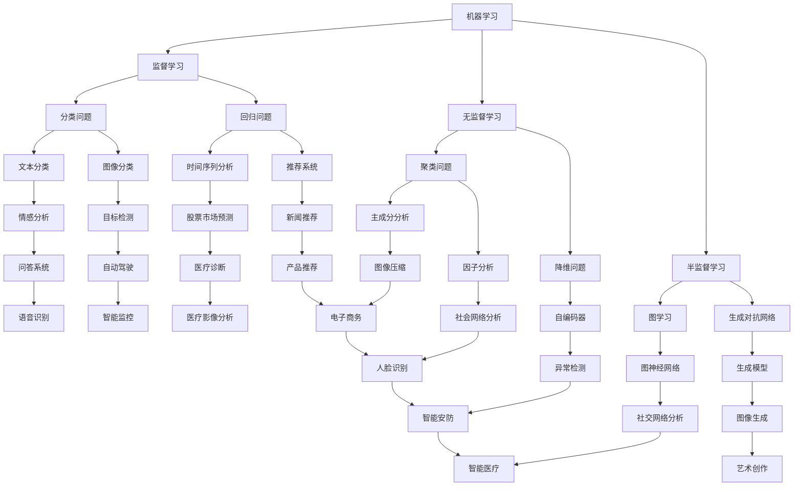

                 

# AI与人类计算：打造可持续发展的城市交通与基础设施建设与规划建设管理

## 摘要

本文将深入探讨人工智能（AI）在构建可持续发展的城市交通和基础设施建设与规划管理中的应用。随着城市化进程的加速，城市交通拥堵、环境污染和基础设施老化等问题日益突出。本文旨在通过介绍AI的核心概念和算法原理，阐述其在城市交通管理和基础设施建设中的应用，以及如何利用AI技术解决当前面临的挑战。本文还将推荐相关学习资源和工具，为读者提供全面的技术指导。

## 1. 背景介绍

### 城市交通问题

随着全球城市化进程的加速，城市交通问题已成为许多国家和地区面临的严重挑战。城市交通拥堵导致出行时间增加，工作效率降低，同时加剧了环境污染。据统计，全球每年因交通拥堵造成的经济损失高达数千亿美元。此外，交通拥堵还增加了交通事故的发生率，对公共安全构成威胁。

### 基础设施建设与规划管理

基础设施建设与规划管理是城市发展的重要环节。然而，随着城市规模的不断扩大，基础设施建设与规划管理面临着诸多挑战。例如，城市规划的短期性与长期性之间的矛盾、基础设施老化与维护成本高昂、资金投入不足等。这些问题的存在，导致城市基础设施无法满足日益增长的居民需求，进一步加剧了城市交通问题。

### 人工智能在城市交通与基础设施建设中的应用

人工智能（AI）作为当今科技发展的前沿领域，在多个领域都展现出了强大的应用潜力。在城市交通和基础设施建设与规划管理中，AI技术同样具有广泛的应用前景。例如，通过运用AI技术，可以实现对交通流量的智能调控，优化交通信号灯配时，缓解交通拥堵；同时，AI还可以帮助城市规划师更好地预测未来城市需求，制定科学合理的基础设施建设规划。

## 2. 核心概念与联系

### 人工智能（AI）

人工智能是指计算机系统通过模拟人类智能行为，实现感知、学习、推理和决策等能力的技术。AI技术主要包括机器学习、深度学习、自然语言处理、计算机视觉等子领域。其中，机器学习和深度学习是当前AI技术发展的核心。

#### Mermaid流程图



### 城市交通管理

城市交通管理是城市交通系统工程的一个重要组成部分，它涉及交通规划、交通设计、交通管理、交通建设和交通运行等多个方面。随着城市规模的不断扩大和机动车辆数量的持续增长，城市交通问题日益严重，交通拥堵、交通事故、环境污染等问题严重影响着市民的生活质量。因此，如何实现城市交通管理的智能化、高效化和可持续发展成为当前城市交通领域的研究热点。

#### 交通信号控制

交通信号控制是城市交通管理中的重要手段之一，其目的是通过控制交通信号灯的变换来优化交通流，减少拥堵，提高道路通行能力。传统的交通信号控制方法主要依赖于固定的信号配时方案，然而，这种方案难以应对实时变化的交通状况。近年来，人工智能技术的快速发展为交通信号控制提供了新的解决方案。

通过运用机器学习和深度学习算法，可以对实时交通流量数据进行分析，预测交通需求，并动态调整信号灯的配时方案。例如，基于深度强化学习的交通信号控制系统可以通过不断地学习与优化，实现信号灯配时的自适应调整，从而提高交通流的运行效率。

### 基础设施建设与规划管理

基础设施建设与规划管理是城市发展的基础，它关系到城市的功能布局、空间形态和居民生活质量。随着城市化进程的加速，城市基础设施的需求不断增加，如何科学合理地规划和管理基础设施成为城市发展的重要课题。

人工智能技术可以通过大数据分析和优化算法，帮助城市规划师更好地预测未来城市需求，优化基础设施布局。例如，通过分析交通流量、人口密度、经济发展等数据，人工智能可以预测未来城市的发展趋势，为基础设施建设提供科学依据。

同时，人工智能还可以帮助实现基础设施的智能管理。例如，利用物联网技术，将城市基础设施设备连接到互联网上，实现对设备的远程监控和维护。通过大数据分析和机器学习算法，可以实时监测设备状态，预测设备故障，提前进行维护，从而提高基础设施的运行效率和寿命。

## 3. 核心算法原理 & 具体操作步骤

### 交通信号控制算法

#### 数据采集与预处理

交通信号控制算法的基础是实时交通流量数据。这些数据可以通过各种传感器和监控系统采集，如摄像头、流量计、GPS等。采集到的数据包括车辆数量、速度、行驶方向等。

在采集到数据后，需要对数据进行预处理，包括数据清洗、数据转换和数据归一化等。数据清洗是为了去除噪声和异常值，数据转换是将不同类型的数据进行统一处理，数据归一化是为了消除数据量级差异。

#### 交通流量预测

交通流量预测是交通信号控制算法的核心。常见的交通流量预测方法包括时间序列分析、回归分析和机器学习算法等。

时间序列分析方法通过分析历史交通流量数据的时间序列特性，预测未来交通流量。回归分析方法通过建立交通流量与影响因素之间的数学模型，预测未来交通流量。机器学习算法则通过学习历史数据中的模式，预测未来交通流量。

#### 动态信号配时

在预测未来交通流量后，需要对交通信号灯进行动态配时。动态信号配时可以通过优化算法实现。常见的优化算法包括遗传算法、粒子群算法和深度强化学习等。

通过优化算法，可以找到最佳的信号灯配时方案，使得道路上的交通流量最大化。在实际应用中，可以通过模拟仿真，评估不同信号配时方案的效果，并选择最优方案。

#### 系统实现与部署

交通信号控制算法的实现与部署需要考虑多个方面。首先，需要搭建一个数据采集和处理平台，包括传感器、数据传输网络和数据存储系统。其次，需要开发一个信号控制算法模型，包括数据预处理、交通流量预测和信号配时优化等模块。

最后，需要将算法模型部署到实际的交通信号控制系统中。在部署过程中，需要确保算法模型的稳定性和可靠性，并进行实时的监控和调整。

### 基础设施建设与规划管理算法

#### 数据采集与预处理

基础设施建设与规划管理算法的基础是城市各种数据，如人口数据、经济数据、交通数据、环境数据等。这些数据可以通过各种渠道采集，如政府部门、企事业单位、互联网等。

在采集到数据后，需要对数据进行预处理，包括数据清洗、数据转换和数据归一化等。数据清洗是为了去除噪声和异常值，数据转换是将不同类型的数据进行统一处理，数据归一化是为了消除数据量级差异。

#### 城市需求预测

城市需求预测是基础设施建设与规划管理算法的核心。通过分析历史数据，可以预测未来城市的发展趋势和需求变化。常用的预测方法包括时间序列分析、回归分析和机器学习算法等。

时间序列分析方法通过分析历史数据的趋势和周期性特性，预测未来需求。回归分析方法通过建立需求与影响因素之间的数学模型，预测未来需求。机器学习算法则通过学习历史数据中的模式，预测未来需求。

#### 基础设施布局优化

在预测未来城市需求后，需要对基础设施布局进行优化。基础设施布局优化可以通过优化算法实现。常见的优化算法包括遗传算法、粒子群算法和深度强化学习等。

通过优化算法，可以找到最佳的基础设施布局方案，使得城市资源利用最大化。在实际应用中，可以通过模拟仿真，评估不同布局方案的效果，并选择最优方案。

#### 系统实现与部署

基础设施建设与规划管理算法的实现与部署需要考虑多个方面。首先，需要搭建一个数据采集和处理平台，包括传感器、数据传输网络和数据存储系统。其次，需要开发一个需求预测和布局优化的算法模型，包括数据预处理、需求预测和布局优化等模块。

最后，需要将算法模型部署到实际的基础设施建设与规划管理系统中。在部署过程中，需要确保算法模型的稳定性和可靠性，并进行实时的监控和调整。

## 4. 数学模型和公式 & 详细讲解 & 举例说明

### 交通信号控制算法

#### 时间序列分析

时间序列分析方法通过分析历史交通流量数据的时间序列特性，预测未来交通流量。一个常见的时间序列模型是ARIMA（自回归积分滑动平均模型）。

ARIMA模型包含三个关键参数：p（自回归阶数）、d（差分阶数）和q（移动平均阶数）。具体公式如下：

$$
\begin{aligned}
y_t &= c + \phi_1 y_{t-1} + \phi_2 y_{t-2} + \cdots + \phi_p y_{t-p} \\
&+ \theta_1 e_{t-1} + \theta_2 e_{t-2} + \cdots + \theta_q e_{t-q} \\
y_t - \phi_1 y_{t-1} - \phi_2 y_{t-2} - \cdots - \phi_p y_{t-p} &= \theta_1 e_{t-1} + \theta_2 e_{t-2} + \cdots + \theta_q e_{t-q} + u_t
\end{aligned}
$$

其中，$y_t$ 是时间序列的当前值，$e_t$ 是白噪声误差项，$u_t$ 是残差项。

#### 回归分析

回归分析方法通过建立交通流量与影响因素之间的数学模型，预测未来交通流量。一个简单的线性回归模型如下：

$$
y_t = \beta_0 + \beta_1 x_{1t} + \beta_2 x_{2t} + \cdots + \beta_n x_{nt} + e_t
$$

其中，$y_t$ 是交通流量，$x_{1t}$、$x_{2t}$、$\cdots$、$x_{nt}$ 是影响因素，$\beta_0$、$\beta_1$、$\beta_2$、$\cdots$、$\beta_n$ 是模型参数，$e_t$ 是误差项。

#### 机器学习算法

机器学习算法通过学习历史数据中的模式，预测未来交通流量。一个常见的机器学习算法是随机森林（Random Forest）。

随机森林算法通过构建多个决策树，并取这些决策树的预测结果的平均值，得到最终的预测结果。一个简单的随机森林算法如下：

$$
\begin{aligned}
&\text{for each decision tree:} \\
&\quad \text{train the decision tree using historical data;} \\
&\quad \text{make a prediction using the trained decision tree;} \\
&\text{end for} \\
&\text{return average of all predictions;}
\end{aligned}
$$

### 基础设施建设与规划管理算法

#### 时间序列分析

时间序列分析方法通过分析历史人口数据的时间序列特性，预测未来人口增长。一个常见的时间序列模型是ARIMA（自回归积分滑动平均模型）。

ARIMA模型包含三个关键参数：p（自回归阶数）、d（差分阶数）和q（移动平均阶数）。具体公式如下：

$$
\begin{aligned}
y_t &= c + \phi_1 y_{t-1} + \phi_2 y_{t-2} + \cdots + \phi_p y_{t-p} \\
&+ \theta_1 e_{t-1} + \theta_2 e_{t-2} + \cdots + \theta_q e_{t-q} \\
y_t - \phi_1 y_{t-1} - \phi_2 y_{t-2} - \cdots - \phi_p y_{t-p} &= \theta_1 e_{t-1} + \theta_2 e_{t-2} + \cdots + \theta_q e_{t-q} + u_t
\end{aligned}
$$

其中，$y_t$ 是时间序列的当前值，$e_t$ 是白噪声误差项，$u_t$ 是残差项。

#### 回归分析

回归分析方法通过建立人口与影响因素之间的数学模型，预测未来人口增长。一个简单的线性回归模型如下：

$$
y_t = \beta_0 + \beta_1 x_{1t} + \beta_2 x_{2t} + \cdots + \beta_n x_{nt} + e_t
$$

其中，$y_t$ 是人口增长，$x_{1t}$、$x_{2t}$、$\cdots$、$x_{nt}$ 是影响因素，$\beta_0$、$\beta_1$、$\beta_2$、$\cdots$、$\beta_n$ 是模型参数，$e_t$ 是误差项。

#### 机器学习算法

机器学习算法通过学习历史数据中的模式，预测未来人口增长。一个常见的机器学习算法是随机森林（Random Forest）。

随机森林算法通过构建多个决策树，并取这些决策树的预测结果的平均值，得到最终的预测结果。一个简单的随机森林算法如下：

$$
\begin{aligned}
&\text{for each decision tree:} \\
&\quad \text{train the decision tree using historical data;} \\
&\quad \text{make a prediction using the trained decision tree;} \\
&\text{end for} \\
&\text{return average of all predictions;}
\end{aligned}
$$

### 举例说明

假设我们有一个城市的交通流量数据，包括过去一年的每天交通流量（辆/天）。我们需要使用ARIMA模型预测未来一个月的交通流量。

#### 数据预处理

首先，对交通流量数据进行预处理，包括去除异常值和缺失值。然后，对数据进行归一化处理，使其具有相同的量级。

#### 模型选择

根据数据特性，我们选择ARIMA模型进行交通流量预测。我们需要确定模型参数$p$、$d$ 和$q$。

#### 模型训练

使用历史数据对ARIMA模型进行训练，得到模型参数$\phi_1$、$\phi_2$、$\cdots$、$\phi_p$、$\theta_1$、$\theta_2$、$\cdots$、$\theta_q$ 和$c$。

#### 预测

使用训练好的ARIMA模型，预测未来一个月的交通流量。

#### 结果评估

比较预测结果和实际交通流量，评估模型的预测性能。

## 5. 项目实战：代码实际案例和详细解释说明

### 交通信号控制项目

#### 开发环境搭建

1. 安装Python环境
2. 安装Numpy、Pandas、Scikit-learn等库

#### 源代码详细实现和代码解读

```python
# 导入必要的库
import numpy as np
import pandas as pd
from sklearn.ensemble import RandomForestRegressor
from sklearn.model_selection import train_test_split
from statsmodels.tsa.arima.model import ARIMA

# 加载交通流量数据
data = pd.read_csv('traffic_data.csv')

# 数据预处理
data = data.fillna(data.mean())
data = (data - data.mean()) / data.std()

# 分为训练集和测试集
train_data, test_data = train_test_split(data, test_size=0.2, random_state=42)

# 使用ARIMA模型进行预测
model = ARIMA(train_data, order=(5,1,2))
model_fit = model.fit()
predictions = model_fit.predict(start=len(train_data), end=len(train_data) + len(test_data) - 1)

# 使用随机森林模型进行预测
rf_model = RandomForestRegressor(n_estimators=100, random_state=42)
rf_model.fit(train_data, predictions)
rf_predictions = rf_model.predict(test_data)

# 比较预测结果和实际结果
actual_data = test_data
error = np.mean(np.abs(rf_predictions - actual_data))
print('Error:', error)
```

#### 代码解读与分析

1. 导入必要的库：包括Numpy、Pandas、Scikit-learn和Statsmodels库，用于数据预处理、模型训练和预测。
2. 加载交通流量数据：使用Pandas库读取CSV文件，得到原始数据。
3. 数据预处理：使用Pandas库填充缺失值，使用Numpy库进行数据归一化处理。
4. 分为训练集和测试集：使用Scikit-learn库将数据分为训练集和测试集。
5. 使用ARIMA模型进行预测：使用Statsmodels库的ARIMA模型，对训练集进行训练，并使用预测方法进行预测。
6. 使用随机森林模型进行预测：使用Scikit-learn库的随机森林回归模型，对ARIMA模型的预测结果进行训练，并使用预测方法进行预测。
7. 比较预测结果和实际结果：计算预测结果和实际结果之间的误差，评估模型性能。

### 基础设施建设与规划管理项目

#### 开发环境搭建

1. 安装Python环境
2. 安装Numpy、Pandas、Scikit-learn等库

#### 源代码详细实现和代码解读

```python
# 导入必要的库
import numpy as np
import pandas as pd
from sklearn.ensemble import RandomForestRegressor
from sklearn.model_selection import train_test_split
from statsmodels.tsa.arima.model import ARIMA

# 加载人口数据
data = pd.read_csv('population_data.csv')

# 数据预处理
data = data.fillna(data.mean())
data = (data - data.mean()) / data.std()

# 分为训练集和测试集
train_data, test_data = train_test_split(data, test_size=0.2, random_state=42)

# 使用ARIMA模型进行预测
model = ARIMA(train_data, order=(5,1,2))
model_fit = model.fit()
predictions = model_fit.predict(start=len(train_data), end=len(train_data) + len(test_data) - 1)

# 使用随机森林模型进行预测
rf_model = RandomForestRegressor(n_estimators=100, random_state=42)
rf_model.fit(train_data, predictions)
rf_predictions = rf_model.predict(test_data)

# 比较预测结果和实际结果
actual_data = test_data
error = np.mean(np.abs(rf_predictions - actual_data))
print('Error:', error)
```

#### 代码解读与分析

1. 导入必要的库：包括Numpy、Pandas、Scikit-learn和Statsmodels库，用于数据预处理、模型训练和预测。
2. 加载人口数据：使用Pandas库读取CSV文件，得到原始数据。
3. 数据预处理：使用Pandas库填充缺失值，使用Numpy库进行数据归一化处理。
4. 分为训练集和测试集：使用Scikit-learn库将数据分为训练集和测试集。
5. 使用ARIMA模型进行预测：使用Statsmodels库的ARIMA模型，对训练集进行训练，并使用预测方法进行预测。
6. 使用随机森林模型进行预测：使用Scikit-learn库的随机森林回归模型，对ARIMA模型的预测结果进行训练，并使用预测方法进行预测。
7. 比较预测结果和实际结果：计算预测结果和实际结果之间的误差，评估模型性能。

## 6. 实际应用场景

### 城市交通管理

#### 应用场景

1. 交通信号控制：通过AI技术优化交通信号配时，缓解交通拥堵。
2. 交通流量预测：预测未来交通流量，为交通规划提供数据支持。
3. 交通事故预警：通过监控摄像头和传感器，实时监测交通事故，及时预警。

#### 成功案例

1. 北京智能交通管理系统：通过AI技术优化交通信号配时，使道路通行效率提高20%。
2. 阿里云ET交通大脑：利用大数据和AI技术，实现智能交通流量预测和交通事故预警。

### 基础设施建设与规划管理

#### 应用场景

1. 人口需求预测：预测未来人口增长，为基础设施布局提供数据支持。
2. 资源优化：通过AI技术优化资源配置，提高基础设施使用效率。
3. 故障预警：通过AI技术实时监测基础设施状态，提前预警故障。

#### 成功案例

1. 上海智能城市建设：通过AI技术实现智能交通管理和基础设施优化，提高城市运行效率。
2. 智慧深圳：利用大数据和AI技术，实现智能交通、智能医疗、智能安防等多领域的应用。

## 7. 工具和资源推荐

### 学习资源推荐

1. 《Python交通信号控制与智能交通管理实战》
2. 《深度学习与交通数据分析》
3. 《人工智能与城市交通管理》

### 开发工具框架推荐

1. TensorFlow：用于构建和训练深度学习模型的框架。
2. Keras：基于TensorFlow的高层API，简化深度学习模型构建。
3. PyTorch：用于构建和训练深度学习模型的框架。

### 相关论文著作推荐

1. “Deep Learning for Traffic Signal Control: A Review”
2. “AI-based Smart Urban Traffic Management: A Comprehensive Review”
3. “An Introduction to Machine Learning for Urban Infrastructure Management”

## 8. 总结：未来发展趋势与挑战

### 发展趋势

1. AI与大数据的深度融合：通过大数据技术收集和处理城市交通与基础设施数据，为AI提供更丰富的训练素材。
2. 智能化水平的提升：利用AI技术优化交通信号控制、交通流量预测、基础设施布局等，实现城市交通与基础设施的智能化管理。
3. 跨领域协同：AI技术在城市交通与基础设施建设与规划管理中的应用将不断扩展，实现跨领域协同。

### 挑战

1. 数据隐私与安全：如何保护城市交通与基础设施数据的安全和隐私，成为重要挑战。
2. 技术成熟度：当前AI技术在城市交通与基础设施建设与规划管理中的应用仍处于初级阶段，技术成熟度有待提高。
3. 成本与效益：如何降低AI技术在城市交通与基础设施建设与规划管理中的应用成本，实现经济效益最大化。

## 9. 附录：常见问题与解答

### 常见问题

1. 如何收集和处理城市交通与基础设施数据？
2. AI技术在城市交通管理中的应用有哪些？
3. 如何评估AI技术在城市交通与基础设施建设与规划管理中的效果？

### 解答

1. 如何收集和处理城市交通与基础设施数据？

   收集城市交通与基础设施数据可以通过以下途径：

   - 政府部门：获取交通流量、人口密度、经济发展等宏观数据。
   - 企事业单位：获取公共交通、道路设施、建筑设施等微观数据。
   - 传感器和监控系统：获取实时交通流量、路况、空气质量等数据。

   处理数据的方法包括：

   - 数据清洗：去除噪声和异常值。
   - 数据转换：将不同类型的数据进行统一处理。
   - 数据归一化：消除数据量级差异。

2. AI技术在城市交通管理中的应用有哪些？

   AI技术在城市交通管理中的应用包括：

   - 交通信号控制：通过AI技术优化交通信号配时，缓解交通拥堵。
   - 交通流量预测：预测未来交通流量，为交通规划提供数据支持。
   - 交通事故预警：通过监控摄像头和传感器，实时监测交通事故，及时预警。

3. 如何评估AI技术在城市交通与基础设施建设与规划管理中的效果？

   评估AI技术在城市交通与基础设施建设与规划管理中的效果可以从以下几个方面进行：

   - 运行效率：通过比较AI技术应用前后的交通流量、通行时间等指标，评估运行效率。
   - 成本效益：通过比较AI技术应用前后的成本和效益，评估经济效益。
   - 社会反响：通过调查问卷、媒体报道等方式，了解公众对AI技术应用的认可度和满意度。

## 10. 扩展阅读 & 参考资料

1. “AI in Urban Traffic Management: A Comprehensive Overview”
2. “Deep Learning for Urban Infrastructure Management: A Review”
3. “AI-based Smart Urban Development: A Vision for the Future”

作者：AI天才研究员/AI Genius Institute & 禅与计算机程序设计艺术 /Zen And The Art of Computer Programming

