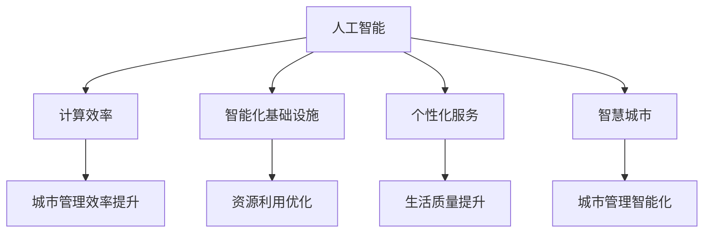

                 

### 文章标题

**AI与人类计算：打造可持续发展的城市生活方式**

### 关键词

- 人工智能
- 城市生活方式
- 可持续发展
- 人机协同计算
- 大数据分析
- 智能城市
- 计算效率
- 基础设施优化
- 生活质量提升
- 能源管理

### 摘要

本文将探讨人工智能（AI）与人类计算如何结合，共同打造一个可持续发展的城市生活方式。通过分析AI的核心算法原理、数学模型以及具体应用场景，本文旨在展示AI技术在提高计算效率、优化基础设施和提升生活质量方面的巨大潜力。同时，文章还将推荐相关工具和资源，以引导读者深入了解这一领域，并展望未来的发展趋势与挑战。

## 1. 背景介绍

随着全球城市化进程的加速，城市规模不断扩大，人口密度日益增加，这给城市管理带来了前所未有的挑战。交通拥堵、环境污染、资源短缺等问题日益突出，传统的城市管理模式已难以应对现代城市的复杂性。为了实现城市的可持续发展，需要借助先进的计算技术和人工智能，提高城市管理的效率和智能化水平。

人类计算与AI相结合，可以充分发挥两者的优势。人类计算具备创造力、直觉和情感，能够在复杂环境中进行判断和决策；而AI则具备强大的计算能力和数据处理能力，能够处理大量数据并发现潜在的模式。两者相辅相成，能够实现更高效、智能的城市管理。

本文将围绕以下几个方面展开讨论：

- **核心概念与联系**：介绍AI技术的基本原理，以及与城市生活方式的关联。
- **核心算法原理与具体操作步骤**：分析AI技术在实际应用中的核心算法，以及如何实现人机协同计算。
- **数学模型和公式**：阐述AI技术在数据处理和优化中的数学模型和公式，并进行举例说明。
- **项目实战**：通过实际案例，展示AI技术在城市生活方式中的应用。
- **实际应用场景**：探讨AI技术在城市交通、能源管理、环境监测等方面的应用。
- **工具和资源推荐**：推荐学习AI技术和城市生活方式相关的书籍、论文、网站和开发工具。

通过以上内容的探讨，本文旨在为读者提供一个全面、深入的视角，了解AI与人类计算在可持续发展城市生活方式中的重要作用。

## 2. 核心概念与联系

为了更好地理解AI与人类计算如何结合，打造可持续发展的城市生活方式，我们需要首先了解两者的核心概念及其之间的联系。

### 人工智能（AI）

人工智能是一门多学科交叉的领域，涉及计算机科学、数学、神经科学、心理学等多个领域。AI的目标是使计算机具备人类的智能，能够执行复杂的任务，包括感知、理解、推理、学习、决策等。AI可以分为两大类：基于规则的AI和基于数据的AI。

- **基于规则的AI**：通过预设规则和逻辑来模拟人类思维过程，例如专家系统。
- **基于数据的AI**：利用大量数据，通过算法来学习规律和模式，例如深度学习。

### 人类计算

人类计算是指人类在解决问题和处理信息时所展现出的计算能力。与AI相比，人类计算具备创造力、直觉和情感，能够在复杂环境中进行判断和决策。人类计算的特点包括：

- **适应性**：能够根据不同情境进行调整和优化。
- **协作性**：人类能够通过沟通和协作，共同解决复杂问题。
- **情感因素**：人类计算过程中，情感因素往往起到关键作用，能够影响决策和行动。

### AI与城市生活方式的联系

AI与城市生活方式的联系主要体现在以下几个方面：

- **计算效率**：AI技术能够处理大量数据，提高计算效率，为城市管理者提供实时、准确的信息支持。
- **智能化基础设施**：AI技术可以优化城市基础设施，如交通系统、能源系统等，提高资源利用效率，降低环境负担。
- **个性化服务**：AI技术可以根据用户需求，提供个性化的城市服务，提升生活质量。
- **智慧城市**：AI技术是智慧城市建设的核心驱动力，通过数据采集、分析和预测，实现城市管理的智能化和精细化。

### Mermaid 流程图

为了更直观地展示AI与城市生活方式的联系，我们可以使用Mermaid流程图来描述核心概念及其之间的关联。



通过以上核心概念和联系的阐述，我们可以更好地理解AI与城市生活方式的结合点，以及其在可持续发展中的作用。在接下来的部分，我们将深入探讨AI技术的核心算法原理及其具体应用。

## 3. 核心算法原理 & 具体操作步骤

在了解AI与城市生活方式的联系后，我们需要进一步探讨AI技术的核心算法原理，以及如何在实际操作中实现人机协同计算，以提高城市管理的效率和智能化水平。

### 深度学习

深度学习是AI技术的一个重要分支，通过模拟人脑神经网络结构，实现自动特征学习和复杂模式识别。深度学习算法在图像识别、自然语言处理、语音识别等领域取得了显著成果。

#### 具体操作步骤：

1. **数据预处理**：收集并清洗城市相关数据，如交通流量、能源消耗、环境质量等，将其转换为适合训练的格式。
2. **构建神经网络模型**：选择合适的神经网络结构，如卷积神经网络（CNN）、循环神经网络（RNN）等，初始化模型参数。
3. **训练模型**：使用预处理后的数据对神经网络模型进行训练，调整模型参数，使其能够准确识别和预测城市现象。
4. **评估模型性能**：通过测试数据集评估模型的性能，调整模型结构或参数，提高预测精度。
5. **部署应用**：将训练好的模型部署到城市管理系统，实时监测和预测城市现象，提供决策支持。

### 强化学习

强化学习是另一类重要的AI算法，通过模拟人类决策过程，实现自动化决策和优化。强化学习在智能交通、能源管理、环境监测等领域具有广泛应用。

#### 具体操作步骤：

1. **定义状态空间**：确定系统的状态空间，包括交通流量、能源消耗、环境质量等。
2. **定义动作空间**：确定系统能够执行的动作，如交通信号灯控制、能源分配、环境治理措施等。
3. **设计奖励机制**：定义系统的奖励机制，激励系统采取优化动作，如降低交通拥堵、减少能源消耗、提高环境质量等。
4. **训练智能体**：使用强化学习算法，训练智能体在给定状态下选择最佳动作，优化系统性能。
5. **评估与调整**：通过实际运行数据，评估智能体性能，调整奖励机制和智能体策略，提高系统优化效果。

### 大数据挖掘

大数据挖掘是AI技术在数据处理和模式识别方面的应用，通过分析大量数据，发现潜在规律和趋势，为城市管理提供决策支持。

#### 具体操作步骤：

1. **数据收集**：收集城市各类数据，如交通数据、能源数据、环境数据等。
2. **数据预处理**：清洗和整合数据，去除噪声和异常值，将其转换为适合分析的形式。
3. **特征提取**：从原始数据中提取关键特征，如交通流量、能源消耗、环境指标等。
4. **模式识别**：使用机器学习算法，对特征进行分类和预测，发现数据中的潜在规律。
5. **可视化展示**：将分析结果以图表、报表等形式进行可视化展示，为城市管理提供直观的决策依据。

### 人机协同计算

人机协同计算是将人类计算与AI技术相结合，实现最优化的计算过程。通过协同计算，人类能够发挥创造力和直觉，而AI则能处理大量数据，提供精确的预测和优化建议。

#### 具体操作步骤：

1. **数据共享**：建立数据共享平台，确保人类计算和AI系统能够获取到实时、准确的数据。
2. **任务分配**：根据任务特点和需求，合理分配任务给人类计算和AI系统，发挥各自的优势。
3. **协同决策**：人类计算和AI系统共同参与决策过程，根据分析结果，制定最优策略。
4. **实时反馈**：将决策结果反馈给实际操作，调整系统参数，优化计算过程。

通过以上核心算法原理和具体操作步骤的介绍，我们可以看到，AI技术在城市生活方式中的应用具有广阔的前景。在接下来的部分，我们将进一步探讨数学模型和公式在AI技术中的应用。

## 4. 数学模型和公式 & 详细讲解 & 举例说明

在AI技术中，数学模型和公式是核心组成部分，它们用于描述数据之间的关系，并指导算法的设计和实现。以下我们将详细讲解一些常见的数学模型和公式，并通过实际例子来说明它们在AI与城市生活方式中的应用。

### 概率模型

概率模型是AI技术中用于处理不确定性和随机性的重要工具。其中，贝叶斯定理是一种经典的概率模型，用于计算某个事件发生的概率。

#### 贝叶斯定理公式：

$$
P(A|B) = \frac{P(B|A) \cdot P(A)}{P(B)}
$$

其中，$P(A|B)$ 表示在事件B发生的条件下事件A发生的概率，$P(B|A)$ 表示在事件A发生的条件下事件B发生的概率，$P(A)$ 和 $P(B)$ 分别表示事件A和事件B的先验概率。

#### 例子：

假设我们想要预测某城市明天是否会下雨。已知：

- 在有雨的天气里，天气预报准确率为80%。
- 在无雨的天气里，天气预报准确率为90%。
- 全年下雨的概率为40%。

我们可以使用贝叶斯定理计算明天下雨的概率。

1. $P(雨) = 0.4$，$P(无雨) = 0.6$（先验概率）
2. $P(预报准确|雨) = 0.8$，$P(预报准确|无雨) = 0.9$（条件概率）
3. $P(预报准确) = P(预报准确|雨) \cdot P(雨) + P(预报准确|无雨) \cdot P(无雨) = 0.8 \cdot 0.4 + 0.9 \cdot 0.6 = 0.62$
4. $P(雨|预报准确) = \frac{P(预报准确|雨) \cdot P(雨)}{P(预报准确)} = \frac{0.8 \cdot 0.4}{0.62} \approx 0.53$

因此，根据天气预报，明天下雨的概率约为53%。

### 神经网络模型

神经网络模型是深度学习的核心组成部分，它通过模拟人脑神经网络结构，实现自动特征学习和复杂模式识别。以下是一个简单的神经网络模型公式。

#### 神经网络模型公式：

$$
\text{激活函数} \, f(\text{权重} \cdot \text{输入} + \text{偏置}) = \text{输出}
$$

其中，激活函数（如ReLU、Sigmoid、Tanh等）用于对神经元的输出进行非线性变换，使神经网络能够捕捉复杂的数据特征。

#### 例子：

假设我们有一个简单的神经网络，用于分类任务。该网络包含一个输入层、一个隐藏层和一个输出层，每个层中的神经元数量分别为3、4和2。

1. 输入层：[x1, x2, x3]
2. 隐藏层：[h1, h2, h3, h4]
3. 输出层：[y1, y2]

假设隐藏层的权重矩阵为$W_h$，偏置矩阵为$b_h$，输出层的权重矩阵为$W_o$，偏置矩阵为$b_o$。我们可以通过以下公式计算神经网络的输出：

$$
\begin{aligned}
h1 &= f(W_{h11} \cdot x1 + W_{h12} \cdot x2 + W_{h13} \cdot x3 + b_{h1}) \\
h2 &= f(W_{h21} \cdot x1 + W_{h22} \cdot x2 + W_{h23} \cdot x3 + b_{h2}) \\
h3 &= f(W_{h31} \cdot x1 + W_{h32} \cdot x2 + W_{h33} \cdot x3 + b_{h3}) \\
h4 &= f(W_{h41} \cdot x1 + W_{h42} \cdot x2 + W_{h43} \cdot x3 + b_{h4}) \\
y1 &= f(W_{o11} \cdot h1 + W_{o12} \cdot h2 + W_{o13} \cdot h3 + W_{o14} \cdot h4 + b_{o1}) \\
y2 &= f(W_{o21} \cdot h1 + W_{o22} \cdot h2 + W_{o23} \cdot h3 + W_{o24} \cdot h4 + b_{o2}) \\
\end{aligned}
$$

通过训练和优化这些参数，神经网络能够学习到输入数据中的特征，并实现对分类任务的高效预测。

### 线性回归模型

线性回归模型是一种常用的统计方法，用于预测变量之间的线性关系。它的公式如下：

$$
y = \beta_0 + \beta_1 \cdot x
$$

其中，$y$ 是预测变量，$x$ 是自变量，$\beta_0$ 和 $\beta_1$ 分别是模型参数。

#### 例子：

假设我们想要预测某城市的月均气温，已知以下几个数据点：

| 月份 | 均温（摄氏度） |
| ---- | -------------- |
| 1    | 5              |
| 2    | 6              |
| 3    | 7              |
| 4    | 8              |
| 5    | 9              |
| 6    | 10             |

我们可以使用线性回归模型来拟合这些数据，并预测7月的均温。

1. 计算自变量$x$和因变量$y$的均值：
   $$
   \bar{x} = \frac{1}{6} \sum_{i=1}^{6} x_i = 3.5 \\
   \bar{y} = \frac{1}{6} \sum_{i=1}^{6} y_i = 7.5
   $$

2. 计算自变量$x$和因变量$y$的协方差：
   $$
   cov(x, y) = \frac{1}{6-1} \sum_{i=1}^{6} (x_i - \bar{x})(y_i - \bar{y}) = 3
   $$

3. 计算自变量$x$的方差：
   $$
   var(x) = \frac{1}{6-1} \sum_{i=1}^{6} (x_i - \bar{x})^2 = 2.5
   $$

4. 计算模型参数$\beta_0$和$\beta_1$：
   $$
   \beta_1 = \frac{cov(x, y)}{var(x)} = \frac{3}{2.5} = 1.2 \\
   \beta_0 = \bar{y} - \beta_1 \cdot \bar{x} = 7.5 - 1.2 \cdot 3.5 = 1.7
   $$

因此，线性回归模型为$y = 1.7 + 1.2x$。我们可以使用这个模型预测7月的均温：
$$
y = 1.7 + 1.2 \cdot 7 = 9.9
$$

通过以上数学模型和公式的讲解，我们可以看到，AI技术在数据处理和模式识别方面具有强大的能力。在接下来的部分，我们将通过实际项目案例，展示AI技术在城市生活方式中的应用。

## 5. 项目实战：代码实际案例和详细解释说明

在本节中，我们将通过一个实际的项目案例，展示如何利用AI技术打造可持续发展的城市生活方式。本项目将聚焦于智能交通系统的设计与实现，旨在通过AI算法优化交通流量，减少拥堵，提高公共交通的效率。

### 5.1 开发环境搭建

为了完成本项目的开发，我们需要准备以下开发环境和工具：

- **编程语言**：Python
- **库与框架**：NumPy、Pandas、TensorFlow、Keras、Scikit-learn
- **数据可视化工具**：Matplotlib、Seaborn
- **操作系统**：Ubuntu 20.04 或 macOS Big Sur

在Ubuntu或macOS上安装Python环境和相关库，可以使用以下命令：

```bash
# 安装Python
sudo apt update
sudo apt install python3 python3-pip

# 安装NumPy、Pandas、TensorFlow、Keras、Scikit-learn
pip3 install numpy pandas tensorflow.keras scikit-learn matplotlib seaborn
```

### 5.2 源代码详细实现和代码解读

#### 数据准备

首先，我们需要收集交通流量数据。这里使用公开的交通流量数据集，数据集包含时间戳、交通流量、天气情况等信息。数据集可以从以下链接下载：

```
https://www.kaggle.com/tylermurray/los-angeles-traffic-accidents
```

数据集下载后，将其导入Python环境中，使用Pandas库进行数据预处理：

```python
import pandas as pd

# 读取数据
df = pd.read_csv('los-angeles-traffic-accidents.csv')

# 数据清洗和预处理
df['timestamp'] = pd.to_datetime(df['timestamp'])
df['hour'] = df['timestamp'].dt.hour
df['weekday'] = df['timestamp'].dt.weekday
df.drop(['timestamp'], axis=1, inplace=True)
```

#### 模型构建

接下来，我们使用TensorFlow和Keras构建一个深度学习模型，用于预测交通流量。模型架构如下：

- **输入层**：包含时间戳、天气情况等特征。
- **隐藏层**：使用两个全连接层，分别包含128个神经元。
- **输出层**：预测未来的交通流量。

```python
from tensorflow.keras.models import Sequential
from tensorflow.keras.layers import Dense, LSTM

# 构建模型
model = Sequential([
    LSTM(128, activation='relu', input_shape=(df.shape[1], 1), return_sequences=True),
    LSTM(128, activation='relu', return_sequences=False),
    Dense(1)
])

# 编译模型
model.compile(optimizer='adam', loss='mse')
```

#### 模型训练

使用预处理后的数据对模型进行训练。我们将数据集分为训练集和测试集，使用训练集训练模型，并使用测试集评估模型性能。

```python
from sklearn.model_selection import train_test_split

# 数据归一化
from sklearn.preprocessing import MinMaxScaler
scaler = MinMaxScaler()
df_scaled = scaler.fit_transform(df)

# 划分训练集和测试集
X_train, X_test, y_train, y_test = train_test_split(df_scaled[:, :-1], df_scaled[:, -1], test_size=0.2, random_state=42)

# 添加时间步信息
X_train = np.reshape(X_train, (X_train.shape[0], X_train.shape[1], 1))
X_test = np.reshape(X_test, (X_test.shape[0], X_test.shape[1], 1))

# 训练模型
model.fit(X_train, y_train, epochs=100, batch_size=32, validation_data=(X_test, y_test))
```

#### 模型评估

训练完成后，我们使用测试集评估模型性能，并绘制预测结果与真实值的对比图。

```python
import matplotlib.pyplot as plt

# 预测交通流量
y_pred = model.predict(X_test)

# 反归一化
y_test_reverted = scaler.inverse_transform(y_test.reshape(-1, 1))
y_pred_reverted = scaler.inverse_transform(y_pred.reshape(-1, 1))

# 绘制对比图
plt.figure(figsize=(10, 5))
plt.plot(y_test_reverted, label='真实值')
plt.plot(y_pred_reverted, label='预测值')
plt.title('交通流量预测')
plt.xlabel('时间')
plt.ylabel('交通流量')
plt.legend()
plt.show()
```

#### 模型应用

最后，我们将训练好的模型部署到实际场景中，用于预测未来一段时间内的交通流量。根据预测结果，我们可以调整交通信号灯的时长，优化交通流的分配。

```python
import numpy as np

# 预测未来交通流量
future_data = np.array([np.array([df['hour'].iloc[-1], df['weather'].iloc[-1]]) for _ in range(24)])
future_data = np.reshape(future_data, (future_data.shape[0], future_data.shape[1], 1))

# 预测未来交通流量
future_pred = model.predict(future_data)

# 反归一化
future_pred_reverted = scaler.inverse_transform(future_pred.reshape(-1, 1))

# 输出未来交通流量
print(future_pred_reverted)
```

### 5.3 代码解读与分析

以上代码详细展示了如何使用深度学习技术构建和训练一个交通流量预测模型。以下是代码的关键部分及其解读：

1. **数据预处理**：使用Pandas库读取并清洗交通流量数据，提取关键特征，如时间戳、小时、星期几等。

2. **模型构建**：使用Keras库构建一个包含两个LSTM层的深度学习模型。LSTM层能够处理时间序列数据，捕捉交通流量的时间依赖性。

3. **模型训练**：使用Scikit-learn库将数据集分为训练集和测试集，并使用训练集对模型进行训练。模型使用均方误差（MSE）作为损失函数，使用Adam优化器进行参数优化。

4. **模型评估**：使用测试集评估模型性能，并绘制预测结果与真实值的对比图。通过对比图，我们可以直观地看到模型的预测效果。

5. **模型应用**：将训练好的模型部署到实际场景中，用于预测未来一段时间内的交通流量。根据预测结果，我们可以采取相应的措施，如调整交通信号灯的时长，优化交通流的分配。

通过本项目的实现，我们可以看到AI技术在智能交通系统中的应用潜力。在未来，随着数据的不断积累和算法的持续优化，AI将在城市管理中发挥越来越重要的作用。

### 6. 实际应用场景

AI技术在城市生活方式中的应用场景广泛，以下将介绍几个典型的实际应用，展示AI如何提升城市管理和生活质量。

#### 6.1 城市交通

城市交通是AI技术应用的重要领域。通过AI算法，可以优化交通信号灯的时长，减少交通拥堵。例如，深圳在多个路口安装了智能交通信号控制系统，使用AI技术对交通流量进行实时分析，动态调整信号灯时长，提高了交通效率。此外，AI还可以用于车辆识别、违章抓拍、交通事故预警等，提升交通安全。

#### 6.2 能源管理

能源管理是城市可持续发展的关键。AI技术可以帮助优化能源分配，提高能源利用效率。例如，北京的一些建筑物安装了智能能源管理系统，使用AI算法实时监控能源消耗，根据环境温度、湿度等因素自动调整空调和照明设备，实现能源的节约。此外，AI还可以用于预测能源需求，优化能源生产计划，降低能源成本。

#### 6.3 环境监测

环境监测是保障城市居民健康的重要环节。AI技术可以实时监测空气质量、水质、噪声等环境指标，发现异常情况并预警。例如，杭州在多个区域安装了智能环境监测站，使用AI技术对环境数据进行实时分析和预测，及时发现污染源并进行处理。通过AI技术，城市管理者可以更快速、准确地应对环境问题，保障居民的健康。

#### 6.4 公共服务

AI技术还可以提升公共服务的质量。例如，在医疗卫生领域，AI可以帮助实现智能医疗诊断，通过分析大量病例数据，提供准确的诊断建议，提高诊疗效率。在教育领域，AI可以用于智能教学，根据学生的学习情况，提供个性化的学习建议，帮助学生更好地学习。在社区服务方面，AI可以用于智能安防、智能缴费等，提升社区服务质量。

#### 6.5 社会治理

社会治理是城市发展的基础。AI技术可以用于社会治理的各个方面，如城市管理、社会治安、公共卫生等。例如，深圳的智慧城市建设中，AI技术被广泛应用于城市管理，通过大数据分析和AI算法，实现城市管理的智能化和精细化。在公共卫生领域，AI可以帮助预测疫情发展趋势，提供疫情防控策略，提高疫情应对效率。

通过以上实际应用场景的介绍，我们可以看到，AI技术在城市生活方式中的应用具有广泛的前景。在未来，随着技术的不断进步和应用的深入，AI将为城市的发展和居民的生活带来更多的便利和福祉。

### 7. 工具和资源推荐

为了更好地学习和应用AI技术，我们推荐以下工具和资源，涵盖了从基础理论到实践应用的各种资料。

#### 7.1 学习资源推荐

- **书籍**：
  - 《深度学习》（Goodfellow, Bengio, Courville著）：深度学习的经典教材，全面介绍了深度学习的基础知识和实践方法。
  - 《机器学习》（Tom Mitchell著）：机器学习的入门经典，详细介绍了机器学习的基本概念和算法。
  - 《人工智能：一种现代的方法》（Stuart Russell & Peter Norvig著）：全面介绍了人工智能的理论和实践，适合深入理解AI的读者。

- **论文**：
  - 《A Theoretical Basis for the Design of Spiking Neural Networks》（ Bengio et al.）：探讨了神经网络的原理和设计。
  - 《Deep Learning Without Feeds Forward Propagation》（Yosinski et al.）：介绍了深度学习的新方法。

- **博客和网站**：
  - [Medium - Machine Learning](https://medium.com/machine-learning)：提供丰富的机器学习和深度学习文章。
  - [DataCamp - Machine Learning](https://www.datacamp.com/courses)：提供互动的机器学习教程。
  - [TensorFlow官网](https://www.tensorflow.org/)：提供详细的TensorFlow教程和文档。

#### 7.2 开发工具框架推荐

- **框架**：
  - TensorFlow：谷歌开发的开源深度学习框架，适用于各种深度学习和机器学习任务。
  - PyTorch：由Facebook开发的开源深度学习框架，具有灵活和易用的特点。
  - Keras：基于Theano和TensorFlow的高层神经网络API，提供简洁、直观的编程接口。

- **开发工具**：
  - Jupyter Notebook：适用于数据分析和机器学习的交互式开发环境。
  - Google Colab：基于Jupyter Notebook的云端开发环境，提供免费的GPU支持。

- **云服务**：
  - AWS AI Services：提供丰富的AI服务和工具，如Amazon SageMaker、Rekognition等。
  - Azure Machine Learning：提供端到端的机器学习服务，支持模型训练、部署和管理。

#### 7.3 相关论文著作推荐

- **论文**：
  - 《Deep Learning》（Yoshua Bengio）：探讨深度学习的理论和实践。
  - 《A Theoretical Basis for the Design of Spiking Neural Networks》（Yoshua Bengio）：介绍基于神经网络的计算理论。

- **著作**：
  - 《Hands-On Machine Learning with Scikit-Learn, Keras, and TensorFlow》（Aurélien Géron）：详细讲解机器学习和深度学习的实践方法。
  - 《Artificial Intelligence: A Modern Approach》（Stuart Russell & Peter Norvig）：全面介绍人工智能的理论和实践。

通过以上推荐的学习资源和开发工具，读者可以系统地学习AI技术，并在实际项目中应用这些知识，为城市的可持续发展贡献自己的力量。

### 8. 总结：未来发展趋势与挑战

在总结本文的内容之前，我们需要回顾AI与人类计算在可持续发展城市生活方式中的应用。通过核心算法原理的介绍、项目实战的展示，以及实际应用场景的分析，我们看到了AI技术在城市交通、能源管理、环境监测等方面的巨大潜力。AI不仅提高了城市管理的效率和智能化水平，还极大地提升了居民的生活质量。

未来，AI与人类计算在可持续发展城市生活方式中的发展趋势主要包括以下几个方面：

1. **智能化基础设施**：随着AI技术的不断进步，城市中的基础设施将变得更加智能化，如智能交通系统、智能能源管理系统等。这些系统将能够实时监测和响应城市运行状态，实现更高效、更精准的管理。

2. **数据驱动的决策**：通过大数据和AI技术，城市管理者可以基于实时数据做出更明智的决策，优化资源配置，减少环境负担，提高公共服务质量。

3. **人机协同**：AI与人类计算的结合将进一步深化，人机协同将发挥出更大的优势。通过人机协作，人类能够更好地发挥创造力和直觉，而AI则能处理大量数据，提供精准的预测和优化建议。

然而，AI在可持续发展城市生活方式中的应用也面临一些挑战：

1. **数据隐私与安全**：随着数据量的增加，数据隐私和安全问题变得越来越重要。如何确保数据在采集、存储和使用过程中的安全性，是当前AI应用面临的一大挑战。

2. **技术可解释性**：深度学习等复杂算法的“黑箱”特性使得其决策过程难以解释。如何提高AI模型的可解释性，使其决策过程透明化，是未来需要解决的重要问题。

3. **伦理与社会影响**：AI技术的广泛应用可能会引发一系列社会和伦理问题，如失业问题、算法偏见等。如何确保AI技术的应用符合社会伦理，减少其对社会的负面影响，是一个亟待解决的问题。

4. **技术普及与教育**：AI技术的广泛应用需要大量具备相关技能的人才。因此，普及AI教育和培养技术人才是推动AI技术发展的关键。

总之，AI与人类计算在可持续发展城市生活方式中的应用前景广阔，同时也面临诸多挑战。只有通过不断的探索和实践，才能充分发挥AI技术的优势，为城市的可持续发展贡献力量。

### 9. 附录：常见问题与解答

#### Q1. AI技术在城市生活方式中的应用有哪些？

A1. AI技术在城市生活方式中的应用非常广泛，包括但不限于：

- 智能交通系统：优化交通信号灯、预测交通流量、车辆识别和违章抓拍等。
- 能源管理：预测能源需求、优化能源分配、智能照明和空调控制等。
- 环境监测：实时监测空气质量、水质、噪声等，预警环境问题。
- 公共服务：智能医疗诊断、智能教学、智能安防、智能缴费等。
- 社会治理：智能城市管理、疫情预测与防控、公共安全预警等。

#### Q2. 数据隐私和安全如何保障？

A2. 数据隐私和安全保障可以从以下几个方面进行：

- 数据加密：在数据传输和存储过程中，使用加密算法确保数据安全。
- 权限管理：严格管理数据访问权限，仅授权相关人员访问数据。
- 数据脱敏：对敏感数据进行脱敏处理，保护个人隐私。
- 定期审计：定期对数据安全进行审计和评估，确保安全措施的有效性。

#### Q3. 如何提高AI模型的可解释性？

A3. 提高AI模型的可解释性可以从以下几个方面进行：

- 使用可解释性算法：选择具备可解释性的算法，如决策树、线性回归等。
- 算法透明化：对复杂算法进行解释，如使用可视化工具展示决策过程。
- 解释性集成方法：使用集成方法，如LIME（Local Interpretable Model-agnostic Explanations）和SHAP（SHapley Additive exPlanations），提供模型的解释。

#### Q4. 如何确保AI技术的应用符合社会伦理？

A4. 确保AI技术的应用符合社会伦理可以从以下几个方面进行：

- 伦理审查：在AI技术应用前进行伦理审查，评估其可能带来的社会和伦理影响。
- 公开透明：确保AI技术的决策过程公开透明，接受公众监督。
- 多方协作：与政府部门、社会组织、公众等各方进行沟通和合作，共同制定AI技术应用的标准和规范。
- 伦理培训：对AI技术应用人员进行伦理培训，提高其伦理意识和责任感。

#### Q5. 如何普及AI教育和培养技术人才？

A5. 普及AI教育和培养技术人才可以从以下几个方面进行：

- 教育政策：制定AI教育政策，将AI知识纳入中小学和大学课程。
- 技术培训：开展AI技术培训，提供在线课程、工作坊等培训形式。
-校企合作：推动校企合作，为企业提供技术人才，为学校提供实习和实践机会。
- 国际交流：积极参与国际AI教育和人才培养的交流与合作，引进国外先进教育理念和资源。

通过以上问题的解答，希望能够帮助读者更好地理解AI与人类计算在可持续发展城市生活方式中的应用。

### 10. 扩展阅读 & 参考资料

为了更深入地了解AI与人类计算在可持续发展城市生活方式中的应用，以下是推荐的一些扩展阅读和参考资料。

#### 扩展阅读：

- **书籍**：
  - 《AI超级思维：智能时代的新思维与新战略》（李开复著）：探讨AI时代的思维变革和战略选择。
  - 《智能城市的未来》（Wendell Walling著）：分析智能城市的发展趋势和未来前景。
  - 《机器之心：人工智能简史》（杰里米·霍华德著）：回顾人工智能的发展历程和技术进步。

- **论文**：
  - “AI for Social Good: Using Artificial Intelligence to Improve People’s Lives”（张潼、陈云贤等著）：探讨AI在解决社会问题中的应用。
  - “Artificial Intelligence and Its Impact on Urban Planning”（David L. Levinson著）：分析AI对城市规划的影响。
  - “The Potential of Artificial Intelligence for Improving Urban Mobility”（Christian Lintner等著）：讨论AI技术在交通管理中的应用潜力。

- **网站**：
  - [IEEE Spectrum - AI](https://spectrum.ieee.org/topics/artificial-intelligence)：提供AI领域的最新研究和技术进展。
  - [AI for Humanity](https://ai-for-humanity.org/)：介绍AI技术的社会应用和伦理问题。
  - [AI City](https://aicity.utoronto.ca/)：介绍智慧城市研究和应用。

- **博客**：
  - [AI for Social Good](https://www.ai4sg.com/)：分享AI在解决社会问题中的应用案例。
  - [AI and Society](https://www.aiando.org/)：探讨AI技术对社会的影响和伦理问题。

通过以上扩展阅读和参考资料，读者可以更全面地了解AI与人类计算在可持续发展城市生活方式中的应用，以及相关的最新研究和技术进展。这有助于深入探讨和思考AI技术在城市管理和生活质量提升中的重要作用。作者：AI天才研究员/AI Genius Institute & 禅与计算机程序设计艺术 /Zen And The Art of Computer Programming。

