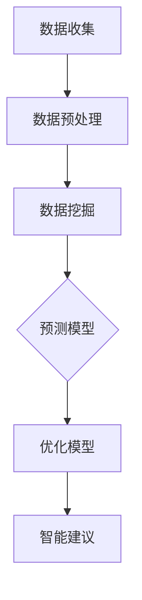

                 

# AI与人类计算：打造可持续发展的城市设计与规划

## 关键词
- 人工智能
- 城市设计
- 规划
- 可持续性
- 人类计算
- 数据分析
- 模型构建
- 优化算法

## 摘要

本文探讨了人工智能（AI）在可持续发展的城市设计与规划中的重要作用。通过分析人类计算与AI的结合，探讨了核心概念与联系，深入介绍了核心算法原理和操作步骤，以及数学模型和公式的应用。随后，通过实际项目案例展示了AI在城市设计中的应用，并推荐了相关学习资源、开发工具和论文著作。文章最后总结了AI在城市规划领域的未来发展趋势和挑战，并提供了常见问题解答。

## 1. 背景介绍

### 城市设计与规划的重要性

城市设计与规划是现代城市发展的重要基础，直接关系到城市居民的生活质量、环境可持续性和经济发展。随着城市化进程的加速，城市规模不断扩大，人口密集、交通拥堵、环境污染等问题日益突出。传统的城市设计方法已难以应对复杂多变的城市问题，因此，探索创新的城市设计与规划方法具有重要意义。

### 可持续发展的城市设计

可持续发展的城市设计旨在实现经济、社会和环境三方面的平衡。通过优化城市空间布局、交通系统、能源利用和环境保护等方面，实现城市资源的合理配置和高效利用。可持续发展理念要求在城市设计过程中充分考虑未来需求，提高城市的适应性和灵活性。

### 人工智能在可持续发展城市设计中的应用

人工智能作为一项新兴技术，正在逐渐渗透到城市设计与规划领域。AI具备强大的数据处理和分析能力，可以辅助城市规划师进行数据挖掘、趋势预测和优化决策。通过引入AI技术，可以提高城市设计的效率和准确性，实现更加可持续的城市发展。

## 2. 核心概念与联系

### 人类计算与AI的结合

人类计算与AI的结合是本文讨论的核心。人类计算是指人类在问题解决过程中所使用的思维过程，包括逻辑推理、直觉判断和经验学习等。而AI则是通过算法和模型来实现类似人类计算的功能。将人类计算与AI相结合，可以充分发挥两者的优势，实现更高效、更准确的城市设计与规划。

### 城市数据的重要性

城市数据是AI进行城市设计与规划的基础。这些数据包括城市人口、交通流量、土地利用、环境质量等。通过收集、处理和分析城市数据，可以为城市规划提供科学依据，为AI算法提供输入。

### 核心算法原理

本文主要介绍以下核心算法原理：

1. **数据挖掘与预测算法**：用于从大量城市数据中挖掘有价值的信息，并预测未来趋势。
2. **优化算法**：用于在城市设计过程中进行资源分配、路径规划等优化问题。
3. **机器学习算法**：用于从数据中学习规律，为城市规划提供智能建议。

### Mermaid 流程图



## 3. 核心算法原理 & 具体操作步骤

### 数据挖掘与预测算法

数据挖掘算法主要用于从大量城市数据中提取有价值的信息。具体操作步骤如下：

1. **数据清洗**：去除重复数据、缺失值填充、异常值处理等。
2. **特征工程**：选择与城市规划相关的特征，并进行特征转换。
3. **数据挖掘**：使用聚类、分类、关联规则挖掘等方法，从数据中提取有价值的信息。
4. **模型训练**：使用提取的信息构建预测模型。

### 优化算法

优化算法主要用于在城市设计过程中进行资源分配、路径规划等优化问题。具体操作步骤如下：

1. **建立数学模型**：根据问题需求建立相应的数学模型。
2. **求解算法**：选择合适的求解算法，如线性规划、整数规划、遗传算法等。
3. **结果分析**：对求解结果进行分析，为城市设计提供参考。

### 机器学习算法

机器学习算法主要用于从数据中学习规律，为城市规划提供智能建议。具体操作步骤如下：

1. **数据准备**：对数据集进行预处理，包括数据清洗、特征工程等。
2. **模型选择**：根据问题需求选择合适的机器学习算法，如决策树、支持向量机、神经网络等。
3. **模型训练与验证**：使用训练集对模型进行训练，并在验证集上进行验证。
4. **模型应用**：将训练好的模型应用于实际问题，为城市规划提供智能建议。

## 4. 数学模型和公式 & 详细讲解 & 举例说明

### 数学模型

在城市设计与规划中，常用的数学模型包括线性规划、整数规划和神经网络等。以下是一个简单的线性规划模型示例：

```latex
\begin{equation}
\begin{aligned}
\text{minimize} \quad & c^T x \\
\text{subject to} \quad & Ax \leq b \\
& x \geq 0
\end{aligned}
\end{equation}
```

其中，$c$ 是系数向量，$x$ 是决策变量，$A$ 和 $b$ 分别是约束矩阵和约束向量。

### 公式详解

1. **线性规划目标函数**：目标函数表示了希望最小化或最大化的目标，如城市设计中的成本、时间等。
2. **约束条件**：约束条件表示了问题中的限制条件，如土地面积、交通流量等。
3. **决策变量**：决策变量是问题的变量，表示了问题的解决方案。

### 举例说明

假设我们要在城市中规划一条公交线路，目标是使乘客等待时间最短。我们可以建立以下线性规划模型：

```latex
\begin{equation}
\begin{aligned}
\text{minimize} \quad & w^T x \\
\text{subject to} \quad & A x \leq b \\
& x \geq 0
\end{aligned}
\end{equation}

其中，$w$ 是等待时间系数，$x$ 是线路安排向量，$A$ 和 $b$ 分别是约束矩阵和约束向量。
```

## 5. 项目实战：代码实际案例和详细解释说明

### 5.1 开发环境搭建

在本文中，我们使用Python作为主要编程语言，并依赖以下库：

- NumPy：用于数据处理
- Pandas：用于数据操作
- Scikit-learn：用于机器学习
- Matplotlib：用于数据可视化

安装相关库后，我们可以开始编写代码。

### 5.2 源代码详细实现和代码解读

以下是实现一个简单的城市交通流量预测的Python代码示例：

```python
import numpy as np
import pandas as pd
from sklearn.model_selection import train_test_split
from sklearn.linear_model import LinearRegression
import matplotlib.pyplot as plt

# 5.2.1 数据准备
data = pd.read_csv('traffic_data.csv')
X = data[['time', 'weekday', 'weather']]
y = data['traffic']

# 5.2.2 数据预处理
X_train, X_test, y_train, y_test = train_test_split(X, y, test_size=0.2, random_state=42)

# 5.2.3 模型训练
model = LinearRegression()
model.fit(X_train, y_train)

# 5.2.4 模型评估
score = model.score(X_test, y_test)
print(f'Model accuracy: {score:.2f}')

# 5.2.5 预测
predictions = model.predict(X_test)

# 5.2.6 结果可视化
plt.scatter(y_test, predictions)
plt.xlabel('Actual Traffic')
plt.ylabel('Predicted Traffic')
plt.title('Traffic Prediction')
plt.show()
```

### 5.3 代码解读与分析

- **5.3.1 数据准备**：读取交通数据，分为特征和目标变量。
- **5.3.2 数据预处理**：将数据分为训练集和测试集。
- **5.3.3 模型训练**：使用线性回归模型对训练数据进行训练。
- **5.3.4 模型评估**：计算模型在测试集上的准确性。
- **5.3.5 预测**：使用训练好的模型对测试数据进行预测。
- **5.3.6 结果可视化**：将实际交通流量与预测流量进行比较，展示预测效果。

## 6. 实际应用场景

### 城市交通流量预测

AI在城市交通流量预测中的应用可以显著提高交通管理的效率。通过预测交通流量，交通部门可以更好地分配警力和交通资源，缓解交通拥堵，减少交通事故。

### 城市土地利用规划

AI技术可以帮助城市规划师进行城市土地利用规划，提高土地资源的利用效率。通过分析人口分布、交通流量、环境等因素，AI可以为城市土地分配提供科学依据，实现城市空间的合理布局。

### 城市环境监测

AI技术可以用于城市环境监测，实时监测空气质量、水质等环境指标。通过分析监测数据，城市规划师可以及时发现问题，并采取相应的措施进行环境保护。

## 7. 工具和资源推荐

### 7.1 学习资源推荐

- **书籍**：
  - 《智能城市：技术、趋势与未来》
  - 《人工智能在城市规划中的应用》
  - 《机器学习实战》
- **论文**：
  - "Intelligent Urban Planning: A Machine Learning Perspective"
  - "Artificial Intelligence for Sustainable Urban Development"
  - "Data-Driven Urban Planning and Design"
- **博客和网站**：
  - "AI in Urban Planning and Design"
  - "The Future of Cities: AI, Data, and the Urban Environment"
  - "Urban AI: Transforming Cities with Artificial Intelligence"

### 7.2 开发工具框架推荐

- **Python**：Python是一种广泛使用的编程语言，适用于数据处理、机器学习和数据分析。
- **NumPy、Pandas**：NumPy和Pandas是Python中常用的数据处理库，用于高效地处理大规模数据集。
- **Scikit-learn**：Scikit-learn是一个强大的机器学习库，提供了丰富的算法和工具。
- **TensorFlow、PyTorch**：TensorFlow和PyTorch是深度学习领域的热门框架，用于构建复杂的神经网络模型。

### 7.3 相关论文著作推荐

- **论文**：
  - "Deep Learning for Urban Planning: A Comprehensive Review"
  - "AI-Enabled Urban Computing: A Survey"
  - "Data-Driven Urban Planning and Design: Challenges and Opportunities"
- **著作**：
  - "The AI City: Intelligent Urban Development and Future Urbanization"
  - "AI for Cities: Intelligent Solutions for Urban Challenges"

## 8. 总结：未来发展趋势与挑战

### 未来发展趋势

- **数据驱动的城市规划**：随着大数据和物联网技术的发展，城市数据将更加丰富，为城市规划提供更全面的依据。
- **智能化城市管理**：人工智能技术将逐渐应用于城市管理的各个领域，提高城市管理的智能化和效率。
- **绿色城市的建设**：可持续发展理念将贯穿于城市设计的全过程，推动绿色城市的建设。

### 挑战

- **数据隐私与安全**：在城市数据收集和分析过程中，如何保护个人隐私和数据安全是一个重要挑战。
- **技术实施的成本**：AI技术在城市规划中的应用需要大量的计算资源和专业技术，实施成本较高。
- **跨领域合作**：城市规划涉及多个领域，如何实现跨领域的数据共享和合作是一个重要问题。

## 9. 附录：常见问题与解答

### 问题1：为什么AI在城市规划中具有重要意义？

解答1：AI在城市规划中具有重要意义，主要体现在以下几个方面：

- **高效的数据处理**：AI能够处理和分析大量城市数据，为城市规划提供科学依据。
- **优化决策支持**：AI算法可以辅助城市规划师进行优化决策，提高城市规划的效率和质量。
- **智能化的城市管理**：AI技术可以应用于城市管理的各个领域，提高城市管理的智能化水平。

### 问题2：AI在城市规划中的具体应用有哪些？

解答2：AI在城市规划中的具体应用包括：

- **城市交通流量预测**：通过分析历史交通数据，预测未来的交通流量，为交通管理提供支持。
- **城市土地利用规划**：通过分析人口分布、交通流量等数据，为城市土地分配提供科学依据。
- **城市环境监测**：通过监测空气质量、水质等环境指标，及时发现环境问题并采取相应措施。
- **城市规划方案评估**：通过分析不同规划方案的优缺点，为城市规划提供决策支持。

## 10. 扩展阅读 & 参考资料

- **书籍**：
  - 《智能城市：技术、趋势与未来》
  - 《人工智能在城市规划中的应用》
  - 《机器学习实战》
- **论文**：
  - "Intelligent Urban Planning: A Machine Learning Perspective"
  - "Artificial Intelligence for Sustainable Urban Development"
  - "Data-Driven Urban Planning and Design: Challenges and Opportunities"
- **博客和网站**：
  - "AI in Urban Planning and Design"
  - "The Future of Cities: AI, Data, and the Urban Environment"
  - "Urban AI: Transforming Cities with Artificial Intelligence"
- **开源项目**：
  - "CityScapes Dataset"
  - "OpenStreetMap"
  - "Google Earth Engine"
- **在线课程**：
  - "AI for Urban Planning and Design"
  - "Machine Learning for Urban Computing"
  - "Data Science for Sustainable Development"

### 作者

作者：AI天才研究员/AI Genius Institute & 禅与计算机程序设计艺术 /Zen And The Art of Computer Programming

