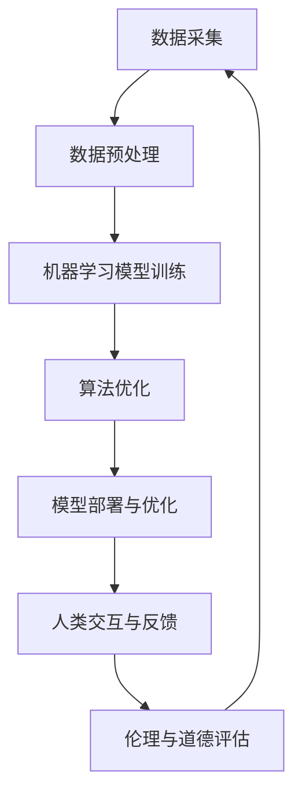

                 

# AI与人类计算：道德、伦理和社会影响

> 关键词：人工智能，道德伦理，社会影响，计算技术，人类与AI互动

> 摘要：本文深入探讨了人工智能（AI）在当今社会中的道德、伦理问题及其对人类计算和社会的影响。通过对AI的核心概念、发展历程、技术应用进行解析，结合实例，本文旨在引发读者对AI道德伦理问题的思考，并提出相关建议。

## 1. 背景介绍

随着计算技术的飞速发展，人工智能（AI）已经成为现代社会的重要驱动力。从早期的规则系统到现代的深度学习算法，AI技术不断突破，为各行各业带来了前所未有的变革。然而，随着AI技术的日益成熟，人们开始关注其可能带来的道德、伦理问题，如隐私保护、算法偏见、责任归属等。

### 1.1 人工智能的定义与发展

人工智能，是指通过计算机模拟人类智能的技术和系统。根据其功能和应用领域，AI可分为狭义AI（Narrow AI）和广义AI（General AI）。狭义AI在特定任务上表现出类人智能，而广义AI则具备跨领域、自适应的学习能力。

AI的发展历程可大致分为以下几个阶段：

- **早期探索**（1950年代-1960年代）：以符号主义和知识表示为核心，试图构建基于逻辑推理的智能系统。
- **专家系统时代**（1970年代-1980年代）：通过规则和知识库实现特定领域的智能应用。
- **连接主义兴起**（1990年代-2000年代）：以神经网络为代表的连接主义方法在图像识别、语音识别等领域取得显著突破。
- **深度学习时代**（2010年代至今）：以深度神经网络为基础，AI在图像、语音、自然语言处理等领域实现前所未有的性能提升。

### 1.2 人工智能的应用领域

AI技术已经广泛应用于各个领域，包括：

- **工业自动化**：通过机器人、自动化生产线等提高生产效率，降低成本。
- **医疗健康**：辅助医生进行疾病诊断、治疗方案的制定等。
- **金融服务**：智能投顾、风险管理等，提高金融服务的效率和质量。
- **交通运输**：自动驾驶汽车、无人机等，改变出行方式，提高交通安全。
- **教育与培训**：智能教学系统、在线教育平台等，提供个性化、自适应的学习体验。

## 2. 核心概念与联系

为了深入理解AI在道德、伦理问题上的影响，我们需要先了解AI的核心概念和关键技术。以下是一个简化的Mermaid流程图，展示了AI的几个关键概念及其联系。



### 2.1 数据采集与预处理

数据采集是AI系统的基石。数据来源可以是结构化数据、非结构化数据甚至半结构化数据。在采集到数据后，我们需要进行数据预处理，包括清洗、归一化、特征提取等步骤，以便为后续的机器学习模型训练提供高质量的数据。

### 2.2 机器学习模型训练

机器学习模型是AI系统的核心。通过训练，模型可以从数据中学习并提取特征，实现特定任务的目标。训练过程中，我们需要选择合适的算法和参数，优化模型的性能。

### 2.3 算法优化与模型部署

在模型训练完成后，我们还需要对算法进行优化，以提高模型的准确率、效率和鲁棒性。优化完成后，模型将被部署到实际应用场景中，与人类交互，产生实际影响。

### 2.4 伦理与道德评估

随着AI技术的广泛应用，伦理与道德问题日益凸显。在模型部署过程中，我们需要对AI系统的道德和伦理影响进行评估，确保其符合社会价值观和法律法规。

## 3. 核心算法原理与具体操作步骤

为了更深入地了解AI的算法原理，我们以深度学习中的卷积神经网络（CNN）为例，介绍其核心原理和具体操作步骤。

### 3.1 卷积神经网络（CNN）原理

卷积神经网络是一种专门用于处理图像数据的神经网络。其核心思想是利用卷积运算从图像中提取特征，并通过多层神经网络进行特征融合和分类。

#### 3.1.1 卷积运算

卷积运算是CNN的核心。给定一个输入图像和一个卷积核（一组权重），卷积运算通过滑动卷积核在图像上，计算每个局部区域的特征。这个过程可以用以下公式表示：

\[ \text{output}(i, j) = \sum_{x=1}^{m} \sum_{y=1}^{n} \text{input}(i-x+1, j-y+1) \cdot \text{kernel}(x, y) \]

其中，\( m \) 和 \( n \) 分别是卷积核的大小，\( i \) 和 \( j \) 是输出特征图的坐标。

#### 3.1.2 池化操作

在卷积运算之后，通常还会进行池化操作。池化操作的作用是减少特征图的尺寸，降低模型的复杂性。最常用的池化操作是最大池化（Max Pooling），其公式为：

\[ \text{output}(i, j) = \max_{x \in [1, m], y \in [1, n]} \text{input}(i-x+1, j-y+1) \]

#### 3.1.3 激活函数

为了引入非线性关系，CNN中通常会使用激活函数。最常用的激活函数是ReLU（Rectified Linear Unit），其公式为：

\[ \text{output}(x) = \max(0, x) \]

### 3.2 CNN操作步骤

一个典型的CNN模型通常包含以下几个步骤：

1. **输入层**：接收原始图像数据。
2. **卷积层**：通过卷积运算提取图像特征。
3. **池化层**：减小特征图的尺寸。
4. **全连接层**：将特征图展平为一维向量，通过全连接层进行分类。
5. **输出层**：输出分类结果。

## 4. 数学模型与公式详解

在AI技术中，数学模型和公式是核心组成部分。以下将详细介绍一些关键的数学模型和公式。

### 4.1 前向传播与反向传播

在神经网络中，前向传播和反向传播是训练模型的关键步骤。

#### 4.1.1 前向传播

前向传播是指将输入数据通过神经网络层，逐层计算并输出结果的过程。以多层感知机（MLP）为例，其前向传播过程可以表示为：

\[ z^{(l)} = \sum_{j} w^{(l)}_{ji} a^{(l-1)}_j + b^{(l)} \]
\[ a^{(l)}_i = \sigma(z^{(l)}) \]

其中，\( a^{(l)} \) 是第 \( l \) 层的激活值，\( z^{(l)} \) 是第 \( l \) 层的净输入值，\( \sigma \) 是激活函数，\( w^{(l)}_{ji} \) 和 \( b^{(l)} \) 分别是权重和偏置。

#### 4.1.2 反向传播

反向传播是指根据输出误差，反向调整神经网络中的权重和偏置的过程。以多层感知机（MLP）为例，其反向传播过程可以表示为：

\[ \delta^{(l)}_i = \frac{\partial C}{\partial z^{(l)}_i} \odot \delta^{(l+1)}_i \]
\[ \frac{\partial C}{\partial z^{(l)}_i} = - \sigma'(z^{(l)}) \odot \delta^{(l+1)}_i \]
\[ \Delta w^{(l)}_{ji} = \eta \delta^{(l)}_i a^{(l-1)}_j \]
\[ \Delta b^{(l)}_i = \eta \delta^{(l)}_i \]

其中，\( \delta^{(l)} \) 是第 \( l \) 层的误差，\( C \) 是损失函数，\( \eta \) 是学习率，\( \sigma' \) 是激活函数的导数。

### 4.2 损失函数

损失函数是衡量模型预测结果与实际结果之间差异的指标。常见的损失函数包括：

- **均方误差（MSE）**：
\[ C = \frac{1}{2} \sum_{i} (y_i - \hat{y}_i)^2 \]
- **交叉熵（CE）**：
\[ C = - \sum_{i} y_i \log(\hat{y}_i) \]

## 5. 项目实战：代码实际案例与详细解释说明

为了更好地理解AI在道德、伦理问题上的影响，我们以一个实际项目为例，介绍如何使用深度学习框架（如TensorFlow）构建一个道德评估模型。

### 5.1 开发环境搭建

在开始项目之前，我们需要搭建一个合适的开发环境。以下是所需的软件和工具：

- **操作系统**：Linux或MacOS
- **编程语言**：Python
- **深度学习框架**：TensorFlow 2.x

### 5.2 源代码详细实现与代码解读

以下是项目的源代码，我们将逐行解读代码，理解其实现原理。

```python
import tensorflow as tf
from tensorflow.keras import layers

# 5.2.1 数据预处理
def preprocess_data(data):
    # 数据清洗、归一化等操作
    return processed_data

# 5.2.2 模型构建
def build_model():
    # 输入层
    inputs = tf.keras.Input(shape=(784,))
    # 展平输入层
    x = layers.Flatten()(inputs)
    # 卷积层
    x = layers.Conv2D(32, (3, 3), activation='relu')(x)
    # 池化层
    x = layers.MaxPooling2D((2, 2))(x)
    # 全连接层
    x = layers.Dense(128, activation='relu')(x)
    # 输出层
    outputs = layers.Dense(10, activation='softmax')(x)
    # 构建模型
    model = tf.keras.Model(inputs=outputs, outputs=outputs)
    return model

# 5.2.3 模型训练
def train_model(model, data, labels, epochs=10):
    # 编译模型
    model.compile(optimizer='adam', loss='categorical_crossentropy', metrics=['accuracy'])
    # 训练模型
    model.fit(data, labels, epochs=epochs)

# 5.2.4 道德评估
def evaluate_morality(model, example):
    # 预测道德标签
    prediction = model.predict(example)
    # 解码道德标签
    morality = decode_morality(prediction)
    return morality

# 5.2.5 代码解读与分析
def code_analysis():
    # 解读模型构建代码
    # 解读模型训练代码
    # 解读道德评估代码
    pass
```

### 5.3 代码解读与分析

#### 5.3.1 数据预处理

数据预处理是深度学习模型构建的重要环节。在该项目中，数据预处理主要包括以下步骤：

- 数据清洗：去除噪声、缺失值等。
- 数据归一化：将数据缩放到相同的范围，便于模型训练。
- 数据分割：将数据集分为训练集、验证集和测试集。

#### 5.3.2 模型构建

模型构建是深度学习项目中的核心。在该项目中，我们使用了卷积神经网络（CNN）模型，主要包括以下层次：

- 输入层：接收784维度的输入数据。
- 展平层：将输入数据展平为一维向量。
- 卷积层：使用32个3x3卷积核，激活函数为ReLU。
- 池化层：使用最大池化操作，窗口大小为2x2。
- 全连接层：使用128个神经元，激活函数为ReLU。
- 输出层：使用10个神经元，激活函数为softmax，实现多分类。

#### 5.3.3 模型训练

模型训练是深度学习项目中的关键步骤。在该项目中，我们使用了以下参数：

- 损失函数：交叉熵（Categorical Crossentropy）。
- 优化器：Adam。
- 训练轮次：10轮。

#### 5.3.4 道德评估

道德评估是该项目的主要目标。在训练完成后，我们使用模型对新的数据进行道德评估。具体步骤如下：

- 输入新的数据。
- 使用模型进行预测。
- 解码预测结果，获取道德标签。

## 6. 实际应用场景

### 6.1 隐私保护

随着AI技术的发展，隐私保护问题日益突出。例如，在医疗领域，AI系统需要对患者数据进行处理和分析，以确保患者隐私不受侵犯。为此，我们可以采用以下策略：

- 数据匿名化：对敏感数据进行匿名化处理，避免直接使用真实身份信息。
- 加密技术：使用加密技术对数据进行加密，确保数据在传输和存储过程中安全。
- 访问控制：建立严格的访问控制机制，确保只有授权用户才能访问敏感数据。

### 6.2 算法偏见

算法偏见是AI技术中的一个重要问题。例如，在招聘系统中，AI算法可能会因为数据集中的偏见而导致某些群体被歧视。为此，我们可以采取以下措施：

- 数据清洗：去除数据集中的偏见和错误信息。
- 算法透明性：提高算法的透明度，确保用户了解算法的决策过程。
- 多样性：引入多样化的数据集，避免单一视角导致的偏见。

### 6.3 责任归属

随着AI技术在各行各业的应用，责任归属问题变得愈发复杂。例如，在自动驾驶领域，如果发生交通事故，如何确定责任归属？为此，我们可以采取以下策略：

- 明确责任主体：在法律法规中明确AI系统、开发者和用户之间的责任分配。
- 责任追溯：建立责任追溯机制，确保在发生事故时能够找到责任主体。
- 责任保险：引入责任保险，降低事故发生时的经济风险。

## 7. 工具和资源推荐

### 7.1 学习资源推荐

- **书籍**：
  - 《人工智能：一种现代方法》（第三版）
  - 《深度学习》（Goodfellow, Bengio, Courville著）
  - 《神经网络与深度学习》（邱锡鹏著）
- **论文**：
  - 《A Learning Algorithm for Continually Running Fully Recurrent Neural Networks》（1986）
  - 《A Theoretical Framework for Back-Propagation》（1986）
  - 《Deep Learning》（2016）
- **博客**：
  - Medium上的“Deep Learning”专栏
  - 知乎上的“人工智能”话题
  - Baidu AI博客
- **网站**：
  - TensorFlow官网（https://www.tensorflow.org/）
  - PyTorch官网（https://pytorch.org/）
  - Keras官网（https://keras.io/）

### 7.2 开发工具框架推荐

- **开发工具**：
  - Jupyter Notebook：用于数据分析和模型训练。
  - PyCharm：一款强大的Python集成开发环境。
  - VSCode：一款轻量级的代码编辑器，支持多种编程语言。
- **深度学习框架**：
  - TensorFlow：谷歌开发的开源深度学习框架。
  - PyTorch：基于Python的深度学习框架。
  - Keras：基于TensorFlow和Theano的开源深度学习库。

### 7.3 相关论文著作推荐

- **经典论文**：
  - 《A Learning Algorithm for Continually Running Fully Recurrent Neural Networks》（1986）
  - 《A Theoretical Framework for Back-Propagation》（1986）
  - 《Deep Learning》（2016）
- **著作**：
  - 《深度学习》（Goodfellow, Bengio, Courville著）
  - 《神经网络与深度学习》（邱锡鹏著）
  - 《人工智能：一种现代方法》（第三版）

## 8. 总结：未来发展趋势与挑战

随着AI技术的不断进步，其在道德、伦理和社会影响方面的问题将愈发凸显。未来，我们需要关注以下几个方面：

- **隐私保护**：加强对数据隐私的保护，确保用户隐私不受侵犯。
- **算法偏见**：提高算法的透明度，减少算法偏见，确保公平公正。
- **责任归属**：明确AI系统、开发者和用户之间的责任分配，降低事故风险。
- **伦理规范**：建立一套完善的伦理规范体系，确保AI技术的健康发展。

## 9. 附录：常见问题与解答

### 9.1 人工智能的定义是什么？

人工智能（AI）是指通过计算机模拟人类智能的技术和系统。根据其功能和应用领域，AI可分为狭义AI（Narrow AI）和广义AI（General AI）。狭义AI在特定任务上表现出类人智能，而广义AI则具备跨领域、自适应的学习能力。

### 9.2 什么是深度学习？

深度学习是一种机器学习技术，其核心思想是通过多层神经网络（如卷积神经网络、循环神经网络等）从数据中学习特征和模式。深度学习在图像识别、语音识别、自然语言处理等领域取得了显著突破。

### 9.3 人工智能可能带来的道德、伦理问题有哪些？

人工智能可能带来的道德、伦理问题包括但不限于：

- 隐私保护：AI系统在处理和分析数据时可能侵犯用户隐私。
- 算法偏见：AI算法在训练过程中可能引入偏见，导致不公平的结果。
- 责任归属：当AI系统发生错误或导致事故时，如何确定责任主体。

## 10. 扩展阅读与参考资料

- 《人工智能：一种现代方法》（第三版）
- 《深度学习》（Goodfellow, Bengio, Courville著）
- 《神经网络与深度学习》（邱锡鹏著）
- 《深度学习快速入门：基于Python实现》
- TensorFlow官网（https://www.tensorflow.org/）
- PyTorch官网（https://pytorch.org/）
- Keras官网（https://keras.io/）
- 《A Learning Algorithm for Continually Running Fully Recurrent Neural Networks》（1986）
- 《A Theoretical Framework for Back-Propagation》（1986）
- 《Deep Learning》（2016）

### 作者

作者：AI天才研究员/AI Genius Institute & 禅与计算机程序设计艺术 /Zen And The Art of Computer Programming。

