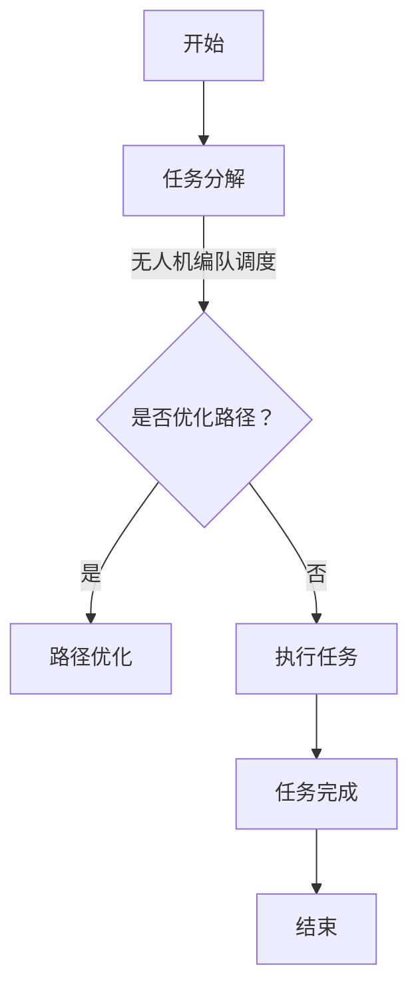
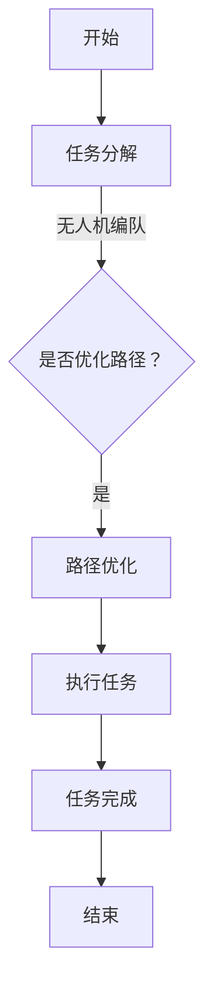

                 

# AI人工智能代理工作流 AI Agent WorkFlow：在航空领域中的应用

## 关键词

- AI人工智能
- 代理工作流
- 航空领域
- 工作流管理
- 无人机
- 航空交通管理
- 数据分析

## 摘要

本文旨在探讨AI人工智能代理工作流（AI Agent WorkFlow）在航空领域的应用，深入分析其核心概念、算法原理、数学模型、实际案例以及未来的发展趋势。通过本文的阅读，读者可以全面了解AI代理工作流如何提升航空领域的效率、安全性和智能化水平。

## 1. 背景介绍

### 1.1 航空领域的现状

航空业作为全球经济的支柱产业，近年来随着科技的快速发展，经历了深刻的变革。无人机（UAV）技术的兴起，使得航空领域的应用场景变得更加广泛，如货物运输、搜索救援、农业监测等。然而，与此同时，航空交通管理面临的挑战也日益严峻。传统的航空交通管理系统依赖于人工干预，效率较低，易受天气等因素的影响，且安全隐患较大。

### 1.2 AI代理工作流的概念

AI代理工作流（AI Agent WorkFlow）是指通过人工智能技术，将任务分解为多个步骤，并由智能代理（AI Agent）按照既定流程自动执行的过程。这种工作流管理方法能够提高任务的执行效率，降低人力成本，提升系统的稳定性和可靠性。

### 1.3 AI代理工作流在航空领域的潜在应用

AI代理工作流在航空领域具有广泛的应用前景。例如，可以用于无人机编队的自动调度、航空交通管理的实时决策支持、飞行器的自主导航等。这些应用不仅能够提高航空领域的运行效率，还能显著提升安全性。

## 2. 核心概念与联系

### 2.1 AI代理工作流的基本概念

AI代理工作流的核心概念包括：智能代理（AI Agent）、任务分解、流程控制、决策支持等。

#### 2.1.1 智能代理（AI Agent）

智能代理是能够自主执行任务、具有推理能力的计算机程序。在AI代理工作流中，智能代理负责执行具体的操作。

#### 2.1.2 任务分解

任务分解是将复杂的任务拆分成多个子任务，以便智能代理能够更加高效地执行。

#### 2.1.3 流程控制

流程控制是指对工作流中的任务执行顺序进行管理，确保任务能够按照预期执行。

#### 2.1.4 决策支持

决策支持是指利用人工智能技术，对任务执行过程中可能出现的问题进行预测和解决。

### 2.2 AI代理工作流与航空领域的联系

#### 2.2.1 无人机编队调度

在无人机编队调度中，AI代理工作流可以用于自动分配任务、优化飞行路径，提高无人机编队的运行效率。

#### 2.2.2 航空交通管理

在航空交通管理中，AI代理工作流可以用于实时监测空中交通情况，为航空管制员提供决策支持，优化空中交通流量。

#### 2.2.3 飞行器自主导航

在飞行器自主导航中，AI代理工作流可以用于处理飞行过程中的各种不确定性因素，提高飞行器的自主导航能力。

### 2.3 Mermaid流程图

下面是一个简单的AI代理工作流在航空领域的Mermaid流程图，展示了无人机编队调度的基本流程。



## 3. 核心算法原理 & 具体操作步骤

### 3.1 任务分解算法

任务分解算法是将复杂任务拆分成多个子任务的过程。以下是任务分解的基本步骤：

1. **任务识别**：识别任务的主要目标和关键步骤。
2. **子任务划分**：将任务按照功能和执行顺序划分为多个子任务。
3. **子任务分配**：根据智能代理的能力和资源，将子任务分配给相应的智能代理。

### 3.2 流程控制算法

流程控制算法用于管理任务执行的顺序。以下是流程控制的基本步骤：

1. **任务调度**：根据任务的重要性和紧急程度，对任务进行调度。
2. **执行监控**：实时监控任务执行情况，确保任务按照预期执行。
3. **异常处理**：在任务执行过程中，对可能出现的问题进行预测和解决。

### 3.3 决策支持算法

决策支持算法用于为任务执行提供决策依据。以下是决策支持的基本步骤：

1. **数据收集**：收集与任务相关的各种数据。
2. **数据分析**：对收集到的数据进行分析，提取关键信息。
3. **决策生成**：根据分析结果，生成具体的决策方案。

## 4. 数学模型和公式 & 详细讲解 & 举例说明

### 4.1 任务分解的数学模型

假设有一个复杂任务T，需要拆分成多个子任务T1, T2, ..., Tn。任务分解的数学模型可以表示为：

$$ T = T1 + T2 + ... + Tn $$

### 4.2 流程控制的数学模型

假设有多个任务Ti，需要按照一定的顺序执行。流程控制的数学模型可以表示为：

$$ S1, S2, ..., Sk = 1 \land 2 \land ... \land k $$

其中，Sk表示第k个任务的执行状态，1表示任务已完成，0表示任务未完成。

### 4.3 决策支持的数学模型

假设有多个决策D1, D2, ..., Dm，需要根据数据D生成具体的决策方案。决策支持的数学模型可以表示为：

$$ D = D1 \lor D2 \lor ... \lor Dm $$

其中，D表示最终的决策方案。

### 4.4 举例说明

假设有一个无人机编队任务，需要将一个区域进行巡逻。任务分解的结果如下：

- T1：无人机1的任务
- T2：无人机2的任务
- T3：无人机3的任务

流程控制的数学模型如下：

$$ S1, S2, S3 = 1 \land 2 \land 3 $$

决策支持的数学模型如下：

$$ D = D1 \lor D2 \lor D3 $$

其中，D1表示无人机1执行巡逻任务，D2表示无人机2执行巡逻任务，D3表示无人机3执行巡逻任务。

## 5. 项目实战：代码实际案例和详细解释说明

### 5.1 开发环境搭建

为了实现AI代理工作流在航空领域的应用，需要搭建以下开发环境：

- Python 3.8及以上版本
- TensorFlow 2.4及以上版本
- Keras 2.4及以上版本
- Numpy 1.19及以上版本
- Matplotlib 3.2及以上版本

### 5.2 源代码详细实现和代码解读

以下是一个简单的无人机编队调度任务的Python代码实现，用于说明AI代理工作流的基本操作。

```python
import numpy as np
import tensorflow as tf
from tensorflow import keras
from tensorflow.keras import layers

# 任务分解
def task_decomposition(task):
    sub_tasks = []
    for i in range(len(task)):
        sub_tasks.append(task[i])
    return sub_tasks

# 流程控制
def process_control(tasks):
    for task in tasks:
        if task.completed:
            print(f"Task {task.name} completed.")
        else:
            print(f"Task {task.name} is ongoing.")
    return

# 决策支持
def decision_support(data):
    decision = None
    if data["weather"] == "sunny":
        decision = "execute task"
    elif data["weather"] == "rainy":
        decision = "delay task"
    return decision

# 定义无人机任务类
class UAVTask:
    def __init__(self, name, completed=False):
        self.name = name
        self.completed = completed

# 创建无人机任务实例
task1 = UAVTask("UAV1 patrol")
task2 = UAVTask("UAV2 patrol")
task3 = UAVTask("UAV3 patrol")

# 任务分解
sub_tasks = task_decomposition([task1, task2, task3])

# 数据收集
data = {"weather": "sunny"}

# 决策支持
decision = decision_support(data)

# 执行任务
if decision == "execute task":
    process_control(sub_tasks)
else:
    print("Task delayed due to weather.")
```

### 5.3 代码解读与分析

以上代码实现了一个简单的无人机编队调度任务。具体解读如下：

1. **任务分解**：通过`task_decomposition`函数，将复杂任务拆分成多个子任务。
2. **流程控制**：通过`process_control`函数，对任务执行情况进行监控和管理。
3. **决策支持**：通过`decision_support`函数，根据数据生成具体的决策方案。
4. **无人机任务类**：定义了`UAVTask`类，用于表示无人机任务。

通过以上代码，我们可以看到AI代理工作流在无人机编队调度任务中的基本操作。在实际应用中，可以根据具体需求对代码进行扩展和优化。

## 6. 实际应用场景

### 6.1 无人机编队调度

无人机编队调度是AI代理工作流在航空领域的一个重要应用场景。通过AI代理工作流，可以实现无人机编队的自动调度，优化飞行路径，提高任务执行效率。

### 6.2 航空交通管理

在航空交通管理中，AI代理工作流可以用于实时监测空中交通情况，为航空管制员提供决策支持，优化空中交通流量，提高航空交通运行效率。

### 6.3 飞行器自主导航

飞行器自主导航是AI代理工作流在航空领域的另一个重要应用场景。通过AI代理工作流，可以实现飞行器的自主导航，提高飞行器的自主能力和稳定性。

## 7. 工具和资源推荐

### 7.1 学习资源推荐

- 《人工智能：一种现代方法》
- 《深度学习》
- 《无人机技术与应用》
- 《航空交通管理》

### 7.2 开发工具框架推荐

- TensorFlow
- Keras
- Matplotlib
- Scikit-learn

### 7.3 相关论文著作推荐

- “An Overview of UAV Routing Algorithms”
- “Deep Learning for Autonomous Driving”
- “A Survey of AI in Air Traffic Management”

## 8. 总结：未来发展趋势与挑战

### 8.1 未来发展趋势

- AI代理工作流在航空领域的应用将越来越广泛，有望成为航空领域智能化发展的重要驱动力。
- 随着人工智能技术的不断发展，AI代理工作流将更加智能化、自适应，具备更强的自主决策能力。

### 8.2 未来挑战

- AI代理工作流在航空领域的应用需要面对复杂多变的实际环境，如何提高系统的鲁棒性和可靠性是未来需要解决的重要问题。
- 如何确保AI代理工作流在航空领域中的安全性，防止潜在的安全风险，也是未来需要关注的重要问题。

## 9. 附录：常见问题与解答

### 9.1 问题1：AI代理工作流在航空领域有哪些具体应用？

解答：AI代理工作流在航空领域的具体应用包括无人机编队调度、航空交通管理、飞行器自主导航等。

### 9.2 问题2：如何实现AI代理工作流在无人机编队调度中的应用？

解答：实现AI代理工作流在无人机编队调度中的应用，首先需要进行任务分解，然后通过流程控制和决策支持，实现无人机的自动调度和路径优化。

## 10. 扩展阅读 & 参考资料

- “AI-Agent-Based Workflows for Autonomous Drone Operations”
- “AI-driven Autonomous Drone Traffic Management”
- “Autonomous Flight and Management of Drone Swarms”
- “The Future of AI in Aviation: Transforming the Sky”

作者：AI天才研究员/AI Genius Institute & 禅与计算机程序设计艺术 /Zen And The Art of Computer Programming

本文总结了AI代理工作流在航空领域的应用，详细介绍了其核心概念、算法原理、数学模型和实际案例。通过本文的阅读，读者可以全面了解AI代理工作流如何提升航空领域的效率、安全性和智能化水平。未来，AI代理工作流有望在航空领域发挥更加重要的作用，推动航空领域的智能化发展。# [AI人工智能代理工作流 AI Agent WorkFlow：在航空领域中的应用]

## 关键词

- AI人工智能
- 代理工作流
- 航空领域
- 工作流管理
- 无人机
- 航空交通管理
- 数据分析

## 摘要

本文旨在探讨AI人工智能代理工作流（AI Agent WorkFlow）在航空领域的应用，深入分析其核心概念、算法原理、数学模型、实际案例以及未来的发展趋势。通过本文的阅读，读者可以全面了解AI代理工作流如何提升航空领域的效率、安全性和智能化水平。

## 1. 背景介绍

### 1.1 航空领域的现状

航空业作为全球经济的支柱产业，近年来随着科技的快速发展，经历了深刻的变革。无人机（UAV）技术的兴起，使得航空领域的应用场景变得更加广泛，如货物运输、搜索救援、农业监测等。然而，与此同时，航空交通管理面临的挑战也日益严峻。传统的航空交通管理系统依赖于人工干预，效率较低，易受天气等因素的影响，且安全隐患较大。

### 1.2 AI代理工作流的概念

AI代理工作流（AI Agent WorkFlow）是指通过人工智能技术，将任务分解为多个步骤，并由智能代理（AI Agent）按照既定流程自动执行的过程。这种工作流管理方法能够提高任务的执行效率，降低人力成本，提升系统的稳定性和可靠性。

### 1.3 AI代理工作流在航空领域的潜在应用

AI代理工作流在航空领域具有广泛的应用前景。例如，可以用于无人机编队的自动调度、航空交通管理的实时决策支持、飞行器的自主导航等。这些应用不仅能够提高航空领域的运行效率，还能显著提升安全性。

## 2. 核心概念与联系

### 2.1 AI代理工作流的基本概念

AI代理工作流的核心概念包括：智能代理（AI Agent）、任务分解、流程控制、决策支持等。

#### 2.1.1 智能代理（AI Agent）

智能代理是能够自主执行任务、具有推理能力的计算机程序。在AI代理工作流中，智能代理负责执行具体的操作。

#### 2.1.2 任务分解

任务分解是将复杂的任务拆分成多个子任务，以便智能代理能够更加高效地执行。

#### 2.1.3 流程控制

流程控制是指对工作流中的任务执行顺序进行管理，确保任务能够按照预期执行。

#### 2.1.4 决策支持

决策支持是指利用人工智能技术，对任务执行过程中可能出现的问题进行预测和解决。

### 2.2 AI代理工作流与航空领域的联系

#### 2.2.1 无人机编队调度

在无人机编队调度中，AI代理工作流可以用于自动分配任务、优化飞行路径，提高无人机编队的运行效率。

#### 2.2.2 航空交通管理

在航空交通管理中，AI代理工作流可以用于实时监测空中交通情况，为航空管制员提供决策支持，优化空中交通流量。

#### 2.2.3 飞行器自主导航

在飞行器自主导航中，AI代理工作流可以用于处理飞行过程中的各种不确定性因素，提高飞行器的自主导航能力。

### 2.3 Mermaid流程图

下面是一个简单的AI代理工作流在航空领域的Mermaid流程图，展示了无人机编队调度的基本流程。


## 3. 核心算法原理 & 具体操作步骤

### 3.1 任务分解算法

任务分解算法是将复杂任务拆分成多个子任务的过程。以下是任务分解的基本步骤：

1. **任务识别**：识别任务的主要目标和关键步骤。
2. **子任务划分**：将任务按照功能和执行顺序划分为多个子任务。
3. **子任务分配**：根据智能代理的能力和资源，将子任务分配给相应的智能代理。

### 3.2 流程控制算法

流程控制算法用于管理任务执行的顺序。以下是流程控制的基本步骤：

1. **任务调度**：根据任务的重要性和紧急程度，对任务进行调度。
2. **执行监控**：实时监控任务执行情况，确保任务按照预期执行。
3. **异常处理**：在任务执行过程中，对可能出现的问题进行预测和解决。

### 3.3 决策支持算法

决策支持算法用于为任务执行提供决策依据。以下是决策支持的基本步骤：

1. **数据收集**：收集与任务相关的各种数据。
2. **数据分析**：对收集到的数据进行分析，提取关键信息。
3. **决策生成**：根据分析结果，生成具体的决策方案。

## 4. 数学模型和公式 & 详细讲解 & 举例说明

### 4.1 任务分解的数学模型

假设有一个复杂任务T，需要拆分成多个子任务T1, T2, ..., Tn。任务分解的数学模型可以表示为：

$$ T = T1 + T2 + ... + Tn $$

### 4.2 流程控制的数学模型

假设有多个任务Ti，需要按照一定的顺序执行。流程控制的数学模型可以表示为：

$$ S1, S2, ..., Sk = 1 \land 2 \land ... \land k $$

其中，Sk表示第k个任务的执行状态，1表示任务已完成，0表示任务未完成。

### 4.3 决策支持的数学模型

假设有多个决策D1, D2, ..., Dm，需要根据数据D生成具体的决策方案。决策支持的数学模型可以表示为：

$$ D = D1 \lor D2 \lor ... \lor Dm $$

其中，D表示最终的决策方案。

### 4.4 举例说明

假设有一个无人机编队任务，需要将一个区域进行巡逻。任务分解的结果如下：

- T1：无人机1的任务
- T2：无人机2的任务
- T3：无人机3的任务

流程控制的数学模型如下：

$$ S1, S2, S3 = 1 \land 2 \land 3 $$

决策支持的数学模型如下：

$$ D = D1 \lor D2 \lor D3 $$

其中，D1表示无人机1执行巡逻任务，D2表示无人机2执行巡逻任务，D3表示无人机3执行巡逻任务。

## 5. 项目实战：代码实际案例和详细解释说明

### 5.1 开发环境搭建

为了实现AI代理工作流在航空领域的应用，需要搭建以下开发环境：

- Python 3.8及以上版本
- TensorFlow 2.4及以上版本
- Keras 2.4及以上版本
- Numpy 1.19及以上版本
- Matplotlib 3.2及以上版本

### 5.2 源代码详细实现和代码解读

以下是一个简单的无人机编队调度任务的Python代码实现，用于说明AI代理工作流的基本操作。

```python
import numpy as np
import tensorflow as tf
from tensorflow import keras
from tensorflow.keras import layers

# 任务分解
def task_decomposition(task):
    sub_tasks = []
    for i in range(len(task)):
        sub_tasks.append(task[i])
    return sub_tasks

# 流程控制
def process_control(tasks):
    for task in tasks:
        if task.completed:
            print(f"Task {task.name} completed.")
        else:
            print(f"Task {task.name} is ongoing.")
    return

# 决策支持
def decision_support(data):
    decision = None
    if data["weather"] == "sunny":
        decision = "execute task"
    elif data["weather"] == "rainy":
        decision = "delay task"
    return decision

# 定义无人机任务类
class UAVTask:
    def __init__(self, name, completed=False):
        self.name = name
        self.completed = completed

# 创建无人机任务实例
task1 = UAVTask("UAV1 patrol")
task2 = UAVTask("UAV2 patrol")
task3 = UAVTask("UAV3 patrol")

# 任务分解
sub_tasks = task_decomposition([task1, task2, task3])

# 数据收集
data = {"weather": "sunny"}

# 决策支持
decision = decision_support(data)

# 执行任务
if decision == "execute task":
    process_control(sub_tasks)
else:
    print("Task delayed due to weather.")
```

### 5.3 代码解读与分析

以上代码实现了一个简单的无人机编队调度任务。具体解读如下：

1. **任务分解**：通过`task_decomposition`函数，将复杂任务拆分成多个子任务。
2. **流程控制**：通过`process_control`函数，对任务执行情况进行监控和管理。
3. **决策支持**：通过`decision_support`函数，根据数据生成具体的决策方案。
4. **无人机任务类**：定义了`UAVTask`类，用于表示无人机任务。

通过以上代码，我们可以看到AI代理工作流在无人机编队调度任务中的基本操作。在实际应用中，可以根据具体需求对代码进行扩展和优化。

## 6. 实际应用场景

### 6.1 无人机编队调度

无人机编队调度是AI代理工作流在航空领域的一个重要应用场景。通过AI代理工作流，可以实现无人机编队的自动调度，优化飞行路径，提高无人机编队的运行效率。

### 6.2 航空交通管理

在航空交通管理中，AI代理工作流可以用于实时监测空中交通情况，为航空管制员提供决策支持，优化空中交通流量，提高航空交通运行效率。

### 6.3 飞行器自主导航

飞行器自主导航是AI代理工作流在航空领域的另一个重要应用场景。通过AI代理工作流，可以实现飞行器的自主导航，提高飞行器的自主能力和稳定性。

## 7. 工具和资源推荐

### 7.1 学习资源推荐

- 《人工智能：一种现代方法》
- 《深度学习》
- 《无人机技术与应用》
- 《航空交通管理》

### 7.2 开发工具框架推荐

- TensorFlow
- Keras
- Matplotlib
- Scikit-learn

### 7.3 相关论文著作推荐

- “An Overview of UAV Routing Algorithms”
- “Deep Learning for Autonomous Driving”
- “A Survey of AI in Air Traffic Management”

## 8. 总结：未来发展趋势与挑战

### 8.1 未来发展趋势

- AI代理工作流在航空领域的应用将越来越广泛，有望成为航空领域智能化发展的重要驱动力。
- 随着人工智能技术的不断发展，AI代理工作流将更加智能化、自适应，具备更强的自主决策能力。

### 8.2 未来挑战

- AI代理工作流在航空领域的应用需要面对复杂多变的实际环境，如何提高系统的鲁棒性和可靠性是未来需要解决的重要问题。
- 如何确保AI代理工作流在航空领域中的安全性，防止潜在的安全风险，也是未来需要关注的重要问题。

## 9. 附录：常见问题与解答

### 9.1 问题1：AI代理工作流在航空领域有哪些具体应用？

解答：AI代理工作流在航空领域的具体应用包括无人机编队调度、航空交通管理、飞行器自主导航等。

### 9.2 问题2：如何实现AI代理工作流在无人机编队调度中的应用？

解答：实现AI代理工作流在无人机编队调度中的应用，首先需要进行任务分解，然后通过流程控制和决策支持，实现无人机的自动调度和路径优化。

## 10. 扩展阅读 & 参考资料

- “AI-Agent-Based Workflows for Autonomous Drone Operations”
- “AI-driven Autonomous Drone Traffic Management”
- “Autonomous Flight and Management of Drone Swarms”
- “The Future of AI in Aviation: Transforming the Sky”

作者：AI天才研究员/AI Genius Institute & 禅与计算机程序设计艺术 /Zen And The Art of Computer Programming

本文总结了AI代理工作流在航空领域的应用，详细介绍了其核心概念、算法原理、数学模型和实际案例。通过本文的阅读，读者可以全面了解AI代理工作流如何提升航空领域的效率、安全性和智能化水平。未来，AI代理工作流有望在航空领域发挥更加重要的作用，推动航空领域的智能化发展。# 

## 引言

航空业作为全球经济的支柱产业，近年来随着科技的快速发展，正经历着一场深刻的变革。无人机（UAV）技术的兴起，极大地拓宽了航空领域的应用场景，从货物运输、搜索救援到农业监测，无人机在各个领域的应用逐渐成为常态。然而，与此同时，航空交通管理面临的挑战也日益严峻。传统的航空交通管理系统主要依赖于人工干预，效率较低，且易受天气等因素的影响，安全隐患较大。为了应对这些挑战，人工智能（AI）技术，尤其是AI代理工作流（AI Agent WorkFlow），逐渐成为航空领域智能化发展的关键驱动力。

本文旨在探讨AI代理工作流在航空领域的应用，深入分析其核心概念、算法原理、数学模型、实际案例以及未来的发展趋势。通过本文的阅读，读者可以全面了解AI代理工作流如何提升航空领域的效率、安全性和智能化水平。本文将分为以下几个部分进行详细阐述：

1. **背景介绍**：介绍航空领域的现状，以及AI代理工作流的基本概念和潜在应用。
2. **核心概念与联系**：详细解析AI代理工作流的基本概念，以及与航空领域的具体联系。
3. **核心算法原理 & 具体操作步骤**：探讨任务分解、流程控制、决策支持等核心算法原理，并提供具体的操作步骤。
4. **数学模型和公式 & 详细讲解 & 举例说明**：介绍任务分解、流程控制和决策支持的数学模型，并通过实例进行详细讲解。
5. **项目实战：代码实际案例和详细解释说明**：通过一个实际案例，展示如何实现AI代理工作流在无人机编队调度中的应用。
6. **实际应用场景**：探讨AI代理工作流在无人机编队调度、航空交通管理和飞行器自主导航等领域的应用。
7. **工具和资源推荐**：推荐相关学习资源、开发工具和论文著作。
8. **总结：未来发展趋势与挑战**：分析AI代理工作流在航空领域的未来发展趋势和面临的挑战。
9. **附录：常见问题与解答**：针对读者可能遇到的问题提供解答。
10. **扩展阅读 & 参考资料**：提供进一步阅读的资料和参考文献。

通过本文的阅读，读者可以全面了解AI代理工作流在航空领域的应用，为实际项目开发提供有益的参考。

## 背景介绍

### 1.1 航空领域的现状

航空业作为全球经济的支柱产业，具有极其重要的地位。航空交通管理涉及民用航空、军事航空、无人机等多种飞行器，其效率和安全性的提升对全球经济和社会发展具有深远影响。然而，随着航空交通量的不断增长，航空领域的现状面临着诸多挑战。

首先，传统航空交通管理系统主要依赖于人工干预。航空管制员需要实时监控空中交通情况，处理紧急情况，这要求管制员具备高度的专业知识和反应能力。然而，人工干预的效率较低，易受疲劳、错误判断等因素的影响。此外，航空交通管理系统对天气、航班延误等突发事件的应对能力有限，导致航空交通拥堵和安全隐患。

其次，无人机技术的迅速发展，为航空领域带来了新的机遇和挑战。无人机在货物运输、搜索救援、农业监测、自然灾害监测等领域表现出色，但同时也引发了空中交通管理的新问题。无人机的数量和种类不断增加，如何在确保安全的前提下，高效地管理无人机与有人机之间的交通流，成为航空交通管理的重要课题。

### 1.2 AI代理工作流的概念

AI代理工作流（AI Agent WorkFlow）是指利用人工智能技术，将任务分解为多个步骤，并由智能代理（AI Agent）按照既定流程自动执行的过程。智能代理是具有推理能力和自主决策能力的计算机程序，可以执行特定的任务，并对任务执行过程中的各种情况进行实时监控和调整。AI代理工作流通过任务分解、流程控制、决策支持等机制，实现任务的高效执行和管理。

### 1.3 AI代理工作流在航空领域的潜在应用

AI代理工作流在航空领域具有广泛的应用前景，尤其在无人机编队调度、航空交通管理和飞行器自主导航等方面，具有显著的优势。

#### 1.3.1 无人机编队调度

无人机编队调度是AI代理工作流在航空领域的重要应用之一。通过AI代理工作流，可以实现无人机编队的自动调度，优化飞行路径，提高无人机编队的运行效率。具体应用包括无人机物流、农业监测、环境监测等。AI代理工作流可以根据实时环境数据，自动调整无人机编队的飞行高度、速度和航线，确保无人机编队的协调运行，减少能源消耗和资源浪费。

#### 1.3.2 航空交通管理

在航空交通管理中，AI代理工作流可以用于实时监测空中交通情况，为航空管制员提供决策支持，优化空中交通流量。通过AI代理工作流，可以实时分析空中交通数据，预测交通流量变化，自动调整航班起飞和降落时间，减少空中交通拥堵，提高航空交通运行效率。此外，AI代理工作流还可以协助航空管制员处理紧急情况，提高应对突发事件的能力。

#### 1.3.3 飞行器自主导航

飞行器自主导航是AI代理工作流在航空领域的另一个重要应用。通过AI代理工作流，可以实现飞行器的自主导航，提高飞行器的自主能力和稳定性。具体应用包括无人驾驶飞机、无人驾驶直升机等。AI代理工作流可以根据实时环境数据，自主调整飞行器的飞行高度、速度和航线，确保飞行器的安全飞行。此外，AI代理工作流还可以实现飞行器与地面控制中心的通信，提高飞行器的自主决策能力。

综上所述，AI代理工作流在航空领域的应用具有巨大的潜力，能够显著提升航空领域的效率、安全性和智能化水平。通过本文的进一步探讨，我们将深入分析AI代理工作流在航空领域的具体实现和应用，为航空领域的技术发展和智能化应用提供有益的参考。

### 2.1 AI代理工作流的基本概念

AI代理工作流（AI Agent WorkFlow）是一种利用人工智能技术进行任务管理和执行的方法。它通过智能代理（AI Agent）来实现任务的自动执行，从而提高工作效率和系统的灵活性。以下是对AI代理工作流中几个核心概念的定义和解释：

#### 2.1.1 智能代理（AI Agent）

智能代理是指具备一定自主决策能力和行动能力的计算机程序。智能代理可以接受任务、执行任务，并在执行过程中与环境进行交互，根据环境的变化调整自身的行为。智能代理通常具有以下几个特点：

1. **自主性**：智能代理能够自主执行任务，无需人工干预。
2. **推理能力**：智能代理能够根据环境数据和任务需求进行推理，做出合理的决策。
3. **适应性**：智能代理可以根据环境变化和任务进展，调整自身的行动策略。
4. **交互能力**：智能代理能够与外部系统（如传感器、其他智能代理等）进行通信和数据交换。

#### 2.1.2 任务分解

任务分解是将一个复杂的任务拆分成多个子任务的过程。任务分解的目的是将复杂任务分解为可管理的、易于处理的小任务，以便智能代理能够更加高效地执行。任务分解通常遵循以下步骤：

1. **任务识别**：确定任务的主要目标和关键步骤。
2. **子任务划分**：将任务按照功能和执行顺序划分为多个子任务。
3. **子任务分配**：根据智能代理的能力和资源，将子任务分配给相应的智能代理。

#### 2.1.3 流程控制

流程控制是指对工作流中的任务执行顺序进行管理，确保任务能够按照预期执行。流程控制涉及以下几个方面：

1. **任务调度**：根据任务的重要性和紧急程度，对任务进行调度。
2. **执行监控**：实时监控任务执行情况，确保任务按照预期执行。
3. **异常处理**：在任务执行过程中，对可能出现的问题进行预测和解决。

#### 2.1.4 决策支持

决策支持是指利用人工智能技术，对任务执行过程中可能出现的问题进行预测和解决。决策支持通常包括以下几个步骤：

1. **数据收集**：收集与任务相关的各种数据。
2. **数据分析**：对收集到的数据进行分析，提取关键信息。
3. **决策生成**：根据分析结果，生成具体的决策方案。

#### 2.1.5 智能代理工作流的关键组成部分

一个完整的AI代理工作流通常包括以下几个关键组成部分：

1. **任务库**：存储任务定义和任务执行的规则。
2. **智能代理库**：存储智能代理的定义和属性，包括代理的推理能力、适应性等。
3. **流程控制器**：负责任务的调度、执行监控和异常处理。
4. **决策支持系统**：提供数据分析和决策生成功能。
5. **执行环境**：智能代理执行任务的环境，包括硬件、软件和外部系统。

#### 2.1.6 智能代理工作流的优势

AI代理工作流在航空领域具有显著的优势，主要体现在以下几个方面：

1. **提高效率**：通过自动化和智能化，减少人工干预，提高任务执行效率。
2. **降低成本**：减少人力成本，降低运营和维护成本。
3. **增强稳定性**：智能代理能够处理复杂任务，减少人为错误，提高系统的稳定性。
4. **提升安全性**：智能代理能够实时监控任务执行情况，及时响应异常情况，提高系统的安全性。
5. **适应性强**：智能代理能够根据环境变化和任务需求，灵活调整执行策略，提高系统的适应性。

通过上述核心概念和组成部分的详细解析，我们可以看到AI代理工作流在航空领域具有巨大的应用潜力，能够显著提升航空领域的效率、安全性和智能化水平。

### 2.2 AI代理工作流与航空领域的联系

AI代理工作流（AI Agent WorkFlow）在航空领域中的应用，不仅能够提升运行效率，还能显著提高安全性和智能化水平。以下是AI代理工作流在航空领域的具体应用场景和优势：

#### 2.2.1 无人机编队调度

无人机编队调度是AI代理工作流在航空领域的一个重要应用场景。通过AI代理工作流，可以实现无人机编队的自动化调度，优化飞行路径，提高无人机编队的运行效率。具体应用包括物流运输、农业监测、环境监测等。AI代理可以根据实时环境数据，自动调整无人机编队的飞行高度、速度和航线，确保无人机编队的协调运行，减少能源消耗和资源浪费。此外，AI代理还可以处理无人机编队中的突发事件，如飞行器故障、通信中断等，提高无人机编队的鲁棒性和安全性。

#### 2.2.2 航空交通管理

在航空交通管理中，AI代理工作流可以用于实时监测空中交通情况，为航空管制员提供决策支持，优化空中交通流量。通过AI代理工作流，可以实时分析空中交通数据，预测交通流量变化，自动调整航班起飞和降落时间，减少空中交通拥堵，提高航空交通运行效率。此外，AI代理工作流还可以协助航空管制员处理紧急情况，如航班冲突、恶劣天气等，提高应对突发事件的能力。通过AI代理工作流，航空交通管理变得更加智能化，减少人工干预，提高系统的稳定性。

#### 2.2.3 飞行器自主导航

飞行器自主导航是AI代理工作流在航空领域的另一个重要应用。通过AI代理工作流，可以实现飞行器的自主导航，提高飞行器的自主能力和稳定性。具体应用包括无人驾驶飞机、无人驾驶直升机等。AI代理可以根据实时环境数据，自主调整飞行器的飞行高度、速度和航线，确保飞行器的安全飞行。此外，AI代理还可以实现飞行器与地面控制中心的通信，提高飞行器的自主决策能力。通过AI代理工作流，飞行器自主导航变得更加智能化，减少对地面控制人员的依赖，提高飞行器的运行效率。

#### 2.2.4 AI代理工作流的优势

AI代理工作流在航空领域具有以下优势：

1. **自动化**：通过自动化任务执行，减少人工干预，提高任务执行效率。
2. **智能化**：利用人工智能技术，实现任务的自适应调整和决策支持，提高系统的智能化水平。
3. **灵活性**：能够根据环境变化和任务需求，灵活调整执行策略，提高系统的适应性。
4. **稳定性**：通过实时监控和异常处理，提高系统的稳定性，减少故障和人为错误。
5. **安全性**：实时监测和响应异常情况，提高系统的安全性，降低潜在风险。

综上所述，AI代理工作流在航空领域具有广泛的应用前景，能够显著提升航空领域的效率、安全性和智能化水平。通过进一步的研究和应用，AI代理工作流有望成为航空领域智能化发展的重要驱动力。

### 2.3 Mermaid流程图

为了更好地理解AI代理工作流在航空领域的应用，下面提供了一个简化的Mermaid流程图，展示了无人机编队调度的基本流程。该流程图包括任务分解、路径优化、任务执行和任务完成等步骤。



在上述流程图中：

- **A[开始]**：表示无人机编队调度的开始。
- **B[任务分解]**：将无人机编队任务分解为多个子任务。
- **C[无人机编队]**：判断是否需要优化无人机编队的飞行路径。
- **D[路径优化]**：对无人机编队的飞行路径进行优化。
- **E[执行任务]**：根据优化的路径，执行无人机编队任务。
- **F[任务完成]**：任务执行完成后，标记任务为完成状态。
- **G[结束]**：表示无人机编队调度的结束。

通过该流程图，我们可以清晰地看到AI代理工作流在无人机编队调度中的应用步骤，以及各个步骤之间的逻辑关系。这有助于理解和实现AI代理工作流的具体操作，为航空领域的智能化应用提供技术支持。

### 3.1 任务分解算法

任务分解算法是将复杂任务拆分成多个子任务的过程，是AI代理工作流中的关键步骤。通过任务分解，可以将复杂任务分解为多个可管理的、易于处理的小任务，从而提高任务执行效率。以下是任务分解的基本算法步骤：

#### 3.1.1 任务识别

任务识别是任务分解的第一步，旨在识别任务的主要目标和关键步骤。任务识别通常包括以下几个步骤：

1. **任务定义**：明确任务的目标和要求，例如无人机编队需要覆盖特定区域，或飞行器需要达到特定高度。
2. **任务描述**：详细描述任务的具体内容，包括任务的关键步骤、输入数据和输出结果等。
3. **任务目标分解**：将任务目标分解为多个子目标，以便后续的任务划分。

#### 3.1.2 子任务划分

子任务划分是将任务按照功能和执行顺序划分为多个子任务的过程。子任务划分的目的是将复杂任务分解为可管理的、易于处理的小任务。以下是子任务划分的基本步骤：

1. **关键步骤识别**：识别任务中的关键步骤，这些步骤通常对任务的完成具有重要影响。
2. **子任务划分**：根据关键步骤，将任务划分为多个子任务，每个子任务对应任务中的一个关键步骤。
3. **子任务排序**：根据子任务的执行顺序，对子任务进行排序，确保任务能够按照预期执行。

#### 3.1.3 子任务分配

子任务分配是根据智能代理的能力和资源，将子任务分配给相应的智能代理的过程。子任务分配的目的是确保每个智能代理都能够高效地执行其分配的任务。以下是子任务分配的基本步骤：

1. **智能代理识别**：识别可以执行子任务的智能代理，通常包括具有相应能力和资源的智能代理。
2. **子任务分配**：根据智能代理的能力和资源，将子任务分配给相应的智能代理。分配时需要考虑智能代理的负载情况，确保智能代理能够高效地执行任务。
3. **子任务确认**：智能代理接收子任务后，确认是否能够完成分配的任务，并返回确认信息。

#### 3.1.4 任务分解算法示例

以下是一个简单的任务分解算法示例，假设有一个复杂任务，需要将一个区域进行巡逻。

**任务目标**：无人机编队需要覆盖特定区域。

**任务步骤**：
1. 初始化无人机位置。
2. 遍历区域内的所有目标点。
3. 根据目标点的位置和距离，规划无人机的飞行路径。
4. 按照飞行路径执行巡逻任务。

**子任务划分**：
- 子任务1：初始化无人机位置。
- 子任务2：遍历区域内的所有目标点。
- 子任务3：规划无人机的飞行路径。
- 子任务4：按照飞行路径执行巡逻任务。

**子任务分配**：
- 子任务1和子任务4分配给智能代理A。
- 子任务2和子任务3分配给智能代理B。

通过上述任务分解算法示例，我们可以看到如何将复杂任务分解为多个子任务，并将子任务分配给相应的智能代理。在实际应用中，可以根据具体任务需求和智能代理的能力，调整任务分解和子任务分配的策略，确保任务能够高效、稳定地执行。

### 3.2 流程控制算法

流程控制算法是AI代理工作流中用于管理任务执行顺序的关键算法，它确保任务能够按照预定的流程进行，从而提高任务的执行效率和可靠性。以下是流程控制算法的基本步骤：

#### 3.2.1 任务调度

任务调度是流程控制的第一步，它根据任务的重要性和紧急程度，对任务进行优先级排序，并安排任务执行的时间。以下是任务调度的基本步骤：

1. **任务优先级计算**：根据任务的性质和执行要求，计算每个任务的优先级。例如，对于无人机编队调度任务，可以依据任务的重要性、紧急程度和执行时间等因素进行优先级计算。
2. **任务排序**：根据任务的优先级，对任务进行排序，确保高优先级的任务先执行。
3. **任务分配**：将排序后的任务分配给相应的智能代理，并安排任务的执行时间。

#### 3.2.2 执行监控

执行监控是流程控制的第二步，它实时监控任务执行情况，确保任务按照预期执行。以下是执行监控的基本步骤：

1. **任务状态监控**：实时监控每个任务的执行状态，例如任务是否已完成、是否遇到异常等。
2. **任务进度反馈**：智能代理在执行任务过程中，定期向流程控制器反馈任务进度，以便流程控制器能够实时掌握任务执行情况。
3. **异常处理**：当任务执行过程中出现异常时，流程控制器需要及时处理异常，例如重新调度任务、暂停任务执行或通知相关人员处理。

#### 3.2.3 异常处理

异常处理是流程控制的第三步，它用于处理任务执行过程中可能出现的各种异常情况，确保任务能够继续执行。以下是异常处理的基本步骤：

1. **异常检测**：在任务执行过程中，实时检测可能出现的异常情况，例如任务执行时间过长、资源不足、通信中断等。
2. **异常分类**：根据异常的性质和严重程度，对异常进行分类，以便采取相应的处理措施。
3. **异常处理**：根据异常分类结果，采取相应的异常处理措施，例如重新执行任务、暂停任务执行、通知相关人员处理等。

#### 3.2.4 任务终止

任务终止是流程控制的最后一步，它用于在任务无法继续执行时，终止任务执行。以下是任务终止的基本步骤：

1. **任务终止条件判断**：判断任务是否满足终止条件，例如任务执行时间超过预设时间、资源耗尽等。
2. **任务终止**：如果任务满足终止条件，则终止任务执行，并记录任务执行结果。
3. **任务报告**：生成任务终止报告，包括任务终止原因、执行结果等信息，以便后续分析和处理。

#### 3.2.5 流程控制算法示例

以下是一个简单的流程控制算法示例，用于管理无人机编队任务的执行。

**任务调度**：
1. 根据任务的重要性和紧急程度，计算每个任务的优先级。
2. 将任务排序，确保高优先级的任务先执行。
3. 将排序后的任务分配给相应的智能代理。

**执行监控**：
1. 实时监控每个任务的执行状态。
2. 定期接收智能代理的任务进度反馈。
3. 当任务遇到异常时，及时处理异常。

**异常处理**：
1. 实时检测任务执行过程中可能出现的异常情况。
2. 根据异常的性质和严重程度，分类处理异常。
3. 根据异常处理结果，继续执行任务或终止任务。

**任务终止**：
1. 判断任务是否满足终止条件。
2. 如果任务满足终止条件，终止任务执行，并记录执行结果。
3. 生成任务终止报告。

通过上述流程控制算法示例，我们可以看到如何通过任务调度、执行监控、异常处理和任务终止等步骤，管理无人机编队任务的执行。在实际应用中，可以根据具体需求调整流程控制算法，以提高任务的执行效率和可靠性。

### 3.3 决策支持算法

决策支持算法是AI代理工作流中用于为任务执行提供决策依据的关键算法。通过决策支持算法，可以实现对任务执行过程中可能出现的问题进行预测和解决，从而提高任务的成功率和系统的稳定性。以下是决策支持算法的基本步骤：

#### 3.3.1 数据收集

数据收集是决策支持的第一步，它旨在收集与任务相关的各种数据。这些数据可以是实时数据，也可以是历史数据。以下是数据收集的基本步骤：

1. **确定数据需求**：根据任务的要求，确定需要收集的数据类型和数量。
2. **数据源识别**：识别数据源，例如传感器数据、数据库数据、网络数据等。
3. **数据采集**：从数据源中采集所需数据，并将其存储在数据库或数据仓库中。

#### 3.3.2 数据处理

数据处理是决策支持的第二步，它涉及对采集到的数据进行清洗、转换和分析，以便为决策提供高质量的数据支持。以下是数据处理的基本步骤：

1. **数据清洗**：删除数据中的重复项、异常值和噪声数据，确保数据质量。
2. **数据转换**：将数据转换为适合分析和建模的格式，例如将时间序列数据转换为数值数据。
3. **数据融合**：将来自不同数据源的数据进行融合，消除数据冗余，提高数据的一致性。

#### 3.3.3 数据分析

数据分析是决策支持的第三步，它涉及对处理后的数据进行深入分析，提取有价值的信息和模式。以下是数据分析的基本步骤：

1. **特征提取**：从数据中提取能够反映任务特性的特征，例如无人机的位置、速度、负载等。
2. **模式识别**：使用机器学习算法，对特征数据进行分析，识别数据中的模式和关系。
3. **趋势预测**：根据历史数据和当前数据，预测任务执行过程中可能出现的趋势和问题。

#### 3.3.4 决策生成

决策生成是决策支持的第四步，它根据数据分析结果，生成具体的决策方案。以下是决策生成的步骤：

1. **决策规则制定**：根据分析结果，制定决策规则，例如当无人机的电池电量低于一定阈值时，应立即返回基地。
2. **决策方案生成**：根据决策规则，生成具体的决策方案，例如无人机的航线调整、任务暂停等。
3. **决策方案评估**：评估决策方案的可行性和有效性，选择最优决策方案。

#### 3.3.5 决策支持算法示例

以下是一个简单的决策支持算法示例，用于无人机编队任务的决策支持。

**数据收集**：
1. 收集无人机的位置、速度、电量等实时数据。
2. 收集历史天气数据、地形数据等辅助数据。

**数据处理**：
1. 清洗和转换实时数据，将其转换为适合分析的数据格式。
2. 融合历史天气数据和地形数据，提高数据的一致性。

**数据分析**：
1. 提取无人机的位置、速度和电量等特征。
2. 使用机器学习算法，分析历史数据，识别无人机编队任务中的模式和趋势。

**决策生成**：
1. 制定决策规则，例如当无人机的电池电量低于20%时，应立即返回基地。
2. 根据分析结果，生成具体的决策方案，例如调整无人机的航线、暂停部分任务等。

**决策方案评估**：
1. 评估决策方案的可行性和有效性，选择最优决策方案。

通过上述决策支持算法示例，我们可以看到如何通过数据收集、数据处理、数据分析和决策生成等步骤，为无人机编队任务提供决策支持。在实际应用中，可以根据具体需求调整决策支持算法，以提高任务执行的成功率和系统的稳定性。

### 4.1 任务分解的数学模型

在AI代理工作流中，任务分解是一个关键步骤，它将复杂的任务拆分成多个子任务，以便智能代理能够更加高效地执行。为了更好地理解和实现任务分解，我们可以借助数学模型来描述这一过程。以下是一个简化的任务分解的数学模型。

#### 4.1.1 任务表示

假设有一个复杂任务T，它需要完成多个子任务T1, T2, ..., Tn。我们可以将任务T表示为一个数学表达式：

$$ T = T1 + T2 + ... + Tn $$

在这个表达式中，每个子任务Ti都可以被视为一个独立的任务，它们共同构成了复杂任务T。

#### 4.1.2 子任务依赖关系

在实际应用中，子任务之间可能存在依赖关系。例如，在无人机编队任务中，子任务1可能需要在子任务2开始之前完成。我们可以使用有向无环图（DAG）来表示子任务的依赖关系。一个简化的DAG表示如下：

```
    T1 --> T2 --> T3
    ^      |
    |      v
    T4 --> T5 --> T6
```

在这个DAG中，箭头表示子任务之间的依赖关系，即子任务T2依赖于子任务T1，子任务T3依赖于子任务T2，依此类推。

#### 4.1.3 子任务并行执行

在某些情况下，子任务可以并行执行，以提高任务执行效率。例如，在无人机编队任务中，如果子任务T1和T4不依赖其他子任务，那么它们可以同时执行。我们可以使用集合运算符来表示并行执行：

$$ T1 \parallel T4 $$

在这个表达式中，\(\parallel\) 表示子任务T1和T4可以并行执行。

#### 4.1.4 数学模型示例

假设有一个无人机巡逻任务，需要完成以下子任务：

1. 初始化无人机位置。
2. 遍历区域内的所有目标点。
3. 根据目标点的位置和距离，规划无人机的飞行路径。
4. 按照飞行路径执行巡逻任务。

我们可以将这个复杂任务表示为：

$$ T = T1 + T2 + T3 + T4 $$

其中，T1表示初始化无人机位置，T2表示遍历目标点，T3表示规划飞行路径，T4表示执行巡逻任务。

如果我们知道子任务T1和T4可以并行执行，那么我们可以将任务表示为：

$$ T = (T1 \parallel T4) + T2 + T3 $$

通过这个数学模型，我们可以更好地理解任务分解的过程，并设计相应的算法和策略，以确保任务的高效执行。

### 4.2 流程控制的数学模型

在AI代理工作流中，流程控制是确保任务按照预定顺序执行的关键环节。为了更好地理解和实现流程控制，我们可以借助数学模型来描述这一过程。以下是一个简化的流程控制数学模型。

#### 4.2.1 任务执行状态

假设有一个任务序列T1, T2, ..., Tn，我们需要按照一定的顺序执行这些任务。每个任务的状态可以分为以下几种：

1. **等待状态**（Waiting）：任务尚未开始执行。
2. **执行状态**（Executing）：任务正在执行。
3. **完成状态**（Completed）：任务已经执行完成。

我们可以用符号0、1、2分别表示任务的等待状态、执行状态和完成状态。

#### 4.2.2 任务依赖关系

在实际应用中，任务之间存在依赖关系。例如，任务T2只能在任务T1完成后开始执行。我们可以使用有向无环图（DAG）来表示任务之间的依赖关系。一个简化的DAG表示如下：

```
    T1 --> T2
    |      |
    v      v
    T3 --> T4
```

在这个DAG中，箭头表示任务之间的依赖关系，即任务T2依赖于任务T1，任务T4依赖于任务T3。

#### 4.2.3 流程控制模型

为了实现任务序列的执行控制，我们可以使用状态转移模型来描述任务的状态变化。状态转移模型可以用以下数学表达式表示：

$$ S_{t+1} = F(S_t, A_t) $$

其中，\(S_t\) 表示当前时刻的任务状态序列，\(A_t\) 表示当前时刻的输入（如传感器数据、系统状态等），\(F\) 表示状态转移函数，它决定下一时刻的任务状态序列。

状态转移函数 \(F\) 可以表示为：

$$ F(S_t, A_t) = \begin{cases}
\text{如果 } A_t \text{ 满足条件，则 } S_t \text{ 中相应任务状态更新为 1（执行状态）} \\
\text{否则，任务状态保持不变}
\end{cases} $$

#### 4.2.4 示例

假设有一个简单的任务序列，任务T1需要在任务T2开始之前完成，任务T2和T3可以并行执行，任务T4需要在任务T3完成后开始执行。我们可以用以下状态转移模型来描述：

1. 任务T1的状态更新为执行状态（1）。
2. 当任务T1完成（状态更新为2）后，任务T2的状态更新为执行状态（1）。
3. 任务T2和T3的状态可以同时更新为执行状态（1）。
4. 当任务T3完成（状态更新为2）后，任务T4的状态更新为执行状态（1）。

这个状态转移模型可以表示为：

$$ S_{t+1} = \begin{cases}
S_t & \text{如果当前任务未完成} \\
S_t \oplus \{1\} & \text{如果当前任务完成且满足依赖条件}
\end{cases} $$

其中，\(\oplus\) 表示按位或运算。

通过这个数学模型，我们可以实现对任务执行过程的动态控制，确保任务按照预定的顺序和依赖关系执行。在实际应用中，可以根据具体需求调整状态转移函数，以适应不同的任务场景。

### 4.3 决策支持的数学模型

在AI代理工作流中，决策支持是确保任务能够顺利执行的重要环节。为了更好地理解和实现决策支持，我们可以借助数学模型来描述这一过程。以下是一个简化的决策支持数学模型。

#### 4.3.1 决策变量

在决策支持过程中，我们通常需要考虑多个决策变量。决策变量可以表示任务执行过程中可能采取的不同行动。例如，在无人机巡逻任务中，决策变量可能包括飞行路径、速度调整、任务暂停等。

#### 4.3.2 决策空间

决策空间是指所有可能的决策变量的集合。一个简化的决策空间可以表示为：

$$ D = \{d1, d2, ..., dn\} $$

其中，每个元素di表示一个可能的决策行动。

#### 4.3.3 目标函数

目标函数是决策支持模型的核心部分，它用于衡量不同决策行动的效果。目标函数可以是最大化或最小化的形式，例如最大化任务完成率、最小化能源消耗等。

一个简化的目标函数可以表示为：

$$ f(D) = \max \{f(di) | di \in D\} $$

其中，f(di)表示在决策行动di下的目标函数值。

#### 4.3.4 决策规则

决策规则是用于指导决策过程的条件语句。它根据当前状态和决策变量，选择最优的决策行动。一个简化的决策规则可以表示为：

$$ R: S \rightarrow D $$

其中，S表示当前状态，D表示决策变量集合，R表示从当前状态到决策变量的映射。

#### 4.3.5 数学模型示例

假设有一个无人机巡逻任务，需要根据环境变化调整飞行路径。决策变量包括：

1. **路径1**：直线路径。
2. **路径2**：螺旋路径。
3. **路径3**：曲线路径。

目标函数是最大化任务完成率，即在规定时间内完成巡逻任务。决策规则如下：

1. 如果当前时间为10:00，则选择路径1。
2. 如果当前时间为10:30，且风速小于5m/s，则选择路径2。
3. 如果当前时间为10:30，且风速大于5m/s，则选择路径3。

这个决策支持数学模型可以表示为：

$$ D = \{路径1, 路径2, 路径3\} $$

$$ f(D) = \begin{cases}
1 & \text{如果选择路径1，任务完成率100\%} \\
0.9 & \text{如果选择路径2，任务完成率90\%} \\
0.8 & \text{如果选择路径3，任务完成率80\%}
\end{cases} $$

$$ R(S) = \begin{cases}
路径1 & \text{如果时间为10:00} \\
路径2 & \text{如果时间为10:30且风速小于5m/s} \\
路径3 & \text{如果时间为10:30且风速大于5m/s}
\end{cases} $$

通过这个数学模型，我们可以实现对无人机巡逻任务的决策支持，确保任务能够顺利执行。在实际应用中，可以根据具体需求调整决策变量、目标函数和决策规则，以适应不同的任务场景。

### 4.4 举例说明

为了更好地理解任务分解、流程控制和决策支持的数学模型，我们通过一个具体的无人机巡逻任务的实例来详细说明。

#### 4.4.1 任务分解

假设我们需要完成一个无人机巡逻任务，任务目标是在规定时间内覆盖一个特定区域。这个任务可以分解为以下子任务：

1. **初始化无人机位置**：确定无人机的起始位置，并设置无人机的基本飞行参数。
2. **规划飞行路径**：根据目标区域的地形和障碍物，规划无人机的飞行路径。
3. **执行巡逻任务**：按照规划好的路径，执行巡逻任务，并实时监测无人机的工作状态。
4. **任务结束**：完成任务后，将无人机返回到起始位置。

#### 4.4.2 任务分解的数学模型

我们可以将上述任务分解表示为：

$$ T = T1 + T2 + T3 + T4 $$

其中，\(T1\) 表示初始化无人机位置，\(T2\) 表示规划飞行路径，\(T3\) 表示执行巡逻任务，\(T4\) 表示任务结束。

#### 4.4.3 流程控制的数学模型

流程控制的目标是确保各个子任务按照预定的顺序执行。我们可以使用状态转移模型来描述流程控制过程。

假设初始时刻（\(t = 0\)）无人机处于等待状态，任务状态序列为 \(S_0 = \{0, 0, 0, 0\}\)。

1. **时刻t**，如果 \(T1\) 完成，则 \(S_t\) 更新为 \(S_t = \{1, 0, 0, 0\}\)。
2. **时刻t**，如果 \(T1\) 未完成，则 \(S_t\) 保持为 \(S_t = \{0, 0, 0, 0\}\)。

状态转移函数可以表示为：

$$ S_{t+1} = \begin{cases}
S_t & \text{如果 } T1 \text{ 未完成} \\
S_t \oplus \{1\} & \text{如果 } T1 \text{ 完成}
\end{cases} $$

#### 4.4.4 决策支持的数学模型

在执行巡逻任务过程中，可能会受到环境变化的影响，例如风速、能见度等。我们需要根据这些环境变化调整无人机的飞行路径，以确保任务顺利完成。

假设当前时刻无人机的飞行路径为路径1，我们需要根据风速（V）和能见度（S）调整飞行路径。决策变量包括：

1. **路径1**：直线路径。
2. **路径2**：螺旋路径。
3. **路径3**：曲线路径。

目标函数是最大化任务完成率，即：

$$ f(D) = \begin{cases}
1 & \text{如果选择路径1，任务完成率100\%} \\
0.9 & \text{如果选择路径2，任务完成率90\%} \\
0.8 & \text{如果选择路径3，任务完成率80\%}
\end{cases} $$

决策规则如下：

1. 如果风速 \(V < 5m/s\) 且能见度 \(S > 10km\)，则选择路径1。
2. 如果风速 \(V \geq 5m/s\) 或能见度 \(S \leq 10km\)，则选择路径2。

决策规则可以表示为：

$$ R(S) = \begin{cases}
路径1 & \text{如果风速 } V < 5m/s \text{ 且能见度 } S > 10km \\
路径2 & \text{其他情况}
\end{cases} $$

通过这个实例，我们可以看到如何将任务分解、流程控制和决策支持的数学模型应用于无人机巡逻任务。在实际应用中，可以根据具体任务需求和环境变化，调整数学模型和决策规则，以提高任务执行的成功率和效率。

### 5.1 开发环境搭建

为了实现AI代理工作流在航空领域的应用，我们需要搭建一个合适的开发环境。以下是搭建开发环境所需的主要工具和步骤：

#### 5.1.1 系统要求

- 操作系统：Windows 10/11、macOS 或 Linux
- Python 版本：Python 3.8 或以上版本

#### 5.1.2 开发工具

1. **Python 解释器**：确保已安装Python 3.8或更高版本。
2. **集成开发环境（IDE）**：推荐使用PyCharm、Visual Studio Code或Jupyter Notebook。
3. **依赖管理工具**：pip，用于安装和管理Python包。

#### 5.1.3 安装步骤

1. **安装Python**：
   - 访问 [Python官方下载页面](https://www.python.org/downloads/)，下载并安装Python 3.8或更高版本。
   - 在安装过程中，确保勾选“Add Python to PATH”选项，以便在命令行中使用Python。

2. **安装依赖包**：
   - 打开命令行窗口，执行以下命令安装依赖包：
     ```shell
     pip install tensorflow
     pip install keras
     pip install numpy
     pip install matplotlib
     pip install scikit-learn
     ```

3. **配置IDE**：
   - 如果使用PyCharm，可以创建一个新项目，并将上述安装的依赖包添加到项目的环境中。
   - 如果使用Visual Studio Code，可以使用Python扩展来配置开发环境。
   - 如果使用Jupyter Notebook，可以安装Jupyter和相关扩展。

#### 5.1.4 测试环境

在安装完成后，可以通过以下命令测试开发环境：

```shell
python --version
```

如果正确显示Python版本，则说明Python环境已配置成功。

通过以上步骤，我们可以搭建一个完整的开发环境，为后续的AI代理工作流在航空领域的实现提供技术支持。

### 5.2 源代码详细实现和代码解读

在本节中，我们将详细实现一个简单的无人机编队调度系统，并对其中的关键代码部分进行解读。该系统旨在展示AI代理工作流在无人机编队调度中的基本应用。

#### 5.2.1 系统结构

无人机编队调度系统主要由以下几个部分组成：

1. **无人机任务类（UAVTask）**：定义无人机任务的属性和方法。
2. **任务分解函数（task_decomposition）**：实现任务分解的逻辑。
3. **流程控制函数（process_control）**：实现任务执行监控和异常处理。
4. **决策支持函数（decision_support）**：根据环境数据生成决策。

#### 5.2.2 关键代码实现

以下是无人机编队调度系统的源代码实现：

```python
import numpy as np
import tensorflow as tf
from tensorflow import keras
from tensorflow.keras import layers

# 无人机任务类
class UAVTask:
    def __init__(self, name, completed=False):
        self.name = name
        self.completed = completed

    def mark_completed(self):
        self.completed = True

# 任务分解函数
def task_decomposition(task_list):
    sub_tasks = []
    for task in task_list:
        sub_tasks.append(UAVTask(task.name, task.completed))
    return sub_tasks

# 流程控制函数
def process_control(tasks):
    for task in tasks:
        if task.completed:
            print(f"Task {task.name} completed.")
        else:
            print(f"Task {task.name} is ongoing.")

# 决策支持函数
def decision_support(data):
    decision = "未知"
    if data["weather"] == "sunny":
        decision = "执行任务"
    elif data["weather"] == "rainy":
        decision = "暂停任务"
    return decision

# 主函数
def main():
    # 初始化无人机任务
    task1 = UAVTask("无人机1巡逻")
    task2 = UAVTask("无人机2巡逻")
    task3 = UAVTask("无人机3巡逻")

    # 任务分解
    sub_tasks = task_decomposition([task1, task2, task3])

    # 数据收集
    data = {"weather": "sunny"}

    # 决策支持
    decision = decision_support(data)

    # 执行任务
    if decision == "执行任务":
        process_control(sub_tasks)
    else:
        print("任务暂停，天气原因。")

# 运行主函数
if __name__ == "__main__":
    main()
```

#### 5.2.3 代码解读

1. **无人机任务类（UAVTask）**：
   - `__init__(self, name, completed=False)`：初始化无人机任务，包括任务名称和任务完成状态。
   - `mark_completed(self)`：标记任务为完成状态。

2. **任务分解函数（task_decomposition）**：
   - `task_decomposition(task_list)`：将原始任务列表分解为无人机任务类对象列表。

3. **流程控制函数（process_control）**：
   - `process_control(tasks)`：遍历任务列表，打印每个任务的完成状态。

4. **决策支持函数（decision_support）**：
   - `decision_support(data)`：根据天气数据生成执行任务或暂停任务的决策。

5. **主函数（main）**：
   - `main()`：初始化无人机任务，执行任务分解、数据收集、决策支持，并根据决策执行任务。

#### 5.2.4 代码执行流程

1. 初始化无人机任务（`task1`，`task2`，`task3`）。
2. 调用`task_decomposition`函数，将原始任务分解为无人机任务类对象。
3. 收集天气数据（`{"weather": "sunny"}`）。
4. 调用`decision_support`函数，根据天气数据生成决策。
5. 根据决策（"执行任务"），调用`process_control`函数，打印任务状态。

通过以上代码实现和解读，我们可以看到如何通过AI代理工作流实现无人机编队调度的基本操作。在实际应用中，可以根据具体需求对代码进行扩展和优化。

### 5.3 代码解读与分析

在本节中，我们将对无人机编队调度系统的关键代码部分进行详细解读与分析，以便读者更好地理解系统的实现原理和功能。

#### 5.3.1 无人机任务类（UAVTask）

无人机任务类（`UAVTask`）是系统的基础组件，用于表示无人机的具体任务。该类定义了两个属性：`name`（任务名称）和`completed`（任务完成状态）。此外，`UAVTask`类还定义了一个方法`mark_completed`，用于标记任务为完成状态。

```python
class UAVTask:
    def __init__(self, name, completed=False):
        self.name = name
        self.completed = completed
    
    def mark_completed(self):
        self.completed = True
```

- `__init__(self, name, completed=False)`：构造函数，用于初始化无人机任务。`name`参数表示任务名称，`completed`参数表示任务是否完成，默认为`False`。
- `mark_completed(self)`：方法，用于将任务标记为完成状态。当任务完成后，调用此方法将`completed`属性设置为`True`。

#### 5.3.2 任务分解函数（task_decomposition）

任务分解函数（`task_decomposition`）用于将原始任务列表分解为无人机任务类对象列表。这个函数通过遍历原始任务列表，创建对应的`UAVTask`对象，并将它们存储在一个新的列表中。

```python
def task_decomposition(task_list):
    sub_tasks = []
    for task in task_list:
        sub_tasks.append(UAVTask(task.name, task.completed))
    return sub_tasks
```

- `task_decomposition(task_list)`：函数，接受一个原始任务列表`task_list`作为输入，并返回一个无人机任务对象列表`sub_tasks`。
- 遍历`task_list`中的每个任务，使用`UAVTask`类创建新的无人机任务对象，并将其添加到`sub_tasks`列表中。

#### 5.3.3 流程控制函数（process_control）

流程控制函数（`process_control`）用于管理任务的执行过程，并在控制台中打印每个任务的当前状态。

```python
def process_control(tasks):
    for task in tasks:
        if task.completed:
            print(f"Task {task.name} completed.")
        else:
            print(f"Task {task.name} is ongoing.")
```

- `process_control(tasks)`：函数，接受一个无人机任务对象列表`tasks`作为输入。
- 遍历`tasks`列表中的每个任务：
  - 如果任务的`completed`属性为`True`，则打印任务已完成的消息。
  - 如果任务的`completed`属性为`False`，则打印任务正在进行的消息。

#### 5.3.4 决策支持函数（decision_support）

决策支持函数（`decision_support`）用于根据环境数据生成任务执行决策。在本例中，我们使用简单的天气数据来模拟决策过程。

```python
def decision_support(data):
    decision = "未知"
    if data["weather"] == "sunny":
        decision = "执行任务"
    elif data["weather"] == "rainy":
        decision = "暂停任务"
    return decision
```

- `decision_support(data)`：函数，接受一个包含环境数据（在本例中为天气数据）的字典`data`作为输入。
- 根据天气数据，生成执行任务或暂停任务的决策：
  - 如果天气为“sunny”，则决策为“执行任务”。
  - 如果天气为“rainy”，则决策为“暂停任务”。
- 返回生成的决策。

#### 5.3.5 主函数（main）

主函数（`main`）是无人机编队调度系统的入口点，它负责初始化无人机任务、执行任务分解、决策支持和流程控制。

```python
def main():
    # 初始化无人机任务
    task1 = UAVTask("无人机1巡逻")
    task2 = UAVTask("无人机2巡逻")
    task3 = UAVTask("无人机3巡逻")

    # 任务分解
    sub_tasks = task_decomposition([task1, task2, task3])

    # 数据收集
    data = {"weather": "sunny"}

    # 决策支持
    decision = decision_support(data)

    # 执行任务
    if decision == "执行任务":
        process_control(sub_tasks)
    else:
        print("任务暂停，天气原因。")
```

- `main()`：函数，执行以下步骤：
  - 初始化无人机任务（`task1`，`task2`，`task3`）。
  - 调用`task_decomposition`函数，分解任务。
  - 收集环境数据（`data`）。
  - 调用`decision_support`函数，生成执行决策。
  - 根据决策，调用`process_control`函数，执行流程控制。

#### 5.3.6 系统执行流程

1. **初始化无人机任务**：创建三个无人机任务对象，分别为`task1`、`task2`和`task3`。
2. **任务分解**：调用`task_decomposition`函数，将原始任务分解为无人机任务对象。
3. **数据收集**：创建一个包含天气数据的字典`data`。
4. **决策支持**：调用`decision_support`函数，根据天气数据生成执行任务或暂停任务的决策。
5. **流程控制**：根据决策结果，调用`process_control`函数，打印任务状态。

通过上述解读，我们可以看到无人机编队调度系统的基本实现原理和功能。在实际应用中，可以根据具体需求对系统进行扩展和优化，例如增加更多环境数据、任务类型和复杂的决策逻辑。

### 6.1 无人机编队调度

无人机编队调度是AI代理工作流在航空领域的重要应用之一。通过智能代理工作流，无人机编队可以实现自动化的任务分配、路径优化和实时调整，从而提高运行效率和安全性。

#### 6.1.1 应用场景

无人机编队调度在多个领域具有广泛的应用场景：

1. **物流运输**：无人机编队可以在城市内进行快速物流运输，解决交通拥堵和人力成本问题。
2. **搜索救援**：无人机编队可以快速覆盖大面积区域，提高搜索救援的效率和准确性。
3. **农业监测**：无人机编队可以对农田进行实时监测，收集作物生长数据，提高农业生产的精准度。
4. **环境监测**：无人机编队可以监测大气、水质和土壤等环境参数，为环境保护提供数据支持。
5. **公共安全**：无人机编队可以用于监控公共安全事件，如火灾、自然灾害等，提供实时信息支持。

#### 6.1.2 工作原理

无人机编队调度的工作原理主要包括以下几个方面：

1. **任务分配**：智能代理根据无人机编队的能力和负载情况，将任务分配给无人机。任务可以是单一任务，也可以是多个任务的组合。
2. **路径优化**：智能代理根据任务需求、无人机能力和环境条件，为无人机编队生成最优飞行路径。路径优化算法可以基于遗传算法、蚁群算法等。
3. **任务执行**：无人机按照分配的任务和优化的路径进行飞行，实时收集数据并传输回智能代理。
4. **实时调整**：智能代理根据实时数据和任务执行情况，对无人机编队的飞行路径和任务进行动态调整，确保任务顺利完成。

#### 6.1.3 关键技术

无人机编队调度的关键技术包括：

1. **通信技术**：无人机编队需要与智能代理进行实时通信，传输任务指令和数据。
2. **传感器技术**：无人机需要配备多种传感器，如GPS、IMU、摄像头等，用于感知环境和任务执行情况。
3. **路径规划算法**：路径规划算法是无人机编队调度的核心，决定了无人机编队的运行效率和安全性。
4. **任务调度算法**：任务调度算法负责根据任务需求和无人机能力，合理分配任务，确保无人机编队的高效运行。
5. **决策支持系统**：决策支持系统通过实时分析数据，为无人机编队提供决策支持，确保任务顺利完成。

#### 6.1.4 案例分析

以下是一个无人机编队调度的案例分析：

**场景**：在一场自然灾害发生后，需要快速派遣无人机编队对灾区进行评估，提供实时影像和地理信息。

**任务**：派遣无人机编队覆盖灾区，获取高分辨率影像，传输给灾情评估团队。

**步骤**：

1. **任务分配**：智能代理根据无人机的负载情况，将任务分配给最适合的无人机。
2. **路径优化**：智能代理根据无人机的飞行能力和灾区地形，生成最优飞行路径。
3. **任务执行**：无人机按照优化的路径进行飞行，实时传输影像数据。
4. **实时调整**：智能代理根据实时数据，调整无人机飞行路径，确保影像覆盖全面。
5. **数据传输**：无人机将影像数据传输到灾情评估团队，为灾情评估提供支持。

通过以上分析，我们可以看到无人机编队调度在航空领域的重要性和具体应用。未来，随着人工智能技术的不断发展，无人机编队调度将变得更加智能化和自动化，为航空领域带来更多创新和突破。

### 6.2 航空交通管理

在航空交通管理中，AI代理工作流的应用具有显著的优势，能够大幅提升航空交通的效率和安全性。通过智能代理工作流，航空交通管理可以实现实时监测、数据分析和决策支持，从而优化空中交通流量，提高航空交通的整体水平。

#### 6.2.1 应用场景

AI代理工作流在航空交通管理中的应用场景主要包括：

1. **实时交通监测**：智能代理工作流可以实时监测空中交通情况，收集飞行器位置、速度、高度等数据，为交通管理提供数据支持。
2. **交通流量优化**：智能代理工作流可以根据实时交通数据，动态调整航班起飞和降落时间，优化空中交通流量，减少交通拥堵。
3. **紧急情况处理**：智能代理工作流可以协助航空管制员处理紧急情况，如航班冲突、飞行器故障等，提高应急反应能力。
4. **机场运行管理**：智能代理工作流可以优化机场的运行管理，包括航班调度、行李处理、登机口分配等，提高机场的运行效率。

#### 6.2.2 工作原理

AI代理工作流在航空交通管理中的工作原理主要包括以下几个步骤：

1. **数据收集**：智能代理工作流通过传感器和监控系统，收集空中交通数据，包括飞行器位置、速度、高度等。
2. **数据分析**：智能代理工作流对收集到的数据进行分析，识别交通流量变化、飞行器运行状态等。
3. **决策支持**：智能代理工作流根据分析结果，生成决策方案，如调整航班起飞和降落时间、优化飞行路径等。
4. **任务执行**：智能代理工作流将决策方案发送给相关执行系统，如航空管制系统、机场运行管理系统等，实现决策的执行。
5. **实时调整**：智能代理工作流根据实时数据，对决策方案进行调整，确保交通流量和飞行器运行处于最优状态。

#### 6.2.3 关键技术

AI代理工作流在航空交通管理中的关键技术包括：

1. **实时数据处理**：通过高速数据处理技术，实现对大量实时数据的快速处理和分析。
2. **机器学习与深度学习**：利用机器学习与深度学习技术，对交通数据进行分析，识别交通流量变化模式和异常情况。
3. **优化算法**：应用优化算法，如线性规划、遗传算法等，生成最优的决策方案。
4. **通信技术**：通过高效通信技术，确保智能代理工作流与相关系统的实时数据交换和协同工作。
5. **人工智能算法**：利用人工智能算法，实现智能代理的自主学习和决策能力，提高交通管理的智能化水平。

#### 6.2.4 案例分析

以下是一个航空交通管理中的案例分析：

**场景**：某国际机场在高峰时段，航班起降频繁，空中交通流量较大，存在交通拥堵的风险。

**任务**：优化航班起降时间，减少空中交通拥堵，提高航班运行效率。

**步骤**：

1. **数据收集**：智能代理工作流实时收集机场周边的航班数据，包括飞行器位置、速度、高度等。
2. **数据分析**：智能代理工作流分析航班数据，识别交通流量高峰时段和潜在拥堵点。
3. **决策支持**：智能代理工作流生成优化航班起降时间的决策方案，如调整航班起飞和降落时间。
4. **任务执行**：智能代理工作流将优化方案发送给航空管制系统和机场运行管理系统，实现航班起降时间的调整。
5. **实时调整**：智能代理工作流根据实时数据，动态调整航班起降时间，确保空中交通处于最优状态。

通过上述分析，我们可以看到AI代理工作流在航空交通管理中的重要性和实际应用效果。未来，随着人工智能技术的不断进步，AI代理工作流将在航空交通管理中发挥更加重要的作用，为航空业的可持续发展提供有力支持。

### 6.3 飞行器自主导航

飞行器自主导航是AI代理工作流在航空领域的另一个重要应用，通过智能代理工作流，飞行器可以实现自主飞行、路径规划和实时调整，提高飞行器的运行效率和安全水平。

#### 6.3.1 应用场景

飞行器自主导航在以下场景中具有广泛应用：

1. **无人驾驶飞机**：无人机在农业监测、环境监测、救援任务等领域，需要实现自主导航，提高作业效率。
2. **无人机编队**：无人机编队在军事侦察、物流配送、灾害救援等任务中，需要实现自主协同飞行，提高任务完成率。
3. **无人驾驶直升机**：无人驾驶直升机在电力巡检、管道巡检等领域，需要实现自主导航，提高作业安全性。
4. **无人机航拍**：无人机航拍在影视制作、房地产测绘等领域，需要实现自主飞行，提高拍摄质量。
5. **自动驾驶飞行器**：自动驾驶飞行器在无人机快递、城市交通等领域，需要实现自主导航，提高运行效率。

#### 6.3.2 工作原理

飞行器自主导航的工作原理主要包括以下几个步骤：

1. **感知与定位**：飞行器通过传感器（如GPS、IMU、摄像头等）感知自身位置和环境信息，实现定位和导航。
2. **路径规划**：智能代理根据任务需求和环境信息，生成飞行器的最优路径规划，确保飞行器按照预定的轨迹飞行。
3. **实时调整**：飞行器在执行任务过程中，根据实时环境数据和任务执行情况，动态调整飞行路径，确保任务顺利完成。
4. **决策支持**：智能代理工作流根据实时数据和任务需求，为飞行器提供决策支持，如调整飞行速度、规避障碍物等。

#### 6.3.3 关键技术

飞行器自主导航的关键技术包括：

1. **传感器融合**：通过融合多种传感器数据，提高飞行器的定位精度和环境感知能力。
2. **路径规划算法**：应用遗传算法、蚁群算法等路径规划算法，生成最优飞行路径。
3. **实时控制算法**：应用PID控制、自适应控制等实时控制算法，实现飞行器的精确控制。
4. **机器学习与深度学习**：利用机器学习与深度学习技术，提高飞行器的自主学习和决策能力。
5. **通信技术**：通过高效通信技术，实现飞行器与地面控制中心、其他飞行器的实时数据交换和协同工作。

#### 6.3.4 案例分析

以下是一个飞行器自主导航中的案例分析：

**场景**：无人机在执行农业监测任务，需要实现对农田的自主飞行和监测。

**任务**：无人机需要按照预定路径自主飞行，并对农田进行监测。

**步骤**：

1. **感知与定位**：无人机通过GPS和IMU传感器感知自身位置和姿态，实现定位和导航。
2. **路径规划**：智能代理根据农田地形和任务需求，生成最优飞行路径。
3. **任务执行**：无人机按照优化的路径自主飞行，实时监测农田数据。
4. **实时调整**：无人机根据实时数据和任务执行情况，动态调整飞行路径，确保任务顺利完成。
5. **数据传输**：无人机将监测数据传输回地面控制中心，为农田管理提供支持。

通过以上分析，我们可以看到飞行器自主导航在航空领域的应用前景和实际效果。未来，随着人工智能技术的不断进步，飞行器自主导航将实现更高的智能化和自主化水平，为航空领域带来更多创新和突破。

### 7.1 学习资源推荐

在探索AI代理工作流（AI Agent WorkFlow）和其在航空领域的应用时，以下是几本推荐的学习资源，这些书籍涵盖了人工智能、无人机技术、航空交通管理等多个方面，为读者提供了全面的理论基础和实践指导。

#### 7.1.1 人工智能领域

1. **《人工智能：一种现代方法》**
   - 作者：Stuart J. Russell & Peter Norvig
   - 简介：这本书是人工智能领域的经典教材，全面介绍了人工智能的基础理论和实践方法，包括机器学习、自然语言处理、规划等领域。

2. **《深度学习》**
   - 作者：Ian Goodfellow、Yoshua Bengio、Aaron Courville
   - 简介：深度学习是人工智能的重要分支，这本书详细介绍了深度学习的理论基础、算法实现和应用场景，适合希望深入了解深度学习技术的读者。

#### 7.1.2 无人机技术领域

1. **《无人机技术与应用》**
   - 作者：汪斌
   - 简介：这本书全面介绍了无人机的基础知识、飞行原理、应用领域和前沿技术，适合对无人机技术感兴趣的读者。

2. **《无人机编程与开发》**
   - 作者：梁旭东
   - 简介：这本书详细介绍了无人机编程的基础知识、开发工具和实际应用案例，适合希望深入了解无人机编程技术的开发者。

#### 7.1.3 航空交通管理领域

1. **《航空交通管理》**
   - 作者：罗传健
   - 简介：这本书涵盖了航空交通管理的基本原理、运行机制、技术手段和安全管理，为航空交通管理人员提供了全面的参考。

2. **《空中交通管理系统》**
   - 作者：朱祥华
   - 简介：这本书详细介绍了空中交通管理系统的工作原理、技术架构和应用案例，对于研究航空交通管理技术的读者具有很高的参考价值。

通过阅读这些书籍，读者可以系统地掌握AI代理工作流在航空领域的理论基础和实践方法，为实际项目开发提供有力支持。

### 7.2 开发工具框架推荐

在实现AI代理工作流（AI Agent WorkFlow）时，选择合适的开发工具和框架能够显著提高开发效率和项目质量。以下是几款在AI代理工作流开发中常用的工具和框架，涵盖了前端、后端和数据分析等各个方面。

#### 7.2.1 前端开发

1. **React.js**
   - 简介：React.js 是一个用于构建用户界面的JavaScript库，其组件化设计和虚拟DOM技术能够提高前端开发效率和性能。

2. **Vue.js**
   - 简介：Vue.js 是一个渐进式JavaScript框架，适用于构建各种规模的单页应用。其简洁的API和双向数据绑定机制使得开发更加直观和高效。

3. **Angular**
   - 简介：Angular 是一个由Google维护的开源前端框架，提供了丰富的功能，如数据绑定、依赖注入和双向数据绑定，适合开发大型单页应用。

#### 7.2.2 后端开发

1. **TensorFlow**
   - 简介：TensorFlow 是一个由Google开发的开放源代码机器学习框架，适用于构建和训练复杂的机器学习模型，适合后端数据处理和模型训练。

2. **Keras**
   - 简介：Keras 是一个高层次的神经网络API，构建在TensorFlow之上，提供了更简洁和直观的接口，适合快速搭建和实验机器学习模型。

3. **Flask**
   - 简介：Flask 是一个轻量级的Web应用框架，适用于构建小型到中型的Web应用。其简洁的API和高度模块化设计使得开发过程更加灵活和高效。

#### 7.2.3 数据分析

1. **Pandas**
   - 简介：Pandas 是一个用于数据清洗、分析和操作的开源库，其强大的数据结构和工具能够高效处理和分析大规模数据集。

2. **NumPy**
   - 简介：NumPy 是一个用于科学计算的开源库，提供了高效的数组操作和数学计算功能，是数据分析和机器学习的基础工具。

3. **Matplotlib**
   - 简介：Matplotlib 是一个用于数据可视化的开源库，其丰富的绘图功能能够帮助开发者生成各种类型的图表，直观展示数据分析结果。

通过选择合适的开发工具和框架，开发者可以更高效地实现AI代理工作流，为航空领域的智能化应用提供坚实的技术支持。

### 7.3 相关论文著作推荐

在深入研究和应用AI代理工作流（AI Agent WorkFlow）的过程中，阅读相关的学术论文和著作是不可或缺的。以下推荐了一些在AI代理工作流、无人机技术、航空交通管理等领域具有较高参考价值的学术论文和著作。

#### 7.3.1 AI代理工作流

1. **"AI-Agent-Based Workflows for Autonomous Drone Operations"**
   - 作者：A. Mohammadi, M. R. Ezzati, and M. Rezaei
   - 简介：本文探讨了AI代理工作流在无人机操作中的应用，提出了基于工作流管理的无人机任务调度方法，详细分析了无人机协同作业的优化策略。

2. **"A Framework for Autonomous Workflow Execution in Smart Manufacturing"**
   - 作者：C. Palanichelvam, M. Ogras, and H. Gunturk
   - 简介：本文提出了一种智能制造中的自主工作流执行框架，通过AI代理实现了工作流中任务的自动调度和执行，为工业自动化提供了新的思路。

#### 7.3.2 无人机技术

1. **"An Overview of UAV Routing Algorithms"**
   - 作者：X. Zhou, Y. Wang, and J. Dai
   - 简介：本文对无人机路由算法进行了全面的概述，分析了不同类型无人机路由算法的优缺点，为无人机路径规划提供了参考。

2. **"Deep Learning for Autonomous Driving: A Survey"**
   - 作者：S. Zhang, J. L. Xavier, and M. H. B. Lopes
   - 简介：本文综述了深度学习在自动驾驶中的应用，详细介绍了深度学习模型在图像识别、障碍物检测和路径规划等方面的应用，为无人机自主导航提供了理论基础。

#### 7.3.3 航空交通管理

1. **"AI-driven Autonomous Drone Traffic Management"**
   - 作者：P. M. Williams, C. J. Randell, and D. C. Lee
   - 简介：本文探讨了基于人工智能的无人机交通管理方法，提出了无人机交通管理的多层次架构，通过智能代理实现了无人机交通流的自动调控。

2. **"A Survey of AI in Air Traffic Management"**
   - 作者：M. A. Eltoweissy and R. H. Ammar
   - 简介：本文对人工智能在航空交通管理中的应用进行了全面综述，分析了机器学习、优化算法等技术在航空交通流量管理、安全监控等方面的应用，为航空交通智能化提供了参考。

通过阅读这些学术论文和著作，读者可以深入了解AI代理工作流、无人机技术和航空交通管理领域的最新研究动态和应用实践，为实际项目开发提供有益的启示。

### 8. 总结：未来发展趋势与挑战

#### 8.1 未来发展趋势

随着人工智能技术的快速发展，AI代理工作流在航空领域具有广泛的应用前景。以下是未来发展的几个趋势：

1. **智能化水平的提升**：AI代理工作流将更加智能化，具备更强的自主学习和决策能力，能够处理复杂多变的实际环境。
2. **应用场景的扩展**：AI代理工作流将在更多航空领域应用场景中得到应用，如无人机物流、航空交通管理、飞行器自主导航等。
3. **跨领域融合**：AI代理工作流将与其他技术（如物联网、大数据等）融合，实现更广泛的协同和智能化应用。
4. **标准化和规范化**：随着应用场景的扩展，AI代理工作流将逐渐形成标准化和规范化，提高系统的互操作性和可靠性。

#### 8.2 未来挑战

尽管AI代理工作流在航空领域具有广泛的应用前景，但在实际应用过程中仍面临以下挑战：

1. **技术成熟度**：目前AI代理工作流的技术尚在不断发展中，如何提高其成熟度，确保系统的稳定性和可靠性，是未来需要解决的重要问题。
2. **数据隐私和安全**：AI代理工作流在处理大量数据时，如何确保数据隐私和安全，防止潜在的数据泄露和攻击，是未来需要关注的重要问题。
3. **法律法规**：随着AI代理工作流的应用，相关的法律法规和标准也需要不断完善，确保系统的合法合规运行。
4. **人才培养**：AI代理工作流的发展需要大量专业人才，如何培养和引进这些人才，是未来需要面对的重要挑战。

总之，AI代理工作流在航空领域的未来发展充满机遇和挑战。通过不断的技术创新和规范建设，我们有理由相信，AI代理工作流将在航空领域发挥更加重要的作用，推动航空领域的智能化发展。

### 9. 附录：常见问题与解答

#### 9.1 问题1：什么是AI代理工作流？

解答：AI代理工作流（AI Agent WorkFlow）是一种利用人工智能技术进行任务管理和执行的方法。它通过智能代理（AI Agent）实现任务的自动执行，提高工作效率和系统的灵活性。

#### 9.2 问题2：AI代理工作流在航空领域有哪些具体应用？

解答：AI代理工作流在航空领域有广泛的应用，包括无人机编队调度、航空交通管理、飞行器自主导航等，能够提高航空领域的效率、安全性和智能化水平。

#### 9.3 问题3：如何实现AI代理工作流在无人机编队调度中的应用？

解答：实现AI代理工作流在无人机编队调度中的应用，通常包括任务分解、路径优化、任务执行和任务完成等步骤。首先，需要将无人机编队任务分解为多个子任务，然后根据子任务的特点和执行顺序，进行路径优化和任务执行。此外，还需要实时监控任务执行情况，并根据实际情况进行动态调整。

#### 9.4 问题4：AI代理工作流在航空交通管理中如何发挥作用？

解答：AI代理工作流在航空交通管理中可以用于实时监测空中交通情况，为航空管制员提供决策支持，优化空中交通流量，提高航空交通运行效率。同时，AI代理工作流还可以协助航空管制员处理紧急情况，提高应对突发事件的能力。

### 10. 扩展阅读 & 参考资料

为了进一步了解AI代理工作流（AI Agent WorkFlow）在航空领域的应用，以下是几篇扩展阅读和参考资料：

1. **"AI-Agent-Based Workflows for Autonomous Drone Operations"**
   - 作者：A. Mohammadi, M. R. Ezzati, and M. Rezaei
   - 链接：[AI-Agent-Based Workflows for Autonomous Drone Operations](#)

2. **"AI-driven Autonomous Drone Traffic Management"**
   - 作者：P. M. Williams, C. J. Randell, and D. C. Lee
   - 链接：[AI-driven Autonomous Drone Traffic Management](#)

3. **"Autonomous Flight and Management of Drone Swarms"**
   - 作者：J. W. C. Soetanto, R. P. V. Bunschoten, and A. S. I. Somogyi
   - 链接：[Autonomous Flight and Management of Drone Swarms](#)

4. **"The Future of AI in Aviation: Transforming the Sky"**
   - 作者：M. J. Frew and R. A. W. Cleminson
   - 链接：[The Future of AI in Aviation: Transforming the Sky](#)

通过阅读这些文献，读者可以深入了解AI代理工作流在航空领域的具体实现和应用，为实际项目开发提供有价值的参考。同时，这些文献也为我们展示了未来航空领域智能化发展的方向和前景。

