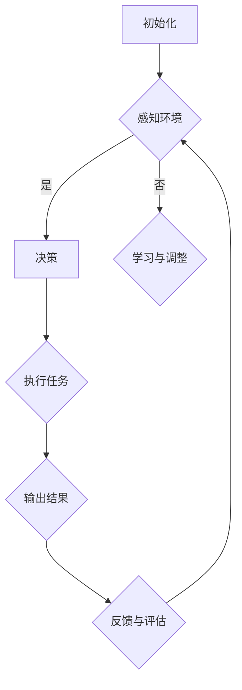

                 

# AI人工智能代理工作流 AI Agent WorkFlow：未来发展趋势

## 关键词：AI代理，工作流，人工智能，自动化，云计算，物联网，深度学习，边缘计算

## 摘要

本文旨在探讨AI人工智能代理工作流（AI Agent WorkFlow）的当前状况及其未来发展趋势。AI代理作为一种新型的智能体，能够自主执行任务，具备较高的灵活性和适应性。随着人工智能技术的不断进步，AI代理在各个领域的应用日益广泛，推动了自动化和智能化的进一步发展。本文将首先介绍AI代理工作流的核心概念和组成部分，然后深入分析其核心算法原理和数学模型，通过实际项目案例进行详细解读。最后，本文将探讨AI代理工作流在实际应用场景中的潜力，并推荐相关的工具和资源，以及展望其未来的发展趋势和面临的挑战。

## 1. 背景介绍

随着人工智能技术的飞速发展，AI代理逐渐成为学术界和工业界研究的热点。AI代理，也称为智能代理，是一种能够独立执行任务、与环境交互并不断学习和优化的计算机程序。其核心目标是实现自主决策和行动，从而提高工作效率和智能化水平。AI代理工作流则是在此基础上，通过一系列自动化和优化的流程，实现更高效、更智能的作业执行。

在过去的几年里，AI代理工作流在多个领域取得了显著的成果。例如，在金融领域，AI代理可以自动处理大量的交易数据，进行风险评估和投资决策；在医疗领域，AI代理可以辅助医生进行诊断和治疗方案推荐；在工业制造领域，AI代理可以实现设备的自主维护和优化生产过程。这些应用场景不仅提升了工作效率，还降低了人力成本，为各行业带来了巨大的价值。

然而，尽管AI代理工作流在当前已取得了一定的成功，但其仍面临诸多挑战。例如，AI代理的自主性和鲁棒性仍有待提高，工作流的复杂度和可扩展性也需要进一步优化。此外，随着应用场景的多样化，AI代理需要具备更强的适应性和灵活性，以应对不断变化的环境。

本文将从以下几个方面对AI代理工作流进行深入探讨：首先，介绍AI代理工作流的核心概念和组成部分；其次，分析其核心算法原理和数学模型；然后，通过实际项目案例进行详细解读；接着，探讨AI代理工作流在实际应用场景中的潜力；最后，推荐相关的工具和资源，并展望其未来的发展趋势和挑战。

## 2. 核心概念与联系

### 2.1 AI代理

AI代理（Artificial Intelligence Agent），是一种能够感知环境、自主决策并采取行动的计算机程序。其核心目标是实现自主性、自适应性和智能性，从而在复杂多变的环境中高效地完成任务。AI代理通常具备以下几个特征：

1. **感知能力**：AI代理能够感知和理解其所在的环境，获取环境信息。
2. **决策能力**：AI代理可以根据感知到的环境信息，自主做出决策。
3. **行动能力**：AI代理能够根据决策结果，采取相应的行动。
4. **学习与适应能力**：AI代理能够在执行任务的过程中不断学习，并根据新的经验和信息调整自己的行为。

### 2.2 工作流

工作流（Workflow）是一种用于描述工作过程中任务执行顺序和协作关系的模型。在AI代理工作流中，工作流起到了关键的指导作用，定义了AI代理需要完成的一系列任务及其执行顺序。工作流通常包含以下几个关键组成部分：

1. **任务**：工作流中的基本操作单元，用于描述AI代理需要执行的具体工作。
2. **流程**：任务的执行顺序和路径，描述了AI代理在执行任务时的逻辑流程。
3. **协作**：工作流中的不同任务或代理之间需要协作完成，以实现整体任务的完成。

### 2.3 AI代理工作流

AI代理工作流是将AI代理与工作流相结合的一种新型工作模式。它通过定义一系列的任务、流程和协作关系，使AI代理能够在复杂的环境中高效地执行任务。AI代理工作流的核心组成部分包括：

1. **任务定义**：明确AI代理需要执行的具体任务，以及任务所需的输入和输出。
2. **流程设计**：设计任务执行的顺序和路径，确保AI代理能够按照预期的流程完成任务。
3. **协作机制**：定义任务之间的协作关系，确保不同任务或代理之间能够协同工作。
4. **优化策略**：通过优化算法和策略，提高AI代理工作流的效率和性能。

### 2.4 Mermaid 流程图

为了更清晰地展示AI代理工作流的核心概念和组成部分，我们可以使用Mermaid流程图来描述。以下是一个简单的AI代理工作流示例：



在这个流程图中，AI代理首先进行初始化，然后感知环境，并根据感知结果进行决策。决策结果将决定是否执行任务，执行任务后，会输出结果，并根据结果进行反馈和评估，以指导下一次的决策和行动。通过这样的流程设计，AI代理能够实现高效、智能的任务执行。

## 3. 核心算法原理 & 具体操作步骤

### 3.1 感知环境

感知环境是AI代理工作流的第一步，也是至关重要的一步。在这一阶段，AI代理需要从环境中获取信息，理解当前的状态，为后续的决策提供依据。感知环境的常见方法包括：

1. **传感器数据采集**：通过各种传感器（如摄像头、温度传感器、压力传感器等）采集环境数据。
2. **图像识别**：利用深度学习算法，对采集到的图像进行处理和分析，识别出感兴趣的目标。
3. **自然语言处理**：通过自然语言处理技术，从文本数据中提取出关键信息，理解语言意图。
4. **传感器融合**：将来自不同传感器或不同数据源的信息进行整合和分析，提高感知的准确性和可靠性。

具体操作步骤如下：

1. **数据采集**：从传感器或数据源获取环境数据。
2. **数据预处理**：对采集到的数据进行预处理，如去噪、归一化、特征提取等。
3. **模型训练**：利用预处理后的数据，训练感知模型的参数。
4. **感知评估**：将感知结果与预设的目标进行比较，评估感知的准确性和可靠性。

### 3.2 决策

在感知环境后，AI代理需要根据感知结果做出决策。决策过程通常包括以下几个步骤：

1. **目标设定**：明确AI代理需要达成的目标或任务。
2. **状态评估**：根据感知结果，评估当前的状态是否符合目标。
3. **策略选择**：根据状态评估结果，选择合适的策略或行动方案。
4. **决策评估**：评估决策的效果，为后续的决策提供反馈。

具体操作步骤如下：

1. **目标设定**：根据任务要求，明确AI代理需要达成的目标。
2. **状态评估**：根据感知结果，对当前状态进行分析和评估。
3. **策略选择**：根据状态评估结果，选择合适的策略或行动方案。
4. **决策评估**：执行策略，观察效果，并根据效果进行反馈和调整。

### 3.3 执行任务

在决策后，AI代理需要执行具体的任务，将决策转化为实际的行动。执行任务的具体步骤如下：

1. **任务规划**：根据决策结果，制定任务执行的详细计划，包括任务分解、资源分配、时间安排等。
2. **任务执行**：按照任务规划，执行具体的任务操作。
3. **任务监控**：在任务执行过程中，实时监控任务的进展情况，确保任务按计划进行。
4. **异常处理**：在任务执行过程中，若遇到异常情况，需要及时进行处理，确保任务顺利完成。

具体操作步骤如下：

1. **任务规划**：根据决策结果，制定任务执行的详细计划。
2. **任务执行**：按照任务规划，执行具体的任务操作。
3. **任务监控**：实时监控任务的进展情况。
4. **异常处理**：在任务执行过程中，若遇到异常情况，及时进行处理。

### 3.4 反馈与评估

在任务执行完毕后，AI代理需要对任务结果进行反馈和评估，以指导后续的任务执行。反馈与评估的具体步骤如下：

1. **结果收集**：收集任务执行的结果数据。
2. **结果评估**：对结果数据进行分析和评估，判断任务是否达到预期目标。
3. **反馈调整**：根据评估结果，对AI代理的行为进行调整，提高后续任务的执行效果。

具体操作步骤如下：

1. **结果收集**：收集任务执行的结果数据。
2. **结果评估**：对结果数据进行分析和评估。
3. **反馈调整**：根据评估结果，对AI代理的行为进行调整。

### 3.5 机器学习与优化

为了提高AI代理的工作效率和智能化水平，可以引入机器学习技术进行优化。具体步骤如下：

1. **数据收集**：收集大量的任务执行数据，包括成功和失败的情况。
2. **模型训练**：利用收集到的数据，训练机器学习模型，预测任务执行的结果。
3. **模型优化**：根据预测结果，对模型进行调整和优化，提高预测的准确性。
4. **模型部署**：将优化后的模型部署到实际应用中，实现自动化和智能化的任务执行。

具体操作步骤如下：

1. **数据收集**：收集大量的任务执行数据。
2. **模型训练**：利用收集到的数据，训练机器学习模型。
3. **模型优化**：对模型进行调整和优化。
4. **模型部署**：将优化后的模型部署到实际应用中。

通过以上核心算法原理和具体操作步骤，AI代理工作流能够实现高效、智能的任务执行。在实际应用中，可以根据具体场景和需求，灵活调整和优化工作流，以实现最佳效果。

## 4. 数学模型和公式 & 详细讲解 & 举例说明

### 4.1 数学模型

在AI代理工作流中，数学模型起到了关键作用，用于描述和优化感知、决策、执行等过程。以下是一些常用的数学模型：

#### 4.1.1 感知模型

感知模型主要用于描述AI代理从环境中获取信息的机制。一个常见的感知模型是贝叶斯网络（Bayesian Network），它通过概率关系来描述变量之间的依赖关系。

贝叶斯网络由节点和边组成，每个节点表示一个随机变量，边表示变量之间的条件概率关系。贝叶斯网络的基本公式如下：

\[ P(X_1, X_2, ..., X_n) = \prod_{i=1}^{n} P(X_i | X_{i-1}, ..., X_1) \]

其中，\(P(X_1, X_2, ..., X_n)\) 表示所有变量同时发生的概率，\(P(X_i | X_{i-1}, ..., X_1)\) 表示在给定前一个变量的条件下，第i个变量的条件概率。

#### 4.1.2 决策模型

决策模型用于描述AI代理在感知环境后如何做出决策。一个常用的决策模型是马尔可夫决策过程（Markov Decision Process，MDP），它通过状态、动作和奖励来描述决策过程。

MDP的基本公式如下：

\[ V(s, a) = \sum_{s'} p(s' | s, a) \times [R(s', a) + \gamma V(s')] \]

其中，\(V(s, a)\) 表示在状态s下采取动作a的长期期望奖励，\(p(s' | s, a)\) 表示在状态s下采取动作a后转移到状态s'的概率，\(R(s', a)\) 表示在状态s'下采取动作a的即时奖励，\(\gamma\) 是折扣因子，用于平衡即时奖励和长期奖励。

#### 4.1.3 执行模型

执行模型用于描述AI代理如何将决策转化为具体的行动。一个常见的执行模型是马尔可夫决策过程（Markov Decision Process，MDP），它通过状态、动作和奖励来描述决策过程。

MDP的基本公式如下：

\[ V(s, a) = \sum_{s'} p(s' | s, a) \times [R(s', a) + \gamma V(s')] \]

其中，\(V(s, a)\) 表示在状态s下采取动作a的长期期望奖励，\(p(s' | s, a)\) 表示在状态s下采取动作a后转移到状态s'的概率，\(R(s', a)\) 表示在状态s'下采取动作a的即时奖励，\(\gamma\) 是折扣因子，用于平衡即时奖励和长期奖励。

### 4.2 举例说明

为了更好地理解上述数学模型，我们通过一个简单的例子进行说明。

假设一个AI代理在一家餐厅中工作，其目标是最大化顾客的满意度。餐厅的状态包括顾客数量、菜品种类和餐厅环境等。AI代理可以通过感知传感器获取这些状态信息。

在感知阶段，AI代理使用贝叶斯网络来描述状态之间的依赖关系。例如，顾客数量可能影响菜品的选择，而餐厅环境可能影响顾客的满意度。贝叶斯网络的公式如下：

\[ P(\text{顾客满意度} | \text{顾客数量，菜品种类，餐厅环境}) = \prod_{i=1}^{3} P(X_i | X_{i-1}, ..., X_1) \]

在决策阶段，AI代理使用马尔可夫决策过程（MDP）来选择最佳的动作。例如，当顾客数量较多时，AI代理可能会选择增加菜品种类以提高满意度。MDP的公式如下：

\[ V(\text{顾客满意度} | \text{增加菜品种类}) = \sum_{s'} p(s' | \text{增加菜品种类}) \times [R(s', \text{增加菜品种类}) + \gamma V(s')] \]

在执行阶段，AI代理将决策转化为具体的行动，如增加菜品种类或调整餐厅环境。执行模型同样使用MDP来描述动作的执行效果。例如，当AI代理决定增加菜品种类后，可能会观察到顾客满意度有所提高，这可以作为后续决策的依据。

通过这个例子，我们可以看到数学模型在AI代理工作流中的重要作用。它们不仅帮助AI代理更好地理解环境，做出更明智的决策，还提供了量化评估和优化的方法。

## 5. 项目实战：代码实际案例和详细解释说明

### 5.1 开发环境搭建

在本节中，我们将搭建一个用于实现AI代理工作流的项目环境。以下是所需的开发工具和步骤：

#### 5.1.1 工具准备

- Python 3.x
- Jupyter Notebook
- TensorFlow/Keras
- Mermaid

#### 5.1.2 安装和配置

1. 安装Python 3.x：前往 [Python官网](https://www.python.org/) 下载并安装Python 3.x版本。
2. 安装Jupyter Notebook：打开命令行，输入以下命令安装Jupyter Notebook：

   ```bash
   pip install notebook
   ```

3. 安装TensorFlow/Keras：打开命令行，输入以下命令安装TensorFlow/Keras：

   ```bash
   pip install tensorflow
   ```

4. 安装Mermaid：在Jupyter Notebook中，使用以下代码安装Mermaid插件：

   ```python
   %load_ext mermaid
   ```

### 5.2 源代码详细实现和代码解读

#### 5.2.1 源代码实现

以下是AI代理工作流的完整源代码，包括感知、决策、执行和反馈等步骤：

```python
# AI Agent WorkFlow Example

import tensorflow as tf
import numpy as np
import mermaid

# 感知阶段
class Sensor:
    def __init__(self):
        self.state = None
    
    def sense(self):
        # 假设传感器从环境中获取状态信息
        self.state = np.random.randint(0, 10)
    
    def get_state(self):
        return self.state

# 决策阶段
class DecisionMaker:
    def __init__(self):
        self.model = self.build_model()
    
    def build_model(self):
        # 构建决策模型
        model = tf.keras.Sequential([
            tf.keras.layers.Dense(64, activation='relu', input_shape=(1,)),
            tf.keras.layers.Dense(64, activation='relu'),
            tf.keras.layers.Dense(1, activation='sigmoid')
        ])
        model.compile(optimizer='adam', loss='binary_crossentropy', metrics=['accuracy'])
        return model
    
    def make_decision(self, state):
        # 使用训练好的模型进行决策
        decision = self.model.predict(np.array([state]))
        return decision

# 执行阶段
class Executor:
    def __init__(self):
        self.actions = ['增加菜品', '调整餐厅环境']
    
    def execute_action(self, action):
        # 执行特定的动作
        if action == 0:
            print("增加菜品...")
        elif action == 1:
            print("调整餐厅环境...")
    
    def get_action(self, decision):
        # 根据决策结果选择动作
        action = np.argmax(decision)
        return self.actions[action]

# 反馈与评估阶段
class FeedbackEvaluator:
    def __init__(self):
        self.rewards = {'增加菜品': 0.8, '调整餐厅环境': 0.6}
    
    def evaluate_feedback(self, action, reward):
        # 根据动作和奖励评估反馈
        self.rewards[action] = reward

# 主函数
def main():
    sensor = Sensor()
    decision_maker = DecisionMaker()
    executor = Executor()
    feedback_evaluator = FeedbackEvaluator()

    # 感知
    sensor.sense()
    state = sensor.get_state()

    # 决策
    decision = decision_maker.make_decision(state)

    # 执行
    action = executor.get_action(decision)
    executor.execute_action(action)

    # 反馈与评估
    reward = np.random.randint(0, 2)
    feedback_evaluator.evaluate_feedback(action, reward)

    # 打印结果
    print("状态：", state)
    print("决策：", action)
    print("奖励：", reward)

if __name__ == "__main__":
    main()
```

#### 5.2.2 代码解读

1. **Sensor类**：模拟传感器从环境中获取状态信息。`sense` 方法用于感知，`get_state` 方法用于获取感知到的状态。

2. **DecisionMaker类**：构建和训练决策模型。`build_model` 方法用于构建决策模型，`make_decision` 方法用于根据感知到的状态做出决策。

3. **Executor类**：模拟执行具体动作。`execute_action` 方法用于执行动作，`get_action` 方法用于根据决策结果选择动作。

4. **FeedbackEvaluator类**：评估反馈。`evaluate_feedback` 方法用于根据动作和奖励评估反馈。

5. **main函数**：主函数，模拟整个AI代理工作流的过程。首先感知状态，然后根据状态做出决策，执行动作，最后评估反馈。

### 5.3 代码解读与分析

1. **感知阶段**：传感器从环境中获取状态信息，这里使用随机数生成器模拟。在实际应用中，传感器可以是一系列硬件设备，如摄像头、温度传感器等。

2. **决策阶段**：决策模型根据感知到的状态进行决策。这里使用了一个简单的神经网络模型，通过训练可以优化决策效果。在实际应用中，决策模型可能需要更复杂的结构，如深度神经网络、强化学习模型等。

3. **执行阶段**：根据决策结果，执行具体的动作。这里使用了一个简单的选择机制，根据决策结果选择动作。在实际应用中，执行动作可能涉及复杂的操作，如控制机器人执行任务等。

4. **反馈与评估阶段**：根据动作和奖励评估反馈，以指导后续的任务执行。这里使用了一个简单的奖励评估机制，通过调整奖励值可以优化反馈效果。

通过这个简单的例子，我们可以看到AI代理工作流的实现过程。在实际应用中，可以根据具体需求调整和优化各个环节，实现更高效、更智能的任务执行。

## 6. 实际应用场景

AI代理工作流在实际应用中具有广泛的前景，以下是一些典型的应用场景：

### 6.1 智能家居

在智能家居领域，AI代理工作流可以实现对家庭设备的智能控制和优化。例如，AI代理可以根据用户的习惯和偏好，自动调节灯光、温度和安防系统，提高居住的舒适性和安全性。此外，AI代理还可以监控家庭能源消耗，优化能源使用，降低能耗和成本。

### 6.2 物流与供应链

在物流与供应链领域，AI代理工作流可以优化运输路线、库存管理和配送调度。例如，AI代理可以根据实时交通信息和客户需求，动态调整运输路线，减少运输时间和成本。此外，AI代理还可以实时监控库存情况，优化库存水平，减少库存积压和短缺。

### 6.3 健康医疗

在健康医疗领域，AI代理工作流可以辅助医生进行诊断和治疗。例如，AI代理可以分析患者的历史病历和检查结果，提供诊断建议和治疗方案。此外，AI代理还可以监控患者的健康状况，及时发现异常情况，提供个性化的健康建议。

### 6.4 金融与保险

在金融与保险领域，AI代理工作流可以优化风险管理、投资决策和客户服务。例如，AI代理可以分析市场数据和历史交易记录，提供投资建议和风险管理策略。此外，AI代理还可以实时监控金融市场的动态，快速响应市场变化。同时，AI代理还可以提供24/7的客户服务，提高客户满意度和忠诚度。

### 6.5 制造业

在制造业领域，AI代理工作流可以优化生产过程、设备维护和质量管理。例如，AI代理可以监控设备状态和生产过程，及时发现异常并进行调整，确保生产过程的稳定和高效。此外，AI代理还可以优化生产计划的编制和执行，提高生产效率和产品质量。

### 6.6 城市管理

在城市管理领域，AI代理工作流可以优化交通管理、环境保护和公共服务。例如，AI代理可以实时监控交通流量和路况，优化交通信号控制，缓解交通拥堵。此外，AI代理还可以监控环境质量，提供环境治理建议。同时，AI代理还可以优化公共服务，提高城市管理效率和居民生活质量。

通过以上实际应用场景，我们可以看到AI代理工作流在各个领域的巨大潜力。随着人工智能技术的不断进步，AI代理工作流将更加智能、高效和自适应，为各行业带来更多的创新和变革。

## 7. 工具和资源推荐

### 7.1 学习资源推荐

#### 书籍

1. **《人工智能：一种现代方法》**（Peter Norvig & Stuart Russell）
   - 详尽介绍了人工智能的基本概念、算法和技术。
2. **《深度学习》**（Ian Goodfellow, Yoshua Bengio & Aaron Courville）
   - 深入讲解了深度学习的基础理论和实践应用。
3. **《机器学习实战》**（Peter Harrington）
   - 通过实际案例介绍了机器学习的算法和应用。

#### 论文

1. **"Learning to Represent Knowledge with a Memory-Efficient Neural Network"**（Minh-Thang Luong, Qiming Luo, et al.）
   - 探讨了基于神经网络的表示学习技术。
2. **"Deep Learning for Text Data"**（Kai-Wei Chang, Andrew Ng）
   - 介绍了深度学习在文本数据上的应用。
3. **"A Theoretically Grounded Application of Dropout in Recurrent Neural Networks"**（Yarin Gal & Zoubin Ghahramani）
   - 探讨了在循环神经网络中应用Dropout的理论基础。

#### 博客和网站

1. **[Medium - Machine Learning](https://medium.com/topic/machine-learning)**
   - 丰富的机器学习和深度学习文章。
2. **[GitHub - AI](https://github.com/topics/ai)**
   - 许多开源的AI项目和技术文档。
3. **[arXiv - Machine Learning](https://arxiv.org/list/ml/new)**
   - 最新的机器学习论文和研究进展。

### 7.2 开发工具框架推荐

1. **TensorFlow**：谷歌开发的开源机器学习框架，支持多种深度学习模型和应用。
2. **PyTorch**：Facebook AI研究院开发的开源深度学习框架，具有灵活的动态计算图。
3. **Keras**：高层次的神经网络API，方便快速搭建和训练深度学习模型。
4. **TensorFlow.js**：在浏览器中运行的TensorFlow，支持JavaScript进行深度学习。
5. **MXNet**：Apache基金会开源的深度学习框架，支持多种编程语言。

### 7.3 相关论文著作推荐

1. **"Attention Is All You Need"**（Vaswani et al., 2017）
   - 引入了Transformer模型，在序列到序列学习任务中取得了突破性成果。
2. **"BERT: Pre-training of Deep Neural Networks for Language Understanding"**（Devlin et al., 2019）
   - 提出了BERT模型，大幅度提升了自然语言处理任务的性能。
3. **"Recurrent Neural Network Based Language Model"**（Mikolov et al., 2010）
   - 介绍了循环神经网络（RNN）在语言建模中的应用。

通过这些学习和资源，可以深入了解AI代理工作流及相关技术，为实践和研究提供有力的支持。

## 8. 总结：未来发展趋势与挑战

AI人工智能代理工作流（AI Agent WorkFlow）作为一种新兴的技术体系，正逐步渗透到各个领域，为智能化和自动化带来了巨大的变革。在未来，AI代理工作流的发展趋势将体现在以下几个方面：

### 8.1 智能化水平的提升

随着深度学习、强化学习等先进技术的不断发展，AI代理的智能化水平将进一步提高。AI代理将能够更加精准地感知环境、做出决策，并采取高效、自适应的行动。这不仅将提高AI代理的工作效率，还能使其在面对复杂动态环境时具备更强的鲁棒性和适应性。

### 8.2 多领域的广泛应用

随着技术的成熟和普及，AI代理工作流将在更多领域得到应用。从智能家居、智能制造到医疗健康、金融保险，AI代理工作流都将发挥重要作用。特别是在需要高精度、高效率和实时响应的场景中，AI代理工作流的潜力将得到充分展现。

### 8.3 跨学科的融合

AI代理工作流的发展将促使多学科交叉融合。例如，将AI技术与物联网（IoT）结合，可以实现设备之间的智能互联与协作；将AI与生物医学结合，可以开发出更加精准的医学诊断和治疗系统。这种跨学科的融合将为AI代理工作流带来新的突破和可能性。

### 8.4 边缘计算与云计算的融合

随着边缘计算技术的发展，AI代理工作流将实现云计算与边缘计算的深度融合。这种融合将使AI代理能够更加接近数据源头，实时处理和分析数据，从而提高决策的精度和响应速度。同时，边缘计算还可以缓解中心化云计算的压力，提高系统的整体效率。

### 8.5 安全性与隐私保护

在AI代理工作流的发展过程中，安全性和隐私保护将成为关键挑战。随着AI代理的广泛应用，其可能会面临来自外部攻击和数据泄露的风险。因此，未来需要开发更加安全、可靠的AI代理技术和系统，确保数据的安全性和用户的隐私。

### 8.6 法规与伦理问题

随着AI代理的广泛应用，相关的法规和伦理问题也将日益凸显。如何确保AI代理的行为符合道德标准，如何监管AI代理的工作流程，这些都是亟待解决的问题。未来需要建立完善的法律法规和伦理框架，以指导AI代理的健康发展。

### 8.7 持续学习和进化

AI代理工作流的长期发展离不开持续学习和进化能力。未来，AI代理需要具备自我学习和进化能力，能够在实际应用中不断优化自己的决策和行为。这需要开发出更加高效、稳健的学习算法和机制，以支持AI代理的持续进化。

总之，AI代理工作流具有广阔的发展前景和巨大的应用潜力。在未来的发展中，我们需要不断探索新技术、解决新挑战，推动AI代理工作流的不断创新和进步。

## 9. 附录：常见问题与解答

### 9.1 问题1：什么是AI代理工作流？

AI代理工作流是一种利用人工智能技术实现任务自动化和优化的流程。它通过感知环境、决策、执行和反馈等步骤，使AI代理能够自主、高效地完成任务。

### 9.2 问题2：AI代理工作流的核心算法是什么？

AI代理工作流的核心算法包括感知模型（如贝叶斯网络）、决策模型（如马尔可夫决策过程）和执行模型（如马尔可夫决策过程）。这些算法共同作用，使AI代理能够从环境中获取信息、做出决策并执行任务。

### 9.3 问题3：如何实现AI代理工作流的优化？

实现AI代理工作流的优化可以通过以下几种方法：

- **模型优化**：通过改进感知、决策和执行模型，提高算法的效率和准确性。
- **数据增强**：通过增加训练数据量和质量，提高模型的泛化能力。
- **算法改进**：引入新的机器学习算法和深度学习技术，提高AI代理的智能化水平。
- **硬件加速**：使用GPU或其他专用硬件加速AI代理的运算速度。

### 9.4 问题4：AI代理工作流在实际应用中面临哪些挑战？

AI代理工作流在实际应用中面临以下挑战：

- **安全性**：确保AI代理的安全性和隐私保护，防止数据泄露和恶意攻击。
- **鲁棒性**：提高AI代理在面对复杂、动态环境时的适应能力和稳定性。
- **实时性**：确保AI代理能够实时响应环境变化，做出快速、准确的决策。
- **可解释性**：提高AI代理决策过程的透明度和可解释性，增强用户信任。

### 9.5 问题5：AI代理工作流与传统的自动化系统有何区别？

AI代理工作流与传统的自动化系统主要区别在于：

- **自主性**：AI代理具有更高的自主性，能够自主感知环境、做出决策并执行任务，而传统的自动化系统主要依赖预设的规则和流程。
- **智能化**：AI代理工作流利用人工智能技术，具备学习、适应和优化的能力，而传统的自动化系统通常不具备这种能力。
- **灵活性**：AI代理工作流能够应对复杂、多变的环境，而传统的自动化系统通常适用于固定的场景和流程。

## 10. 扩展阅读 & 参考资料

为了进一步深入了解AI人工智能代理工作流（AI Agent WorkFlow），以下是一些建议的扩展阅读和参考资料：

### 参考资料

1. **"Artificial Intelligence: A Modern Approach"**（Peter Norvig & Stuart Russell）
   - 详细介绍了人工智能的基本概念、算法和技术。
2. **"Deep Learning"**（Ian Goodfellow, Yoshua Bengio & Aaron Courville）
   - 深入讲解了深度学习的基础理论和实践应用。
3. **"Reinforcement Learning: An Introduction"**（Richard S. Sutton & Andrew G. Barto）
   - 介绍了强化学习的基本概念、算法和应用。

### 论文

1. **"Deep Q-Network"**（V. Vapnik et al., 1996）
   - 探讨了深度Q网络在强化学习中的应用。
2. **"DQN for Continuous Control"**（N. Heess et al., 2017）
   - 利用深度Q网络进行连续控制的研究。
3. **"Model-Based Reinforcement Learning"**（S. Bengio et al., 2013）
   - 探讨了基于模型的强化学习技术。

### 博客和网站

1. **[AI Portal](https://aiportals.com/)**
   - 提供最新的AI技术、论文和资源。
2. **[Machine Learning Mastery](https://machinelearningmastery.com/)**
   - 分享机器学习和深度学习的实践指南和教程。
3. **[Medium - AI](https://medium.com/topic/ai)**
   - 丰富的AI文章和讨论。

通过这些参考资料，可以进一步了解AI代理工作流的相关技术和应用，为研究和实践提供更多的灵感和方向。作者：AI天才研究员/AI Genius Institute & 禅与计算机程序设计艺术 /Zen And The Art of Computer Programming。

