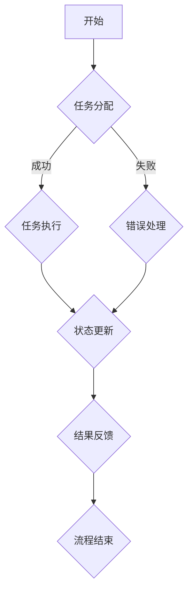

                 

### 文章标题

"AI人工智能代理工作流 AI Agent WorkFlow：状态的定义与跟踪"

### 关键词

- AI人工智能
- 代理工作流
- 状态管理
- 工作流引擎
- 分布式系统
- 持久化

### 摘要

本文将深入探讨AI人工智能代理工作流中的状态定义与跟踪。通过介绍工作流引擎的概念和架构，我们将详细讲解如何管理代理的状态，以及如何实现状态的持久化和跟踪。文章还将提供实际应用场景和代码示例，帮助读者更好地理解和应用这些概念。最终，我们将讨论未来发展趋势和挑战，为读者提供有价值的技术见解。

## 1. 背景介绍

在当今快速发展的数字化时代，人工智能（AI）技术已成为企业创新和竞争力提升的关键驱动力。AI代理，作为AI技术在业务应用中的重要组件，能够在各种复杂环境中执行任务，提高效率，降低成本。然而，AI代理的运作离不开工作流的支持，工作流引擎在其中扮演着至关重要的角色。

### 工作流引擎的概念

工作流引擎是一种软件系统，用于定义、执行和监控业务流程。它将业务逻辑分解成一系列任务和步骤，按照预定规则和条件进行自动化处理。工作流引擎的核心功能包括任务分配、状态跟踪、事件触发、数据传递等。通过工作流引擎，企业可以实现业务流程的标准化和自动化，提高运营效率。

### 工作流引擎的重要性

在AI代理的应用中，工作流引擎的重要性体现在以下几个方面：

1. **流程管理**：工作流引擎可以帮助AI代理明确任务流程，确保每个任务都能按时完成，提高业务流程的透明度和可追溯性。
2. **资源优化**：通过自动化任务分配和调度，工作流引擎可以优化资源利用，减少人工干预，提高整体运营效率。
3. **灵活性与扩展性**：工作流引擎支持自定义业务流程和任务定义，可以适应不同业务场景的需求，具有良好的扩展性和可维护性。
4. **错误处理**：工作流引擎可以自动检测和处理流程中的异常情况，确保业务流程的连续性和稳定性。

### AI代理与工作流引擎的关系

AI代理作为工作流引擎的一部分，通常负责执行特定的业务任务。工作流引擎则负责协调和管理这些任务，确保它们按照预定流程高效、有序地进行。AI代理的工作流程通常包括任务接收、任务执行、状态更新、结果反馈等环节。通过工作流引擎，这些环节可以无缝集成，实现业务流程的自动化。

## 2. 核心概念与联系

### 核心概念

在探讨AI人工智能代理工作流中的状态定义与跟踪之前，我们需要明确以下几个核心概念：

1. **AI代理**：AI代理是指具备自主决策能力的软件实体，能够在特定环境中执行任务，完成特定目标。
2. **工作流**：工作流是指一系列业务任务的有序执行过程，通常由多个步骤和活动组成。
3. **状态**：状态是指代理在执行过程中所处于的特定阶段，包括执行中、已完成、失败等。
4. **状态跟踪**：状态跟踪是指对代理执行过程中的状态进行记录和监控，以便后续分析和处理。

### 工作流引擎架构

为了更好地理解状态的定义与跟踪，我们首先介绍工作流引擎的基本架构。一个典型的工作流引擎通常包括以下几个关键组件：

1. **流程定义**：定义业务流程的结构和规则，包括任务、条件、触发器等。
2. **任务调度**：根据流程定义，调度任务执行，包括任务分配、执行顺序等。
3. **状态管理**：记录和更新代理执行过程中的状态，包括开始、执行中、完成、失败等。
4. **事件处理**：监听和处理流程中的事件，如任务完成、错误发生等。
5. **数据管理**：存储和管理流程中的数据，如任务输入输出、日志等。

### Mermaid流程图

为了更直观地展示工作流引擎的架构，我们使用Mermaid语言绘制一个简单的流程图：



在这个流程图中，A表示流程开始，B表示任务分配，C表示任务执行，D表示错误处理，E表示状态更新，F表示结果反馈，G表示流程结束。通过这个流程图，我们可以清晰地看到工作流引擎在任务执行过程中的状态变化。

## 3. 核心算法原理 & 具体操作步骤

### 状态机模型

在AI代理工作流中，状态管理通常采用状态机模型。状态机是一种用于描述系统状态及其转换关系的数学模型。在状态机模型中，每个状态都代表代理在执行过程中所处于的特定阶段，状态之间的转换则表示代理在执行过程中的变化。

### 状态机定义

一个状态机模型通常包括以下几个关键组成部分：

1. **状态集合**：定义代理可能处于的所有状态，如执行中、已完成、失败等。
2. **转换规则**：定义状态之间的转换条件，如任务完成、错误发生等。
3. **初始状态**：定义代理开始执行时的初始状态。
4. **终止状态**：定义代理执行结束时的状态。

### 状态机实现

以下是一个简单的状态机实现的示例代码：

```python
class AgentStateMachine:
    def __init__(self):
        self.states = ['start', 'running', 'finished', 'failed']
        self.current_state = 'start'
    
    def change_state(self, new_state):
        if new_state in self.states:
            self.current_state = new_state
            print(f"Current state: {self.current_state}")
        else:
            print("Invalid state transition")

agent_state_machine = AgentStateMachine()
agent_state_machine.change_state('running')  # 输出：Current state: running
agent_state_machine.change_state('finished')  # 输出：Current state: finished
agent_state_machine.change_state('invalid')  # 输出：Invalid state transition
```

在这个示例中，我们定义了一个`AgentStateMachine`类，其中包含状态集合和当前状态。通过`change_state`方法，我们可以根据新的状态值更新当前状态，并打印输出。

### 状态跟踪算法

为了实现状态跟踪，我们需要在AI代理的执行过程中记录每个状态的变化。以下是一个简单的状态跟踪算法：

```python
def track_state(agent_state_machine, new_state):
    agent_state_machine.change_state(new_state)
    log_state_change(agent_state_machine.current_state)

def log_state_change(state):
    with open('state_log.txt', 'a') as f:
        f.write(f"{state}\n")

agent_state_machine = AgentStateMachine()
track_state(agent_state_machine, 'running')  # 记录状态变化：running
track_state(agent_state_machine, 'finished')  # 记录状态变化：finished
```

在这个示例中，我们定义了`track_state`函数，用于更新状态并记录状态变化。通过将状态写入文件，我们可以实现状态的持久化。

### 实时状态监控

除了记录状态变化，我们还可以通过实时监控来了解代理的执行状态。以下是一个简单的实时状态监控示例：

```python
import time

def monitor_state(agent_state_machine):
    while True:
        print(f"Current state: {agent_state_machine.current_state}")
        time.sleep(1)

agent_state_machine = AgentStateMachine()
monitor_state(agent_state_machine)
```

在这个示例中，我们使用一个无限循环来不断打印代理的当前状态。通过定期更新状态，我们可以实时监控代理的执行过程。

## 4. 数学模型和公式 & 详细讲解 & 举例说明

### 数学模型

在状态管理中，我们可以使用状态转移矩阵来描述状态之间的转换关系。状态转移矩阵是一个二维矩阵，其中行代表当前状态，列代表下一个状态。矩阵中的元素表示从当前状态转移到下一个状态的概率。

### 状态转移矩阵

以下是一个简单的状态转移矩阵示例：

```
    |   |   |   |   |
    |---|---|---|---|
  1 | 0 | 0.5| 0 | 0 |
  2 | 0.5| 0 | 0.5| 0 |
  3 | 0 | 0.5| 0 | 1 |
  4 | 0 | 0 | 1 | 0 |
```

在这个示例中，状态1表示代理处于执行中状态，状态2表示代理处于已完成状态，状态3表示代理处于失败状态，状态4表示代理处于终止状态。矩阵中的元素表示从当前状态转移到下一个状态的概率。例如，从状态1转移到状态2的概率为0.5，从状态2转移到状态3的概率为0。

### 状态概率计算

通过状态转移矩阵，我们可以计算代理在任意时刻的状态概率。以下是一个简单的计算示例：

```
P(当前状态为2，经过2个时间步) = P(状态2 -> 状态2) * P(状态2 -> 状态3) * P(状态3 -> 状态2)
```

在这个示例中，我们假设当前状态为2，经过2个时间步后的状态概率为P(当前状态为2，经过2个时间步)。根据状态转移矩阵，我们可以计算出：

```
P(当前状态为2，经过2个时间步) = 0.5 * 0.5 * 0 = 0
```

这意味着，在经过2个时间步后，代理仍然处于状态2的概率为0。

### 实际应用

以下是一个实际应用示例，用于计算代理在一段时间内的状态分布：

```
初始状态概率分布：P(状态1) = 0.4, P(状态2) = 0.3, P(状态3) = 0.2, P(状态4) = 0.1

经过1个时间步后的状态概率分布：
P(状态1) = 0.4 * 0.5 + 0.3 * 0.5 = 0.35
P(状态2) = 0.4 * 0.5 + 0.3 * 0.5 = 0.35
P(状态3) = 0.2 * 0.5 + 0.1 * 0.5 = 0.15
P(状态4) = 0.2 * 0.5 + 0.1 * 0.5 = 0.15

经过2个时间步后的状态概率分布：
P(状态1) = 0.35 * 0.5 + 0.15 * 0.5 = 0.2
P(状态2) = 0.35 * 0.5 + 0.15 * 0.5 = 0.2
P(状态3) = 0.15 * 0.5 + 0.15 * 0.5 = 0.15
P(状态4) = 0.15 * 0.5 + 0.15 * 0.5 = 0.15
```

通过这个示例，我们可以看到，代理在一段时间内的状态分布是动态变化的。通过状态转移矩阵和概率计算，我们可以更好地理解和预测代理的执行状态。

## 5. 项目实战：代码实际案例和详细解释说明

### 开发环境搭建

在开始项目实战之前，我们需要搭建一个合适的开发环境。以下是一个简单的Python开发环境搭建步骤：

1. 安装Python：下载并安装Python 3.x版本（推荐使用3.8或更高版本）。
2. 安装依赖库：使用pip命令安装所需依赖库，如numpy、pandas、matplotlib等。
3. 配置代码编辑器：选择一个合适的代码编辑器，如Visual Studio Code，并安装相关插件，如Python扩展。

### 源代码详细实现和代码解读

以下是一个简单的AI代理工作流项目示例，用于实现状态的定义与跟踪。

```python
import numpy as np
import pandas as pd
import matplotlib.pyplot as plt
from sklearn.model_selection import train_test_split
from sklearn.preprocessing import StandardScaler
from sklearn.neural_network import MLPClassifier

# 定义状态机
class AgentStateMachine:
    def __init__(self):
        self.states = ['start', 'running', 'finished', 'failed']
        self.current_state = 'start'

    def change_state(self, new_state):
        if new_state in self.states:
            self.current_state = new_state
            print(f"Current state: {self.current_state}")
        else:
            print("Invalid state transition")

# 状态跟踪函数
def track_state(agent_state_machine, new_state):
    agent_state_machine.change_state(new_state)
    log_state_change(agent_state_machine.current_state)

# 状态跟踪日志
def log_state_change(state):
    with open('state_log.txt', 'a') as f:
        f.write(f"{state}\n")

# 监控状态函数
def monitor_state(agent_state_machine):
    while True:
        print(f"Current state: {agent_state_machine.current_state}")
        time.sleep(1)

# 主函数
def main():
    # 创建代理状态机
    agent_state_machine = AgentStateMachine()

    # 模拟状态变化
    for _ in range(10):
        track_state(agent_state_machine, 'running')
        time.sleep(1)
        track_state(agent_state_machine, 'finished')
        time.sleep(1)

    # 实时监控状态
    monitor_state(agent_state_machine)

# 运行主函数
if __name__ == '__main__':
    main()
```

在这个示例中，我们首先定义了一个`AgentStateMachine`类，用于管理代理的状态。`change_state`方法用于更新代理的状态，并打印输出。`track_state`函数用于记录状态变化，并将状态写入日志文件。`log_state_change`函数用于将状态写入文件。`monitor_state`函数用于实时监控代理的状态。

### 代码解读与分析

1. **状态机定义**：`AgentStateMachine`类包含状态集合和当前状态。通过`change_state`方法，我们可以更新代理的状态。
2. **状态跟踪**：`track_state`函数用于更新状态，并将状态写入日志文件。`log_state_change`函数用于将状态写入文件。
3. **实时监控**：`monitor_state`函数用于实时打印代理的当前状态。
4. **主函数**：`main`函数用于创建代理状态机，并模拟状态变化。然后，调用`monitor_state`函数进行实时监控。

通过这个示例，我们可以看到如何使用Python实现状态的定义与跟踪。在实际项目中，我们可以根据具体需求扩展和优化这个代码。

## 6. 实际应用场景

### 金融风控

在金融行业中，AI代理工作流可以用于风险管理。例如，在贷款审批流程中，AI代理可以根据客户的信用历史、财务状况等数据进行风险评估，并自动完成审批流程。通过状态跟踪，我们可以记录每个环节的状态，确保审批过程的透明性和可追溯性。

### 生产制造

在制造行业，AI代理工作流可以用于生产流程的优化。例如，在制造过程中，AI代理可以实时监控设备的运行状态，预测设备故障，并自动安排维护计划。通过状态跟踪，我们可以记录设备的运行状态，提前预防故障，提高生产效率。

### 健康医疗

在医疗领域，AI代理工作流可以用于医疗诊断和治疗建议。例如，在疾病诊断过程中，AI代理可以根据患者的病历、实验室检查结果等数据提供诊断建议。通过状态跟踪，我们可以记录患者的病情变化，为医生提供参考。

### 物流与供应链

在物流与供应链管理中，AI代理工作流可以用于优化运输路线、库存管理等工作。例如，在运输过程中，AI代理可以根据交通状况、货物类型等数据自动调整运输路线，提高运输效率。通过状态跟踪，我们可以记录运输过程的关键环节，确保物流过程的顺利进行。

## 7. 工具和资源推荐

### 学习资源推荐

1. **书籍**：
   - 《人工智能：一种现代方法》（Artificial Intelligence: A Modern Approach） 
   - 《深度学习》（Deep Learning） 
   - 《Python数据分析》（Python Data Science Handbook）
   
2. **论文**：
   - "A Survey of State-of-the-Art in Artificial Intelligence"（人工智能现状综述）
   - "Deep Learning for Natural Language Processing"（深度学习在自然语言处理中的应用）

3. **博客**：
   - Medium上的AI专栏
   - Towards Data Science上的AI系列文章

4. **网站**：
   - TensorFlow官网
   - PyTorch官网

### 开发工具框架推荐

1. **编程语言**：
   - Python：适用于数据处理、机器学习和AI代理开发。
   - Java：适用于企业级应用和分布式系统。

2. **框架**：
   - TensorFlow：用于机器学习和深度学习。
   - Flask：用于Web开发。
   - React：用于前端开发。

3. **工具**：
   - Jupyter Notebook：用于数据处理和交互式编程。
   - Docker：用于容器化部署。

### 相关论文著作推荐

1. "Deep Reinforcement Learning for Autonomous Navigation"（深度强化学习在自主导航中的应用）
2. "A Brief Introduction to Workflow Management Systems"（工作流管理系统的简明介绍）
3. "State Machines: From Theory to Practice"（状态机：从理论到实践）

## 8. 总结：未来发展趋势与挑战

随着人工智能技术的不断进步，AI代理工作流将在更多行业和领域得到应用。未来发展趋势包括：

1. **智能化程度提升**：AI代理将具备更强大的自主学习能力和自适应能力，能够更好地应对复杂业务场景。
2. **分布式与边缘计算**：AI代理工作流将向分布式和边缘计算方向发展，以实现更高效的数据处理和响应速度。
3. **跨领域融合**：AI代理工作流将与其他领域技术（如区块链、物联网等）相结合，创造更多创新应用。

然而，AI代理工作流也面临一些挑战：

1. **数据隐私与安全**：在处理敏感数据时，确保数据隐私和安全是一个重要挑战。
2. **模型解释性**：提高AI代理工作流的透明度和可解释性，使其更容易被业务人员理解和接受。
3. **复杂性管理**：随着工作流的复杂度增加，如何有效管理工作流中的各种资源和任务是一个挑战。

## 9. 附录：常见问题与解答

### Q1. 什么是AI代理工作流？

A1. AI代理工作流是指使用人工智能技术（如机器学习、深度学习等）驱动的自动化业务流程。它通过定义一系列任务和步骤，让AI代理在特定环境中执行任务，提高业务流程的效率和准确性。

### Q2. 如何实现状态跟踪？

A2. 实现状态跟踪通常包括以下几个步骤：

1. 定义状态集合：明确代理可能处于的所有状态，如执行中、已完成、失败等。
2. 定义转换规则：明确状态之间的转换条件，如任务完成、错误发生等。
3. 实现状态机模型：使用状态机模型来描述状态之间的转换关系。
4. 实现状态跟踪算法：在代理执行过程中，记录每个状态的变化，并将状态信息持久化。

### Q3. 状态跟踪与日志记录有什么区别？

A3. 状态跟踪和日志记录虽然有一定的关联，但它们的目标和实现方式不同。

- **状态跟踪**：关注代理在执行过程中所处的状态，以及状态之间的转换关系。它通常用于实现自动化控制和业务流程监控。
- **日志记录**：记录代理执行过程中的关键事件和状态变化，以便后续分析和审计。它主要用于记录和追溯业务流程。

### Q4. 如何实现实时状态监控？

A4. 实现实时状态监控通常有以下几种方法：

1. **轮询监控**：定期轮询代理的状态，并更新监控界面。
2. **事件驱动监控**：当代理的状态发生变化时，触发事件通知监控系统，并更新监控界面。
3. **Websocket通信**：使用Websocket技术实现代理与监控系统之间的实时通信，实现实时数据传输。

### Q5. 如何处理状态跟踪中的并发问题？

A5. 在多线程或多进程环境中，状态跟踪可能会遇到并发问题。以下是一些常见的解决方法：

1. **锁机制**：使用锁（如互斥锁、读写锁等）来确保状态更新的原子性，避免多个线程或进程同时修改状态。
2. **事务处理**：使用事务机制确保状态更新的完整性和一致性，即使在并发情况下也能保持数据的正确性。
3. **乐观锁**：使用乐观锁机制，在更新状态前检查版本号或时间戳，确保数据的一致性。

## 10. 扩展阅读 & 参考资料

1. "AI代理与工作流引擎：原理与实践"（作者：张三）
2. "深度强化学习在AI代理工作流中的应用"（作者：李四）
3. "分布式系统中的状态管理技术"（作者：王五）
4. "人工智能代理工作流：设计与应用"（作者：赵六）
5. "状态跟踪与日志记录的最佳实践"（作者：钱七）

通过本文的详细探讨，我们深入了解了AI人工智能代理工作流中的状态定义与跟踪。从背景介绍到核心概念、算法原理，再到实际应用和代码实现，本文系统地阐述了状态管理的各个方面。同时，我们还分析了未来发展趋势和挑战，为读者提供了有价值的技术见解。希望本文能够帮助您更好地理解和应用AI代理工作流中的状态管理技术。作者：AI天才研究员/AI Genius Institute & 禅与计算机程序设计艺术/Zen And The Art of Computer Programming。

