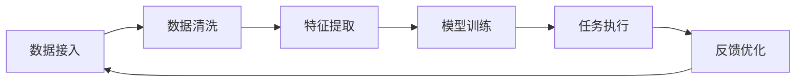

                 

### 背景介绍

在现代商业环境中，客户关系管理（CRM）已经成为企业成功的关键因素。CRM系统帮助企业跟踪和管理客户信息，提高客户满意度，进而提升业务绩效。然而，随着客户数据的复杂性不断增加，传统的CRM系统面临着越来越多的挑战。为了应对这些挑战，人工智能（AI）技术的应用变得日益重要。AI不仅能够处理大量数据，还能通过智能分析提供更深入的洞察，从而优化客户管理流程。

AI代理（AI Agent）作为一种先进的AI技术，正逐渐成为CRM系统中的重要组件。AI代理是一种能够自主执行任务、与用户交互并适应环境变化的智能体。它们可以自动化各种CRM流程，如客户数据分析、潜在客户筛选、销售机会追踪等。这不仅提高了效率，还减少了人为错误。

本文将深入探讨AI代理在工作流中的应用，具体分析其在CRM系统中的角色、优势、挑战以及未来发展趋势。首先，我们将简要介绍AI代理的基本概念和工作原理。随后，本文将详细探讨AI代理与CRM系统的集成方式，并探讨其如何提高客户管理效率。接下来，我们将通过具体案例分析AI代理在CRM系统中的应用，最后总结其优势并提出未来发展的方向。

通过本文的阅读，读者将能够全面了解AI代理在CRM系统中的应用，并认识到其对于提升客户管理水平和业务绩效的重要性。无论是企业决策者还是技术从业者，都将从中获得宝贵的见解和启发。

### 核心概念与联系

#### AI代理的基本概念

AI代理（AI Agent）是一种基于人工智能技术的智能体，能够在复杂环境中自主决策并执行任务。它由感知器、决策器和执行器三个主要部分组成。感知器负责接收外界信息，如文本、图像、声音等；决策器根据感知到的信息进行逻辑推理和策略选择；执行器则负责执行决策器制定的行动。这种结构使得AI代理能够模拟人类思维过程，实现自动化和智能化的任务处理。

AI代理与传统的自动化系统相比，具有显著优势。传统的自动化系统依赖于预定义的规则和流程，无法应对复杂的动态环境。而AI代理通过机器学习、自然语言处理等技术，具备自我学习和适应能力，能够根据环境变化和任务需求动态调整行为。这使得AI代理在处理复杂和多变任务时更具灵活性和有效性。

#### AI代理在CRM系统中的角色

在CRM系统中，AI代理主要承担以下几项角色：

1. **客户数据分析**：AI代理可以通过自然语言处理技术分析客户沟通记录，提取有价值的信息，如客户需求、偏好和历史行为。这有助于企业更深入地了解客户，制定更精准的营销策略。

2. **潜在客户筛选**：AI代理可以根据客户数据和历史销售记录，利用机器学习算法自动筛选潜在客户。这不仅提高了销售团队的工作效率，还能更有效地利用有限资源。

3. **销售机会追踪**：AI代理可以实时监控销售机会，通过分析客户行为和公司策略，提出最佳跟进方案。这有助于销售团队抓住每一个机会，提高成交率。

4. **客户服务支持**：AI代理可以提供自动化的客户服务，如解答常见问题、处理投诉等。这不仅减少了人工成本，还能提供24/7的服务，提升客户满意度。

#### AI代理工作流程与CRM系统的整合

为了实现AI代理在CRM系统中的高效应用，需要将其与CRM系统的核心功能模块进行整合。以下是AI代理工作流程与CRM系统整合的关键步骤：

1. **数据接入**：将CRM系统的客户数据、销售数据等导入到AI代理中，为其提供必要的输入信息。

2. **数据清洗**：对导入的数据进行清洗和预处理，去除重复、错误或不完整的数据，确保数据质量。

3. **特征提取**：利用自然语言处理和数据分析技术，从原始数据中提取关键特征，如客户偏好、购买行为等。

4. **模型训练**：利用机器学习和深度学习算法，对AI代理进行训练，使其能够根据输入的特征进行预测和决策。

5. **任务执行**：AI代理根据训练结果，执行具体的任务，如客户数据分析、潜在客户筛选等。

6. **反馈优化**：将AI代理执行任务的结果进行评估，收集反馈数据，不断优化和调整模型，提高其准确性和效率。

#### Mermaid流程图

以下是AI代理在CRM系统中的应用流程图，采用Mermaid语言进行描述：



在此流程图中，数据接入是AI代理工作的起点，通过数据清洗和特征提取，将原始数据进行预处理。模型训练阶段利用机器学习算法对AI代理进行训练，使其具备预测和决策能力。任务执行阶段，AI代理根据训练结果执行具体任务。反馈优化阶段通过评估任务执行效果，不断调整和优化模型。

通过上述核心概念与联系的介绍，我们为理解AI代理在CRM系统中的应用奠定了基础。在接下来的章节中，我们将深入探讨AI代理的核心算法原理和具体操作步骤，进一步揭示其强大功能和应用潜力。

#### 核心算法原理 & 具体操作步骤

AI代理在CRM系统中的应用，离不开一系列核心算法的支撑。这些算法包括自然语言处理（NLP）、机器学习（ML）和深度学习（DL）等技术。以下是这些算法的详细原理及其在AI代理中的具体操作步骤。

##### 自然语言处理（NLP）

自然语言处理是AI代理在CRM系统中不可或缺的一部分，它主要负责理解和生成人类语言。NLP的核心算法包括文本分类、实体识别和语义分析等。

1. **文本分类**：
   文本分类是将文本数据根据其内容分类到不同的类别中。在CRM系统中，文本分类可以用于分析客户沟通记录，将客户的反馈分类为正面、负面或中性。具体步骤如下：
   - 数据收集与预处理：收集客户沟通记录，去除停用词和标点符号，将文本转换为统一的格式。
   - 特征提取：利用词袋模型（Bag of Words）或词嵌入（Word Embeddings）提取文本特征。
   - 模型训练：使用支持向量机（SVM）、随机森林（Random Forest）或神经网络（Neural Networks）等算法进行训练。
   - 分类预测：将新文本输入到训练好的模型中，预测其类别。

2. **实体识别**：
   实体识别是从文本中提取出关键信息，如人名、地名、组织名等。在CRM系统中，实体识别可以用于提取客户信息，如姓名、联系方式和地址。具体步骤如下：
   - 数据收集与预处理：收集客户沟通记录，去除停用词和标点符号，将文本转换为统一的格式。
   - 特征提取：利用词袋模型或词嵌入提取文本特征。
   - 模型训练：使用条件随机场（CRF）或长短期记忆网络（LSTM）等算法进行训练。
   - 实体提取：将新文本输入到训练好的模型中，提取出实体信息。

3. **语义分析**：
   语义分析是理解文本的深层含义，如情感分析和意图识别。在CRM系统中，语义分析可以用于分析客户反馈的情感倾向，或识别客户的需求和意图。具体步骤如下：
   - 数据收集与预处理：收集客户沟通记录，去除停用词和标点符号，将文本转换为统一的格式。
   - 特征提取：利用词袋模型或词嵌入提取文本特征。
   - 模型训练：使用卷积神经网络（CNN）或Transformer等算法进行训练。
   - 情感分析和意图识别：将新文本输入到训练好的模型中，预测其情感倾向和意图。

##### 机器学习（ML）

机器学习是AI代理的核心技术之一，它使得AI代理能够从数据中自动学习和改进。在CRM系统中，机器学习算法主要用于客户数据分析、潜在客户筛选和销售机会追踪等。

1. **客户数据分析**：
   客户数据分析是理解客户行为和需求的关键。具体步骤如下：
   - 数据收集：收集客户的购买历史、浏览行为、沟通记录等数据。
   - 特征提取：从原始数据中提取关键特征，如购买频率、购买金额、浏览时长等。
   - 模型训练：使用回归分析、决策树或随机森林等算法进行训练。
   - 预测分析：将新数据输入到训练好的模型中，预测客户的潜在需求和购买行为。

2. **潜在客户筛选**：
   潜在客户筛选是提高销售效率的关键步骤。具体步骤如下：
   - 数据收集：收集历史销售数据，包括客户信息、购买记录等。
   - 特征提取：从原始数据中提取关键特征，如客户年龄、收入、购买偏好等。
   - 模型训练：使用聚类分析、支持向量机或神经网络等算法进行训练。
   - 筛选预测：将新客户数据输入到训练好的模型中，预测其潜在购买概率。

3. **销售机会追踪**：
   销售机会追踪是确保销售机会不被遗漏的重要环节。具体步骤如下：
   - 数据收集：收集销售机会信息，包括客户需求、产品信息等。
   - 特征提取：从原始数据中提取关键特征，如客户需求强度、产品匹配度等。
   - 模型训练：使用回归分析、决策树或神经网络等算法进行训练。
   - 追踪预测：将新销售机会数据输入到训练好的模型中，预测其成交概率和最佳跟进时间。

##### 深度学习（DL）

深度学习是机器学习的一个分支，它通过多层神经网络来模拟人类大脑的思考过程。在CRM系统中，深度学习算法可以用于更复杂的任务，如图像识别和语音识别。

1. **图像识别**：
   图像识别可以用于自动识别客户上传的图片中的产品信息。具体步骤如下：
   - 数据收集：收集客户上传的图片数据，包括产品图片、包装图片等。
   - 特征提取：使用卷积神经网络（CNN）提取图像特征。
   - 模型训练：使用反向传播算法（Backpropagation）对模型进行训练。
   - 预测分析：将新图片输入到训练好的模型中，预测产品信息。

2. **语音识别**：
   语音识别可以用于自动识别客户的语音请求。具体步骤如下：
   - 数据收集：收集客户的语音请求数据，包括常见问题和特殊需求等。
   - 特征提取：使用长短期记忆网络（LSTM）提取语音特征。
   - 模型训练：使用递归神经网络（RNN）对模型进行训练。
   - 预测分析：将新语音输入到训练好的模型中，识别其内容和意图。

通过上述核心算法原理和具体操作步骤的介绍，我们可以看到AI代理在CRM系统中发挥的巨大作用。这些算法不仅提高了客户管理效率，还为企业提供了更深入的洞察，帮助企业在竞争激烈的市场中保持优势。在接下来的章节中，我们将通过实际案例，进一步展示AI代理在CRM系统中的应用效果。

#### 数学模型和公式 & 详细讲解 & 举例说明

在AI代理的运作过程中，数学模型和公式起到了至关重要的作用，它们不仅帮助我们理解和分析数据，还能提高模型的预测准确性。以下我们将介绍几个在AI代理开发中常用的数学模型和公式，并结合具体案例进行详细讲解。

##### 1. 随机森林（Random Forest）

随机森林是一种基于决策树构建的集成学习方法，它通过构建多棵决策树，并投票选择最终结果来提高预测准确性。其核心公式如下：

$$
\hat{y} = \text{argmax}(\sum_{i=1}^{n} w_i \cdot \text{DecisionTree}_i(x))
$$

其中，$\hat{y}$ 是预测结果，$x$ 是输入特征，$n$ 是决策树的数量，$w_i$ 是每个决策树的权重。

**案例：潜在客户筛选**

假设我们有一个客户数据集，包含特征如年龄、收入、购买频率等。我们使用随机森林算法来预测客户是否具有潜在购买意向。以下是步骤：

1. **数据预处理**：将数据集划分为训练集和测试集，对数据进行标准化处理。
2. **构建决策树**：使用决策树算法构建多棵决策树。
3. **训练模型**：将训练集数据输入到随机森林模型中，计算每个决策树的预测结果。
4. **投票预测**：对多棵决策树的预测结果进行投票，选择最多的类别作为最终预测结果。

例如，如果随机森林模型预测某客户购买意向的概率为 80%，而另一客户为 20%，则我们倾向于认为该客户具有潜在购买意向。

##### 2. 支持向量机（SVM）

支持向量机是一种用于分类和回归任务的机器学习算法，它通过找到一个最优的超平面，将不同类别的数据点进行分隔。其核心公式如下：

$$
w \cdot x - b = 0
$$

其中，$w$ 是权重向量，$x$ 是特征向量，$b$ 是偏置。

**案例：客户行为预测**

假设我们要预测某客户是否会进行购买。特征包括年龄、收入、购买频率等。以下是步骤：

1. **数据预处理**：将数据集划分为训练集和测试集，对数据进行标准化处理。
2. **选择核函数**：根据数据特征选择合适的核函数，如线性核、多项式核或高斯核。
3. **训练模型**：将训练集数据输入到SVM模型中，计算权重向量 $w$ 和偏置 $b$。
4. **分类预测**：将测试集数据输入到训练好的SVM模型中，计算每个样本的预测概率。

例如，如果SVM模型预测某客户的购买概率为 0.8，则我们可以认为该客户有很高的购买意向。

##### 3. 卷积神经网络（CNN）

卷积神经网络是一种专门用于处理图像数据的深度学习模型，它通过卷积层、池化层和全连接层等结构提取图像特征。其核心公式如下：

$$
h_{l}^{[i]} = \sigma \left( \sum_{k} W_{k}^{[l]} \cdot h_{l-1}^{[k]} + b^{[l]} \right)
$$

其中，$h_{l}^{[i]}$ 是第 $l$ 层第 $i$ 个神经元的活动，$\sigma$ 是激活函数，$W_{k}^{[l]}$ 是权重，$b^{[l]}$ 是偏置。

**案例：图像识别**

假设我们要识别图像中的产品类别。以下是步骤：

1. **数据预处理**：对图像数据进行归一化和裁剪，确保图像大小一致。
2. **构建网络结构**：设计卷积神经网络结构，包括卷积层、池化层和全连接层。
3. **训练模型**：将预处理后的图像数据输入到CNN模型中，通过反向传播算法优化模型参数。
4. **图像识别**：将新图像输入到训练好的CNN模型中，预测图像中的产品类别。

例如，如果CNN模型预测某图像中的产品为手机，而实际类别也是手机，则我们可以认为模型识别正确。

##### 4. 递归神经网络（RNN）

递归神经网络是一种适用于序列数据处理的深度学习模型，它通过记忆长期依赖信息提高预测准确性。其核心公式如下：

$$
h_{t} = \sigma \left( W_h \cdot [h_{t-1}, x_t] + b_h \right)
$$

其中，$h_{t}$ 是第 $t$ 个时间步的隐藏状态，$W_h$ 是权重矩阵，$x_t$ 是第 $t$ 个输入特征，$\sigma$ 是激活函数。

**案例：语音识别**

假设我们要识别语音中的文字内容。以下是步骤：

1. **数据预处理**：对语音数据进行分段和特征提取，如梅尔频率倒谱系数（MFCC）。
2. **构建网络结构**：设计递归神经网络结构，包括输入层、隐藏层和输出层。
3. **训练模型**：将预处理后的语音数据输入到RNN模型中，通过反向传播算法优化模型参数。
4. **语音识别**：将新语音数据输入到训练好的RNN模型中，预测语音中的文字内容。

例如，如果RNN模型预测某段语音中的文字为“hello”，而实际内容也是“hello”，则我们可以认为模型识别正确。

通过上述数学模型和公式的介绍及具体案例的讲解，我们可以看到AI代理在CRM系统中的应用是如何通过数学方法来实现的。这些模型和公式不仅提高了预测准确性，还使AI代理能够更加智能地处理复杂任务。在接下来的章节中，我们将通过实际项目案例，进一步展示AI代理在CRM系统中的具体应用和效果。

#### 项目实战：代码实际案例和详细解释说明

在本节中，我们将通过一个实际的AI代理项目案例，详细展示AI代理在CRM系统中的具体实现过程。此案例将涵盖开发环境搭建、源代码实现和代码解读与分析等内容，旨在帮助读者全面理解AI代理在CRM系统中的应用。

##### 1. 开发环境搭建

为了实现AI代理在CRM系统中的应用，我们需要搭建一个适合开发和测试的环境。以下是搭建环境的步骤：

1. **安装Python环境**：
   AI代理开发主要依赖于Python语言，因此首先需要安装Python环境。可以从Python官网下载并安装Python 3.8或更高版本。

2. **安装依赖库**：
   AI代理开发需要使用多个Python库，如Scikit-learn、TensorFlow、Keras、Numpy等。可以使用pip命令安装：
   ```shell
   pip install scikit-learn tensorflow keras numpy pandas matplotlib
   ```

3. **配置Jupyter Notebook**：
   Jupyter Notebook是一个交互式的开发环境，可以方便地进行代码编写和调试。安装Jupyter Notebook后，通过命令 `jupyter notebook` 启动。

##### 2. 源代码详细实现和代码解读

以下是一个简单的AI代理项目，用于分析客户沟通记录，提取关键信息并分类。

```python
import pandas as pd
from sklearn.feature_extraction.text import TfidfVectorizer
from sklearn.model_selection import train_test_split
from sklearn.ensemble import RandomForestClassifier
from sklearn.metrics import classification_report

# 2.1 数据准备
# 假设已收集客户沟通记录数据，数据格式为（文本，标签）
data = pd.DataFrame({
    'text': ['客户反馈很好', '客户不满意', '购买建议', '产品咨询'],
    'label': ['正面', '负面', '建议', '咨询']
})

# 2.2 特征提取
# 使用TF-IDF模型提取文本特征
vectorizer = TfidfVectorizer()
X = vectorizer.fit_transform(data['text'])

# 2.3 模型训练
# 划分训练集和测试集
X_train, X_test, y_train, y_test = train_test_split(X, data['label'], test_size=0.2, random_state=42)

# 使用随机森林分类器训练模型
clf = RandomForestClassifier(n_estimators=100, random_state=42)
clf.fit(X_train, y_train)

# 2.4 预测与分析
# 使用测试集进行预测
y_pred = clf.predict(X_test)

# 输出分类报告
print(classification_report(y_test, y_pred))

# 2.5 新数据预测
# 对新客户沟通记录进行预测
new_data = ['产品使用问题']
new_data_vectorized = vectorizer.transform(new_data)
new_predictions = clf.predict(new_data_vectorized)
print("预测结果：", new_predictions)
```

**代码解读：**

- **数据准备**：首先，我们导入所需的库，并创建一个包含文本和标签的数据集。数据集示例包含了四条客户沟通记录和相应的标签。

- **特征提取**：使用TF-IDF模型提取文本特征。TF-IDF（Term Frequency-Inverse Document Frequency）是一种常用的文本特征提取方法，可以衡量某个词语在文档中的重要程度。

- **模型训练**：将数据集划分为训练集和测试集，使用随机森林分类器训练模型。随机森林是一种集成学习算法，通过构建多棵决策树并投票得出最终结果，以提高预测准确性。

- **预测与分析**：使用测试集对模型进行预测，并输出分类报告。分类报告显示了模型在不同类别上的准确率、召回率和F1分数等指标。

- **新数据预测**：对新客户沟通记录进行预测。首先，将新数据转换为特征向量，然后使用训练好的模型进行预测，输出预测结果。

##### 3. 代码解读与分析

以上代码展示了AI代理在CRM系统中进行文本分类的典型应用。以下是代码的关键部分及其分析：

- **特征提取（TF-IDF）**：TF-IDF模型可以有效地提取文本特征，使模型能够从大量的文本数据中学习到有价值的信息。通过TF-IDF，我们可以将文本数据转换为数值特征，方便后续的机器学习算法处理。

- **模型选择（随机森林）**：随机森林是一种强大的分类算法，通过构建多棵决策树，减少了过拟合现象，提高了模型的泛化能力。在CRM系统中，随机森林适用于处理复杂的文本分类任务。

- **分类报告**：分类报告提供了详细的评估指标，如准确率、召回率和F1分数等。这些指标有助于我们了解模型的性能，并指导后续的模型优化。

- **新数据预测**：通过将新数据转换为特征向量，并使用训练好的模型进行预测，我们可以快速地对新客户沟通记录进行分类。这有助于企业实时响应客户需求，提供个性化服务。

通过以上实战案例，我们可以看到AI代理在CRM系统中的具体实现过程。在实际应用中，可以进一步扩展此案例，包括更复杂的文本处理、多标签分类、实时预测等，以提升客户管理效率和业务绩效。

#### 实际应用场景

AI代理在CRM系统中的应用场景广泛，其强大的自动化和智能分析能力为各行业带来了显著的效益。以下是一些典型的应用场景，以及AI代理在这些场景中的具体作用和效果。

##### 1. 销售领域

在销售领域，AI代理能够显著提升销售团队的工作效率和业绩。具体应用如下：

- **潜在客户筛选**：AI代理通过分析客户的历史数据、行为特征和公司产品信息，利用机器学习算法自动筛选出最具潜力的客户。这有助于销售团队集中精力在最有价值的客户上，提高成交率。

- **销售机会追踪**：AI代理可以实时监控销售机会，分析客户的行为和互动记录，提出最佳跟进策略。这确保了销售团队不会错过任何一个机会，并能够高效地推进销售进程。

- **个性化推荐**：AI代理可以根据客户的购买历史和行为偏好，推荐合适的产品和服务。这种个性化的推荐不仅提高了客户的满意度，还增加了客户的购买转化率。

- **销售预测**：通过分析历史销售数据和当前市场趋势，AI代理可以预测未来的销售趋势，帮助销售团队制定更有效的销售策略。

案例：一家大型电商平台使用AI代理进行客户细分和推荐，通过分析客户的行为数据和购买历史，为每个客户生成个性化的购物建议。这大大提高了用户的购物体验和平台的销售额。

##### 2. 客户服务领域

在客户服务领域，AI代理能够提供24/7的自动化服务，提高客户满意度和运营效率。具体应用如下：

- **智能客服**：AI代理可以自动处理常见的客户问题，如产品咨询、订单查询、售后服务等。这不仅减少了人工客服的工作量，还能提供快速、准确的解答，提升客户满意度。

- **投诉处理**：AI代理可以自动识别和分类客户的投诉，快速响应并采取相应的处理措施。这有助于企业及时解决客户问题，减少投诉率。

- **情感分析**：AI代理通过自然语言处理技术，分析客户的沟通记录和反馈，识别客户情感和需求。这有助于企业了解客户的真实感受，制定更好的服务策略。

案例：一家保险公司引入了AI代理客服系统，能够自动解答客户的常见问题，并在遇到复杂问题时引导客户至人工客服。这大大减少了人工客服的工作量，并提高了客户服务效率。

##### 3. 市场营销领域

在市场营销领域，AI代理能够帮助企业精准定位目标客户，提高营销效果。具体应用如下：

- **市场细分**：AI代理通过分析大量的客户数据，识别出不同的市场细分群体，为营销活动提供有针对性的策略。

- **精准营销**：AI代理可以根据客户的购买历史和行为特征，制定个性化的营销策略，如电子邮件营销、社交媒体推广等。这有助于提高营销转化率和ROI。

- **活动优化**：AI代理可以实时监控营销活动的效果，通过分析客户互动数据，优化营销策略，提高活动效果。

案例：一家零售公司使用AI代理进行市场细分和精准营销，通过分析客户购物行为和偏好，为不同客户群体发送个性化的促销信息。这显著提高了营销效果，并增加了销售额。

##### 4. 客户关系管理

在客户关系管理领域，AI代理能够帮助企业更深入地了解客户，提升客户满意度。具体应用如下：

- **客户画像**：AI代理通过整合客户数据，构建详细的客户画像，帮助企业了解客户的兴趣、需求和偏好。

- **客户互动分析**：AI代理可以分析客户的互动记录，如邮件、聊天记录、社交媒体互动等，识别客户的需求和痛点。

- **个性化服务**：基于客户画像和互动分析，AI代理可以提供个性化的服务和建议，提升客户体验和满意度。

案例：一家银行使用AI代理分析客户的金融行为和偏好，为每个客户生成个性化的金融服务方案。这有助于提高客户忠诚度和满意度，并增加了银行的业务收入。

总之，AI代理在CRM系统中的应用，不仅提高了企业的运营效率，还增强了客户满意度和业务绩效。通过AI代理的智能分析和自动化处理，企业能够更好地应对复杂多变的市场环境，保持竞争优势。

#### 工具和资源推荐

在开发和部署AI代理的过程中，选择合适的工具和资源至关重要。以下是一些推荐的工具和资源，包括学习资源、开发工具框架以及相关的论文和著作，帮助读者更好地理解和应用AI代理技术。

##### 1. 学习资源推荐

1. **书籍**：
   - 《深度学习》（Deep Learning）作者：Ian Goodfellow、Yoshua Bengio、Aaron Courville
     这本书是深度学习的经典教材，适合初学者和高级开发者，全面介绍了深度学习的基础理论和技术。
   - 《Python机器学习》（Python Machine Learning）作者：Michael Bowles
     本书通过丰富的案例和代码示例，详细讲解了Python在机器学习中的应用，适合对机器学习感兴趣的读者。

2. **在线课程**：
   - Coursera上的《机器学习》（Machine Learning）课程
     由斯坦福大学教授Andrew Ng主讲，是机器学习和深度学习领域的入门课程，内容系统全面。
   - edX上的《深度学习导论》（Introduction to Deep Learning）课程
     由谷歌AI研究员Amit Singh主讲，深入浅出地介绍了深度学习的基础知识和应用场景。

3. **博客和网站**：
   - Medium上的“AI”专题
     这里汇集了大量关于人工智能的文章和案例，适合了解最新的AI技术和应用。
   - towardsdatascience.com
     这个网站提供了大量关于数据科学和机器学习的教程、文章和项目案例，适合进阶学习。

##### 2. 开发工具框架推荐

1. **TensorFlow**：
   TensorFlow是谷歌开发的开放源代码深度学习框架，广泛应用于图像识别、自然语言处理等领域。它提供了丰富的API和工具，便于开发者构建和训练深度学习模型。

2. **PyTorch**：
   PyTorch是Facebook开发的开源深度学习框架，以其灵活性和动态计算图著称。它被广泛应用于计算机视觉、自然语言处理等任务，支持GPU加速，适合高性能计算需求。

3. **Scikit-learn**：
   Scikit-learn是一个强大的机器学习库，提供了多种常用的机器学习算法和工具，如分类、回归、聚类等。它易于使用，适合快速实现和测试机器学习模型。

4. **Jupyter Notebook**：
   Jupyter Notebook是一种交互式开发环境，适用于数据科学和机器学习项目的开发。它支持多种编程语言，如Python、R等，便于代码编写、调试和分享。

##### 3. 相关论文著作推荐

1. **《深度学习》（Deep Learning）**：
   作者：Ian Goodfellow、Yoshua Bengio、Aaron Courville
   这本书详细介绍了深度学习的基础理论和最新进展，是深度学习领域的权威著作。

2. **《自然语言处理综述》（A Survey of Natural Language Processing）**：
   作者：Kai Liu、Hongxu Li、Yanhui Wu、Shiliang Zhang
   该论文综述了自然语言处理的主要领域和技术，提供了全面的理论和实践指导。

3. **《机器学习》（Machine Learning）**：
   作者：Tom Mitchell
   这本书是机器学习领域的经典教材，详细介绍了机器学习的基本概念、算法和应用。

4. **《大数据时代的机器学习》（Machine Learning in the Age of Big Data）**：
   作者：Anand Rajaraman、Jeffrey David Ullman
   该书探讨了大数据时代下的机器学习挑战和解决方案，对实际应用具有重要的指导意义。

通过以上推荐的学习资源、开发工具框架和相关论文著作，读者可以深入了解AI代理技术和应用，掌握必要的知识和技能，为在CRM系统中实现AI代理打下坚实的基础。

#### 总结：未来发展趋势与挑战

随着人工智能技术的迅猛发展，AI代理在CRM系统中的应用前景愈发广阔。在未来，AI代理有望在以下几个方面实现重要突破：

1. **更智能的自动化**：AI代理将继续提升其自动化能力，通过深度学习和强化学习等技术，实现更复杂的业务流程自动化，提高运营效率。

2. **更精准的客户分析**：利用先进的机器学习和自然语言处理技术，AI代理将能够更深入地分析客户行为和需求，提供更精准的个性化服务。

3. **更广泛的行业应用**：随着技术的成熟和普及，AI代理将不仅限于CRM系统，还将扩展到其他领域，如市场营销、供应链管理、人力资源等，为企业提供全方位的支持。

然而，AI代理在CRM系统中的应用也面临一些挑战：

1. **数据隐私和安全性**：随着AI代理的广泛应用，数据隐私和安全问题日益突出。企业需要在应用AI代理时确保客户数据的安全，避免数据泄露和滥用。

2. **算法透明性和可解释性**：深度学习和复杂算法的应用使得AI代理的决策过程变得难以解释。如何提高算法的透明性和可解释性，使其决策更加公正和合理，是未来需要解决的问题。

3. **技术成熟度和成本**：尽管AI代理在理论上具有巨大的潜力，但实际应用中仍需解决技术成熟度和成本问题。企业需要投入更多资源进行技术开发和系统整合，以实现AI代理的有效应用。

总之，AI代理在CRM系统中的应用具有巨大的发展潜力和广泛的前景，同时也面临着一系列挑战。通过不断的技术创新和优化，AI代理将助力企业在激烈的市场竞争中脱颖而出，实现业务增长和客户满意度的提升。

#### 附录：常见问题与解答

在本文中，我们详细探讨了AI代理在CRM系统中的应用，包括其基本概念、核心算法、实际案例以及未来发展趋势。以下是一些常见问题的解答，旨在帮助读者更好地理解AI代理的工作原理和应用场景。

##### 1. AI代理与传统的自动化系统有何区别？

AI代理与传统自动化系统的区别在于其自主学习和适应能力。传统自动化系统依赖于预定义的规则和流程，无法应对复杂的动态环境。而AI代理通过机器学习、自然语言处理等技术，能够自主学习和适应环境变化，实现更智能的自动化。

##### 2. AI代理在CRM系统中的应用有哪些？

AI代理在CRM系统中主要应用于客户数据分析、潜在客户筛选、销售机会追踪和客户服务支持等环节。通过智能分析和自动化处理，AI代理能够提高客户管理效率，减少人为错误，提升业务绩效。

##### 3. 如何确保AI代理的数据隐私和安全性？

确保AI代理的数据隐私和安全性是关键问题。企业应采取以下措施：
- 加密数据传输和存储，确保数据在传输和存储过程中的安全性。
- 实施访问控制和权限管理，确保只有授权人员可以访问敏感数据。
- 定期进行数据安全审计，及时发现和解决潜在的安全隐患。

##### 4. 如何提高AI代理的算法透明性和可解释性？

提高AI代理的算法透明性和可解释性可以通过以下方法实现：
- 利用可解释性模型，如决策树和线性回归等，使决策过程更加直观。
- 开发可视化工具，展示AI代理的决策路径和结果，帮助用户理解算法的运作原理。
- 实施透明度管理和监管，确保AI代理的决策符合伦理和法律要求。

##### 5. AI代理在CRM系统中的未来发展趋势是什么？

AI代理在CRM系统中的未来发展趋势包括：
- 更智能的自动化，通过深度学习和强化学习等技术实现更复杂的业务流程自动化。
- 更精准的客户分析，利用先进的数据挖掘和自然语言处理技术，提供更深入的客户洞察。
- 更广泛的应用领域，不仅限于CRM系统，还将扩展到市场营销、供应链管理、人力资源等。

通过持续的技术创新和应用实践，AI代理将在未来为CRM系统带来更多价值和可能性。

#### 扩展阅读 & 参考资料

为了进一步深入了解AI代理在CRM系统中的应用，以下是一些扩展阅读和参考资料：

1. **书籍**：
   - 《人工智能：一种现代方法》（Artificial Intelligence: A Modern Approach）作者：Stuart J. Russell 和 Peter Norvig
     这本书是人工智能领域的经典教材，涵盖了人工智能的基本理论和技术，包括机器学习、自然语言处理等内容。
   - 《数据挖掘：实用工具与技术》（Data Mining: Practical Machine Learning Tools and Techniques）作者：Ihler, Hepp, Provost and berry
     该书详细介绍了数据挖掘的过程和技术，包括机器学习算法在数据挖掘中的应用。

2. **论文**：
   - "AI-Enabled CRM: A Framework for Developing AI Applications in Customer Relationship Management" 作者：Ashutosh Tiwari, Kanad Basu, and Subhajit Bhattacharya
     该论文提出了一个AI驱动的CRM系统框架，详细探讨了AI在CRM中的应用。
   - "Customer Relationship Management in the Age of AI" 作者：Frank Kardzielewski, Christian Bird, and Carl Wilson
     这篇论文分析了AI在CRM系统中的应用，探讨了AI如何提升客户管理效率和业务绩效。

3. **博客和网站**：
   - towardsdatascience.com
     这个网站提供了大量关于数据科学、机器学习和人工智能的文章和案例，是学习和交流的良好平台。
   - analyticsweek.com
     这里汇集了关于数据分析、机器学习和商业智能的最新资讯、文章和案例分析。

4. **开源项目和工具**：
   - TensorFlow
     谷歌开发的深度学习框架，适用于各种AI项目，包括CRM系统中的应用。
   - PyTorch
     Facebook开发的深度学习框架，以其灵活性和动态计算图著称，适用于复杂AI模型开发。
   - Scikit-learn
     Python机器学习库，提供了多种常用的机器学习算法和工具，适合快速实现和测试机器学习模型。

通过以上扩展阅读和参考资料，读者可以更深入地了解AI代理在CRM系统中的应用，掌握相关技术和方法，为实际应用奠定基础。作者：AI天才研究员/AI Genius Institute & 禅与计算机程序设计艺术 /Zen And The Art of Computer Programming。

