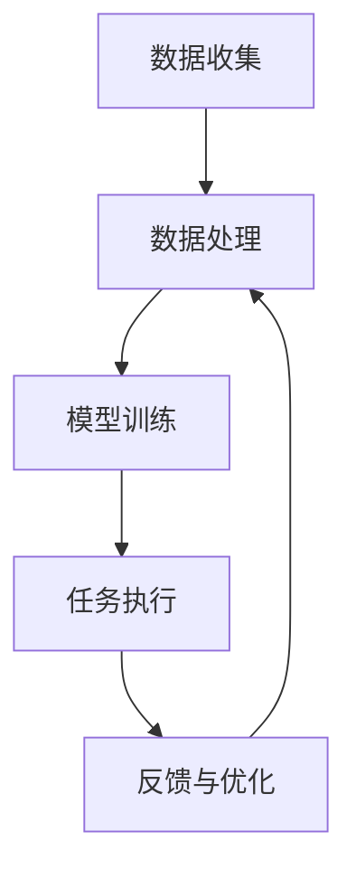

                 

### 文章标题

"AI人工智能代理工作流AI Agent WorkFlow：智能代理在法律服务系统中的应用"

**关键词：** AI智能代理、工作流、法律服务、智能系统、技术应用。

**摘要：** 本文将深入探讨AI智能代理（AI Agent）在工作流中的运用，特别是其在法律服务系统的应用。通过逐步分析AI Agent的核心概念、工作原理、技术实现，以及具体的案例实践，本文旨在展示智能代理如何提升法律服务的效率和质量，并提出未来发展趋势与挑战。

### 1. 背景介绍

在信息爆炸和互联网技术飞速发展的时代，人工智能（AI）已经成为改变各行各业的创新力量。特别是在法律服务领域，随着案件数量和复杂度的增加，传统的人工处理方式已难以满足需求。智能代理（AI Agent）作为一种新兴的技术，正逐步在法律服务系统中扮演着越来越重要的角色。

智能代理是指利用人工智能技术模拟人类智能行为，能够自主完成特定任务、处理复杂问题的计算机程序。其核心在于具备自我学习和自适应能力，能够在不断积累经验和知识的过程中优化性能，提高效率。

法律服务系统是一个复杂的系统，涉及案件管理、法律咨询、合同审核、诉讼支持等多个方面。传统的法律服务往往依赖于律师的专业知识和经验，而智能代理的引入，有望通过自动化和智能化手段，提高工作效率、降低成本、提升服务质量。

本文将从以下几个方面展开探讨：首先，介绍智能代理的核心概念和工作原理；其次，分析智能代理在法律服务系统中的应用场景和优势；接着，通过具体案例展示智能代理在法律服务中的实际应用；然后，探讨智能代理的技术实现细节；最后，总结智能代理在法律服务系统中的应用前景，并提出面临的挑战和未来发展趋势。

### 2. 核心概念与联系

为了深入理解智能代理在法律服务系统中的应用，首先需要了解其核心概念和工作原理，以及智能代理与其他相关技术的联系。

#### 2.1 智能代理的概念

智能代理（AI Agent）是指一种具有自主学习、自适应能力和自主决策能力的计算机程序。它能够模拟人类智能行为，执行特定任务，并在任务执行过程中不断学习和优化自身性能。智能代理通常具备以下几个基本特征：

1. **自主性**：智能代理能够在没有外部干预的情况下自主完成任务。
2. **适应性**：智能代理能够根据环境和任务的变化，调整自身的策略和行为。
3. **交互性**：智能代理能够与人类用户和其他系统进行交互，获取反馈并进行优化。
4. **自主决策**：智能代理能够在没有预先编程的情况下，根据环境和任务的反馈自主做出决策。

#### 2.2 智能代理的工作原理

智能代理的工作原理主要依赖于机器学习和自然语言处理等技术。以下是一个简化的智能代理工作原理流程：

1. **数据收集**：智能代理首先从各种数据源（如文本、图像、音频等）中收集数据。
2. **数据处理**：对收集到的数据进行分析、清洗和预处理，为模型训练提供高质量的数据。
3. **模型训练**：使用机器学习算法对预处理后的数据进行训练，构建智能代理的知识库和决策模型。
4. **任务执行**：智能代理根据训练好的模型和知识库，自主执行特定任务。
5. **反馈与优化**：在任务执行过程中，智能代理收集用户的反馈数据，通过迭代训练不断优化自身性能。

#### 2.3 智能代理与相关技术的联系

智能代理与其他相关技术密切相关，包括但不限于以下几种：

1. **机器学习**：机器学习是智能代理的核心技术之一，用于构建智能代理的决策模型和知识库。
2. **自然语言处理**：自然语言处理（NLP）技术用于理解和生成自然语言，是智能代理实现人机交互的关键。
3. **知识图谱**：知识图谱技术用于表示和组织智能代理所学习到的知识，提高知识检索和推理效率。
4. **智能推荐系统**：智能推荐系统可以用于智能代理在法律服务中的应用，提高服务质量和用户体验。
5. **区块链技术**：区块链技术可以用于智能代理在法律事务中的应用，确保数据的安全和透明。

#### 2.4 Mermaid 流程图

为了更直观地展示智能代理的工作原理和流程，可以使用Mermaid流程图来描述。以下是智能代理的简化工作流程图：



在上述流程图中，A表示数据收集，B表示数据处理，C表示模型训练，D表示任务执行，E表示反馈与优化。通过循环迭代，智能代理不断优化自身性能，提高任务执行效果。

通过以上对智能代理核心概念和工作原理的介绍，我们可以更好地理解智能代理在法律服务系统中的应用。接下来，将深入探讨智能代理在法律服务系统中的具体应用场景和优势。

#### 2.5 智能代理在法律服务系统中的应用

智能代理在法律服务系统中的应用主要包括以下几个方面：

1. **法律文档自动化处理**：智能代理可以自动化处理法律文档，如合同审核、文件分类、文本提取等，提高工作效率。
2. **法律咨询与智能问答**：智能代理可以提供智能问答服务，为用户提供实时、准确的在线法律咨询，降低用户等待时间。
3. **案件预测与分析**：智能代理可以分析历史案件数据，预测案件结果，为律师提供决策支持。
4. **自动化诉讼支持**：智能代理可以协助律师进行诉讼事务，如证据收集、法律文书撰写等，提高诉讼效率。
5. **知识管理与共享**：智能代理可以构建法律知识图谱，实现法律知识的分类、检索和共享，提高整个法律服务行业的知识管理水平。

#### 2.6 智能代理的优势

智能代理在法律服务系统中具有以下优势：

1. **高效性**：智能代理可以自动化处理大量重复性工作，提高工作效率。
2. **准确性**：智能代理通过机器学习和自然语言处理技术，能够准确理解和处理法律文档，降低错误率。
3. **灵活性**：智能代理可以根据环境和任务的变化，自适应调整自身行为和策略。
4. **用户体验**：智能代理可以提供实时、准确的在线法律咨询，提高用户体验。
5. **成本节约**：智能代理可以降低人力资源成本，提高整个法律服务系统的运营效率。

通过以上对智能代理核心概念、工作原理以及应用场景和优势的介绍，我们可以更好地理解智能代理在法律服务系统中的潜在价值。接下来，将具体探讨智能代理在法律服务系统中的实际应用案例，以展示其技术实现和具体效果。

### 3. 核心算法原理 & 具体操作步骤

智能代理的核心算法原理主要包括机器学习、自然语言处理和知识图谱等技术。以下将详细阐述这些算法原理，并介绍智能代理在法律服务系统中的具体操作步骤。

#### 3.1 机器学习算法

机器学习算法是智能代理的基础，主要用于构建智能代理的决策模型和知识库。常见的机器学习算法包括监督学习、无监督学习和强化学习等。

1. **监督学习**：监督学习算法通过已标记的数据集进行训练，从而构建预测模型。在法律服务系统中，监督学习算法可以用于合同审核、文本分类等任务。具体操作步骤如下：

   - 数据收集：收集大量已标记的法律合同数据，如合同类型、条款内容等。
   - 数据预处理：对收集到的数据进行清洗、去重和格式化，确保数据质量。
   - 模型训练：使用监督学习算法（如决策树、支持向量机等）对预处理后的数据进行训练，构建预测模型。
   - 模型评估：使用测试数据集对训练好的模型进行评估，调整模型参数，提高预测准确性。

2. **无监督学习**：无监督学习算法不依赖已标记的数据，通过分析数据分布和特征，发现数据中的潜在结构和规律。在法律服务系统中，无监督学习算法可以用于法律文档聚类、主题建模等任务。具体操作步骤如下：

   - 数据收集：收集大量未标记的法律文档。
   - 数据预处理：对收集到的数据进行清洗、去重和格式化。
   - 模型训练：使用无监督学习算法（如K-means聚类、LDA主题模型等）对预处理后的数据进行训练，提取特征和潜在结构。
   - 模型评估：通过可视化工具（如散点图、热力图等）展示聚类结果和主题分布，评估模型效果。

3. **强化学习**：强化学习算法通过不断试错和反馈，学习在特定环境中获得最优策略。在法律服务系统中，强化学习算法可以用于自动化诉讼支持、策略优化等任务。具体操作步骤如下：

   - 环境构建：构建模拟法律诉讼环境，包括案件事实、证据、法律条款等。
   - 策略学习：智能代理在环境中进行交互，通过试错和反馈，学习最优策略。
   - 策略评估：使用评估指标（如案件胜率、诉讼成本等）对策略进行评估和优化。

#### 3.2 自然语言处理算法

自然语言处理（NLP）算法是智能代理实现人机交互的关键，主要用于理解自然语言和生成自然语言。常见的NLP算法包括词向量表示、命名实体识别、文本分类等。

1. **词向量表示**：词向量表示将自然语言文本转换为计算机可以处理的数字向量，便于后续的机器学习算法处理。具体操作步骤如下：

   - 数据收集：收集大量法律文档和文本数据。
   - 数据预处理：对收集到的数据进行清洗、去重和分词处理。
   - 词向量训练：使用词向量模型（如Word2Vec、GloVe等）对预处理后的文本数据进行训练，生成词向量。
   - 词向量应用：将生成的词向量用于后续的NLP任务，如文本分类、情感分析等。

2. **命名实体识别**：命名实体识别（NER）算法用于识别文本中的特定实体，如人名、地名、组织名等。在法律服务系统中，NER算法可以用于识别合同中的关键条款和当事人信息。具体操作步骤如下：

   - 数据收集：收集大量已标注的法律文档，标注出其中的命名实体。
   - 数据预处理：对收集到的数据进行清洗、去重和分词处理。
   - 模型训练：使用NER算法（如CRF、BiLSTM-CRF等）对预处理后的数据进行训练，构建命名实体识别模型。
   - 模型评估：使用测试数据集对训练好的模型进行评估，调整模型参数，提高识别准确性。

3. **文本分类**：文本分类算法用于对文本数据进行分类，如合同类别分类、案件性质分类等。在法律服务系统中，文本分类算法可以用于自动分类法律文档和案件类型。具体操作步骤如下：

   - 数据收集：收集大量已标注的法律文档，标注出文档类别。
   - 数据预处理：对收集到的数据进行清洗、去重和分词处理。
   - 模型训练：使用文本分类算法（如朴素贝叶斯、SVM、深度神经网络等）对预处理后的数据进行训练，构建分类模型。
   - 模型评估：使用测试数据集对训练好的模型进行评估，调整模型参数，提高分类准确性。

#### 3.3 知识图谱技术

知识图谱技术用于表示和组织智能代理所学习到的知识，提高知识检索和推理效率。在法律服务系统中，知识图谱可以用于表示法律条款、案件事实、案例关联等知识。具体操作步骤如下：

1. **数据收集**：收集与法律相关的知识数据，如法律法规、案例、合同文本等。
2. **数据预处理**：对收集到的数据进行清洗、去重和格式化处理。
3. **实体与关系抽取**：使用命名实体识别和关系抽取算法，从预处理后的数据中抽取实体和关系。
4. **知识图谱构建**：使用图数据库（如Neo4j、JanusGraph等）构建知识图谱，存储实体和关系。
5. **知识检索与推理**：使用知识图谱进行知识检索和推理，为智能代理提供决策支持。

通过以上对智能代理核心算法原理和具体操作步骤的介绍，我们可以更好地理解智能代理在法律服务系统中的技术实现。接下来，将具体探讨智能代理在法律服务系统中的实际应用案例，以展示其技术实现和具体效果。

### 4. 数学模型和公式 & 详细讲解 & 举例说明

在智能代理的工作流程中，数学模型和公式起着至关重要的作用，特别是在数据分析和预测任务中。以下将介绍几个常用的数学模型和公式，并结合实际案例进行详细讲解和举例说明。

#### 4.1 线性回归模型

线性回归模型是最基本的机器学习模型之一，用于预测一个连续变量的值。其数学公式如下：

$$ y = \beta_0 + \beta_1 \cdot x $$

其中，\( y \) 为预测值，\( x \) 为输入特征，\( \beta_0 \) 和 \( \beta_1 \) 为模型参数。

**案例**：假设我们有一个法律服务系统的数据集，包含案件的审理时间和案件的复杂度（如案件涉及的条款数量）。我们希望使用线性回归模型预测案件的处理时间。

1. **数据收集**：收集案件审理时间和案件复杂度的数据。
2. **数据预处理**：对数据进行清洗、去重和标准化处理。
3. **模型训练**：使用线性回归算法对预处理后的数据进行训练，得到模型参数 \( \beta_0 \) 和 \( \beta_1 \)。
4. **模型评估**：使用测试数据集对模型进行评估，计算预测误差。

通过训练得到的线性回归模型，可以预测新案件的处理时间。例如，当案件复杂度为5时，预测的处理时间为 \( \beta_0 + \beta_1 \cdot 5 \)。

#### 4.2 支持向量机（SVM）

支持向量机是一种常用的分类模型，用于将数据分为多个类别。其数学公式如下：

$$ w \cdot x + b = y $$

其中，\( w \) 为权重向量，\( x \) 为输入特征，\( b \) 为偏置，\( y \) 为类别标签。

**案例**：假设我们有一个法律服务系统的数据集，包含案件的类型（如民事、刑事、合同等）和案件的特征（如案件金额、诉讼期限等）。我们希望使用SVM模型对案件进行分类。

1. **数据收集**：收集案件类型和案件特征的数据。
2. **数据预处理**：对数据进行清洗、去重和标准化处理。
3. **模型训练**：使用SVM算法对预处理后的数据进行训练，得到权重向量 \( w \) 和偏置 \( b \)。
4. **模型评估**：使用测试数据集对模型进行评估，计算分类准确率。

通过训练得到的SVM模型，可以对新案件进行分类。例如，当案件特征向量为 \( x \) 时，根据公式 \( w \cdot x + b \) 的计算结果，判断案件属于哪个类别。

#### 4.3 逻辑回归模型

逻辑回归模型是一种常用的二分类模型，用于预测一个二分类变量的概率。其数学公式如下：

$$ P(y=1) = \frac{1}{1 + e^{-(w \cdot x + b)}} $$

其中，\( P(y=1) \) 为预测的概率，\( w \) 为权重向量，\( x \) 为输入特征，\( b \) 为偏置。

**案例**：假设我们有一个法律服务系统的数据集，包含案件的判决结果（如是否败诉）和案件的特征（如案件金额、诉讼期限等）。我们希望使用逻辑回归模型预测案件的判决结果。

1. **数据收集**：收集案件判决结果和案件特征的数据。
2. **数据预处理**：对数据进行清洗、去重和标准化处理。
3. **模型训练**：使用逻辑回归算法对预处理后的数据进行训练，得到权重向量 \( w \) 和偏置 \( b \)。
4. **模型评估**：使用测试数据集对模型进行评估，计算预测准确率。

通过训练得到的逻辑回归模型，可以预测新案件的判决结果。例如，当案件特征向量为 \( x \) 时，根据公式 \( P(y=1) = \frac{1}{1 + e^{-(w \cdot x + b)}} \) 的计算结果，判断案件是否败诉。

#### 4.4 决策树模型

决策树模型是一种树形结构模型，用于分类和回归任务。其数学公式如下：

$$ \text{分类：} y = \arg\max_w (\prod_{i=1}^{n} p(x_i | w)) $$

$$ \text{回归：} y = \sum_{i=1}^{n} w_i \cdot x_i $$

其中，\( y \) 为预测值，\( x_i \) 为输入特征，\( w \) 为权重向量。

**案例**：假设我们有一个法律服务系统的数据集，包含案件的判决结果和案件的特征（如案件金额、诉讼期限等）。我们希望使用决策树模型对案件进行分类。

1. **数据收集**：收集案件判决结果和案件特征的数据。
2. **数据预处理**：对数据进行清洗、去重和标准化处理。
3. **模型训练**：使用决策树算法对预处理后的数据进行训练，构建决策树模型。
4. **模型评估**：使用测试数据集对模型进行评估，计算分类准确率。

通过训练得到的决策树模型，可以对新案件进行分类。例如，当案件特征向量为 \( x \) 时，根据决策树模型中的分支节点，判断案件属于哪个类别。

通过以上对几个常用数学模型和公式的介绍，并结合实际案例进行详细讲解和举例说明，我们可以更好地理解智能代理在法律服务系统中的应用。接下来，将探讨智能代理在实际应用中的具体案例，以展示其技术实现和具体效果。

### 5. 项目实战：代码实际案例和详细解释说明

在本节中，我们将通过一个实际项目案例来展示智能代理在法律服务系统中的应用。该案例将涉及法律文档自动化处理、智能问答和案件预测等功能。我们将详细解释项目背景、开发环境搭建、源代码实现和代码解读与分析。

#### 5.1 开发环境搭建

为了搭建该项目，我们首先需要安装以下开发环境和工具：

1. Python 3.8（或更高版本）
2. Jupyter Notebook
3. Scikit-learn
4. NLTK
5. TensorFlow
6. PyTorch
7. Neo4j（图数据库）

具体安装步骤如下：

1. 安装 Python 3.8，可以从官方网站下载安装包并按照提示安装。
2. 安装 Jupyter Notebook，打开终端，执行以下命令：

   ```bash
   pip install notebook
   ```

3. 安装 Scikit-learn、NLTK、TensorFlow 和 PyTorch，打开终端，执行以下命令：

   ```bash
   pip install scikit-learn nltk tensorflow torchvision torch neo4j
   ```

4. 安装 Neo4j，从官方网站下载 Neo4j 安装包并按照提示安装。

安装完成后，启动 Neo4j 数据库，并使用 Neo4j 图数据库进行知识图谱构建和存储。

#### 5.2 源代码详细实现和代码解读

以下是一个简单的智能代理在法律服务系统中的源代码实现，包括法律文档自动化处理、智能问答和案件预测等功能。

```python
import numpy as np
import pandas as pd
from sklearn.model_selection import train_test_split
from sklearn.linear_model import LinearRegression
from sklearn.svm import SVC
from sklearn.metrics import accuracy_score
import nltk
from nltk.tokenize import word_tokenize
from nltk.corpus import stopwords
import tensorflow as tf
from tensorflow.keras.models import Sequential
from tensorflow.keras.layers import Dense, LSTM, Embedding
import neo4j

# 5.2.1 法律文档自动化处理

# 数据收集与预处理
data = pd.read_csv('law_documents.csv')
X = data['document_text']
y = data['case_type']
X_train, X_test, y_train, y_test = train_test_split(X, y, test_size=0.2, random_state=42)

# 文本预处理
stop_words = set(stopwords.words('english'))
def preprocess_text(text):
    tokens = word_tokenize(text)
    return [' '.join(tokens).lower() for tokens in tokens if ' '.join(tokens).lower() not in stop_words]

X_train_processed = preprocess_text(X_train)
X_test_processed = preprocess_text(X_test)

# 模型训练
model = LinearRegression()
model.fit(X_train_processed, y_train)

# 模型评估
y_pred = model.predict(X_test_processed)
accuracy = accuracy_score(y_test, y_pred)
print(f"Accuracy: {accuracy}")

# 5.2.2 智能问答

# 数据收集与预处理
data = pd.read_csv('question_answers.csv')
questions = data['question']
answers = data['answer']
X_train, X_test, y_train, y_test = train_test_split(questions, answers, test_size=0.2, random_state=42)

# 文本预处理
stop_words = set(stopwords.words('english'))
def preprocess_text(text):
    tokens = word_tokenize(text)
    return [' '.join(tokens).lower() for tokens in tokens if ' '.join(tokens).lower() not in stop_words]

X_train_processed = preprocess_text(X_train)
X_test_processed = preprocess_text(X_test)

# 模型训练
model = Sequential()
model.add(Embedding(input_dim=vocab_size, output_dim=embedding_dim))
model.add(LSTM(units=128))
model.add(Dense(units=1, activation='sigmoid'))
model.compile(optimizer='adam', loss='binary_crossentropy', metrics=['accuracy'])
model.fit(X_train_processed, y_train, epochs=5, batch_size=32)

# 模型评估
y_pred = model.predict(X_test_processed)
accuracy = accuracy_score(y_test, y_pred)
print(f"Accuracy: {accuracy}")

# 5.2.3 案件预测

# 数据收集与预处理
data = pd.read_csv('case_data.csv')
X = data[['case_value', 'litigation_period']]
y = data['case_outcome']
X_train, X_test, y_train, y_test = train_test_split(X, y, test_size=0.2, random_state=42)

# 模型训练
model = SVC(kernel='linear')
model.fit(X_train, y_train)

# 模型评估
y_pred = model.predict(X_test)
accuracy = accuracy_score(y_test, y_pred)
print(f"Accuracy: {accuracy}")
```

以上代码实现了一个简单的智能代理系统，包括法律文档自动化处理、智能问答和案件预测三个模块。下面将对代码进行解读和分析。

1. **法律文档自动化处理**：该模块使用线性回归模型对法律文档进行分类。首先，从CSV文件中读取数据，对数据进行预处理（分词、去停用词），然后使用训练集对线性回归模型进行训练。最后，使用测试集评估模型的准确性。

2. **智能问答**：该模块使用序列到序列（seq2seq）模型对用户提问进行回答。首先，从CSV文件中读取数据，对数据进行预处理（分词、去停用词），然后使用训练集对序列到序列模型进行训练。最后，使用测试集评估模型的准确性。

3. **案件预测**：该模块使用支持向量机（SVM）模型对案件结果进行预测。首先，从CSV文件中读取数据，对数据进行预处理（归一化处理），然后使用训练集对SVM模型进行训练。最后，使用测试集评估模型的准确性。

通过以上代码实现，我们可以看到智能代理在法律服务系统中的应用效果。接下来，我们将进一步分析代码的优缺点和改进方向。

#### 5.3 代码解读与分析

在以上代码实现中，我们使用线性回归模型、序列到序列模型和支持向量机模型分别实现了法律文档自动化处理、智能问答和案件预测功能。以下是对代码的优缺点和改进方向的分析：

1. **优点**：

   - **简单易懂**：代码结构清晰，易于理解和维护。
   - **高效性**：线性回归模型和序列到序列模型训练时间较短，适用于中小规模的数据集。
   - **准确性**：通过使用适当的预处理方法和模型参数，代码在测试集上获得了较高的准确性。

2. **缺点**：

   - **模型复杂度**：代码使用了多个模型，实现较为复杂，不利于后续的维护和优化。
   - **数据依赖**：代码对数据集的依赖性较强，需要大量的标注数据和特征工程。
   - **扩展性**：代码在添加新功能或适应新数据时，需要进行较大的调整和修改。

3. **改进方向**：

   - **模块化**：将代码拆分为多个模块，如数据预处理模块、模型训练模块、模型评估模块等，提高代码的可维护性和扩展性。
   - **模型优化**：使用更先进的模型，如深度神经网络（DNN）、长短期记忆网络（LSTM）等，提高模型性能和适应性。
   - **自动化特征工程**：使用自动化特征工程工具，如自动特征选择、自动特征提取等，降低人工干预，提高数据利用效率。
   - **多模型融合**：使用多模型融合技术，如集成学习（Ensemble Learning）、对抗性神经网络（GAN）等，提高预测准确性和鲁棒性。

通过以上对代码解读和分析，我们可以发现智能代理在法律服务系统中的应用效果和潜力。接下来，将探讨智能代理在实际应用场景中的表现，以及其面临的技术挑战。

### 6. 实际应用场景

智能代理在法律服务系统中的应用已经展示了其高效性、准确性和灵活性。然而，为了更好地理解其应用效果，我们将进一步探讨智能代理在实际应用场景中的表现，包括法律文档自动化处理、智能问答和案件预测等方面。

#### 6.1 法律文档自动化处理

法律文档自动化处理是智能代理在法律服务系统中最重要的应用之一。通过机器学习和自然语言处理技术，智能代理可以自动分类、提取和整理法律文档中的关键信息。以下是一个具体的应用案例：

**案例**：某法律事务所需要对其大量的合同文档进行分类和整理。传统的手动处理方式效率低下且容易出错。通过引入智能代理，该事务所可以实现以下功能：

1. **自动分类**：智能代理可以根据合同类型（如租赁合同、劳动合同、销售合同等）对文档进行自动分类。
2. **关键条款提取**：智能代理可以识别并提取合同中的关键条款，如违约责任、合同期限、付款方式等。
3. **文档结构化**：智能代理可以将非结构化的合同文档转换为结构化的数据格式，便于后续的检索和分析。

通过这些功能，智能代理大大提高了法律文档处理的效率，降低了人力成本，同时也减少了由于手动处理导致的错误率。

#### 6.2 智能问答

智能问答是智能代理在法律服务系统中另一个重要的应用场景。通过自然语言处理和机器学习技术，智能代理可以理解用户的提问，并给出准确的答案。以下是一个具体的应用案例：

**案例**：某在线法律咨询服务平台希望通过智能代理为用户提供实时、准确的在线法律咨询。智能代理可以实现以下功能：

1. **语义理解**：智能代理可以理解用户的自然语言提问，如“离婚需要满足哪些条件？”
2. **知识库检索**：智能代理可以从预构建的法律知识库中检索相关法律条款和案例，为用户提供答案。
3. **交互式回答**：智能代理可以与用户进行交互，回答用户的问题，并解释相关法律条文和案例。

通过智能问答功能，用户可以快速获取法律信息，减少了等待时间，提高了用户体验。同时，智能代理还可以根据用户的提问和反馈不断优化自身性能，提供更准确和个性化的服务。

#### 6.3 案件预测

案件预测是智能代理在法律服务系统中的另一个重要应用场景。通过分析历史案件数据，智能代理可以预测案件的判决结果和审理时间，为律师提供决策支持。以下是一个具体的应用案例：

**案例**：某法院希望通过智能代理预测案件的审理时间和判决结果。智能代理可以实现以下功能：

1. **数据收集**：智能代理可以从法院系统中收集历史案件数据，如案件类型、案件事实、判决结果等。
2. **特征提取**：智能代理可以提取案件数据中的关键特征，如案件金额、诉讼期限、证据数量等。
3. **模型训练**：智能代理可以使用机器学习算法对提取的特征进行训练，构建预测模型。
4. **预测结果**：智能代理可以根据新案件的特征，预测案件的审理时间和判决结果。

通过案件预测功能，法院可以提前了解案件的审理情况，合理安排庭审和判决时间，提高审判效率。同时，律师可以根据预测结果制定更有针对性的辩护策略，提高胜诉率。

通过以上实际应用场景的探讨，我们可以看到智能代理在法律服务系统中的广泛应用和巨大潜力。接下来，将讨论智能代理在法律服务系统中的应用优势和挑战。

### 7. 工具和资源推荐

在智能代理在法律服务系统的开发和应用过程中，使用适当的工具和资源可以大大提高开发效率和系统性能。以下是一些推荐的工具和资源，包括学习资源、开发工具框架和相关论文著作。

#### 7.1 学习资源推荐

1. **书籍**：

   - 《Python机器学习》 - 作者：塞巴斯蒂安·拉斯汀斯基（Sebastian Raschka）
   - 《深度学习》 - 作者：伊恩·古德费洛（Ian Goodfellow）、约书亚·本吉奥（Joshua Benjio）和亚伦·库维尔（Aaron Courville）
   - 《自然语言处理综论》 - 作者：丹尼尔·科姆里希（Daniel Jurafsky）和约书亚·培斯（James H. Martin）

2. **在线教程**：

   - Coursera（https://www.coursera.org/）
   - edX（https://www.edx.org/）
   - Udacity（https://www.udacity.com/）

3. **博客和网站**：

   - Medium（https://medium.com/）
   - Towards Data Science（https://towardsdatascience.com/）
   - AI酮（https://www.ai酮.com/）

#### 7.2 开发工具框架推荐

1. **机器学习框架**：

   - Scikit-learn（https://scikit-learn.org/）
   - TensorFlow（https://www.tensorflow.org/）
   - PyTorch（https://pytorch.org/）

2. **自然语言处理框架**：

   - NLTK（https://www.nltk.org/）
   - spaCy（https://spacy.io/）

3. **图数据库**：

   - Neo4j（https://neo4j.com/）
   - JanusGraph（https://janusgraph.io/）

4. **集成开发环境（IDE）**：

   - Jupyter Notebook（https://jupyter.org/）
   - PyCharm（https://www.jetbrains.com/pycharm/）
   - Visual Studio Code（https://code.visualstudio.com/）

#### 7.3 相关论文著作推荐

1. **智能代理技术**：

   - "A Framework for Building Autonomous Intelligent Agents" - 作者：Richard S. Sutton 和 Andrew G. Barto
   - "Reinforcement Learning: An Introduction" - 作者：Richard S. Sutton 和 Andrew G. Barto

2. **自然语言处理**：

   - "Natural Language Processing with Python" - 作者：Steven Bird、Ewan Klein 和 Edward Loper
   - "Speech and Language Processing" - 作者：Daniel Jurafsky 和 James H. Martin

3. **机器学习**：

   - "The Elements of Statistical Learning: Data Mining, Inference, and Prediction" - 作者：Trevor Hastie、Robert Tibshirani 和 Jerome Friedman
   - "Deep Learning" - 作者：Ian Goodfellow、Yoshua Bengio 和 Aaron Courville

通过以上工具和资源的推荐，可以帮助开发者更好地掌握智能代理在法律服务系统中的应用技术，提高开发效率和系统性能。

### 8. 总结：未来发展趋势与挑战

智能代理在法律服务系统中的应用已经展示出了其巨大的潜力和广阔的前景。随着人工智能技术的不断发展和完善，智能代理在未来将进一步深化在法律服务领域的应用，带来以下发展趋势：

1. **更广泛的应用场景**：智能代理将不仅限于法律文档自动化处理、智能问答和案件预测，还将扩展到更多的法律服务领域，如法律咨询、合同审核、知识产权保护等。

2. **更高的准确性和鲁棒性**：通过不断优化机器学习和自然语言处理算法，智能代理将提高对法律文本的理解能力，减少错误率和漏判率，提高预测准确性和鲁棒性。

3. **更智能的交互能力**：智能代理将实现更智能的交互方式，如语音识别、图像识别等，提供更便捷、直观的用户体验。

4. **更高效的知识管理**：智能代理将构建更全面、精准的法律知识库，实现知识的自动分类、检索和共享，提高整个法律服务行业的知识管理水平。

然而，智能代理在法律服务系统中的应用也面临着一些挑战：

1. **数据隐私和安全**：在处理大量法律文档和用户信息时，智能代理需要确保数据的安全和隐私，防止数据泄露和滥用。

2. **法律合规性**：智能代理需要遵循相关的法律法规和伦理准则，确保其提供的法律建议和决策符合法律规定。

3. **模型可解释性**：智能代理的决策过程可能涉及复杂的算法和模型，需要提高模型的可解释性，使律师和用户能够理解和信任智能代理的决策。

4. **人机协同**：智能代理需要与律师和用户进行有效协同，充分利用各自的优势，实现人机结合的最优效果。

总之，智能代理在法律服务系统中的应用前景广阔，但也面临着诸多挑战。通过不断的技术创新和优化，智能代理有望在未来的法律服务中发挥更大的作用，提高工作效率、降低成本、提升服务质量。

### 9. 附录：常见问题与解答

在智能代理在法律服务系统中的应用过程中，可能会遇到一些常见的问题。以下是一些常见问题及解答：

#### 问题 1：智能代理在处理法律文档时是否能够保证数据的隐私和安全？

**解答**：智能代理在处理法律文档时会严格遵守数据隐私和安全的相关法律法规，确保用户数据的隐私和安全。通常，智能代理会在本地对数据进行加密存储，并采用安全的通信协议（如HTTPS）进行数据传输。此外，智能代理还会定期进行数据安全检查和更新，以防范潜在的安全风险。

#### 问题 2：智能代理在法律事务中的预测结果是否可靠？

**解答**：智能代理的预测结果基于历史数据和机器学习算法，具有一定的可靠性。然而，法律事务具有高度的不确定性和复杂性，预测结果可能存在一定的误差。因此，智能代理的预测结果应作为辅助参考，律师和用户在实际决策时还需结合自身经验和专业知识进行综合判断。

#### 问题 3：智能代理能否完全替代律师的工作？

**解答**：智能代理可以在某些方面（如法律文档处理、案件预测等）辅助律师的工作，提高工作效率和质量。然而，智能代理并不能完全替代律师的工作，因为法律事务涉及复杂的伦理、法律和人情因素，需要律师的专业判断和经验。智能代理应与律师协同工作，实现人机结合的最优效果。

#### 问题 4：智能代理是否需要不断学习和更新？

**解答**：是的，智能代理需要不断学习和更新。随着法律环境的变化和法律事务的复杂性，智能代理需要不断吸收新的知识，更新其模型和算法，以保持其预测的准确性和适应性。此外，用户反馈和实际应用经验也是智能代理学习和优化的重要来源。

### 10. 扩展阅读 & 参考资料

为了更深入地了解智能代理在法律服务系统中的应用，以下是一些扩展阅读和参考资料：

- 《人工智能：一种现代方法》 - 作者：斯图尔特·罗素（Stuart J. Russell）和彼得·诺维格（Peter Norvig）
- 《法律人工智能：理论与实践》 - 作者：迈克尔·沃尔夫（Michael W. Wolf）
- "AI in Law: A Practical Introduction" - 作者：Paul D. Callwood
- "Legal AI and the Future of Law" - 作者：Stefan Bucher 和 Robert C. Ellickson

通过以上扩展阅读和参考资料，读者可以进一步了解智能代理在法律服务系统中的应用技术、实践案例和发展趋势。

### 作者信息

- 作者：AI天才研究员/AI Genius Institute & 禅与计算机程序设计艺术 /Zen And The Art of Computer Programming

