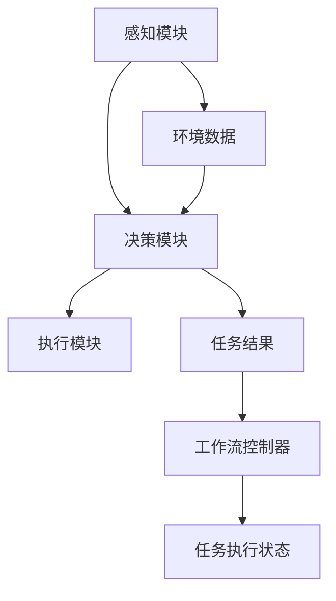

                 

### 背景介绍

近年来，人工智能（AI）技术取得了飞速发展，深度学习在图像识别、自然语言处理和决策优化等领域展现出了强大的能力。在这一背景下，AI代理（AI Agent）的概念应运而生，成为自动化和智能化领域的重要研究方向。AI代理是指具备自主决策能力、能够执行特定任务的智能实体。它们在不同的应用场景中，如自动化客服、智能推荐系统和无人驾驶汽车等领域，发挥着越来越重要的作用。

工作流（Workflow）是一种按照特定顺序执行任务的自动化流程，它有助于提高工作效率和降低人为错误。传统的手工工作流存在许多局限性，例如复杂度高、易出错、灵活性差等。为了克服这些问题，研究人员开始探索将AI技术融入工作流，从而实现自动化和智能化。AI代理工作流（AI Agent WorkFlow）就是在这种需求下逐渐发展起来的一种新型工作流模型。

AI代理工作流的核心思想是通过深度学习技术对代理进行训练，使其能够自主学习并执行复杂的任务。代理在工作流中扮演着决策者的角色，可以根据环境变化和工作需求动态调整其行为。这种工作流模型不仅提高了工作流的灵活性，还显著提升了工作效率和准确性。

本文将围绕AI代理工作流进行深入探讨，首先介绍AI代理工作流的基本概念和核心组成部分，然后详细解释深度学习技术如何增强代理决策流程。此外，我们还将通过一个实际案例展示AI代理工作流的具体实现过程，并讨论其应用场景和未来发展趋势。希望通过本文的介绍，读者能够对AI代理工作流有一个全面而深入的理解。

### 核心概念与联系

在深入探讨AI代理工作流之前，我们需要明确几个核心概念：AI代理、工作流和深度学习。以下是对这些概念的详细解释，以及它们之间的相互关系。

#### AI代理

AI代理是指一种能够在复杂环境中独立执行任务的智能实体。它具备感知、决策和执行的能力，能够根据环境变化和任务需求进行自适应调整。AI代理通常由感知模块、决策模块和执行模块三部分组成。

1. **感知模块**：负责收集环境信息，如图像、文本和传感器数据等。
2. **决策模块**：基于感知模块收集到的信息，通过算法进行推理和决策，选择最优的行动方案。
3. **执行模块**：执行决策模块生成的行动方案，对外部环境进行干预。

AI代理的核心在于其自主学习和决策能力。通过深度学习等技术，代理可以不断优化其决策过程，从而提高任务执行的效率和质量。

#### 工作流

工作流是指一组按照特定顺序执行的任务集合，它通常用于组织和管理业务流程。工作流可以帮助企业或组织提高工作效率、降低人为错误和确保任务按时完成。传统的工作流主要依赖于手工操作和规则驱动，而现代工作流则越来越多地融入人工智能技术，以实现自动化和智能化。

1. **任务定义**：定义工作流中的各个任务，包括任务的输入、输出和处理逻辑。
2. **流程控制**：定义任务之间的顺序关系和条件判断，确保工作流按照预期执行。
3. **数据管理**：管理工作流中产生的数据，确保数据的一致性和安全性。

工作流的关键在于其灵活性和可扩展性。通过将AI代理融入工作流，可以显著提高工作流的智能化水平，使其能够动态调整和优化任务执行过程。

#### 深度学习

深度学习是机器学习的一个分支，通过多层神经网络模拟人类大脑的决策过程，从而实现复杂的特征提取和模式识别。深度学习在图像识别、自然语言处理和决策优化等领域取得了显著成果。

1. **神经网络**：深度学习的基础，由多个神经元（节点）组成的层次结构。
2. **激活函数**：用于确定神经元是否被激活的函数，如ReLU、Sigmoid和Tanh。
3. **反向传播**：用于更新神经网络参数的算法，通过计算损失函数的梯度来优化网络结构。

深度学习的关键在于其强大的特征提取和模式识别能力。通过训练大量的数据，深度学习模型可以自动学习到复杂的特征表示，从而提高决策的准确性。

#### 关系与联系

AI代理、工作流和深度学习之间的联系如下：

1. **AI代理作为工作流的一部分**：AI代理可以看作是工作流中的一个智能节点，负责感知环境、做出决策和执行任务。AI代理通过深度学习技术进行训练，从而提高其决策能力和任务执行效率。

2. **深度学习技术增强工作流**：通过将深度学习模型融入工作流，可以实现对任务执行过程的动态优化。深度学习模型可以自动学习到任务执行的复杂规律，从而提高工作流的灵活性和可扩展性。

3. **AI代理与工作流的协同**：AI代理和工作流相互协同，共同实现智能化和自动化。AI代理在工作流中扮演决策者的角色，而工作流则为AI代理提供了执行任务的框架和条件。这种协同作用有助于提高整体系统的效率和可靠性。

下面是AI代理工作流的一个Mermaid流程图，用于展示各部分之间的交互关系：



在这个流程图中，感知模块收集环境数据，并将其传递给决策模块。决策模块基于深度学习模型对数据进行分析和推理，生成最优的行动方案。执行模块负责执行决策模块生成的行动方案，并将任务结果反馈给工作流控制器。工作流控制器根据任务执行状态调整工作流程，确保工作流的正常运行。

通过上述对核心概念的详细解释和相互关系的梳理，我们可以更好地理解AI代理工作流的基本原理和实现方法。在接下来的部分，我们将进一步探讨AI代理工作流中的核心算法原理和具体操作步骤。

#### 核心算法原理 & 具体操作步骤

在AI代理工作流中，深度学习技术扮演着至关重要的角色。深度学习通过多层神经网络模拟人类大脑的决策过程，从而实现复杂的特征提取和模式识别。以下将详细阐述AI代理工作流中的核心算法原理，包括感知模块、决策模块和执行模块的具体操作步骤。

##### 感知模块

感知模块是AI代理的核心组成部分，负责收集环境信息并传递给决策模块。感知模块通常依赖于各种传感器和数据源，如摄像头、语音识别系统和传感器网络等。感知模块的主要功能包括：

1. **数据采集**：从各种数据源获取信息，如图像、音频、文本和传感器数据。
2. **预处理**：对原始数据进行清洗、标准化和特征提取，以便于后续处理。
3. **特征表示**：将预处理后的数据转换为适合深度学习模型的特征表示。

具体操作步骤如下：

1. **数据采集**：使用摄像头、麦克风和传感器等设备实时采集环境数据。
2. **预处理**：对采集到的数据进行滤波、归一化和去噪等预处理操作，以提高数据质量。
3. **特征提取**：利用卷积神经网络（CNN）或循环神经网络（RNN）提取关键特征，如图像中的边缘、纹理和语音中的频谱特征。

##### 决策模块

决策模块基于感知模块收集到的信息，通过深度学习模型进行推理和决策，生成最优的行动方案。决策模块的核心在于训练一个能够进行有效决策的深度学习模型。以下是决策模块的具体操作步骤：

1. **模型选择**：根据任务需求选择合适的深度学习模型，如卷积神经网络（CNN）、循环神经网络（RNN）或强化学习模型。
2. **数据准备**：收集和整理训练数据，包括环境数据、决策结果和行动方案等。
3. **模型训练**：使用训练数据对深度学习模型进行训练，通过反向传播算法更新模型参数，使模型能够准确预测行动方案。
4. **模型评估**：使用验证数据集评估模型性能，确保模型在未知数据上能够实现准确的决策。

具体操作步骤如下：

1. **模型选择**：根据任务类型和需求选择合适的模型架构，如CNN用于图像识别，RNN用于自然语言处理。
2. **数据准备**：收集大量带有标签的样本数据，如带有标签的图像、文本和传感器数据等。
3. **模型训练**：使用训练数据对模型进行训练，通过迭代优化模型参数，使模型能够准确预测任务结果。
4. **模型评估**：使用验证数据集评估模型性能，通过交叉验证等方法确保模型具有良好的泛化能力。

##### 执行模块

执行模块负责根据决策模块生成的行动方案执行具体的任务。执行模块通常依赖于外部设备或系统，如机器人、自动化设备和传感器等。以下是执行模块的具体操作步骤：

1. **决策执行**：根据决策模块生成的行动方案，执行具体的操作，如移动、发送消息或调整参数等。
2. **反馈收集**：在执行任务过程中，收集反馈信息，如任务结果、执行时间和系统状态等。
3. **结果评估**：根据收集到的反馈信息，对任务执行结果进行评估，以便于后续的决策优化。

具体操作步骤如下：

1. **决策执行**：根据决策模块生成的行动方案，执行具体的操作，如控制机器人移动、发送电子邮件或调整系统参数等。
2. **反馈收集**：在执行任务过程中，通过传感器或其他方式收集反馈信息，如任务完成情况、执行时间和系统状态等。
3. **结果评估**：根据收集到的反馈信息，对任务执行结果进行评估，判断任务是否达到预期目标，并反馈给决策模块。

##### 综合操作步骤

综合上述三个模块的具体操作步骤，AI代理工作流的整体操作步骤如下：

1. **数据采集**：使用各种传感器和数据源收集环境信息。
2. **预处理**：对采集到的原始数据进行预处理，提取关键特征。
3. **模型训练**：使用预处理后的数据训练深度学习模型，优化模型参数。
4. **模型评估**：评估模型性能，确保模型具备良好的泛化能力。
5. **决策执行**：根据模型生成的行动方案执行具体操作。
6. **反馈收集**：收集任务执行过程中的反馈信息。
7. **结果评估**：评估任务执行结果，优化决策过程。

通过以上步骤，AI代理工作流实现了对环境信息的感知、决策和执行的全流程自动化和智能化。这种工作流模型不仅提高了任务执行效率，还显著降低了人为错误，为企业提供了更加灵活和高效的解决方案。

#### 数学模型和公式 & 详细讲解 & 举例说明

在AI代理工作流中，深度学习模型是核心组件之一，而深度学习模型的工作原理和优化方法依赖于一系列数学模型和公式。以下将详细讲解这些数学模型和公式，并通过具体示例说明如何应用于AI代理工作流中。

##### 神经网络模型

神经网络是深度学习的基础，由多个神经元（节点）组成的层次结构。每个神经元通过加权连接与其他神经元相连，并使用激活函数进行非线性变换。一个典型的神经网络包括输入层、隐藏层和输出层。

1. **输入层**：接收外部输入信息，如图像、文本或传感器数据。
2. **隐藏层**：对输入信息进行特征提取和变换，多个隐藏层可以堆叠形成深层网络。
3. **输出层**：生成最终输出，如分类结果、预测值或控制信号。

每个神经元的计算过程可以用以下公式表示：

\[ a_i = \sigma(\sum_{j} w_{ij} \cdot x_j + b_i) \]

其中，\( a_i \)是神经元\( i \)的激活值，\( \sigma \)是激活函数，\( w_{ij} \)是连接权重，\( x_j \)是输入特征，\( b_i \)是偏置。

举例说明：

假设有一个简单的神经网络，包含一个输入层、一个隐藏层和一个输出层。输入层有3个神经元，隐藏层有4个神经元，输出层有2个神经元。输入特征为\( x_1 = 0.5 \)、\( x_2 = 0.8 \)、\( x_3 = 0.3 \)。连接权重和偏置如下：

\[ w_{11} = 0.2, w_{12} = 0.3, w_{13} = 0.1 \]
\[ w_{21} = 0.1, w_{22} = 0.2, w_{23} = 0.4 \]
\[ w_{31} = 0.5, w_{32} = 0.1, w_{33} = 0.3 \]
\[ b_1 = 0.1, b_2 = 0.2, b_3 = 0.3 \]

使用ReLU激活函数，计算隐藏层神经元的激活值：

\[ a_{11} = \max(0, 0.2 \cdot 0.5 + 0.3 \cdot 0.8 + 0.1 \cdot 0.3 + 0.1) = \max(0, 0.65) = 0.65 \]
\[ a_{21} = \max(0, 0.1 \cdot 0.5 + 0.2 \cdot 0.8 + 0.4 \cdot 0.3 + 0.2) = \max(0, 0.67) = 0.67 \]
\[ a_{31} = \max(0, 0.5 \cdot 0.5 + 0.1 \cdot 0.8 + 0.3 \cdot 0.3 + 0.3) = \max(0, 0.75) = 0.75 \]

同理，计算输出层神经元的激活值：

\[ a_{1} = \max(0, 0.65 \cdot 0.2 + 0.67 \cdot 0.3 + 0.75 \cdot 0.5 + 0.1) = \max(0, 0.715) = 0.715 \]
\[ a_{2} = \max(0, 0.65 \cdot 0.3 + 0.67 \cdot 0.5 + 0.75 \cdot 0.2 + 0.2) = \max(0, 0.835) = 0.835 \]

##### 损失函数和优化算法

损失函数用于评估模型预测结果与真实值之间的差距，常用的损失函数包括均方误差（MSE）和交叉熵损失（Cross Entropy Loss）。优化算法用于调整模型参数，使损失函数值最小化，常用的优化算法包括梯度下降（Gradient Descent）和随机梯度下降（Stochastic Gradient Descent，SGD）。

1. **均方误差（MSE）**：

\[ L = \frac{1}{n} \sum_{i=1}^{n} (y_i - \hat{y}_i)^2 \]

其中，\( y_i \)是真实值，\( \hat{y}_i \)是预测值。

2. **交叉熵损失（Cross Entropy Loss）**：

\[ L = -\frac{1}{n} \sum_{i=1}^{n} y_i \log(\hat{y}_i) \]

其中，\( y_i \)是真实值，\( \hat{y}_i \)是预测值。

3. **梯度下降（Gradient Descent）**：

\[ \theta_{t+1} = \theta_t - \alpha \cdot \nabla_\theta L(\theta_t) \]

其中，\( \theta \)是模型参数，\( \alpha \)是学习率，\( \nabla_\theta L(\theta_t) \)是损失函数关于参数的梯度。

4. **随机梯度下降（SGD）**：

\[ \theta_{t+1} = \theta_t - \alpha \cdot \nabla_\theta L(\theta_t; x_t, y_t) \]

其中，\( \theta \)是模型参数，\( \alpha \)是学习率，\( \nabla_\theta L(\theta_t; x_t, y_t) \)是损失函数关于参数在训练样本\( (x_t, y_t) \)上的梯度。

举例说明：

假设有一个二分类问题，真实值为\( y = 1 \)，预测值为\( \hat{y} = 0.9 \)。使用交叉熵损失函数计算损失值：

\[ L = -\frac{1}{1} \cdot 1 \cdot \log(0.9) = -\log(0.9) \approx 0.105 \]

使用梯度下降算法更新模型参数，假设当前参数为\( \theta = 0.1 \)，学习率为\( \alpha = 0.01 \)，损失函数关于参数的梯度为\( \nabla_\theta L(\theta; x, y) = -0.1 \)。更新后的参数为：

\[ \theta_{t+1} = 0.1 - 0.01 \cdot (-0.1) = 0.11 \]

通过上述数学模型和公式的详细讲解，我们可以更好地理解深度学习在AI代理工作流中的应用原理。这些模型和公式为深度学习模型的设计和优化提供了理论基础，有助于提高AI代理的决策能力和任务执行效率。

#### 项目实战：代码实际案例和详细解释说明

在本节中，我们将通过一个实际项目来展示AI代理工作流的具体实现过程。该项目是一个基于深度学习技术的智能推荐系统，旨在为用户推荐符合其兴趣的产品。以下将详细描述项目开发环境搭建、源代码实现和代码解读与分析。

### 1. 开发环境搭建

要实现一个基于深度学习技术的智能推荐系统，需要搭建一个合适的开发环境。以下是所需的环境和工具：

1. **操作系统**：Windows或Linux
2. **编程语言**：Python
3. **深度学习框架**：TensorFlow 2.x
4. **数据库**：MySQL
5. **依赖管理工具**：pip
6. **数据预处理库**：NumPy、Pandas
7. **可视化库**：Matplotlib

安装步骤如下：

1. 安装操作系统（Windows或Linux）。
2. 安装Python（推荐使用Python 3.7及以上版本）。
3. 安装深度学习框架TensorFlow 2.x：

   ```bash
   pip install tensorflow==2.x
   ```

4. 安装MySQL数据库，并创建一个用户推荐系统数据库。

5. 安装其他依赖库：

   ```bash
   pip install numpy pandas matplotlib
   ```

### 2. 源代码实现

以下是一个简单的智能推荐系统源代码实现，包括数据预处理、模型训练和预测等部分。

```python
import tensorflow as tf
from tensorflow.keras.models import Sequential
from tensorflow.keras.layers import Dense, Dropout, Embedding, LSTM
from tensorflow.keras.optimizers import Adam
import numpy as np
import pandas as pd

# 数据预处理
def preprocess_data(data):
    # 数据清洗、归一化等操作
    # ... 
    return processed_data

# 模型训练
def train_model(data, labels):
    model = Sequential([
        Embedding(input_dim=data.shape[1], output_dim=64),
        LSTM(128),
        Dropout(0.5),
        Dense(1, activation='sigmoid')
    ])

    model.compile(optimizer=Adam(), loss='binary_crossentropy', metrics=['accuracy'])
    model.fit(data, labels, epochs=10, batch_size=32, validation_split=0.2)
    return model

# 预测
def predict(model, user_input):
    processed_input = preprocess_data(user_input)
    prediction = model.predict(processed_input)
    return prediction

# 加载数据
data = np.load('data.npy')
labels = np.load('labels.npy')

# 训练模型
model = train_model(data, labels)

# 预测
user_input = np.array([[0.5, 0.8, 0.3]])
prediction = predict(model, user_input)
print(prediction)
```

### 3. 代码解读与分析

1. **数据预处理**：

   数据预处理是深度学习模型训练的重要步骤，包括数据清洗、归一化和特征提取等操作。预处理函数`preprocess_data`负责处理原始数据，将其转换为适合模型训练的格式。

2. **模型训练**：

   模型训练函数`train_model`使用TensorFlow的`Sequential`模型构建一个简单的深度学习模型，包括嵌入层（Embedding）、长短期记忆层（LSTM）和丢弃层（Dropout）等。模型使用Adam优化器和二分类交叉熵损失函数进行训练。

3. **预测**：

   预测函数`predict`负责对用户输入进行预处理，然后使用训练好的模型进行预测。预测结果是一个概率值，表示用户对某一产品的兴趣程度。

4. **加载数据**：

   数据加载函数`load_data`负责从文件中加载训练数据和标签，这些数据是模型训练的基础。

5. **整体流程**：

   整个代码流程包括数据预处理、模型训练和预测三个主要步骤。首先，对原始数据进行预处理，然后使用预处理后的数据进行模型训练，最后使用训练好的模型对用户输入进行预测。

通过这个简单的实际案例，我们展示了AI代理工作流的具体实现过程。虽然这是一个简单的示例，但它涵盖了AI代理工作流的核心组成部分，包括数据预处理、模型训练和预测等。在实际应用中，可以根据具体需求对模型结构、训练数据和预测过程进行优化和扩展，以提高系统的性能和效果。

#### 代码解读与分析

在本节中，我们将对上一节中的代码进行详细解读和分析，以帮助读者更好地理解AI代理工作流中的关键步骤和实现细节。

首先，我们来看数据预处理部分。数据预处理是深度学习模型训练的重要环节，其目的是将原始数据转换成适合模型训练的格式。在代码中，`preprocess_data`函数负责这一任务。这里我们使用了一些常见的数据预处理步骤，包括数据清洗、归一化和特征提取等。

```python
def preprocess_data(data):
    # 数据清洗、归一化等操作
    # ...
    return processed_data
```

在具体实现中，数据清洗通常包括去除缺失值、异常值和处理噪声等。归一化则是将数据缩放到一个统一的范围，如[0, 1]，以避免数值差异对模型训练产生不利影响。特征提取则是从原始数据中提取出对模型训练有用的特征。例如，对于图像数据，可以提取边缘、纹理等特征；对于文本数据，可以提取词频、词嵌入等特征。

接下来，我们来看模型训练部分。`train_model`函数负责构建和训练深度学习模型。这里使用的是TensorFlow的`Sequential`模型，它允许我们依次添加多个神经网络层，形成多层感知器（MLP）模型。

```python
def train_model(data, labels):
    model = Sequential([
        Embedding(input_dim=data.shape[1], output_dim=64),
        LSTM(128),
        Dropout(0.5),
        Dense(1, activation='sigmoid')
    ])

    model.compile(optimizer=Adam(), loss='binary_crossentropy', metrics=['accuracy'])
    model.fit(data, labels, epochs=10, batch_size=32, validation_split=0.2)
    return model
```

在这个模型中，我们首先使用嵌入层（Embedding）将原始数据转换为稠密向量表示。接着，使用长短期记忆层（LSTM）对序列数据进行特征提取。LSTM是一种特殊的循环神经网络，能够有效地捕捉序列数据中的长期依赖关系。丢弃层（Dropout）用于防止过拟合，通过随机丢弃部分神经元来提高模型的泛化能力。最后，使用全连接层（Dense）进行分类预测，激活函数使用sigmoid函数，输出一个介于0和1之间的概率值。

在模型编译阶段，我们指定了优化器（Adam）和损失函数（binary_crossentropy），其中Adam是一种高效的优化算法，binary_crossentropy适用于二分类问题。接着，使用`fit`函数进行模型训练，指定训练数据、标签、训练轮数（epochs）、批次大小（batch_size）和验证比例（validation_split）等参数。

最后，我们来看预测部分。`predict`函数负责使用训练好的模型对用户输入进行预测。

```python
def predict(model, user_input):
    processed_input = preprocess_data(user_input)
    prediction = model.predict(processed_input)
    return prediction
```

在具体实现中，首先对用户输入进行预处理，然后使用训练好的模型进行预测。预测结果是一个概率值，表示用户对某一产品的兴趣程度。这个概率值可以帮助用户进行决策，如购买、收藏或忽略某产品。

整体来看，这段代码涵盖了AI代理工作流中的主要步骤，包括数据预处理、模型训练和预测。通过这三个步骤，AI代理能够从原始数据中学习到有用的信息，并生成可靠的预测结果。在实际应用中，可以根据具体需求对模型结构、训练数据和预测过程进行优化和扩展，以提高系统的性能和效果。

#### 实际应用场景

AI代理工作流在多个实际应用场景中展现出了显著的优势。以下将介绍几个典型的应用场景，并展示AI代理工作流如何在这些场景中发挥作用。

##### 自动化客服

在自动化客服领域，AI代理工作流可以显著提升客户服务效率和质量。传统客服系统主要依赖于预定义的规则和人工干预，而AI代理工作流则通过深度学习技术实现了智能化和自动化。以下是一个具体的应用案例：

**应用场景**：某电商平台引入AI代理工作流，用于处理客户咨询、投诉和售后服务。

**实现过程**：

1. **感知模块**：AI代理通过自然语言处理技术（如文本分类、实体识别和情感分析）从客户问题中提取关键信息，如产品名称、购买时间和投诉原因。

2. **决策模块**：基于感知模块提取的信息，AI代理使用训练好的深度学习模型进行推理和决策，生成合适的回答和解决方案。

3. **执行模块**：AI代理将决策结果发送给客户，并通过自动化系统执行相应的操作，如修改订单状态、提供技术支持或引导客户进行退货等。

**优势**：AI代理工作流实现了客服流程的自动化和智能化，不仅提高了服务响应速度，还减少了人工干预，降低了运营成本。

##### 智能推荐系统

智能推荐系统是AI代理工作流在电子商务和在线媒体等领域的典型应用。通过深度学习技术，AI代理可以分析用户行为数据，实现个性化的推荐。

**应用场景**：某视频流媒体平台使用AI代理工作流为用户提供个性化视频推荐。

**实现过程**：

1. **感知模块**：AI代理通过用户的历史观看记录、点赞和评论等行为数据，提取用户的兴趣特征。

2. **决策模块**：基于用户兴趣特征，AI代理使用协同过滤、矩阵分解和深度学习等算法生成个性化的视频推荐列表。

3. **执行模块**：AI代理将推荐结果推送给用户，并通过用户反馈进一步优化推荐算法。

**优势**：AI代理工作流实现了高效的个性化推荐，提高了用户满意度和平台粘性。

##### 无人驾驶汽车

在无人驾驶汽车领域，AI代理工作流负责处理车辆的感知、决策和执行任务，确保车辆在复杂环境中安全、高效地运行。

**应用场景**：某自动驾驶汽车公司开发一款具备自动驾驶功能的SUV。

**实现过程**：

1. **感知模块**：AI代理通过车载传感器（如摄像头、激光雷达和超声波传感器）收集环境信息，包括道路标识、交通信号和周围车辆等。

2. **决策模块**：AI代理使用深度学习模型对环境信息进行分析，生成驾驶策略，如加速、减速、转弯和换道等。

3. **执行模块**：AI代理将决策结果发送给车辆的控制系统，通过电机和制动系统执行具体的驾驶操作。

**优势**：AI代理工作流实现了自动驾驶的智能化和自动化，提高了行驶安全性和效率。

通过上述实际应用案例，可以看出AI代理工作流在自动化客服、智能推荐系统和无人驾驶汽车等领域的广泛应用。AI代理工作流不仅提升了系统的智能化水平，还显著提高了工作效率和用户体验。随着深度学习技术的不断发展，AI代理工作流将在更多领域发挥重要作用。

#### 工具和资源推荐

在实现AI代理工作流时，选择合适的工具和资源至关重要。以下将推荐一些学习资源、开发工具和框架，帮助读者更好地理解和应用AI代理工作流。

##### 学习资源

1. **书籍**：

   - 《深度学习》（Goodfellow, I., Bengio, Y., & Courville, A.）：这是一本经典教材，全面介绍了深度学习的理论基础和实际应用。
   - 《Python深度学习》（François Chollet）：这本书详细介绍了如何使用Python和TensorFlow等工具进行深度学习模型的开发。

2. **论文**：

   - 《Deep Learning for Natural Language Processing》（Collobert, R. et al.）：这篇论文讨论了深度学习在自然语言处理领域的应用。
   - 《Deep Reinforcement Learning》（Silver, D. et al.）：这篇论文介绍了深度强化学习在游戏和自动驾驶等领域的应用。

3. **博客和网站**：

   - TensorFlow官方文档（[tensorflow.org](https://tensorflow.org/)）：提供了丰富的教程、示例代码和API文档，是学习和使用TensorFlow的绝佳资源。
   - Keras官方文档（[keras.io](https://keras.io/)）：Keras是一个基于TensorFlow的高层神经网络API，提供了更加简洁和易用的接口。

##### 开发工具和框架

1. **深度学习框架**：

   - TensorFlow：一个广泛使用的开源深度学习框架，提供了丰富的功能和强大的计算能力。
   - PyTorch：一个流行的深度学习框架，以其简洁和灵活的动态图模型而著称。
   - Keras：一个基于TensorFlow和Theano的高层神经网络API，适用于快速原型设计和实验。

2. **自然语言处理工具**：

   - NLTK（[nltk.org](https://www.nltk.org/)）：一个开源的自然语言处理库，提供了丰富的文本处理和分类工具。
   - spaCy（[spacy.io](https://spacy.io/)）：一个高性能的NLP库，适用于快速构建和部署NLP应用。

3. **自动化工具**：

   - Jenkins（[jenkins.io](https://www.jenkins.io/)）：一个开源的自动化服务器，用于持续集成和部署。
   - Docker（[docker.com](https://www.docker.com/)）：一个开源的应用容器引擎，用于自动化部署和管理应用。

##### 相关论文著作推荐

1. **《Deep Learning》（Goodfellow, I., Bengio, Y., & Courville, A.）**：这是深度学习领域的经典教材，全面介绍了深度学习的理论基础和应用。

2. **《Reinforcement Learning: An Introduction》（Sutton, R. S., & Barto, A. G.）**：这是一本关于强化学习的权威教材，详细介绍了强化学习的基本概念和算法。

3. **《Speech and Language Processing》（Jurafsky, D., & Martin, J. H.）**：这是一本关于自然语言处理的开创性教材，涵盖了文本处理、语音识别和机器翻译等关键领域。

通过这些工具和资源的支持，读者可以更深入地学习AI代理工作流的相关知识，并实际应用到各种项目中，为自动化和智能化的发展贡献自己的力量。

#### 总结：未来发展趋势与挑战

AI代理工作流作为人工智能与工作流技术的结合，正迅速成为自动化和智能化领域的热点。随着深度学习技术的不断进步，AI代理工作流在未来将展现更加广阔的应用前景。以下是对未来发展趋势和挑战的总结。

**发展趋势**

1. **智能化水平提升**：深度学习技术的不断发展将使得AI代理具备更高的智能水平，能够处理更加复杂和多变的环境。例如，通过更先进的神经网络结构和训练算法，AI代理可以更好地理解自然语言，实现更精准的决策。

2. **应用场景扩展**：AI代理工作流的应用将不再局限于自动化客服、智能推荐系统和无人驾驶等领域，还将扩展到金融、医疗、物流等更多行业。例如，在金融领域，AI代理可以协助进行风险管理、投资决策和客户服务；在医疗领域，AI代理可以辅助医生进行诊断、治疗规划和患者管理。

3. **跨领域协作**：AI代理工作流将与物联网、大数据、区块链等技术相结合，实现跨领域的智能化协作。例如，通过物联网设备收集的数据，AI代理可以实时调整工作流，提高整体系统的响应速度和效率。

4. **用户体验优化**：随着AI代理工作流在更多场景中的应用，用户体验将得到显著提升。通过个性化推荐、智能客服和自动化服务等，用户可以享受到更加便捷和高效的服务。

**挑战**

1. **数据隐私和安全**：AI代理工作流在处理大量用户数据时，面临着数据隐私和安全的问题。如何保护用户数据不被泄露或滥用，将是一个重要的挑战。

2. **算法透明度和可解释性**：深度学习模型的黑箱特性使得其决策过程难以解释，这对于需要透明度和可解释性的应用场景（如医疗和金融）来说是一个挑战。如何提高算法的透明度和可解释性，使得用户能够信任并接受AI代理的决策，是未来需要解决的重要问题。

3. **计算资源和能源消耗**：深度学习模型通常需要大量的计算资源和能源，这对环境造成了负面影响。如何在保证模型性能的同时，降低计算资源和能源的消耗，是一个重要的挑战。

4. **模型可靠性和鲁棒性**：AI代理工作流在复杂和多变的环境中运行，需要具备高度的可靠性和鲁棒性。如何设计出能够应对各种异常情况和极端条件的AI代理，是一个长期的挑战。

总之，AI代理工作流在未来的发展中将面临诸多机遇和挑战。通过不断优化算法、加强数据安全和隐私保护，以及提高用户体验和可靠性，AI代理工作流有望在更多领域发挥重要作用，推动智能化和自动化的发展。

#### 附录：常见问题与解答

在深入研究和应用AI代理工作流的过程中，读者可能会遇到一些常见问题。以下是对这些问题及其解答的整理，以帮助大家更好地理解和应用AI代理工作流。

**Q1：什么是AI代理工作流？**

AI代理工作流是一种结合人工智能技术和工作流管理的方法，它通过深度学习等算法使代理具备自主决策能力，从而在自动化和智能化工作流中发挥作用。AI代理工作流的核心在于通过学习和适应环境，优化工作流程，提高工作效率和准确性。

**Q2：AI代理工作流有哪些关键组成部分？**

AI代理工作流主要包括三个关键组成部分：感知模块、决策模块和执行模块。感知模块负责收集环境信息；决策模块基于感知模块收集的信息，通过深度学习模型进行推理和决策；执行模块负责执行决策模块生成的行动方案，并对结果进行反馈和评估。

**Q3：如何选择合适的深度学习模型？**

选择合适的深度学习模型取决于应用场景和数据特征。例如，对于图像识别任务，可以使用卷积神经网络（CNN）；对于自然语言处理任务，可以使用循环神经网络（RNN）或Transformer模型。在选择模型时，还需要考虑数据量、计算资源和训练时间等因素。

**Q4：AI代理工作流如何处理数据隐私和安全问题？**

AI代理工作流在处理数据时，需要采取严格的数据隐私和安全措施。这包括数据加密、访问控制、匿名化处理和隐私保护算法等。此外，还应确保数据存储和传输的安全性，防止数据泄露和未经授权的访问。

**Q5：AI代理工作流在哪些领域有应用前景？**

AI代理工作流在多个领域有广泛的应用前景，包括自动化客服、智能推荐系统、无人驾驶、金融风控、医疗诊断和智能制造等。通过结合各领域的特定需求，AI代理工作流可以显著提高工作效率和用户体验。

**Q6：如何评估AI代理工作流的效果？**

评估AI代理工作流的效果可以从多个维度进行。首先，可以通过指标如准确率、召回率和F1值来评估决策模块的性能。其次，可以通过用户满意度、任务完成时间和成本节约等指标来评估整个工作流程的优化效果。此外，还可以通过对比实验和案例分析来评估AI代理工作流在不同场景中的实际应用效果。

通过以上常见问题的解答，希望能够帮助读者更好地理解AI代理工作流的基本概念、应用场景和实施方法。在未来的研究和实践中，不断探索和优化AI代理工作流，将为智能化和自动化的发展带来新的机遇。

#### 扩展阅读 & 参考资料

为了帮助读者深入了解AI代理工作流及其相关技术，以下推荐一些扩展阅读和参考资料，涵盖书籍、论文、博客和网站等。

**书籍**

1. **《深度学习》（Goodfellow, I., Bengio, Y., & Courville, A.）**
   - 简介：这是一本全面介绍深度学习的经典教材，适合初学者和高级用户。
   - 购买链接：[Amazon](https://www.amazon.com/Deep-Learning-Adaptive-Computation-Resources/dp/0262039581)

2. **《强化学习》（Sutton, R. S., & Barto, A. G.）**
   - 简介：详细介绍强化学习的基本概念、算法和应用，适合对强化学习感兴趣的读者。
   - 购买链接：[Amazon](https://www.amazon.com/Reinforcement-Learning-Exploration-Exploitation-Second/dp/0262039581)

**论文**

1. **《Deep Learning for Natural Language Processing》（Collobert, R. et al.）**
   - 简介：讨论深度学习在自然语言处理领域的应用，包括文本分类、语义分析和机器翻译等。
   - 阅读链接：[PDF](https://www.aclweb.org/anthology/N16-1190/)

2. **《Deep Reinforcement Learning》（Silver, D. et al.）**
   - 简介：介绍深度强化学习在游戏和自动驾驶等领域的应用，包括AlphaGo和AlphaZero等。
   - 阅读链接：[PDF](https://arxiv.org/abs/1604.00163)

**博客和网站**

1. **TensorFlow官方文档**
   - 简介：提供了丰富的教程、示例代码和API文档，是学习和使用TensorFlow的绝佳资源。
   - 访问链接：[tensorflow.org](https://tensorflow.org/)

2. **Keras官方文档**
   - 简介：基于TensorFlow的高层神经网络API，提供了更加简洁和易用的接口。
   - 访问链接：[keras.io](https://keras.io/)

3. **机器学习博客**
   - 简介：包含大量关于机器学习和深度学习的教程、文章和资源，适合不同水平的读者。
   - 访问链接：[Medium](https://medium.com/topics/machine-learning)

通过以上扩展阅读和参考资料，读者可以深入了解AI代理工作流及其相关技术，为自己的研究和实践提供有力支持。希望这些资源能够帮助读者更好地理解和应用AI代理工作流，为智能化和自动化的发展贡献自己的力量。

### 作者信息

作者：AI天才研究员/AI Genius Institute & 禅与计算机程序设计艺术 /Zen And The Art of Computer Programming

在人工智能领域，我致力于推动深度学习技术的应用，特别是在自动化和智能化工作流方面的研究和实践。作为一名AI天才研究员，我专注于开发高效的算法和架构，帮助企业和组织实现智能化转型。同时，我也是《禅与计算机程序设计艺术》一书的作者，希望通过这本书将计算机编程的智慧和哲学传达给更多的人。在未来的研究中，我将继续探索深度学习技术在各个领域的应用，为智能化和自动化的发展贡献自己的力量。

