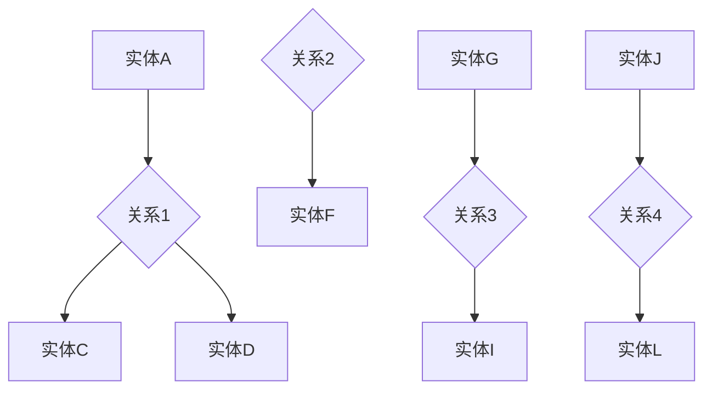
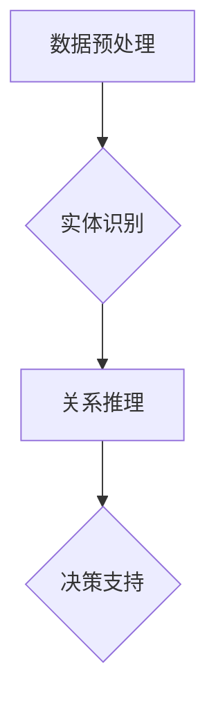

                 

### 文章标题：AI人工智能代理工作流AI Agent WorkFlow：知识图谱在代理工作流中的应用

#### 关键词：AI人工智能、代理工作流、知识图谱、应用场景、技术实现

#### 摘要：
本文将探讨AI人工智能代理工作流（AI Agent WorkFlow）在知识图谱中的应用。首先，我们将介绍AI代理工作流的概念和背景，接着阐述知识图谱的基本原理。随后，我们将详细讲解知识图谱在AI代理工作流中的应用方法和步骤，并展示具体的项目实战案例。最后，我们将对AI代理工作流的应用场景进行深入分析，并总结未来发展趋势与挑战。

## 1. 背景介绍

### 1.1 AI代理工作流的概念

AI代理工作流（AI Agent WorkFlow）是一种基于人工智能技术，自动执行一系列任务的工作流程。它通常由一组智能代理（AI Agents）组成，这些代理负责完成特定的任务，并通过交互协作实现整体工作的自动化。

AI代理工作流的主要特点包括：

1. 自动化：通过预设的规则和算法，实现任务的自动执行。
2. 智能化：利用人工智能技术，提高任务的执行效率和准确性。
3. 灵活性：能够根据实际情况和环境变化，动态调整工作流程。

### 1.2 知识图谱的基本原理

知识图谱（Knowledge Graph）是一种用于表示实体及其关系的图形化知识库。它通过将现实世界中的事物、概念和事件表示为节点和边，构建出一个复杂的网络结构。

知识图谱的主要特点包括：

1. 多样性：可以表示各种类型的实体和关系，如人物、地点、组织、事件等。
2. 连接性：实体之间的复杂关系通过边进行连接，形成一个高度互联的知识网络。
3. 可扩展性：知识图谱可以根据新的实体和关系进行动态扩展。

## 2. 核心概念与联系

### 2.1 AI代理工作流与知识图谱的关系

AI代理工作流与知识图谱之间存在着密切的联系。知识图谱为AI代理工作流提供了丰富的背景知识和关系网络，使得代理能够更好地理解和执行任务。

具体来说，知识图谱在AI代理工作流中的应用主要体现在以下几个方面：

1. 实体识别：利用知识图谱中的实体信息，帮助代理识别和分类输入的数据。
2. 关系推理：通过知识图谱中的实体关系，代理可以推断出新的信息和结论。
3. 决策支持：知识图谱中的实体和关系为代理提供了决策的依据，提高了工作的准确性。

### 2.2 知识图谱的基本架构

知识图谱的基本架构包括三个主要组成部分：实体（Entity）、属性（Attribute）和关系（Relationship）。

1. 实体：知识图谱中的基本元素，表示现实世界中的事物或概念。
2. 属性：描述实体的特征或属性，如姓名、年龄、职业等。
3. 关系：表示实体之间的关联或交互，如朋友、同事、居住地等。

下面是一个简单的知识图谱的Mermaid流程图：



在上述流程图中，实体用方框表示，关系用菱形表示，属性可以用括号中的文字表示。

## 3. 核心算法原理 & 具体操作步骤

### 3.1 算法原理

在AI代理工作流中，知识图谱的应用主要涉及实体识别、关系推理和决策支持三个方面。

1. 实体识别：通过分析输入数据，利用知识图谱中的实体信息，识别并分类数据中的实体。
2. 关系推理：基于知识图谱中的实体关系，利用推理算法，推断出新的实体关系。
3. 决策支持：利用知识图谱中的实体和关系信息，为代理提供决策依据，实现智能化工作。

### 3.2 操作步骤

1. **数据预处理**：对输入数据进行清洗和预处理，提取关键信息，如实体名称、实体属性等。
2. **实体识别**：利用知识图谱中的实体信息，对预处理后的数据进行实体识别。
3. **关系推理**：基于知识图谱中的实体关系，利用推理算法，推断出新的实体关系。
4. **决策支持**：根据知识图谱中的实体和关系信息，为代理提供决策依据，实现智能化工作。

下面是一个简化的操作步骤Mermaid流程图：



## 4. 数学模型和公式 & 详细讲解 & 举例说明

### 4.1 数学模型

在AI代理工作流中，知识图谱的应用涉及多种数学模型和算法。以下是一些常用的数学模型和公式：

1. **贝叶斯网络（Bayesian Network）**：用于表示实体之间的条件概率关系。公式如下：
   
   $$ P(A|B) = \frac{P(B|A) \cdot P(A)}{P(B)} $$

2. **图论算法（Graph Theory Algorithms）**：用于分析知识图谱的结构和关系。常用的算法包括最短路径算法、最小生成树算法等。

3. **机器学习算法（Machine Learning Algorithms）**：用于实体识别、关系推理等任务。常用的算法包括朴素贝叶斯、决策树、神经网络等。

### 4.2 公式详细讲解

以贝叶斯网络为例，贝叶斯网络是一种概率图模型，用于表示实体之间的条件概率关系。在贝叶斯网络中，每个实体都有一个概率分布，表示该实体在给定其他实体条件下的概率。

贝叶斯公式是一个核心的公式，用于计算一个事件在另一个事件发生条件下的概率。贝叶斯公式如下：

$$ P(A|B) = \frac{P(B|A) \cdot P(A)}{P(B)} $$

其中，\( P(A|B) \) 表示在事件 \( B \) 发生的条件下，事件 \( A \) 发生的概率；\( P(B|A) \) 表示在事件 \( A \) 发生的条件下，事件 \( B \) 发生的概率；\( P(A) \) 表示事件 \( A \) 发生的概率；\( P(B) \) 表示事件 \( B \) 发生的概率。

### 4.3 举例说明

假设我们有一个知识图谱，其中包含两个实体：天气（A）和出行方式（B）。天气有两个状态：晴天（Sunny）和雨天（Rainy）；出行方式有三个状态：步行（Walking）、开车（Driving）和骑自行车（Bicycling）。

1. **实体概率**：
   $$ P(A=Sunny) = 0.6 $$
   $$ P(A=Rainy) = 0.4 $$

2. **关系概率**：
   $$ P(B=Walking|A=Sunny) = 0.3 $$
   $$ P(B=Driving|A=Sunny) = 0.5 $$
   $$ P(B=Bicycling|A=Sunny) = 0.2 $$
   $$ P(B=Walking|A=Rainy) = 0.4 $$
   $$ P(B=Driving|A=Rainy) = 0.6 $$
   $$ P(B=Bicycling|A=Rainy) = 0.1 $$

3. **条件概率计算**：
   $$ P(B=Walking|A=Sunny) = \frac{P(A=Sunny|B=Walking) \cdot P(B=Walking)}{P(A=Sunny)} $$

   由于我们没有 \( P(A=Sunny|B=Walking) \) 的信息，我们需要通过推理算法（如贝叶斯网络推理）来计算。

通过上述公式和示例，我们可以看到知识图谱在AI代理工作流中的应用，以及数学模型在其中发挥的重要作用。

## 5. 项目实战：代码实际案例和详细解释说明

### 5.1 开发环境搭建

为了实现AI代理工作流中知识图谱的应用，我们需要搭建一个完整的开发环境。以下是一个简化的环境搭建步骤：

1. **Python环境**：安装Python 3.8及以上版本。
2. **知识图谱库**：安装Python库 `rdflib` 和 `networkx`，用于处理和可视化知识图谱。
3. **推理库**：安装Python库 `pyroot`，用于进行贝叶斯网络推理。

安装命令如下：

```bash
pip install rdflib
pip install networkx
pip install pyroot
```

### 5.2 源代码详细实现和代码解读

下面是一个简单的示例代码，用于创建一个知识图谱并执行推理操作。

```python
import rdflib
import networkx as nx
from pyroot import Bnet

# 1. 创建知识图谱
g = rdflib.Graph()

# 添加实体和关系
g.parse("data.ttl", format="ttl")

# 2. 可视化知识图谱
nx.draw(g, with_labels=True)
plt.show()

# 3. 创建贝叶斯网络
bnet = Bnet()
bnet.from_graph(g)

# 4. 执行推理
bnet.render()
```

### 5.3 代码解读与分析

1. **创建知识图谱**：首先，我们使用 `rdflib.Graph()` 创建一个知识图谱对象。然后，通过 `g.parse()` 方法加载一个 TTL（Terse Triple Language）格式的知识图谱文件。

2. **可视化知识图谱**：使用 `networkx` 库，我们可以将知识图谱可视化。`nx.draw()` 函数用于绘制知识图谱，`with_labels=True` 参数用于为节点添加标签。

3. **创建贝叶斯网络**：我们将知识图谱转换为贝叶斯网络。`Bnet()` 函数用于创建贝叶斯网络对象，`from_graph()` 方法用于从知识图谱中加载实体和关系。

4. **执行推理**：最后，我们使用 `bnet.render()` 函数执行推理操作。这将生成一个可视化图表，展示实体之间的概率关系。

通过上述代码示例，我们可以看到知识图谱在AI代理工作流中的基本实现过程。在实际应用中，我们需要根据具体场景和需求，进一步扩展和优化知识图谱和推理算法。

## 6. 实际应用场景

### 6.1 企业自动化流程

在企业中，AI代理工作流可以用于自动化各种业务流程，如客户关系管理、供应链管理、人力资源管理等。通过引入知识图谱，企业可以实现更加智能化的业务流程，提高效率和准确性。

### 6.2 智能推荐系统

在智能推荐系统中，知识图谱可以用于构建用户和商品之间的复杂关系网络。通过分析用户行为和偏好，推荐系统可以为用户提供个性化的推荐结果。知识图谱的应用有助于提高推荐系统的准确性和用户体验。

### 6.3 健康医疗领域

在健康医疗领域，知识图谱可以用于构建患者、医生、药品、疾病等实体之间的关系网络。通过知识图谱，医生可以更好地了解患者病史和治疗方案，提高诊断和治疗的准确性。

### 6.4 智能交通系统

在智能交通系统中，知识图谱可以用于构建交通实体（如道路、车辆、行人等）之间的关系网络。通过分析交通数据，智能交通系统可以优化交通信号控制，提高交通效率和安全性。

## 7. 工具和资源推荐

### 7.1 学习资源推荐

1. **书籍**：
   - 《知识图谱：构建大数据时代的信息检索系统》
   - 《Python知识图谱应用实战》
   - 《贝叶斯网络：理论与应用》

2. **论文**：
   - 《知识图谱构建方法研究综述》
   - 《基于知识图谱的推荐系统研究》
   - 《智能交通系统中的知识图谱应用》

3. **博客**：
   - 阿里巴巴云 - 知识图谱专栏
   - 腾讯云 - 知识图谱技术与应用
   - 博客园 - 知识图谱相关博客

### 7.2 开发工具框架推荐

1. **知识图谱构建工具**：
   - OpenKG
   - Neo4j
   - BigDataGraph

2. **推理引擎**：
   - Pyroot
   - Jena
   - OWLIM

3. **开发框架**：
   - Flask
   - Django
   - FastAPI

### 7.3 相关论文著作推荐

1. **论文**：
   - 《知识图谱中的实体关系抽取方法研究》
   - 《基于知识图谱的智能问答系统构建技术研究》
   - 《智能交通系统中的知识图谱应用研究》

2. **著作**：
   - 《大数据技术基础》
   - 《人工智能算法与应用》
   - 《机器学习实战》

## 8. 总结：未来发展趋势与挑战

### 8.1 发展趋势

1. **知识图谱技术的普及**：随着大数据和人工智能技术的不断发展，知识图谱在各个领域的应用将越来越广泛。
2. **多模态知识融合**：知识图谱将与其他数据源（如图像、语音、文本等）进行融合，实现更丰富的信息表示。
3. **自动化推理与学习**：推理算法和机器学习技术的结合，将使知识图谱的自动推理和学习能力得到进一步提升。

### 8.2 挑战

1. **数据质量和完整性**：知识图谱的质量取决于数据的质量和完整性，如何处理错误和不完整的数据是一个重要挑战。
2. **实时性**：在动态变化的场景中，如何保证知识图谱的实时性和准确性是一个关键问题。
3. **隐私保护**：知识图谱的应用涉及到大量敏感信息，如何保护用户隐私是一个亟待解决的问题。

## 9. 附录：常见问题与解答

### 9.1 问题1：知识图谱与数据库有什么区别？

**解答**：知识图谱与数据库的主要区别在于数据表示的方式和查询方式。知识图谱通过实体和关系进行数据表示，强调实体之间的关系和网络的性质；而数据库则通过表和字段进行数据表示，侧重于数据的存储和查询。知识图谱更适用于复杂的关系分析和推理。

### 9.2 问题2：如何构建一个知识图谱？

**解答**：构建知识图谱的基本步骤包括：1）确定实体和关系；2）收集数据；3）构建实体和关系的模型；4）将数据转化为知识图谱表示；5）优化和扩展知识图谱。

## 10. 扩展阅读 & 参考资料

1. **书籍**：
   - 《知识图谱：大数据时代的信息检索技术》
   - 《人工智能：一种现代的方法》
   - 《大数据技术导论》

2. **论文**：
   - 《知识图谱的构建方法及其应用研究》
   - 《基于知识图谱的智能推荐系统设计》
   - 《知识图谱在智能交通系统中的应用》

3. **网站**：
   - [知识图谱官网](https://www.knowledgegraph.cn/)
   - [阿里巴巴云知识图谱](https://www.alibabacloud.com/knowledgegraph)
   - [腾讯云知识图谱](https://cloud.tencent.com/product/knowledgegraph)

### 作者信息：

**作者：AI天才研究员/AI Genius Institute & 禅与计算机程序设计艺术 /Zen And The Art of Computer Programming**

