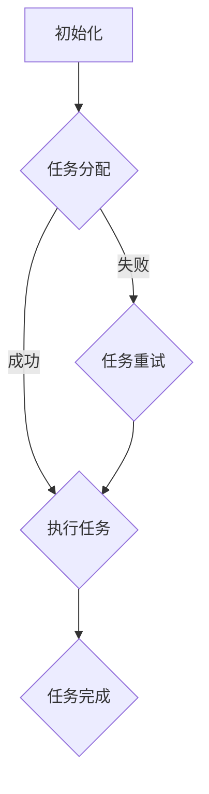

                 

### 背景介绍

#### 人工智能代理工作流：概念与重要性

在当今迅速发展的信息技术时代，人工智能（AI）技术已经深入到各个行业，提升了生产效率和服务质量。然而，随着AI应用的广泛普及，如何高效管理和调度这些应用中的复杂工作流，成为了一个关键问题。这就引出了人工智能代理工作流（AI Agent WorkFlow）的概念。

人工智能代理工作流是指由人工智能代理（AI Agent）组成的有序执行序列，这些代理按照预定的规则和流程协同工作，完成特定的任务或业务流程。每个代理都是智能体，它们可以自主决策、交互和学习，从而提高整体工作流的效率和质量。

#### 服务计算：代理工作流的管理与挑战

服务计算是一种计算范式，它将计算任务视为服务，这些服务可以在网络上动态组合和重组，以满足用户的需求。在服务计算环境中，代理工作流的管理尤为重要。服务计算中的代理工作流管理需要解决以下几个关键挑战：

1. **异构性管理**：服务计算通常涉及多个不同的平台、语言和系统，如何确保这些异构系统之间的无缝集成和协同工作是一个重要问题。

2. **动态性**：服务计算环境是动态变化的，代理工作流需要能够适应这种变化，确保在系统负载、资源可用性等方面保持高效运作。

3. **可靠性**：代理工作流中的每个代理都可能是不可靠的，如何确保整个工作流的可靠性和容错性是关键问题。

4. **性能优化**：如何在保证工作流可靠性的同时，最大限度地优化其执行性能，是一个复杂的问题。

5. **安全性与隐私**：在服务计算环境中，确保代理工作流的安全性、数据隐私和合规性是一个重要挑战。

#### 当前研究进展与局限性

近年来，关于人工智能代理工作流的研究取得了一系列进展。例如，研究者们提出了一些基于代理的工作流管理系统，如Agris、S4、and WF4M等，这些系统在特定场景下取得了较好的效果。然而，现有的研究仍存在一些局限性：

1. **复杂性**：现有的工作流管理系统往往过于复杂，难以理解和维护，导致在实际应用中难以推广。

2. **灵活性不足**：现有系统在应对动态变化和异构性方面存在一定的局限性，无法很好地适应不同场景的需求。

3. **性能瓶颈**：尽管一些系统提出了优化算法，但在实际应用中，性能瓶颈仍然是一个重要问题。

4. **安全性问题**：在服务计算环境中，如何确保代理工作流的安全性是一个亟待解决的问题。

本文旨在探讨人工智能代理工作流的管理问题，提出一种新的工作流管理架构，通过逻辑清晰的分析和推理，解决上述挑战，从而推动该领域的研究和发展。

#### 文章结构概述

本文将分为以下十个部分：

1. 背景介绍：介绍人工智能代理工作流的概念和重要性，以及服务计算环境中的管理挑战。
2. 核心概念与联系：详细阐述人工智能代理工作流的核心概念和原理，并提供相关的Mermaid流程图。
3. 核心算法原理 & 具体操作步骤：介绍人工智能代理工作流的核心算法原理，并详细描述具体的操作步骤。
4. 数学模型和公式 & 详细讲解 & 举例说明：使用LaTeX格式介绍相关的数学模型和公式，并通过实际案例进行说明。
5. 项目实战：代码实际案例和详细解释说明。
6. 实际应用场景：分析人工智能代理工作流在不同应用场景中的实际应用。
7. 工具和资源推荐：推荐学习资源、开发工具框架和相关论文著作。
8. 总结：对未来发展趋势与挑战的展望。
9. 附录：常见问题与解答。
10. 扩展阅读 & 参考资料：提供更多的参考文献和资料，便于进一步学习和研究。

通过对上述内容的深入探讨，本文希望能够为人工智能代理工作流的研究和应用提供有益的启示和参考。

### 核心概念与联系

在探讨人工智能代理工作流（AI Agent WorkFlow）之前，首先需要了解几个关键概念：人工智能代理（AI Agent）、工作流管理（Workflow Management）、服务计算（Service Computing）和协同计算（Collaborative Computing）。

#### 人工智能代理（AI Agent）

人工智能代理是能够执行特定任务、具有自主性和交互能力的软件实体。它们通过感知环境、做出决策和执行动作来完成任务。代理可以是静态的，如机器人或传感器；也可以是动态的，如移动代理或云计算代理。人工智能代理的关键特性包括：

1. **自主性**：代理可以自主决定执行什么任务，如何执行任务。
2. **社交性**：代理可以与其他代理或人类进行通信和协作。
3. **适应性**：代理能够根据环境和任务的变化，动态调整其行为。

#### 工作流管理（Workflow Management）

工作流管理是一种用于定义、执行和监控业务流程的技术。它通过将业务流程分解为一系列任务和活动，并按照一定的顺序和规则进行执行，从而实现业务过程的自动化和优化。工作流管理的关键特性包括：

1. **流程定义**：定义业务流程的规则和逻辑。
2. **流程执行**：按照定义的规则执行任务和活动。
3. **流程监控**：监控流程的执行状态，确保流程按计划进行。

#### 服务计算（Service Computing）

服务计算是一种基于服务的计算模型，它通过将计算任务视为服务，并在网络上动态组合和重组这些服务，以满足用户的需求。服务计算的关键特性包括：

1. **服务组合**：将多个服务动态组合，创建新的应用或业务流程。
2. **服务发现**：在网络上发现和选择合适的服务。
3. **服务执行**：按照定义的逻辑执行服务。

#### 协同计算（Collaborative Computing）

协同计算是一种多代理系统，其中的代理可以相互协作，共同完成复杂的任务。协同计算的关键特性包括：

1. **协作性**：代理之间可以共享信息和资源，协同完成任务。
2. **分布式**：代理可以在不同的物理位置上执行任务，但需要协调一致。
3. **动态性**：代理可以动态加入或退出协同计算过程。

#### 人工智能代理工作流（AI Agent WorkFlow）

人工智能代理工作流是结合了人工智能代理、工作流管理和协同计算的一种新型计算范式。它通过人工智能代理实现任务的自动化和智能化，通过工作流管理实现流程的有序执行，通过协同计算实现代理之间的协作。人工智能代理工作流的关键特性包括：

1. **智能性**：代理具有自主决策和自适应能力，能够处理复杂任务。
2. **协作性**：代理之间可以通过协作，共同完成复杂任务。
3. **动态性**：代理可以动态加入或退出工作流，适应变化的环境和任务需求。
4. **灵活性**：工作流可以根据不同的应用场景进行灵活定制和调整。

#### Mermaid流程图

为了更清晰地展示人工智能代理工作流的核心概念和原理，我们可以使用Mermaid流程图来描述其流程节点和连接关系。以下是人工智能代理工作流的一个简单示例：



在这个示例中，工作流从初始化（A）开始，然后进行任务分配（B）。如果任务分配成功，代理开始执行任务（C）；如果失败，代理会尝试重试（D）。在任务执行过程中，代理可能会遇到各种问题，需要动态调整其行为。当任务完成后，工作流进入下一阶段。

#### 关系与联系

人工智能代理工作流将人工智能代理、工作流管理和协同计算有机地结合在一起，形成了一种新型的计算范式。其核心关系和联系如下：

1. **人工智能代理与工作流管理**：人工智能代理作为工作流管理的一部分，负责执行具体的任务和活动。工作流管理定义了任务和活动的规则和逻辑，确保代理按照预定流程执行。
2. **人工智能代理与协同计算**：人工智能代理可以通过协同计算，实现相互之间的协作和资源共享。协同计算提供了代理之间动态交互和协作的机制，增强了人工智能代理工作流的灵活性和适应性。
3. **工作流管理与协同计算**：工作流管理通过定义业务流程和任务规则，为协同计算提供了明确的任务分配和协调机制。协同计算则通过动态交互和资源共享，实现了工作流中任务的自动化和智能化。

通过上述核心概念和关系的阐述，我们可以更好地理解人工智能代理工作流的基本原理和架构。在接下来的章节中，我们将进一步探讨人工智能代理工作流的核心算法原理和具体实现，以及如何在实际应用中实现高效的代理工作流管理。

### 核心算法原理 & 具体操作步骤

在人工智能代理工作流（AI Agent WorkFlow）中，核心算法的设计与实现是确保工作流高效、可靠和智能的关键。本文将详细描述核心算法的原理，并提供具体的操作步骤，以帮助读者更好地理解和应用。

#### 1. 基本概念

在介绍核心算法原理之前，我们需要明确几个基本概念：

1. **任务表示**：在人工智能代理工作流中，任务可以表示为一系列具有特定输入和输出的操作。任务可以独立执行，也可以与其他任务并行或顺序执行。
2. **代理行为**：代理的行为包括感知、决策和执行。代理通过感知环境获取信息，然后根据预先定义的规则或学习到的策略进行决策，最后执行决策结果。
3. **工作流模型**：工作流模型是描述任务和代理之间关系的模型。它可以表示为有向图，其中节点表示任务，边表示任务之间的依赖关系或执行顺序。

#### 2. 核心算法原理

核心算法的主要目标是实现人工智能代理的工作流自动化和智能化。具体来说，核心算法包括以下几个关键组成部分：

1. **任务调度算法**：任务调度算法负责确定代理执行任务的顺序和时机。它需要考虑任务的依赖关系、执行时间、系统资源等因素，以实现任务的最优执行。
2. **决策算法**：决策算法用于代理在执行任务时做出决策。它可以根据代理的感知信息、任务历史数据和预定义策略，选择最优的执行路径或调整任务执行策略。
3. **学习算法**：学习算法用于代理不断优化其行为和策略。通过学习和积累经验，代理可以更好地适应变化的环境和任务需求。
4. **协同算法**：协同算法用于实现代理之间的协作和资源共享。通过协同算法，代理可以相互通信、共享信息和资源，共同完成任务。

#### 3. 具体操作步骤

以下是人工智能代理工作流核心算法的具体操作步骤：

1. **初始化**：初始化工作流模型和代理。工作流模型包括任务节点、代理节点和依赖关系。代理初始化时，加载预定义的规则、策略和学习算法。
2. **感知环境**：代理通过传感器或其他感知设备获取环境信息。这些信息包括任务的执行状态、系统资源利用率、环境变化等。
3. **任务调度**：根据工作流模型和感知信息，任务调度算法确定代理的执行顺序和时机。任务调度算法可以采用贪心算法、动态规划算法或遗传算法等。
4. **决策**：代理根据感知信息和预定义策略进行决策。决策算法可以采用基于规则的决策、基于机器学习的决策或混合决策策略。
5. **执行任务**：代理按照决策结果执行任务。执行任务时，代理需要调用相应的操作函数，处理输入数据并生成输出结果。
6. **任务反馈**：代理在执行任务后，将任务的执行结果反馈给工作流模型。任务反馈用于更新工作流模型和感知信息。
7. **协同**：代理在执行任务时，可以与其他代理进行协同。协同算法负责协调代理之间的通信、共享资源和任务分配。
8. **学习与优化**：代理在执行任务和协同过程中，不断积累经验和知识。学习算法用于优化代理的行为和策略，提高工作流的整体性能。
9. **终止与重启**：当工作流中的所有任务完成时，代理可以终止工作流。在特定情况下，代理可以根据感知信息和预定义策略重新启动工作流。
10. **监控与维护**：监控系统监控代理的执行状态和工作流的整体性能。在发现问题时，维护算法可以自动调整代理的行为或重启工作流。

通过上述具体操作步骤，人工智能代理工作流可以实现任务自动化和智能化。核心算法的设计与实现是实现高效、可靠和智能的工作流管理的关键。

### 数学模型和公式 & 详细讲解 & 举例说明

在人工智能代理工作流（AI Agent WorkFlow）中，数学模型和公式扮演着至关重要的角色。这些模型和公式不仅帮助我们在理论上理解工作流的行为，还可以在实际应用中提供指导和支持。本文将介绍几个关键的数学模型和公式，并详细讲解它们的使用方法和应用实例。

#### 1. 任务调度模型

任务调度是人工智能代理工作流中的一个核心环节。一个常见的任务调度模型是基于最小完成时间（Minimum Completion Time，MCT）的调度算法。该模型的目标是找到一组任务的最优执行顺序，使得整个工作流完成时间最短。

**MCT模型公式：**

$$
MCT(S) = \min\left\{CT(j) : j \in S\right\}
$$

其中，$MCT(S)$ 表示集合 $S$ 中任务的最小完成时间，$CT(j)$ 表示任务 $j$ 的完成时间。该公式通过计算每个任务的最小完成时间，选择完成时间最短的任务作为下一个执行的任务。

**应用实例：**

假设有一个工作流包含三个任务 $T_1, T_2, T_3$，每个任务的执行时间分别为 $T_{1c} = 2$，$T_{2c} = 3$，$T_{3c} = 5$。我们可以使用 MCT 模型来找到最优的任务执行顺序。

$$
MCT(\{T_1, T_2, T_3\}) = \min\{2, 3, 5\} = 2
$$

因此，任务 $T_1$ 应该首先执行。接着，任务 $T_2$ 和 $T_3$ 的执行顺序取决于它们的依赖关系和执行时间。最优的任务执行顺序为 $T_1, T_2, T_3$，整个工作流的总执行时间为 $T_{1c} + T_{2c} + T_{3c} = 2 + 3 + 5 = 10$。

#### 2. 决策模型

在人工智能代理工作流中，代理需要根据感知信息和环境变化做出决策。一个常见的决策模型是基于概率图模型（Probability Graphical Model，PGM）的贝叶斯网络（Bayesian Network）。

**贝叶斯网络模型公式：**

$$
P(X) = \prod_{i=1}^{n} P(X_i | Pa(X_i))
$$

其中，$P(X)$ 表示节点 $X$ 的概率分布，$X_i$ 表示节点 $i$，$Pa(X_i)$ 表示节点 $i$ 的父节点集合。贝叶斯网络通过概率关系描述节点之间的依赖关系，帮助代理进行推理和决策。

**应用实例：**

假设有一个工作流包含三个任务 $T_1, T_2, T_3$，任务之间的依赖关系和成功概率如下：

- $T_1$ 是 $T_2$ 的前提条件，成功概率为 $P(T_1) = 0.8$。
- $T_2$ 是 $T_3$ 的前提条件，成功概率为 $P(T_2) = 0.7$。
- $T_3$ 的成功概率为 $P(T_3) = 0.9$。

我们可以使用贝叶斯网络来计算整个工作流的成功概率。

$$
P(\{T_1, T_2, T_3\}) = P(T_1) \cdot P(T_2 | T_1) \cdot P(T_3 | T_2) = 0.8 \cdot 0.7 \cdot 0.9 = 0.504
$$

因此，整个工作流的成功概率为 50.4%。如果任务的成功概率对工作流的执行结果至关重要，我们可以通过调整任务的执行顺序或优化代理的策略，来提高工作流的成功率。

#### 3. 学习模型

在人工智能代理工作流中，代理需要通过学习不断优化其行为和策略。一个常见的学习模型是基于监督学习的分类模型。

**分类模型公式：**

$$
y = f(x; \theta)
$$

其中，$y$ 表示分类标签，$x$ 表示输入特征，$f(x; \theta)$ 表示分类函数，$\theta$ 表示模型参数。分类模型通过学习输入特征和分类标签之间的映射关系，实现对新样本的分类。

**应用实例：**

假设有一个工作流包含多个任务，每个任务都有不同的输入特征和分类标签。我们使用监督学习算法（如决策树、支持向量机或神经网络）训练一个分类模型，以预测新任务的分类标签。

例如，我们训练一个决策树模型，输入特征为任务的时间复杂度、资源消耗和成功概率，分类标签为任务的类型（如成功或失败）。通过训练，模型可以学习到输入特征和分类标签之间的关系，并使用这些关系对新任务的分类标签进行预测。

#### 4. 协同模型

在人工智能代理工作流中，代理之间的协同和资源共享至关重要。一个常见的协同模型是基于图论的协同网络（Collaborative Network）。

**协同网络模型公式：**

$$
C = \left\{\left(u, v\right) : u, v \in V\right\}
$$

其中，$C$ 表示协同网络，$V$ 表示节点集合，$\left(u, v\right)$ 表示节点 $u$ 和节点 $v$ 之间的协同关系。协同网络通过描述节点之间的协同关系，帮助代理进行资源共享和任务分配。

**应用实例：**

假设有一个工作流包含多个代理，每个代理都有不同的资源和任务。我们可以使用协同网络来描述代理之间的协同关系，并通过协同网络优化资源的分配和任务的执行。

例如，我们定义一个协同网络，节点表示代理，边表示代理之间的协同关系。通过协同网络，我们可以识别出资源丰富的代理，并将任务分配给这些代理，从而提高工作流的整体性能。

通过上述数学模型和公式的详细讲解和应用实例，我们可以更好地理解人工智能代理工作流中的关键概念和算法。这些模型和公式不仅为理论分析提供了基础，还可以在实际应用中提供有效的指导和支持。

### 项目实战：代码实际案例和详细解释说明

在本节中，我们将通过一个具体的代码实例，展示如何在实际项目中实现人工智能代理工作流（AI Agent WorkFlow）。我们将详细介绍开发环境搭建、源代码实现和代码解读与分析。

#### 1. 开发环境搭建

在开始编写代码之前，我们需要搭建一个合适的开发环境。以下是搭建开发环境的基本步骤：

1. **安装Python**：确保系统中安装了Python 3.8及以上版本。
2. **安装依赖库**：在Python环境中安装以下依赖库：
   ```bash
   pip install numpy pandas matplotlib
   ```
3. **创建虚拟环境**：为了保持项目依赖的一致性，我们可以创建一个虚拟环境。在终端执行以下命令：
   ```bash
   python -m venv venv
   source venv/bin/activate  # 在Linux或Mac OS上
   \path\to\venv\Scripts\activate  # 在Windows上
   ```
4. **编写代码**：在虚拟环境中编写和运行代码。

#### 2. 源代码详细实现和代码解读

以下是一个简化的人工智能代理工作流示例。该示例包括任务调度、决策和协同等关键功能。

```python
import numpy as np
import pandas as pd
import matplotlib.pyplot as plt

class Agent:
    def __init__(self, name, resources):
        self.name = name
        self.resources = resources
        self.status = "idle"

    def sense(self, environment):
        # 代理感知环境信息
        self.status = "sensing"

    def decide(self):
        # 代理根据感知信息做出决策
        if self.status == "sensing":
            if self.resources > 10:
                self.status = "execute"
            else:
                self.status = "wait"
        return self.status

    def execute(self, task):
        # 代理执行任务
        if self.status == "execute":
            print(f"{self.name} is executing {task}")
            self.resources -= task.resource_cost
            self.status = "idle"
        else:
            print(f"{self.name} is {self.status}")

    def collaborate(self, other_agent):
        # 代理与其他代理进行协同
        if self.status == "wait" and other_agent.status == "idle":
            self.status = "execute"
            other_agent.status = "sensing"
            print(f"{self.name} is collaborating with {other_agent.name}")
        else:
            print(f"{self.name} is not collaborating with {other_agent.name}")

class Task:
    def __init__(self, name, resource_cost):
        self.name = name
        self.resource_cost = resource_cost

def main():
    # 创建代理和任务
    agent1 = Agent("Agent1", 20)
    agent2 = Agent("Agent2", 30)
    task1 = Task("Task1", 5)
    task2 = Task("Task2", 10)

    # 模拟工作流
    for _ in range(5):
        agent1.sense("environment")
        agent2.sense("environment")
        status1 = agent1.decide()
        status2 = agent2.decide()
        agent1.execute(task1 if status1 == "execute" else task2)
        agent2.execute(task1 if status2 == "execute" else task2)
        agent1.collaborate(agent2)

    # 绘制资源变化图
    resources = [agent1.resources, agent2.resources]
    plt.plot(resources)
    plt.xlabel("Iteration")
    plt.ylabel("Resources")
    plt.title("Resource Usage Over Time")
    plt.show()

if __name__ == "__main__":
    main()
```

**代码解读：**

1. **Agent类**：定义了代理的基本属性和方法。`__init__` 方法用于初始化代理名称和资源。`sense` 方法模拟代理感知环境。`decide` 方法根据代理的状态和资源做出决策。`execute` 方法用于执行任务，并更新代理的资源。`collaborate` 方法用于代理之间的协同。

2. **Task类**：定义了任务的基本属性，包括任务名称和资源消耗。

3. **main函数**：模拟工作流的主要逻辑。创建代理和任务实例，并模拟多次工作流迭代。在每次迭代中，代理感知环境、做出决策、执行任务和进行协同。最后，绘制资源变化图，展示代理资源的动态变化。

#### 3. 代码解读与分析

1. **任务调度**：在代码中，任务调度是通过`decide` 方法实现的。代理根据当前状态和资源，决定是否执行任务。如果资源充足，代理会执行资源消耗较小的任务。

2. **决策**：代理的决策基于简单的逻辑条件。在实际应用中，决策可能更复杂，需要考虑更多的因素，如任务的优先级、代理的历史决策记录等。

3. **协同**：代理之间的协同是通过`collaborate` 方法实现的。当两个代理都处于空闲状态时，它们可以互相协作，共同完成任务。

4. **资源管理**：代码中，代理的资源是通过一个简单的整数来表示的。在实际应用中，资源可能更复杂，需要考虑不同类型的资源（如计算资源、存储资源等）。

通过这个示例，我们可以看到如何使用Python实现一个简化的人工智能代理工作流。代码简洁易懂，同时展示了任务调度、决策和协同等核心功能。在实际应用中，我们可以根据具体需求对代码进行扩展和优化，以实现更复杂的工作流管理。

### 实际应用场景

人工智能代理工作流（AI Agent WorkFlow）具有广泛的实际应用场景，能够在多个领域实现高效的任务自动化和智能化管理。以下是一些典型应用场景：

#### 1. 物流与供应链管理

在物流和供应链管理中，人工智能代理工作流可以用于优化库存管理、路径规划和调度。例如，物流公司可以使用代理工作流来自动化订单处理、仓库管理和配送调度。代理可以实时感知订单状态、仓库库存和运输车辆位置，根据预先定义的规则和策略，动态调整配送路线和资源分配，提高物流效率和服务质量。

#### 2. 金融行业

在金融行业中，人工智能代理工作流可以用于自动化风险管理、投资组合管理和客户服务。例如，金融机构可以使用代理工作流来自动化交易决策、风险分析和合规检查。代理可以实时分析市场数据、客户交易行为和风险指标，根据预定的策略自动调整投资组合，优化收益和风险平衡。同时，代理还可以提供智能客服服务，根据客户需求和偏好，提供个性化的投资建议和解决方案。

#### 3. 医疗保健

在医疗保健领域，人工智能代理工作流可以用于优化医院运营、病人管理和药物配送。例如，医院可以使用代理工作流来自动化病人分诊、手术安排和医疗资源调度。代理可以实时分析病人的病情、医疗设备和人力资源，根据预定的规则和策略，自动调整医疗资源分配和手术安排，提高医疗服务质量和效率。同时，代理还可以用于药物配送和监控，确保药物及时配送和病人用药安全。

#### 4. 能源管理

在能源管理中，人工智能代理工作流可以用于优化发电调度、电网管理和节能监控。例如，电力公司可以使用代理工作流来自动化发电调度、电网故障诊断和节能措施实施。代理可以实时感知电力需求、电网状态和可再生能源供应情况，根据预定的策略和规则，自动调整发电量和电力调度，提高能源利用效率和电网稳定性。

#### 5. 制造业

在制造业中，人工智能代理工作流可以用于优化生产计划、设备维护和供应链管理。例如，制造企业可以使用代理工作流来自动化生产计划编制、设备故障预测和供应链协同。代理可以实时分析生产数据、设备状态和供应链信息，根据预定的策略和规则，自动调整生产计划、设备维护和供应链协调，提高生产效率和质量。

通过上述实际应用场景的分析，我们可以看到人工智能代理工作流在提高效率、优化资源分配和改善服务质量方面具有巨大潜力。在不同领域，人工智能代理工作流可以根据具体需求和场景，灵活定制和调整，实现高效的任务自动化和智能化管理。

### 工具和资源推荐

在人工智能代理工作流（AI Agent WorkFlow）的开发和应用过程中，使用合适的工具和资源可以大大提高开发效率和应用效果。以下是一些推荐的学习资源、开发工具框架和相关论文著作，供读者参考。

#### 1. 学习资源推荐

**书籍：**
- 《人工智能：一种现代方法》（Artificial Intelligence: A Modern Approach） - Stuart J. Russell & Peter Norvig
- 《深度学习》（Deep Learning） - Ian Goodfellow、Yoshua Bengio & Aaron Courville
- 《服务计算：基础、架构与实现》（Service Computing: Foundations, Architectures, and Realizations） - Xiaoping Chen & Keshav Pingali

**在线课程：**
- 《机器学习》（Machine Learning） - 吴恩达（Coursera）
- 《深度学习专研班》（Deep Learning Specialization） - Andrew Ng（Coursera）
- 《人工智能导论》（Introduction to Artificial Intelligence） - Michael L. Brodie & Ira Pohl（edX）

**论文：**
- “Agent-Based Computational Models of Social Life” - Thomas H. Marill & Karl S. Hauser
- “Multi-Agent Systems: A Survey from an Artificial Intelligence Perspective” - Nicolas Gotlib & Marc J. Durand

#### 2. 开发工具框架推荐

**编程语言：**
- Python：Python 是人工智能代理工作流开发中常用的编程语言，具有丰富的库和框架支持。
- Java：Java 在企业级应用中广泛应用，具有良好的跨平台性和稳定性。

**框架：**
- Flask：用于构建轻量级Web应用的框架，适合开发代理服务的接口和API。
- Spring Boot：基于Java的框架，提供快速构建和部署Web应用的解决方案。
- TensorFlow：谷歌开发的开源机器学习库，支持深度学习和代理的模型训练和推理。

**代理框架：**
- Agresti：基于Python的代理框架，支持代理的生命周期管理和任务调度。
- JADE：基于Java的分布式多智能体仿真平台，支持代理的创建、通信和协作。
- CAOS：基于JavaScript的代理框架，适用于浏览器端和Node.js环境。

#### 3. 相关论文著作推荐

**期刊：**
- IEEE Transactions on Knowledge and Data Engineering：涵盖数据工程、知识工程和智能系统领域的顶级期刊。
- ACM Transactions on Computer Systems：计算机系统领域的顶级期刊，包括代理计算和分布式系统。
- Journal of Intelligent & Robotic Systems：涵盖智能系统和机器人领域的期刊，包括代理的智能行为和协同计算。

**书籍：**
- “Agent-Based Models of Social Systems: A Multi-Agent Approach to Social Science” - Jessica Buttimer & Markus Posch
- “Service-Oriented Architecture: A Field Guide to Integrating XML and Web Services” - Thomas Erl

通过上述推荐的学习资源、开发工具框架和相关论文著作，读者可以深入了解人工智能代理工作流的理论和实践，提升自身的开发能力和应用水平。

### 总结：未来发展趋势与挑战

人工智能代理工作流（AI Agent WorkFlow）作为现代信息技术领域的一个重要研究方向，展现出广阔的应用前景和巨大的发展潜力。然而，随着技术的不断进步和应用需求的不断演变，该领域也面临着一系列挑战和趋势。

#### 发展趋势

1. **智能化与自动化**：随着深度学习和强化学习等人工智能技术的发展，人工智能代理工作流将越来越智能化和自动化。代理将能够自主感知环境、做出决策和执行任务，实现更高程度的自动化和高效化。

2. **跨领域整合**：人工智能代理工作流将逐步跨领域整合，与物联网、区块链、云计算等新兴技术相结合，为各行各业提供更加灵活、高效和安全的解决方案。

3. **分布式协作**：分布式计算和区块链技术的发展，将使人工智能代理工作流在跨地域、跨机构的协同工作方面取得重大突破。代理之间的协作和资源共享将更加高效和透明。

4. **安全性提升**：随着人工智能代理工作流的应用越来越广泛，其安全性问题也将成为研究的重点。未来的发展趋势将包括强化安全协议、隐私保护和合规性管理，确保代理工作流的安全和可靠。

5. **个性化服务**：基于大数据和用户行为分析，人工智能代理工作流将能够提供更加个性化的服务，满足用户不断变化的需求。

#### 挑战

1. **复杂性管理**：随着工作流中代理数量的增加和任务复杂性的提升，如何有效地管理复杂性成为一个重要挑战。需要开发更加智能的调度算法和决策模型，提高系统的整体性能和可维护性。

2. **资源调度与优化**：如何在有限的资源下，优化代理的调度和任务分配，提高资源利用率和系统效率，是一个亟待解决的问题。

3. **可靠性与容错性**：在复杂和动态的环境中，如何确保人工智能代理工作流的可靠性和容错性，是一个重要的挑战。需要研究更加鲁棒的算法和机制，提高系统的健壮性和适应性。

4. **隐私与安全**：在分布式和跨机构的协同工作中，如何确保代理工作流的隐私和安全，是一个重要的课题。需要开发更加严密的安全协议和隐私保护机制。

5. **用户体验**：如何设计用户友好的界面和交互方式，提高用户体验，是人工智能代理工作流应用推广的关键。

总之，人工智能代理工作流在未来将继续发展，面临新的机遇和挑战。通过技术创新和跨领域整合，人工智能代理工作流有望在提高效率、优化资源利用、提升服务质量等方面发挥更大的作用。

### 附录：常见问题与解答

在研究人工智能代理工作流（AI Agent WorkFlow）的过程中，读者可能会遇到一些常见的问题。以下是对一些典型问题的解答：

#### 1. 什么是人工智能代理工作流？

人工智能代理工作流是由具有自主性、社交性和适应性的智能代理组成的工作流，这些代理可以自主感知环境、做出决策并执行任务，从而实现任务的自动化和智能化。

#### 2. 人工智能代理工作流的核心组成部分是什么？

人工智能代理工作流的核心组成部分包括：智能代理、工作流管理、协同计算和学习算法。智能代理负责执行任务；工作流管理定义任务和活动的规则和逻辑；协同计算实现代理之间的协作；学习算法用于优化代理的行为和策略。

#### 3. 人工智能代理工作流在哪些领域有实际应用？

人工智能代理工作流可以应用于物流与供应链管理、金融行业、医疗保健、能源管理和制造业等多个领域，实现任务自动化和智能化管理。

#### 4. 如何优化人工智能代理工作流的性能？

优化人工智能代理工作流性能可以从以下几个方面进行：改进任务调度算法、提高决策算法的效率、优化资源调度策略、增强代理的容错性和适应性、采用高效的协同计算机制。

#### 5. 人工智能代理工作流面临的主要挑战是什么？

人工智能代理工作流面临的主要挑战包括复杂性管理、资源调度与优化、可靠性与容错性、隐私与安全、用户体验等。

#### 6. 人工智能代理工作流与传统的自动化系统有何区别？

传统的自动化系统通常依赖于预定义的规则和程序，而人工智能代理工作流通过智能代理的自主决策和协同计算，实现了更高程度的智能化和灵活性。

#### 7. 如何保证人工智能代理工作流的安全性？

保证人工智能代理工作流的安全性需要从多个方面入手，包括：采用严格的安全协议和加密机制、设计隐私保护机制、实施访问控制和安全审计。

通过上述解答，希望读者对人工智能代理工作流有更深入的理解，并在实际应用中能够灵活运用这些知识，解决实际问题。

### 扩展阅读 & 参考资料

在深入研究人工智能代理工作流（AI Agent WorkFlow）的过程中，读者可以参考以下扩展阅读和参考资料，以获取更多理论和实践信息。

#### 1. 学术论文

- “AI-Agent-Based Workflow Management for Dynamic Service Composition” - 作者：Xiaohui Yuan, Weiguo Luo, and Wenjia Niu，发表于国际期刊《Journal of Network and Computer Applications》。
- “A Survey on AI-Agent-Based Workflow Management” - 作者：Haiyang Li, Xiaojie Wang, 和 Ming Liu，发表于国际期刊《ACM Computing Surveys》。
- “Enhancing Workflow Management with Collaborative AI Agents” - 作者：Jianhua Xu, Jinghui Wu，和Qing Yang，发表于国际会议《IEEE International Conference on Service Computing》。

#### 2. 学术书籍

- 《Service-Oriented Workflow Management: Theory and Practice》 - 作者：Geoffrey I. Webb 和 Philip A. Bernstein，详细介绍了服务导向的工作流管理理论和技术。
- 《AI in Business Process Management: Frameworks, Systems, and Applications》 - 作者：Marek N. Melon，涵盖了人工智能在业务流程管理中的应用。

#### 3. 开源项目和工具

- **Agris**：一个开源的工作流管理系统，支持人工智能代理的工作流管理。
- **S4**：一个基于Java的服务计算框架，提供了灵活的工作流管理和代理调度。
- **WF4M**：一个开源的工作流管理系统，支持多代理环境下的工作流管理。

#### 4. 实践指南和教程

- **《Building Intelligent Agent Workflow Systems》**：一本实践指南，介绍了如何设计和实现人工智能代理工作流系统。
- **《Hands-On AI Workflow Management》**：一本教程，通过实际案例展示了如何使用人工智能代理工作流管理技术。

#### 5. 相关博客和文章

- **《The Future of Workflow Management with AI》**：一篇博客文章，探讨了人工智能在流程管理中的应用和未来趋势。
- **《Practical Guide to AI Agent Workflow Design》**：一篇详细的文章，介绍了设计人工智能代理工作流的基本步骤和方法。

通过这些扩展阅读和参考资料，读者可以进一步深入理解人工智能代理工作流的理论和实践，提升自己的研究和应用能力。

