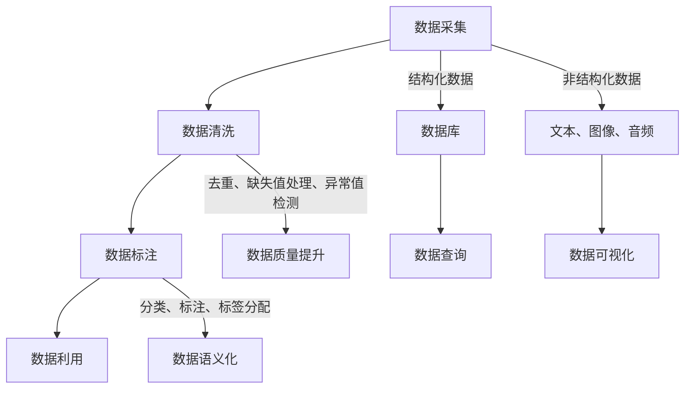

                 

### 1. 背景介绍

在当今的科技领域中，人工智能（AI）无疑是引人瞩目的焦点。它不仅改变了我们的生活方式，也在各行各业中发挥着越来越重要的作用。人工智能的核心在于算法，而数据收集作为算法实现的基础环节，其重要性不言而喻。本文将围绕“AI人工智能核心算法原理与代码实例讲解：数据收集”这一主题，探讨数据收集在人工智能中的应用及其重要性。

数据收集是人工智能算法得以实现的基础。无论是机器学习、深度学习还是自然语言处理，都需要大量的数据作为训练素材。数据的质量和数量直接影响算法的性能和效果。因此，如何高效、准确地收集数据成为了人工智能领域的一个重要课题。

随着大数据技术的发展，数据收集的方法和工具也在不断进化。从传统的手动数据标注到自动化数据采集，从结构化数据到非结构化数据，数据收集的效率和效果得到了显著提升。然而，数据收集仍然面临诸多挑战，如数据质量、数据隐私和安全等问题。因此，深入研究数据收集的方法和策略，对于推动人工智能技术的发展具有重要意义。

本文将从以下几个方面进行探讨：

1. **核心概念与联系**：介绍数据收集的基本概念，以及与相关领域如机器学习、深度学习的联系。
2. **核心算法原理**：详细阐述数据收集的主要算法原理，包括数据采集、数据清洗、数据标注等步骤。
3. **数学模型和公式**：介绍数据收集过程中常用的数学模型和公式，并举例说明。
4. **项目实战**：通过实际案例，展示数据收集的过程和实现方法。
5. **实际应用场景**：分析数据收集在不同领域的应用，如自然语言处理、计算机视觉等。
6. **工具和资源推荐**：推荐相关的数据收集工具和资源，帮助读者深入了解和实践。
7. **总结**：总结数据收集的重要性及其未来发展趋势与挑战。

通过对这些内容的深入探讨，本文旨在为读者提供关于数据收集的全面、系统的认识，并激发读者对这一领域的兴趣和思考。

### 2. 核心概念与联系

数据收集作为人工智能算法实现的基础，其核心概念包括数据采集、数据清洗、数据标注等。为了更好地理解这些概念，我们首先需要了解它们在人工智能中的应用及其相互关系。

#### 数据采集

数据采集是数据收集的第一步，它指的是从各种来源获取原始数据的过程。数据来源可以是结构化数据（如数据库、表格），也可以是非结构化数据（如文本、图片、音频）。数据采集的方法多种多样，包括网络爬虫、传感器、API接口等。网络爬虫是一种常用的数据采集工具，它通过模拟用户的浏览器行为，自动获取网站上的数据。传感器则适用于获取环境数据，如温度、湿度、光照等。API接口则允许程序直接访问第三方数据源，获取所需数据。

在人工智能领域，数据采集至关重要。无论是机器学习中的模型训练，还是深度学习中的神经网络训练，都需要大量的数据作为训练素材。数据采集的质量直接影响算法的性能和效果。因此，如何高效、准确地采集数据成为了人工智能领域的一个重要课题。

#### 数据清洗

数据采集后，往往不是直接用于训练或分析，而是需要经过清洗处理。数据清洗是指识别并纠正数据中的错误、缺失、异常等不完整或不准确的信息。数据清洗的过程包括数据去重、缺失值处理、异常值检测和修正等。

数据清洗的目的是提高数据质量，确保数据的有效性和准确性。在机器学习中，数据质量对模型性能有直接影响。如果数据中含有大量噪声或错误，可能导致模型过拟合或欠拟合，影响最终的预测效果。因此，数据清洗是确保数据质量的重要步骤。

#### 数据标注

数据标注是数据收集的另一个关键环节，它指的是对原始数据进行分类、标注或标签分配，使其具备一定的语义信息。数据标注可以基于不同的任务需求，如图像标注、文本分类、语音识别等。常见的标注方法包括手动标注和半自动标注。

手动标注通常由专业人员完成，具有高精度但低效率的特点。半自动标注则结合了人类标注员和自动化工具的优势，通过预标注和后处理，提高标注效率和质量。

在人工智能领域，数据标注对于训练有监督学习模型至关重要。有监督学习模型需要大量标注好的数据来学习特征和分类规则，从而进行准确的预测和分类。因此，数据标注的质量直接影响模型的性能和效果。

#### 数据采集、数据清洗、数据标注的相互关系

数据采集、数据清洗、数据标注三者紧密相关，共同构成了数据收集的过程。数据采集是获取原始数据的来源，数据清洗是对原始数据进行预处理，数据标注则是对预处理后的数据赋予语义信息。

数据采集的质量直接影响后续的数据清洗和标注。如果原始数据质量较低，含有大量噪声和错误，将导致数据清洗和标注的工作量大大增加，甚至影响算法的性能。因此，在数据采集阶段，需要尽可能获取高质量、结构化的数据。

数据清洗和标注则是对原始数据的质量进行提升。通过数据清洗，可以去除数据中的噪声和错误，提高数据的准确性；通过数据标注，可以为数据赋予语义信息，使其具备更高的利用价值。

综上所述，数据采集、数据清洗、数据标注共同构成了数据收集的核心环节，它们在人工智能领域发挥着重要作用。理解这些概念及其相互关系，有助于我们更好地进行数据收集工作，提高人工智能算法的性能和效果。

#### Mermaid 流程图

为了更好地理解数据采集、数据清洗、数据标注的过程及其相互关系，我们可以使用 Mermaid 流程图进行可视化展示。以下是数据收集过程的 Mermaid 流程图：



在这个流程图中，数据采集过程包括结构化数据和非结构化数据。结构化数据存储在数据库中，可以方便地进行数据查询；非结构化数据如文本、图像、音频则可以用于数据可视化和分析。数据清洗过程包括去重、缺失值处理、异常值检测等，以提高数据质量。数据标注过程则是对数据进行分类、标注、标签分配，使其具备语义信息。最后，通过数据利用，将处理后的数据应用于实际任务中。

通过这个 Mermaid 流程图，我们可以清晰地看到数据采集、数据清洗、数据标注的过程及其相互关系，有助于我们更好地理解数据收集在人工智能中的应用。

### 3. 核心算法原理 & 具体操作步骤

数据收集是人工智能算法实现的基础，其核心算法原理包括数据采集、数据清洗、数据标注等步骤。下面我们将逐一介绍这些算法的原理和具体操作步骤。

#### 3.1 数据采集算法

数据采集算法主要关注如何从各种来源获取原始数据。以下是一些常见的数据采集算法：

1. **网络爬虫**：网络爬虫是一种自动化程序，用于模拟用户的浏览器行为，从网站中抓取数据。常用的网络爬虫工具包括 BeautifulSoup、Scrapy 等。

   **具体操作步骤**：
   - 指定目标网站和需要采集的数据类型（如商品信息、新闻文章等）。
   - 分析目标网站的结构，确定数据采集的路径和规则。
   - 编写爬虫代码，模拟用户行为，获取网页内容。
   - 解析网页内容，提取所需数据，并存储到数据库或其他数据存储工具中。

2. **传感器采集**：传感器采集适用于获取环境数据，如温度、湿度、光照等。常用的传感器包括温度传感器、湿度传感器、光照传感器等。

   **具体操作步骤**：
   - 选择合适的传感器，安装和配置传感器设备。
   - 连接传感器设备到计算机或其他数据采集设备。
   - 采集传感器数据，并将数据上传到服务器或数据库。

3. **API接口采集**：API接口采集适用于从第三方数据源获取数据，如天气数据、股票数据等。

   **具体操作步骤**：
   - 查找并注册合适的API接口。
   - 分析API接口文档，确定数据采集的URL、参数和返回格式。
   - 编写程序调用API接口，获取数据。
   - 解析返回的数据，提取所需信息，并存储到数据库或其他数据存储工具中。

#### 3.2 数据清洗算法

数据清洗算法主要关注如何识别并纠正数据中的错误、缺失、异常等不完整或不准确的信息。以下是一些常见的数据清洗算法：

1. **去重**：去重是指识别并去除重复的数据记录。

   **具体操作步骤**：
   - 对数据集进行遍历，比较每个数据记录的特征值，如ID、名称等。
   - 如果发现重复记录，则删除其中一个或多个重复记录。

2. **缺失值处理**：缺失值处理是指处理数据中的缺失值，常用的方法包括删除缺失值、填充缺失值等。

   **具体操作步骤**：
   - 对数据集进行遍历，识别缺失值。
   - 根据数据集的特点，选择适当的缺失值处理方法：
     - 删除缺失值：对于某些数据集，如果缺失值较多，可以选择删除包含缺失值的记录。
     - 填充缺失值：对于其他数据集，可以选择使用平均值、中位数、最大值、最小值等方法填充缺失值。

3. **异常值检测和修正**：异常值检测和修正是指识别并修正数据中的异常值。

   **具体操作步骤**：
   - 选择合适的异常值检测方法，如基于统计方法的Z-Score、基于机器学习的方法等。
   - 识别异常值，并根据数据集的特点，选择适当的修正方法：
     - 删除异常值：对于某些数据集，如果异常值较多，可以选择删除包含异常值的记录。
     - 修正异常值：对于其他数据集，可以选择使用平均值、中位数、最大值、最小值等方法修正异常值。

#### 3.3 数据标注算法

数据标注算法主要关注如何对原始数据进行分类、标注或标签分配，使其具备一定的语义信息。以下是一些常见的数据标注算法：

1. **手动标注**：手动标注是指由专业人员对数据进行分类、标注或标签分配。

   **具体操作步骤**：
   - 选择合适的标注工具，如 LabelImg、CVAT 等。
   - 根据标注任务的需求，制定标注规范和标准。
   - 对数据进行标注，并检查标注结果的质量。

2. **半自动标注**：半自动标注是指结合人类标注员和自动化工具的优势，通过预标注和后处理，提高标注效率和质量。

   **具体操作步骤**：
   - 使用自动化工具进行预标注，如使用算法生成初始标注结果。
   - 标注员对预标注结果进行审查和修正，提高标注质量。
   - 使用后处理工具对标注结果进行优化，如去除重复标注、纠正错误标注等。

通过以上对数据采集、数据清洗、数据标注算法原理和具体操作步骤的介绍，我们可以更好地理解数据收集在人工智能中的应用。在实际应用中，根据不同的需求和场景，可以选择合适的数据采集、数据清洗、数据标注算法，以提高数据质量和算法性能。

### 4. 数学模型和公式 & 详细讲解 & 举例说明

在数据收集过程中，数学模型和公式起到了至关重要的作用。这些模型和公式帮助我们更好地理解数据的分布、特征以及如何对数据进行处理和优化。以下是几个在数据收集中常用到的数学模型和公式，我们将对其进行详细讲解并举例说明。

#### 4.1 均值（Mean）

均值是描述一组数据集中趋势的常用统计量，它反映了这组数据的平均水平。计算均值的方法是将所有数据值相加，然后除以数据的个数。

**公式**：

\[ \bar{x} = \frac{1}{n} \sum_{i=1}^{n} x_i \]

其中，\( \bar{x} \) 表示均值，\( n \) 表示数据个数，\( x_i \) 表示第 \( i \) 个数据值。

**例子**：

假设我们有以下一组数据：\[ 2, 4, 6, 8, 10 \]

计算这组数据的均值：

\[ \bar{x} = \frac{2 + 4 + 6 + 8 + 10}{5} = \frac{30}{5} = 6 \]

因此，这组数据的均值为 6。

#### 4.2 方差（Variance）

方差是描述一组数据分散程度的统计量，它反映了数据值相对于均值的离散程度。计算方差的方法是将每个数据值与均值的差的平方相加，然后除以数据的个数。

**公式**：

\[ \sigma^2 = \frac{1}{n} \sum_{i=1}^{n} (x_i - \bar{x})^2 \]

其中，\( \sigma^2 \) 表示方差，其他符号与均值相同。

**例子**：

假设我们有以下一组数据：\[ 2, 4, 6, 8, 10 \]

均值为 6，计算这组数据的方差：

\[ \sigma^2 = \frac{1}{5} [(2-6)^2 + (4-6)^2 + (6-6)^2 + (8-6)^2 + (10-6)^2] \]
\[ \sigma^2 = \frac{1}{5} [16 + 4 + 0 + 4 + 16] \]
\[ \sigma^2 = \frac{40}{5} = 8 \]

因此，这组数据的方差为 8。

#### 4.3 标准差（Standard Deviation）

标准差是方差的平方根，它是描述数据分散程度的另一个重要统计量。标准差越大，数据的离散程度越高。

**公式**：

\[ \sigma = \sqrt{\sigma^2} \]

**例子**：

根据上面的例子，我们已经计算出了方差为 8。计算这组数据的标准差：

\[ \sigma = \sqrt{8} \approx 2.828 \]

因此，这组数据的标准差约为 2.828。

#### 4.4 频率分布（Frequency Distribution）

频率分布是描述数据集中各个值出现的次数的分布情况。通过频率分布，我们可以了解数据集的分布特征。

**公式**：

\[ f(x) = \frac{1}{n} \sum_{i=1}^{n} \mathbb{1}_{x_i = x} \]

其中，\( f(x) \) 表示值为 \( x \) 的频率，\( n \) 表示数据个数，\( \mathbb{1}_{x_i = x} \) 是指示函数，当 \( x_i = x \) 时取值为 1，否则取值为 0。

**例子**：

假设我们有以下一组数据：\[ 1, 1, 2, 2, 2, 3, 3, 3, 4 \]

计算各个值的频率分布：

- 值为 1 的频率：\( f(1) = \frac{2}{9} \)
- 值为 2 的频率：\( f(2) = \frac{3}{9} \)
- 值为 3 的频率：\( f(3) = \frac{3}{9} \)
- 值为 4 的频率：\( f(4) = \frac{1}{9} \)

#### 4.5 逻辑回归（Logistic Regression）

逻辑回归是一种常用的统计模型，用于分析二分类问题。它通过建立线性模型，预测样本属于某一类别的概率。

**公式**：

\[ P(y=1) = \frac{1}{1 + e^{-(\beta_0 + \beta_1 x_1 + \beta_2 x_2 + \ldots + \beta_n x_n)}} \]

其中，\( P(y=1) \) 表示样本属于类别 1 的概率，\( \beta_0, \beta_1, \beta_2, \ldots, \beta_n \) 是模型参数，\( x_1, x_2, \ldots, x_n \) 是自变量。

**例子**：

假设我们有一个简单的逻辑回归模型，用于预测一个人是否患有心脏病。模型公式如下：

\[ P(\text{心脏病} = 1) = \frac{1}{1 + e^{-(\beta_0 + \beta_1 \text{年龄} + \beta_2 \text{血压})}} \]

其中，\( \beta_0, \beta_1, \beta_2 \) 是模型参数，年龄和血压是自变量。

给定一个年龄为 40，血压为 120/80 的样本，计算其患有心脏病的概率：

\[ P(\text{心脏病} = 1) = \frac{1}{1 + e^{-(\beta_0 + \beta_1 \times 40 + \beta_2 \times 120/80)}} \]

通过上述公式和例子，我们可以看到数学模型和公式在数据收集中的应用。通过理解并应用这些模型和公式，我们可以更好地分析和处理数据，从而提高数据质量和算法性能。

### 5. 项目实战：代码实际案例和详细解释说明

为了更好地理解数据收集的过程，下面我们通过一个实际项目来展示数据收集的代码实现。本例使用 Python 编程语言，演示如何从互联网上采集数据，并对数据进行清洗和标注。

#### 5.1 开发环境搭建

首先，我们需要搭建开发环境。以下是所需的环境和工具：

- Python 3.x
- requests库：用于发送HTTP请求
- Beautiful Soup库：用于解析HTML页面
- pandas库：用于数据处理
- numpy库：用于数值计算
- matplotlib库：用于数据可视化

安装以上依赖库，可以使用以下命令：

```bash
pip install requests beautifulsoup4 pandas numpy matplotlib
```

#### 5.2 源代码详细实现和代码解读

下面是数据收集的完整代码实现，我们将分步骤进行解读。

##### 5.2.1 采集网页数据

首先，我们从互联网上采集数据。这里我们以爬取某在线书店的图书信息为例。

```python
import requests
from bs4 import BeautifulSoup

# 发送HTTP请求，获取网页内容
url = 'https://www.example-bookstore.com/'
response = requests.get(url)
html_content = response.text

# 解析网页内容，提取图书信息
soup = BeautifulSoup(html_content, 'html.parser')
books = soup.find_all('div', class_='book-item')

# 提取图书标题、作者、价格等信息
book_data = []
for book in books:
    title = book.find('h3').text.strip()
    author = book.find('p', class_='author').text.strip()
    price = book.find('p', class_='price').text.strip()
    book_data.append({'title': title, 'author': author, 'price': price})
```

在这段代码中，我们首先使用 `requests.get()` 函数发送HTTP请求，获取目标网页的内容。然后，使用 `BeautifulSoup` 解析网页内容，提取出所有包含图书信息的 `<div>` 标签。接着，我们进一步提取图书的标题、作者和价格等信息，并存储在列表 `book_data` 中。

##### 5.2.2 数据清洗

接下来，我们对采集到的数据进行清洗。清洗过程包括去除无效数据、处理缺失值和异常值等。

```python
import pandas as pd

# 将列表转换为 DataFrame
df_books = pd.DataFrame(book_data)

# 去除无效数据
df_books = df_books.dropna()  # 去除缺失值
df_books = df_books[df_books['price'].map(lambda x: float(x.replace('$', '')) > 0]  # 去除价格为0的图书

# 处理异常值
df_books['price'] = df_books['price'].map(lambda x: float(x.replace('$', '')))  # 将价格字符串转换为浮点数
df_books = df_books[df_books['price'] < 100]  # 去除价格过高的图书
```

在这段代码中，我们使用 `pandas` 库将采集到的数据转换为 DataFrame 格式，便于进行数据处理。然后，我们使用 `dropna()` 函数去除缺失值，使用 `map()` 函数将价格字符串转换为浮点数，并使用 `df_books[df_books['price'] < 100]` 去除价格过高的图书。

##### 5.2.3 数据标注

最后，我们对清洗后的数据进行标注。这里我们以图书类别为例，对图书进行分类标注。

```python
# 自定义分类标注函数
def categorize_book(title):
    if 'novel' in title.lower():
        return '小说'
    elif 'programming' in title.lower():
        return '编程'
    elif 'history' in title.lower():
        return '历史'
    else:
        return '其他'

# 对图书进行分类标注
df_books['category'] = df_books['title'].apply(categorize_book)
```

在这段代码中，我们自定义了一个 `categorize_book()` 函数，用于根据图书标题对图书进行分类标注。然后，我们使用 `apply()` 函数对 DataFrame 中的每条记录进行标注，生成一个新的 'category' 列。

##### 5.2.4 代码解读与分析

- **采集网页数据**：使用 `requests` 库发送HTTP请求，获取网页内容。然后，使用 `BeautifulSoup` 解析网页内容，提取图书信息。
- **数据清洗**：将数据转换为 DataFrame 格式，使用 `dropna()` 函数去除缺失值，使用 `map()` 函数处理异常值（如将价格字符串转换为浮点数，去除价格过高的图书）。
- **数据标注**：自定义分类标注函数，对图书进行分类标注，生成新的 'category' 列。

通过这个实际项目，我们可以看到数据收集的过程包括采集网页数据、数据清洗和数据标注等步骤。每个步骤都有相应的代码实现，通过这些代码，我们可以高效地获取、处理和标注数据，为后续的机器学习和深度学习任务提供高质量的训练素材。

### 6. 实际应用场景

数据收集在人工智能领域的应用场景非常广泛，涵盖了多个领域。下面我们将分别介绍数据收集在自然语言处理（NLP）和计算机视觉（CV）中的应用场景。

#### 6.1 自然语言处理（NLP）

自然语言处理是人工智能的一个重要分支，其主要目标是对人类语言进行理解和生成。数据收集在 NLP 领域的应用主要集中在数据预处理、文本分类、情感分析、问答系统等方面。

**1. 数据预处理**

在 NLP 中，数据预处理是至关重要的一步。数据预处理包括分词、去除停用词、词性标注等操作。这些操作有助于提高文本数据的结构化程度，从而为后续的文本分析提供基础。

**案例**：构建一个情感分析模型，需要对大量文本数据（如社交媒体评论、产品评价等）进行数据收集和预处理。通过爬虫工具从互联网上获取文本数据，然后使用自然语言处理技术进行分词、去除停用词、词性标注等操作。

**2. 文本分类**

文本分类是一种常见的 NLP 任务，其目的是将文本数据分类到预定义的类别中。数据收集在文本分类中起着关键作用，因为高质量的标注数据有助于提高分类模型的性能。

**案例**：构建一个垃圾邮件分类模型，需要收集大量的电子邮件数据，并对这些数据进行标注，标记为“垃圾邮件”或“非垃圾邮件”。然后，使用这些标注数据训练分类模型，从而实现自动分类。

**3. 情感分析**

情感分析旨在分析文本中表达的情感倾向，如正面、负面或中性。数据收集在情感分析中主要用于收集大量标注好的情感数据，以训练情感分析模型。

**案例**：分析社交媒体上的用户评论，需要收集大量标注好的情感数据。通过数据收集和标注，我们可以构建一个情感分析模型，从而识别用户对产品、服务或事件的情感倾向。

**4. 问答系统**

问答系统是一种智能对话系统，其目标是回答用户提出的问题。数据收集在问答系统中主要用于收集问答对数据，用于训练问答模型。

**案例**：构建一个基于自然语言处理的问答系统，需要收集大量问答对数据。通过数据收集和标注，我们可以训练问答模型，实现智能问答功能。

#### 6.2 计算机视觉（CV）

计算机视觉是人工智能的另一个重要分支，其主要目标是使计算机能够像人类一样理解和处理图像和视频。数据收集在 CV 领域的应用主要集中在图像分类、目标检测、人脸识别等方面。

**1. 图像分类**

图像分类是一种常见的 CV 任务，其目的是将图像分类到预定义的类别中。数据收集在图像分类中起着关键作用，因为高质量的标注数据有助于提高分类模型的性能。

**案例**：构建一个图像分类模型，需要收集大量的图像数据，并对这些图像进行标注，标记为“猫”、“狗”或其他类别。然后，使用这些标注数据训练分类模型，从而实现图像分类。

**2. 目标检测**

目标检测是一种旨在识别图像中的目标和边界框的 CV 任务。数据收集在目标检测中主要用于收集标注好的图像数据，用于训练目标检测模型。

**案例**：构建一个车辆检测模型，需要收集大量标注好的车辆图像数据。通过数据收集和标注，我们可以训练目标检测模型，从而实现车辆检测。

**3. 人脸识别**

人脸识别是一种旨在识别和验证人脸身份的 CV 任务。数据收集在人脸识别中主要用于收集大量标注好的人脸图像数据，用于训练人脸识别模型。

**案例**：构建一个人脸识别系统，需要收集大量标注好的人脸图像数据。通过数据收集和标注，我们可以训练人脸识别模型，从而实现人脸识别。

总之，数据收集在人工智能领域的实际应用场景非常广泛，涵盖了自然语言处理和计算机视觉等多个领域。通过数据收集，我们可以获取高质量的标注数据，为机器学习和深度学习模型提供训练素材，从而推动人工智能技术的发展和应用。

### 7. 工具和资源推荐

为了更好地进行数据收集，我们需要借助一些工具和资源。以下是一些在数据收集领域常用的工具、学习资源以及相关论文和著作。

#### 7.1 学习资源推荐

1. **书籍**：

   - 《数据科学入门：基础与实战》
   - 《机器学习实战》
   - 《Python数据科学手册》

2. **在线课程**：

   - Coursera上的《机器学习》课程
   - Udacity的《深度学习纳米学位》
   - edX上的《自然语言处理》课程

3. **博客和网站**：

   - towardsdatascience.com：一个关于数据科学和机器学习的优秀博客平台
   - medium.com：有许多专业人士分享的数据收集和机器学习相关文章
   - mlbenchmarks.com：一个关于机器学习基准测试和资源分享的网站

#### 7.2 开发工具框架推荐

1. **数据采集工具**：

   - Scrapy：一个强大的网络爬虫框架，适用于大规模数据采集
   - Beautiful Soup：一个用于解析HTML和XML文档的Python库
   - Selenium：一个自动化测试工具，可以模拟浏览器行为进行数据采集

2. **数据清洗工具**：

   - Pandas：一个用于数据操作和分析的Python库
   - NumPy：一个用于数值计算的Python库
   - OpenPyXL：一个用于读写Excel文件的Python库

3. **数据标注工具**：

   - LabelImg：一个用于图像标注的工具
   - CVAT：一个在线图像和视频标注平台
   - Annotator.js：一个基于Web的文本标注工具

#### 7.3 相关论文著作推荐

1. **论文**：

   - "Large Scale Online Learning of Image Classifiers Using Random Mappings"（随机映射的大规模在线学习图像分类器）
   - "Deep Learning for Image Recognition"（深度学习在图像识别中的应用）
   - "Natural Language Inference with External Knowledge"（结合外部知识的自然语言推理）

2. **著作**：

   - 《深度学习》（Goodfellow, Bengio, Courville）
   - 《Python数据分析》（McKinney）
   - 《数据科学导论》（Sebastian Raschka）

通过这些工具、资源和学习材料，我们可以更好地理解和掌握数据收集的方法和技巧，为人工智能算法的实现和应用提供坚实的基础。

### 8. 总结：未来发展趋势与挑战

数据收集作为人工智能算法实现的基础，其重要性不言而喻。在未来，数据收集将继续发挥关键作用，并迎来一系列发展趋势和挑战。

#### 8.1 发展趋势

1. **自动化与智能化**：随着人工智能技术的发展，自动化和智能化数据收集将逐步取代传统的手动数据采集方法。例如，利用深度学习和强化学习技术，可以构建自动化的数据采集系统，实现高效、精准的数据收集。

2. **实时数据采集**：实时数据采集将成为重要趋势。在物联网、智能交通、智慧城市等应用场景中，对实时数据的依赖日益增加。因此，实时数据采集技术将得到广泛应用，以确保数据收集的时效性和准确性。

3. **跨域数据融合**：在多领域应用中，数据融合将成为关键。通过整合来自不同领域的多源异构数据，可以更全面地了解现实世界，提高数据收集的准确性和实用性。

4. **隐私保护**：随着数据隐私保护意识的提高，如何在保障隐私的前提下进行数据收集将成为重要挑战。数据加密、匿名化、差分隐私等技术将在数据收集过程中发挥重要作用。

5. **数据质量提升**：数据质量提升将始终是数据收集的重要目标。未来，我们将看到更多关于数据质量检测、数据清洗、数据标注等方面的技术创新，以提高数据收集的质量。

#### 8.2 挑战

1. **数据隐私和安全**：在数据收集过程中，如何确保数据隐私和安全是一个亟待解决的问题。特别是在涉及敏感信息的场景中，如何防止数据泄露和滥用是一个重要挑战。

2. **数据质量**：数据质量是影响人工智能算法性能的关键因素。在数据收集过程中，如何保证数据的质量，包括数据的完整性、准确性、一致性等，仍需进一步研究。

3. **数据量与多样性**：随着数据量的不断增加和数据类型的多样化，如何在海量数据中快速、准确地收集到所需数据将是一个挑战。特别是在实时数据采集和跨域数据融合场景中，数据量与多样性的增加将加剧这一挑战。

4. **法律法规**：在全球范围内，数据隐私保护法律法规日益完善，如何在合规的前提下进行数据收集将成为一个挑战。特别是在涉及跨国数据传输和存储的场景中，如何遵守不同国家的法律法规将是一个重要问题。

5. **人才短缺**：随着数据收集技术的不断发展，对数据科学家、数据工程师等专业人才的需求日益增加。然而，目前相关人才的培养速度跟不上市场需求，人才短缺将成为数据收集领域面临的一个挑战。

总之，数据收集作为人工智能算法实现的基础，在未来将继续发挥重要作用。然而，如何应对自动化与智能化、数据隐私和安全、数据质量、数据量与多样性、法律法规、人才短缺等挑战，将是我们需要关注和解决的关键问题。通过不断创新和探索，我们有理由相信，数据收集技术将迎来更加光明的发展前景。

### 9. 附录：常见问题与解答

在数据收集过程中，可能会遇到一些常见问题。以下是一些常见问题的解答，以帮助您更好地理解和解决这些问题。

#### 9.1 数据隐私和安全问题

**问题**：如何在确保数据隐私和安全的前提下进行数据收集？

**解答**：确保数据隐私和安全的方法包括：

1. **数据加密**：在数据传输和存储过程中，使用加密技术对数据进行加密，防止数据泄露。
2. **匿名化处理**：对敏感数据进行匿名化处理，去除或替换能识别个体身份的信息，从而降低数据泄露的风险。
3. **访问控制**：实施严格的访问控制策略，确保只有授权用户才能访问敏感数据。
4. **合规审查**：遵守相关的数据隐私保护法律法规，定期进行合规性审查，确保数据收集和处理过程符合法律法规要求。

#### 9.2 数据质量问题

**问题**：如何保证数据收集的质量？

**解答**：保证数据收集质量的方法包括：

1. **数据源选择**：选择可信的数据源，确保数据来源的可靠性和准确性。
2. **数据清洗**：在数据收集过程中，对数据进行清洗，去除重复、缺失、异常等不完整或不准确的数据。
3. **数据标注**：对数据进行高质量的标注，确保数据的语义信息准确无误。
4. **数据验证**：对收集到的数据进行分析和验证，确保数据的完整性和一致性。

#### 9.3 数据采集速度问题

**问题**：如何提高数据采集的速度？

**解答**：提高数据采集速度的方法包括：

1. **并行采集**：使用多线程或多进程技术，实现并行数据采集，提高数据采集效率。
2. **自动化脚本**：编写自动化脚本，实现快速的数据采集过程，减少人工干预。
3. **代理服务器**：使用代理服务器进行数据采集，绕过访问限制，提高数据采集速度。
4. **缓存策略**：对常用数据设置缓存策略，减少重复数据采集，提高数据采集速度。

#### 9.4 数据存储问题

**问题**：如何有效地存储大量数据？

**解答**：有效存储大量数据的方法包括：

1. **分布式存储**：使用分布式存储系统，如Hadoop、Spark等，实现海量数据的分布式存储和管理。
2. **云存储**：利用云存储服务，如AWS S3、Azure Blob Storage等，实现高效、安全的数据存储。
3. **数据压缩**：对数据进行压缩，减少存储空间占用。
4. **数据归档**：对不常访问的数据进行归档，减少在线存储压力。

通过以上方法，我们可以有效地解决数据收集过程中遇到的常见问题，提高数据收集的效率和质量。

### 10. 扩展阅读 & 参考资料

为了深入了解数据收集的相关内容，以下是推荐的一些扩展阅读和参考资料：

1. **书籍**：

   - 《数据科学导论》：作者 [Sebastian Raschka] & [John F. Dziurzynski]，系统地介绍了数据科学的基础知识，包括数据收集和处理。

   - 《深度学习》：作者 [Ian Goodfellow]、[Yoshua Bengio] 和 [Aaron Courville]，详细介绍了深度学习的基本原理和应用，包括数据收集和预处理。

2. **在线课程**：

   - Coursera上的《机器学习》课程：由 Andrew Ng 开设，涵盖了机器学习的基本概念和算法，包括数据收集和预处理。

   - edX上的《自然语言处理》课程：由 Daniel Jurafsky 和 James H. Martin 开设，介绍了自然语言处理的基础知识和应用，包括文本数据的收集和处理。

3. **论文**：

   - "Large Scale Online Learning of Image Classifiers Using Random Mappings"：该论文提出了一种基于随机映射的大规模在线学习图像分类器，对于理解大规模图像数据收集和分类具有重要意义。

   - "Deep Learning for Image Recognition"：该论文探讨了深度学习在图像识别中的应用，包括数据收集、预处理和模型训练。

4. **博客和网站**：

   - towardsdatascience.com：一个关于数据科学和机器学习的优秀博客平台，提供大量关于数据收集和处理的文章。

   - medium.com：有许多专业人士分享的数据收集和机器学习相关文章，涵盖多个应用领域。

   - mlbenchmarks.com：一个关于机器学习基准测试和资源分享的网站，提供了丰富的数据收集和处理资源。

通过阅读以上书籍、课程、论文和网站，您可以更深入地了解数据收集的理论和实践，为您的数据科学和人工智能项目提供有力支持。

