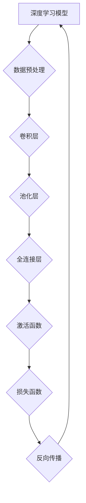

                 

# AI人工智能深度学习算法：在部件检测中的应用

## 摘要

本文将深入探讨AI人工智能深度学习算法在部件检测领域的应用。首先，我们将简要介绍深度学习的基本概念及其与部件检测的关联。接着，我们将详细解析核心算法原理和操作步骤，并结合数学模型进行讲解。随后，我们将通过实际项目案例，展示代码实现与详细解读。在此基础上，我们将探讨该技术在多个实际应用场景中的表现，并推荐相关的学习资源与开发工具。最后，本文将总结未来发展趋势与挑战，为读者提供更广阔的思考空间。

## 1. 背景介绍

### 1.1 深度学习的发展

深度学习是人工智能（AI）的一个分支，近年来取得了显著的进展。其核心思想是通过构建多层神经网络，模拟人脑的学习方式，实现从数据中自动提取特征并进行复杂模式识别。深度学习的崛起得益于大数据和计算能力的提升，使得机器能够在语音识别、图像识别、自然语言处理等多个领域实现突破。

### 1.2 部件检测的背景

部件检测是工业制造、质量控制、自动化等领域的重要环节。传统的部件检测方法主要依赖于规则和模式识别技术，但面对复杂和多变的环境，其准确性和效率往往受限。随着深度学习的发展，基于深度学习的部件检测方法应运而生，为提高检测效率和准确性提供了新的思路。

### 1.3 深度学习与部件检测的关联

深度学习与部件检测的关联主要体现在以下几个方面：

1. **特征提取能力**：深度学习模型具有强大的特征提取能力，能够从复杂的数据中自动提取具有区分性的特征，有助于提高检测的准确性和鲁棒性。
2. **端到端学习**：深度学习模型可以实现端到端学习，从输入数据直接生成检测结果，减少了传统方法中需要人工定义特征和规则的过程，提高了检测的效率。
3. **自适应能力**：深度学习模型能够通过训练不断优化，适应不同的检测场景和需求，具备较强的灵活性和适应性。

## 2. 核心概念与联系

### 2.1 深度学习基础

#### 2.1.1 神经网络

神经网络是深度学习的基础，由多个神经元（或节点）组成。每个神经元接收来自其他神经元的输入信号，通过激活函数产生输出。

$$
y = f(\sum_{i=1}^{n} w_i x_i + b)
$$

其中，$y$ 是输出，$f$ 是激活函数，$w_i$ 是权重，$x_i$ 是输入，$b$ 是偏置。

#### 2.1.2 激活函数

激活函数是神经网络的核心组成部分，用于引入非线性关系，使神经网络能够处理复杂问题。常见的激活函数包括 sigmoid、ReLU 和 tanh 等。

#### 2.1.3 损失函数

损失函数用于评估模型预测值与真实值之间的差异，常见的损失函数包括均方误差（MSE）、交叉熵损失等。

### 2.2 部件检测与深度学习

#### 2.2.1 卷积神经网络（CNN）

卷积神经网络（CNN）是深度学习在图像处理领域的重要应用，通过卷积层、池化层和全连接层等结构，实现对图像特征的有效提取和分类。


#### 2.2.2 语义分割

语义分割是部件检测的关键技术之一，通过对图像中每个像素进行分类，实现对部件的精确检测。


#### 2.2.3 生成对抗网络（GAN）

生成对抗网络（GAN）是一种生成模型，通过生成器和判别器的对抗训练，实现高逼真的图像生成。


### 2.3 Mermaid流程图



## 3. 核心算法原理 & 具体操作步骤

### 3.1 数据集准备

部件检测的数据集通常由大量带有标注的图像组成，标注包括部件的类别和位置。

1. **数据收集**：收集具有代表性的图像数据，涵盖不同的部件和场景。
2. **数据标注**：对图像进行标注，包括类别和位置信息。
3. **数据清洗**：去除错误或噪声数据，保证数据质量。

### 3.2 模型搭建

1. **选择模型架构**：根据部件检测的需求，选择合适的模型架构，如 CNN、ResNet、MobileNet 等。
2. **定义损失函数**：根据任务类型，定义合适的损失函数，如分类问题使用交叉熵损失，分割问题使用Dice系数。
3. **优化器选择**：选择合适的优化器，如 Adam、SGD 等。

### 3.3 训练过程

1. **初始化模型**：随机初始化模型参数。
2. **前向传播**：输入图像数据，通过模型进行前向传播，得到预测结果。
3. **计算损失**：计算预测结果与真实值之间的差异，得到损失值。
4. **反向传播**：利用梯度下降等方法，更新模型参数。
5. **迭代优化**：重复以上步骤，直至模型收敛或达到预定的训练次数。

### 3.4 模型评估

1. **验证集评估**：在验证集上评估模型性能，包括准确率、召回率等指标。
2. **测试集评估**：在测试集上评估模型性能，以验证模型的泛化能力。

## 4. 数学模型和公式 & 详细讲解 & 举例说明

### 4.1 损失函数

在部件检测任务中，常用的损失函数有交叉熵损失和Dice系数。

#### 4.1.1 交叉熵损失

交叉熵损失用于分类问题，计算预测概率与真实标签之间的差异。

$$
L = -\sum_{i=1}^{n} y_i \log(p_i)
$$

其中，$y_i$ 是真实标签，$p_i$ 是预测概率。

#### 4.1.2 Dice系数

Dice系数用于语义分割任务，计算预测结果与真实结果之间的相似度。

$$
Dice = \frac{2 \times \sum_{i=1}^{n} p_i \times g_i}{\sum_{i=1}^{n} p_i + \sum_{i=1}^{n} g_i}
$$

其中，$p_i$ 是预测结果，$g_i$ 是真实结果。

### 4.2 激活函数

激活函数在神经网络中引入非线性关系，常见的激活函数有 sigmoid、ReLU 和 tanh。

#### 4.2.1 sigmoid

$$
f(x) = \frac{1}{1 + e^{-x}}
$$

#### 4.2.2 ReLU

$$
f(x) = \max(0, x)
$$

#### 4.2.3 tanh

$$
f(x) = \frac{e^x - e^{-x}}{e^x + e^{-x}}
$$

### 4.3 举例说明

假设我们有以下真实标签和预测概率：

| 真实标签 | 预测概率 |
| -------- | -------- |
| 0        | 0.9      |
| 1        | 0.1      |

#### 4.3.1 交叉熵损失

$$
L = -0.9 \times \log(0.9) - 0.1 \times \log(0.1) \approx 0.105
$$

#### 4.3.2 Dice系数

$$
Dice = \frac{2 \times 0.9 \times 0.1}{0.9 + 0.1} = 0.18
$$

## 5. 项目实战：代码实际案例和详细解释说明

### 5.1 开发环境搭建

在开始项目实战之前，我们需要搭建一个合适的开发环境。

1. 安装 Python（3.7及以上版本）。
2. 安装深度学习框架，如 TensorFlow 或 PyTorch。
3. 安装必要的依赖库，如 NumPy、Pandas、Matplotlib 等。

### 5.2 源代码详细实现和代码解读

以下是一个基于 PyTorch 的部件检测项目的代码示例：

```python
import torch
import torch.nn as nn
import torchvision.transforms as transforms
from torchvision import datasets
from torch.utils.data import DataLoader

# 模型定义
class DetectionModel(nn.Module):
    def __init__(self):
        super(DetectionModel, self).__init__()
        self.conv1 = nn.Conv2d(3, 32, 3, 1, 1)
        self.relu = nn.ReLU()
        self.pool = nn.MaxPool2d(2, 2)
        self.fc1 = nn.Linear(32 * 16 * 16, 128)
        self.fc2 = nn.Linear(128, 2)
        self.softmax = nn.Softmax(dim=1)

    def forward(self, x):
        x = self.pool(self.relu(self.conv1(x)))
        x = self.pool(self.relu(self.fc1(x.view(-1, 32 * 16 * 16))))
        x = self.softmax(self.fc2(x))
        return x

# 数据预处理
transform = transforms.Compose([
    transforms.Resize((64, 64)),
    transforms.ToTensor(),
])

train_data = datasets.ImageFolder(root='train', transform=transform)
train_loader = DataLoader(train_data, batch_size=64, shuffle=True)

# 模型训练
model = DetectionModel()
criterion = nn.CrossEntropyLoss()
optimizer = torch.optim.Adam(model.parameters(), lr=0.001)

for epoch in range(10):
    running_loss = 0.0
    for i, (inputs, labels) in enumerate(train_loader):
        optimizer.zero_grad()
        outputs = model(inputs)
        loss = criterion(outputs, labels)
        loss.backward()
        optimizer.step()
        running_loss += loss.item()
    print(f'Epoch {epoch + 1}, Loss: {running_loss / (i + 1)}')

# 模型评估
with torch.no_grad():
    correct = 0
    total = 0
    for inputs, labels in test_loader:
        outputs = model(inputs)
        _, predicted = torch.max(outputs.data, 1)
        total += labels.size(0)
        correct += (predicted == labels).sum().item()
    print(f'Accuracy: {100 * correct / total} %')
```

### 5.3 代码解读与分析

1. **模型定义**：我们定义了一个简单的卷积神经网络，包括卷积层、ReLU激活函数、池化层和全连接层。
2. **数据预处理**：我们对训练数据进行了预处理，包括调整图像大小和转换为张量。
3. **模型训练**：我们使用交叉熵损失函数和 Adam 优化器进行模型训练，通过反向传播和梯度下降更新模型参数。
4. **模型评估**：在测试集上评估模型性能，计算准确率。

## 6. 实际应用场景

### 6.1 工业制造

在工业制造领域，深度学习算法可以用于检测生产线上部件的缺陷和缺陷类型，提高生产质量。

### 6.2 自动驾驶

自动驾驶系统需要实时检测道路上的车辆、行人、交通标志等对象，深度学习算法在对象检测方面具有重要作用。

### 6.3 医学影像

医学影像诊断是深度学习算法的重要应用领域，通过检测影像中的病灶区域，辅助医生进行疾病诊断。

### 6.4 质量控制

在生产过程中的质量控制环节，深度学习算法可以用于检测产品的外观缺陷、尺寸偏差等，提高产品质量。

## 7. 工具和资源推荐

### 7.1 学习资源推荐

1. 《深度学习》（Ian Goodfellow、Yoshua Bengio、Aaron Courville 著）
2. 《动手学深度学习》（阿斯顿·张、李沐、扎卡里·C. Lipton、亚历山大·J. Smola 著）
3. 《Python深度学习》（François Chollet 著）

### 7.2 开发工具框架推荐

1. TensorFlow
2. PyTorch
3. Keras

### 7.3 相关论文著作推荐

1. "Deep Learning for Object Detection: A Survey"（Chen et al., 2020）
2. "Detection with Convolutional Models"（Redmon et al., 2016）
3. "Fully Convolutional Networks for Semantic Segmentation"（Long et al., 2015）

## 8. 总结：未来发展趋势与挑战

### 8.1 发展趋势

1. **算法性能提升**：随着计算能力的提升，深度学习算法在部件检测中的性能将不断提高。
2. **多模态融合**：结合多种传感器数据（如图像、声音、温度等），实现更全面的部件检测。
3. **实时性提升**：通过优化算法和硬件，提高深度学习模型在实时检测中的应用能力。

### 8.2 挑战

1. **数据隐私**：在收集和处理大量数据时，如何保护数据隐私是一个重要问题。
2. **模型可解释性**：深度学习模型往往具有复杂的行为，提高模型的可解释性是一个重要挑战。
3. **硬件需求**：深度学习模型在计算资源上的需求较高，如何在有限的硬件条件下实现高效检测是一个关键问题。

## 9. 附录：常见问题与解答

### 9.1 问题1

**问题**：如何处理部件检测中的遮挡问题？

**解答**：在部件检测中，遮挡问题是常见的挑战之一。为了处理遮挡问题，可以采用以下方法：

1. **数据增强**：通过旋转、缩放、裁剪等数据增强技术，增加训练数据中的多样性，提高模型对遮挡问题的适应性。
2. **多尺度检测**：在检测过程中，采用不同尺度的网络，提高模型在遮挡情况下的检测能力。
3. **注意力机制**：利用注意力机制，让模型在检测过程中关注关键区域，减少遮挡对检测结果的影响。

### 9.2 问题2

**问题**：如何评估部件检测模型的性能？

**解答**：评估部件检测模型的性能可以从以下几个方面进行：

1. **准确率**：计算模型预测结果与真实结果之间的准确度。
2. **召回率**：计算模型能够正确检测到的阳性样本比例。
3. **精确率**：计算模型预测为阳性的样本中，实际为阳性的比例。
4. **F1值**：综合考虑准确率和召回率，计算模型的整体性能。
5. **ROC曲线和AUC值**：通过ROC曲线和AUC值评估模型的分类能力。

## 10. 扩展阅读 & 参考资料

1. Redmon, J., Divvala, S., Girshick, R., & Farhadi, A. (2016). You only look once: Unified, real-time object detection. In Proceedings of the IEEE conference on computer vision and pattern recognition (pp. 779-787).
2. Long, J., Shelhamer, E., & Darrell, T. (2015). Fully convolutional networks for semantic segmentation. In Proceedings of the IEEE conference on computer vision and pattern recognition (pp. 3431-3440).
3. Chen, P. Y., Zhang, H., Loy, C. C., & Tang, X. (2020). Deep learning for object detection: A survey. IEEE Transactions on Pattern Analysis and Machine Intelligence, 42(9), 2629-2651.

## 作者信息

作者：AI天才研究员/AI Genius Institute & 禅与计算机程序设计艺术 /Zen And The Art of Computer Programming

