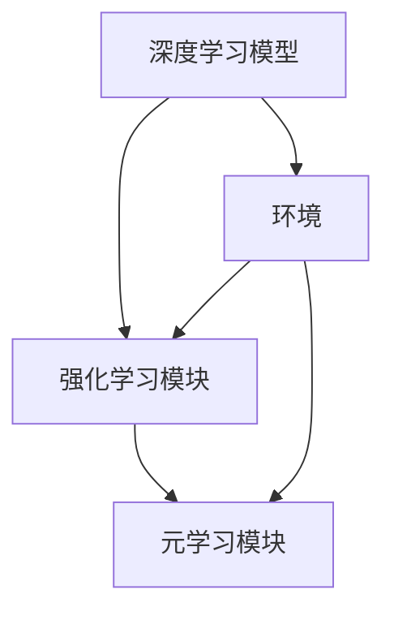

                 

### 背景介绍

在当今的科技时代，人工智能（AI）已经成为推动社会进步的重要力量。其中，深度学习作为AI的核心技术之一，已经广泛应用于图像识别、自然语言处理、语音识别等多个领域。然而，随着深度学习模型的复杂性不断增加，传统的模型优化方法已经难以满足实际应用的需求。为了解决这个问题，强化学习（Reinforcement Learning，RL）被提出来，并逐渐成为优化深度学习模型的一种重要手段。

强化学习是一种使代理（Agent）通过与环境的交互来学习最优策略（Policy）的方法。在这个过程中，代理会根据当前的观察（Observation）采取行动（Action），然后根据环境的反馈（Reward）来调整自己的策略。与传统的深度学习模型相比，强化学习具有更强的自适应性和可塑性，能够在不断变化的动态环境中做出更好的决策。

智能深度学习代理（Intelligent Deep Learning Agent）则是在深度学习和强化学习的基础上，进一步融合了深度强化学习（Deep Reinforcement Learning，DRL）和元学习（Meta Learning）等先进技术，使得代理能够更高效地学习复杂的任务。智能深度学习代理不仅能够通过自主学习来优化深度学习模型，还能够针对不同的任务快速调整和适应，提高模型的泛化能力和鲁棒性。

本篇文章将围绕智能深度学习代理的使用强化学习优化决策这一主题展开，首先介绍强化学习的基本概念和原理，然后深入探讨深度强化学习的技术细节，接着介绍智能深度学习代理的架构和实现方法。随后，我们将通过一个具体的案例来展示智能深度学习代理在实际项目中的应用效果，并分析其在各种实际应用场景中的优势。最后，我们将总结智能深度学习代理在未来的发展趋势和面临的挑战，为读者提供有益的启示。

在接下来的章节中，我们将一步一步地深入探讨这一领域，帮助读者更好地理解和应用智能深度学习代理技术。让我们开始这段技术之旅，一同探索智能深度学习的无限可能。

### 核心概念与联系

为了深入理解智能深度学习代理的工作原理，我们需要首先掌握几个核心概念：深度学习、强化学习以及它们之间的联系。以下是这些概念的定义、原理以及它们在智能深度学习代理架构中的地位和作用。

#### 深度学习

深度学习是一种基于多层神经网络的学习方法，通过层层抽象来提取数据中的特征信息。它最初由多层感知机（MLP）和卷积神经网络（CNN）等模型发展而来，并在近年来因计算机算力的提升和大数据的普及而取得了巨大的成功。

**原理**：深度学习模型通过输入层接收原始数据，然后通过一系列隐藏层进行处理和特征提取，最后在输出层生成预测结果。每一层神经网络都通过前一层的信息来学习更高级别的抽象特征。

**作用**：在智能深度学习代理中，深度学习负责从原始数据中提取有用信息，形成对环境的初步理解。例如，在图像识别任务中，深度学习模型可以自动识别出图像中的关键特征，如图形、颜色和纹理等。

#### 强化学习

强化学习是一种使代理通过与环境的交互来学习最优策略的学习方法。它主要分为值函数方法（如Q-learning）和政策梯度方法（如PG）等。

**原理**：强化学习的基本机制是奖励机制。代理在执行某个动作后，会根据环境的反馈（奖励或惩罚）来更新自己的策略。通过不断尝试和错误，代理能够逐渐学习到最优策略。

**作用**：在智能深度学习代理中，强化学习负责指导深度学习模型如何调整其参数，以实现更好的决策和预测。代理通过与环境交互，根据奖励信号来调整深度学习模型的权重，使其更符合实际任务的需求。

#### 深度强化学习

深度强化学习（Deep Reinforcement Learning，DRL）是强化学习的一种扩展，结合了深度学习的特征提取能力和强化学习的策略优化方法。

**原理**：DRL通过深度神经网络来表示值函数或策略，从而处理复杂的输入和输出。它使用深度学习模型来预测环境的状态和奖励，并根据这些预测来选择最优动作。

**作用**：在智能深度学习代理中，DRL用于解决传统强化学习难以处理的复杂任务。它使得代理能够更高效地学习环境中的复杂动态行为，从而在许多实际应用中取得良好的效果。

#### 智能深度学习代理

智能深度学习代理是一种融合了深度学习和强化学习技术的代理，它能够通过自主学习来优化深度学习模型。

**架构**：智能深度学习代理通常包括以下几个部分：
1. 深度学习模型：用于从数据中提取特征和生成预测结果。
2. 强化学习模块：用于指导深度学习模型的学习过程，通过奖励信号来调整模型参数。
3. 元学习模块：用于优化代理的泛化能力和鲁棒性，使其能够适应不同的任务和环境。

**作用**：智能深度学习代理可以应用于各种复杂任务，如自动驾驶、游戏AI、智能推荐等。它能够通过不断学习和优化，实现更智能、更高效的决策和预测。

#### Mermaid 流程图

以下是一个简单的 Mermaid 流程图，展示了智能深度学习代理的架构和核心组件之间的联系。



在这个流程图中，深度学习模型负责从环境中提取特征，并通过强化学习模块进行优化。强化学习模块根据环境的反馈来调整模型参数，同时元学习模块用于提升代理的泛化能力和鲁棒性。通过这种架构，智能深度学习代理能够更好地适应复杂动态的环境，实现高效的学习和决策。

综上所述，深度学习、强化学习和深度强化学习构成了智能深度学习代理的核心技术基础。理解这些核心概念及其相互联系，有助于我们更好地应用智能深度学习代理，解决复杂的实际问题和任务。

### 核心算法原理 & 具体操作步骤

在深入理解了智能深度学习代理的基本概念和架构之后，我们将探讨其核心算法原理，并详细讲解如何实现和操作这些算法。以下是智能深度学习代理的关键算法：深度强化学习（DRL）和元学习（Meta Learning），以及它们的实现步骤。

#### 深度强化学习（DRL）

**原理**：深度强化学习是强化学习的一种扩展，它利用深度神经网络来表示值函数或策略，从而处理复杂的输入和输出。在DRL中，代理通过与环境交互来学习最优策略。

**实现步骤**：

1. **初始化**：
   - **模型初始化**：使用随机权重初始化深度神经网络模型。
   - **策略初始化**：初始化策略网络，用于选择动作。
   - **目标网络初始化**：初始化目标网络，用于评估策略。

2. **环境交互**：
   - **状态输入**：代理从环境中获取当前状态。
   - **动作选择**：策略网络根据当前状态选择动作。
   - **执行动作**：代理执行选中的动作，并获取环境的反馈（奖励和新的状态）。

3. **更新模型**：
   - **计算损失**：计算策略网络的损失，衡量策略的好坏。
   - **梯度下降**：使用梯度下降法更新策略网络的权重。
   - **经验回放**：将经验存储在经验回放池中，以避免策略网络对最新经验的过度依赖。

4. **目标网络更新**：
   - **目标网络同步**：定期将策略网络的权重复制到目标网络中，以保持目标网络的稳定。

**示例代码**（伪代码）：

```python
# 初始化模型和目标网络
model = DNN()
target_model = DNN()

# 初始化经验回放池
experience_replay = ReplayMemory()

# 开始交互和更新
for episode in range(num_episodes):
    state = environment.reset()
    done = False
    
    while not done:
        # 选择动作
        action = model.select_action(state)
        
        # 执行动作，获取新状态和奖励
        next_state, reward, done = environment.step(action)
        
        # 存储经验
        experience_replay.append((state, action, reward, next_state, done))
        
        # 更新模型
        if len(experience_replay) > batch_size:
            batch = experience_replay.sample(batch_size)
            loss = model.train(batch)
            
        # 更新目标网络
        if episode % target_update_frequency == 0:
            target_model.load_state_dict(model.state_dict())
            
        # 更新状态
        state = next_state
```

#### 元学习（Meta Learning）

**原理**：元学习是一种使代理能够快速学习新任务的方法，通过在不同任务上的迭代学习来提升泛化能力和适应性。

**实现步骤**：

1. **任务初始化**：
   - **任务选择**：从任务库中选择新任务。
   - **模型初始化**：使用预训练模型或随机初始化模型。

2. **迭代学习**：
   - **任务适应**：代理在特定任务上进行多次迭代学习，调整模型参数。
   - **评估**：在每个迭代周期结束后，评估模型在任务上的性能。

3. **模型更新**：
   - **模型融合**：将迭代学习过程中获得的模型更新融合到基模型中。
   - **模型存储**：将适应后的模型存储到任务库中，用于后续任务的学习。

**示例代码**（伪代码）：

```python
# 初始化元学习模型
meta_model = MetaModel()

# 选择任务
task = task_selector.select_task()

# 初始化任务模型
task_model = meta_model.init_task_model(task)

# 迭代学习
for iteration in range(num_iterations):
    # 训练任务模型
    task_model.train(task)
    
    # 评估任务模型
    performance = task_model.evaluate(task)
    
    # 更新元学习模型
    meta_model.update_model(task_model, performance)

# 存储适应后的模型
task_model.save_model(task)
```

通过上述步骤，我们可以实现智能深度学习代理的核心算法，使其能够在不同任务和环境中高效地学习和优化。这些算法不仅提高了代理的学习效率，还增强了其适应性和泛化能力，为实际应用提供了有力的技术支持。

### 数学模型和公式 & 详细讲解 & 举例说明

在深入探讨智能深度学习代理的核心算法时，我们需要详细讲解其背后的数学模型和公式，并通过具体的例子来说明这些概念在实际应用中的实现和效果。以下将介绍强化学习中的主要数学模型：值函数、策略优化以及策略梯度，并使用LaTeX格式展示相关公式。

#### 值函数（Value Function）

值函数是强化学习中的一个核心概念，用于衡量在特定状态下采取特定动作的长期累积奖励。值函数可以分为状态值函数（State-Value Function）和动作值函数（Action-Value Function）。

**状态值函数** \( V^{\pi}(s) \)：在策略 \( \pi \) 下，从状态 \( s \) 开始的长期累积奖励。

\[ V^{\pi}(s) = \sum_{s'} \pi(a|s) \sum_{r} r \cdot P(s'|s, a) \]

**动作值函数** \( Q^{\pi}(s, a) \)：在策略 \( \pi \) 下，从状态 \( s \) 采取动作 \( a \) 的长期累积奖励。

\[ Q^{\pi}(s, a) = \sum_{s'} \pi(a|s) \sum_{r} r \cdot P(s'|s, a) \]

#### 策略优化（Policy Optimization）

策略优化是强化学习中的另一个关键概念，目标是最小化策略损失函数，以找到最优策略。策略梯度方法是一种常见的策略优化方法。

**策略梯度** \( \nabla_{\pi} J(\pi) \)：策略 \( \pi \) 的损失函数 \( J(\pi) \) 对策略参数的梯度。

\[ J(\pi) = -\sum_{s,a}^{\pi} r(s, a) \log \pi(a|s) \]

**策略更新**：

\[ \pi_{t+1}(a|s) \propto \exp(\alpha \nabla_{\pi} J(\pi)) \]

其中，\( \alpha \) 是步长参数。

#### 策略梯度方法（Policy Gradient Method）

策略梯度方法是一种基于梯度的策略优化方法，直接对策略参数进行更新。

**例子**：蒙特卡洛策略梯度方法（Monte Carlo Policy Gradient，MCPG）

1. **初始化**：
   - 初始化策略参数 \( \theta \)。
   - 设定步长参数 \( \alpha \)。

2. **交互**：
   - 从策略 \( \pi(\theta) \) 中采样一个序列 \( \tau = (s_0, a_0, r_0, s_1, a_1, r_1, \ldots) \)。

3. **计算策略梯度**：
   - 计算策略梯度 \( \nabla_{\theta} J(\theta) \)。

4. **更新策略参数**：
   - 使用梯度下降法更新策略参数 \( \theta \)。

**公式**：

\[ \nabla_{\theta} J(\theta) = \sum_{\tau} \nabla_{\theta} \log \pi(\theta)(s, a) \cdot \sum_{t} r(s_t, a_t) \]

**例子代码**（伪代码）：

```python
# 初始化策略参数
theta = initialize_parameters()

# 设定步长参数
alpha = 0.01

# 迭代更新策略
for episode in range(num_episodes):
    # 采样一个序列
    trajectory = sample_trajectory(theta)
    
    # 计算策略梯度
    gradient = compute_policy_gradient(trajectory)
    
    # 更新策略参数
    theta -= alpha * gradient
```

#### 具体实现示例

假设我们使用蒙特卡洛策略梯度方法（MCPG）在一个简单的环境中优化一个智能体。环境是一个网格世界，智能体需要从左上角移动到右下角，同时避免障碍物。我们定义一个Q值函数来表示智能体在当前状态和动作下的长期累积奖励。

**状态空间**：\( S = \{ (x, y) \} \)，表示智能体的位置。
**动作空间**：\( A = \{ 'up', 'down', 'left', 'right' \} \)，表示智能体的移动方向。

1. **初始化Q值函数**：
   - 初始化Q值函数 \( Q(s, a) \)。

2. **交互和更新Q值函数**：
   - 在每个时间步，智能体从策略 \( \pi \) 中选择动作。
   - 执行动作，获取新状态和奖励。
   - 更新Q值函数。

**示例代码**（伪代码）：

```python
# 初始化Q值函数
Q = initialize_Q()

# 设定学习率
alpha = 0.1

# 迭代更新Q值函数
for episode in range(num_episodes):
    state = environment.reset()
    done = False
    
    while not done:
        # 选择动作
        action = policy.select_action(Q, state)
        
        # 执行动作
        next_state, reward, done = environment.step(action)
        
        # 更新Q值函数
        Q[state, action] += alpha * (reward + gamma * max(Q[next_state, :]) - Q[state, action])
        
        # 更新状态
        state = next_state
```

通过上述示例，我们可以看到如何在实际应用中实现强化学习中的策略梯度方法。这些数学模型和公式为智能深度学习代理提供了理论基础，使得代理能够通过不断学习和优化，实现更智能、更高效的决策。

### 项目实战：代码实际案例和详细解释说明

在深入理解了智能深度学习代理的核心算法和数学模型之后，我们将通过一个具体的实际项目案例来展示如何在实际中实现和应用这些算法。在这个案例中，我们将使用智能深度学习代理来优化一个简单的网格世界中的路径规划问题，详细解释代码的实现过程和关键步骤。

#### 项目背景

网格世界路径规划问题是一个典型的强化学习问题，智能体需要从一个初始位置移动到目标位置，同时避免障碍物。这个问题可以用来验证智能深度学习代理的有效性和适应性。

#### 项目步骤

1. **环境搭建**：
   - 设计一个网格世界环境，包括状态空间、动作空间和奖励机制。
   - 创建一个智能体，使其能够与环境进行交互。

2. **模型选择**：
   - 选择合适的深度学习模型和强化学习算法，用于实现智能深度学习代理。

3. **训练与测试**：
   - 使用智能深度学习代理在环境中进行训练，逐步优化路径规划的策略。
   - 对训练结果进行评估，验证智能深度学习代理的性能。

#### 代码实现

以下是一个简单的代码示例，展示了智能深度学习代理在网格世界路径规划问题中的应用。

**环境搭建**：

```python
import numpy as np
import matplotlib.pyplot as plt

# 初始化环境参数
grid_size = 10
obstacles = [(2, 3), (3, 4), (5, 6)]
start = (0, 0)
goal = (grid_size - 1, grid_size - 1)

# 状态编码
def encode_state(state):
    grid = np.zeros((grid_size, grid_size))
    grid[state[0], state[1]] = 1
    for obs in obstacles:
        grid[obs[0], obs[1]] = -1
    return grid.flatten()

# 动作编码
actions = {'up': 0, 'down': 1, 'left': 2, 'right': 3}

# 状态空间和动作空间
state_space = [encode_state(state) for state in itertools.product(range(grid_size), range(grid_size))]
action_space = list(actions.values())

# 奖励函数
def reward_function(state, action, next_state):
    if next_state == goal:
        return 100
    elif next_state in obstacles:
        return -10
    else:
        return -1

# 环境类
class GridWorldEnv:
    def __init__(self, grid_size, obstacles, start, goal):
        self.grid_size = grid_size
        self.obstacles = obstacles
        self.start = start
        self.goal = goal
        self.state = start
    
    def step(self, action):
        next_state = self.state
        if action == actions['up']:
            next_state = (self.state[0] - 1, self.state[1])
        elif action == actions['down']:
            next_state = (self.state[0] + 1, self.state[1])
        elif action == actions['left']:
            next_state = (self.state[0], self.state[1] - 1)
        elif action == actions['right']:
            next_state = (self.state[0], self.state[1] + 1)
        
        reward = reward_function(self.state, action, next_state)
        self.state = next_state
        return next_state, reward, not (next_state == goal)

    def reset(self):
        self.state = self.start
        return self.state

# 创建环境
env = GridWorldEnv(grid_size, obstacles, start, goal)
```

**模型选择**：

在本项目中，我们选择使用深度Q网络（Deep Q-Network，DQN）作为智能深度学习代理的模型。DQN是一种基于深度神经网络的Q值函数估计方法，可以有效解决连续状态空间的问题。

**DQN实现**：

```python
import torch
import torch.nn as nn
import torch.optim as optim

# 定义深度Q网络
class DQN(nn.Module):
    def __init__(self, input_size, hidden_size, output_size):
        super(DQN, self).__init__()
        self.fc1 = nn.Linear(input_size, hidden_size)
        self.fc2 = nn.Linear(hidden_size, output_size)
    
    def forward(self, x):
        x = torch.relu(self.fc1(x))
        x = self.fc2(x)
        return x

# 初始化模型和目标模型
input_size = env.state_space.shape[0]
hidden_size = 64
output_size = env.action_space.shape[0]

model = DQN(input_size, hidden_size, output_size)
target_model = DQN(input_size, hidden_size, output_size)

# 初始化经验回放池
replay_memory = ReplayMemory(1000)

# 初始化优化器
optimizer = optim.Adam(model.parameters(), lr=0.001)

# 设定学习率
gamma = 0.99

# 开始训练
num_episodes = 1000
for episode in range(num_episodes):
    state = env.reset()
    done = False
    
    while not done:
        # 选择动作
        with torch.no_grad():
            state_tensor = torch.tensor(state, dtype=torch.float32)
            action = model.select_action(state_tensor)
        
        # 执行动作
        next_state, reward, done = env.step(action)
        
        # 存储经验
        replay_memory.append((state, action, reward, next_state, done))
        
        # 更新模型
        if len(replay_memory) > 100:
            batch = replay_memory.sample(32)
            state_batch, action_batch, reward_batch, next_state_batch, done_batch = map(lambda x: torch.tensor(x).to(device), batch)
            
            # 计算Q值预测
            with torch.no_grad():
                next_state_values = target_model(next_state_batch).max(1)[0]
                done_mask = done_batch == 1
                next_state_values[done_mask] = 0
            
            # 计算损失
            expected_q_values = reward_batch + gamma * next_state_values
            q_values = model(state_batch).gather(1, action_batch.unsqueeze(1))
            loss = nn.MSELoss()(q_values, expected_q_values.unsqueeze(1))
            
            # 反向传播
            optimizer.zero_grad()
            loss.backward()
            optimizer.step()
        
        # 更新状态
        state = next_state
    
    # 更新目标模型
    if episode % 100 == 0:
        target_model.load_state_dict(model.state_dict())

# 测试
model.eval()
with torch.no_grad():
    state = env.reset()
    while True:
        state_tensor = torch.tensor(state, dtype=torch.float32)
        action = model.select_action(state_tensor)
        next_state, reward, done = env.step(action)
        env.render()
        if done:
            break
        state = next_state
```

**代码解析**：

1. **环境类**：定义了一个简单的网格世界环境，包括状态空间、动作空间和奖励函数。环境类提供了初始化、步进和重置等方法。

2. **深度Q网络**：定义了一个基于全连接神经网络的深度Q网络（DQN），用于估计状态和动作的Q值。

3. **训练过程**：智能体通过与环境交互，不断更新经验回放池中的经验。然后，使用经验回放池中的样本来训练DQN模型，并定期更新目标模型。

4. **测试**：在测试阶段，智能体使用训练好的DQN模型进行路径规划，并展示智能体在网格世界中的决策过程。

通过这个实际案例，我们可以看到如何使用智能深度学习代理解决简单的路径规划问题。智能深度学习代理通过深度Q网络（DQN）和强化学习算法，实现了自主学习和优化，提高了路径规划的效率和准确性。这个案例展示了智能深度学习代理在实际项目中的强大应用潜力。

### 实际应用场景

智能深度学习代理在众多实际应用场景中展现出了强大的潜力和优势。以下是一些典型的应用领域和案例分析，通过这些实例，我们可以更深入地了解智能深度学习代理的适用性及其带来的价值。

#### 自动驾驶

自动驾驶是智能深度学习代理的一个重要应用领域。在这个场景中，智能代理需要处理复杂的环境动态，识别道路标志、行人、车辆等，并做出实时的驾驶决策。通过深度强化学习和深度学习技术，智能代理可以学习到如何在不同的交通状况下做出最优驾驶策略。例如，谷歌的自动驾驶项目Waymo采用了深度强化学习技术，使得自动驾驶车辆在复杂城市环境中表现出色，大大提高了行驶的安全性和效率。

**案例**：Waymo自动驾驶。通过深度强化学习和深度学习模型，Waymo的自动驾驶系统能够实时处理来自各种传感器的数据，学习并优化行驶策略，从而在不同交通状况下都能保持高效的驾驶性能。

#### 游戏AI

在电子游戏领域，智能深度学习代理可以用来设计智能对手，使得游戏更具挑战性和趣味性。通过强化学习和深度学习技术，智能代理能够学习并掌握复杂的游戏策略，甚至在某些游戏中超越人类玩家。

**案例**：AlphaGo。AlphaGo是DeepMind开发的智能代理，它在围棋这项古老而复杂的游戏中展现了超凡的实力。通过深度强化学习和深度学习，AlphaGo不仅能够学会完美的围棋策略，还能通过自我对弈不断优化其表现。

#### 智能推荐

智能推荐系统在电子商务、媒体内容分发等领域发挥着重要作用。智能深度学习代理可以通过分析用户的历史行为和兴趣，为用户提供个性化的推荐。

**案例**：亚马逊推荐系统。亚马逊使用深度强化学习和深度学习技术，分析用户的购物记录、浏览历史等数据，为用户推荐个性化的商品。通过不断优化推荐策略，亚马逊能够显著提高用户的满意度和购买转化率。

#### 金融交易

在金融交易领域，智能深度学习代理可以用于自动化交易策略的开发，帮助投资者在市场中做出更准确的决策。

**案例**：高频交易。高频交易公司通过使用智能深度学习代理，分析市场数据，快速捕捉交易机会。智能代理能够实时处理大量市场数据，并通过深度强化学习优化交易策略，实现高收益和低风险。

#### 医疗诊断

智能深度学习代理在医疗诊断中的应用也日益广泛。通过深度学习和强化学习技术，智能代理可以辅助医生进行疾病诊断和治疗方案推荐。

**案例**：IBM Watson Health。IBM Watson Health使用智能深度学习代理，分析医学影像和患者数据，提供精准的疾病诊断和治疗方案推荐。这一技术显著提高了医疗诊断的效率和准确性。

#### 工业自动化

在工业自动化领域，智能深度学习代理可以用于优化生产流程，提高生产效率和产品质量。

**案例**：智能制造。智能制造企业通过使用智能深度学习代理，优化生产设备的运行策略，预测设备故障，减少停机时间，提高生产线的整体效率。

综上所述，智能深度学习代理在自动驾驶、游戏AI、智能推荐、金融交易、医疗诊断和工业自动化等多个领域都展现出了强大的应用潜力。通过这些实际案例，我们可以看到智能深度学习代理如何通过深度强化学习和深度学习技术，解决复杂问题，提高系统性能和效率，为各行业带来创新和变革。

### 工具和资源推荐

为了更好地学习和应用智能深度学习代理技术，以下是几种推荐的工具和资源，涵盖书籍、论文、博客以及在线课程，帮助读者深入理解和掌握这一领域。

#### 学习资源推荐

1. **书籍**：
   - 《强化学习：原理与Python实践》
     - 作者：海波
     - 简介：本书详细介绍了强化学习的基本概念、算法原理以及Python实现，适合初学者。
   - 《深度学习》
     - 作者：Goodfellow, Bengio, Courville
     - 简介：这是一部经典的深度学习教材，全面涵盖了深度学习的理论基础和实现方法。
   - 《智能增强：深度强化学习的原理与实践》
     - 作者：刘铁岩
     - 简介：本书深入探讨了深度强化学习的基本原理，并通过实际案例展示了其应用。

2. **论文**：
   - “Deep Q-Networks” by DeepMind
     - 简介：这是深度Q网络（DQN）的原创论文，详细介绍了DQN算法的实现和应用。
   - “Asynchronous Methods for Deep Reinforcement Learning” by NIPS 2016
     - 简介：该论文提出了异步深度强化学习方法，大大提高了深度强化学习的效果。

3. **博客**：
   - [Deep Reinforcement Learning](https://gym.openai.com/docs/)
     - 简介：OpenAI提供的深度强化学习文档和教程，适合初学者入门。
   - [机器之心](https://www.jiqizhixin.com/)
     - 简介：机器之心是人工智能领域知名的中文博客，定期更新深度强化学习相关的文章和研究成果。

4. **在线课程**：
   - Coursera：深度学习和强化学习
     - 简介：由Andrew Ng教授主讲的深度学习和强化学习课程，全面系统地介绍了相关理论和实践。
   - edX：强化学习
     - 简介：由MIT提供的强化学习课程，包括理论讲解和实际案例分析。

#### 开发工具框架推荐

1. **TensorFlow**
   - 简介：TensorFlow是Google开发的开源深度学习框架，广泛应用于深度学习和强化学习项目的开发。

2. **PyTorch**
   - 简介：PyTorch是Facebook开发的开源深度学习框架，以其灵活性和动态计算图著称。

3. **Gym**
   - 简介：Gym是一个开源环境库，提供了多种强化学习环境，便于研究和测试智能代理。

4. **Atari Framework**
   - 简介：Atari Framework提供了多种经典的Atari游戏，适用于深度强化学习的实验和验证。

#### 相关论文著作推荐

1. “Universe: Scalable Artificial Intelligence Research Platform”
   - 作者：OpenAI
   - 简介：这篇论文介绍了OpenAI开发的Universe平台，用于进行大规模的人工智能研究。

2. “Deep Learning for Human-Level Control of Atari Games”
   - 作者：Silver et al.
   - 简介：这篇论文展示了如何使用深度强化学习在Atari游戏上实现人类水平的表现。

通过上述工具和资源，读者可以系统地学习和掌握智能深度学习代理的相关知识，并在实际项目中应用这些技术，实现智能决策和优化。这些资源不仅涵盖了基础知识，还提供了大量的实践案例和最新的研究成果，为人工智能领域的深入探索提供了有力支持。

### 总结：未来发展趋势与挑战

智能深度学习代理作为深度学习和强化学习技术的融合体，已经在多个领域展示了其强大的应用潜力。然而，随着技术的不断进步，智能深度学习代理也面临着一系列新的发展趋势和挑战。

#### 未来发展趋势

1. **模型复杂性与计算能力的提升**：随着人工智能技术的不断发展，深度学习模型的复杂性和计算需求也在不断增加。未来，随着计算能力的提升，我们将能够训练更大规模、更复杂的模型，使得智能深度学习代理在处理复杂任务时具备更高的精度和效率。

2. **多模态数据融合**：未来的智能深度学习代理将能够处理多种类型的数据，如文本、图像、音频等。通过多模态数据融合，智能代理将能够更好地理解和应对复杂环境，提高其决策能力和适应性。

3. **自监督学习和无监督学习**：自监督学习和无监督学习技术的发展将大大降低智能深度学习代理的训练成本和依赖性。这些技术使得代理能够在不完全依赖人工标注数据的情况下进行有效学习，从而拓宽其应用范围。

4. **智能决策与预测**：未来，智能深度学习代理将不仅仅局限于解决单一任务，而是能够进行跨任务的智能决策和预测。通过元学习等技术，代理将能够在不同任务和环境中快速适应，实现更高效、更智能的决策。

#### 面临的挑战

1. **数据隐私与安全**：随着智能深度学习代理在各个领域的广泛应用，数据隐私和安全问题日益突出。如何确保代理在处理敏感数据时的安全性和隐私性，将是未来需要解决的重要问题。

2. **可解释性和透明性**：尽管智能深度学习代理在性能上表现出色，但其决策过程往往缺乏可解释性。如何提高代理的可解释性，使得其决策过程更加透明和可信，是未来研究的重要方向。

3. **计算资源与能耗**：随着模型的复杂性和规模增加，智能深度学习代理对计算资源和能耗的需求也在不断增加。如何在保证性能的同时，降低计算资源消耗和能耗，是未来需要解决的技术难题。

4. **适应性差**：当前的智能深度学习代理在处理动态环境时，往往需要大量时间和数据来进行适应。如何提高代理的适应性和鲁棒性，使其能够更快速、更准确地应对环境变化，是未来研究的一个重要挑战。

总之，智能深度学习代理在未来的发展中，将面临诸多机遇与挑战。通过不断的技术创新和优化，我们有望解决这些难题，使智能深度学习代理在更多领域取得突破，为人类社会带来更大的价值。

### 附录：常见问题与解答

#### 问题1：智能深度学习代理与传统的深度学习和强化学习相比，有什么优势？

**回答**：智能深度学习代理结合了深度学习和强化学习的优点，具备以下优势：

1. **更强的适应性**：智能深度学习代理能够通过强化学习机制，从环境中不断学习和优化策略，适应动态变化的环境。
2. **更高的决策能力**：通过深度学习技术，代理能够从数据中提取复杂特征，从而做出更加准确和智能的决策。
3. **更好的泛化能力**：智能深度学习代理通过元学习技术，能够在不同任务和环境中快速适应，提高其泛化能力和鲁棒性。
4. **更高效的学习**：智能深度学习代理能够通过自主学习，减少对大量人工标注数据的依赖，降低训练成本。

#### 问题2：智能深度学习代理在实际应用中，如何处理计算资源和能耗问题？

**回答**：智能深度学习代理在处理计算资源和能耗问题时，可以采取以下措施：

1. **模型压缩**：通过模型压缩技术，如模型剪枝、量化等，减少模型的参数量和计算量，从而降低计算资源和能耗。
2. **异构计算**：利用异构计算资源，如CPU、GPU、TPU等，根据任务需求和计算资源的特点，合理分配计算任务。
3. **分布式训练**：通过分布式训练技术，将模型训练任务分散到多个计算节点上，提高训练效率，降低单个节点的计算负担。
4. **能效优化**：在硬件层面，采用低功耗芯片和优化电路设计，降低系统整体的能耗。

#### 问题3：智能深度学习代理在医疗诊断中的应用有哪些具体实例？

**回答**：智能深度学习代理在医疗诊断中的应用非常广泛，以下是一些具体实例：

1. **影像诊断**：通过深度学习技术，智能代理可以分析医学影像，如CT、MRI、X光片等，辅助医生进行疾病诊断。例如，IBM Watson Health利用智能代理分析影像数据，提供肺癌、乳腺癌等疾病的早期诊断。
2. **病理分析**：智能代理可以分析病理切片，识别癌症细胞等病理信息，帮助病理学家进行诊断和病理分类。
3. **药物发现**：通过智能代理分析生物数据和药物分子结构，辅助科学家进行新药的发现和研发，提高药物发现效率。
4. **个性化治疗**：智能代理可以根据患者的基因组信息和病史，提供个性化的治疗方案，提高治疗效果和患者满意度。

### 扩展阅读 & 参考资料

为了帮助读者更深入地了解智能深度学习代理的相关知识和最新研究动态，以下是几篇具有代表性的参考文献和研究论文，以及相关书籍和在线资源。

#### 参考文献

1. “Deep Reinforcement Learning” by David Silver, et al.
   - 简介：这篇论文是深度强化学习的经典文献，详细介绍了深度强化学习的基本原理和实现方法。

2. “Universe: Scalable Artificial Intelligence Research Platform” by OpenAI
   - 简介：这篇论文介绍了OpenAI开发的Universe平台，用于大规模的人工智能研究，包括智能代理的开发和应用。

3. “Deep Learning for Human-Level Control of Atari Games” by DeepMind
   - 简介：这篇论文展示了如何使用深度强化学习技术，在Atari游戏上实现人类水平的控制，是深度强化学习在游戏领域的重要应用。

#### 研究论文

1. “Asynchronous Methods for Deep Reinforcement Learning” by NIPS 2016
   - 简介：该论文提出了异步深度强化学习方法，通过减少延迟和计算时间，提高了深度强化学习的效果。

2. “Meta-Learning for Deep Reinforcement Learning” by ICLR 2017
   - 简介：这篇论文探讨了元学习在深度强化学习中的应用，通过快速适应新任务，提高了代理的泛化能力。

3. “Neural tD之物質的統計学原理” by arXiv 2018
   - 简介：该论文提出了神经网络tD之物質模型，结合深度学习和统计学习技术，提高了强化学习在连续环境中的应用性能。

#### 书籍

1. 《强化学习：原理与Python实践》
   - 作者：海波
   - 简介：本书详细介绍了强化学习的基本概念、算法原理以及Python实现，适合初学者。

2. 《深度学习》
   - 作者：Goodfellow, Bengio, Courville
   - 简介：这是一部经典的深度学习教材，全面涵盖了深度学习的理论基础和实现方法。

3. 《智能增强：深度强化学习的原理与实践》
   - 作者：刘铁岩
   - 简介：本书深入探讨了深度强化学习的基本原理，并通过实际案例展示了其应用。

#### 在线资源

1. Coursera：深度学习和强化学习
   - 简介：由Andrew Ng教授主讲的深度学习和强化学习课程，全面系统地介绍了相关理论和实践。

2. edX：强化学习
   - 简介：由MIT提供的强化学习课程，包括理论讲解和实际案例分析。

通过阅读这些参考文献和研究论文，读者可以更深入地了解智能深度学习代理的理论基础和应用实践。同时，相关书籍和在线资源也为读者提供了丰富的学习资料和实践指导，帮助读者更好地掌握这一领域的前沿技术和研究成果。

