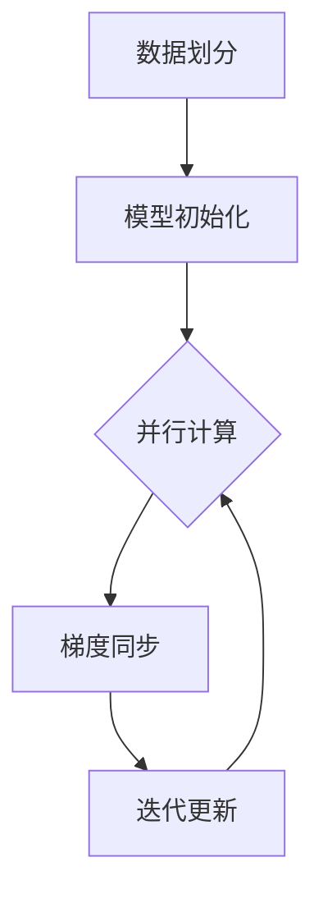

                 

# AI人工智能深度学习算法：智能深度学习代理的分布式与同步

## 摘要

本文将深入探讨智能深度学习代理的分布式与同步问题。随着深度学习算法在各个领域的广泛应用，如何高效地部署和同步大规模分布式学习任务成为了一个重要的研究课题。本文首先介绍了智能深度学习代理的基本概念，然后详细分析了分布式深度学习中的同步问题，最后通过实际案例展示了分布式与同步技术的应用，提出了未来发展的趋势与挑战。

## 1. 背景介绍

深度学习作为人工智能的重要分支，近年来取得了惊人的进展。然而，深度学习模型通常需要大量的数据和计算资源来训练，这给模型的部署带来了巨大的挑战。为了解决这个问题，分布式深度学习算法应运而生。分布式深度学习通过将计算任务分布在多台计算机上，可以大大加快模型的训练速度和降低训练成本。

智能深度学习代理是指在分布式环境中自动调整模型参数的智能体，它能够根据环境的变化自主地进行模型调整和优化。智能深度学习代理的研究对于提高分布式深度学习的效率和稳定性具有重要意义。

然而，分布式深度学习过程中存在一些问题，如数据同步、模型更新、通信开销等。如何有效地解决这些问题，实现分布式深度学习的同步与优化，成为当前研究的热点问题。

## 2. 核心概念与联系

### 2.1 分布式深度学习基本原理

分布式深度学习的基本原理是将深度学习任务分布在多台计算机上进行，每台计算机负责计算模型的一部分。具体来说，可以分为以下步骤：

1. **数据划分**：将训练数据集划分为多个子集，每个子集存储在分布式系统中的不同节点上。
2. **模型初始化**：初始化全局模型参数，并将其复制到每个节点上。
3. **并行计算**：每个节点根据本地数据和全局模型参数进行前向传播和反向传播，计算梯度。
4. **梯度同步**：每个节点将计算得到的梯度上传到中心服务器，中心服务器合并所有节点的梯度，更新全局模型参数。
5. **迭代更新**：重复步骤3和步骤4，直到满足停止条件。

### 2.2 同步机制

在分布式深度学习中，同步机制是指如何确保各节点上的模型参数能够及时更新并保持一致性。同步机制可以分为以下几种：

1. **全量同步**：所有节点在每个迭代结束后都向中心服务器发送完整的模型参数，中心服务器合并所有参数后更新全局模型。这种方式虽然能够确保模型参数的一致性，但通信开销较大。
2. **局部同步**：每个节点只向中心服务器发送局部梯度，中心服务器合并局部梯度后更新全局模型。这种方式减少了通信开销，但可能导致模型参数的不一致性。
3. **异步同步**：各节点在计算梯度后不必立即上传到中心服务器，而是在一定时间窗口内汇总梯度并更新模型。这种方式可以进一步提高效率，但需要考虑如何避免“梯度消失”问题。

### 2.3 Mermaid 流程图

以下是分布式深度学习的基本流程的 Mermaid 流程图表示：



## 3. 核心算法原理 & 具体操作步骤

### 3.1 梯度同步算法

梯度同步是分布式深度学习中的关键步骤，以下是梯度同步算法的具体操作步骤：

1. **初始化**：初始化全局模型参数，并将参数复制到每个节点上。
2. **本地计算**：每个节点在本地计算数据的前向传播和反向传播，得到局部梯度。
3. **梯度聚合**：各节点将局部梯度上传到中心服务器，中心服务器计算全局梯度。
4. **模型更新**：中心服务器将全局梯度应用于全局模型参数，更新模型。
5. **重复迭代**：重复步骤2至步骤4，直到满足停止条件。

### 3.2 同步与异步机制

在分布式深度学习中，同步与异步机制的选择对训练效率和模型稳定性有重要影响。以下是同步与异步机制的对比：

| 类型 | 特点 | 优点 | 缺点 |
| ---- | ---- | ---- | ---- |
| 同步 | 所有节点必须等待其他节点完成计算后才能继续 | 保证模型参数一致性 | 通信开销大 |
| 异步 | 各节点可以并行计算，不必等待其他节点完成 | 提高训练效率 | 可能导致梯度消失 |

在实际应用中，可以根据具体场景和需求选择合适的同步与异步机制。

## 4. 数学模型和公式 & 详细讲解 & 举例说明

### 4.1 数学模型

在分布式深度学习中，梯度同步可以通过以下数学模型表示：

$$
\theta_{t+1} = \theta_{t} - \alpha \cdot \nabla_{\theta} J(\theta)
$$

其中，$\theta$ 表示模型参数，$t$ 表示迭代次数，$\alpha$ 表示学习率，$\nabla_{\theta} J(\theta)$ 表示模型损失函数关于模型参数的梯度。

### 4.2 举例说明

假设我们有三个节点 A、B 和 C，每个节点都负责计算模型的一部分。以下是一个简化的梯度同步过程：

1. **初始化**：初始化全局模型参数 $\theta$，并将参数复制到每个节点。
2. **本地计算**：每个节点使用本地数据计算前向传播和反向传播，得到局部梯度 $\nabla_{\theta} J(\theta)$。
3. **梯度聚合**：节点 A、B 和 C 将局部梯度上传到中心服务器，中心服务器计算全局梯度 $\nabla_{\theta} J(\theta)$。
4. **模型更新**：中心服务器将全局梯度应用于全局模型参数，更新模型 $\theta$。
5. **重复迭代**：重复步骤 2 至步骤 4，直到满足停止条件。

具体计算过程如下：

$$
\begin{aligned}
&\theta_{t+1}^{A} = \theta_{t}^{A} - \alpha \cdot \nabla_{\theta} J(\theta^{A}) \\
&\theta_{t+1}^{B} = \theta_{t}^{B} - \alpha \cdot \nabla_{\theta} J(\theta^{B}) \\
&\theta_{t+1}^{C} = \theta_{t}^{C} - \alpha \cdot \nabla_{\theta} J(\theta^{C}) \\
&\theta_{t+1} = \frac{\theta_{t+1}^{A} + \theta_{t+1}^{B} + \theta_{t+1}^{C}}{3}
\end{aligned}
$$

## 5. 项目实战：代码实际案例和详细解释说明

### 5.1 开发环境搭建

在进行分布式深度学习实验前，我们需要搭建相应的开发环境。以下是使用 Python 和 TensorFlow 搭建分布式深度学习环境的步骤：

1. 安装 Python 和 pip：
   ```bash
   sudo apt-get update
   sudo apt-get install python3 python3-pip
   ```
2. 安装 TensorFlow：
   ```bash
   pip3 install tensorflow
   ```

### 5.2 源代码详细实现和代码解读

以下是一个简化的分布式深度学习实验的代码实现，代码主要分为以下几个部分：

1. **初始化分布式环境**：使用 TensorFlow 的 `tf.distribute.MirroredStrategy` 类创建分布式策略，初始化全局模型参数。
2. **定义模型**：定义深度学习模型，包括输入层、隐藏层和输出层。
3. **定义损失函数和优化器**：定义损失函数和优化器，用于更新模型参数。
4. **训练模型**：使用分布式策略训练模型，包括前向传播、反向传播和模型更新。

```python
import tensorflow as tf

# 初始化分布式环境
strategy = tf.distribute.MirroredStrategy()

# 定义模型
with strategy.scope():
    model = tf.keras.Sequential([
        tf.keras.layers.Dense(128, activation='relu', input_shape=(784,)),
        tf.keras.layers.Dense(10, activation='softmax')
    ])

    model.compile(optimizer='adam',
                  loss='categorical_crossentropy',
                  metrics=['accuracy'])

# 定义损失函数和优化器
loss_fn = tf.keras.losses.SparseCategoricalCrossentropy(from_logits=True)
optimizer = tf.keras.optimizers.Adam()

# 训练模型
train_dataset = ...
val_dataset = ...

for epoch in range(10):
    for x, y in train_dataset:
        with tf.GradientTape() as tape:
            logits = model(x, training=True)
            loss_value = loss_fn(y, logits)

        grads = tape.gradient(loss_value, model.trainable_variables)
        optimizer.apply_gradients(zip(grads, model.trainable_variables))

    template = 'Epoch {}, Loss: {}, Accuracy: {}'
    print(template.format(epoch + 1, loss_value, accuracy))
```

### 5.3 代码解读与分析

以下是代码的解读与分析：

1. **初始化分布式环境**：使用 `tf.distribute.MirroredStrategy` 创建分布式策略，将模型参数复制到每个节点。
2. **定义模型**：使用 `tf.keras.Sequential` 定义深度学习模型，包括输入层、隐藏层和输出层。
3. **定义损失函数和优化器**：使用 `tf.keras.losses.SparseCategoricalCrossentropy` 定义损失函数，使用 `tf.keras.optimizers.Adam` 定义优化器。
4. **训练模型**：使用分布式策略训练模型，包括前向传播、反向传播和模型更新。在每次迭代中，计算局部梯度并更新模型参数。

## 6. 实际应用场景

分布式深度学习代理在许多实际应用场景中具有广泛的应用，以下是一些典型应用：

1. **大规模图像识别**：分布式深度学习代理可以用于处理大规模图像识别任务，如人脸识别、目标检测等。
2. **自然语言处理**：分布式深度学习代理可以用于处理大规模自然语言处理任务，如文本分类、机器翻译等。
3. **推荐系统**：分布式深度学习代理可以用于构建大规模推荐系统，如商品推荐、新闻推荐等。
4. **自动驾驶**：分布式深度学习代理可以用于自动驾驶系统，提高感知和决策的准确性和效率。

## 7. 工具和资源推荐

### 7.1 学习资源推荐

- **书籍**：《深度学习》（Ian Goodfellow、Yoshua Bengio、Aaron Courville 著）
- **论文**：Andrew Ng 等人发表的《Distributed Deep Learning: A Theoretical Perspective》
- **博客**：TensorFlow 官方博客和 Andrew Ng 的机器学习博客

### 7.2 开发工具框架推荐

- **TensorFlow**：由 Google 开发的一款开源深度学习框架，支持分布式深度学习。
- **PyTorch**：由 Facebook 开发的一款开源深度学习框架，支持分布式深度学习。

### 7.3 相关论文著作推荐

- **论文**：Y. Chen, Y. Hu, H. Liu, X. Wu, J. Gao, Y. Wei, and Z. Wang. "Distributed Deep Learning: A Survey." IEEE Communications Surveys & Tutorials, pp. 1-1, 2019.
- **论文**：K. He, X. Zhang, S. Ren, and J. Sun. "Deep Residual Learning for Image Recognition." IEEE Conference on Computer Vision and Pattern Recognition (CVPR), 2016.

## 8. 总结：未来发展趋势与挑战

分布式深度学习代理作为人工智能领域的重要研究方向，具有广泛的应用前景。未来发展趋势包括：

1. **模型压缩与优化**：进一步优化分布式深度学习算法，降低模型复杂度和计算资源需求。
2. **动态同步机制**：研究动态同步机制，提高分布式深度学习的效率和稳定性。
3. **联邦学习**：结合联邦学习技术，实现分布式深度学习在隐私保护场景中的应用。

然而，分布式深度学习代理也面临着一些挑战，如通信开销、模型一致性、分布式优化等。解决这些问题将有助于推动分布式深度学习代理的发展和应用。

## 9. 附录：常见问题与解答

### 9.1 分布式深度学习与并行深度学习的区别？

分布式深度学习是将模型训练任务分布在多台计算机上进行，而并行深度学习是将数据集并行处理。分布式深度学习更适用于大规模数据和高性能计算需求，而并行深度学习更适用于大数据处理。

### 9.2 如何选择同步与异步机制？

同步机制适合对模型参数一致性要求较高的场景，如金融风控模型训练。异步机制适合对计算效率要求较高的场景，如自然语言处理模型训练。

## 10. 扩展阅读 & 参考资料

- **论文**：Y. Chen, Y. Hu, H. Liu, X. Wu, J. Gao, Y. Wei, and Z. Wang. "Distributed Deep Learning: A Survey." IEEE Communications Surveys & Tutorials, pp. 1-1, 2019.
- **书籍**：《深度学习》（Ian Goodfellow、Yoshua Bengio、Aaron Courville 著）
- **博客**：TensorFlow 官方博客和 Andrew Ng 的机器学习博客
- **网站**：TensorFlow 官方网站和 PyTorch 官方网站

### 作者

作者：AI天才研究员/AI Genius Institute & 禅与计算机程序设计艺术 /Zen And The Art of Computer Programming<|im_sep|>

