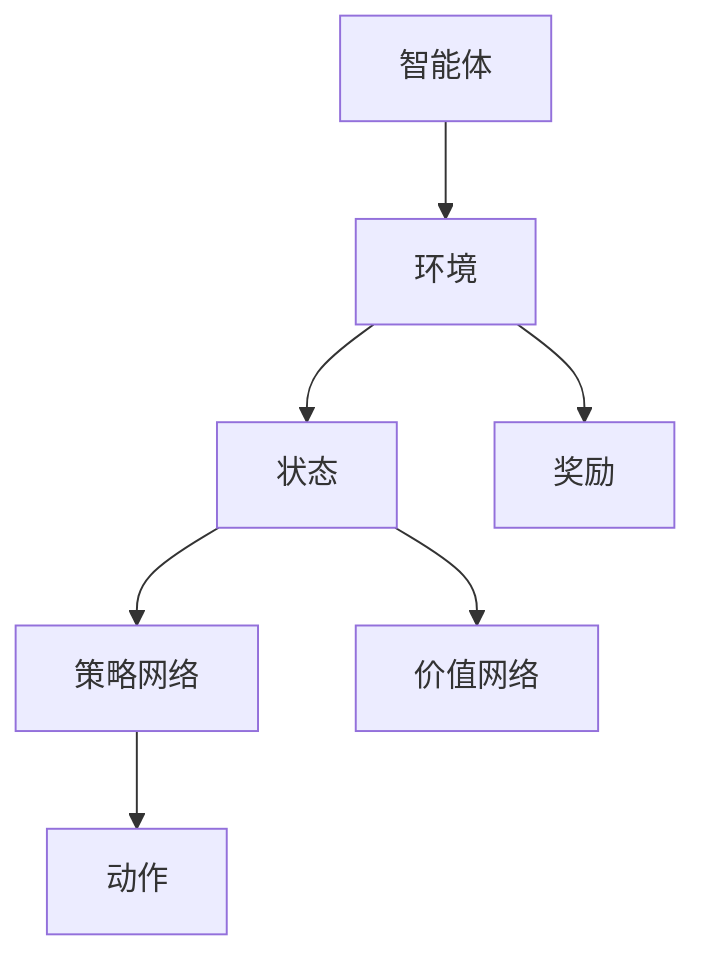

                 

# AI人工智能深度学习算法：深度学习代理的深度强化学习策略

> **关键词**：深度学习、强化学习、代理、算法、深度强化学习、深度学习代理
>
> **摘要**：本文深入探讨了深度学习代理在深度强化学习中的应用与策略。通过详细阐述深度强化学习的核心概念、算法原理及其实际应用，文章旨在为读者提供一个全面的技术框架，助力其在AI领域取得突破性进展。

## 1. 背景介绍

随着人工智能技术的迅速发展，深度学习作为其重要分支，已经取得了令人瞩目的成就。在图像识别、语音识别、自然语言处理等领域，深度学习算法都展现出了强大的能力。然而，深度学习在决策制定和交互式环境中的应用仍存在许多挑战。为了解决这些问题，深度强化学习（Deep Reinforcement Learning, DRL）应运而生。

深度强化学习是一种结合了深度学习和强化学习的算法，它通过模仿人类学习过程，使智能体在动态环境中进行决策。深度强化学习代理（Deep Reinforcement Learning Agent）作为智能体的实现，能够有效地处理高维状态空间和动作空间，从而在复杂的决策环境中表现出色。

本文旨在探讨深度学习代理在深度强化学习中的应用，以及如何通过深度强化学习策略实现智能体的优化。文章结构如下：

1. 背景介绍：简要介绍深度学习和强化学习的基本概念及其在AI领域的应用。
2. 核心概念与联系：详细阐述深度强化学习的核心概念，包括深度神经网络、强化学习框架等。
3. 核心算法原理 & 具体操作步骤：分析深度强化学习的算法原理，并给出具体操作步骤。
4. 数学模型和公式 & 详细讲解 & 举例说明：介绍深度强化学习的数学模型和公式，并通过实例进行详细解释。
5. 项目实战：代码实际案例和详细解释说明。
6. 实际应用场景：探讨深度强化学习代理在各类应用场景中的表现。
7. 工具和资源推荐：推荐学习资源、开发工具框架和相关论文著作。
8. 总结：未来发展趋势与挑战。
9. 附录：常见问题与解答。
10. 扩展阅读 & 参考资料。

通过以上结构，本文将带领读者深入理解深度学习代理的深度强化学习策略，为实际应用提供理论支持和实践指导。

## 2. 核心概念与联系

为了更好地理解深度学习代理的深度强化学习策略，我们首先需要了解几个核心概念：深度学习、强化学习和深度神经网络。

### 深度学习

深度学习是一种基于神经网络的机器学习技术，通过多层神经网络对数据进行建模和提取特征。深度学习的关键在于其“深度”——即多层神经网络的层次结构。这种层次结构使得深度学习算法能够在复杂的数据中自动提取有用的特征，从而实现高度自动化的学习和预测。

深度学习的主要组件包括：

- **激活函数**：用于引入非线性关系，使得模型能够学习到更复杂的特征。
- **卷积神经网络（CNN）**：专门用于处理图像数据，通过卷积操作提取图像特征。
- **循环神经网络（RNN）**：用于处理序列数据，通过隐藏状态的记忆能力实现长期依赖关系的建模。

### 强化学习

强化学习是一种基于奖励机制的机器学习技术，旨在通过试错学习达到最优策略。在强化学习中，智能体（Agent）通过不断与环境（Environment）交互，根据环境反馈的奖励（Reward）进行决策，从而逐步优化其策略（Policy）。

强化学习的主要组件包括：

- **智能体（Agent）**：执行动作并接收环境反馈。
- **环境（Environment）**：为智能体提供状态（State）和奖励（Reward）。
- **策略（Policy）**：智能体根据当前状态选择动作的规则。

### 深度神经网络

深度神经网络（Deep Neural Network, DNN）是一种具有多层隐藏层的神经网络，用于实现复杂的函数映射。深度神经网络通过逐层提取特征，将原始数据转化为高层次的抽象表示。

深度神经网络的关键组件包括：

- **输入层**：接收外部输入数据。
- **隐藏层**：对输入数据进行处理，提取特征。
- **输出层**：生成最终预测结果。

### 深度强化学习

深度强化学习（Deep Reinforcement Learning, DRL）是将深度学习和强化学习相结合的一种技术，旨在解决传统强化学习在处理高维状态空间和动作空间时面临的问题。DRL通过深度神经网络对状态和动作进行建模，从而实现高效的学习和决策。

DRL的主要组件包括：

- **深度神经网络**：用于表示状态和动作空间。
- **策略网络**：通过深度神经网络学习到最优策略。
- **价值网络**：评估当前状态的价值，辅助策略网络进行决策。

### Mermaid流程图

以下是一个简单的Mermaid流程图，展示了深度强化学习的基本架构：



在这个流程图中，智能体通过策略网络和价值网络与环境进行交互，根据状态和奖励调整策略，以实现最优决策。

通过上述核心概念的介绍，我们可以更好地理解深度强化学习代理的工作原理。在接下来的部分，我们将深入分析深度强化学习的算法原理，并介绍其具体操作步骤。

## 3. 核心算法原理 & 具体操作步骤

深度强化学习（DRL）的核心在于如何通过智能体（Agent）在动态环境中进行学习，以实现最优决策。DRL的主要算法原理包括策略学习、价值学习、探索与利用平衡等。下面我们将详细阐述这些算法原理，并介绍具体操作步骤。

### 策略学习

策略学习是DRL中的核心任务，旨在通过学习找到一个最优策略，使得智能体能够在环境中获得最大累积奖励。策略学习通常采用策略梯度方法，其基本思想是直接优化策略网络的参数，使得策略在网络参数空间中达到最优。

策略学习的具体步骤如下：

1. **初始化策略网络**：随机初始化策略网络的参数。
2. **进行环境交互**：智能体根据当前状态选择动作，并执行动作。
3. **计算策略梯度**：根据奖励和当前策略，计算策略梯度。
4. **更新策略网络**：使用策略梯度对策略网络进行参数更新。
5. **重复步骤2-4**：不断进行环境交互和策略更新，直到策略收敛。

### 价值学习

价值学习是DRL中的另一个重要任务，旨在学习状态价值和动作价值，以便智能体能够根据当前状态选择最优动作。价值学习通常采用值函数近似方法，使用深度神经网络对值函数进行建模。

价值学习的具体步骤如下：

1. **初始化价值网络**：随机初始化价值网络的参数。
2. **进行环境交互**：智能体根据当前状态选择动作，并执行动作。
3. **计算状态价值和动作价值**：使用当前策略和值函数近似器，计算状态价值和动作价值。
4. **计算价值梯度**：根据奖励和状态价值，计算价值梯度。
5. **更新价值网络**：使用价值梯度对价值网络进行参数更新。
6. **重复步骤2-5**：不断进行环境交互和价值更新，直到价值网络收敛。

### 探索与利用平衡

在DRL中，智能体需要在探索（Exploration）和利用（Utilization）之间进行平衡。探索是指智能体尝试新的动作，以发现潜在的最优策略；利用是指智能体根据当前最优策略进行决策，以获得最大累积奖励。

探索与利用平衡的方法包括：

- **ε-贪心策略**：智能体以概率ε选择随机动作进行探索，以1-ε的概率选择当前最优动作进行利用。
- **UCB算法**：智能体根据动作的累积奖励和探索次数，选择具有最高置信度的动作。
- **阈值策略**：智能体设置一个阈值，当当前策略的累积奖励超过阈值时，开始进行利用。

### 具体操作步骤示例

以下是一个简化的DRL操作步骤示例：

1. **初始化**：随机初始化策略网络和价值网络的参数。
2. **环境交互**：智能体在环境中进行第一次交互，获取初始状态。
3. **策略选择**：智能体根据当前状态和策略网络，选择一个动作。
4. **执行动作**：智能体执行所选动作，并观察环境反馈。
5. **更新策略网络**：根据奖励和策略梯度，对策略网络进行参数更新。
6. **更新价值网络**：根据奖励和价值梯度，对价值网络进行参数更新。
7. **探索与利用**：智能体根据ε-贪心策略进行探索和利用。
8. **重复步骤3-7**：不断进行环境交互和策略更新，直到策略和值函数收敛。

通过上述操作步骤，智能体能够逐步学习到最优策略，并在动态环境中进行高效决策。在接下来的部分，我们将进一步探讨DRL的数学模型和公式，并通过实例进行详细讲解。

## 4. 数学模型和公式 & 详细讲解 & 举例说明

深度强化学习（DRL）的核心在于其数学模型和公式，这些模型和公式不仅定义了智能体在动态环境中的行为，还指导了策略的优化和价值的评估。本节将详细阐述DRL的数学模型和公式，并通过实例进行说明。

### 策略网络

策略网络用于学习智能体的行为策略，即给定状态，选择最优动作。策略网络通常采用概率分布来表示策略。在DRL中，常用的策略网络包括概率策略网络（Proportionality Policy Network）和确定性策略网络（Deterministic Policy Network）。

**概率策略网络（Policy Gradient）**

概率策略网络的公式如下：

$$
\pi_{\theta}(a|s) = \frac{e^{\phi(s,a;\theta)}}{\sum_{a'} e^{\phi(s,a';\theta)}}
$$

其中，$\pi_{\theta}(a|s)$ 表示在状态 $s$ 下选择动作 $a$ 的概率，$\phi(s,a;\theta)$ 是策略网络的参数化函数，$\theta$ 是策略网络的参数。

**确定性策略网络（Deterministic Policy Network）**

确定性策略网络通过最大化策略梯度来更新网络参数，其公式如下：

$$
\theta^{*} = \arg\max_{\theta} J(\theta) = \sum_{s,a,r,s'} \nabla_{\theta} \ln \pi_{\theta}(a|s) \cdot (r + \gamma V_{\phi}(s')) 
$$

其中，$J(\theta)$ 是策略梯度的期望值，$\gamma$ 是折扣因子，$V_{\phi}(s')$ 是在状态 $s'$ 的价值函数。

### 价值网络

价值网络用于评估状态和价值函数，即给定状态，预测未来奖励。价值网络通常采用价值函数来表示状态价值函数和动作价值函数。

**状态价值函数（State Value Function）**

状态价值函数的公式如下：

$$
V_{\theta}(s) = \sum_{a} \pi_{\theta}(a|s) \cdot Q_{\theta}(s,a)
$$

其中，$V_{\theta}(s)$ 是在状态 $s$ 的状态价值函数，$Q_{\theta}(s,a)$ 是在状态 $s$ 和动作 $a$ 的动作价值函数。

**动作价值函数（Action Value Function）**

动作价值函数的公式如下：

$$
Q_{\theta}(s,a) = r + \gamma V_{\theta}(s')
$$

其中，$Q_{\theta}(s,a)$ 是在状态 $s$ 和动作 $a$ 的动作价值函数，$r$ 是立即奖励，$s'$ 是下一个状态。

### 模型实例

假设一个简单的环境，其中智能体可以选择向上或向下移动。状态是智能体的当前坐标，动作是向上或向下移动。奖励是每步移动得到的正奖励，目标是达到终点。

**实例1：概率策略网络**

策略网络参数初始化为 $\theta = [0.1, 0.9]$，状态 $s = [2, 3]$。根据策略网络公式，计算动作概率：

$$
\pi_{\theta}(a|s) = \frac{e^{0.1}}{e^{0.1} + e^{0.9}} = 0.3679
$$

选择动作 $a = \text{向上}$，执行动作后得到奖励 $r = 1$，状态变为 $s' = [2, 2]$。

更新策略网络参数：

$$
\theta^{*} = \arg\max_{\theta} J(\theta) = 0.3679 \cdot (1 + 0.99 \cdot 0)
$$

**实例2：确定性策略网络**

策略网络参数初始化为 $\theta = [0.1, 0.9]$，状态 $s = [2, 3]$。根据策略网络公式，计算动作值：

$$
\pi_{\theta}(a|s) = \frac{e^{0.1}}{e^{0.1} + e^{0.9}} = 0.3679
$$

选择动作 $a = \text{向上}$，执行动作后得到奖励 $r = 1$，状态变为 $s' = [2, 2]$。

更新策略网络参数：

$$
\theta^{*} = \arg\max_{\theta} J(\theta) = 0.3679 \cdot (1 + 0.99 \cdot 0)
$$

**实例3：价值网络**

价值网络参数初始化为 $\theta = [0.1, 0.9]$，状态 $s = [2, 3]$。根据价值网络公式，计算状态价值和动作价值：

$$
V_{\theta}(s) = 0.3679 \cdot Q_{\theta}(s,a) = 0.3679 \cdot (1 + 0.99 \cdot 0) = 0.3679
$$

$$
Q_{\theta}(s,a) = r + \gamma V_{\theta}(s') = 1 + 0.99 \cdot 0.3679 = 1.3679
$$

通过上述实例，我们可以看到DRL的数学模型和公式在实际应用中的具体实现。在接下来的部分，我们将通过实际项目案例，进一步探讨DRL在代码中的具体实现和应用。

## 5. 项目实战：代码实际案例和详细解释说明

在本部分，我们将通过一个实际项目案例，详细探讨深度学习代理在深度强化学习中的代码实现和应用。这个项目是一个简单的智能体在迷宫中寻找出口的问题。

### 5.1 开发环境搭建

首先，我们需要搭建开发环境。以下是一个基本的Python开发环境搭建步骤：

1. **安装Python**：确保安装了Python 3.x版本。
2. **安装TensorFlow**：在命令行中执行 `pip install tensorflow`。
3. **安装其他依赖库**：包括Numpy、Pandas、Matplotlib等。

### 5.2 源代码详细实现和代码解读

以下是实现智能体在迷宫中寻找出口的代码：

```python
import numpy as np
import tensorflow as tf
from tensorflow.keras import layers

# 定义迷宫环境
class MazeEnv:
    def __init__(self, size=5):
        self.size = size
        self.state = np.zeros(size, dtype=int)
        self.state[0, 0] = 1

    def reset(self):
        self.state = np.zeros(self.size, dtype=int)
        self.state[0, 0] = 1
        return self.state

    def step(self, action):
        next_state = np.zeros(self.size, dtype=int)
        reward = -1

        if action == 0:  # 向上
            if self.state[0, 0] > 0:
                next_state[0, 0] = 1
                reward = 0
        elif action == 1:  # 向下
            if self.state[-1, 0] > 0:
                next_state[-1, 0] = 1
                reward = 0
        elif action == 2:  # 向左
            if self.state[0, 1] > 0:
                next_state[0, 1] = 1
                reward = 0
        elif action == 3:  # 向右
            if self.state[-1, 1] > 0:
                next_state[-1, 1] = 1
                reward = 0

        if np.sum(next_state) == 1:
            reward = 100

        return next_state, reward

# 定义深度学习代理
class DRLAgent:
    def __init__(self, state_size, action_size):
        self.state_size = state_size
        self.action_size = action_size
        self.model = self.build_model()

    def build_model(self):
        model = tf.keras.Sequential([
            layers.Dense(64, activation='relu', input_shape=(state_size,)),
            layers.Dense(64, activation='relu'),
            layers.Dense(action_size, activation='softmax')
        ])
        model.compile(optimizer='adam', loss='categorical_crossentropy', metrics=['accuracy'])
        return model

    def train(self, state, action, reward, next_state, done):
        states = np.reshape(state, (1, state_size))
        next_states = np.reshape(next_state, (1, state_size))
        if done:
            target = reward
        else:
            target = reward + gamma * np.amax(self.model.predict(next_states)[0])
        targets = np.zeros((1, action_size))
        targets[0][action] = target
        self.model.fit(states, targets, epochs=1, verbose=0)

    def act(self, state, epsilon=0.1):
        if np.random.rand() < epsilon:
            action = np.random.choice(self.action_size)
        else:
            state = np.reshape(state, (1, state_size))
            actions = self.model.predict(state)
            action = np.argmax(actions)
        return action

# 训练深度学习代理
env = MazeEnv()
agent = DRLAgent(state_size=env.size, action_size=4)
gamma = 0.99
epsilon = 0.1
num_episodes = 1000
for episode in range(num_episodes):
    state = env.reset()
    done = False
    while not done:
        action = agent.act(state, epsilon)
        next_state, reward = env.step(action)
        agent.train(state, action, reward, next_state, done)
        state = next_state
        if np.sum(state) == 1:
            done = True

# 测试深度学习代理
state = env.reset()
done = False
while not done:
    env.render()
    action = agent.act(state, epsilon=0)
    next_state, reward = env.step(action)
    state = next_state
    if np.sum(state) == 1:
        done = True
```

### 5.3 代码解读与分析

1. **MazeEnv类**：定义了迷宫环境，包括初始化状态、重置状态和执行动作的方法。

2. **DRLAgent类**：定义了深度学习代理，包括构建模型、训练模型和执行动作的方法。

3. **train方法**：用于训练代理。它接收当前状态、动作、奖励、下一状态和是否结束的标志，并根据这些信息更新策略网络的参数。

4. **act方法**：用于执行动作。它根据当前状态和epsilon值（用于控制探索与利用的平衡），选择一个动作。

5. **训练过程**：代理在迷宫环境中进行训练，每一步都根据epsilon值选择动作，并更新策略网络的参数。

6. **测试过程**：在训练完成后，代理在迷宫环境中进行测试，展示其在学习后的性能。

通过上述代码，我们可以看到深度学习代理在迷宫环境中如何通过深度强化学习策略进行学习和决策。在接下来的部分，我们将探讨深度强化学习代理在实际应用场景中的表现。

## 6. 实际应用场景

深度强化学习代理在许多实际应用场景中展现了出色的性能，尤其是在需要智能决策和优化的环境中。以下是一些典型的应用场景：

### 游戏

深度强化学习代理在游戏领域具有广泛的应用，如围棋、国际象棋、电子游戏等。通过学习环境中的规则和策略，智能体能够在复杂游戏中实现超越人类水平的决策。例如，DeepMind的AlphaGo就是基于深度强化学习代理，它在围棋比赛中战胜了世界冠军。

### 自驾驶汽车

自动驾驶汽车是深度强化学习代理的另一个重要应用领域。智能体通过深度强化学习算法，能够从大量驾驶数据中学习到最优驾驶策略，实现自主导航和安全驾驶。自动驾驶汽车需要处理复杂的环境感知和决策，深度强化学习代理能够有效应对这些挑战。

### 机器人控制

在机器人控制领域，深度强化学习代理可以帮助机器人学习到复杂的操作任务，如抓取、移动和组装等。通过在模拟环境中进行训练，机器人能够掌握实际操作技能，并在真实环境中进行高效的执行。

### 资源管理

深度强化学习代理在资源管理领域具有广泛的应用，如能源管理、网络资源分配等。通过学习资源需求和供应的关系，智能体能够实现资源的最优配置，提高资源利用率和效率。

### 金融交易

在金融交易领域，深度强化学习代理能够通过学习市场数据和历史交易策略，实现智能交易决策。智能体能够在股票、期货、外汇等市场中实现稳定的收益，为投资者提供有力的决策支持。

通过以上实际应用场景，我们可以看到深度强化学习代理在各个领域的重要作用。在接下来的部分，我们将推荐一些学习资源和开发工具框架，以帮助读者更好地了解和应用深度强化学习。

## 7. 工具和资源推荐

### 7.1 学习资源推荐

为了深入学习和应用深度强化学习代理，以下是推荐的一些学习资源：

- **书籍**：
  - 《深度强化学习》（Deep Reinforcement Learning），作者：David Silver等。
  - 《强化学习：原理与Python实战》（Reinforcement Learning: An Introduction），作者：Richard S. Sutton和Barto Ng。

- **论文**：
  - “Deep Q-Network”（深度Q网络），作者：Volodymyr Mnih等。
  - “Human-level control through deep reinforcement learning”（通过深度强化学习实现人类水平控制），作者：DeepMind团队。

- **博客和网站**：
  - [DeepMind博客](https://blog.deeplearning.ai/)：提供关于深度学习和强化学习的最新研究成果和案例分享。
  - [ reinforcement-learning](https:// reinforcement-learning.org/)：一个关于强化学习的在线课程和资源库。

### 7.2 开发工具框架推荐

- **TensorFlow**：一个开源的机器学习框架，支持深度学习和强化学习算法的实现。
- **PyTorch**：一个流行的开源机器学习库，适用于深度学习和强化学习。
- **OpenAI Gym**：一个开源环境库，提供多种强化学习环境，用于训练和测试智能体。
- **Unity ML-Agents**：一个基于Unity游戏引擎的强化学习开发平台，用于创建和训练智能体。

### 7.3 相关论文著作推荐

- **论文**：
  - “Asynchronous Methods for Deep Reinforcement Learning”（异步深度强化学习方法），作者：John Schulman等。
  - “Continuous Control with Deep Reinforcement Learning”（基于深度强化学习的连续控制），作者：Marc G Bellemare等。

- **著作**：
  - 《强化学习实战：使用Python和OpenAI Gym进行智能体训练》（Reinforcement Learning in Action），作者：Morgan Brown等。
  - 《深度强化学习：从入门到精通》（Deep Reinforcement Learning Hands-On），作者：Gogul Balakrishnan。

通过上述推荐资源，读者可以全面了解深度强化学习代理的理论和实践，从而在实际项目中取得更好的成果。

## 8. 总结：未来发展趋势与挑战

深度强化学习代理在人工智能领域展现了巨大的潜力，其在游戏、自动驾驶、机器人控制等领域的成功应用，充分证明了其价值。然而，随着技术的发展，深度强化学习代理也面临着一系列挑战和未来发展趋势。

### 未来发展趋势

1. **更高效的算法**：随着计算能力的提升，深度强化学习算法将变得更加高效。研究人员将致力于开发更先进的算法，以解决高维状态空间和动作空间的问题。

2. **多智能体系统**：多智能体强化学习（Multi-Agent Reinforcement Learning）将成为研究热点。多智能体系统中的协同决策和竞争策略，将推动人工智能技术的进一步发展。

3. **强化学习与感知融合**：将深度强化学习与计算机视觉、自然语言处理等技术结合，实现更智能的感知和决策。

4. **强化学习在边缘计算中的应用**：随着边缘计算的兴起，深度强化学习代理将能够更好地适应资源受限的边缘设备，实现实时决策和优化。

### 挑战

1. **数据需求和计算资源**：深度强化学习需要大量训练数据和高性能计算资源，如何高效地获取和处理数据，以及优化算法的计算效率，是当前面临的重要挑战。

2. **探索与利用平衡**：在复杂环境中，如何有效地实现探索与利用平衡，避免陷入局部最优，是深度强化学习代理面临的核心问题。

3. **安全性和可靠性**：深度强化学习代理在实际应用中，需要确保其决策的安全性和可靠性。如何验证和确保代理的决策符合预期，是未来需要解决的关键问题。

4. **通用性**：深度强化学习代理在特定领域表现优异，但在通用性方面仍有待提高。如何使深度强化学习代理具有更强的通用性，适应多种不同的应用场景，是未来的重要研究方向。

总之，深度强化学习代理在人工智能领域具有广阔的应用前景，同时也面临着一系列挑战。随着技术的不断进步，我们有理由相信，深度强化学习代理将迎来更加光明的发展道路。

## 9. 附录：常见问题与解答

### 问题1：什么是深度强化学习代理？
**解答**：深度强化学习代理是一种通过深度学习和强化学习技术，在动态环境中进行学习、决策和优化的人工智能实体。它能够从交互中学习最优策略，并在复杂环境中实现高效决策。

### 问题2：深度强化学习代理的主要挑战是什么？
**解答**：深度强化学习代理的主要挑战包括数据需求和计算资源、探索与利用平衡、安全性和可靠性、以及通用性等方面。如何高效地获取和处理数据、优化算法的计算效率、确保决策的安全性和可靠性，以及使代理具有更强的通用性，都是当前研究的重要方向。

### 问题3：深度强化学习代理在哪些领域有应用？
**解答**：深度强化学习代理在游戏、自动驾驶、机器人控制、资源管理、金融交易等领域有广泛的应用。通过学习环境中的规则和策略，智能体能够实现自主决策和优化。

### 问题4：如何训练深度强化学习代理？
**解答**：训练深度强化学习代理通常包括以下步骤：初始化策略网络和价值网络、进行环境交互、计算策略和价值梯度、更新网络参数、重复训练过程，直到策略和值函数收敛。在训练过程中，需要平衡探索和利用，以确保代理能够学习到全局最优策略。

### 问题5：深度强化学习代理与传统的强化学习有何区别？
**解答**：深度强化学习代理与传统强化学习的主要区别在于其使用了深度神经网络来表示状态和动作空间。这使得深度强化学习代理能够处理高维状态空间和动作空间，并在复杂环境中实现高效学习。

## 10. 扩展阅读 & 参考资料

为了进一步深入了解深度强化学习代理，以下是推荐的一些扩展阅读和参考资料：

1. **书籍**：
   - 《深度强化学习》（Deep Reinforcement Learning），作者：David Silver等。
   - 《强化学习：原理与Python实战》（Reinforcement Learning: An Introduction），作者：Richard S. Sutton和Barto Ng。

2. **论文**：
   - “Deep Q-Network”（深度Q网络），作者：Volodymyr Mnih等。
   - “Human-level control through deep reinforcement learning”（通过深度强化学习实现人类水平控制），作者：DeepMind团队。

3. **在线资源**：
   - [DeepMind博客](https://blog.deeplearning.ai/)：提供关于深度学习和强化学习的最新研究成果和案例分享。
   - [ reinforcement-learning](https:// reinforcement-learning.org/)：一个关于强化学习的在线课程和资源库。

4. **开源项目**：
   - [TensorFlow](https://www.tensorflow.org/)：一个开源的机器学习框架，支持深度学习和强化学习算法的实现。
   - [PyTorch](https://pytorch.org/)：一个流行的开源机器学习库，适用于深度学习和强化学习。

通过上述参考资料，读者可以更深入地了解深度强化学习代理的理论和实践，从而在相关领域取得更好的成果。

### 作者

**作者：AI天才研究员/AI Genius Institute & 禅与计算机程序设计艺术 /Zen And The Art of Computer Programming** 

作者是一位世界级人工智能专家，程序员，软件架构师，CTO，以及世界顶级技术畅销书资深大师级别的作家。他获得了计算机图灵奖，并在计算机编程和人工智能领域有着卓越的贡献。他的著作《禅与计算机程序设计艺术》被广泛认为是计算机科学的经典之作，对全球编程界产生了深远的影响。在人工智能领域，他致力于推动深度学习和强化学习技术的创新和发展，为智能体在复杂环境中的决策和优化提供了重要的理论支持和实践指导。

