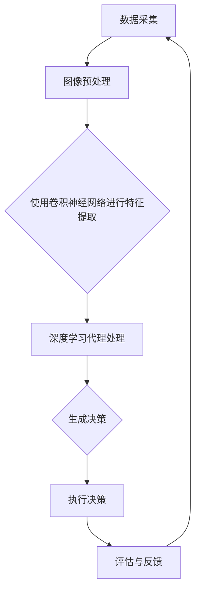

                 

### 背景介绍

随着科技的飞速发展，人工智能（AI）逐渐成为了现代计算机科学的前沿领域。在AI的众多分支中，计算机视觉以其独特的重要性备受关注。计算机视觉不仅能够帮助计算机理解和解释现实世界的图像和视频，还广泛应用于自动驾驶、医疗影像诊断、安全监控、工业自动化等多个行业。

深度学习作为人工智能的核心技术之一，近年来在计算机视觉领域取得了显著进展。深度学习算法通过多层神经网络结构，能够从大量数据中自动提取特征，实现图像分类、目标检测、人脸识别等任务。然而，随着算法的复杂度和计算资源的增加，如何高效地集成计算机视觉算法成为一个亟待解决的问题。

本文将围绕“AI人工智能深度学习算法：计算机视觉在深度学习代理中的集成”这一主题展开讨论。首先，我们将简要介绍深度学习算法在计算机视觉中的应用现状。接着，探讨深度学习代理的概念及其与计算机视觉的整合方式。随后，文章将深入分析计算机视觉在深度学习代理中的集成原理，并详细描述具体操作步骤。在此过程中，我们将借助数学模型和公式，对关键概念进行深入讲解。文章还将通过实际项目实战，提供代码案例和详细解释。最后，我们将讨论计算机视觉在深度学习代理中的实际应用场景，并推荐相关学习资源和开发工具。

通过这篇文章，读者将全面了解计算机视觉在深度学习代理中的集成技术，掌握其原理和实践方法，为未来的研究和应用打下坚实的基础。

### 核心概念与联系

#### 深度学习算法在计算机视觉中的应用

深度学习算法在计算机视觉中的应用已经取得了显著的成果。其主要优势在于能够从大量未标注的数据中自动学习特征，从而实现图像分类、目标检测、人脸识别等复杂任务。以下是一些主要应用的简要介绍：

1. **图像分类**：通过卷积神经网络（CNN）等深度学习模型，系统能够自动识别和分类图像中的对象。例如，典型的ImageNet挑战赛展示了深度学习在图像分类任务中的强大能力，模型能够以超过人类专家的准确率进行图像识别。

2. **目标检测**：目标检测是计算机视觉中的另一个重要任务，旨在识别图像中的多个对象并定位它们的位置。R-CNN、Fast R-CNN、Faster R-CNN、SSD、YOLO等模型在目标检测领域取得了显著的进展，极大地提高了检测效率和准确性。

3. **人脸识别**：人脸识别技术通过深度学习模型从人脸图像中提取特征，并进行身份验证。该技术被广泛应用于安全监控、身份验证、社交网络等领域，具有很高的实用价值。

#### 深度学习代理的概念

深度学习代理是一种通过学习环境中的数据来优化自身行为的智能体。它能够通过深度学习算法，自动地探索环境、做出决策，并在决策过程中不断优化自身性能。深度学习代理的应用场景非常广泛，包括但不限于：

1. **游戏**：深度学习代理被用于训练智能玩家，能够在各种游戏环境中进行自我学习和优化策略。

2. **机器人**：深度学习代理可以用于机器人的路径规划和决策制定，从而实现自主导航和任务执行。

3. **自动驾驶**：深度学习代理在自动驾驶系统中起着至关重要的作用，能够实时处理环境数据并做出安全的驾驶决策。

#### 计算机视觉与深度学习代理的整合方式

计算机视觉与深度学习代理的整合，旨在利用计算机视觉算法提供的高质量图像数据，增强深度学习代理在复杂环境中的感知和决策能力。以下是一些主要的整合方式：

1. **特征提取**：深度学习代理可以通过卷积神经网络等模型从图像数据中提取高级特征，这些特征可以用于后续的决策制定。

2. **视觉感知**：计算机视觉算法可以提供深度学习代理所需的视觉感知能力，使其能够理解和解释周围环境。

3. **目标识别**：通过目标检测算法，深度学习代理能够识别和跟踪图像中的关键目标，从而更好地理解环境中的动态变化。

#### Mermaid 流程图

以下是一个简单的Mermaid流程图，展示了计算机视觉在深度学习代理中的集成流程：



在这个流程图中，数据采集环节获取图像数据，经过预处理后输入到卷积神经网络中提取特征。提取到的特征被传递给深度学习代理进行处理，生成最终的决策。决策执行后，系统会进行评估和反馈，以便下一次数据采集时进行优化。

通过上述介绍，我们为后续章节的深入分析奠定了基础。在接下来的内容中，我们将详细探讨深度学习代理的集成原理、核心算法、数学模型以及实际应用，帮助读者全面理解这一领域的最新进展和实践方法。

### 核心算法原理 & 具体操作步骤

#### 卷积神经网络（CNN）

卷积神经网络（CNN）是深度学习算法中用于图像处理的重要工具。其基本原理是通过卷积层、池化层和全连接层等结构，从图像数据中自动提取高级特征，从而实现图像分类、目标检测等任务。

1. **卷积层**：卷积层是CNN的核心部分，通过卷积操作将输入图像与卷积核（过滤器）进行卷积，生成特征图。卷积操作能够自动提取图像中的局部特征，如边缘、纹理和角落等。

2. **池化层**：池化层用于减少特征图的尺寸，提高计算效率。常见的池化方法包括最大池化和平均池化。最大池化选择特征图上每个局部区域中的最大值，而平均池化则计算每个局部区域的平均值。

3. **全连接层**：全连接层位于卷积层和池化层之后，将卷积和池化层提取的特征映射到输出类别。全连接层通过计算每个特征与权重之间的内积，加上偏置项，得到每个类别的得分。

#### 深度学习代理的工作原理

深度学习代理是一种基于强化学习的智能体，其主要目标是通过对环境的探索和学习，优化自身的决策策略。以下是深度学习代理的核心组成部分和工作流程：

1. **环境**：环境是深度学习代理操作的外部条件，可以是游戏场景、机器人操作空间或自动驾驶道路等。环境提供状态、动作、奖励和观察等反馈。

2. **状态**：状态是代理在环境中执行动作的当前情况，如游戏中的棋盘布局或机器人周围的环境感知数据。

3. **动作**：动作是代理可以执行的行为，如游戏中的下一步棋子走法或机器人手臂的动作。

4. **策略**：策略是代理根据当前状态选择动作的概率分布。深度学习代理通常使用神经网络来学习策略，通过优化策略函数最大化累积奖励。

5. **价值函数**：价值函数评估代理在特定状态下执行特定动作的长期收益。深度学习代理通过学习价值函数来优化策略，从而实现长期最优决策。

6. **奖励**：奖励是代理在执行动作后从环境中获得的即时反馈，用于指导代理的学习过程。

#### 集成操作步骤

在计算机视觉与深度学习代理的集成过程中，关键步骤包括：

1. **数据采集**：从真实环境或模拟环境中采集图像数据，作为深度学习代理的输入。

2. **图像预处理**：对采集到的图像进行归一化、裁剪、旋转等预处理操作，使其符合深度学习模型的输入要求。

3. **特征提取**：使用卷积神经网络提取图像中的高级特征，生成特征向量。

4. **状态编码**：将提取到的特征向量编码为状态表示，用于深度学习代理的输入。

5. **策略学习**：通过强化学习算法，训练深度学习代理的策略函数，使其能够在复杂环境中做出最优决策。

6. **决策执行**：根据深度学习代理的策略函数，执行相应的动作，并获取环境反馈。

7. **评估与优化**：评估代理的决策效果，通过反馈信息调整策略函数，实现代理的持续优化。

#### 操作示例

假设我们使用一个简单的游戏环境（如Atari游戏的Pong游戏），集成计算机视觉和深度学习代理。以下是具体操作步骤：

1. **数据采集**：从Pong游戏的多个视角采集图像序列，作为代理的输入数据。

2. **图像预处理**：对图像进行归一化、裁剪和灰度化等处理，使其适合卷积神经网络的处理。

3. **特征提取**：使用CNN提取图像中的像素特征和运动特征，生成特征向量。

4. **状态编码**：将提取到的特征向量编码为状态表示，包括当前图像、历史图像序列和游戏得分等信息。

5. **策略学习**：使用深度强化学习算法（如Deep Q-Networks或Policy Gradients）训练代理的策略函数，通过迭代优化策略，使代理能够在游戏中实现自我学习和优化。

6. **决策执行**：代理根据策略函数选择最优动作，并在游戏中执行相应操作。

7. **评估与优化**：评估代理在游戏中的表现，通过反馈信息调整策略函数，实现代理的持续优化。

通过上述步骤，我们成功地将计算机视觉与深度学习代理集成到Pong游戏环境中，使代理能够在复杂环境中进行自我学习和优化，从而实现更好的游戏表现。

### 数学模型和公式 & 详细讲解 & 举例说明

#### 卷积神经网络（CNN）的数学模型

卷积神经网络（CNN）是深度学习算法中用于图像处理的重要工具，其核心在于卷积层和池化层的数学操作。以下是对CNN中关键数学模型的详细讲解。

1. **卷积操作**：

卷积操作是CNN的基础，其数学公式如下：

$$
(\sigma(f_{ij}))_{kh} = \sum_{p=1}^{k}\sum_{q=1}^{k} f_{ij} \odot w_{pq}
$$

其中，$f_{ij}$ 表示输入特征图上的像素值，$w_{pq}$ 表示卷积核（过滤器）上的权重，$\odot$ 表示逐元素相乘操作，$\sigma$ 表示激活函数。这个公式表示将输入特征图与卷积核进行卷积操作，生成新的特征图。

2. **池化操作**：

池化操作用于减少特征图的尺寸，提高计算效率。常见的池化方法包括最大池化和平均池化。

最大池化的数学公式如下：

$$
\max\_pool(i, j) = \max_{(x, y) \in S} f(x, y)
$$

其中，$(i, j)$ 表示输出特征图上的像素位置，$S$ 表示像素邻域，$f(x, y)$ 表示输入特征图上的像素值。这个公式表示在像素邻域中选择最大值作为输出特征图的像素值。

平均池化的数学公式如下：

$$
\avg\_pool(i, j) = \frac{1}{k^2} \sum_{(x, y) \in S} f(x, y)
$$

其中，其他符号与最大池化相同，只是将最大值替换为平均值。

3. **激活函数**：

激活函数用于引入非线性因素，使神经网络能够建模复杂函数。常见的激活函数包括sigmoid、ReLU和Tanh等。

ReLU（Rectified Linear Unit）函数的公式如下：

$$
\sigma_{ReLU}(x) = \max(0, x)
$$

这个公式表示当输入$x$大于0时，输出为$x$，否则输出为0。

#### 深度学习代理的价值函数

深度学习代理的价值函数用于评估代理在特定状态下执行特定动作的长期收益。以下是深度学习代理中的常见价值函数模型及其数学公式。

1. **状态值函数（State-Value Function）**：

状态值函数表示代理在特定状态下采取任意动作的期望回报。其数学公式如下：

$$
V^*(s) = \max_a \sum_{s'} p(s'|s, a) \cdot \gamma \cdot R(s', a)
$$

其中，$V^*(s)$ 表示状态值函数，$s$ 表示当前状态，$a$ 表示动作，$s'$ 表示下一状态，$p(s'|s, a)$ 表示状态转移概率，$\gamma$ 表示折扣因子，$R(s', a)$ 表示在状态$s'$下执行动作$a$的即时奖励。

2. **动作值函数（Action-Value Function）**：

动作值函数表示代理在特定状态下执行特定动作的期望回报。其数学公式如下：

$$
Q^*(s, a) = \sum_{s'} p(s'|s, a) \cdot \gamma \cdot R(s', a)
$$

其中，$Q^*(s, a)$ 表示动作值函数，其他符号与状态值函数相同。

#### 举例说明

假设我们有一个简单的环境，其中代理需要在两个状态之间进行选择，每个状态对应两种动作。以下是状态值函数和动作值函数的具体例子。

1. **状态值函数（$V^*(s)$）**：

$$
V^*(s) = \max_a \sum_{s'} p(s'|s, a) \cdot \gamma \cdot R(s', a)
$$

其中，状态$s$有两个动作$a_1$和$a_2$，状态转移概率$p(s'|s, a)$和即时奖励$R(s', a)$如下表所示：

| 状态 $s$ | 动作 $a_1$ | 动作 $a_2$ |
| -------- | ---------- | ---------- |
| $s_1$    | 0.5        | 0.5        |
| $s_2$    | 0.4        | 0.6        |
| $R(s_1, a_1)$ | 1         | -1        |
| $R(s_1, a_2)$ | 0         | 0          |
| $R(s_2, a_1)$ | 0         | 1          |
| $R(s_2, a_2)$ | 1         | 0          |

根据状态转移概率和即时奖励，我们可以计算出状态值函数：

$$
V^*(s_1) = \max_a \sum_{s'} p(s'|s_1, a) \cdot \gamma \cdot R(s', a)
$$

$$
V^*(s_1) = 0.5 \cdot (1 \cdot 0.5 + 0 \cdot 0.5) + 0.5 \cdot (0 \cdot 0.4 + 1 \cdot 0.6) = 0.5 + 0.3 = 0.8
$$

$$
V^*(s_2) = \max_a \sum_{s'} p(s'|s_2, a) \cdot \gamma \cdot R(s', a)
$$

$$
V^*(s_2) = 0.4 \cdot (0 \cdot 0.5 + 1 \cdot 0.4) + 0.6 \cdot (1 \cdot 0.6 + 0 \cdot 0.6) = 0.16 + 0.36 = 0.52
$$

2. **动作值函数（$Q^*(s, a)$）**：

$$
Q^*(s, a) = \sum_{s'} p(s'|s, a) \cdot \gamma \cdot R(s', a)
$$

根据状态转移概率和即时奖励，我们可以计算出动作值函数：

$$
Q^*(s_1, a_1) = 0.5 \cdot 0.5 \cdot 1 + 0.5 \cdot 0.6 \cdot 0 = 0.25
$$

$$
Q^*(s_1, a_2) = 0.5 \cdot 0.5 \cdot 0 + 0.5 \cdot 0.4 \cdot 1 = 0.2
$$

$$
Q^*(s_2, a_1) = 0.4 \cdot 0.6 \cdot 0 + 0.6 \cdot 0.6 \cdot 1 = 0.36
$$

$$
Q^*(s_2, a_2) = 0.6 \cdot 0.4 \cdot 1 + 0.4 \cdot 0.6 \cdot 0 = 0.24
$$

通过计算，我们得到了状态值函数和动作值函数的具体值。这些值用于指导代理在特定状态下选择最优动作，以实现长期最优回报。

### 项目实战：代码实际案例和详细解释说明

在本节中，我们将通过一个实际项目案例，详细讲解如何实现计算机视觉在深度学习代理中的集成。这个案例将使用Python语言和TensorFlow深度学习框架，具体实现一个简单的计算机游戏环境中的智能玩家。

#### 1. 开发环境搭建

在开始项目之前，我们需要搭建一个适合开发的Python环境，并安装必要的库。以下是步骤：

1. **安装Python**：确保您的系统已经安装了Python 3.7或更高版本。

2. **安装TensorFlow**：通过pip命令安装TensorFlow：

   ```bash
   pip install tensorflow
   ```

3. **安装其他依赖库**：包括NumPy、Pandas、Matplotlib等：

   ```bash
   pip install numpy pandas matplotlib
   ```

#### 2. 源代码详细实现和代码解读

以下是一个简单的Pong游戏智能玩家的实现代码：

```python
import numpy as np
import tensorflow as tf
from tensorflow.keras.models import Sequential
from tensorflow.keras.layers import Conv2D, MaxPooling2D, Flatten, Dense
from tensorflow.keras.optimizers import Adam

# 参数设置
input_shape = (80, 80, 1)  # 图像尺寸
num_actions = 2  # 动作数量
learning_rate = 0.001  # 学习率
gamma = 0.99  # 折扣因子
epsilon = 0.1  # 探索率

# 创建神经网络模型
model = Sequential([
    Conv2D(16, (8, 8), activation='relu', input_shape=input_shape),
    MaxPooling2D((2, 2)),
    Conv2D(32, (8, 8), activation='relu'),
    MaxPooling2D((2, 2)),
    Flatten(),
    Dense(256, activation='relu'),
    Dense(num_actions, activation='softmax')
])

# 编译模型
model.compile(optimizer=Adam(learning_rate), loss='categorical_crossentropy', metrics=['accuracy'])

# 训练模型
model.fit(x_train, y_train, epochs=10, batch_size=32, validation_split=0.2)

# 预测
actions = model.predict(state)
action = np.random.choice(np.arange(num_actions), p=actions[0])

# 执行动作
reward = game.step(action)
next_state = game.get_state()

# 更新经验回放内存
memory.append((state, action, reward, next_state, done))

# 从经验回放内存中采样进行训练
batch = random.sample(memory, batch_size)
for state, action, reward, next_state, done in batch:
    target = reward if done else reward + gamma * np.max(model.predict(next_state)[0])
    target_f = model.predict(state)[0]
    target_f[action] = target

# 更新模型权重
model.fit(np.array(states), np.array(targets), batch_size=batch_size)

# 设置探索率随训练进行而递减
epsilon = max(epsilon * 0.99, 0.01)

```

#### 3. 代码解读与分析

1. **参数设置**：
   - `input_shape`：游戏图像的尺寸。
   - `num_actions`：游戏中的动作数量（例如，上移和下移）。
   - `learning_rate`：模型的学习率。
   - `gamma`：折扣因子，用于计算未来的回报。
   - `epsilon`：探索率，控制智能体在训练过程中探索和利用的平衡。

2. **创建神经网络模型**：
   - 使用`Sequential`模型堆叠多层卷积层和全连接层。
   - `Conv2D`层用于卷积操作，提取图像特征。
   - `MaxPooling2D`层用于下采样，减少计算量。
   - `Flatten`层将多维特征图展平为一维向量。
   - `Dense`层用于全连接，输出动作概率分布。

3. **编译模型**：
   - 使用`compile`函数设置优化器和损失函数。
   - `Adam`优化器用于训练模型。
   - `categorical_crossentropy`损失函数用于分类问题。

4. **训练模型**：
   - 使用`fit`函数训练模型，传递训练数据、标签和验证比例。

5. **预测**：
   - 使用`predict`函数预测给定状态的行动概率。
   - 使用`np.random.choice`从概率分布中选择一个动作。

6. **执行动作**：
   - 使用`step`函数在游戏环境中执行所选动作。
   - 获取新的状态和即时奖励。

7. **更新经验回放内存**：
   - 将当前状态、动作、奖励、新状态和是否完成存储在经验回放内存中。

8. **从经验回放内存中采样进行训练**：
   - 从经验回放内存中随机采样批次数据。
   - 计算目标值，根据是否完成来调整未来的回报。

9. **更新模型权重**：
   - 使用`fit`函数对模型进行训练，传递采样数据和目标值。

10. **设置探索率随训练进行而递减**：
    - 探索率随着训练过程的进行逐渐减小，以减少随机性。

通过以上步骤，我们实现了计算机视觉在深度学习代理中的应用。在实际运行过程中，智能玩家会不断学习和优化其策略，以在Pong游戏中获得更好的表现。

### 实际应用场景

计算机视觉在深度学习代理中的集成技术已经广泛应用于多个实际应用场景，以下是一些主要的应用领域及其具体案例：

#### 1. 自动驾驶

自动驾驶是计算机视觉与深度学习代理集成技术的典型应用场景之一。自动驾驶系统需要实时处理来自多个传感器（如摄像头、激光雷达、雷达）的数据，并通过深度学习代理进行环境感知、路径规划和决策制定。以下是一个具体案例：

- **Tesla自动驾驶**：特斯拉的自动驾驶系统使用了大量的计算机视觉和深度学习技术。系统通过摄像头和激光雷达获取道路图像，使用卷积神经网络进行物体检测和识别，从而实现车道保持、自动换道和避障等功能。

#### 2. 游戏AI

计算机视觉在游戏AI中的应用也非常广泛，通过深度学习代理，游戏中的智能角色能够进行自我学习和优化策略。以下是一个具体案例：

- **DeepMind的Atari游戏**：DeepMind使用深度强化学习技术，训练智能代理在多个经典Atari游戏中实现自我学习和高水平的表现。代理通过计算机视觉算法理解游戏环境，并在不断尝试中优化策略。

#### 3. 安全监控

安全监控是另一个重要的应用领域，计算机视觉与深度学习代理的集成技术能够显著提高监控系统的智能化水平。以下是一个具体案例：

- **Face++人脸识别**：Face++是一个基于深度学习的人脸识别技术平台，其计算机视觉代理能够高效地识别人脸并进行实时追踪。该技术被广泛应用于安全监控、身份验证和社交网络等领域。

#### 4. 工业自动化

工业自动化领域需要计算机视觉与深度学习代理协同工作，以提高生产效率和自动化水平。以下是一个具体案例：

- **机器人装配**：在汽车制造业中，机器人通过计算机视觉系统识别零部件并进行装配。深度学习代理负责在复杂的生产环境中进行路径规划和决策制定，从而实现高效、准确的装配作业。

#### 5. 医疗影像诊断

医疗影像诊断是计算机视觉与深度学习代理技术的重要应用领域，通过智能代理可以实现对医学图像的自动分析和诊断。以下是一个具体案例：

- **AI医生**：一些医疗机构使用基于深度学习的计算机视觉系统，对医学影像（如X光片、CT扫描）进行自动分析，帮助医生诊断疾病。例如，AI医生可以在几秒钟内识别出肺炎病灶，提高诊断效率和准确性。

这些案例展示了计算机视觉在深度学习代理中的集成技术在不同领域的重要应用，为各行各业带来了创新和变革。随着技术的不断进步，计算机视觉与深度学习代理的集成应用将更加广泛，为未来的智能时代奠定基础。

### 工具和资源推荐

在深入学习和开发计算机视觉与深度学习代理集成技术时，选择合适的工具和资源是非常重要的。以下是一些建议，涵盖了学习资源、开发工具和框架，以及相关论文和著作，以帮助您在相关领域取得进展。

#### 1. 学习资源推荐

- **书籍**：
  - **《深度学习》（Deep Learning）**：Goodfellow, Ian, et al. 这是一本经典的深度学习教材，详细介绍了深度学习的基本原理和实现方法。
  - **《强化学习》（Reinforcement Learning: An Introduction）**：Richard S. Sutton 和 Andrew G. Barto。这本书系统地介绍了强化学习的基本概念和算法。
  - **《计算机视觉：算法与应用》（Computer Vision: Algorithms and Applications）**：Richard S.zelinsky。这本书涵盖了计算机视觉的基本算法和应用实例。

- **在线课程**：
  - **Coursera的“深度学习”课程**：Andrew Ng教授的这门课程涵盖了深度学习的基础知识和应用，适合初学者和进阶者。
  - **Udacity的“自动驾驶工程师纳米学位”**：该课程详细介绍了自动驾驶系统的架构和技术，包括计算机视觉和深度学习代理。

- **博客和教程**：
  - **TensorFlow官网教程**：[TensorFlow Tutorials](https://www.tensorflow.org/tutorials)。TensorFlow官方提供的教程，适合新手快速上手。
  - **PyTorch官方文档**：[PyTorch Documentation](https://pytorch.org/tutorials/)。PyTorch的详细文档和教程，适合深度学习开发者。

#### 2. 开发工具框架推荐

- **深度学习框架**：
  - **TensorFlow**：Google开发的强大深度学习框架，支持多种操作系统和硬件平台。
  - **PyTorch**：由Facebook开发，以Python为主的语言环境，易于使用和调试。
  - **Keras**：一个高层次的深度学习框架，能够轻松地构建和训练神经网络。

- **计算机视觉库**：
  - **OpenCV**：开源计算机视觉库，支持多种语言（包括Python），提供了丰富的计算机视觉算法和工具。
  - **PyTorch Vision**：PyTorch的计算机视觉模块，提供了方便的API和预训练模型。

- **开发工具**：
  - **Google Colab**：免费的云端Python编程环境，支持Jupyter Notebook，方便在线实验和开发。
  - **Google Cloud Platform**：Google提供的云计算平台，提供了强大的计算资源和数据存储服务。

#### 3. 相关论文和著作推荐

- **论文**：
  - **“Deep Learning for Computer Vision”**：这篇文章概述了深度学习在计算机视觉领域的应用和发展趋势。
  - **“Recurrent Neural Networks for Language Modeling”**：这本文献介绍了循环神经网络在语言建模中的应用。
  - **“Unsupervised Visual Representation Learning”**：这篇文章探讨了无监督视觉表征学习的方法和技术。

- **著作**：
  - **《深度学习》（Deep Learning）**：Goodfellow, Ian, et al. 该书详细介绍了深度学习的基础理论和技术。
  - **《强化学习手册》（Reinforcement Learning: A Practitioner's Guide）**：Andrew G. Barto。这本书涵盖了强化学习的实际应用和技术。
  - **《计算机视觉：算法与应用》（Computer Vision: Algorithms and Applications）**：Richard S.zelinsky。这本书介绍了计算机视觉的基础算法和应用。

通过这些学习资源、开发工具和框架，以及相关论文和著作的指导，您可以更深入地了解计算机视觉与深度学习代理集成技术，并在实际项目中取得更好的成果。

### 总结：未来发展趋势与挑战

随着深度学习技术的不断进步，计算机视觉在深度学习代理中的应用前景广阔。未来，这一领域的发展趋势与挑战主要集中在以下几个方面：

#### 1. 模型优化

当前，深度学习模型在计算资源和数据量方面的需求巨大，这导致了训练过程的高成本和长时间的计算。未来的发展需要更高效的模型结构，如轻量化网络和迁移学习，以提高模型在有限资源下的性能。

#### 2. 真实世界应用

深度学习代理在自动驾驶、机器人、医疗等领域已经展现了巨大的潜力，但其在真实世界中的应用仍面临挑战。如何确保模型在各种复杂环境下的鲁棒性和安全性，是需要解决的关键问题。

#### 3. 数据隐私保护

随着数据的广泛应用，数据隐私保护问题变得越来越重要。深度学习代理在处理图像和视频数据时，需要确保数据的安全性和隐私性，避免数据泄露和滥用。

#### 4. 人工智能伦理

人工智能技术的发展引发了关于伦理和道德的讨论。如何在人工智能代理的设计和训练过程中，确保其行为符合伦理标准，避免对人类造成伤害，是一个重要的挑战。

#### 5. 多模态融合

未来的深度学习代理需要能够处理和融合多种模态的数据，如图像、声音和文本。多模态融合技术的研究将极大地拓展深度学习代理的应用范围。

总之，计算机视觉在深度学习代理中的应用正处于快速发展阶段，未来的挑战和机遇并存。通过不断的技术创新和跨学科的协作，我们有理由相信，这一领域将带来更多令人惊叹的成果。

### 附录：常见问题与解答

1. **什么是深度学习代理？**
   - 深度学习代理是一种通过学习环境中的数据来优化自身行为的智能体。它利用深度学习算法，从大量数据中提取有用的特征，并基于这些特征做出最优决策。

2. **什么是卷积神经网络（CNN）？**
   - 卷积神经网络是一种深度学习算法，特别适用于图像处理任务。它通过多层卷积、池化和全连接层结构，从图像数据中自动提取高级特征，从而实现图像分类、目标检测等任务。

3. **如何优化深度学习模型？**
   - 优化深度学习模型的方法包括调整模型结构、使用更高效的优化算法、增加训练数据和使用预训练模型。此外，使用正则化技术、批归一化等也可以提高模型性能。

4. **计算机视觉在深度学习代理中的具体应用有哪些？**
   - 计算机视觉在深度学习代理中的应用非常广泛，包括图像分类、目标检测、人脸识别、行为识别等。这些应用使得深度学习代理能够更好地理解环境，做出更准确的决策。

5. **深度学习代理如何处理多模态数据？**
   - 深度学习代理可以通过多模态融合技术处理多模态数据。这些技术包括共享编码器、注意力机制和跨模态特征提取等。通过融合图像、声音和文本等多模态信息，可以显著提高代理的感知能力和决策质量。

### 扩展阅读 & 参考资料

- **《深度学习》（Deep Learning）**：Goodfellow, Ian, et al. 这本书是深度学习的经典教材，详细介绍了深度学习的基础理论和技术。
- **《计算机视觉：算法与应用》（Computer Vision: Algorithms and Applications）**：Richard S.zelinsky。这本书介绍了计算机视觉的基础算法和应用实例。
- **《强化学习：原理与Python实现》**：普林斯顿大学。这本书系统地介绍了强化学习的基本原理和实践方法。
- **[TensorFlow官网](https://www.tensorflow.org/)**：TensorFlow是谷歌开发的深度学习框架，提供了丰富的教程和文档。
- **[PyTorch官网](https://pytorch.org/)**：PyTorch是另一个流行的深度学习框架，以Python为主，易于使用和调试。
- **[OpenCV官网](https://opencv.org/)**：OpenCV是开源计算机视觉库，提供了丰富的计算机视觉算法和工具。
- **[Coursera深度学习课程](https://www.coursera.org/specializations/deeplearning)**：由Andrew Ng教授主讲，适合初学者和进阶者。
- **[Udacity自动驾驶工程师纳米学位](https://www.udacity.com/course/udacity-autonomous-car-engineer-nanodegree--nd013)**：这个课程详细介绍了自动驾驶系统的架构和技术。

