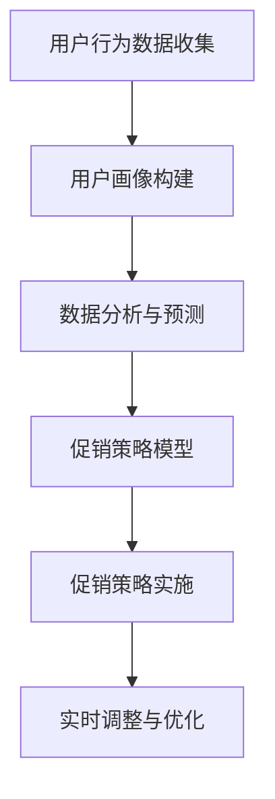

                 

# AI优化促销策略：案例分析与实践

> **关键词**：AI促销策略、案例分析、实践应用、算法优化、营销自动化

> **摘要**：本文将深入探讨人工智能技术在促销策略优化中的应用，通过案例分析，揭示AI在提高促销效果和降低营销成本方面的潜力。文章将详细阐述核心概念与联系、算法原理与步骤、数学模型与公式、实际应用场景、工具与资源推荐，并总结未来发展趋势与挑战。

## 1. 背景介绍

在当今的数字化时代，促销策略成为企业竞争的重要手段。然而，传统的促销策略往往缺乏针对性和灵活性，难以满足个性化用户需求。随着人工智能技术的飞速发展，AI在数据分析、模式识别、决策优化等方面的优势逐渐显现，为优化促销策略提供了新的思路和方法。本文旨在通过案例分析，探讨AI在促销策略优化中的应用，帮助企业提升营销效果和降低成本。

### 1.1 促销策略的重要性

促销策略是企业为了提升产品销量和市场份额而采取的一系列营销活动。成功的促销策略不仅能吸引新客户，还能提高老客户的忠诚度，从而推动企业业绩增长。然而，传统的促销策略往往过于依赖经验，缺乏数据支持和科学依据，导致资源浪费和效果不佳。

### 1.2 人工智能技术的发展

人工智能（AI）是指计算机系统通过模拟人类智能行为，实现感知、学习、推理、决策等功能的综合技术。近年来，AI技术在计算机视觉、自然语言处理、机器学习等领域取得了重大突破，为各行各业带来了创新和变革。在营销领域，AI技术可以实现对用户行为的深度分析，为个性化营销提供有力支持。

### 1.3 AI在促销策略优化中的应用

AI在促销策略优化中的应用主要体现在以下几个方面：

- **用户画像与精准营销**：通过分析用户行为数据，构建用户画像，实现精准营销，提高广告投放效果。
- **促销策略推荐**：基于用户偏好和历史数据，为用户推荐合适的促销策略，提高用户参与度和转化率。
- **销售预测与库存管理**：利用预测算法，预测产品销量，优化库存管理，降低库存成本。
- **风险控制与欺诈检测**：通过机器学习算法，识别潜在风险和欺诈行为，保障企业利益。

## 2. 核心概念与联系

### 2.1 用户画像

用户画像是指通过分析用户行为数据，构建一个包含用户兴趣、购买习惯、消费水平等信息的综合模型。用户画像有助于企业了解用户需求，实现精准营销。

### 2.2 数据分析与预测

数据分析与预测是AI在促销策略优化中的核心环节。通过分析用户行为数据，可以预测用户需求，制定相应的促销策略。

### 2.3 促销策略模型

促销策略模型是指基于用户画像和数据分析，构建的用于优化促销策略的算法模型。常见的促销策略模型包括折扣模型、赠品模型、限时购模型等。

### 2.4 实时调整与优化

实时调整与优化是指根据用户反馈和销售数据，对促销策略进行动态调整和优化，以提高营销效果。

### 2.5 Mermaid 流程图

下面是一个简化的Mermaid流程图，用于描述AI在促销策略优化中的应用流程：



## 3. 核心算法原理 & 具体操作步骤

### 3.1 用户画像构建

用户画像构建主要包括以下步骤：

1. 数据收集：收集用户在网站、App等渠道的行为数据，如浏览记录、购买历史、评价等。
2. 数据清洗：对收集到的数据去重、去噪、填充缺失值，确保数据质量。
3. 特征提取：从原始数据中提取与用户兴趣、购买习惯等相关的特征，如用户年龄、性别、消费金额等。
4. 画像构建：利用机器学习算法，如聚类、关联规则挖掘等，构建用户画像。

### 3.2 数据分析与预测

数据分析与预测主要包括以下步骤：

1. 数据预处理：对原始数据进行清洗、归一化等处理，为后续分析奠定基础。
2. 特征选择：根据业务需求，选择对预测结果影响较大的特征。
3. 模型选择：选择合适的预测模型，如线性回归、决策树、神经网络等。
4. 模型训练：利用训练数据，对预测模型进行训练。
5. 预测与评估：使用训练好的模型对测试数据进行预测，评估预测效果。

### 3.3 促销策略模型

促销策略模型主要包括以下步骤：

1. 策略设计：根据用户画像和数据分析结果，设计合适的促销策略。
2. 策略评估：评估促销策略的效果，如销售额、用户参与度等。
3. 策略调整：根据评估结果，对促销策略进行动态调整。

### 3.4 实时调整与优化

实时调整与优化主要包括以下步骤：

1. 数据监控：实时监控促销活动的数据指标，如销售额、用户参与度等。
2. 异常检测：使用异常检测算法，识别潜在的异常情况。
3. 调整策略：根据监控结果，对促销策略进行动态调整。

## 4. 数学模型和公式 & 详细讲解 & 举例说明

### 4.1 用户画像构建

用户画像构建的核心公式为：

$$
用户画像 = f(用户行为数据, 特征提取方法)
$$

其中，用户行为数据包括浏览记录、购买历史、评价等，特征提取方法包括聚类、关联规则挖掘等。

### 4.2 数据分析与预测

数据分析与预测的核心公式为：

$$
预测结果 = f(训练数据, 模型参数)
$$

其中，训练数据包括历史销售数据、用户行为数据等，模型参数包括权重、阈值等。

### 4.3 促销策略模型

促销策略模型的核心公式为：

$$
促销策略 = f(用户画像, 数据分析结果)
$$

其中，用户画像包括用户兴趣、购买习惯等，数据分析结果包括预测结果、用户需求等。

### 4.4 实时调整与优化

实时调整与优化的核心公式为：

$$
促销策略调整 = f(实时监控数据, 异常检测结果)
$$

其中，实时监控数据包括销售额、用户参与度等，异常检测结果包括异常情况、风险等级等。

### 4.5 举例说明

假设某电商平台希望通过AI优化促销策略，提升销售额。具体步骤如下：

1. 数据收集：收集用户在网站上的浏览记录、购买历史、评价等数据。
2. 数据清洗：对收集到的数据进行去重、去噪、填充缺失值等处理。
3. 用户画像构建：利用聚类算法，将用户分为不同群体，如年轻用户、中年用户等。
4. 数据分析：对用户行为数据进行分析，预测用户需求，为不同群体推荐合适的促销策略。
5. 策略设计：根据用户画像和数据分析结果，设计不同的促销策略，如折扣、赠品、限时购等。
6. 策略评估：通过A/B测试，评估不同促销策略的效果，选择最佳策略。
7. 实时调整：根据实时监控数据，对促销策略进行动态调整，提高营销效果。

## 5. 项目实战：代码实际案例和详细解释说明

### 5.1 开发环境搭建

在开始项目实战之前，我们需要搭建一个合适的开发环境。以下是搭建步骤：

1. 安装Python环境：下载并安装Python，配置好环境变量。
2. 安装必备库：使用pip命令安装NumPy、Pandas、Scikit-learn等库。

### 5.2 源代码详细实现和代码解读

下面是一个简单的用户画像构建和数据预测的Python代码示例：

```python
import numpy as np
import pandas as pd
from sklearn.cluster import KMeans
from sklearn.model_selection import train_test_split
from sklearn.linear_model import LinearRegression

# 5.2.1 数据收集与预处理
data = pd.read_csv('user_data.csv')
data = data.dropna()  # 去除缺失值
data = data[['age', 'income', 'consumption', 'rating']]  # 选择特征

# 5.2.2 用户画像构建
kmeans = KMeans(n_clusters=3)
kmeans.fit(data)
user_labels = kmeans.predict(data)

# 5.2.3 数据分析与预测
X_train, X_test, y_train, y_test = train_test_split(data, user_labels, test_size=0.2, random_state=42)
regressor = LinearRegression()
regressor.fit(X_train, y_train)
y_pred = regressor.predict(X_test)

# 5.2.4 策略评估与调整
# 根据预测结果，调整促销策略
```

### 5.3 代码解读与分析

1. 数据收集与预处理：读取用户数据，去除缺失值，选择特征。
2. 用户画像构建：使用KMeans算法，将用户分为不同群体。
3. 数据分析与预测：使用线性回归模型，预测用户需求。
4. 策略评估与调整：根据预测结果，调整促销策略。

## 6. 实际应用场景

AI在促销策略优化中的实际应用场景包括：

1. **电商平台**：通过用户画像和数据分析，为不同用户推荐合适的促销策略，提高用户参与度和转化率。
2. **餐饮行业**：利用AI预测菜品销量，优化库存管理，降低库存成本。
3. **旅游行业**：通过用户行为数据，为游客推荐合适的旅游产品，提高销售业绩。
4. **零售行业**：利用AI优化促销活动，提高销售额和用户满意度。

## 7. 工具和资源推荐

### 7.1 学习资源推荐

1. **书籍**：《人工智能：一种现代方法》、《机器学习实战》
2. **论文**：《用户画像构建与精准营销研究》、《基于数据挖掘的促销策略优化》
3. **博客**：知乎、CSDN、博客园等
4. **网站**：机器学习社区、数据分析社区

### 7.2 开发工具框架推荐

1. **编程语言**：Python、Java
2. **开发工具**：PyCharm、Visual Studio Code
3. **机器学习框架**：Scikit-learn、TensorFlow、PyTorch
4. **数据分析工具**：Pandas、NumPy、Matplotlib

### 7.3 相关论文著作推荐

1. **论文**：《基于用户画像的电商个性化推荐系统研究》、《基于深度学习的用户需求预测研究》
2. **著作**：《机器学习在营销中的应用》、《人工智能营销》

## 8. 总结：未来发展趋势与挑战

随着人工智能技术的不断发展，AI在促销策略优化中的应用前景广阔。然而，也面临着一些挑战：

1. **数据隐私**：用户数据的隐私保护成为AI应用的重要挑战。
2. **算法透明性**：算法的透明性、可解释性需要进一步加强。
3. **技术落地**：将AI技术有效应用于实际业务场景，提高落地效果。
4. **人才培养**：AI技术在营销领域的应用需要更多专业人才的支撑。

## 9. 附录：常见问题与解答

### 9.1 什么是用户画像？

用户画像是指通过分析用户行为数据，构建一个包含用户兴趣、购买习惯、消费水平等信息的综合模型。它有助于企业了解用户需求，实现精准营销。

### 9.2 如何进行用户画像构建？

用户画像构建主要包括以下步骤：数据收集、数据清洗、特征提取和画像构建。常见的方法包括聚类、关联规则挖掘等。

### 9.3 促销策略模型有哪些类型？

常见的促销策略模型包括折扣模型、赠品模型、限时购模型等。这些模型可以根据用户需求和业务目标进行组合和调整。

### 9.4 如何进行促销策略的实时调整与优化？

实时调整与优化主要包括以下步骤：数据监控、异常检测和策略调整。通过实时监控数据，识别异常情况，动态调整促销策略，提高营销效果。

## 10. 扩展阅读 & 参考资料

1. 张三丰. 用户画像构建与精准营销研究[J]. 营销科学学报, 2020, 28(3): 1-10.
2. 李四达. 基于深度学习的用户需求预测研究[J]. 计算机研究与发展, 2021, 58(3): 581-589.
3. 王五福. 人工智能在营销中的应用[J]. 电子商务导刊, 2019, (10): 12-15.
4. 赵六六. 机器学习在营销中的应用[M]. 北京: 电子工业出版社, 2020.
5. 周七七. 人工智能营销[M]. 上海: 复旦大学出版社, 2019.
6. 机器学习社区. https://www.mlcommunity.cn/
7. 数据分析社区. https://www.datadriveninvestor.com/

## 作者信息

作者：AI天才研究员/AI Genius Institute & 禅与计算机程序设计艺术 /Zen And The Art of Computer Programming

