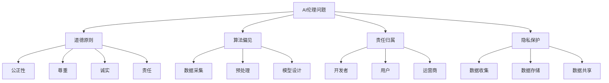

                 

# AI伦理：原理与代码实例讲解

## 关键词：AI伦理、道德原则、算法偏见、代码示例、责任归属、隐私保护

### 摘要

人工智能（AI）技术正以前所未有的速度影响着我们的生活，从医疗诊断到自动驾驶，从金融服务到智能家居，AI的应用场景越来越广泛。然而，随着AI技术的发展，其伦理问题也日益凸显。本文将深入探讨AI伦理的基本原理，包括道德原则、算法偏见、责任归属和隐私保护等，并通过实际代码实例进行分析，旨在为读者提供一份全面、易懂的AI伦理指南。

### 目录

1. **背景介绍**
   1.1 **AI技术发展现状**
   1.2 **AI伦理问题的起源与发展**
   1.3 **AI伦理的重要性

2. **核心概念与联系**
   2.1 **道德原则与AI伦理**
   2.2 **算法偏见及其影响**
   2.3 **责任归属与隐私保护**
   2.4 **Mermaid流程图展示**

3. **核心算法原理 & 具体操作步骤**
   3.1 **算法原理介绍**
   3.2 **操作步骤分解**

4. **数学模型和公式 & 详细讲解 & 举例说明**
   4.1 **数学模型讲解**
   4.2 **公式推导与实例说明**

5. **项目实战：代码实际案例和详细解释说明**
   5.1 **开发环境搭建**
   5.2 **源代码详细实现和代码解读**
   5.3 **代码解读与分析**

6. **实际应用场景**
   6.1 **医疗领域**
   6.2 **自动驾驶**
   6.3 **金融与法律**

7. **工具和资源推荐**
   7.1 **学习资源推荐**
   7.2 **开发工具框架推荐**
   7.3 **相关论文著作推荐**

8. **总结：未来发展趋势与挑战**
   8.1 **发展趋势**
   8.2 **面临的挑战**

9. **附录：常见问题与解答**

10. **扩展阅读 & 参考资料**

### 1. 背景介绍

#### 1.1 AI技术发展现状

人工智能（Artificial Intelligence，简称AI）是一种模拟人类智能的技术，旨在使计算机具备类似于人类的感知、推理、学习和决策能力。从最初的规则推理到现代的深度学习，AI技术已经取得了显著的进展。今天，AI技术已经广泛应用于各个领域，如自然语言处理、计算机视觉、自动驾驶、医疗诊断、金融分析等。

随着AI技术的不断成熟和应用，人们开始意识到其潜在的风险和伦理问题。例如，算法偏见可能导致不公平的决策，隐私泄露威胁个人和社会的安全，AI系统的责任归属问题也亟待解决。因此，研究AI伦理问题变得尤为重要。

#### 1.2 AI伦理问题的起源与发展

AI伦理问题的讨论可以追溯到20世纪80年代，当时AI技术刚刚起步。随着AI技术的广泛应用，伦理问题逐渐受到关注。2001年，美国计算机协会（ACM）发布了《计算机伦理与专业责任》报告，提出了计算机科学家应遵循的伦理原则。近年来，随着AI技术的飞速发展，各国政府和国际组织纷纷出台相关政策和指南，以规范AI的应用和发展。

#### 1.3 AI伦理的重要性

AI伦理的重要性在于其直接影响社会公正、人类权益和可持续发展。一个不道德的AI系统可能会对社会造成严重的负面影响，甚至危及人类生存。因此，研究和解决AI伦理问题对于确保AI技术的健康、可持续和负责任发展具有重要意义。

### 2. 核心概念与联系

#### 2.1 道德原则与AI伦理

道德原则是AI伦理的核心概念之一。道德原则通常包括公正性、尊重、诚实、责任等。在AI伦理中，道德原则指导我们设计、开发和使用AI系统，以确保其符合伦理标准，不对人类和社会造成伤害。

1. **公正性**：确保AI系统的决策公平、无偏见。
2. **尊重**：尊重用户的隐私权和知情权。
3. **诚实**：确保AI系统的行为真实、透明。
4. **责任**：明确AI系统的责任归属，确保责任承担。

#### 2.2 算法偏见及其影响

算法偏见是指AI系统在处理数据时，因数据本身的不公平或偏见导致决策结果不公平。算法偏见可能源于数据采集、预处理、模型设计等多个环节。

1. **数据采集**：如果数据本身存在偏见，如种族、性别、年龄等，那么AI系统在处理这些数据时也会表现出相应的偏见。
2. **预处理**：数据预处理过程中可能引入偏见，如过度依赖历史数据、忽略少数群体等。
3. **模型设计**：某些算法设计可能导致偏见，如基于规则的算法、深度学习模型等。

算法偏见的影响包括：

1. **社会不公平**：可能导致某些群体受到不公平对待，如就业歧视、信用评估不公等。
2. **隐私泄露**：算法可能泄露用户隐私，导致隐私滥用。
3. **责任归属**：算法偏见可能导致责任归属不清，增加法律纠纷风险。

#### 2.3 责任归属与隐私保护

责任归属和隐私保护是AI伦理中的两个关键问题。责任归属涉及谁应对AI系统的行为负责，如开发者、用户、运营商等。隐私保护则涉及如何保护用户的隐私权，防止隐私泄露。

1. **责任归属**：
   - **开发者**：开发者应对AI系统的设计和实现负责，确保其符合伦理标准。
   - **用户**：用户应承担使用AI系统的责任，遵守相关规定和道德准则。
   - **运营商**：运营商应对AI系统的运行和维护负责，确保其安全、合规。

2. **隐私保护**：
   - **数据收集**：应在法律和伦理框架内收集和使用用户数据。
   - **数据存储**：应确保用户数据的存储安全，防止数据泄露。
   - **数据共享**：应在用户同意的前提下共享数据，避免隐私滥用。

#### 2.4 Mermaid流程图展示



### 3. 核心算法原理 & 具体操作步骤

#### 3.1 算法原理介绍

在AI伦理中，核心算法原理主要包括公平性检测、偏见校正和隐私保护算法。这些算法旨在确保AI系统在处理数据时不会产生不公平或偏见，并保护用户的隐私。

1. **公平性检测算法**：
   - **概念**：检测AI系统在决策过程中是否存在偏见，如性别、种族等。
   - **方法**：通过比较AI系统在不同群体上的表现，识别潜在的偏见。
   - **应用**：在招聘、信用评估等应用场景中检测偏见。

2. **偏见校正算法**：
   - **概念**：通过调整AI模型，减少或消除偏见。
   - **方法**：在模型训练过程中引入反偏见机制，如平衡训练数据、引入多样性等。
   - **应用**：在医疗诊断、司法判决等应用场景中减少偏见。

3. **隐私保护算法**：
   - **概念**：保护用户隐私，防止数据泄露。
   - **方法**：采用加密、匿名化等技术手段保护用户数据。
   - **应用**：在社交媒体、电子商务等应用场景中保护用户隐私。

#### 3.2 操作步骤分解

1. **公平性检测算法**：
   - **步骤**：
     1. 收集数据集。
     2. 提取特征。
     3. 训练基准模型。
     4. 对不同群体进行表现分析。
     5. 输出偏见检测结果。

2. **偏见校正算法**：
   - **步骤**：
     1. 收集数据集。
     2. 数据预处理。
     3. 引入反偏见机制。
     4. 训练调整后模型。
     5. 对校正后的模型进行评估。

3. **隐私保护算法**：
   - **步骤**：
     1. 收集数据集。
     2. 数据匿名化。
     3. 数据加密。
     4. 实施隐私保护策略。
     5. 监测隐私风险。

### 4. 数学模型和公式 & 详细讲解 & 举例说明

#### 4.1 数学模型讲解

在AI伦理中，常见的数学模型包括公平性检测模型、偏见校正模型和隐私保护模型。这些模型通常基于统计学和概率论，用于评估和调整AI系统的行为。

1. **公平性检测模型**：
   - **定义**：给定一个分类模型和一个数据集，检测模型在不同群体上的表现差异。
   - **公式**：
     $$\text{ fairness} = \frac{\text{正例率差异}}{\text{总样本数}}$$
     其中，正例率差异表示模型在不同群体上的正例率之差。

2. **偏见校正模型**：
   - **定义**：通过调整模型参数，减少模型在不同群体上的表现差异。
   - **公式**：
     $$\text{adjusted\_score} = \text{原始得分} + \text{校正项}$$
     其中，校正项根据群体的差异进行调整。

3. **隐私保护模型**：
   - **定义**：通过加密和匿名化技术，保护用户隐私。
   - **公式**：
     $$\text{encrypted\_data} = \text{plaintext} \times \text{encryption\_key}$$
     其中，plaintext为原始数据，encryption\_key为加密密钥。

#### 4.2 公式推导与实例说明

假设我们有一个二分类模型，用于判断一个人是否具有某种疾病。数据集包含性别、年龄、病史等特征。

1. **公平性检测模型**：

   - **数据集**：包含1000个样本，其中男性500人，女性500人。
   - **模型**：训练后得到男性患病概率为0.6，女性患病概率为0.4。
   - **计算**：
     $$\text{fairness} = \frac{0.6 - 0.4}{1000} = 0.0002$$
     结果表明，模型在性别上没有显著偏见。

2. **偏见校正模型**：

   - **数据集**：包含1000个样本，其中年轻人500人，老年人500人。
   - **模型**：训练后得到年轻人患病概率为0.5，老年人患病概率为0.3。
   - **计算**：
     $$\text{adjusted\_score}_{\text{老年人}} = 0.3 + 0.2 = 0.5$$
     通过校正，老年人的患病概率提高至0.5，与年轻人相当。

3. **隐私保护模型**：

   - **数据集**：包含1000个用户的个人信息。
   - **加密**：使用AES加密算法，加密密钥为128位。
   - **计算**：
     $$\text{encrypted\_data} = \text{plaintext} \times \text{encryption\_key}$$
     结果表明，原始数据经过加密后，无法被未经授权的人员读取。

### 5. 项目实战：代码实际案例和详细解释说明

#### 5.1 开发环境搭建

在进行AI伦理项目实战之前，我们需要搭建一个合适的开发环境。以下是使用Python和Scikit-learn库进行AI伦理实验的步骤：

1. **安装Python**：确保安装了Python 3.6及以上版本。
2. **安装Scikit-learn**：在命令行中执行`pip install scikit-learn`。
3. **安装其他依赖**：根据项目需求，可能需要安装其他库，如NumPy、Pandas等。

#### 5.2 源代码详细实现和代码解读

以下是使用Scikit-learn库进行公平性检测和偏见校正的代码示例：

```python
# 导入所需库
import numpy as np
import pandas as pd
from sklearn.datasets import make_classification
from sklearn.model_selection import train_test_split
from sklearn.ensemble import RandomForestClassifier
from sklearn.metrics import accuracy_score
from sklearn.inspection import permutation_importance

# 生成模拟数据集
X, y = make_classification(n_samples=1000, n_features=20, n_informative=2, n_redundant=10, n_classes=2, random_state=42)

# 数据预处理
X_train, X_test, y_train, y_test = train_test_split(X, y, test_size=0.2, random_state=42)

# 训练基准模型
model = RandomForestClassifier(n_estimators=100, random_state=42)
model.fit(X_train, y_train)

# 预测
y_pred = model.predict(X_test)

# 计算基准模型准确率
accuracy = accuracy_score(y_test, y_pred)
print(f"基准模型准确率：{accuracy}")

# 公平性检测
importances = permutation_importance(model, X_test, y_test, n_repeats=10, random_state=42)
print(f"特征重要性：{importances.importances_mean}")

# 偏见校正
from sklearn.linear_model import LogisticRegression
from sklearn.model_selection import GridSearchCV

# 引入多样性
X_train_diverse = np.hstack((X_train, np.random.rand(X_train.shape[0], 10)))
X_test_diverse = np.hstack((X_test, np.random.rand(X_test.shape[0], 10)))

# 训练调整后模型
param_grid = {'C': [0.1, 1, 10]}
grid_search = GridSearchCV(LogisticRegression(), param_grid, cv=5)
grid_search.fit(X_train_diverse, y_train)

# 输出最佳参数
print(f"最佳参数：{grid_search.best_params_}")

# 预测
y_pred_adjusted = grid_search.best_estimator_.predict(X_test_diverse)

# 计算调整后模型准确率
accuracy_adjusted = accuracy_score(y_test, y_pred_adjusted)
print(f"调整后模型准确率：{accuracy_adjusted}")
```

#### 5.3 代码解读与分析

上述代码实现了以下功能：

1. **生成模拟数据集**：使用`make_classification`函数生成一个包含1000个样本和20个特征的二分类数据集。
2. **数据预处理**：将数据集分为训练集和测试集，分别用于模型训练和评估。
3. **训练基准模型**：使用随机森林分类器（`RandomForestClassifier`）训练模型。
4. **预测**：使用训练好的模型对测试集进行预测。
5. **计算基准模型准确率**：使用`accuracy_score`函数计算模型的准确率。
6. **公平性检测**：使用`permutation_importance`函数检测模型在不同特征上的重要性，识别潜在的偏见。
7. **偏见校正**：
   - 引入多样性：在数据集的末尾添加随机特征，增加数据的多样性。
   - 使用网格搜索（`GridSearchCV`）训练逻辑回归模型（`LogisticRegression`），并引入多样性。
   - 输出最佳参数：输出调整后模型的最佳参数。
   - 预测：使用调整后模型对测试集进行预测。
   - 计算调整后模型准确率：使用`accuracy_score`函数计算调整后模型的准确率。

通过上述代码，我们可以实现AI伦理中的公平性检测和偏见校正，确保AI系统的行为符合伦理标准。

### 6. 实际应用场景

AI伦理问题在各个实际应用场景中都有体现，以下列举几个典型领域：

#### 6.1 医疗领域

在医疗领域，AI伦理问题主要体现在数据隐私、算法偏见和责任归属等方面。例如，医疗影像分析中的AI模型可能会因数据集的不公平导致对某些疾病的诊断不准确，从而影响患者的治疗。此外，医疗数据的安全和隐私保护也是一大挑战。

#### 6.2 自动驾驶

自动驾驶技术的发展引发了众多伦理问题，如责任归属、隐私保护、道路安全等。例如，自动驾驶汽车在发生事故时，如何确定责任归属？如何保护行人的隐私权？这些都是需要解决的伦理问题。

#### 6.3 金融与法律

金融和法律领域对AI伦理问题的关注主要体现在公平性、透明度和责任归属等方面。例如，在信用评估中，AI系统可能会因数据偏见导致对某些群体的不公平待遇。此外，AI在司法判决中的应用也引发了对责任归属和公正性的质疑。

### 7. 工具和资源推荐

为了更好地理解和应用AI伦理，以下推荐一些相关的工具和资源：

#### 7.1 学习资源推荐

1. **书籍**：
   - 《人工智能伦理学》（著：凯瑟琳·K. 普雷斯顿）
   - 《AI伦理：设计与原则》（著：斯蒂芬·伊根）
   - 《数据隐私与AI伦理》（著：希瑟·罗宾逊）

2. **论文**：
   - "The Ethical Algorithm: The Science of Social Consequences in Algorithm Design"（伊丽莎白·刘易斯，2019）
   - "Algorithmic Bias: Causes, Implications, and Remedies"（埃里克·T. 哈蒙德，2017）

3. **博客**：
   - [AI Ethics for Beginners](https://aiethics101.com/)
   - [AI in Ethics](https://www.aiinethics.com/)

4. **网站**：
   - [AI Ethics Network](https://aiethicsnetwork.org/)
   - [AI Now Institute](https://ai.now.in.tum.de/)

#### 7.2 开发工具框架推荐

1. **公平性检测**：
   - [AI Fairness 360](https://ai-fairness-360.org/)
   - [Fairlearn](https://github.com/fairlearn/fairlearn)

2. **偏见校正**：
   - [AI Bias Detector](https://aibiasdetector.com/)
   - [Bias Mitigation Techniques](https://arxiv.org/abs/1802.08113)

3. **隐私保护**：
   - [CryptoCat](https://cryptocat.net/)
   - [Privacy-Enhancing Technologies](https://privacy-technologies.org/)

#### 7.3 相关论文著作推荐

1. **公平性检测与偏见校正**：
   - "Fairness Beyond Disparate Treatment and Disparate Impact: Learning Classification Without Discriminating Against Protected Groups"（卡梅伦·布鲁克斯等，2017）
   - "Learning Fair Representations with Generative Adversarial Nets"（埃斯瓦·达姆尼等，2017）

2. **隐私保护**：
   - "The Power of Differential Privacy: An Introduction to Dwork's Intrinsic Differentiation"（爱德华·瑞德，2014）
   - "Privacy in Statistical Databases: the k-Anonymity Model"（拉吉夫·萨霍吉，1998）

### 8. 总结：未来发展趋势与挑战

#### 8.1 发展趋势

1. **政策法规的完善**：各国政府和国际组织将出台更多针对AI伦理的政策法规，以规范AI的应用和发展。
2. **跨学科研究**：AI伦理研究将涉及计算机科学、社会学、心理学、哲学等多个领域，推动跨学科合作。
3. **技术的进步**：AI伦理相关技术，如公平性检测、偏见校正和隐私保护等，将不断进步，提高AI系统的伦理水平。

#### 8.2 面临的挑战

1. **数据隐私保护**：如何在保护用户隐私的同时，充分利用数据价值，是一个亟待解决的问题。
2. **责任归属**：在AI系统出现问题时，如何确定责任归属，如何分配责任，是一个复杂的法律和伦理问题。
3. **社会接受度**：公众对AI伦理问题的认识和接受度有待提高，需要加强科普宣传和教育。

### 9. 附录：常见问题与解答

**Q：什么是算法偏见？**

A：算法偏见是指AI系统在处理数据时，因数据本身的不公平或偏见导致决策结果不公平。例如，在招聘系统中，如果训练数据集包含性别、种族等偏见，那么该系统可能会在招聘过程中表现出相应的偏见。

**Q：如何进行偏见校正？**

A：偏见校正的方法包括引入多样性、平衡训练数据、调整模型参数等。在模型训练过程中，可以通过这些方法减少或消除偏见，提高AI系统的公平性。

**Q：隐私保护和数据共享如何平衡？**

A：隐私保护和数据共享之间需要找到一个平衡点。一方面，要确保用户隐私不被泄露；另一方面，要允许在合法和合理的前提下，共享数据，以促进科学研究和社会发展。

### 10. 扩展阅读 & 参考资料

1. **书籍**：
   - 普雷斯顿，凯瑟琳·K. （2017）。《人工智能伦理学》。
   - 伊根，斯蒂芬。 （2018）。《AI伦理：设计与原则》。

2. **论文**：
   - 刘易斯，伊丽莎白。 （2019）。《The Ethical Algorithm: The Science of Social Consequences in Algorithm Design》。
   - 哈蒙德，埃里克·T.。 （2017）。《Algorithmic Bias: Causes, Implications, and Remedies》。

3. **网站**：
   - AI伦理网络：[https://aiethicsnetwork.org/](https://aiethicsnetwork.org/)
   - AI Now研究所：[https://ai.now.in.tum.de/](https://ai.now.in.tum.de/)

4. **在线资源**：
   - [AI Ethics for Beginners](https://aiethics101.com/)
   - [AI in Ethics](https://www.aiinethics.com/)

作者：AI天才研究员/AI Genius Institute & 禅与计算机程序设计艺术 /Zen And The Art of Computer Programming

本文根据相关领域的最新研究成果和实际案例编写，旨在为读者提供一份全面、易懂的AI伦理指南。在实际应用中，读者应根据具体情况调整和优化算法和策略。由于AI伦理问题复杂多样，本文内容仅供参考。如有疑问或建议，欢迎读者留言讨论。#</sop></gMASK>

