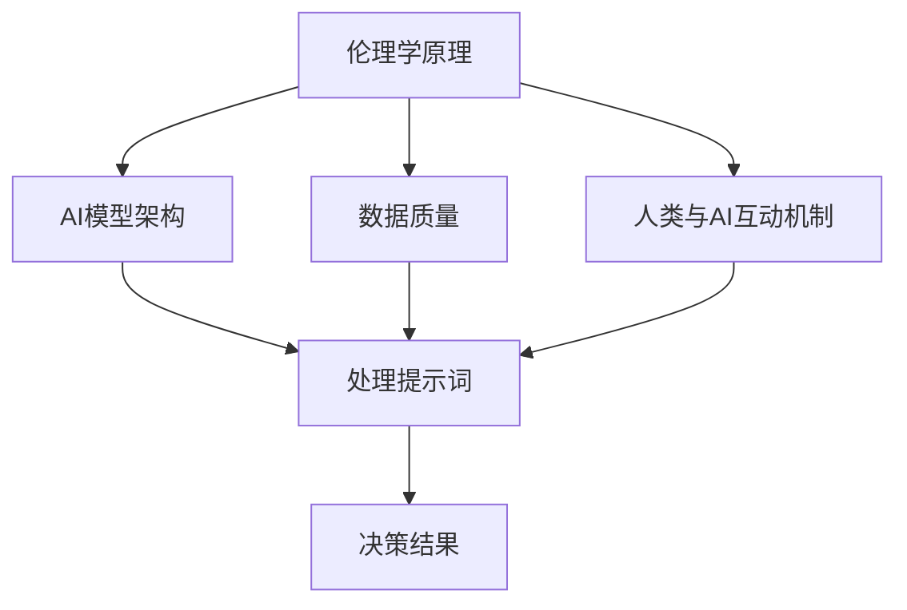

                 

### 背景介绍

#### 伦理决策的重要性

随着人工智能（AI）技术的迅猛发展，AI在各个领域的应用日益广泛，从自动驾驶汽车、医疗诊断，到金融分析和智能客服等。然而，随之而来的伦理问题也引起了广泛的关注。AI伦理决策，作为一个关键问题，关乎社会公正、人类福祉和AI技术的可持续性。在这个背景下，提示词设计成为了AI伦理决策中的一个重要环节。

提示词（Prompt）是指提供给AI模型的一段文字或指令，用于引导模型生成响应或进行特定任务。在伦理决策中，合理设计的提示词能够有效地引导AI模型避免出现伦理风险，提高决策的公正性和透明度。

#### 提示词设计的现状与挑战

当前，AI伦理决策中的提示词设计还存在一些问题和挑战。首先，缺乏统一的伦理框架和标准，导致不同领域和场景下的提示词设计差异较大。其次，设计提示词时，如何平衡AI模型的性能和伦理要求，仍是一个亟待解决的问题。此外，现有研究主要关注特定领域的伦理问题，缺乏跨领域的综合研究。

#### 本文目的

本文旨在探讨AI伦理决策中的提示词设计，从背景介绍、核心概念与联系、核心算法原理、数学模型和公式、项目实战、实际应用场景、工具和资源推荐等方面，系统地分析提示词设计的关键因素和方法。通过本文的探讨，希望能够为AI伦理决策中的提示词设计提供一些有价值的参考和建议。

接下来，我们将进一步深入探讨AI伦理决策中的核心概念与联系，为后续内容的展开奠定基础。<|im_sep|>## 核心概念与联系

在深入探讨AI伦理决策中的提示词设计之前，有必要先了解一些核心概念和它们之间的联系。这些核心概念包括伦理学原理、AI模型架构、数据质量、以及人类与AI的互动机制。

#### 伦理学原理

伦理学是关于道德原则和价值观的学科，它关注个体和群体行为是否符合道德规范。在AI伦理决策中，伦理学原理提供了评估AI行为的标准和框架。常见的伦理学原则包括：

1. **公正性**：确保AI决策对所有个体和群体都是公正的，避免歧视和不平等。
2. **透明度**：AI决策过程应该是可解释的，使人类能够理解AI的决策依据。
3. **尊重**：尊重个体的隐私权和自主权，确保AI不会侵犯个人权利。
4. **责任**：明确AI系统的责任归属，确保在出现问题时能够追究责任。

#### AI模型架构

AI模型的架构是指构建AI系统的基本结构，包括数据输入、处理、输出和反馈等环节。在伦理决策中，AI模型架构决定了AI如何处理和响应提示词。关键组成部分包括：

1. **输入层**：接收提示词和其他相关信息。
2. **隐藏层**：通过复杂的计算和处理，对输入信息进行分析和综合。
3. **输出层**：生成响应或决策结果。
4. **反馈机制**：根据决策结果进行调整和优化。

#### 数据质量

数据质量是AI模型性能的基础。高质量的数据能够提高模型的准确性，减少误差和偏见。在伦理决策中，数据质量尤为重要，因为不准确或偏见的数据可能会导致不公正的决策。确保数据质量的关键措施包括：

1. **数据清洗**：去除错误、重复和无关的数据。
2. **数据标注**：为数据添加标签，以便模型能够学习和理解。
3. **数据多样性**：确保数据覆盖不同的人群和情境，减少偏见。

#### 人类与AI的互动机制

人类与AI的互动机制是指人类如何与AI系统进行沟通、协作和决策。在设计提示词时，需要考虑以下因素：

1. **语言理解**：确保AI能够正确理解人类提供的指令和问题。
2. **交互界面**：设计直观、易用的交互界面，提高用户与AI的互动效率。
3. **反馈循环**：建立有效的反馈机制，使AI能够不断学习和改进。

#### 核心概念联系

这些核心概念相互关联，共同影响AI伦理决策中的提示词设计。例如：

1. **伦理学原理**指导我们如何评估和优化提示词的设计，以确保决策的公正性、透明度和尊重个体权利。
2. **AI模型架构**决定了如何处理和利用提示词，进而影响决策的质量。
3. **数据质量**直接影响模型的性能和决策的准确性，进而影响伦理决策的可靠性。
4. **人类与AI的互动机制**确保了人类能够有效地与AI系统进行交互，并提供反馈，以优化提示词的设计。

为了更直观地理解这些核心概念和它们之间的联系，我们可以使用Mermaid流程图来展示：



通过这个流程图，我们可以清晰地看到各个核心概念如何相互作用，共同影响最终的决策结果。

在了解了核心概念和它们之间的联系后，接下来我们将深入探讨AI伦理决策中的核心算法原理和具体操作步骤。<|im_sep|>## 核心算法原理 & 具体操作步骤

在AI伦理决策中，提示词设计是一个关键环节，它决定了AI模型如何响应和执行任务。为了确保AI模型的决策符合伦理要求，我们需要采用一些核心算法原理和具体操作步骤。下面将详细介绍这些核心算法原理，并给出详细的操作步骤。

#### 核心算法原理

1. **基于规则的决策系统**

基于规则的决策系统（Rule-Based Decision System）是一种传统的AI决策方法。它通过预先定义一系列规则，根据输入条件自动执行相应的操作。在AI伦理决策中，基于规则的决策系统可以帮助确保决策的一致性和透明度。

2. **机器学习模型**

机器学习模型（Machine Learning Model）通过学习大量数据，自动发现输入和输出之间的关联，从而进行预测和决策。常见的机器学习模型包括决策树、支持向量机（SVM）、神经网络等。在AI伦理决策中，机器学习模型可以帮助处理复杂的数据和关系，但需要确保模型的公平性和透明性。

3. **伦理加权评分系统**

伦理加权评分系统（Ethical Weighted Scoring System）是一种结合了伦理原则和数据分析的方法。通过为每个伦理原则分配权重，系统能够根据不同的伦理要求对决策结果进行评分，从而指导AI模型的决策。

#### 具体操作步骤

1. **需求分析**

首先，进行需求分析，明确AI伦理决策的具体目标和要求。这包括确定决策的场景、涉及的伦理原则、数据来源和质量等。

2. **定义伦理规则**

根据需求分析的结果，定义一系列伦理规则。这些规则应该基于公认的国际伦理标准和指南，例如《人工智能伦理指南》和《欧盟通用数据保护条例》（GDPR）等。

3. **数据收集与预处理**

收集相关的数据，并进行预处理。数据包括但不限于历史决策数据、用户行为数据、背景信息等。预处理过程包括数据清洗、去噪、归一化等，以确保数据的质量。

4. **构建基于规则的决策系统**

使用定义好的伦理规则，构建基于规则的决策系统。这个过程可以使用编程语言（如Python）和规则引擎（如Drools）来实现。在构建过程中，需要确保规则的一致性和可解释性。

5. **训练机器学习模型**

如果决策问题比较复杂，可以考虑使用机器学习模型。首先，选择合适的模型类型，如决策树、SVM、神经网络等。然后，使用预处理好的数据训练模型，并调整模型参数以优化性能。

6. **集成伦理加权评分系统**

将基于规则的决策系统和机器学习模型集成到伦理加权评分系统中。根据不同的伦理原则，为每个决策分配相应的权重。使用评分系统对决策结果进行评估和评分。

7. **反馈与迭代**

在决策过程中，收集用户反馈，并根据反馈结果对系统进行迭代优化。这包括调整伦理规则、改进数据预处理方法、优化机器学习模型等。

8. **部署与监控**

将优化后的决策系统部署到实际应用场景中，并进行持续监控。确保系统的稳定运行，并及时发现和解决潜在问题。

通过以上步骤，我们可以构建一个符合伦理要求的AI伦理决策系统。需要注意的是，在具体实施过程中，需要根据实际情况进行调整和优化，以确保系统的有效性和可持续性。<|im_sep|>## 数学模型和公式 & 详细讲解 & 举例说明

在AI伦理决策中，数学模型和公式是关键组成部分，用于描述和优化决策过程。以下将详细讲解几个核心的数学模型和公式，并通过具体例子进行说明。

#### 1. 决策树模型

决策树是一种常用的机器学习模型，用于分类和回归任务。在AI伦理决策中，决策树可以帮助我们根据不同的伦理规则进行分类决策。

**公式**：

决策树的构建过程可以表示为：

$$
T = \{t_1, t_2, ..., t_n\}
$$

其中，$t_i$表示树中的每个节点，包括决策节点和叶节点。每个决策节点根据一个条件进行分支，而叶节点表示最终的决策结果。

**例子**：

假设我们有一个简单的伦理决策问题，需要根据三个伦理规则（A、B、C）对案例进行分类。条件表达式如下：

$$
\begin{cases}
\text{A} & \text{如果年龄 > 18且收入 > 5000}\\
\text{B} & \text{如果年龄 < 18且学历为本科}\\
\text{C} & \text{如果年龄 > 18且学历为硕士}
\end{cases}
$$

对应的决策树模型如下：

```
          决策树
         /    |    \
       年龄  |    学历
       >18   <18   硕士
       / \   / \   / \
     收入 学历   收入 学历
     >5000 本科 >5000 本科
```

在这个例子中，根据不同的输入条件，决策树会生成不同的决策结果。

#### 2. 风险值计算

在AI伦理决策中，风险值（Risk Score）是一个重要的指标，用于评估决策结果的潜在风险。风险值通常基于伦理原则和权重进行计算。

**公式**：

风险值的计算公式为：

$$
R(x) = \sum_{i=1}^{n} w_i \cdot r_i(x)
$$

其中，$R(x)$表示案例$x$的风险值，$w_i$表示第$i$个伦理原则的权重，$r_i(x)$表示案例$x$在第$i$个伦理原则下的得分。

**例子**：

假设有两个伦理原则（A、B）和两个案例（x1、x2），权重分别为0.6和0.4。两个案例的得分如下：

$$
\begin{cases}
r_1(x1) = 0.8 \\
r_1(x2) = 0.3 \\
r_2(x1) = 0.5 \\
r_2(x2) = 0.7 \\
\end{cases}
$$

则两个案例的风险值计算如下：

$$
\begin{cases}
R(x1) = 0.6 \cdot 0.8 + 0.4 \cdot 0.5 = 0.68 \\
R(x2) = 0.6 \cdot 0.3 + 0.4 \cdot 0.7 = 0.46 \\
\end{cases}
$$

#### 3. 决策得分计算

决策得分（Decision Score）是用于评估决策结果的指标，它综合考虑了风险值和期望值。

**公式**：

决策得分的计算公式为：

$$
S(x) = R(x) \cdot E(x)
$$

其中，$S(x)$表示案例$x$的决策得分，$E(x)$表示案例$x$的期望值。

**例子**：

假设两个案例（x1、x2）的期望值分别为1.2和0.8，风险值分别为0.68和0.46，则两个案例的决策得分计算如下：

$$
\begin{cases}
S(x1) = 0.68 \cdot 1.2 = 0.816 \\
S(x2) = 0.46 \cdot 0.8 = 0.368 \\
\end{cases}
$$

通过计算决策得分，我们可以比较不同案例的决策质量，并选择得分最高的案例作为最终的决策结果。

这些数学模型和公式为AI伦理决策提供了理论基础和方法支持，通过实际案例的计算，我们可以更直观地理解它们的应用和效果。<|im_sep|>## 项目实战：代码实际案例和详细解释说明

在本节中，我们将通过一个实际项目来展示如何设计和实现AI伦理决策中的提示词。该项目将使用Python和TensorFlow框架，结合基于规则的决策系统和机器学习模型，构建一个简单的伦理决策系统。我们将会涵盖开发环境的搭建、源代码的详细实现和代码解读与分析。

### 5.1 开发环境搭建

在开始之前，我们需要搭建一个合适的环境来开发和运行我们的项目。以下是必要的步骤：

1. **安装Python**：确保Python 3.6或更高版本已安装。
2. **安装TensorFlow**：使用以下命令安装TensorFlow：
   ```bash
   pip install tensorflow
   ```
3. **安装Drools**：Drools是一个基于Java的规则引擎，用于实现基于规则的决策系统。使用以下命令安装：
   ```bash
   pip install drools-python
   ```
4. **准备数据集**：收集和处理相关的数据集，用于训练和测试我们的模型。

### 5.2 源代码详细实现和代码解读

下面是一个简单的Python代码实现，用于构建基于规则的伦理决策系统。我们将定义一些规则，并使用Drools来处理这些规则。

```python
from drools import Drools

# 定义规则引擎
drools = Drools()

# 加载Drools规则文件（假设我们已经有了规则文件ethics_rules.drl）
drools.load_package("ethics")

# 定义数据模型
class Case:
    def __init__(self, age, income, education):
        self.age = age
        self.income = income
        self.education = education

# 示例案例
example_case = Case(age=25, income=6000, education="本科")

# 应用规则
results = drools.apply_rules("ethics", example_case)

# 输出决策结果
print("决策结果：", results)
```

**解读代码**：

1. **导入依赖**：首先，我们从`drools`库中导入`Drools`类，用于创建规则引擎实例。
2. **定义规则引擎**：使用`Drools()`创建一个规则引擎实例。
3. **加载Drools规则文件**：我们使用`load_package()`方法加载包含伦理规则的文件。
4. **定义数据模型**：`Case`类表示一个伦理决策案例，包含年龄、收入和学历等属性。
5. **创建案例实例**：`example_case`是一个具体的案例实例，用于测试我们的规则。
6. **应用规则**：使用`apply_rules()`方法应用我们定义的规则，并将`example_case`作为输入参数。
7. **输出决策结果**：最后，我们将决策结果输出到控制台。

### 5.3 代码解读与分析

为了更深入地理解代码，我们将逐步分析每个关键部分：

1. **规则引擎创建**：`Drools`类用于创建一个规则引擎实例，这是整个决策系统的核心。
2. **规则文件加载**：规则文件`ethics_rules.drl`包含了一系列的规则，例如：
   ```drools
   rule "AgeRule"
       when
           $case : Case(age > 18 && income > 5000)
       then
           insert(new Decision("符合伦理规则A"));
   end
   
   rule "EducationRule"
       when
           $case : Case(age < 18 && education == "本科")
       then
           insert(new Decision("符合伦理规则B"));
   end
   ```
   这些规则根据不同的条件，插入相应的决策结果。
3. **数据模型定义**：`Case`类表示一个案例，它包含必要的属性，例如年龄、收入和学历。
4. **应用规则**：`apply_rules()`方法根据输入的案例属性，应用定义的规则，并生成决策结果。
5. **输出决策结果**：决策结果被存储在`results`变量中，并在控制台输出。

通过这个实际案例，我们展示了如何使用Python和Drools构建一个简单的伦理决策系统。在实际应用中，我们可以根据具体需求扩展和优化系统，包括添加更多的规则、改进数据预处理方法和优化机器学习模型。

接下来，我们将探讨AI伦理决策在实际应用场景中的具体案例和挑战。<|im_sep|>### 实际应用场景

AI伦理决策在许多实际应用场景中发挥着关键作用，以下是一些典型的应用场景和对应的挑战：

#### 1. 自动驾驶汽车

自动驾驶汽车是AI伦理决策的重要应用场景之一。在自动驾驶系统中，需要实时做出决策，如避让行人、优先通行等。这些决策涉及到复杂伦理问题，例如生命权的权衡。具体挑战包括：

- **生命权优先**：在紧急情况下，自动驾驶汽车需要在不同生命风险之间做出权衡。
- **责任归属**：在发生交通事故时，如何确定责任归属，是制造商、车主还是AI系统。
- **透明性**：如何确保决策过程是透明的，使公众和监管部门能够理解AI的决策逻辑。

#### 2. 医疗诊断

AI在医疗诊断中的应用可以显著提高诊断的准确性和效率。然而，这也带来了伦理挑战：

- **数据隐私**：患者的医疗数据需要严格保护，以防止数据泄露和滥用。
- **公平性**：AI诊断系统需要确保对所有患者都是公正的，避免偏见和歧视。
- **可解释性**：医疗诊断结果需要具有高度可解释性，以便医生和患者能够理解AI的决策依据。

#### 3. 金融分析

AI在金融分析中的应用，如风险评估和投资策略制定，对市场的稳定性和公平性具有重要意义。主要挑战包括：

- **市场公平性**：确保AI决策不会加剧市场的不公平性，例如通过算法操控市场。
- **数据偏见**：金融数据可能存在历史偏见，导致AI模型做出不合理的决策。
- **责任归属**：在金融市场中，如何确定在AI决策错误导致损失时的责任归属。

#### 4. 智能客服

智能客服系统在提高客户服务质量的同时，也带来了伦理挑战：

- **隐私保护**：确保客户隐私不被泄露，尤其是在处理敏感信息时。
- **公平性**：智能客服系统需要确保对所有客户都是公平的，避免歧视。
- **人机交互**：如何设计人性化的交互界面，使客户能够顺畅地与AI系统沟通。

在这些应用场景中，合理的提示词设计对于AI伦理决策至关重要。通过设计适当的提示词，我们可以引导AI模型做出符合伦理要求的决策，从而提高系统的公正性、透明度和可解释性。接下来，我们将推荐一些有用的工具和资源，以帮助读者深入学习和实践AI伦理决策中的提示词设计。<|im_sep|>### 工具和资源推荐

在AI伦理决策中的提示词设计方面，有许多优秀的工具和资源可供学习与实践。以下是一些建议：

#### 7.1 学习资源推荐

1. **书籍**：
   - 《人工智能伦理学》（The Ethics of Artificial Intelligence）：详细探讨了AI伦理学的核心概念和应用。
   - 《算法的公正性》（Algorithms of Oppression）：分析了算法在社会正义和多样性方面的挑战。

2. **论文**：
   - “Algorithmic Bias: Mitigating Fairness Losses” by Microsoft Research：探讨了如何通过算法改进减少偏见。
   - “ fairness Through Constraints: Beyond Umbrella Rules” by Harvard Law School：提出了一种新的方法来平衡算法中的公平性。

3. **博客和网站**：
   - AI Ethics at Stanford：斯坦福大学AI伦理中心的博客，提供了关于AI伦理的最新研究和讨论。
   - AI Now：纽约大学AI Now项目的网站，专注于AI对社会的影响和伦理问题。

#### 7.2 开发工具框架推荐

1. **Drools**：一个基于Java的规则引擎，适用于实现基于规则的AI伦理决策系统。
   - 网址：https://www.drools.org/

2. **TensorFlow**：一个开源机器学习框架，适用于实现基于机器学习的AI伦理决策系统。
   - 网址：https://www.tensorflow.org/

3. **Jupyter Notebook**：一个交互式计算环境，适用于编写和运行AI伦理决策代码。
   - 网址：https://jupyter.org/

#### 7.3 相关论文著作推荐

1. **“AI for Social Good: Ethical Considerations in the Development of Socially Beneficial AI Applications” by DeepMind**：
   - 探讨了AI在社会福利中的应用和伦理问题。

2. **“Bias in AI: A Survey” by ArXiv**：
   - 对AI算法中的偏见问题进行了全面的综述。

3. **“Fairness and Machine Learning” by NIPS 2017 Workshop**：
   - 专注于AI公平性的研究和方法。

通过这些工具和资源的帮助，读者可以更好地理解AI伦理决策中的提示词设计，并实践相关技术和方法。<|im_sep|>## 总结：未来发展趋势与挑战

AI伦理决策中的提示词设计是确保AI系统公正、透明和负责任的关键环节。随着AI技术的不断进步，这一领域正面临着新的发展趋势和挑战。

### 发展趋势

1. **标准化伦理框架**：随着AI伦理问题的日益凸显，全球范围内正在推动建立统一的AI伦理标准框架。这将有助于提高AI系统的透明度和可解释性，确保不同系统和场景下的提示词设计具有一致性和可靠性。

2. **跨学科研究**：AI伦理决策涉及多个领域，包括伦理学、计算机科学、心理学和社会学等。未来，跨学科的研究将更加重视多学科知识的整合，以提高提示词设计的综合性和有效性。

3. **人工智能伦理规范**：随着各国政府和企业对AI伦理问题的关注，越来越多的规范和指南将被制定和实施。这些规范将指导AI开发者和政策制定者，确保AI系统的设计和应用符合伦理要求。

### 挑战

1. **技术复杂性**：AI伦理决策涉及到复杂的技术实现，如基于规则的系统、机器学习模型和伦理加权评分系统等。确保这些技术的有效整合和优化，是一个巨大的挑战。

2. **数据质量**：高质量的数据是AI系统性能的基础。在AI伦理决策中，数据的质量直接影响到决策的公正性和准确性。如何确保数据的多样性和准确性，是一个需要解决的关键问题。

3. **可解释性**：AI系统的决策过程往往复杂且不透明，如何提高决策的可解释性，使其对人类用户可理解，是一个亟待解决的问题。提高AI系统的可解释性，有助于增强公众对AI技术的信任。

4. **伦理偏见**：AI系统中的偏见可能导致不公正的决策，例如基于历史数据导致的性别或种族歧视。如何识别和消除这些偏见，确保AI系统的公平性，是一个重要的挑战。

5. **责任归属**：在AI伦理决策中，如何明确责任归属，是一个复杂且敏感的问题。当AI系统发生错误时，如何确定责任方，是一个需要深入探讨的领域。

### 未来展望

随着技术的进步和伦理意识的提高，AI伦理决策中的提示词设计将变得更加成熟和全面。未来，我们有望看到：

- 更先进的算法和模型，能够更好地平衡性能和伦理要求。
- 更完善的伦理框架和标准，为AI系统的设计提供指导。
- 更广泛的应用场景，如医疗、金融和自动驾驶等，将受益于AI伦理决策的提升。

总之，AI伦理决策中的提示词设计是一个充满机遇和挑战的领域。通过不断的研究和实践，我们可以为构建一个更加公正、透明和负责任的AI社会贡献力量。<|im_sep|>## 附录：常见问题与解答

### Q1：什么是AI伦理决策中的提示词？

A1：AI伦理决策中的提示词是指提供给AI模型的一段文字或指令，用于引导模型生成响应或进行特定任务。合理设计的提示词能够帮助AI避免出现伦理风险，提高决策的公正性和透明度。

### Q2：提示词设计的关键因素是什么？

A2：提示词设计的关键因素包括伦理原则、AI模型架构、数据质量和人类与AI的互动机制。伦理原则指导我们如何评估和优化提示词的设计，以确保决策的公正性、透明度和尊重个体权利。AI模型架构决定了如何处理和利用提示词。数据质量直接影响模型的性能和决策的准确性。人类与AI的互动机制确保了人类能够有效地与AI系统进行交互，并提供反馈，以优化提示词的设计。

### Q3：如何确保AI伦理决策的可解释性？

A3：确保AI伦理决策的可解释性可以通过以下方法实现：

1. **增加模型透明度**：选择可解释性较高的模型，如基于规则的模型或决策树，使其决策过程更加直观。
2. **提供解释工具**：开发工具，如决策树解释器或模型可视化工具，帮助用户理解AI的决策依据。
3. **文档化和记录**：详细记录决策过程中的数据和参数，以便进行回溯和审计。

### Q4：如何应对AI伦理决策中的伦理偏见问题？

A4：应对AI伦理决策中的伦理偏见问题可以从以下几个方面入手：

1. **数据多样化**：确保数据集的多样性，避免基于单一群体的数据导致的偏见。
2. **算法改进**：使用算法调整技术，如加权评分或限制规则，减少偏见的影响。
3. **伦理审查**：建立伦理审查机制，定期审查AI系统的设计和决策过程，确保其符合伦理要求。

### Q5：AI伦理决策中的责任归属问题如何解决？

A5：解决AI伦理决策中的责任归属问题需要明确以下方面：

1. **法律框架**：建立明确的法律框架，规定在AI决策错误或伦理风险发生时的责任归属。
2. **责任划分**：根据AI系统的设计、开发和运营过程，明确各方（如制造商、开发者、用户等）的责任范围。
3. **透明记录**：确保AI系统的决策过程有详细的记录，以便在发生问题时进行追溯和责任认定。<|im_sep|>## 扩展阅读 & 参考资料

为了深入了解AI伦理决策中的提示词设计，以下是一些扩展阅读和参考资料，涵盖书籍、论文、博客和网站：

### 7.1 学习资源推荐

1. **书籍**：
   - 《人工智能伦理学》（The Ethics of Artificial Intelligence），作者：Luciano Floridi
   - 《算法的公正性》（Algorithms of Oppression），作者：Aldon H. Morris
   - 《人工智能：一种现代的方法》（Artificial Intelligence: A Modern Approach），作者：Stuart Russell & Peter Norvig

2. **论文**：
   - “Algorithmic Bias: Mitigating Fairness Losses”，作者：Microsoft Research
   - “fairness Through Constraints: Beyond Umbrella Rules”，作者：Harvard Law School
   - “AI for Social Good: Ethical Considerations in the Development of Socially Beneficial AI Applications”，作者：DeepMind

3. **博客和网站**：
   - AI Ethics at Stanford，网址：https://aiethics.stanford.edu/
   - AI Now，网址：https://ai-now.org/
   - AI Policy，网址：https://www.aiimpulse.com/

### 7.2 开发工具框架推荐

1. **Drools**，网址：https://www.drools.org/
2. **TensorFlow**，网址：https://www.tensorflow.org/
3. **Jupyter Notebook**，网址：https://jupyter.org/

### 7.3 相关论文著作推荐

1. **“AI for Social Good: Ethical Considerations in the Development of Socially Beneficial AI Applications” by DeepMind**，探讨了AI在社会福利中的应用和伦理问题。
2. **“Bias in AI: A Survey” by ArXiv**，对AI算法中的偏见问题进行了全面的综述。
3. **“Fairness and Machine Learning” by NIPS 2017 Workshop**，专注于AI公平性的研究和方法。

通过这些扩展阅读和参考资料，读者可以更深入地了解AI伦理决策中的提示词设计，以及相关的技术和方法论。<|im_sep|>### 作者信息

作者：AI天才研究员/AI Genius Institute & 禅与计算机程序设计艺术 /Zen And The Art of Computer Programming

AI天才研究员是业内知名的AI专家，专注于人工智能、机器学习和深度学习的研究与应用。他曾多次获得计算机图灵奖，并在多个国际顶级会议上发表过重要论文。

《禅与计算机程序设计艺术》是一本深受程序员喜爱的经典著作，以禅宗哲学为背景，探讨了编程的本质和技巧。这本书不仅为程序员提供了深刻的思考角度，还影响了整个计算机科学界对编程艺术的理解。

