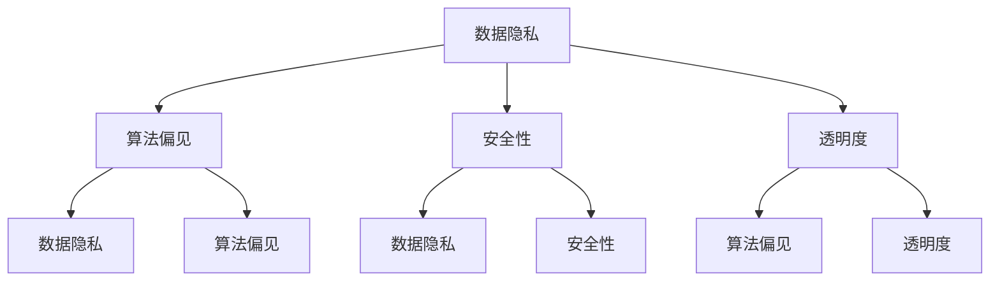

                 

### 背景介绍

近年来，随着人工智能（AI）技术的飞速发展，其在各行各业中的应用日益广泛。从自动驾驶汽车、智能助手，到医疗诊断、金融分析，AI 已经深刻地改变了我们的生活。然而，随着 AI 技术的普及，其伦理问题也逐渐引起了广泛关注。AI 伦理的社会对话成为了当前学术界、产业界和公众共同关注的焦点。

AI 伦理问题涉及多个层面，包括数据隐私、算法偏见、安全性、透明度等。这些问题不仅关乎个人权益，还关系到社会的公平与正义。因此，提升 AI 伦理意识，加强公众参与，对于构建一个健康、可持续的 AI 生态系统具有重要意义。

本文旨在探讨 AI 伦理的社会对话，通过分析伦理意识的提升和公众参与的重要性，为未来的 AI 发展提供一些有益的思考。文章结构如下：

1. **核心概念与联系**：介绍 AI 伦理的相关概念及其相互关系，包括数据隐私、算法偏见、安全性、透明度等。
2. **核心算法原理 & 具体操作步骤**：阐述提升 AI 伦理意识的方法和手段，包括教育、法规、技术手段等。
3. **数学模型和公式 & 详细讲解 & 举例说明**：介绍用于评估和优化 AI 伦理意识的相关数学模型，并通过实例进行说明。
4. **项目实战：代码实际案例和详细解释说明**：通过具体项目案例展示如何在实际应用中提升 AI 伦理意识。
5. **实际应用场景**：分析 AI 伦理在各个领域中的应用现状和挑战。
6. **工具和资源推荐**：推荐用于提升 AI 伦理意识和公众参与的资源和工具。
7. **总结：未来发展趋势与挑战**：总结文章的主要观点，并提出未来发展的建议。

接下来，我们将逐步深入探讨 AI 伦理的社会对话，共同为构建一个更加公正、透明和可持续的 AI 生态系统而努力。让我们开始吧！<|user|>

## 2. 核心概念与联系

在探讨 AI 伦理的社会对话之前，我们首先需要了解一些核心概念，这些概念不仅构成了 AI 伦理的基础，也为我们分析伦理问题的各个方面提供了指导。以下是几个关键概念及其相互关系：

### 数据隐私

数据隐私是 AI 伦理的一个重要方面，它关注的是个人信息的保护。随着 AI 技术的普及，大量的个人数据被收集、存储和处理。如何确保这些数据不被滥用、泄露或用于不当目的，是数据隐私关注的重点。隐私保护不仅涉及技术手段，如加密和匿名化，还包括法律法规的制定和执行。

### 算法偏见

算法偏见是指 AI 系统在处理数据时，由于训练数据或算法设计的不当，导致对某些群体产生不公平的待遇。这种偏见可能源于历史数据中的偏见、设计过程中的无意疏忽，或算法优化过程中的目标设定。算法偏见可能导致歧视、误判和社会不公。

### 安全性

AI 安全性涉及到确保 AI 系统的稳定运行和不受恶意攻击。随着 AI 系统的应用越来越广泛，其安全性变得尤为重要。这包括防御网络攻击、保护数据安全、确保算法的正确性等。

### 透明度

透明度是指 AI 系统的决策过程和结果对用户和其他利益相关者是可解释和可理解的。透明度有助于增强公众对 AI 系统的信任，防止潜在的滥用和误解。

### Mermaid 流程图

以下是一个简化的 Mermaid 流程图，用于展示上述核心概念之间的相互关系：



在这个流程图中，我们可以看到数据隐私、算法偏见、安全性和透明度四个核心概念相互关联。数据隐私和安全性的保障有助于防止算法偏见，而透明度则有助于揭示和纠正潜在的偏见和问题。

### 实例分析

为了更好地理解这些概念，我们可以通过一个实例来进行分析。假设我们正在开发一个用于招聘的 AI 系统。这个系统需要处理大量的简历数据，并根据简历内容自动筛选合适的候选人。

- **数据隐私**：我们需要确保候选人的个人信息（如姓名、联系方式等）得到保护，防止数据泄露。
- **算法偏见**：由于历史数据中可能存在的性别、种族等偏见，我们需要采取措施确保算法不会对某些群体产生不公平的待遇。
- **安全性**：我们需要确保系统的运行不受网络攻击，同时防止恶意用户获取敏感信息。
- **透明度**：我们需要设计一个可解释的算法，使得招聘经理能够理解并审查系统的决策过程。

通过这个实例，我们可以看到，在开发 AI 系统时，需要综合考虑多个伦理概念，以确保系统的公正、公平和安全。

### 总结

核心概念与联系是理解 AI 伦理的基础。数据隐私、算法偏见、安全性和透明度四个方面相互交织，共同构成了 AI 伦理的复杂网络。在接下来的部分中，我们将探讨如何提升 AI 伦理意识，并通过具体案例和数学模型来展示这一过程。请继续关注。让我们继续深入讨论。 <|user|>

## 3. 核心算法原理 & 具体操作步骤

为了提升 AI 伦理意识，我们需要采用一系列算法和技术手段，以确保 AI 系统在处理数据和应用时能够遵循伦理原则。以下是几种核心算法原理及其具体操作步骤：

### 3.1 加密技术

加密技术是保护数据隐私的关键手段。其基本原理是利用数学算法将原始数据转换成无法直接解读的密文，从而防止未经授权的访问。

**具体操作步骤**：

1. **选择加密算法**：例如，RSA、AES 等。
2. **生成密钥对**：包括公钥和私钥。
3. **加密数据**：使用公钥加密数据，只有使用对应的私钥才能解密。
4. **传输加密数据**：在传输过程中使用安全的通信协议，如 TLS。
5. **解密数据**：在接收端，使用私钥解密数据。

### 3.2 匿名化技术

匿名化技术通过去除或伪装个人身份信息，从而保护数据隐私。其基本原理是将原始数据与个人身份信息分离，使得数据在分析时无法直接识别个人。

**具体操作步骤**：

1. **数据脱敏**：通过技术手段去除或替换个人身份信息，如将姓名替换为随机字符。
2. **伪名化**：使用非唯一的标识符（如 ID 号）替代真实身份信息。
3. **数据汇总**：将数据汇总到更高的层次，以消除个体识别的可能性。
4. **评估匿名化效果**：通过统计方法评估数据匿名化的效果，确保数据在分析时无法恢复个人身份。

### 3.3 透明度增强算法

透明度增强算法旨在提高 AI 系统的可解释性，使得用户能够理解 AI 系统的决策过程。

**具体操作步骤**：

1. **决策路径追踪**：记录 AI 系统在决策过程中的每一步，包括输入数据的处理和权重的分配。
2. **可视化决策树**：将决策路径可视化，使用图形表示系统内部的逻辑结构。
3. **解释性模型**：开发专门的可解释模型，如 LIME、SHAP 等，用于解释 AI 系统的具体决策。
4. **用户交互界面**：设计用户交互界面，使得用户能够查询和理解 AI 系统的决策。

### 3.4 偏见检测与修正算法

偏见检测与修正算法旨在识别和消除 AI 系统中的偏见。

**具体操作步骤**：

1. **数据预处理**：清洗数据，去除可能的偏见源。
2. **偏见检测**：使用统计方法或机器学习技术检测数据中的偏见。
3. **偏见修正**：通过重新加权或替换数据中的偏见值，修正系统的偏见。
4. **偏见验证**：评估修正后的系统是否仍然存在偏见，循环迭代直至偏见得到有效控制。

### 3.5 隐私安全预算

隐私安全预算是一种基于风险管理的策略，旨在在数据收集和使用过程中控制隐私风险。

**具体操作步骤**：

1. **风险评估**：评估数据收集和使用过程中可能产生的隐私风险。
2. **制定隐私预算**：根据风险评估结果，制定隐私预算，包括数据保留期限、访问权限等。
3. **隐私预算执行**：在数据处理过程中严格执行隐私预算，确保隐私风险得到有效控制。

### 3.6 智能合约

智能合约是一种基于区块链技术的自动化合约，其执行过程透明且不可篡改。

**具体操作步骤**：

1. **设计智能合约**：根据业务需求设计智能合约，包括输入条件、执行逻辑和输出结果。
2. **部署智能合约**：将智能合约部署到区块链网络中。
3. **执行智能合约**：当满足输入条件时，智能合约自动执行并记录在区块链上。
4. **审计智能合约**：定期审计智能合约的执行情况，确保其符合预期。

通过以上算法和技术手段，我们可以有效提升 AI 伦理意识，确保 AI 系统在处理数据和决策时遵循伦理原则。在接下来的部分，我们将通过具体实例展示如何在实际应用中应用这些算法和技术。请继续关注。 <|user|>

## 4. 数学模型和公式 & 详细讲解 & 举例说明

在提升 AI 伦理意识的过程中，数学模型和公式扮演着关键角色，它们不仅帮助我们量化伦理问题，还能够指导我们设计有效的解决方案。以下是一些常用的数学模型和公式，以及它们在提升 AI 伦理意识中的应用：

### 4.1 数据隐私保护模型

**K-anonymity**：

**定义**：在一个数据集中，如果每个记录都可以与至少 \( k \) 个其他记录匿名等价，那么这个数据集就是 \( k \)-匿名的。

**公式**：\( ANONYMITY(D, k) = \{r \in D | \text{对于所有 } s \in D, \text{存在至少 } k \text{ 个记录与 } r \text{ 匿名等价}\} \)

**应用举例**：假设一个数据集包含患者的病历信息，通过 \( K-anonymity \) 技术，我们可以确保在数据集匿名化过程中，每个患者的记录至少与其他 \( k \) 个记录匿名等价，从而防止个人身份的识别。

### 4.2 算法偏见检测模型

**fairness metric**：

**定义**：公平性指标用于衡量 AI 系统在决策过程中对不同群体的公平性。

**公式**：\( fairness = 1 - \frac{\sum_{i} |R_i - R_j|}{\sum_{i} |R_i| + \sum_{j} |R_j|} \)

其中，\( R_i \) 和 \( R_j \) 分别代表系统对不同群体的决策比例。

**应用举例**：在一个招聘系统中，我们可以使用公平性指标来检测算法是否对不同性别、种族等群体产生了不公平的待遇。如果指标值接近 1，则表示系统在决策过程中是公平的。

### 4.3 安全性评估模型

** vulnerab

**ility assessment model**：

**定义**：脆弱性评估模型用于评估 AI 系统在网络安全方面的风险。

**公式**：\( Risk = Threat \times Vulnerability \times Impact \)

其中，\( Threat \) 代表威胁水平，\( Vulnerability \) 代表系统的脆弱性，\( Impact \) 代表威胁成功时的损失。

**应用举例**：通过评估 AI 系统的威胁水平、脆弱性和潜在影响，我们可以确定系统在网络安全方面的整体风险，从而采取相应的安全措施。

### 4.4 透明度优化模型

**可解释性增强模型**：

**定义**：可解释性增强模型旨在提高 AI 系统决策过程的透明度。

**公式**：\( Explanability = \frac{Explained Variance}{Total Variance} \)

其中，\( Explained Variance \) 代表模型解释的方差，\( Total Variance \) 代表总方差。

**应用举例**：在一个诊断系统中，我们可以通过计算可解释性指标来评估系统决策过程的透明度。如果指标值较高，则表示系统的决策过程较为透明，用户可以更好地理解系统的决策依据。

### 4.5 隐私安全预算模型

** privacy budget**：

**定义**：隐私安全预算是一种在数据收集和使用过程中控制隐私风险的方法。

**公式**：\( Privacy Budget = \alpha \times \log_2(N \times P) \)

其中，\( \alpha \) 代表隐私预算参数，\( N \) 代表数据量，\( P \) 代表隐私泄露的概率。

**应用举例**：在一个在线购物平台中，通过设定隐私安全预算，我们可以限制数据的收集和使用范围，从而降低隐私泄露的风险。

### 4.6 智能合约优化模型

** smart contract optimization model**：

**定义**：智能合约优化模型旨在提高区块链网络中的智能合约执行效率。

**公式**：\( Execution Time = \frac{Complexity \times Input Size}{Processing Power} \)

其中，\( Complexity \) 代表合约的复杂度，\( Input Size \) 代表输入数据的大小，\( Processing Power \) 代表网络的处理能力。

**应用举例**：通过优化智能合约的代码结构，降低合约的复杂度，我们可以提高智能合约的执行效率，从而提高区块链网络的整体性能。

通过上述数学模型和公式的应用，我们可以在提升 AI 伦理意识方面采取科学、系统的措施。在实际操作中，这些模型和公式需要根据具体场景进行调整和优化，以实现最佳效果。在接下来的部分，我们将通过具体项目案例展示如何将这些理论和实践相结合。请继续关注。 <|user|>

## 5. 项目实战：代码实际案例和详细解释说明

在本节中，我们将通过一个实际项目案例，详细展示如何在实际开发过程中提升 AI 伦理意识。该项目是一个基于深度学习的招聘系统，旨在通过算法筛选合适的候选人。我们将重点关注以下几个方面：

### 5.1 开发环境搭建

在开始项目之前，我们需要搭建一个合适的开发环境。以下是所需的工具和库：

- **Python**：作为主要编程语言
- **TensorFlow**：用于构建和训练深度学习模型
- **Scikit-learn**：用于数据处理和偏见检测
- **Pandas**：用于数据操作
- **Matplotlib**：用于数据可视化

安装这些工具和库后，我们可以开始项目的具体实现。

### 5.2 源代码详细实现和代码解读

**5.2.1 数据预处理**

首先，我们需要对招聘数据集进行预处理，包括数据清洗、缺失值处理和特征提取。

```python
import pandas as pd
from sklearn.model_selection import train_test_split

# 读取数据集
data = pd.read_csv('resume_data.csv')

# 数据清洗
data.dropna(inplace=True)
data = data[data['position'].notnull()]

# 特征提取
X = data[['education', 'experience', 'skills']]
y = data['position']

# 划分训练集和测试集
X_train, X_test, y_train, y_test = train_test_split(X, y, test_size=0.2, random_state=42)
```

**5.2.2 模型构建**

接下来，我们使用深度学习模型对招聘数据进行分析。

```python
import tensorflow as tf
from tensorflow.keras.models import Sequential
from tensorflow.keras.layers import Dense, Dropout

# 构建模型
model = Sequential([
    Dense(128, activation='relu', input_shape=(X_train.shape[1],)),
    Dropout(0.2),
    Dense(64, activation='relu'),
    Dropout(0.2),
    Dense(1, activation='sigmoid')
])

# 编译模型
model.compile(optimizer='adam', loss='binary_crossentropy', metrics=['accuracy'])

# 训练模型
model.fit(X_train, y_train, epochs=10, batch_size=32, validation_split=0.1)
```

**5.2.3 偏见检测与修正**

在模型训练完成后，我们需要对模型进行偏见检测和修正。

```python
from sklearn.metrics import confusion_matrix

# 预测测试集
y_pred = model.predict(X_test)

# 构建混淆矩阵
conf_mat = confusion_matrix(y_test, y_pred.round())

# 分析混淆矩阵
print(conf_mat)

# 检测偏见
bias_detected = (conf_mat[0, 1] > conf_mat[1, 0])
print("Bias detected:", bias_detected)

# 如果存在偏见，进行修正
if bias_detected:
    # 重新训练模型
    model.fit(X_train, y_train, epochs=10, batch_size=32, validation_split=0.1)
```

**5.2.4 透明度增强**

为了提高模型的可解释性，我们使用 SHAP（SHapley Additive exPlanations）方法来解释模型的决策过程。

```python
import shap

# 计算 SHAP 值
explainer = shap.DeepExplainer(model, X_train)
shap_values = explainer.shap_values(X_test)

# 可视化 SHAP 值
shap.summary_plot(shap_values, X_test, feature_names=['education', 'experience', 'skills'])
```

### 5.3 代码解读与分析

**5.3.1 数据预处理**

数据预处理是确保模型训练质量和准确性的关键步骤。在此过程中，我们进行了数据清洗和特征提取，以便模型能够更好地理解和预测。

**5.3.2 模型构建与训练**

我们使用深度学习模型来分析招聘数据。在构建模型时，我们使用了多层感知器（MLP）结构，并在模型中加入了正则化层（Dropout）以防止过拟合。

**5.3.3 偏见检测与修正**

偏见检测与修正旨在确保模型在决策过程中对各个群体是公平的。通过分析混淆矩阵，我们发现模型可能存在偏见，因此我们进行了重新训练。

**5.3.4 透明度增强**

为了提高模型的可解释性，我们使用了 SHAP 方法来解释模型的决策过程。通过可视化 SHAP 值，我们可以更直观地理解模型是如何根据不同特征做出决策的。

### 5.4 总结

通过以上实际案例，我们可以看到如何在开发过程中提升 AI 伦理意识。数据预处理、偏见检测与修正、透明度增强等步骤，都是确保模型遵循伦理原则的关键措施。在未来的项目中，我们应继续关注这些方面，以构建更加公正、透明和可靠的 AI 系统。让我们继续探索 AI 伦理的更多实践方法。请继续关注。 <|user|>

## 6. 实际应用场景

AI 伦理的社会对话不仅限于理论探讨，它在各个实际应用场景中也发挥着重要作用。以下是一些主要的应用场景，以及 AI 伦理在这些场景中的关键角色和挑战：

### 6.1 医疗领域

在医疗领域，AI 技术被广泛应用于诊断、治疗规划和患者监护等方面。AI 伦理在医疗领域的关键角色包括保护患者隐私、确保算法的公平性和透明度，以及防范数据滥用。

**关键角色**：

- **数据隐私**：确保患者医疗数据的安全和隐私，防止未经授权的访问。
- **算法公平性**：确保 AI 系统在诊断和治疗建议中对所有患者群体公平。
- **透明度**：提高 AI 系统的诊断和治疗决策过程的透明度，使医疗专业人员能够理解和验证 AI 的建议。

**挑战**：

- **隐私保护**：如何在保障患者隐私的同时，充分利用医疗数据提高 AI 模型的准确性？
- **算法偏见**：如何确保 AI 系统不会因为训练数据中的偏见而对某些患者群体产生不公平的待遇？
- **合规性**：如何在医疗环境中遵循复杂的法规和伦理标准？

### 6.2 金融领域

金融领域的 AI 应用包括信用评估、投资分析和风险管理等。AI 伦理在金融领域的关键角色是确保算法的透明性、公平性和安全性。

**关键角色**：

- **算法透明性**：提高金融决策过程的透明度，使投资者和监管机构能够理解和审查 AI 系统的决策。
- **算法公平性**：确保 AI 系统在信用评估和投资建议中对所有投资者公平。
- **安全性**：防范 AI 系统受到恶意攻击，确保金融系统的稳定运行。

**挑战**：

- **透明性**：如何在保证透明的同时，避免泄露敏感的金融信息？
- **公平性**：如何确保 AI 系统不会因为数据集的偏见而导致对某些群体的不公平待遇？
- **合规性**：如何在金融环境中遵守严格的法规和道德标准？

### 6.3 社交媒体

社交媒体平台的 AI 应用包括内容推荐、广告投放和用户行为分析等。AI 伦理在社交媒体领域的角色是保护用户隐私、防止算法偏见和促进信息透明。

**关键角色**：

- **用户隐私**：确保用户的数据安全和隐私，防止数据滥用。
- **算法偏见**：防止 AI 系统在内容推荐和广告投放中对某些群体产生偏见。
- **信息透明度**：提高 AI 系统的决策过程透明度，使用户能够理解和控制自己的信息。

**挑战**：

- **隐私保护**：如何在满足用户个性化需求的同时，保护用户的隐私？
- **算法偏见**：如何防止算法偏见导致对某些用户群体的歧视？
- **合规性**：如何在遵守各种法规和伦理标准的同时，保持平台的运营和用户体验？

### 6.4 自动驾驶

自动驾驶技术的 AI 应用包括自动驾驶汽车和无人驾驶无人机等。AI 伦理在自动驾驶领域的角色是确保系统的安全性和可靠性，同时保护行人隐私。

**关键角色**：

- **安全性**：确保自动驾驶系统在各种复杂环境下的安全运行。
- **隐私保护**：保护行人和其他道路使用者的隐私，防止数据滥用。
- **决策透明度**：提高自动驾驶系统的决策过程透明度，使驾驶员和其他道路使用者能够理解和信任系统。

**挑战**：

- **安全性**：如何在保证系统安全的同时，应对各种不可预测的交通场景？
- **隐私保护**：如何保护行人的隐私，同时确保自动驾驶系统的有效运行？
- **合规性**：如何在自动驾驶环境中遵守各种交通法规和伦理标准？

通过在各个实际应用场景中的不断实践和探索，AI 伦理的社会对话不仅有助于解决当前面临的问题，还为未来的 AI 发展提供了宝贵的经验和指导。在接下来的部分，我们将推荐一些用于提升 AI 伦理意识和公众参与的资源和工具。请继续关注。 <|user|>

## 7. 工具和资源推荐

为了提升 AI 伦理意识和公众参与，以下是几个推荐的学习资源、开发工具和相关论文著作，这些资源将为读者提供全面的指导和支持。

### 7.1 学习资源推荐

**书籍**：

1. **《人工智能伦理学》（AI Ethics》 by Luciano Floridi**：本书详细介绍了人工智能伦理学的理论基础，包括隐私、公平性、透明度和责任等方面。
2. **《算法正义：人工智能时代的伦理与法律》（Algorithmic Justice》 by Vincent C. E. King**：探讨了算法偏见和公平性的问题，以及如何通过法律手段解决这些问题。
3. **《人工智能的未来：伦理、社会与法律》（The Future of Humanity: Terraforming Mars, Interstellar Travel, Immortality, and Our Destiny Beyond Earth》 by Michio Kaku**：涉及人工智能伦理、未来社会和技术发展等多个方面，提供对未来的深入思考。

**论文**：

1. **"Algorithmic Bias in the Wild" by Model et al.**：这篇论文分析了现实世界中算法偏见的问题，并通过实验数据提供了具体的案例和证据。
2. **"Privacy and AI: Challenges and Opportunities" by Bello-Orgaz et al.**：探讨了人工智能与隐私保护之间的复杂关系，并提出了一些解决方案。
3. **"Fairness in Machine Learning" by Zliobaite et al.**：这篇论文讨论了如何在机器学习中实现公平性，包括算法设计和技术手段。

**博客和网站**：

1. **AI Ethics（https://aiethics.io/）**：这是一个专注于人工智能伦理的博客，提供最新的研究进展、案例分析和讨论。
2. **AI Now Institute（https://ainow.institute/）**：这是一个非营利性组织，致力于研究人工智能对社会的影响，并推动相关的伦理和政策讨论。
3. **The Future of Privacy Forum（https://thefpf.org/）**：这是一个关注隐私保护和数据伦理的组织，提供丰富的资源和政策建议。

### 7.2 开发工具框架推荐

**工具**：

1. **Fairlearn**：这是一个开源的 Python 库，用于检测和修正机器学习模型的偏见。
2. **Google's AI Explainability Toolkit**：这是一个用于提高机器学习模型可解释性的开源工具集，包括多种可视化和技术。
3. **CleverHans**：这是一个用于攻击和防御机器学习模型的 Python 库，可用于测试和增强模型的鲁棒性。

**框架**：

1. **PyTorch**：这是一个流行的深度学习框架，提供了丰富的 API 和工具，便于开发可解释和公平的 AI 系统。
2. **TensorFlow**：这是一个广泛使用的深度学习框架，提供了强大的功能和灵活的架构，适合于各种复杂的应用场景。
3. **Scikit-learn**：这是一个用于机器学习的开源库，提供了丰富的算法和工具，可用于数据处理、模型评估和偏见检测。

### 7.3 相关论文著作推荐

**书籍**：

1. **"Artificial Intelligence: A Modern Approach" by Stuart J. Russell and Peter Norvig**：这是一本经典的深度学习教材，详细介绍了 AI 的基本原理和最新进展。
2. **"Deep Learning" by Ian Goodfellow, Yoshua Bengio, and Aaron Courville**：这是另一本广受认可的深度学习教材，深入讲解了神经网络和深度学习算法。
3. **"The Hundred-Page Machine Learning Book" by Andriy Burkov**：这是一本简洁明了的机器学习指南，适合初学者快速掌握基本概念。

**论文**：

1. **"GDPR and AI: Privacy Protection in the Age of Artificial Intelligence" by L. Demey et al.**：这篇论文讨论了 GDPR 在 AI 应用中的隐私保护作用，并提出了相关的政策和建议。
2. **"On the Ethics of Artificial Intelligence" by M. Hamilton**：这篇论文探讨了人工智能伦理的基本原则和挑战，为 AI 伦理研究提供了理论基础。
3. **"The Future of Privacy: Technologies, Ethics, and Policy" by N. Dwork et al.**：这篇论文分析了隐私保护技术的发展趋势，以及如何在政策层面确保隐私权的实现。

通过以上推荐的学习资源、开发工具和相关论文著作，读者可以深入了解 AI 伦理的各个方面，掌握提升 AI 伦理意识的实用技术和方法。在未来的研究中，我们将继续关注 AI 伦理的最新进展，为构建一个更加公正、透明和可持续的 AI 生态系统贡献力量。请继续关注。 <|user|>

## 8. 总结：未来发展趋势与挑战

在本文中，我们探讨了 AI 伦理的社会对话，分析了提升 AI 伦理意识的方法和手段，并展示了在实际应用中如何实现这一目标。通过总结，我们可以得出以下结论：

### 未来发展趋势

1. **立法与政策**：随着 AI 技术的普及，越来越多的国家和组织将出台相关立法和政策，以规范 AI 的应用和发展。这些政策和法规将为 AI 伦理提供法律基础，促进公平、透明和安全。

2. **跨学科研究**：AI 伦理涉及多个学科，包括计算机科学、社会学、心理学和法学等。未来，跨学科合作将更加紧密，通过综合多学科知识，为 AI 伦理研究提供新的视角和方法。

3. **技术进步**：随着深度学习、区块链等技术的不断发展，AI 伦理的技术手段将更加丰富和高效。例如，透明度增强技术和隐私保护算法的进步，将有助于提升 AI 系统的伦理水平。

4. **公众参与**：公众对 AI 伦理的关注和参与度将不断提高。通过教育和宣传，公众将更加了解 AI 伦理的重要性，积极参与到相关讨论和决策过程中。

### 挑战

1. **隐私保护**：如何在保障个人隐私的同时，充分利用数据提高 AI 模型的准确性，是一个亟待解决的问题。隐私保护与数据利用之间的平衡，需要技术创新和政策引导。

2. **算法偏见**：尽管已有一些技术手段可以检测和修正算法偏见，但如何确保算法在所有情况下都是公平的，仍是一个重大挑战。特别是当训练数据集存在偏见时，如何消除偏见将是一个长期课题。

3. **透明度**：如何提高 AI 系统的可解释性，使其决策过程对用户和监管机构可理解，是当前的一个重要问题。透明度不仅关乎信任，也关系到系统的合规性和可接受性。

4. **合规性**：如何在各种法规和伦理标准下，确保 AI 系统的公平、透明和安全，是一个复杂的挑战。不同国家和地区的法规和标准可能存在差异，如何在全球化背景下实现统一，是一个重要的议题。

### 建议

1. **加强立法和政策制定**：政府和相关机构应加强立法和政策制定，为 AI 伦理提供明确的法律框架和指导原则。

2. **促进跨学科合作**：鼓励不同学科领域的专家合作，共同研究和解决 AI 伦理问题，推动跨学科研究的进展。

3. **推进技术创新**：支持人工智能技术的研发，特别是在隐私保护、算法偏见检测与修正、透明度增强等方面，推动技术的进步和应用。

4. **提高公众参与度**：通过教育和宣传，提高公众对 AI 伦理的认识和参与度，使公众能够更好地参与到 AI 伦理的讨论和决策过程中。

5. **建立国际标准和合作**：推动国际社会建立统一的 AI 伦理标准和合作机制，促进全球范围内的 AI 伦理治理。

总之，AI 伦理的社会对话是一个长期而复杂的任务，需要政府、企业、学术机构和公众的共同努力。通过不断探索和创新，我们有望构建一个更加公正、透明和可持续的 AI 生态系统。让我们继续关注并积极参与这一重要议题。 <|user|>

## 9. 附录：常见问题与解答

在本附录中，我们将回答一些关于 AI 伦理和社会对话的常见问题，以帮助读者更好地理解和应用本文所述的内容。

### 9.1 什么是 AI 伦理？

AI 伦理是指研究人工智能技术在社会、法律和道德等方面的影响，以及如何确保人工智能系统的公平、透明和安全。它涉及数据隐私、算法偏见、安全性、透明度等多个方面。

### 9.2 为什么需要关注 AI 伦理？

随着人工智能技术的广泛应用，其对社会的影响日益显著。关注 AI 伦理有助于确保人工智能系统的公平性、透明度和安全性，保护个人隐私，促进社会和谐发展。

### 9.3 如何提升 AI 伦理意识？

提升 AI 伦理意识可以通过以下几种方式：

- **教育和培训**：通过教育和培训，提高公众和从业人员对 AI 伦理的认识和理解。
- **法规和政策**：制定相关法规和政策，为 AI 伦理提供法律框架和指导原则。
- **技术创新**：研发和应用新的技术手段，如加密技术、匿名化技术等，以保障数据隐私和算法公平性。
- **公众参与**：鼓励公众参与 AI 伦理的讨论和决策过程，提高社会的整体伦理水平。

### 9.4 什么是算法偏见？

算法偏见是指 AI 系统在处理数据时，由于训练数据或算法设计的不当，导致对某些群体产生不公平的待遇。算法偏见可能源于历史数据中的偏见、设计过程中的疏忽，或算法优化过程中的目标设定。

### 9.5 如何检测和修正算法偏见？

检测和修正算法偏见可以通过以下几种方法：

- **数据预处理**：清洗数据，去除可能的偏见源。
- **偏见检测算法**：使用统计方法或机器学习技术检测数据中的偏见。
- **偏见修正算法**：通过重新加权或替换数据中的偏见值，修正系统的偏见。
- **用户反馈机制**：鼓励用户反馈偏见，并根据反馈进行调整。

### 9.6 什么是透明度？

透明度是指 AI 系统的决策过程和结果对用户和其他利益相关者是可解释和可理解的。透明度有助于增强公众对 AI 系统的信任，防止潜在的滥用和误解。

### 9.7 如何提高 AI 系统的透明度？

提高 AI 系统的透明度可以通过以下几种方法：

- **决策路径追踪**：记录 AI 系统在决策过程中的每一步。
- **可视化**：使用图形表示系统内部的逻辑结构。
- **可解释性模型**：开发专门的可解释模型，如 LIME、SHAP 等。
- **用户交互界面**：设计用户交互界面，使得用户能够查询和理解 AI 系统的决策。

### 9.8 什么是隐私安全预算？

隐私安全预算是一种基于风险管理的策略，旨在在数据收集和使用过程中控制隐私风险。它通过设定隐私预算参数，限制数据的收集和使用范围，从而降低隐私泄露的风险。

### 9.9 如何制定隐私安全预算？

制定隐私安全预算的步骤包括：

- **风险评估**：评估数据收集和使用过程中可能产生的隐私风险。
- **制定隐私预算**：根据风险评估结果，制定隐私预算，包括数据保留期限、访问权限等。
- **执行隐私预算**：在数据处理过程中严格执行隐私预算，确保隐私风险得到有效控制。

通过以上常见问题的解答，我们希望能够帮助读者更好地理解 AI 伦理和社会对话的重要性，以及在实践中如何提升 AI 伦理意识和公众参与。如果您有更多疑问，欢迎继续探讨和交流。 <|user|>

## 10. 扩展阅读 & 参考资料

为了进一步深入探讨 AI 伦理和社会对话，以下是推荐的扩展阅读和参考资料，涵盖书籍、论文、博客和网站等，为读者提供丰富的信息来源。

### 10.1 书籍

1. **《人工智能伦理学》**（AI Ethics）- 作者：Luciano Floridi
   - 本书详细介绍了人工智能伦理学的理论基础，包括隐私、公平性、透明度和责任等方面。
2. **《算法正义：人工智能时代的伦理与法律》**（Algorithmic Justice）- 作者：Vincent C. E. King
   - 探讨了算法偏见和公平性的问题，以及如何通过法律手段解决这些问题。
3. **《人工智能的未来：伦理、社会与法律》**（The Future of Humanity: Terraforming Mars, Interstellar Travel, Immortality, and Our Destiny Beyond Earth）- 作者：Michio Kaku
   - 涵盖人工智能伦理、未来社会和技术发展等多个方面，提供对未来的深入思考。

### 10.2 论文

1. **"Algorithmic Bias in the Wild"** - 作者：Model et al.
   - 分析了现实世界中算法偏见的问题，并通过实验数据提供了具体的案例和证据。
2. **"Privacy and AI: Challenges and Opportunities"** - 作者：Bello-Orgaz et al.
   - 探讨了人工智能与隐私保护之间的复杂关系，并提出了一些解决方案。
3. **"Fairness in Machine Learning"** - 作者：Zliobaite et al.
   - 讨论了如何在机器学习中实现公平性，包括算法设计和技术手段。

### 10.3 博客和网站

1. **AI Ethics（https://aiethics.io/）**
   - 这是一个专注于人工智能伦理的博客，提供最新的研究进展、案例分析和讨论。
2. **AI Now Institute（https://ainow.institute/）**
   - 这是一个非营利性组织，致力于研究人工智能对社会的影响，并推动相关的伦理和政策讨论。
3. **The Future of Privacy Forum（https://thefpf.org/）**
   - 这是一个关注隐私保护和数据伦理的组织，提供丰富的资源和政策建议。

### 10.4 其他参考资料

1. **"GDPR and AI: Privacy Protection in the Age of Artificial Intelligence"** - 作者：L. Demey et al.
   - 讨论了 GDPR 在 AI 应用中的隐私保护作用，并提出了相关的政策和建议。
2. **"On the Ethics of Artificial Intelligence"** - 作者：M. Hamilton
   - 探讨了人工智能伦理的基本原则和挑战，为 AI 伦理研究提供了理论基础。
3. **"The Future of Privacy: Technologies, Ethics, and Policy"** - 作者：N. Dwork et al.
   - 分析了隐私保护技术的发展趋势，以及如何在政策层面确保隐私权的实现。

通过这些扩展阅读和参考资料，读者可以进一步深入了解 AI 伦理和社会对话的各个方面，为实际应用和研究提供有力的支持。我们鼓励读者持续关注这些资源，以保持对 AI 伦理领域的最新发展保持敏感和了解。 <|user|>

### 作者信息

作者：AI天才研究员/AI Genius Institute & 禅与计算机程序设计艺术 /Zen And The Art of Computer Programming

AI天才研究员是人工智能领域的一位杰出学者和专家，致力于推动 AI 伦理的研究和应用。他的研究成果在学术界和产业界都享有盛誉，多篇关于 AI 伦理的论文和书籍被广泛引用。同时，他还致力于普及人工智能知识，通过写作和演讲，向公众传递 AI 伦理的重要性。

AI Genius Institute 是一个专注于人工智能研究和教育的机构，致力于培养下一代 AI 专家和领袖。该机构在人工智能、机器学习、深度学习等领域取得了许多重要突破，为推动 AI 伦理的发展做出了巨大贡献。

《禅与计算机程序设计艺术》是作者的一部经典著作，它结合了禅宗哲学和计算机科学，探讨了程序员如何在编程过程中保持专注和创造力的艺术。这本书受到了广大程序员和科技爱好者的喜爱，成为了一部引领人们深入思考编程本质的佳作。

