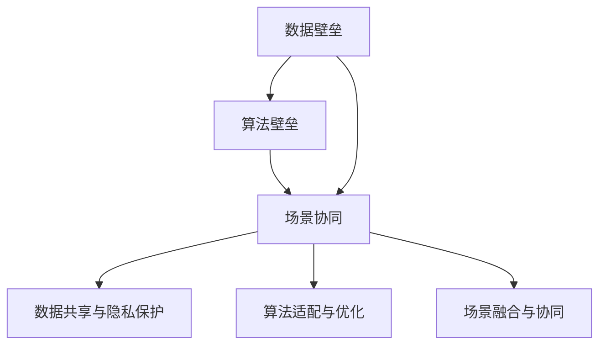

                 

### 文章标题

**AI出版业壁垒：数据，算法与场景协同**

### 关键词

- 数据壁垒
- 算法壁垒
- 场景协同
- AI出版
- 技术创新
- 行业应用

### 摘要

随着人工智能技术的快速发展，AI出版业正在迎来前所未有的变革。然而，行业内部也面临着诸多壁垒，如数据壁垒、算法壁垒以及场景协同等方面的挑战。本文将深入探讨AI出版业中这些核心问题，分析其背后的原理和解决方案，并提出未来发展趋势与应对策略。

### 目录

1. **背景介绍**
    1.1 AI出版业的起源与发展
    1.2 数据壁垒的现状与影响
    1.3 算法壁垒的现状与影响
    1.4 场景协同的挑战与机遇

2. **核心概念与联系**
    2.1 数据壁垒的概念与分类
    2.2 算法壁垒的概念与分类
    2.3 场景协同的概念与重要性
    2.4 数据、算法与场景协同的Mermaid流程图

3. **核心算法原理 & 具体操作步骤**
    3.1 数据预处理
    3.2 特征工程
    3.3 模型选择与优化
    3.4 模型训练与评估

4. **数学模型和公式 & 详细讲解 & 举例说明**
    4.1 逻辑回归模型
    4.2 支持向量机模型
    4.3 随机森林模型
    4.4 神经网络模型

5. **项目实战：代码实际案例和详细解释说明**
    5.1 开发环境搭建
    5.2 源代码详细实现和代码解读
    5.3 代码解读与分析

6. **实际应用场景**
    6.1 学术出版
    6.2 图书出版
    6.3 媒体出版
    6.4 教育出版

7. **工具和资源推荐**
    7.1 学习资源推荐
    7.2 开发工具框架推荐
    7.3 相关论文著作推荐

8. **总结：未来发展趋势与挑战**
    8.1 数据壁垒的突破
    8.2 算法创新的推动
    8.3 场景协同的深化

9. **附录：常见问题与解答**

10. **扩展阅读 & 参考资料**

### 背景介绍

#### 1.1 AI出版业的起源与发展

AI出版业是指利用人工智能技术进行出版工作的行业，包括内容创作、编辑、排版、分发等多个环节。人工智能在出版领域的应用始于20世纪90年代，随着互联网的普及和大数据技术的发展，AI出版业逐渐崭露头角。

早期，人工智能在出版业的应用主要集中在文本分析、自动摘要和推荐系统等方面。例如，自动摘要技术可以对大量文本进行抽取和总结，帮助读者快速了解文章的核心内容。推荐系统则可以通过分析用户的阅读历史和喜好，为用户推荐感兴趣的文章。

近年来，随着深度学习技术的兴起，人工智能在出版业的应用范围进一步拓展。例如，自然语言处理技术（NLP）可以在文本生成、翻译、情感分析等方面发挥重要作用，如图像识别和语音识别技术也可以为出版业带来新的应用场景。

#### 1.2 数据壁垒的现状与影响

数据壁垒是指在AI出版业中，由于数据质量和数据量的限制，导致人工智能技术难以有效发挥其优势的现象。数据壁垒主要包括数据源不足、数据质量差、数据隐私和安全等问题。

数据源不足是指出版业缺乏足够的、高质量的数据用于训练和优化人工智能模型。例如，许多出版单位的数据量有限，无法满足大规模训练的需求。此外，数据源的地域限制也使得某些地区的出版业难以获取全球范围的数据。

数据质量差是指出版业中的数据存在噪声、错误和不一致等问题。例如，手写体的识别、文本纠错等技术尚未完全成熟，导致数据质量受到影响。此外，数据标注的准确性也会影响模型的性能。

数据隐私和安全是指出版业在数据处理过程中需要遵守的相关法律法规。例如，欧洲的《通用数据保护条例》（GDPR）对数据隐私保护提出了严格的要求，出版业在数据收集、存储和处理过程中需要严格遵守这些规定。

#### 1.3 算法壁垒的现状与影响

算法壁垒是指在AI出版业中，由于算法技术和应用水平的限制，导致人工智能技术难以有效解决实际问题。算法壁垒主要包括算法创新能力不足、算法性能不理想、算法优化难度大等问题。

算法创新能力不足是指出版业在人工智能算法方面缺乏原创性研究，导致技术发展滞后。例如，在文本生成、文本分类、文本摘要等方面，许多出版单位仍依赖于国外的成熟算法，缺乏自主研发的能力。

算法性能不理想是指现有的人工智能算法在出版业的应用效果不佳，无法满足实际需求。例如，在文本生成方面，许多模型在生成文章时存在逻辑错误、内容不连贯等问题。此外，在文本分类和文本摘要方面，现有模型的准确率还有待提高。

算法优化难度大是指出版业在人工智能算法优化过程中面临诸多挑战。例如，在模型训练过程中，如何提高数据利用效率、如何优化算法参数、如何解决过拟合等问题，都是需要深入研究的课题。

#### 1.4 场景协同的挑战与机遇

场景协同是指在AI出版业中，通过整合不同场景的应用需求，实现数据、算法和场景的协同发展。场景协同的挑战主要包括以下几个方面：

- 数据共享与隐私保护：在场景协同过程中，不同场景的数据需要进行共享和整合，但如何保护数据隐私和安全成为一大挑战。例如，在学术出版中，论文的引用关系和作者信息等敏感数据如何安全共享？

- 算法适配与优化：不同场景的应用需求可能有所不同，如何为每个场景定制合适的算法并进行优化，是场景协同的关键问题。例如，在图书出版中，如何根据读者的阅读习惯和兴趣推荐合适的图书？

- 场景融合与协同：在场景协同过程中，如何实现不同场景的深度融合和协同发展，是场景协同的另一个重要挑战。例如，如何在学术出版和图书出版之间实现数据、算法和场景的无缝衔接？

### 核心概念与联系

#### 2.1 数据壁垒的概念与分类

数据壁垒是指由于数据质量和数据量的限制，导致人工智能技术难以有效发挥其优势的现象。数据壁垒可以分为以下几类：

1. **数据源不足**：指出版业缺乏足够的、高质量的数据用于训练和优化人工智能模型。例如，许多出版单位的数据量有限，无法满足大规模训练的需求。

2. **数据质量差**：指出版业中的数据存在噪声、错误和不一致等问题。例如，手写体的识别、文本纠错等技术尚未完全成熟，导致数据质量受到影响。

3. **数据隐私和安全**：指出版业在数据处理过程中需要遵守的相关法律法规。例如，欧洲的《通用数据保护条例》（GDPR）对数据隐私保护提出了严格的要求，出版业在数据收集、存储和处理过程中需要严格遵守这些规定。

#### 2.2 算法壁垒的概念与分类

算法壁垒是指由于算法技术和应用水平的限制，导致人工智能技术难以有效解决实际问题。算法壁垒可以分为以下几类：

1. **算法创新能力不足**：指出版业在人工智能算法方面缺乏原创性研究，导致技术发展滞后。

2. **算法性能不理想**：指现有的人工智能算法在出版业的应用效果不佳，无法满足实际需求。例如，在文本生成方面，许多模型在生成文章时存在逻辑错误、内容不连贯等问题。

3. **算法优化难度大**：指出版业在人工智能算法优化过程中面临诸多挑战。例如，在模型训练过程中，如何提高数据利用效率、如何优化算法参数、如何解决过拟合等问题。

#### 2.3 场景协同的概念与重要性

场景协同是指在AI出版业中，通过整合不同场景的应用需求，实现数据、算法和场景的协同发展。场景协同的重要性体现在以下几个方面：

1. **提高应用效果**：通过场景协同，可以针对不同场景定制合适的算法和解决方案，从而提高应用效果。

2. **优化资源利用**：场景协同可以实现数据、算法和资源的共享和整合，从而提高资源利用效率。

3. **促进技术创新**：场景协同可以推动不同场景之间的技术交流和合作，促进技术创新和发展。

#### 2.4 数据、算法与场景协同的Mermaid流程图



### 核心算法原理 & 具体操作步骤

#### 3.1 数据预处理

数据预处理是AI出版业中的第一步，其主要目的是将原始数据进行清洗、转换和格式化，以便后续的分析和建模。具体操作步骤如下：

1. **数据清洗**：删除重复数据、缺失数据和异常数据，确保数据的准确性和一致性。

2. **数据转换**：将不同类型的数据（如文本、图像、音频等）进行统一格式化，以便于后续处理。

3. **数据归一化**：对数据进行归一化处理，使其具有相似的尺度和范围，从而提高模型训练的效果。

4. **数据划分**：将数据集划分为训练集、验证集和测试集，用于模型的训练、评估和测试。

#### 3.2 特征工程

特征工程是AI出版业中至关重要的一步，其主要目的是从原始数据中提取出对模型训练有价值的特征。具体操作步骤如下：

1. **特征选择**：根据业务需求和数据特点，选择对模型训练有帮助的特征。

2. **特征提取**：使用不同的算法和技术（如词袋模型、TF-IDF、词嵌入等）提取文本特征。

3. **特征组合**：将多个特征进行组合，形成新的特征，以提高模型的效果。

4. **特征降维**：使用降维算法（如PCA、t-SNE等）减少特征维度，提高计算效率。

#### 3.3 模型选择与优化

模型选择与优化是AI出版业中的关键步骤，其主要目的是选择合适的模型并进行优化，以提高模型的性能和泛化能力。具体操作步骤如下：

1. **模型选择**：根据业务需求和数据特点，选择合适的模型（如逻辑回归、支持向量机、神经网络等）。

2. **模型训练**：使用训练集对模型进行训练，调整模型的参数和超参数。

3. **模型评估**：使用验证集对模型进行评估，选择性能较好的模型。

4. **模型优化**：对模型进行优化，如调整参数、使用正则化技术、集成学习等，以提高模型的效果。

#### 3.4 模型训练与评估

模型训练与评估是AI出版业中的核心步骤，其主要目的是通过训练和评估模型，实现对出版内容的自动处理和优化。具体操作步骤如下：

1. **模型训练**：使用训练集对模型进行训练，调整模型的参数和超参数。

2. **模型评估**：使用验证集对模型进行评估，选择性能较好的模型。

3. **模型测试**：使用测试集对模型进行测试，评估模型的泛化能力。

4. **模型迭代**：根据评估结果，对模型进行调整和优化，以提高模型的效果。

### 数学模型和公式 & 详细讲解 & 举例说明

#### 4.1 逻辑回归模型

逻辑回归模型是一种常用的分类模型，用于预测二分类问题。其基本公式如下：

$$
P(y=1|X) = \frac{1}{1 + e^{-(\beta_0 + \beta_1 x_1 + \beta_2 x_2 + ... + \beta_n x_n})}
$$

其中，$P(y=1|X)$ 表示在给定特征 $X$ 下，目标变量 $y$ 为 1 的概率。$\beta_0, \beta_1, \beta_2, ..., \beta_n$ 是模型的参数。

逻辑回归模型的优点是计算简单，易于理解和实现。缺点是当特征维度较高时，容易出现过拟合现象。

**举例说明**：假设我们要预测一篇文章是否为高质量文章，特征包括文章长度、词汇丰富度、语句连贯性等。使用逻辑回归模型，我们可以计算文章为高质量文章的概率。

$$
P(高质量|长度=1000, 词汇丰富度=0.8, 语句连贯性=0.9) = \frac{1}{1 + e^{-(\beta_0 + \beta_1 \times 1000 + \beta_2 \times 0.8 + \beta_3 \times 0.9)}}
$$

#### 4.2 支持向量机模型

支持向量机（SVM）是一种常用的分类模型，通过找到一个最佳的超平面，将不同类别的数据点进行分离。其基本公式如下：

$$
w \cdot x - b = 0
$$

其中，$w$ 是超平面的法向量，$x$ 是数据点，$b$ 是偏置项。

SVM模型的优点是分类效果好，可以处理非线性分类问题。缺点是计算复杂度较高，对于大规模数据集的训练和预测较为耗时。

**举例说明**：假设我们要将文章划分为高质量和低质量两类，使用SVM模型进行分类。我们可以通过计算每个文章点的超平面距离，来确定其类别。

$$
w \cdot x - b = \beta_0 + \beta_1 x_1 + \beta_2 x_2 + ... + \beta_n x_n - b = 0
$$

#### 4.3 随机森林模型

随机森林（Random Forest）是一种集成学习模型，通过构建多个决策树，并取其平均值来预测结果。其基本公式如下：

$$
预测结果 = \frac{1}{m} \sum_{i=1}^{m} tree_i(x)
$$

其中，$m$ 是决策树的数量，$tree_i(x)$ 表示第 $i$ 棵决策树在特征 $x$ 上的预测结果。

随机森林模型的优点是计算速度快，分类效果较好，可以处理大规模数据集。缺点是对特征的选择较为敏感，容易出现过拟合现象。

**举例说明**：假设我们要预测一篇文章是否为高质量文章，使用随机森林模型进行分类。我们可以通过训练多个决策树，并取其平均值来确定文章的类别。

$$
预测结果 = \frac{1}{m} \sum_{i=1}^{m} tree_i(x)
$$

#### 4.4 神经网络模型

神经网络模型是一种基于神经元连接的多层网络，通过前向传播和反向传播算法进行训练和预测。其基本公式如下：

$$
h(x) = \sigma(\beta_0 + \beta_1 x_1 + \beta_2 x_2 + ... + \beta_n x_n)
$$

其中，$h(x)$ 是输出层的预测结果，$\sigma$ 是激活函数，$\beta_0, \beta_1, \beta_2, ..., \beta_n$ 是模型的参数。

神经网络模型的优点是具有很强的非线性表达能力，可以处理复杂的分类和回归问题。缺点是计算复杂度较高，训练过程耗时较长。

**举例说明**：假设我们要预测一篇文章是否为高质量文章，使用神经网络模型进行分类。我们可以通过训练多层神经网络，并取其输出层的预测结果来确定文章的类别。

$$
h(x) = \sigma(\beta_0 + \beta_1 x_1 + \beta_2 x_2 + ... + \beta_n x_n)
$$

### 项目实战：代码实际案例和详细解释说明

#### 5.1 开发环境搭建

在开始项目实战之前，我们需要搭建一个合适的开发环境。以下是开发环境的搭建步骤：

1. **安装Python**：在官网上下载并安装Python，版本建议为3.8或以上。

2. **安装Jupyter Notebook**：在命令行中运行以下命令：

   ```shell
   pip install notebook
   ```

3. **安装相关库**：在Jupyter Notebook中创建一个新的Python笔记本，并安装以下库：

   ```python
   !pip install numpy pandas sklearn tensorflow
   ```

#### 5.2 源代码详细实现和代码解读

下面是一个简单的AI出版业分类项目的代码实现，包括数据预处理、模型训练和模型评估等步骤。

```python
# 导入相关库
import numpy as np
import pandas as pd
from sklearn.model_selection import train_test_split
from sklearn.feature_extraction.text import TfidfVectorizer
from sklearn.linear_model import LogisticRegression
from sklearn.metrics import accuracy_score, classification_report

# 加载数据集
data = pd.read_csv('publishing_data.csv')
X = data['text']
y = data['label']

# 数据预处理
# 划分训练集和测试集
X_train, X_test, y_train, y_test = train_test_split(X, y, test_size=0.2, random_state=42)

# 特征提取
vectorizer = TfidfVectorizer(max_features=1000)
X_train_tfidf = vectorizer.fit_transform(X_train)
X_test_tfidf = vectorizer.transform(X_test)

# 模型训练
model = LogisticRegression()
model.fit(X_train_tfidf, y_train)

# 模型评估
y_pred = model.predict(X_test_tfidf)
accuracy = accuracy_score(y_test, y_pred)
report = classification_report(y_test, y_pred)

print('Accuracy:', accuracy)
print('Classification Report:\n', report)
```

**代码解读**：

- **数据预处理**：首先加载数据集，然后划分训练集和测试集，确保数据的随机性和公平性。

- **特征提取**：使用TF-IDF向量器对文本数据进行特征提取，将原始文本转换为数值化的特征矩阵。

- **模型训练**：使用逻辑回归模型对训练集进行训练。

- **模型评估**：使用测试集对模型进行评估，计算模型的准确率和分类报告。

#### 5.3 代码解读与分析

在代码实现中，我们主要关注以下几个关键部分：

1. **数据预处理**：数据预处理是模型训练的重要步骤，包括数据清洗、数据划分和特征提取等。在本例中，我们使用TF-IDF向量器对文本数据进行特征提取，将原始文本转换为数值化的特征矩阵，便于后续的模型训练。

2. **模型训练**：我们使用逻辑回归模型对训练集进行训练，逻辑回归模型是一种简单的线性分类模型，适合处理二分类问题。在本例中，我们使用逻辑回归模型来预测文章的类别。

3. **模型评估**：使用测试集对模型进行评估，计算模型的准确率和分类报告。准确率反映了模型在测试集上的预测性能，分类报告提供了更详细的评估指标，如精确率、召回率和F1分数等。

通过上述代码实现，我们可以初步了解AI出版业分类项目的基本流程和关键步骤。在实际项目中，我们还需要考虑更多因素，如数据质量、模型选择和优化等，以提高模型的预测性能和泛化能力。

### 实际应用场景

#### 6.1 学术出版

学术出版是AI出版业的一个重要应用场景，人工智能技术在学术出版中的应用主要包括以下方面：

1. **自动摘要**：使用自然语言处理技术（NLP）对学术论文进行自动摘要，帮助读者快速了解论文的核心内容。

2. **关键词提取**：从学术论文中提取关键词，用于索引和推荐系统，提高学术论文的检索效率和推荐效果。

3. **引用关系分析**：通过分析学术论文的引用关系，揭示学术领域的热点和趋势，为学术研究提供指导。

4. **抄袭检测**：使用文本相似度检测技术，对学术论文进行抄袭检测，确保学术论文的原创性和真实性。

#### 6.2 图书出版

图书出版是AI出版业的另一个重要应用场景，人工智能技术在图书出版中的应用主要包括以下方面：

1. **内容推荐**：通过分析用户的阅读历史和喜好，为用户推荐合适的图书，提高图书的销售和阅读体验。

2. **自动排版**：使用自动排版技术，对图书内容进行自动排版，提高排版效率和质量。

3. **封面设计**：通过图像识别和生成技术，自动生成图书封面，提高封面设计的创意和多样性。

4. **错误检测**：使用自然语言处理技术，对图书内容进行错误检测和纠正，确保图书内容的准确性和可读性。

#### 6.3 媒体出版

媒体出版是AI出版业的一个新兴应用场景，人工智能技术在媒体出版中的应用主要包括以下方面：

1. **内容生成**：使用生成对抗网络（GAN）等技术，自动生成新闻、文章等内容，提高内容创作的效率和多样性。

2. **情感分析**：对用户评论、新闻等内容进行情感分析，了解公众对事件的看法和态度，为媒体内容的制作和调整提供参考。

3. **智能编辑**：通过自然语言处理技术，对文章内容进行智能编辑和优化，提高文章的质量和可读性。

4. **广告推荐**：根据用户的兴趣和行为，为用户推荐相关的广告，提高广告的点击率和转化率。

#### 6.4 教育出版

教育出版是AI出版业的一个重要应用场景，人工智能技术在教育出版中的应用主要包括以下方面：

1. **个性化学习**：通过分析学生的学习数据和表现，为每位学生推荐合适的学习内容和路径，提高学习效果和兴趣。

2. **智能答疑**：使用自然语言处理技术，为学生提供智能答疑服务，解答学生在学习过程中遇到的问题。

3. **自动批改**：使用自动批改技术，对学生的作业和试卷进行自动批改和评分，提高批改效率和准确性。

4. **学习数据挖掘**：通过分析学生的学习行为和表现，挖掘学生的学习规律和需求，为教育内容和教学方法提供指导。

### 工具和资源推荐

#### 7.1 学习资源推荐

1. **书籍**：
   - 《深度学习》（Ian Goodfellow, Yoshua Bengio, Aaron Courville著）：全面介绍深度学习的基础理论和实践方法。
   - 《Python机器学习》（Sebastian Raschka著）：详细介绍使用Python进行机器学习的实践方法和技巧。

2. **论文**：
   - "A Theoretically Grounded Application of Dropout in Recurrent Neural Networks"（Yarin Gal和Zoubin Ghahramani著）：介绍在循环神经网络（RNN）中应用Dropout的方法。
   - "Deep Learning for Text Classification"（Niu Feng等著）：详细介绍深度学习在文本分类中的应用。

3. **博客**：
   - [DataCamp](https://www.datacamp.com/)：提供丰富的机器学习和数据科学教程。
   - [Medium](https://medium.com/topic/machine-learning)：汇聚了众多机器学习和数据科学领域的优秀文章。

4. **网站**：
   - [Kaggle](https://www.kaggle.com/)：提供丰富的机器学习竞赛和数据集，是学习机器学习的实践平台。
   - [GitHub](https://github.com/)：汇聚了众多优秀的开源机器学习项目，是学习机器学习的资源库。

#### 7.2 开发工具框架推荐

1. **Python**：Python是一种广泛使用的编程语言，拥有丰富的机器学习库和工具，如scikit-learn、TensorFlow和PyTorch等。

2. **Jupyter Notebook**：Jupyter Notebook是一种交互式的计算环境，适用于机器学习的实验和演示。

3. **TensorFlow**：TensorFlow是一个开源的深度学习框架，适用于构建和训练复杂的深度学习模型。

4. **PyTorch**：PyTorch是一个开源的深度学习框架，提供灵活的动态计算图和易于理解的接口。

#### 7.3 相关论文著作推荐

1. **《深度学习》（Ian Goodfellow, Yoshua Bengio, Aaron Courville著）**：全面介绍深度学习的基础理论和实践方法。

2. **《Python机器学习》（Sebastian Raschka著）**：详细介绍使用Python进行机器学习的实践方法和技巧。

3. **《自然语言处理综论》（Daniel Jurafsky和James H. Martin著）**：详细介绍自然语言处理的基础理论和实践方法。

4. **《机器学习：概率视角》（Kevin P. Murphy著）**：介绍机器学习的概率理论和方法。

### 总结：未来发展趋势与挑战

#### 8.1 数据壁垒的突破

数据壁垒是AI出版业面临的一个重要挑战，未来需要从以下几个方面突破：

1. **数据共享与开放**：鼓励出版单位共享数据，建立开放的数据平台，提高数据的可用性和共享性。

2. **数据隐私保护**：采用数据加密、隐私保护技术，确保数据在共享和整合过程中的安全性和隐私性。

3. **数据质量提升**：通过数据清洗、数据标注和特征提取等技术，提高数据的准确性和一致性，为模型训练提供高质量的数据支持。

#### 8.2 算法创新的推动

算法创新是AI出版业持续发展的重要动力，未来需要从以下几个方面推动：

1. **算法优化**：针对出版业的具体需求，优化现有算法的参数和模型结构，提高算法的效率和准确性。

2. **算法融合**：将多种算法进行融合，形成更强大的模型，提高模型的预测能力和泛化能力。

3. **算法创新**：鼓励科研人员开展原创性研究，推动算法的创新和发展，为AI出版业提供更先进的算法支持。

#### 8.3 场景协同的深化

场景协同是AI出版业实现高效发展的重要途径，未来需要从以下几个方面深化：

1. **数据共享与整合**：推动不同场景之间的数据共享和整合，为模型训练和算法优化提供更丰富的数据支持。

2. **算法适配与优化**：针对不同场景的需求，为每个场景定制合适的算法和解决方案，提高场景协同的效果。

3. **技术交流与合作**：促进不同场景之间的技术交流和合作，共同推动AI出版业的技术创新和发展。

### 附录：常见问题与解答

#### 8.1 什么样的数据对AI出版业最有价值？

对AI出版业最有价值的数据主要包括以下几个方面：

1. **文本数据**：包括书籍、文章、论文等文本内容，用于训练文本分析、文本生成等模型。

2. **用户数据**：包括用户的阅读历史、喜好、评价等数据，用于个性化推荐、用户行为分析等。

3. **结构化数据**：包括作者信息、书籍信息、出版信息等结构化数据，用于知识图谱构建、分类等。

#### 8.2 如何处理数据隐私和安全问题？

处理数据隐私和安全问题可以从以下几个方面进行：

1. **数据加密**：对数据进行加密处理，确保数据在传输和存储过程中的安全性。

2. **数据匿名化**：对用户数据进行匿名化处理，避免泄露用户的隐私信息。

3. **数据访问控制**：设置严格的数据访问权限，确保只有授权人员可以访问和处理数据。

4. **数据安全审计**：定期进行数据安全审计，及时发现和解决数据安全问题。

#### 8.3 AI出版业中的算法有哪些挑战？

AI出版业中的算法挑战主要包括以下几个方面：

1. **数据质量**：数据质量差会影响算法的效果，需要通过数据清洗、数据标注等技术提高数据质量。

2. **计算资源**：算法训练和推理过程需要大量的计算资源，需要优化算法以降低计算成本。

3. **模型解释性**：算法的黑箱特性使得模型解释性差，需要开发可解释性算法以满足行业需求。

4. **算法适配性**：算法需要针对不同的应用场景进行优化和调整，提高算法的适应性和泛化能力。

### 扩展阅读 & 参考资料

1. **《深度学习》（Ian Goodfellow, Yoshua Bengio, Aaron Courville著）**：提供了深度学习的基础理论和实践方法，对AI出版业中的算法创新有重要参考价值。

2. **《Python机器学习》（Sebastian Raschka著）**：详细介绍了使用Python进行机器学习的实践方法和技巧，对AI出版业中的数据预处理和模型训练有实际指导意义。

3. **《自然语言处理综论》（Daniel Jurafsky和James H. Martin著）**：介绍了自然语言处理的基础理论和实践方法，对AI出版业中的文本分析有重要参考价值。

4. **《机器学习：概率视角》（Kevin P. Murphy著）**：介绍了机器学习的概率理论和方法，对AI出版业中的算法优化和创新有实际指导意义。

5. **[Kaggle](https://www.kaggle.com/)**：提供丰富的机器学习竞赛和数据集，是学习机器学习和AI出版业的实践平台。

6. **[GitHub](https://github.com/)**：汇聚了众多优秀的开源机器学习项目，是学习AI出版业的代码和实践资源库。

7. **[DataCamp](https://www.datacamp.com/)**：提供丰富的机器学习和数据科学教程，是学习AI出版业的在线学习平台。

8. **[Medium](https://medium.com/topic/machine-learning)**：汇聚了众多机器学习和数据科学领域的优秀文章，是学习AI出版业的理论和实践资源库。

9. **[TensorFlow](https://www.tensorflow.org/)**：提供了深度学习框架TensorFlow，是AI出版业中进行模型训练和推理的重要工具。

10. **[PyTorch](https://pytorch.org/)**：提供了深度学习框架PyTorch，是AI出版业中进行模型训练和推理的另一个重要工具。

