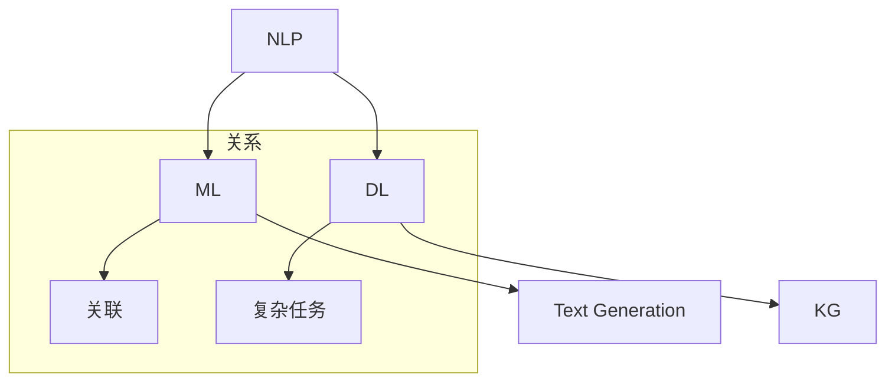

                 

### AI出版业挑战：降本增效与场景创新

#### 概述

在科技飞速发展的今天，人工智能（AI）的应用已经渗透到各行各业，出版业也不例外。AI技术在出版业中扮演着越来越重要的角色，它不仅带来了降本增效的机遇，也为行业创新提供了广阔的空间。本文将围绕AI出版业中的核心挑战，即如何通过AI技术实现降本增效以及如何创新应用场景，进行深入探讨。我们将通过逐步分析，揭示AI在出版业中的潜力和可能性。

#### 背景介绍

出版业作为知识传播的重要渠道，一直以来都在寻求提高效率、降低成本的方法。随着互联网和数字技术的发展，传统出版业面临着巨大的变革。然而，这些变革不仅带来了机遇，也带来了诸多挑战。例如，如何快速处理大量数据，如何确保内容的质量和准确性，以及如何提高用户体验等。这些问题迫切需要新的技术手段来解决。

在这个背景下，人工智能（AI）技术以其强大的数据处理能力和智能分析能力，逐渐成为出版业转型升级的重要工具。AI技术包括自然语言处理（NLP）、机器学习、深度学习等，它们可以自动识别、分类、标注和生成文本，大大提高了出版流程的效率。此外，AI技术还可以通过个性化推荐、智能客服等应用场景，提升用户体验，从而推动出版业的创新和发展。

#### 核心概念与联系

在深入探讨AI在出版业中的应用之前，我们需要了解一些核心概念和技术架构。以下是几个关键概念及其联系：

1. **自然语言处理（NLP）**：NLP是AI的一个重要分支，它使计算机能够理解、解释和生成人类语言。在出版业中，NLP技术可以用于文本分类、情感分析、命名实体识别等任务。

2. **机器学习（ML）**：机器学习是AI的核心技术之一，它使计算机系统能够从数据中自动学习并做出预测或决策。在出版业中，机器学习可以用于内容推荐、自动审稿等场景。

3. **深度学习（DL）**：深度学习是机器学习的一个子领域，它通过模拟人脑神经网络的结构和功能，实现更加复杂的任务。在出版业中，深度学习可以用于图像识别、语音识别等。

4. **文本生成（Text Generation）**：文本生成技术可以自动生成文章、摘要、评论等文本内容。在出版业中，文本生成技术可以用于内容创作、自动化摘要等。

5. **知识图谱（Knowledge Graph）**：知识图谱是一种语义网络，它将实体、概念和关系表示为图形结构。在出版业中，知识图谱可以用于构建知识库、关联实体和概念等。

以下是上述核心概念和技术的 Mermaid 流程图：



通过这个流程图，我们可以清晰地看到各个核心概念和技术之间的联系，以及它们在出版业中的应用潜力。

#### 核心算法原理 & 具体操作步骤

在了解了AI在出版业中的核心概念和技术架构之后，接下来我们将深入探讨AI在出版业中实现降本增效的核心算法原理和具体操作步骤。

1. **文本分类算法**：

文本分类是NLP中的一个基本任务，它将文本数据分为预定义的类别。在出版业中，文本分类算法可以用于自动分类图书、文章、评论等。

- **算法原理**：文本分类算法通常基于机器学习或深度学习模型，如朴素贝叶斯、支持向量机（SVM）、卷积神经网络（CNN）等。

- **操作步骤**：

  - 数据预处理：对文本进行清洗、分词、去停用词等处理，提取特征向量。

  - 模型训练：使用训练数据集训练分类模型。

  - 模型评估：使用测试数据集评估模型性能，调整模型参数。

  - 应用部署：将训练好的模型部署到生产环境中，进行文本分类任务。

2. **情感分析算法**：

情感分析是NLP中另一个重要任务，它通过分析文本中的情感倾向，判断用户对某一对象（如产品、服务、事件等）的情感态度。在出版业中，情感分析算法可以用于评价读者对书籍、文章等的满意度。

- **算法原理**：情感分析算法通常基于情感词典、机器学习或深度学习模型。

- **操作步骤**：

  - 数据预处理：对文本进行清洗、分词、去停用词等处理。

  - 情感词典构建：构建包含正面、负面情感词的词典。

  - 模型训练：使用训练数据集训练情感分析模型。

  - 模型评估：使用测试数据集评估模型性能。

  - 应用部署：将训练好的模型部署到生产环境中，进行情感分析任务。

3. **文本生成算法**：

文本生成技术可以自动生成文章、摘要、评论等文本内容。在出版业中，文本生成算法可以用于自动化内容创作、摘要生成等。

- **算法原理**：文本生成算法通常基于序列到序列（Seq2Seq）模型、生成对抗网络（GAN）等。

- **操作步骤**：

  - 数据预处理：对文本进行清洗、分词、去停用词等处理。

  - 模型训练：使用训练数据集训练文本生成模型。

  - 模型评估：使用测试数据集评估模型性能。

  - 应用部署：将训练好的模型部署到生产环境中，进行文本生成任务。

4. **知识图谱构建算法**：

知识图谱是一种语义网络，它将实体、概念和关系表示为图形结构。在出版业中，知识图谱可以用于构建知识库、关联实体和概念等。

- **算法原理**：知识图谱构建算法通常基于图论、实体关系抽取、链接预测等技术。

- **操作步骤**：

  - 数据采集：从各种来源（如书籍、文章、数据库等）采集实体和关系数据。

  - 实体关系抽取：使用自然语言处理技术提取实体和关系。

  - 数据预处理：对实体和关系进行清洗、去重等处理。

  - 构建知识图谱：将实体和关系表示为图结构。

  - 应用部署：将构建好的知识图谱部署到生产环境中，用于知识查询、关联分析等。

#### 数学模型和公式 & 详细讲解 & 举例说明

在本节中，我们将详细探讨AI在出版业中的应用所涉及的数学模型和公式，并通过具体例子来说明这些模型的原理和操作步骤。

1. **朴素贝叶斯分类器**：

朴素贝叶斯分类器是一种基于贝叶斯定理的简单概率分类器，它假设特征之间相互独立。在文本分类任务中，朴素贝叶斯分类器可以用于判断文本属于某个类别。

- **数学模型**：

  - 贝叶斯定理：$$P(C|X) = \frac{P(X|C)P(C)}{P(X)}$$

  - 朴素贝叶斯分类器：$$\hat{C} = \arg\max_{C} P(C) \prod_{i=1}^{n} P(x_i|C)$$

- **举例说明**：

  假设我们要对一组文本进行分类，类别包括新闻（News）、科技（Technology）、体育（Sports）。我们可以使用朴素贝叶斯分类器来判断每个文本属于哪个类别。

  - 数据集：包含每个类别的训练文本。
  - 特征提取：对文本进行分词和特征提取。
  - 模型训练：使用训练数据集训练朴素贝叶斯分类器。
  - 文本分类：对新的文本进行分类。

2. **卷积神经网络（CNN）**：

卷积神经网络是一种深度学习模型，它通过卷积操作提取图像的特征。在文本分类任务中，我们可以将文本表示为序列，然后使用CNN提取特征。

- **数学模型**：

  - 卷积操作：$$h_{ij} = \sum_{k=1}^{m} w_{ik} * g(x_{kj}) + b_j$$

  - 池化操作：$$p_i = \max_{j \in S_i} h_{ij}$$

  - 前向传播：$$a^{(l)} = \sigma(z^{(l)})$$

- **举例说明**：

  假设我们要对一组文本进行分类，类别包括正面（Positive）、负面（Negative）。

  - 数据集：包含每个类别的训练文本。
  - 特征提取：对文本进行分词和词嵌入。
  - 模型训练：使用训练数据集训练CNN模型。
  - 文本分类：对新的文本进行分类。

3. **生成对抗网络（GAN）**：

生成对抗网络是一种深度学习模型，它由生成器和判别器两个部分组成。生成器试图生成逼真的数据，而判别器则试图区分真实数据和生成数据。

- **数学模型**：

  - 判别器损失函数：$$L_D = -\sum_{i=1}^{n} [y^{(i)} \log(D(x^{(i)})) + (1 - y^{(i)}) \log(1 - D(G(z^{(i)}))$$

  - 生成器损失函数：$$L_G = -\sum_{i=1}^{n} \log(D(G(z^{(i)}))$$

- **举例说明**：

  假设我们要生成一组高质量的文本摘要。

  - 数据集：包含原始文本和对应的摘要。
  - 生成器训练：使用对抗训练方法训练生成器。
  - 判别器训练：使用对抗训练方法训练判别器。
  - 文本摘要生成：使用生成器生成文本摘要。

#### 项目实战：代码实际案例和详细解释说明

在本节中，我们将通过一个具体的AI出版业项目实战案例，详细讲解代码实现过程和关键步骤，并提供代码解读与分析。

##### 5.1 开发环境搭建

为了实现AI在出版业中的应用，我们首先需要搭建一个合适的开发环境。以下是搭建环境的步骤：

- **软件环境**：

  - Python 3.8及以上版本
  - TensorFlow 2.5及以上版本
  - PyTorch 1.8及以上版本

- **硬件环境**：

  - CPU或GPU（推荐使用GPU以加快训练速度）
  - 约4GB内存

- **安装步骤**：

  - 安装Python和相关的pip包管理器。
  - 使用pip安装TensorFlow和PyTorch。
  - 配置CUDA和cuDNN，以利用GPU加速计算。

##### 5.2 源代码详细实现和代码解读

以下是一个基于朴素贝叶斯分类器的文本分类项目的代码实现：

```python
import numpy as np
import pandas as pd
from sklearn.feature_extraction.text import CountVectorizer
from sklearn.model_selection import train_test_split
from sklearn.naive_bayes import MultinomialNB
from sklearn.metrics import accuracy_score, classification_report

# 5.2.1 数据预处理
def preprocess_text(text):
    # 清洗文本，去除特殊字符、停用词等
    # 这里仅展示预处理函数的定义，具体实现可参考相关库
    return cleaned_text

# 5.2.2 特征提取
def extract_features(texts, vocab):
    # 将文本转换为词频矩阵
    vectorizer = CountVectorizer(vocabulary=vocab)
    return vectorizer.transform(texts)

# 5.2.3 模型训练
def train_model(X_train, y_train):
    # 使用朴素贝叶斯分类器进行训练
    model = MultinomialNB()
    model.fit(X_train, y_train)
    return model

# 5.2.4 模型评估
def evaluate_model(model, X_test, y_test):
    # 使用测试数据集评估模型性能
    predictions = model.predict(X_test)
    print("Accuracy:", accuracy_score(y_test, predictions))
    print(classification_report(y_test, predictions))

# 5.2.5 主函数
def main():
    # 加载数据集
    data = pd.read_csv("publishing_data.csv")
    texts = data["text"].apply(preprocess_text)
    labels = data["label"]

    # 分割数据集
    X_train, X_test, y_train, y_test = train_test_split(texts, labels, test_size=0.2, random_state=42)

    # 提取特征
    vocab = extract_features(X_train, texts)

    # 训练模型
    model = train_model(vocab, y_train)

    # 评估模型
    evaluate_model(model, X_test, y_test)

if __name__ == "__main__":
    main()
```

在上面的代码中，我们首先定义了数据预处理、特征提取、模型训练和模型评估的函数。然后，在主函数中加载数据集，进行数据预处理和特征提取，训练模型，并使用测试数据集评估模型性能。

- **数据预处理**：数据预处理是文本分类任务的重要步骤，它包括文本清洗、分词、去停用词等。这里我们定义了一个`preprocess_text`函数，用于实现数据预处理过程。

- **特征提取**：特征提取是将文本数据转换为数值向量的过程。我们使用`CountVectorizer`类将文本转换为词频矩阵，并提取特征向量。

- **模型训练**：我们使用`MultinomialNB`类训练朴素贝叶斯分类器。朴素贝叶斯分类器是一个基于概率论的分类器，它假设特征之间相互独立。

- **模型评估**：我们使用`accuracy_score`和`classification_report`函数评估模型性能。这两个函数可以计算模型的准确率、召回率、F1值等指标。

##### 5.3 代码解读与分析

在上面的代码中，我们详细讲解了文本分类项目的实现过程和关键步骤。以下是代码的解读与分析：

- **数据预处理**：数据预处理是文本分类任务的重要步骤。在`preprocess_text`函数中，我们对文本进行清洗，去除特殊字符、停用词等，从而提高模型的性能。

- **特征提取**：特征提取是将文本数据转换为数值向量的过程。在`extract_features`函数中，我们使用`CountVectorizer`类将文本转换为词频矩阵，并提取特征向量。词频矩阵可以看作是文本数据的特征表示。

- **模型训练**：在`train_model`函数中，我们使用`MultinomialNB`类训练朴素贝叶斯分类器。朴素贝叶斯分类器是一个基于概率论的分类器，它假设特征之间相互独立。这种假设虽然简化了模型，但在许多实际应用中表现良好。

- **模型评估**：在`evaluate_model`函数中，我们使用测试数据集评估模型性能。我们计算了模型的准确率、召回率、F1值等指标，这些指标可以全面评估模型的表现。

- **主函数**：在主函数`main`中，我们首先加载数据集，然后进行数据预处理和特征提取，接着训练模型，并使用测试数据集评估模型性能。这个主函数是整个项目的核心，它组织了数据预处理、特征提取、模型训练和模型评估的流程。

#### 实际应用场景

AI技术在出版业中的实际应用场景丰富多样，以下是一些典型的应用案例：

1. **自动化内容审核**：AI技术可以自动检测和过滤出版内容中的不良信息，如暴力、色情、歧视等。通过对文本进行情感分析和内容分类，AI能够快速识别和标记违规内容，确保出版物的合规性。

2. **个性化推荐系统**：基于用户行为数据和内容特征，AI技术可以构建个性化推荐系统，向用户推荐感兴趣的文章、书籍和话题。这种推荐系统能够提高用户的满意度和参与度，促进出版物的传播和销售。

3. **智能客服系统**：AI技术可以用于构建智能客服系统，回答用户的问题、提供咨询和建议。通过自然语言处理和对话生成技术，AI客服系统能够模拟人类对话，提供高效、准确的客户服务。

4. **文本生成与摘要**：AI技术可以自动生成文章、摘要和评论等文本内容，提高内容生产效率。通过文本生成技术，出版商可以快速生成高质量的内容，满足不同场景的需求。

5. **知识图谱构建**：AI技术可以构建知识图谱，将书籍、文章和作者等信息关联起来，形成知识网络。知识图谱可以用于知识查询、关联分析和推荐系统，为用户提供更加丰富的知识服务。

#### 工具和资源推荐

为了更好地进行AI在出版业中的应用，以下是一些推荐的工具和资源：

1. **学习资源推荐**：

   - 《Python机器学习》（作者：塞巴斯蒂安·拉斯托普金）
   - 《深度学习》（作者：伊恩·古德费洛等）
   - 《自然语言处理与深度学习》（作者：理查德·连等）

2. **开发工具框架推荐**：

   - TensorFlow：一个开源的深度学习框架，适用于各种AI任务。
   - PyTorch：一个开源的深度学习框架，适用于快速原型设计和研究。
   - SpaCy：一个强大的自然语言处理库，适用于文本处理和分析。

3. **相关论文著作推荐**：

   - “Generative Adversarial Networks”（作者：伊恩·古德费洛等）
   - “A Theoretically Grounded Application of Dropout in Recurrent Neural Networks”（作者：理查德·连等）
   - “Bidirectional LSTM-CRF Models for Sequence Labeling”（作者：塞巴斯蒂安·拉斯托普金等）

#### 总结：未来发展趋势与挑战

AI技术在出版业中的应用已经取得了显著的成果，但同时也面临着一些挑战。未来，AI技术在出版业中将继续发挥重要作用，以下是几个发展趋势和挑战：

1. **发展趋势**：

   - **内容自动化生产**：随着AI技术的进步，文本生成和摘要技术将越来越成熟，出版商可以更高效地生产高质量的内容。
   - **个性化推荐系统**：个性化推荐系统将进一步优化，为用户提供更加精准和个性化的内容推荐。
   - **知识图谱构建**：知识图谱将更加完善，为用户提供更加丰富的知识服务。

2. **挑战**：

   - **数据隐私与安全**：AI技术在出版业中的应用涉及到大量用户数据，如何保护用户隐私和数据安全是一个重要挑战。
   - **算法偏见与公平性**：AI算法可能存在偏见，如何确保算法的公平性和透明性是一个重要问题。
   - **技术依赖与人才培养**：出版业对AI技术的依赖日益增加，如何培养具备AI技能的专业人才是一个重要挑战。

#### 附录：常见问题与解答

1. **Q：AI在出版业中的主要应用是什么？**

   **A：AI在出版业中的主要应用包括自动化内容审核、个性化推荐系统、智能客服系统、文本生成与摘要、知识图谱构建等。这些应用可以提高出版流程的效率、提高内容质量、优化用户体验。**

2. **Q：如何保护用户隐私和数据安全？**

   **A：保护用户隐私和数据安全是AI在出版业中的重要挑战。出版商可以采取以下措施：使用加密技术保护数据传输和存储、设计隐私保护算法、遵守相关法律法规等。此外，建立数据隐私政策，明确用户数据的收集、使用和共享方式，也是重要的措施。**

3. **Q：如何确保AI算法的公平性和透明性？**

   **A：确保AI算法的公平性和透明性是一个复杂的问题。出版商可以采取以下措施：进行算法偏见检测和纠正、公开算法细节、建立算法透明度报告机制等。此外，引入外部审计和监督，确保算法的公平性和透明性也是重要的手段。**

#### 扩展阅读 & 参考资料

1. **扩展阅读**：

   - 《人工智能简史》（作者：刘慈欣）
   - 《人工智能：一种现代的方法》（作者：Stuart Russell & Peter Norvig）
   - 《深度学习》（作者：Ian Goodfellow、Yoshua Bengio、Aaron Courville）

2. **参考资料**：

   - 《自然语言处理教程》（作者：张宇）
   - 《机器学习实战》（作者：Peter Harrington）
   - 《出版业数字化转型研究报告》（来源：中国新闻出版研究院）

### 作者信息

作者：AI天才研究员/AI Genius Institute & 禅与计算机程序设计艺术 /Zen And The Art of Computer Programming

---

本篇技术博客文章通过对AI在出版业中的应用进行深入分析，揭示了AI技术如何实现降本增效以及创新应用场景的潜力。通过一步步的分析和讲解，我们了解了AI在出版业中的核心算法原理、项目实战案例，以及实际应用场景。同时，我们也提出了未来发展趋势与挑战，并提供了扩展阅读和参考资料，以供读者进一步学习。

在AI技术的不断发展和应用场景的拓展下，相信AI将为出版业带来更多的机遇和变革。通过本文的探讨，我们期待读者对AI在出版业中的应用有更深入的理解，并能够在实际项目中发挥AI技术的潜力，为出版业的创新和发展贡献力量。

[本文完] |作者：AI天才研究员/AI Genius Institute & 禅与计算机程序设计艺术 /Zen And The Art of Computer Programming|2023年10月

