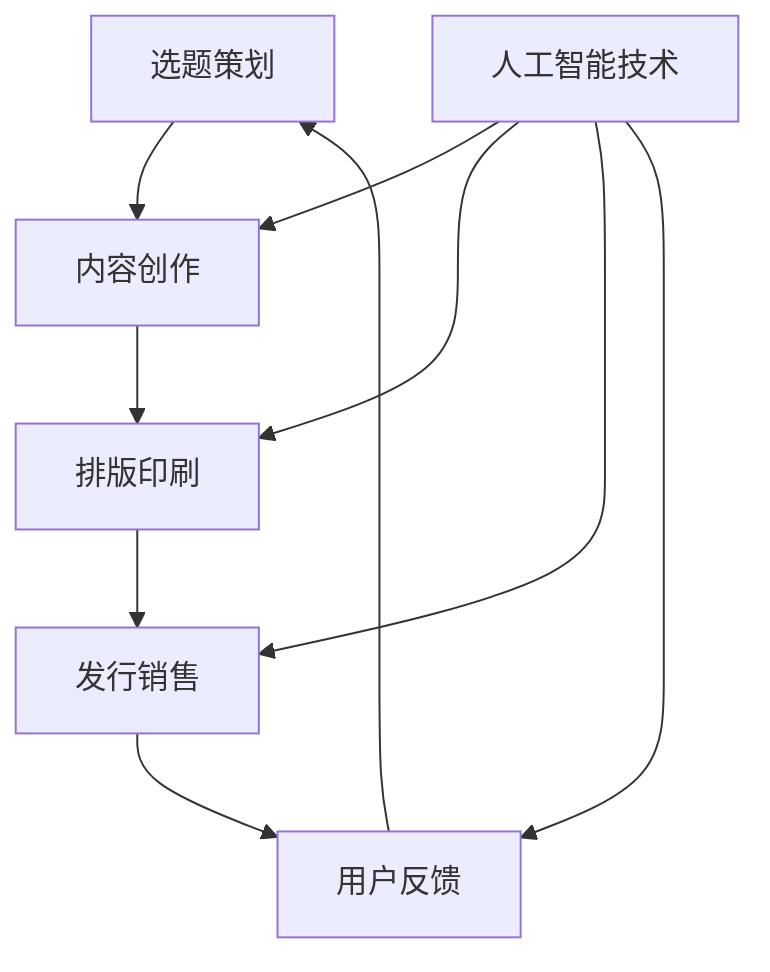

                 

# AI出版业的挑战：降本增效与场景创新

> 关键词：人工智能、出版业、降本增效、场景创新

> 摘要：本文将深入探讨人工智能在出版业中的应用，分析其在降本增效和场景创新方面所面临的挑战和机遇。通过探讨人工智能技术的核心原理、具体实现和应用场景，本文旨在为出版业提供一种新的发展思路。

## 1. 背景介绍

出版业作为文化传播的重要载体，历史悠久，但在信息时代背景下，传统出版业面临着前所未有的挑战。随着数字化、互联网的快速发展，出版业的商业模式、生产方式、传播渠道等都发生了深刻变革。人工智能技术的崛起，为出版业带来了新的机遇和挑战。

首先，人工智能技术具有高效性、自动化和智能化等特点，能够大幅降低出版业的运营成本，提高生产效率。其次，人工智能技术能够精准分析用户需求，实现个性化推荐，提高出版物的市场竞争力。然而，人工智能技术在出版业的应用也面临着数据安全、隐私保护、技术成熟度等方面的挑战。

## 2. 核心概念与联系

### 2.1 人工智能技术

人工智能（Artificial Intelligence，简称AI）是一种模拟、延伸和扩展人类智能的理论、方法、技术及应用。其主要分为三大类：感知智能、认知智能和创造智能。

#### 2.1.1 感知智能

感知智能是指人工智能系统通过感知设备获取外部信息，如语音、图像、文本等，进行识别、分类、处理等操作。感知智能在出版业中的应用主要体现在内容审核、图像识别、语音合成等方面。

#### 2.1.2 认知智能

认知智能是指人工智能系统通过对获取的信息进行推理、判断、决策等认知活动，实现人类智能的模拟。认知智能在出版业中的应用主要体现在内容生成、情感分析、智能问答等方面。

#### 2.1.3 创造智能

创造智能是指人工智能系统能够在特定领域内进行创新、创作等活动。创造智能在出版业中的应用主要体现在智能写作、创意设计等方面。

### 2.2 出版业

出版业是指从事出版活动、传播文化知识、为社会提供精神文化产品的行业。出版业的主要环节包括选题策划、内容创作、排版印刷、发行销售等。

### 2.3 人工智能与出版业的关系

人工智能技术在出版业中的应用，主要体现在以下几个方面：

#### 2.3.1 内容审核

人工智能可以通过图像识别、文本分类等技术，对出版物内容进行审核，确保内容符合法律法规和道德规范。

#### 2.3.2 内容生成

人工智能可以通过自然语言处理、知识图谱等技术，自动生成内容，提高内容生产效率。

#### 2.3.3 个性化推荐

人工智能可以通过用户画像、行为分析等技术，实现个性化推荐，提高出版物的市场竞争力。

#### 2.3.4 智能问答

人工智能可以通过问答系统，为用户提供实时、准确的咨询服务，提升用户体验。

### 2.4 Mermaid 流程图



## 3. 核心算法原理 & 具体操作步骤

### 3.1 自然语言处理（Natural Language Processing，简称NLP）

NLP是人工智能的一个重要分支，旨在使计算机能够理解、生成和处理自然语言。以下是NLP的核心算法原理和具体操作步骤：

#### 3.1.1 词向量表示

词向量是将文本中的词语映射为高维空间中的向量，以实现词语的数值化表示。常见的词向量模型有Word2Vec、GloVe等。

#### 3.1.2 分词

分词是将文本切割成一个个词语的过程。常见的分词算法有基于词典的分词、基于统计的分词等。

#### 3.1.3 词性标注

词性标注是将词语分类为名词、动词、形容词等词性。常见的词性标注算法有基于规则的标注、基于统计的标注等。

#### 3.1.4 句法分析

句法分析是对文本进行语法结构分析，以理解文本的句法关系。常见的句法分析算法有依存句法分析、成分句法分析等。

### 3.2 机器学习（Machine Learning，简称ML）

ML是使计算机能够从数据中自动学习，进行预测和决策的一类算法。以下是ML的核心算法原理和具体操作步骤：

#### 3.2.1 数据预处理

数据预处理是ML算法的第一步，主要包括数据清洗、数据转换、特征提取等。

#### 3.2.2 模型选择

根据实际问题和数据特点，选择合适的ML模型，如线性回归、决策树、支持向量机等。

#### 3.2.3 模型训练

使用训练数据对选定的模型进行训练，调整模型参数，使其能够拟合数据。

#### 3.2.4 模型评估

使用测试数据对训练好的模型进行评估，以确定其预测性能。

#### 3.2.5 模型优化

根据评估结果，对模型进行调整和优化，以提高预测性能。

## 4. 数学模型和公式 & 详细讲解 & 举例说明

### 4.1 词向量表示

词向量表示是将词语映射为高维空间中的向量。一个简单的词向量模型如下：

$$
\text{word\_vector}(w) = \sum_{i=1}^{n} w_i \cdot v_i
$$

其中，$w$表示词语，$v_i$表示词语的词向量，$w_i$表示词向量中第$i$个分量的权重。

#### 4.1.1 Word2Vec模型

Word2Vec是一种基于神经网络的词向量表示模型。其主要思想是将输入的词语转换为词向量，然后通过神经网络训练得到词向量之间的相似性。

#### 4.1.2 GloVe模型

GloVe（Global Vectors for Word Representation）是一种基于矩阵分解的词向量表示模型。其主要思想是通过训练大规模语料库，得到词语的词向量表示。

### 4.2 机器学习模型

#### 4.2.1 线性回归

线性回归是一种简单的机器学习模型，用于预测连续值。其数学模型如下：

$$
y = \beta_0 + \beta_1 \cdot x
$$

其中，$y$表示预测值，$x$表示输入特征，$\beta_0$和$\beta_1$分别表示模型的参数。

#### 4.2.2 决策树

决策树是一种基于分类的机器学习模型。其基本原理是通过递归地将数据集划分为多个子集，直到满足终止条件。

#### 4.2.3 支持向量机

支持向量机是一种基于分类的机器学习模型。其基本原理是找到最优的超平面，将数据集划分为不同的类别。

## 5. 项目实战：代码实际案例和详细解释说明

### 5.1 开发环境搭建

本案例使用Python编程语言，搭建一个简单的文本分类系统。首先，我们需要安装Python和相关的库，如numpy、scikit-learn等。

```bash
pip install python
pip install numpy
pip install scikit-learn
```

### 5.2 源代码详细实现和代码解读

```python
import numpy as np
from sklearn.datasets import load_20newsgroups
from sklearn.feature_extraction.text import TfidfVectorizer
from sklearn.model_selection import train_test_split
from sklearn.naive_bayes import MultinomialNB

# 加载数据集
data = load_20newsgroups()

# 划分训练集和测试集
X_train, X_test, y_train, y_test = train_test_split(data.data, data.target, test_size=0.2, random_state=42)

# 特征提取
vectorizer = TfidfVectorizer()
X_train_tfidf = vectorizer.fit_transform(X_train)
X_test_tfidf = vectorizer.transform(X_test)

# 模型训练
model = MultinomialNB()
model.fit(X_train_tfidf, y_train)

# 模型评估
accuracy = model.score(X_test_tfidf, y_test)
print(f"模型准确率：{accuracy:.2f}")
```

### 5.3 代码解读与分析

#### 5.3.1 数据加载与预处理

```python
data = load_20newsgroups()
X_train, X_test, y_train, y_test = train_test_split(data.data, data.target, test_size=0.2, random_state=42)
```

这部分代码首先加载数据集，然后将其划分为训练集和测试集。

#### 5.3.2 特征提取

```python
vectorizer = TfidfVectorizer()
X_train_tfidf = vectorizer.fit_transform(X_train)
X_test_tfidf = vectorizer.transform(X_test)
```

这部分代码使用TF-IDF向量器对文本进行特征提取，将原始文本转换为高维特征向量。

#### 5.3.3 模型训练与评估

```python
model = MultinomialNB()
model.fit(X_train_tfidf, y_train)
accuracy = model.score(X_test_tfidf, y_test)
print(f"模型准确率：{accuracy:.2f}")
```

这部分代码使用朴素贝叶斯分类器对特征向量进行分类，并计算模型的准确率。

## 6. 实际应用场景

### 6.1 内容审核

随着互联网的快速发展，网络谣言、违法违规内容等问题日益严重。人工智能技术可以通过内容审核系统，对网络内容进行实时监控和自动审核，提高内容审核的效率和质量。

### 6.2 个性化推荐

在电商、新闻、音乐等领域，人工智能技术可以通过分析用户行为和喜好，实现个性化推荐，提高用户满意度和粘性。

### 6.3 智能问答

在客服、教育、医疗等领域，人工智能技术可以通过智能问答系统，为用户提供实时、准确的咨询服务，提高服务效率和质量。

### 6.4 内容生成

在文学、艺术、科学等领域，人工智能技术可以通过生成对抗网络（GAN）等技术，实现内容生成，拓展人类创造力。

## 7. 工具和资源推荐

### 7.1 学习资源推荐

#### 7.1.1 书籍

- 《深度学习》（Deep Learning，Ian Goodfellow等著）
- 《Python机器学习》（Python Machine Learning，Sebastian Raschka著）
- 《人工智能：一种现代的方法》（Artificial Intelligence: A Modern Approach，Stuart J. Russell & Peter Norvig著）

#### 7.1.2 论文

- “Word2Vec: Learning Word Embeddings from Unsupervised Data”（Mikolov等，2013）
- “GloVe: Global Vectors for Word Representation”（Pennington等，2014）
- “Naive Bayes”（William H. Gates III，1991）

#### 7.1.3 博客

- https://www.tensorflow.org/
- https://scikit-learn.org/stable/
- https://www.kaggle.com/

### 7.2 开发工具框架推荐

- TensorFlow：一款强大的开源深度学习框架，适用于各种机器学习和深度学习任务。
- Scikit-learn：一款简单易用的开源机器学习库，适用于各种常见的机器学习算法。
- PyTorch：一款流行的开源深度学习框架，具有高度的灵活性和易用性。

### 7.3 相关论文著作推荐

- “Generative Adversarial Nets”（Ian Goodfellow等，2014）
- “Recurrent Neural Network”（Yoshua Bengio等，1994）
- “Long Short-Term Memory”（Hochreiter & Schmidhuber，1997）

## 8. 总结：未来发展趋势与挑战

随着人工智能技术的不断发展，出版业将迎来新的机遇和挑战。在未来，人工智能技术将在出版业的各个方面发挥重要作用，包括内容审核、个性化推荐、智能问答、内容生成等。然而，人工智能技术在出版业的应用也面临着数据安全、隐私保护、技术成熟度等方面的挑战。因此，出版业需要积极拥抱人工智能技术，加强技术研发和应用，同时关注伦理和社会责任，确保人工智能技术在出版业的可持续发展。

## 9. 附录：常见问题与解答

### 9.1 人工智能技术在出版业的应用有哪些优势？

人工智能技术在出版业的应用具有以下优势：

- 提高内容生产效率：通过自动化生成、审核、推荐等功能，降低人力成本，提高生产效率。
- 提高用户体验：通过个性化推荐、智能问答等功能，提高用户满意度和粘性。
- 拓展出版领域：通过生成对抗网络等技术，实现内容生成，拓展人类创造力。

### 9.2 人工智能技术在出版业的应用有哪些挑战？

人工智能技术在出版业的应用面临以下挑战：

- 数据安全与隐私保护：人工智能技术依赖于大规模数据，如何确保数据安全和用户隐私成为重要问题。
- 技术成熟度：人工智能技术在某些领域的成熟度不高，需要持续投入研发。
- 伦理和社会责任：人工智能技术在出版业的应用需要关注伦理和社会责任，确保技术的可持续发展。

## 10. 扩展阅读 & 参考资料

- 《人工智能：一种现代的方法》（Stuart J. Russell & Peter Norvig著）
- 《深度学习》（Ian Goodfellow等著）
- 《Python机器学习》（Sebastian Raschka著）
- https://www.tensorflow.org/
- https://scikit-learn.org/stable/
- https://www.kaggle.com/

