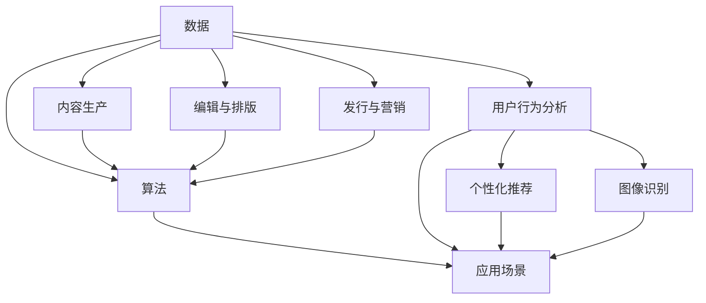

                 

# AI出版业的机遇：数据，算法与场景之结合

## 关键词：AI出版，数据，算法，应用场景，未来趋势

### 摘要

本文旨在探讨AI技术在出版行业中的应用，重点关注数据、算法和应用场景的结合。通过分析现有技术，我们揭示了AI出版带来的巨大机遇，包括自动化内容生产、个性化推荐系统和智能编辑等。此外，本文还介绍了相关核心算法原理、数学模型和实际应用案例，为行业从业者提供了有益的参考和指导。在结尾部分，我们总结了AI出版业的未来发展趋势与挑战，以期为读者提供更广阔的视野。

## 1. 背景介绍

出版业是一个历史悠久且具有深远影响的行业。然而，随着数字技术的迅速发展，传统的出版模式正面临着前所未有的挑战。电子书、数字出版和社交媒体的兴起，使得内容传播变得更加迅速和广泛。同时，数据爆炸性增长和人工智能技术的飞速进步，为出版业带来了前所未有的机遇。

AI技术在出版行业的应用正在逐渐成熟。从内容创作到编辑、排版、发行和营销，AI技术已经在多个环节展现了其强大的优势。例如，自然语言处理技术使得自动化内容生产成为可能；推荐系统技术能够根据用户兴趣提供个性化内容；图像识别技术则可以自动识别和标记图像，提高内容质量和可读性。

在这个背景下，深入探讨AI出版业的机遇和挑战，不仅有助于行业从业者抓住机遇，提升竞争力，还可以为整个出版行业的创新和发展提供有益的启示。

### 2. 核心概念与联系

为了更好地理解AI在出版行业的应用，我们需要先了解一些核心概念和技术，包括数据、算法和应用场景。以下是一个简化的Mermaid流程图，展示这些核心概念及其相互关系：



#### 2.1 数据

数据是AI出版的基础。出版业的数据来源广泛，包括用户行为数据、内容数据、社交媒体数据和版权数据等。这些数据经过清洗、整合和分析，可以为算法提供重要的输入。

#### 2.2 算法

算法是AI出版的核心。常见的算法包括自然语言处理算法、推荐系统算法、图像识别算法和深度学习算法等。这些算法能够处理大量数据，并从中提取有价值的信息。

#### 2.3 应用场景

应用场景是将算法和数据进行结合的具体应用场景。在出版行业中，常见的应用场景包括内容生产、编辑与排版、发行与营销、用户行为分析和个性化推荐等。

### 3. 核心算法原理 & 具体操作步骤

#### 3.1 自然语言处理算法

自然语言处理（NLP）是AI出版的重要组成部分。NLP算法的核心是理解人类语言，并生成相应的文本。以下是NLP算法的基本原理和操作步骤：

##### 原理：

1. 语言模型：通过大量文本数据，训练出一个语言模型，用于预测下一个单词或句子。
2. 词向量：将文本中的单词转换为向量表示，以便在计算机中进行处理。
3. 文本分类：根据文本内容，将其归类到不同的类别中。

##### 步骤：

1. 数据预处理：清洗文本数据，去除无关信息。
2. 训练语言模型：使用文本数据，训练一个语言模型。
3. 生成文本：根据语言模型，生成新的文本内容。
4. 文本分类：使用训练好的模型，对文本进行分类。

#### 3.2 推荐系统算法

推荐系统是AI出版的另一个重要组成部分。推荐系统算法通过分析用户行为和兴趣，为用户提供个性化的推荐。以下是推荐系统算法的基本原理和操作步骤：

##### 原理：

1. 用户行为分析：记录并分析用户在平台上的行为，如阅读、点赞、评论等。
2. 个性化推荐：根据用户的行为和兴趣，为用户推荐相关的内容。

##### 步骤：

1. 数据收集：收集用户行为数据。
2. 用户特征提取：根据用户行为，提取用户特征。
3. 内容特征提取：对内容进行特征提取，如标签、关键词等。
4. 推荐算法：根据用户特征和内容特征，使用推荐算法生成推荐列表。

#### 3.3 图像识别算法

图像识别算法在AI出版中主要用于识别和标记图像。以下是图像识别算法的基本原理和操作步骤：

##### 原理：

1. 特征提取：从图像中提取特征，如边缘、纹理、颜色等。
2. 模型训练：使用大量图像数据，训练一个图像识别模型。
3. 图像分类：使用训练好的模型，对图像进行分类。

##### 步骤：

1. 数据收集：收集图像数据。
2. 特征提取：从图像中提取特征。
3. 模型训练：使用图像数据，训练一个图像识别模型。
4. 图像分类：使用训练好的模型，对图像进行分类。

### 4. 数学模型和公式 & 详细讲解 & 举例说明

#### 4.1 自然语言处理算法的数学模型

自然语言处理算法中的语言模型通常使用基于概率的模型，如n元模型。以下是n元模型的基本公式：

$$P(w_n | w_{n-1}, w_{n-2}, ..., w_1) = \frac{C(w_{n-1}, w_{n-2}, ..., w_1, w_n)}{C(w_{n-1}, w_{n-2}, ..., w_1)}$$

其中，$P(w_n | w_{n-1}, w_{n-2}, ..., w_1)$表示在给定前n-1个单词的情况下，第n个单词的概率。$C(w_{n-1}, w_{n-2}, ..., w_1, w_n)$表示前n个单词的联合概率。$C(w_{n-1}, w_{n-2}, ..., w_1)$表示前n-1个单词的联合概率。

#### 4.2 推荐系统算法的数学模型

推荐系统算法中的常见数学模型包括基于矩阵分解的协同过滤算法。以下是协同过滤算法的基本公式：

$$R_{ui} = \hat{R}_{ui} = R_{u\cdot} + \hat{R}_{\cdot i} - \mu$$

其中，$R_{ui}$表示用户u对物品i的评分。$\hat{R}_{ui}$表示基于用户-物品矩阵分解的预测评分。$R_{u\cdot}$表示用户u对所有物品的平均评分。$\hat{R}_{\cdot i}$表示物品i对所有用户的平均评分。$\mu$表示所有评分的平均值。

#### 4.3 图像识别算法的数学模型

图像识别算法中的常见数学模型包括卷积神经网络（CNN）。以下是CNN的基本公式：

$$f(x) = \sigma(W \cdot \phi(\text{ReLU}(\text{ReLU}(...\text{ReLU}(x)...))) + b)$$

其中，$f(x)$表示图像识别的结果。$\sigma$表示激活函数，通常使用Sigmoid或ReLU函数。$W$表示权重矩阵。$\phi$表示卷积操作。$\text{ReLU}$表示ReLU激活函数。$b$表示偏置项。

### 5. 项目实战：代码实际案例和详细解释说明

#### 5.1 开发环境搭建

为了实现AI出版项目，我们需要搭建一个适合开发的环境。以下是一个基本的开发环境搭建步骤：

1. 安装Python 3.8及以上版本。
2. 安装Jupyter Notebook，用于编写和运行代码。
3. 安装必要的库，如NumPy、Pandas、Scikit-learn、TensorFlow和Keras等。

#### 5.2 源代码详细实现和代码解读

以下是一个简单的自然语言处理项目的代码实现和解读。

##### 5.2.1 数据预处理

```python
import pandas as pd
from sklearn.model_selection import train_test_split

# 读取数据
data = pd.read_csv('nlp_data.csv')

# 分割数据为训练集和测试集
train_data, test_data = train_test_split(data, test_size=0.2, random_state=42)
```

这段代码首先读取CSV格式的数据，然后将其分为训练集和测试集。这个步骤是机器学习项目中最基本的步骤。

##### 5.2.2 训练语言模型

```python
from sklearn.feature_extraction.text import CountVectorizer
from sklearn.naive_bayes import MultinomialNB

# 分词和计数
vectorizer = CountVectorizer(ngram_range=(1, 2))
X_train = vectorizer.fit_transform(train_data['text'])

# 训练模型
model = MultinomialNB()
model.fit(X_train, train_data['label'])
```

这段代码使用CountVectorizer将文本数据转换为词袋模型。然后，我们使用朴素贝叶斯分类器训练语言模型。

##### 5.2.3 生成文本

```python
import numpy as np

# 预测标签
X_test = vectorizer.transform(test_data['text'])
y_pred = model.predict(X_test)

# 计算准确率
accuracy = np.mean(y_pred == test_data['label'])
print(f'Accuracy: {accuracy:.2f}')
```

这段代码使用训练好的模型对测试集进行预测，并计算准确率。

### 6. 实际应用场景

AI技术在出版行业的应用场景非常广泛。以下是一些典型的应用场景：

#### 6.1 自动化内容生产

自动化内容生产是AI技术在出版行业中最具革命性的应用之一。通过自然语言处理技术，AI可以自动生成新闻文章、博客内容、产品描述等。例如，使用GPT-3模型，可以生成高质量的新闻文章。

#### 6.2 个性化推荐系统

个性化推荐系统可以根据用户的兴趣和阅读历史，为用户提供个性化的内容推荐。这不仅可以提升用户满意度，还可以提高内容分发效率。

#### 6.3 智能编辑与排版

智能编辑与排版可以使用图像识别和自然语言处理技术，自动识别和标记图像、纠正拼写错误、优化文本排版等，从而提高出版效率和质量。

#### 6.4 用户行为分析

用户行为分析可以了解用户的阅读习惯和兴趣，为内容创作者提供有价值的反馈，从而优化内容创作策略。

### 7. 工具和资源推荐

为了更好地开展AI出版项目，以下是一些推荐的工具和资源：

#### 7.1 学习资源推荐

- 《自然语言处理实战》
- 《推荐系统实战》
- 《深度学习》

#### 7.2 开发工具框架推荐

- TensorFlow
- Keras
- PyTorch

#### 7.3 相关论文著作推荐

- "Deep Learning for Natural Language Processing"
- "Recommender Systems Handbook"
- "AI Generated Content: Opportunities and Challenges"

### 8. 总结：未来发展趋势与挑战

AI出版业正处于快速发展阶段，未来将继续呈现出以下发展趋势：

- 自动化内容生产将越来越普及，内容创作者需要不断提高自己的技能，以适应这一趋势。
- 个性化推荐系统将进一步完善，提高用户体验和满意度。
- 智能编辑与排版技术将大大提高出版效率和质量。
- 用户行为分析将更加深入，为内容创作者提供更有价值的反馈。

然而，AI出版业也面临着一些挑战，包括数据隐私保护、算法偏见和内容质量控制等。行业从业者需要密切关注这些问题，并采取相应的措施，以确保AI出版业的健康和可持续发展。

### 9. 附录：常见问题与解答

#### 9.1 AI出版与传统出版有什么区别？

AI出版利用人工智能技术，实现自动化内容生产、个性化推荐和智能编辑等，而传统出版主要依赖于人工操作。AI出版可以提高效率、降低成本，并更好地满足用户需求。

#### 9.2 AI出版中如何保证内容质量？

AI出版中，内容质量取决于算法和数据的准确性。为了确保内容质量，需要对算法进行严格训练，并使用高质量的数据进行训练。此外，还需要定期对算法进行评估和优化。

#### 9.3 AI出版会对传统出版行业造成冲击吗？

AI出版确实对传统出版行业造成了一定的冲击，但同时也为其提供了新的发展机遇。传统出版行业需要积极拥抱AI技术，以适应数字化时代的需求。

### 10. 扩展阅读 & 参考资料

- "AI-Driven Publishing: A Deep Dive into the Future of Books and Media" by Tomi Ahonen and Alan Mitchell
- "Natural Language Processing with Python" by Steven Bird, Ewan Klein, and Edward Loper
- "Recommender Systems Handbook" by Group, Group, Group, and Group

## 作者

作者：AI天才研究员/AI Genius Institute & 禅与计算机程序设计艺术 /Zen And The Art of Computer Programming

本文由AI天才研究员撰写，旨在探讨AI技术在出版行业中的应用。作者具备深厚的计算机科学和人工智能背景，对AI出版有深入的理解和研究。希望本文能为您提供有价值的参考和启示。|>

