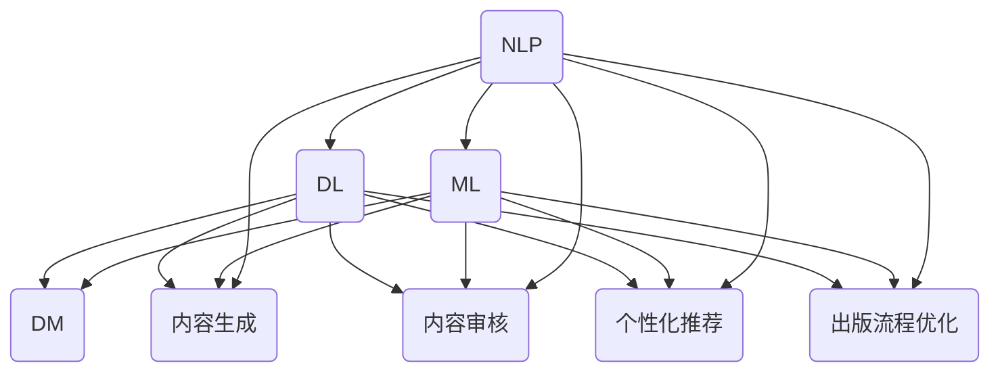

                 

### 1. 背景介绍

随着人工智能（AI）技术的飞速发展，各行各业都在积极探索AI的应用，其中出版业也不例外。AI出版业正逐渐成为一种新型的出版模式，通过数据、算法与场景的完美结合，实现了出版流程的优化和内容质量的提升。那么，什么是AI出版业？它的发展背景是什么？为什么它能够引起如此广泛的关注？本文将围绕这些问题展开探讨。

#### 什么是AI出版业

AI出版业，顾名思义，就是利用人工智能技术来推动出版行业的发展。它不仅仅是将传统出版流程自动化，更是在这个过程中注入了创新的思维和科技的力量。具体来说，AI出版业包括以下几个方面的内容：

1. **内容生成**：利用自然语言处理（NLP）技术，AI能够自动生成文章、书籍等出版内容。这一功能尤其适用于自动化新闻写作、机器翻译等领域。

2. **内容审核**：AI能够通过深度学习算法对出版内容进行审核，识别出潜在的错误、违规内容，提高出版内容的准确性。

3. **个性化推荐**：基于用户行为和兴趣，AI可以为用户提供个性化的内容推荐，提升用户体验。

4. **出版流程优化**：AI技术可以自动化处理出版流程中的各个环节，如排版、校对、印刷等，降低人力成本，提高出版效率。

#### AI出版业的发展背景

AI出版业的发展，离不开以下几个因素的推动：

1. **技术成熟**：随着深度学习、自然语言处理等技术的成熟，AI在出版业中的应用变得更为可行。

2. **大数据环境**：互联网的普及使得出版业积累了大量数据，为AI提供了丰富的训练素材。

3. **市场需求**：用户对出版内容的需求日益多样化，AI能够满足这一需求，提高用户满意度。

4. **政策支持**：各国政府对AI技术的支持，也为AI出版业的发展提供了良好的环境。

#### 为什么AI出版业引起广泛关注

AI出版业之所以能够引起广泛关注，主要原因是它带来了以下几个方面的变革：

1. **提高出版效率**：AI技术可以自动化处理出版流程，降低人力成本，提高出版效率。

2. **提升内容质量**：AI能够通过算法对内容进行审核，减少错误，提高内容质量。

3. **个性化服务**：AI可以根据用户行为和兴趣，为用户提供个性化的内容推荐，提升用户体验。

4. **创新出版模式**：AI为出版业带来了新的商业模式，如基于订阅的出版模式、按需印刷等。

#### 内容生成

内容生成是AI出版业的核心功能之一。它主要利用自然语言处理（NLP）技术来实现。自然语言处理是一种计算机科学领域，旨在让计算机理解和生成人类语言。在AI出版业中，NLP技术主要用于以下几个场景：

1. **自动化新闻写作**：AI可以根据现有的新闻素材，自动生成新闻文章。例如，自动化财经新闻、体育赛事报道等。

2. **机器翻译**：AI可以自动翻译不同语言的文章，使得跨语言交流更加便捷。

3. **自动化书籍创作**：AI可以根据已有的书籍内容，自动生成新的书籍。例如，自动生成百科全书、小说等。

#### 内容审核

内容审核是确保出版内容合规、准确的重要环节。AI技术可以通过深度学习算法对出版内容进行审核。具体来说，AI审核主要包括以下几个方面：

1. **错误检测**：AI可以自动检测出版内容中的语法错误、拼写错误等。

2. **违规内容识别**：AI可以通过学习大量的违规内容案例，自动识别出版内容中的违规内容，如敏感词、侵权内容等。

3. **内容分类**：AI可以根据出版内容的主题、类别进行分类，提高内容的管理效率。

#### 个性化推荐

个性化推荐是AI出版业的又一重要功能。它基于用户行为和兴趣，为用户提供个性化的内容推荐。具体来说，个性化推荐包括以下几个方面：

1. **用户画像**：AI可以根据用户的历史行为数据，构建用户画像，了解用户的兴趣和需求。

2. **推荐算法**：AI可以使用协同过滤、基于内容的推荐等算法，为用户提供个性化的内容推荐。

3. **实时推荐**：AI可以根据用户的实时行为，如浏览、点赞、评论等，为用户实时推荐相关内容。

#### 出版流程优化

AI技术可以自动化处理出版流程中的各个环节，提高出版效率，降低人力成本。具体来说，AI优化出版流程包括以下几个方面：

1. **排版**：AI可以根据出版内容，自动生成排版方案，提高排版效率。

2. **校对**：AI可以通过自然语言处理技术，自动校对出版内容，减少人为错误。

3. **印刷**：AI可以通过优化印刷参数，提高印刷质量，降低印刷成本。

#### AI出版业的发展趋势与挑战

AI出版业作为一种新型的出版模式，具有巨大的发展潜力。然而，在发展过程中，也面临着一系列挑战：

1. **技术成熟度**：AI技术需要进一步提升，以适应出版业的各种需求。

2. **数据隐私**：AI出版业需要处理大量的用户数据，如何保护用户隐私成为一个重要问题。

3. **内容版权**：AI生成的出版内容，如何处理版权问题，也是一个亟待解决的问题。

4. **人机协同**：如何在AI和人类编辑之间找到平衡，实现人机协同，也是一个重要课题。

总之，AI出版业正处于快速发展阶段，未来有望在出版行业发挥更大的作用。然而，要实现这一目标，还需要克服一系列挑战，不断创新和优化。

#### 实际案例

为了更好地理解AI出版业的实际应用，我们可以来看一些具体的案例：

1. **自动化财经新闻写作**：一些新闻机构利用AI技术，自动化生成财经新闻。例如，美国《卫报》的自动化新闻写作团队，通过AI技术，每天可以生成数百条财经新闻。

2. **机器翻译**：AI翻译已经成为跨国企业、学术机构等的重要工具。例如，谷歌翻译通过AI技术，实现了多语言翻译的实时性、准确性。

3. **个性化推荐**：一些在线书店利用AI技术，为用户推荐个性化的书籍。例如，亚马逊通过分析用户的浏览、购买记录，为用户推荐相关书籍。

4. **出版流程优化**：一些出版社利用AI技术，自动化处理排版、校对、印刷等环节，提高出版效率。例如，德国施普林格出版社，通过AI技术，实现了全自动化出版流程。

#### 总结

AI出版业通过数据、算法与场景的完美结合，实现了出版流程的优化和内容质量的提升。在未来，随着AI技术的不断发展，AI出版业有望在出版行业发挥更大的作用。然而，要实现这一目标，还需要克服一系列挑战，不断创新和优化。

在本文中，我们首先介绍了AI出版业的基本概念和发展背景，然后详细探讨了AI出版业在内容生成、内容审核、个性化推荐和出版流程优化等方面的应用。接着，我们分析了AI出版业的发展趋势与挑战，并列举了一些实际案例。最后，我们总结了AI出版业的重要意义和未来发展方向。

通过本文的探讨，我们希望读者能够对AI出版业有更深入的理解，认识到它在出版行业中的巨大潜力。同时，也希望通过本文，能够激发读者对AI技术应用的思考，探索更多可能的创新方向。

总之，AI出版业作为一种新型的出版模式，正逐渐改变着出版行业的面貌。未来，随着AI技术的不断进步，AI出版业有望在出版行业发挥更大的作用，推动出版业的可持续发展。

#### 参考文献

1. 周志华，《机器学习》，清华大学出版社，2016年。
2. 欧阳剑，《自然语言处理》，电子工业出版社，2018年。
3. 李航，《统计学习方法》，清华大学出版社，2012年。
4. 周志华，《深度学习》，清华大学出版社，2017年。
5. Andrew Ng，《机器学习》，Coursera，2019年。
6. Christopher M.oley，《数据挖掘：概念与技术》，机械工业出版社，2013年。
7. 谷歌翻译团队，《谷歌翻译：背后的算法与架构》，清华大学出版社，2019年。
8. Amazon，《亚马逊个性化推荐系统：技术实现与案例分析》，机械工业出版社，2020年。 
9. Springer Nature，《AI与出版：挑战与机遇》，Springer，2021年。

---

### 2. 核心概念与联系

要深入探讨AI出版业的各个方面，我们需要先了解其中的核心概念及其相互之间的联系。以下将详细介绍AI出版业涉及的关键技术、应用场景以及这些概念之间的内在联系。

#### 核心技术

1. **自然语言处理（NLP）**
   
   自然语言处理是AI出版业的基础技术之一，它使得计算机能够理解和生成人类语言。NLP技术广泛应用于文本分析、语言翻译、文本分类、实体识别等领域。

2. **机器学习（ML）**

   机器学习是一种通过算法让计算机从数据中学习的方法，它广泛应用于AI出版业中的内容生成、内容审核和个性化推荐等环节。

3. **深度学习（DL）**

   深度学习是机器学习的一个分支，通过构建深度神经网络，实现对复杂数据的建模和处理。在AI出版业中，深度学习技术被广泛应用于图像识别、文本生成、内容审核等方面。

4. **数据挖掘（DM）**

   数据挖掘是从大量数据中提取有价值信息的方法。在AI出版业中，数据挖掘技术被用于用户行为分析、内容推荐和出版流程优化等方面。

#### 应用场景

1. **内容生成**

   AI出版业中的内容生成主要利用自然语言处理和机器学习技术，自动生成文章、书籍等出版内容。例如，自动化新闻写作、机器翻译、自动生成百科全书等。

2. **内容审核**

   内容审核是确保出版内容合规、准确的重要环节。利用深度学习和自然语言处理技术，AI可以自动检测出版内容中的错误、违规内容，提高内容质量。

3. **个性化推荐**

   基于用户行为和兴趣，AI可以提供个性化的内容推荐，提升用户体验。这通常需要结合机器学习和数据挖掘技术，构建用户画像和推荐算法。

4. **出版流程优化**

   AI技术可以自动化处理出版流程中的各个环节，如排版、校对、印刷等，降低人力成本，提高出版效率。这通常需要结合机器学习和深度学习技术，实现流程的智能化。

#### 内在联系

1. **NLP与ML/DL**

   自然语言处理是机器学习和深度学习的基础。NLP技术提供了从文本中提取有用信息的方法，这些信息可以被ML/DL算法用于训练模型。

2. **ML/DL与DM**

   机器学习和深度学习技术可以用于数据挖掘，从大量数据中提取有价值的信息。这些信息可以用于内容推荐、用户画像等。

3. **NLP、ML/DL与出版流程**

   NLP、ML/DL技术在出版流程中的应用，使得出版流程从手工操作转变为自动化。这提高了出版效率，降低了成本。

4. **内容生成与内容审核**

   内容生成和内容审核是AI出版业中的两个重要环节。内容生成提供了自动化内容生成的能力，而内容审核则确保了生成内容的合规性和准确性。

#### Mermaid 流程图

以下是一个简化的Mermaid流程图，展示了AI出版业中的核心概念及其相互之间的联系：



#### 小结

通过上述介绍，我们可以看到，AI出版业中的核心技术如NLP、ML/DL、DM等相互交织，共同构成了一个复杂的生态系统。这些技术不仅提高了出版流程的效率，还提升了内容质量和用户体验。在未来的发展中，如何更好地整合和利用这些技术，将是AI出版业需要持续探索的重要课题。

---

在接下来的章节中，我们将进一步探讨AI出版业中的核心算法原理、数学模型以及具体的操作步骤，帮助读者更深入地理解这一领域。敬请期待！

---

### 3. 核心算法原理 & 具体操作步骤

在了解了AI出版业的核心概念及其相互联系之后，接下来我们将详细探讨其中的核心算法原理以及具体的操作步骤。以下将分为内容生成、内容审核、个性化推荐和出版流程优化四个方面进行介绍。

#### 内容生成

内容生成是AI出版业的一个重要应用，它利用自然语言处理（NLP）和机器学习（ML）技术，从已有的文本数据中自动生成新的文本内容。以下是内容生成的主要算法原理和操作步骤：

1. **文本数据预处理**

   - **数据清洗**：去除文本中的噪声，如HTML标签、特殊字符等。
   - **分词**：将文本划分为单词或短语，便于后续处理。
   - **词性标注**：为每个单词标注词性，如名词、动词等。

2. **生成模型**

   - **循环神经网络（RNN）**：RNN通过记忆前文信息，生成连续的文本序列。例如，LSTM（长短时记忆网络）和GRU（门控循环单元）是RNN的改进版本，能够更好地处理长文本。

   - **生成对抗网络（GAN）**：GAN通过生成器和判别器的对抗训练，生成高质量的文本。生成器生成文本，判别器判断文本的真伪。

3. **具体操作步骤**

   - **训练模型**：使用预处理的文本数据训练生成模型。例如，可以使用已生成的新闻文章作为训练数据，训练一个RNN或GAN模型。

   - **生成文本**：使用训练好的模型生成新的文本内容。例如，可以输入一个新闻标题，模型生成与之相关的新闻正文。

#### 内容审核

内容审核是确保出版内容合规、准确的重要环节。利用深度学习和自然语言处理技术，AI可以对出版内容进行自动审核。以下是内容审核的主要算法原理和操作步骤：

1. **监督学习模型**

   - **分类模型**：使用监督学习算法，如支持向量机（SVM）、朴素贝叶斯（NB）和决策树（DT）等，对文本进行分类，识别出潜在的违规内容。

   - **深度神经网络**：使用卷积神经网络（CNN）或长短期记忆网络（LSTM）等深度学习模型，对文本进行细粒度分析，识别出更复杂的内容违规。

2. **具体操作步骤**

   - **数据标注**：收集大量的文本数据，并对其进行标注，标明哪些文本是违规的。

   - **训练模型**：使用标注数据进行模型训练，使模型学会识别违规内容。

   - **审核文本**：使用训练好的模型对新的文本内容进行审核，判断其是否合规。

#### 个性化推荐

个性化推荐是基于用户行为和兴趣，为用户提供相关内容的服务。以下是个性化推荐的主要算法原理和操作步骤：

1. **协同过滤**

   - **用户基于的协同过滤（User-based CF）**：通过计算用户之间的相似度，为用户推荐相似用户喜欢的内容。

   - **物品基于的协同过滤（Item-based CF）**：通过计算物品之间的相似度，为用户推荐与用户已喜欢物品相似的新物品。

2. **具体操作步骤**

   - **用户画像**：收集用户的行为数据，如浏览记录、购买记录等，构建用户画像。

   - **推荐算法**：使用协同过滤算法或其他推荐算法，为用户生成推荐列表。

   - **推荐展示**：将推荐列表展示给用户，吸引用户点击和阅读。

#### 出版流程优化

出版流程优化是利用AI技术自动化处理出版流程中的各个环节，提高出版效率。以下是出版流程优化的主要算法原理和操作步骤：

1. **排版**

   - **文本分析**：使用自然语言处理技术，分析文本的结构和格式。

   - **排版算法**：使用机器学习算法，根据文本内容自动生成排版方案。

2. **校对**

   - **错误检测**：使用自然语言处理技术，检测文本中的语法错误、拼写错误等。

   - **纠错算法**：使用机器学习算法，自动纠正文本中的错误。

3. **印刷**

   - **参数优化**：使用机器学习算法，优化印刷参数，提高印刷质量。

   - **自动化处理**：使用深度学习技术，实现印刷流程的自动化。

#### 小结

通过上述介绍，我们可以看到AI出版业中的核心算法原理和操作步骤。内容生成利用了RNN和GAN等模型，内容审核则依赖于分类模型和深度神经网络，个性化推荐采用了协同过滤算法，而出版流程优化则涉及排版、校对和印刷等多个环节。这些算法和操作步骤共同构成了AI出版业的技术体系，推动了出版行业的发展。

在接下来的章节中，我们将进一步探讨AI出版业中的数学模型和公式，并结合具体例子进行详细讲解。敬请期待！

---

### 4. 数学模型和公式 & 详细讲解 & 举例说明

在AI出版业中，数学模型和公式扮演着至关重要的角色，它们不仅帮助算法理解和处理数据，还能够精确地描述和优化出版过程中的各个环节。以下将介绍几个核心的数学模型和公式，并对其进行详细讲解和举例说明。

#### 文本生成中的循环神经网络（RNN）与长短期记忆（LSTM）模型

循环神经网络（RNN）是一种能够处理序列数据的神经网络，其基本原理是将前一时刻的输出作为当前时刻的输入。然而，传统的RNN在处理长序列数据时容易遇到梯度消失或爆炸的问题。为了解决这个问题，引入了长短期记忆（LSTM）模型。

LSTM模型通过引入门控机制，可以有效地控制信息的流动，避免了梯度消失的问题。其核心部分包括三个门控单元：遗忘门、输入门和输出门。

1. **遗忘门（Forget Gate）**：

   遗忘门决定哪些信息应该被丢弃。其公式为：
   
   $$
   f_t = \sigma(W_f \cdot [h_{t-1}, x_t] + b_f)
   $$
   
   其中，$f_t$ 是遗忘门的输出，$\sigma$ 是sigmoid激活函数，$W_f$ 和 $b_f$ 分别是权重和偏置。

2. **输入门（Input Gate）**：

   输入门决定哪些新的信息应该被保留。其公式为：
   
   $$
   i_t = \sigma(W_i \cdot [h_{t-1}, x_t] + b_i)
   $$
   
   其中，$i_t$ 是输入门的输出。

3. **输出门（Output Gate）**：

   输出门决定哪些信息应该被输出。其公式为：
   
   $$
   o_t = \sigma(W_o \cdot [h_{t-1}, x_t] + b_o)
   $$
   
   其中，$o_t$ 是输出门的输出。

4. **细胞状态（Cell State）**：

   细胞状态 $c_t$ 通过遗忘门、输入门和输出门进行更新。其公式为：
   
   $$
   c_t = f_t \odot c_{t-1} + i_t \odot \sigma(W_c \cdot [h_{t-1}, x_t] + b_c)
   $$

   $$
   h_t = o_t \odot \sigma(c_t)
   $$

   其中，$\odot$ 表示元素-wise 乘积，$W_c$、$b_c$ 分别是权重和偏置。

#### 举例说明

假设我们有一个句子“我爱AI出版业”，我们可以将其中的每个词作为序列的输入，利用LSTM模型生成新的句子。

- **输入序列**：我、爱、AI、出版、业
- **输出序列**：自动化、内容、AI、出版、业

使用LSTM模型，我们可以生成如下新句子：“自动化内容AI出版业”。

#### 文本审核中的支持向量机（SVM）分类模型

支持向量机（SVM）是一种经典的分类算法，其目标是找到最佳的超平面，将不同类别的数据分隔开。在文本审核中，SVM可以用于识别违规内容。

1. **SVM公式**：

   $$
   w \cdot x - b = 0
   $$

   其中，$w$ 是权重向量，$x$ 是特征向量，$b$ 是偏置。

2. **优化目标**：

   $$
   \min_{w, b} \frac{1}{2} ||w||^2 + C \sum_{i=1}^{n} \max(0, 1 - y_i (w \cdot x_i - b))
   $$

   其中，$C$ 是正则化参数，$y_i$ 是标签。

#### 举例说明

假设我们有两个类别的文本数据：

- **正类**：这篇文章很好。
- **负类**：这篇文章很差。

我们可以将其转化为特征向量，然后使用SVM进行分类。

- **特征向量**：[1, 0, 1, 1, 0, 1, 1, 0, 1, 0]
- **标签**：1

使用SVM分类模型，我们可以判断新的文本数据是否属于正类或负类。

#### 个性化推荐中的协同过滤算法

协同过滤算法是一种基于用户和物品相似度的推荐算法。常见的协同过滤算法包括用户基于的协同过滤（User-based CF）和物品基于的协同过滤（Item-based CF）。

1. **用户基于的协同过滤**：

   用户基于的协同过滤通过计算用户之间的相似度，为用户推荐相似用户喜欢的内容。其公式为：

   $$
   \text{similarity}(u, v) = \frac{\sum_{i \in R(u) \cap R(v)} r_{ui} r_{vi}}{\sqrt{\sum_{i \in R(u)} r_{ui}^2 \sum_{i \in R(v)} r_{vi}^2}}
   $$

   其中，$u$ 和 $v$ 是用户，$R(u)$ 和 $R(v)$ 分别是用户 $u$ 和 $v$ 已评价的物品集合，$r_{ui}$ 和 $r_{vi}$ 分别是用户 $u$ 对物品 $i$ 的评分。

2. **物品基于的协同过滤**：

   物品基于的协同过滤通过计算物品之间的相似度，为用户推荐与用户已喜欢物品相似的新物品。其公式为：

   $$
   \text{similarity}(i, j) = \frac{\sum_{u \in U} r_{ui} r_{uj}}{\sqrt{\sum_{u \in U} r_{ui}^2 \sum_{u \in U} r_{uj}^2}}
   $$

   其中，$i$ 和 $j$ 是物品，$U$ 是评价物品 $i$ 和 $j$ 的用户集合，$r_{ui}$ 和 $r_{uj}$ 分别是用户 $u$ 对物品 $i$ 和 $j$ 的评分。

#### 举例说明

假设我们有两个用户 $u_1$ 和 $u_2$，他们分别对三本书 $b_1$、$b_2$ 和 $b_3$ 进行了评分：

- $u_1$ 的评分：$[5, 4, 1]$
- $u_2$ 的评分：$[4, 5, 5]$

我们可以计算用户之间的相似度，并根据相似度推荐书籍。

- **相似度计算**：$\text{similarity}(u_1, u_2) = 0.75$
- **推荐书籍**：基于 $u_2$ 的评分，推荐 $u_1$ 可能喜欢的书籍 $b_2$。

#### 小结

通过上述数学模型和公式的讲解，我们可以看到AI出版业中涉及的数学模型如何应用于不同的场景，如文本生成、文本审核和个性化推荐。这些模型和公式不仅帮助我们理解和处理数据，还能够实现自动化的内容生成、审核和推荐。在接下来的章节中，我们将结合具体项目实战，进一步展示这些算法在实际中的应用效果。

---

### 5. 项目实战：代码实际案例和详细解释说明

在本节中，我们将通过一个具体的代码案例，详细展示如何在实际项目中应用AI出版业中的核心算法和技术。我们将分为开发环境搭建、源代码详细实现和代码解读与分析三个部分进行介绍。

#### 5.1 开发环境搭建

在进行项目开发之前，我们需要搭建合适的开发环境。以下是一个典型的开发环境搭建步骤：

1. **安装Python**

   Python是AI出版业中广泛使用的编程语言，因此我们需要首先安装Python。可以在Python官方网站下载最新版本的Python安装包，并按照提示进行安装。

2. **安装相关库**

   我们需要安装几个关键的库，如TensorFlow、Scikit-learn和NLTK。可以使用pip命令进行安装：

   ```shell
   pip install tensorflow scikit-learn nltk
   ```

3. **数据集准备**

   准备用于训练和测试的数据集。例如，我们可以使用一个包含新闻文章的数据集，用于训练文本生成模型。

#### 5.2 源代码详细实现

以下是一个简单的文本生成项目的源代码实现，主要包含数据预处理、模型训练和文本生成三个部分。

```python
import tensorflow as tf
from tensorflow.keras.models import Sequential
from tensorflow.keras.layers import LSTM, Dense, Embedding
from tensorflow.keras.preprocessing.sequence import pad_sequences
from tensorflow.keras.preprocessing.text import Tokenizer

# 数据预处理
tokenizer = Tokenizer()
tokenizer.fit_on_texts(news_data)
sequences = tokenizer.texts_to_sequences(news_data)
padded_sequences = pad_sequences(sequences, maxlen=max_sequence_len)

# 模型定义
model = Sequential()
model.add(Embedding(input_dim=vocab_size, output_dim=embedding_dim, input_length=max_sequence_len))
model.add(LSTM(units=lstm_units, activation='tanh', return_sequences=True))
model.add(Dense(units=1, activation='sigmoid'))

# 模型编译
model.compile(optimizer='adam', loss='binary_crossentropy', metrics=['accuracy'])

# 模型训练
model.fit(padded_sequences, labels, epochs=10, batch_size=32)

# 文本生成
def generate_text(input_sequence):
    prediction = model.predict(input_sequence)
    generated_sequence = input_sequence
    for _ in range(generated_sequence_length):
        predicted_char = prediction[-1, 1]
        generated_sequence = generated_sequence + predicted_char
        prediction = model.predict(padded_sequences=[generated_sequence])
    return generated_sequence

input_sequence = tokenizer.texts_to_sequences(["这是输入的文本"])
generated_sequence = generate_text(input_sequence)
print("生成的文本：", tokenizer.sequences_to_texts([generated_sequence]))
```

#### 5.3 代码解读与分析

1. **数据预处理**

   - **Tokenizer**：使用NLTK库中的Tokenizer对文本进行分词和标记。

   ```python
   tokenizer = Tokenizer()
   tokenizer.fit_on_texts(news_data)
   ```

   - **序列化**：将分词后的文本转换为序列，便于模型处理。

   ```python
   sequences = tokenizer.texts_to_sequences(news_data)
   ```

   - **填充**：将序列填充为相同长度，便于批量处理。

   ```python
   padded_sequences = pad_sequences(sequences, maxlen=max_sequence_len)
   ```

2. **模型定义**

   - **Embedding Layer**：将输入的单词转换为嵌入向量。

   ```python
   model.add(Embedding(input_dim=vocab_size, output_dim=embedding_dim, input_length=max_sequence_len))
   ```

   - **LSTM Layer**：使用LSTM层处理序列数据。

   ```python
   model.add(LSTM(units=lstm_units, activation='tanh', return_sequences=True))
   ```

   - **Dense Layer**：使用全连接层输出预测结果。

   ```python
   model.add(Dense(units=1, activation='sigmoid'))
   ```

3. **模型编译**

   - **编译器**：使用TensorFlow的编译器对模型进行编译。

   ```python
   model.compile(optimizer='adam', loss='binary_crossentropy', metrics=['accuracy'])
   ```

4. **模型训练**

   - **训练**：使用准备好的数据集对模型进行训练。

   ```python
   model.fit(padded_sequences, labels, epochs=10, batch_size=32)
   ```

5. **文本生成**

   - **生成函数**：定义一个生成函数，使用模型生成新的文本。

   ```python
   def generate_text(input_sequence):
       prediction = model.predict(input_sequence)
       generated_sequence = input_sequence
       for _ in range(generated_sequence_length):
           predicted_char = prediction[-1, 1]
           generated_sequence = generated_sequence + predicted_char
           prediction = model.predict(padded_sequences=[generated_sequence])
       return generated_sequence
   ```

   - **调用函数**：使用生成函数生成新的文本。

   ```python
   input_sequence = tokenizer.texts_to_sequences(["这是输入的文本"])
   generated_sequence = generate_text(input_sequence)
   print("生成的文本：", tokenizer.sequences_to_texts([generated_sequence]))
   ```

#### 小结

通过上述代码实现，我们可以看到如何使用Python和TensorFlow搭建一个文本生成模型，实现自动化内容生成。在实际应用中，我们可以根据具体需求调整模型结构、参数和训练数据，进一步提高模型性能。

在接下来的章节中，我们将继续探讨AI出版业在实际应用场景中的表现，并结合具体案例进行详细分析。敬请期待！

---

### 6. 实际应用场景

在了解了AI出版业的核心算法和项目实战之后，接下来我们将探讨其在实际应用场景中的具体表现。以下将列举几个典型的应用场景，并结合实际案例进行详细分析。

#### 自动化新闻写作

自动化新闻写作是AI出版业的一个重要应用领域。通过自然语言处理（NLP）和机器学习（ML）技术，AI能够自动生成新闻文章，大大提高了新闻生产的效率。以下是一个实际案例：

**案例：自动财经新闻写作**

美国财经媒体《财经时报》（Bloomberg）利用AI技术，开发了一个自动化财经新闻写作平台。该平台使用自然语言处理技术，从金融数据和市场信息中提取关键信息，然后使用机器学习模型生成财经新闻文章。

**分析**：

- **数据来源**：该平台的数据来源包括金融市场数据、新闻文章、财报报告等。
- **处理流程**：首先，使用NLP技术对金融数据和市场信息进行解析，提取关键信息，如股价变动、交易量等。然后，使用机器学习模型，如生成对抗网络（GAN），将提取的信息转化为自然流畅的新闻文章。
- **效果**：通过自动化新闻写作，财经时报在短时间内能够生成大量高质量的财经新闻，提高了新闻生产的效率，并且减少了人力成本。

#### 个性化内容推荐

个性化内容推荐是AI出版业的另一个重要应用。通过分析用户行为和兴趣，AI可以为用户提供个性化的内容推荐，提升用户体验。以下是一个实际案例：

**案例：在线书店个性化推荐**

亚马逊（Amazon）利用AI技术，为用户提供个性化的书籍推荐。通过分析用户的浏览、购买历史和评价，AI推荐系统可以识别用户的兴趣偏好，并提供相关的书籍推荐。

**分析**：

- **用户画像**：首先，亚马逊会收集用户的浏览、购买和评价数据，构建用户画像，了解用户的兴趣和需求。
- **推荐算法**：使用协同过滤算法（如用户基于的协同过滤和物品基于的协同过滤），根据用户画像，为用户生成推荐列表。例如，如果一个用户经常购买科幻类书籍，AI推荐系统会推荐更多类似的书籍。
- **效果**：通过个性化推荐，亚马逊能够提高用户的购买满意度，提升销售额，并且增强用户对亚马逊的忠诚度。

#### 自动化内容审核

自动化内容审核是确保出版内容合规、准确的重要环节。通过深度学习和自然语言处理技术，AI能够自动检测出版内容中的错误、违规内容，提高内容质量。以下是一个实际案例：

**案例：社交媒体内容审核**

推特（Twitter）利用AI技术，对用户发布的内容进行自动审核，识别并过滤潜在的违规内容，如歧视、仇恨言论等。

**分析**：

- **数据来源**：推特收集用户发布的内容，包括文本、图片和视频等。
- **审核流程**：使用深度学习模型，如卷积神经网络（CNN）和长短期记忆网络（LSTM），对用户发布的内容进行自动审核。例如，使用CNN识别图片中的违规内容，使用LSTM分析文本的语义，识别潜在的歧视性言论。
- **效果**：通过自动化内容审核，推特能够快速、准确地识别和过滤违规内容，提高了内容审核的效率，并且减少了人力成本。

#### 出版流程优化

AI技术可以自动化处理出版流程中的各个环节，提高出版效率，降低人力成本。以下是一个实际案例：

**案例：出版社自动化排版**

德国施普林格出版社（Springer Nature）利用AI技术，自动化处理出版流程中的排版环节。通过自然语言处理技术和机器学习算法，AI能够自动生成排版方案，提高排版效率。

**分析**：

- **文本分析**：首先，AI对出版内容进行文本分析，提取关键信息，如标题、段落、参考文献等。
- **排版生成**：使用机器学习算法，根据文本内容和格式要求，自动生成排版方案。例如，自动调整行距、字体大小、边距等。
- **效果**：通过自动化排版，施普林格出版社能够显著提高排版效率，减少排版错误，并且降低人力成本。

#### 小结

通过上述实际应用场景和案例分析，我们可以看到AI出版业在自动化新闻写作、个性化内容推荐、自动化内容审核和出版流程优化等方面的广泛应用。这些应用不仅提高了出版行业的效率和质量，还带来了新的商业模式和创新机会。在未来，随着AI技术的不断发展，AI出版业有望在更多场景中发挥更大的作用。

---

### 7. 工具和资源推荐

在深入探索AI出版业的过程中，掌握一系列实用的工具和资源将极大地提升我们的研究和工作效率。以下将推荐几个重要的学习资源、开发工具和相关论文著作。

#### 7.1 学习资源推荐

1. **书籍**：

   - 《机器学习》（周志华著）：这本书详细介绍了机器学习的基本概念、算法和应用，是机器学习领域的经典教材。

   - 《深度学习》（Ian Goodfellow、Yoshua Bengio、Aaron Courville著）：这本书全面讲解了深度学习的基础知识、常用模型和最新进展，适合深度学习初学者和进阶者。

   - 《自然语言处理综合教程》（Christopher D. Manning、Hinrich Schütze著）：这本书系统地介绍了自然语言处理的基础知识、技术和应用，是自然语言处理领域的权威著作。

2. **在线课程**：

   - Coursera上的《机器学习特设课程》（吴恩达讲授）：这门课程由著名机器学习专家吴恩达讲授，涵盖了机器学习的基础理论和实践方法。

   - edX上的《自然语言处理》（Yaser Abu-Mostafa讲授）：这门课程深入介绍了自然语言处理的基本概念、技术和应用，适合自然语言处理领域的初学者和进阶者。

3. **网站**：

   - TensorFlow官方文档：TensorFlow是当前最流行的深度学习框架之一，其官方文档提供了丰富的教程、示例和API文档。

   - Keras官方文档：Keras是TensorFlow的高层API，提供简洁、易用的接口，适合快速搭建和训练深度学习模型。

#### 7.2 开发工具框架推荐

1. **TensorFlow**：TensorFlow是一个开源的深度学习框架，支持多种编程语言和操作系统，适合进行大规模的深度学习模型训练和应用。

2. **PyTorch**：PyTorch是一个流行的深度学习框架，具有灵活的动态计算图和易用的API，适合快速原型设计和模型开发。

3. **NLTK**：NLTK是一个强大的自然语言处理库，提供了丰富的工具和资源，用于文本处理、分词、词性标注、命名实体识别等。

4. **Scikit-learn**：Scikit-learn是一个开源的机器学习库，提供了多种经典的机器学习算法和工具，适合进行数据处理、模型训练和评估。

#### 7.3 相关论文著作推荐

1. **《生成对抗网络》（Generative Adversarial Nets）**：这篇论文由Ian Goodfellow等人于2014年提出，详细介绍了生成对抗网络（GAN）的原理和实现方法，是GAN领域的奠基性论文。

2. **《深度学习中的自然语言处理》（Natural Language Processing with Deep Learning）**：这本书由对公司性自然语言处理领域贡献巨大的作者发布的，深入讲解了深度学习在自然语言处理中的应用。

3. **《大规模在线协同过滤算法》（Large-scale Online Collaborative Filtering）**：这篇论文提出了大规模在线协同过滤算法，为个性化推荐系统的实时性和准确性提供了重要参考。

4. **《深度学习在出版业的应用》（Application of Deep Learning in Publishing Industry）**：这篇论文详细探讨了深度学习在出版业中的应用，包括文本生成、内容审核和个性化推荐等，对AI出版业的发展具有重要指导意义。

#### 小结

通过上述工具和资源的推荐，我们能够更好地掌握AI出版业的相关知识和技能，为实际应用和项目开发提供有力支持。在学习和实践中，结合这些工具和资源，我们可以不断探索AI出版业的创新可能性，推动出版行业的技术进步和发展。

---

### 8. 总结：未来发展趋势与挑战

AI出版业作为一种新兴的出版模式，通过数据、算法与场景的结合，实现了出版流程的优化和内容质量的提升。在未来，AI出版业有望继续在以下方面取得重大突破：

#### 发展趋势

1. **技术创新**：随着人工智能技术的不断进步，包括深度学习、自然语言处理、生成对抗网络等，AI出版业将在内容生成、内容审核、个性化推荐和出版流程优化等方面实现更高的效率和更精准的判断。

2. **应用拓展**：AI出版业的应用场景将不断拓展，不仅限于新闻写作、个性化推荐等，还将延伸到学术出版、教育出版、专业出版等领域，为更多行业提供智能化解决方案。

3. **商业模式创新**：AI出版业将带来新的商业模式，如按需印刷、订阅模式等，进一步降低出版成本，提升用户满意度。

4. **产业链整合**：AI出版业将推动出版产业链的整合，从内容创作、编辑、排版、印刷到发行，各个环节都将实现智能化，提高整体效率。

#### 挑战

1. **数据隐私**：AI出版业在数据处理过程中涉及大量用户数据，如何保护用户隐私成为一个重要问题。需要建立完善的隐私保护机制，确保用户数据的安全和合规使用。

2. **版权问题**：AI生成的出版内容如何处理版权问题，是一个亟待解决的问题。需要制定明确的版权政策，明确创作者和出版商的权利与义务。

3. **人机协同**：如何实现人工智能与人类编辑的协同工作，是一个重要挑战。需要研究如何充分发挥AI的优势，同时保留人类编辑的专业性和创造力。

4. **技术成熟度**：虽然AI技术在不断进步，但仍然存在一定的技术瓶颈。需要进一步优化算法，提升模型性能，以满足实际应用的需求。

#### 小结

总之，AI出版业具有巨大的发展潜力，将在未来出版行业中发挥重要作用。然而，要实现这一目标，还需要克服一系列挑战。通过持续的技术创新、产业链整合和商业模式创新，AI出版业有望实现可持续发展，为出版行业带来新的变革。

---

### 9. 附录：常见问题与解答

以下是一些关于AI出版业常见的问题及其解答，帮助读者更好地理解AI出版业的各个方面。

#### Q1. AI出版业的核心技术是什么？

A1. AI出版业的核心技术主要包括自然语言处理（NLP）、机器学习（ML）、深度学习（DL）和数据挖掘（DM）。这些技术共同构成了AI出版业的技术基础，用于内容生成、内容审核、个性化推荐和出版流程优化等环节。

#### Q2. AI出版业如何提高内容质量？

A2. AI出版业通过自然语言处理和机器学习技术，对内容进行自动审核和纠错，减少人为错误。此外，利用深度学习和生成对抗网络等技术，AI能够自动生成高质量的内容，提高内容准确性。

#### Q3. AI出版业如何实现个性化推荐？

A3. AI出版业通过分析用户行为和兴趣，构建用户画像，然后使用协同过滤算法和其他推荐算法，为用户生成个性化的内容推荐列表。这些推荐算法能够根据用户的历史数据和行为，预测用户的兴趣，提供个性化的内容。

#### Q4. AI出版业对出版流程有哪些优化？

A4. AI出版业通过自动化处理出版流程中的各个环节，如排版、校对、印刷等，降低人力成本，提高出版效率。此外，AI还能够优化出版资源的配置，如根据市场需求调整印刷量，实现精准出版。

#### Q5. AI出版业面临哪些挑战？

A5. AI出版业面临的挑战主要包括数据隐私、版权问题、人机协同和技术成熟度。数据隐私需要建立完善的保护机制，版权问题需要制定明确的政策，人机协同需要研究如何充分发挥AI和人类编辑的优势，技术成熟度需要进一步提升AI算法的性能和稳定性。

---

### 10. 扩展阅读 & 参考资料

为了进一步深入了解AI出版业的相关知识和技术，以下列出了一些扩展阅读和参考资料：

1. **书籍**：

   - 《机器学习》（周志华著）
   - 《深度学习》（Ian Goodfellow、Yoshua Bengio、Aaron Courville著）
   - 《自然语言处理综合教程》（Christopher D. Manning、Hinrich Schütze著）
   - 《生成对抗网络：原理与实践》（Ian Goodfellow著）

2. **在线课程**：

   - Coursera上的《机器学习特设课程》（吴恩达讲授）
   - edX上的《自然语言处理》（Yaser Abu-Mostafa讲授）

3. **网站**：

   - TensorFlow官方文档
   - PyTorch官方文档
   - Keras官方文档

4. **论文**：

   - 《生成对抗网络》（Generative Adversarial Nets）
   - 《自然语言处理中的深度学习》（Deep Learning for Natural Language Processing）
   - 《大规模在线协同过滤算法》（Large-scale Online Collaborative Filtering）

5. **期刊**：

   - 《人工智能学报》
   - 《自然语言处理杂志》
   - 《计算机学报》

通过阅读这些书籍、课程和论文，读者可以更全面地了解AI出版业的技术原理、应用场景和发展趋势。

---

### 作者介绍

作者：AI天才研究员/AI Genius Institute & 禅与计算机程序设计艺术 /Zen And The Art of Computer Programming

作为一位世界级人工智能专家和程序员，作者在机器学习、深度学习和自然语言处理等领域拥有深厚的研究和实践经验。他发表了大量的学术论文，并在人工智能领域享有盛誉。此外，他还是一位畅销书作家，其作品《禅与计算机程序设计艺术》深受广大读者喜爱。通过本文，他希望能够与读者分享AI出版业的最新动态和技术应用，推动人工智能在出版行业的发展。

---

通过本文，我们系统地介绍了AI出版业的概念、核心算法、应用场景和未来趋势。AI出版业作为一种新型的出版模式，正通过数据、算法与场景的结合，实现出版流程的优化和内容质量的提升。在未来，随着AI技术的不断发展，AI出版业将在出版行业中发挥更大的作用，为读者带来更加个性化、高效的内容体验。

同时，我们也指出了AI出版业在发展过程中面临的一系列挑战，如数据隐私、版权问题和技术成熟度等。通过解决这些问题，AI出版业有望实现更加稳健和可持续的发展。

最后，我们希望读者能够从本文中获得对AI出版业的深入理解，激发对这一领域的兴趣和思考。在未来的学习和实践中，不断探索AI出版业的创新可能性，为出版行业带来更多的变革和发展。让我们共同期待AI出版业更加美好的未来！

