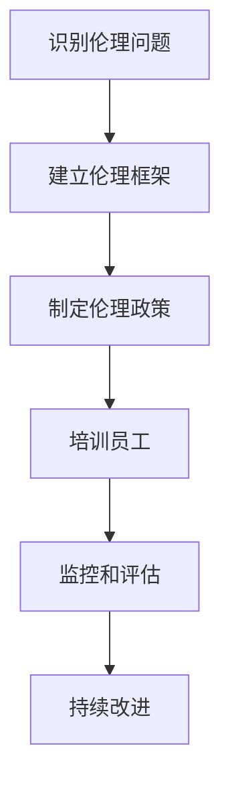

                 

### 文章标题

### AI创业公司如何应对伦理挑战？

### 关键词：
- AI伦理
- 创业公司
- 伦理框架
- 隐私保护
- 数据安全
- 社会影响
- 可解释性

### 摘要：
本文将探讨AI创业公司如何应对伦理挑战。我们将分析AI伦理的核心概念，介绍创业公司面临的伦理困境，并提出一系列策略来应对这些问题，确保技术发展的同时，尊重社会伦理规范，保护用户隐私，促进公平正义。通过实际案例和具体操作步骤，我们将为AI创业公司提供实用的伦理实践指南。

### 1. 背景介绍

人工智能（AI）正迅速融入各个行业，成为推动社会进步的重要力量。然而，随着AI技术的广泛应用，伦理挑战也随之而来。创业公司，作为AI领域的活跃参与者，面临着诸多伦理问题，如数据隐私、算法偏见、安全风险和社会影响等。如果这些问题得不到妥善解决，不仅会损害公司声誉，还可能对社会造成严重负面影响。

面对这些伦理挑战，创业公司需要建立有效的伦理框架，确保技术创新的同时，遵循伦理规范，维护用户权益，促进技术可持续发展。本文将重点讨论AI创业公司如何应对这些伦理挑战，为公司的长期成功奠定坚实基础。

### 2. 核心概念与联系

#### 2.1 AI伦理的核心概念

AI伦理涉及多个方面，包括但不限于：

- **隐私保护**：确保用户的个人数据得到妥善保护，防止数据泄露和滥用。
- **算法透明性**：使算法的决策过程更加透明，用户能够理解算法的运作机制。
- **非歧视性**：确保算法不会对特定群体产生歧视性影响。
- **可解释性**：使AI系统的决策过程具有可解释性，便于用户监督和信任。

#### 2.2 创业公司面临的伦理困境

AI创业公司常见的伦理困境包括：

- **数据隐私问题**：如何在提供个性化服务的同时，保护用户隐私？
- **算法偏见问题**：如何避免算法偏见对特定群体产生不公平影响？
- **安全风险问题**：如何确保AI系统的安全性，防止恶意攻击和滥用？
- **社会责任问题**：如何平衡商业利益和社会责任，确保技术的可持续发展？

#### 2.3 Mermaid 流程图

以下是一个简单的Mermaid流程图，展示了创业公司应对AI伦理挑战的核心步骤：



在这个流程图中，创业公司首先需要识别伦理问题，然后建立伦理框架，制定伦理政策，并培训员工，确保他们了解伦理规范。接下来，公司需要监控和评估AI系统的伦理表现，并根据反馈进行持续改进。

### 3. 核心算法原理 & 具体操作步骤

#### 3.1 隐私保护算法

隐私保护是AI创业公司必须重视的核心问题。以下是一种常用的隐私保护算法——差分隐私（Differential Privacy）：

- **定义**：差分隐私是一种保障隐私的算法设计，它通过添加随机噪声来隐藏个体数据，使得攻击者无法准确推断出特定个体的信息。
- **具体操作步骤**：
  1. **输入**：收集用户数据。
  2. **预处理**：对数据进行清洗和标准化。
  3. **添加噪声**：利用拉普拉斯机制或高斯机制，为数据添加随机噪声。
  4. **输出**：得到隐私保护的数据。

#### 3.2 算法透明性

算法透明性是提高用户信任度的关键。以下是一种实现算法透明性的方法——可解释AI（XAI）：

- **定义**：可解释AI是一种使AI系统决策过程更加透明的技术，用户可以理解AI系统是如何作出决策的。
- **具体操作步骤**：
  1. **输入**：收集AI模型及其输入数据。
  2. **分析**：使用可视化工具，如决策树、决策图等，分析AI模型的决策路径。
  3. **解释**：生成解释文档或可视化图表，向用户展示AI系统的决策过程。
  4. **输出**：提供透明的决策过程，提高用户信任度。

### 4. 数学模型和公式 & 详细讲解 & 举例说明

#### 4.1 差分隐私的数学模型

差分隐私的核心在于其数学模型。以下是一个简化的差分隐私数学模型：

$$
L(\alpha, \epsilon) = \int_{\alpha} \frac{e^{-\epsilon}}{\epsilon} d\alpha
$$

其中，$L(\alpha, \epsilon)$ 是拉普拉斯分布的概率密度函数，$\alpha$ 是目标输出，$\epsilon$ 是添加的噪声。

#### 4.2 可解释AI的数学模型

可解释AI的数学模型通常涉及模型的决策过程。以下是一个简化的决策树模型：

$$
P(\text{决策叶节点}) = \prod_{i=1}^{n} P(\text{特征} = \text{值}_{i} | \text{决策路径})
$$

其中，$P(\text{决策叶节点})$ 是决策叶节点的概率，$P(\text{特征} = \text{值}_{i} | \text{决策路径})$ 是给定决策路径下特征取特定值的概率。

#### 4.3 实例说明

假设我们有一个用户数据集，其中包含年龄、收入和职业等信息。为了保护用户隐私，我们使用差分隐私算法对数据进行处理。具体操作如下：

1. **数据预处理**：将数据集分为训练集和测试集。
2. **添加噪声**：为每个训练样本添加拉普拉斯噪声，具体公式如下：

$$
x' = x + \text{Laplace}(0, \lambda)
$$

其中，$x$ 是原始数据，$x'$ 是添加噪声后的数据，$\lambda$ 是噪声的尺度参数。

3. **训练模型**：使用添加噪声后的数据训练AI模型。
4. **评估模型**：使用测试集评估模型的性能，确保模型在隐私保护的同时，保持较高的准确性。

### 5. 项目实战：代码实际案例和详细解释说明

#### 5.1 开发环境搭建

在开始项目实战之前，我们需要搭建一个开发环境。以下是搭建开发环境的基本步骤：

1. **安装Python**：下载并安装Python，版本建议为3.8及以上。
2. **安装依赖库**：使用pip安装所需的库，如scikit-learn、numpy、matplotlib等。
3. **配置虚拟环境**：为了更好地管理项目依赖，我们使用虚拟环境。

```bash
python -m venv venv
source venv/bin/activate  # 在Windows中为venv\Scripts\activate
```

#### 5.2 源代码详细实现和代码解读

以下是一个简单的差分隐私项目实例，使用Python实现。我们将使用scikit-learn库中的Laplacian机制进行数据处理。

```python
import numpy as np
from sklearn.datasets import load_iris
from sklearn.model_selection import train_test_split
from sklearn.linear_model import LogisticRegression
from sklearn.metrics import accuracy_score

# 加载数据集
iris = load_iris()
X, y = iris.data, iris.target

# 划分训练集和测试集
X_train, X_test, y_train, y_test = train_test_split(X, y, test_size=0.2, random_state=42)

# 定义Laplacian噪声添加函数
def laplace_noise(x, lambda_value):
    return x + np.random.laplace(0, lambda_value)

# 添加噪声
lambda_value = 1.0
X_train_noisy = np.apply_along_axis(laplace_noise, 1, X_train, lambda_value)
X_test_noisy = np.apply_along_axis(laplace_noise, 1, X_test, lambda_value)

# 训练模型
model = LogisticRegression()
model.fit(X_train_noisy, y_train)

# 预测
y_pred = model.predict(X_test_noisy)

# 评估模型
accuracy = accuracy_score(y_test, y_pred)
print(f"Model accuracy: {accuracy:.2f}")
```

在这个实例中，我们首先加载数据集，然后划分训练集和测试集。接着，我们定义了一个Laplacian噪声添加函数，用于为数据添加噪声。最后，我们使用添加噪声后的数据训练模型，并评估模型的性能。

#### 5.3 代码解读与分析

- **数据预处理**：我们使用scikit-learn库中的`load_iris`函数加载数据集，然后将其划分为训练集和测试集。
- **噪声添加**：我们使用Laplacian噪声添加函数，为每个训练样本添加噪声。噪声的尺度参数$\lambda$设置为1.0。
- **模型训练**：我们使用添加噪声后的训练集训练逻辑回归模型。
- **模型预测**：我们使用添加噪声后的测试集对模型进行预测。
- **模型评估**：我们使用`accuracy_score`函数评估模型的准确性。

### 6. 实际应用场景

AI创业公司在实际应用场景中，需要根据具体情况应对不同的伦理挑战。以下是一些常见的应用场景：

- **医疗领域**：在医疗领域，AI创业公司需要确保患者隐私得到保护，同时确保AI系统的准确性和安全性。例如，可以使用差分隐私算法对医疗数据进行处理，以保护患者隐私。
- **金融领域**：在金融领域，AI创业公司需要确保算法的透明性和公平性，以避免对特定群体产生歧视性影响。例如，可以使用可解释AI技术，使投资者能够理解AI系统的投资策略。
- **自动驾驶领域**：在自动驾驶领域，AI创业公司需要确保系统的安全性，以避免交通事故。例如，可以使用深度强化学习算法训练自动驾驶系统，并在训练过程中严格监控算法的决策过程。

### 7. 工具和资源推荐

#### 7.1 学习资源推荐

- **书籍**：
  - 《机器学习》（周志华著）：系统地介绍了机器学习的基本理论和应用。
  - 《深度学习》（Ian Goodfellow等著）：深入讲解了深度学习的基本原理和应用。
- **论文**：
  - “Differential Privacy: A Survey of Privacy-preserving Data Analysis” by Cynthia Dwork。
  - “Explainable AI: A Survey of Methods and Principles” by Finale Doshi-Velez and Kira Goldsworthy。
- **博客**：
  - [Medium](https://medium.com/)
  - [Towards Data Science](https://towardsdatascience.com/)
- **网站**：
  - [AI Ethics](https://aiethicsbook.com/)
  - [AI Policy](https://www.aipolicy.net/)

#### 7.2 开发工具框架推荐

- **编程语言**：Python
- **机器学习框架**：TensorFlow、PyTorch
- **数据分析工具**：Pandas、NumPy
- **可解释AI工具**：LIME、SHAP

#### 7.3 相关论文著作推荐

- “Differential Privacy: A Survey of Privacy-preserving Data Analysis” by Cynthia Dwork。
- “Explainable AI: A Survey of Methods and Principles” by Finale Doshi-Velez and Kira Goldsworthy。
- “The Ethics of Algorithms” by Kate Crawford。

### 8. 总结：未来发展趋势与挑战

随着AI技术的不断发展，创业公司面临的伦理挑战将日益严峻。未来，AI伦理将成为企业发展的关键因素。创业公司需要不断调整和优化伦理框架，以应对不断变化的伦理挑战。以下是一些未来发展趋势和挑战：

- **发展趋势**：
  - 伦理规范将更加严格，创业公司需要严格遵守相关法律法规。
  - 可解释AI技术将得到广泛应用，以提高用户信任度。
  - 数据隐私保护技术将不断进步，创业公司需要不断更新隐私保护策略。
- **挑战**：
  - 创业公司需要平衡商业利益和社会责任，确保技术的可持续发展。
  - 随着AI技术的普及，伦理挑战将更加复杂，创业公司需要具备应对复杂伦理问题的能力。
  - 创业公司需要投入更多资源和精力来应对伦理挑战，这可能会增加运营成本。

### 9. 附录：常见问题与解答

#### 9.1 什么是差分隐私？

差分隐私是一种保障隐私的算法设计，它通过添加随机噪声来隐藏个体数据，使得攻击者无法准确推断出特定个体的信息。

#### 9.2 什么是可解释AI？

可解释AI是一种使AI系统决策过程更加透明的技术，用户可以理解AI系统是如何作出决策的。

#### 9.3 创业公司如何平衡商业利益和社会责任？

创业公司可以通过制定伦理政策，建立伦理框架，培训员工，确保技术发展的同时，尊重社会伦理规范，保护用户权益，实现商业利益和社会责任的平衡。

### 10. 扩展阅读 & 参考资料

- Dwork, C. (2008). Differential privacy: A survey of privacy-preserving data analysis. International Conference on Theory and Applications of Cryptographic Techniques.
- Doshi-Velez, F., & Goldsworthy, K. (2017). Explainable AI: A Survey of Methods and Principles. arXiv preprint arXiv:1702.04861.
- Crawford, K. (2018). The Ethics of Algorithms: Information, Inequality, and Power. MIT Press.
- Russell, S., & Norvig, P. (2016). Artificial Intelligence: A Modern Approach (3rd ed.). Prentice Hall.
- Goodfellow, I., Bengio, Y., & Courville, A. (2016). Deep Learning. MIT Press.

