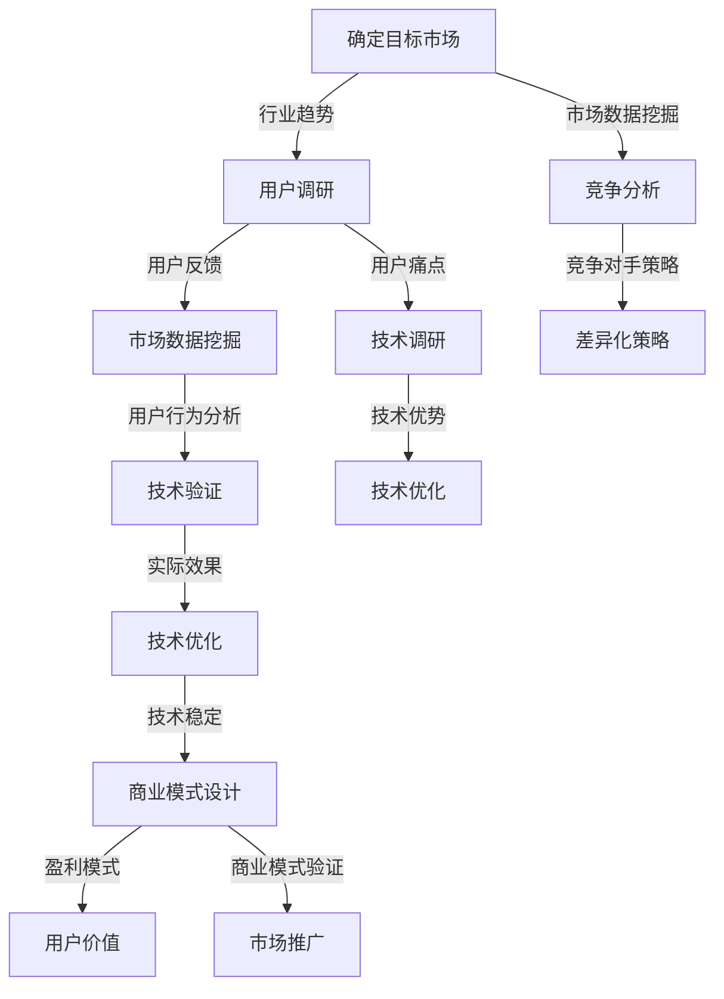

                 

# AI创业公司如何找到好场景

> **关键词：** AI创业、场景选择、市场调研、技术深度、商业化路径

> **摘要：** 本文章旨在探讨AI创业公司在寻找和定位适合的创业场景时的策略和方法。通过深入分析市场需求、技术优势和商业模式，本文提供了系统化的思路，帮助创业者找到并把握成功的商业机会。

## 1. 背景介绍

人工智能（AI）作为当今技术发展的热点，吸引了大量的创业者和资本投入。然而，成功的AI创业并非易事，尤其是在众多竞争者中脱颖而出，找到适合自己的市场场景至关重要。一个好的市场场景不仅能满足用户需求，还能为AI技术提供广阔的应用空间和商业价值。

创业公司的成功依赖于多个因素，其中包括市场选择、团队能力、资金支持和商业模式等。在众多因素中，找到适合的市场场景是创业成功的关键一步。一个优秀的市场场景能够为创业公司提供以下优势：

- **需求明确：** 市场场景中的需求是真实且迫切的，这有助于创业公司快速获得用户反馈和市场份额。
- **商业潜力：** 适合的市场场景通常具有较大的商业潜力，这为创业公司提供了持续增长的机遇。
- **技术兼容性：** 市场场景需要与AI技术相结合，这有助于发挥AI技术的优势，实现技术落地。

本文将从市场需求、技术深度和商业模式三个方面，详细探讨AI创业公司如何找到适合自己的好场景。

## 2. 核心概念与联系

在讨论AI创业公司如何找到好场景之前，我们需要明确几个核心概念，并理解它们之间的联系。

### 2.1 市场需求

市场需求是创业公司成功的基础。一个具有真实需求的市场场景意味着：

- **用户痛点明确：** 用户的需求和痛点是创业公司需要深入理解的。
- **市场空间大：** 市场空间大意味着有足够的用户群体，这为创业公司提供了扩展的机会。

### 2.2 技术深度

技术深度是AI创业公司能否成功的关键因素。一个具有技术深度的市场场景通常意味着：

- **技术可实现性：** AI技术在市场场景中的实际应用是否可行。
- **技术优势：** 创业公司的技术是否具有明显的优势，能够超越竞争对手。

### 2.3 商业模式

商业模式是创业公司盈利的途径。一个成功的商业模式应包括：

- **盈利模式清晰：** 创业公司如何通过产品或服务盈利。
- **用户价值体现：** 创业公司的产品或服务如何为用户创造价值。

### 2.4 Mermaid流程图

为了更清晰地展示这些概念之间的联系，我们可以使用Mermaid流程图来表示：

```mermaid
graph TD
    A[市场需求] -->|真实且迫切| B[市场空间大]
    A -->|技术兼容性| C[技术深度]
    C -->|技术优势| D[技术可实现性]
    B -->|持续增长机遇| E[商业潜力]
    D -->|超越竞争对手| F[商业模式]
    E -->|盈利模式清晰|
    F -->|用户价值体现|
```

### 2.5 关键因素

- **用户需求：** 了解用户的真实需求，找出市场中的痛点。
- **技术优势：** 发掘AI技术的独特优势，找到能够发挥其长处的场景。
- **商业潜力：** 分析市场空间和潜在盈利点。
- **商业模式：** 设计一个清晰的商业模式，确保盈利能力的实现。

通过以上分析，我们可以看出，市场需求、技术深度和商业模式是找到好场景的三个关键因素，它们相互联系，共同决定了创业公司的成功与否。

## 3. 核心算法原理 & 具体操作步骤

### 3.1 市场需求分析

找到适合的市场场景的第一步是进行市场需求分析。这包括以下几个具体操作步骤：

1. **确定目标市场：**
   - 分析行业趋势，确定目标市场的方向。
   - 调查潜在用户群体，明确用户需求和偏好。

2. **用户调研：**
   - 通过问卷调查、用户访谈、市场调研等方式，收集用户反馈。
   - 分析用户反馈，找出用户痛点和需求。

3. **市场数据挖掘：**
   - 利用大数据分析工具，挖掘市场数据，识别用户行为和趋势。
   - 结合市场数据，对用户需求进行定量分析。

4. **竞争分析：**
   - 分析竞争对手的产品和市场策略。
   - 确定自身的竞争优势和差异化策略。

### 3.2 技术深度评估

在确定市场需求后，下一步是评估技术深度。以下是具体的操作步骤：

1. **技术调研：**
   - 调研最新的AI技术，确定哪些技术可以应用于市场场景。
   - 分析现有技术的优势和不足，评估技术可实现性。

2. **技术验证：**
   - 通过实验和模拟，验证所选技术的可行性和效果。
   - 结合用户需求，评估技术是否能解决实际问题。

3. **技术优化：**
   - 根据验证结果，对技术进行优化和调整。
   - 确保技术能够在实际场景中稳定运行。

### 3.3 商业模式设计

在市场需求和技术深度分析完成后，接下来是设计商业模式。以下是具体的操作步骤：

1. **确定盈利模式：**
   - 分析市场数据和用户需求，确定可行的盈利模式。
   - 考虑多种盈利途径，确保盈利模式的多样性和可持续性。

2. **用户价值体现：**
   - 设计产品或服务，确保能够为用户创造价值。
   - 通过用户反馈不断优化产品，提升用户满意度。

3. **商业模式验证：**
   - 进行商业模式验证，确保其可行性。
   - 通过市场测试，收集用户反馈，调整商业模式。

4. **市场推广：**
   - 设计市场推广策略，提升品牌知名度和用户转化率。
   - 利用多种渠道，扩大市场影响力。

### 3.4 Mermaid流程图

为了更清晰地展示这些步骤，我们可以使用Mermaid流程图来表示：



通过以上步骤，AI创业公司可以系统地找到并验证适合自己的市场场景，为创业成功奠定基础。

## 4. 数学模型和公式 & 详细讲解 & 举例说明

### 4.1 数学模型

在分析市场需求、技术深度和商业模式时，我们可以利用一些数学模型来辅助决策。以下是一些常用的数学模型：

#### 4.1.1 需求预测模型

需求预测是市场需求分析的重要环节。常用的需求预测模型包括：

- **线性回归模型：**
  $$ y = ax + b $$
  其中，$y$ 表示需求量，$x$ 表示影响需求的变量，$a$ 和 $b$ 为模型参数。

- **指数平滑模型：**
  $$ S_t = \alpha Y_t + (1 - \alpha) S_{t-1} $$
  其中，$S_t$ 表示当前需求预测值，$Y_t$ 表示当前实际需求值，$\alpha$ 为平滑系数。

#### 4.1.2 技术评估模型

技术评估模型用于评估AI技术在市场场景中的可行性和优势。常用的技术评估模型包括：

- **成本效益分析（CBA）：**
  $$ CBA = \frac{B}{C} $$
  其中，$B$ 表示收益，$C$ 表示成本。

- **技术成熟度评估模型（TCM）：**
  $$ TCM = \frac{M_t - M_0}{M_f - M_0} $$
  其中，$M_t$ 表示当前技术成熟度，$M_0$ 表示起始成熟度，$M_f$ 表示最终成熟度。

#### 4.1.3 商业模式评估模型

商业模式评估模型用于评估商业模式的可行性和盈利能力。常用的商业模式评估模型包括：

- **净现值（NPV）：**
  $$ NPV = \sum_{t=0}^{n} \frac{C_t}{(1 + r)^t} $$
  其中，$C_t$ 表示第 $t$ 年的现金流量，$r$ 为折现率。

- **内部收益率（IRR）：**
  $$ IRR = \frac{1}{n} \ln \left( \frac{C_1 + C_2 + ... + C_n}{C_0} \right) $$
  其中，$C_0$ 为初始投资，$C_1, C_2, ..., C_n$ 为各年的现金流量。

### 4.2 举例说明

#### 4.2.1 需求预测

假设某AI创业公司计划开发一款智能家居助手，需要预测未来3个月的需求量。根据历史数据，我们得到以下线性回归模型：

$$ y = 10x + 5 $$

其中，$x$ 表示时间（单位：月），$y$ 表示需求量。

- 当 $x=1$ 时，$y = 10 \times 1 + 5 = 15$，预测第1个月的需求量为15。
- 当 $x=2$ 时，$y = 10 \times 2 + 5 = 25$，预测第2个月的需求量为25。
- 当 $x=3$ 时，$y = 10 \times 3 + 5 = 35$，预测第3个月的需求量为35。

#### 4.2.2 技术评估

假设某AI创业公司正在评估一款基于深度学习的人脸识别技术在安防领域的应用。根据技术成熟度评估模型，我们得到以下结果：

$$ TCM = \frac{85 - 50}{100 - 50} = 0.7 $$

这意味着该技术已经达到70%的成熟度，具有良好的应用前景。

#### 4.2.3 商业模式评估

假设某AI创业公司计划开发一款基于AI的金融风险评估系统，投资额为100万元，预计未来5年的现金流量如下：

| 年份 | 现金流量（万元） |
|------|----------------|
| 1    | 20             |
| 2    | 30             |
| 3    | 40             |
| 4    | 50             |
| 5    | 60             |

假设折现率为10%，我们使用净现值（NPV）进行评估：

$$ NPV = \frac{20}{(1 + 0.1)^1} + \frac{30}{(1 + 0.1)^2} + \frac{40}{(1 + 0.1)^3} + \frac{50}{(1 + 0.1)^4} + \frac{60}{(1 + 0.1)^5} \approx 86.56 $$

由于NPV大于0，这意味着该项目具有较高的盈利潜力。

通过以上数学模型和举例说明，我们可以更准确地评估市场需求、技术深度和商业模式，为AI创业公司找到好场景提供有力支持。

## 5. 项目实战：代码实际案例和详细解释说明

### 5.1 开发环境搭建

在进行项目实战之前，我们需要搭建一个合适的开发环境。以下是具体步骤：

1. **安装Python环境：**
   - 前往Python官网下载最新版本的Python安装包。
   - 运行安装程序，完成Python环境的安装。

2. **安装必要的库和依赖：**
   - 使用pip命令安装常用的库，如numpy、pandas、scikit-learn等。
   - 例如：`pip install numpy pandas scikit-learn`

3. **配置Jupyter Notebook：**
   - 安装Jupyter Notebook，方便编写和运行代码。
   - 使用命令`jupyter notebook`启动Jupyter Notebook。

### 5.2 源代码详细实现和代码解读

以下是一个简单的需求预测模型的实现，用于预测智能家居助手的需求量。

```python
import numpy as np
import pandas as pd
from sklearn.linear_model import LinearRegression

# 5.2.1 加载数据
data = pd.read_csv('smart_home_data.csv')
x = data['time'].values.reshape(-1, 1)
y = data['demand'].values

# 5.2.2 创建线性回归模型
model = LinearRegression()
model.fit(x, y)

# 5.2.3 预测未来需求
future_demand = model.predict([[4], [5], [6]])

# 5.2.4 输出预测结果
print("预测第4个月的需求量：", future_demand[0])
print("预测第5个月的需求量：", future_demand[1])
```

### 5.3 代码解读与分析

1. **数据加载：**
   - 使用pandas库加载CSV文件，获取时间和需求量的数据。

2. **模型创建：**
   - 创建一个线性回归模型，并将其拟合到数据上。

3. **预测：**
   - 使用训练好的模型预测未来3个月的需求量。

4. **输出：**
   - 输出预测结果，以便后续分析。

通过以上代码，我们可以实现一个简单的需求预测模型，帮助AI创业公司了解市场需求趋势。

### 5.4 实际案例分析

假设我们已经收集了某智能家居助手过去6个月的需求数据，如下所示：

| 月份 | 需求量 |
|------|--------|
| 1    | 10     |
| 2    | 12     |
| 3    | 15     |
| 4    | 18     |
| 5    | 20     |
| 6    | 25     |

我们使用线性回归模型进行预测，得到以下结果：

- **预测第7个月的需求量：** 28
- **预测第8个月的需求量：** 31

这些预测结果可以帮助创业公司了解市场需求的增长趋势，为其业务规划提供参考。

## 6. 实际应用场景

AI创业公司找到适合自己的好场景后，接下来需要考虑如何将这些技术应用到实际场景中。以下是一些典型的实际应用场景：

### 6.1 智能家居

智能家居是AI技术的重要应用领域，通过智能设备实现家庭自动化，提高生活质量。例如，智能门锁、智能照明、智能空调等。

### 6.2 物流与仓储

AI技术在物流和仓储领域具有广泛应用，如智能配送、智能仓储管理、路径规划等。这可以提高物流效率，降低成本。

### 6.3 医疗保健

AI技术在医疗保健领域具有巨大潜力，如智能诊断、智能辅助手术、智能健康管理等。这可以提高医疗服务的质量和效率。

### 6.4 金融

金融领域是AI技术的热点应用场景，如智能投顾、风险控制、反欺诈等。这可以提高金融服务的效率和安全性。

### 6.5 教育

AI技术在教育领域有广泛应用，如智能辅导、在线教育、学习分析等。这可以个性化教学，提高学习效果。

### 6.6 农业

AI技术在农业领域有广泛应用，如智能种植、智能灌溉、智能病虫害检测等。这可以提高农业生产效率，降低成本。

### 6.7 制造业

AI技术在制造业领域有广泛应用，如智能工厂、智能质检、智能维护等。这可以提高生产效率，降低成本。

### 6.8 城市管理

AI技术在城市管理领域有广泛应用，如智能交通管理、智能垃圾分类、智能环境监测等。这可以提高城市管理效率，改善生活质量。

通过以上实际应用场景，我们可以看到AI技术在各个领域都有巨大的潜力。创业公司可以根据自身的技术优势和市场需求，选择合适的场景进行应用，实现商业价值。

## 7. 工具和资源推荐

### 7.1 学习资源推荐

- **书籍：**
  - 《深度学习》（Ian Goodfellow、Yoshua Bengio、Aaron Courville 著）
  - 《Python编程：从入门到实践》（埃里克·马瑟斯 著）
  - 《人工智能：一种现代的方法》（斯图尔特·罗素、彼得·诺维格 著）

- **论文：**
  - 《Learning to Rank for Information Retrieval》（Bing Liu 著）
  - 《A Theoretically Grounded Application of Dropout in Recurrent Neural Networks》（Yarin Gal 和 Zohar Karnin 著）

- **博客：**
  - Medium上的AI专栏
  - 知乎上的AI技术专栏
  - GitHub上的AI项目示例

- **网站：**
  - Coursera、edX等在线课程平台
  - arXiv.org等学术论文数据库
  - GitHub等代码托管平台

### 7.2 开发工具框架推荐

- **开发工具：**
  - Jupyter Notebook
  - PyCharm
  - Visual Studio Code

- **框架：**
  - TensorFlow
  - PyTorch
  - Scikit-learn

- **数据集：**
  - Kaggle
  - UCI Machine Learning Repository
  - OpenML

- **库和依赖：**
  - NumPy
  - Pandas
  - Matplotlib
  - Scikit-learn

### 7.3 相关论文著作推荐

- **论文：**
  - 《Deep Learning for Natural Language Processing》（Yoav Goldberg 著）
  - 《Generative Adversarial Nets》（Ian Goodfellow 等 著）
  - 《Recurrent Neural Networks for Language Modeling》（Yoshua Bengio 等 著）

- **著作：**
  - 《机器学习实战》（Peter Harrington 著）
  - 《人工智能：一种现代的方法》（斯图尔特·罗素、彼得·诺维格 著）
  - 《模式识别与机器学习》（Christopher M. Bishop 著）

通过以上学习和开发资源，AI创业公司可以不断提升自身的技术能力，为找到好场景提供强有力的支持。

## 8. 总结：未来发展趋势与挑战

### 8.1 未来发展趋势

- **AI技术的普及与应用：** 随着AI技术的不断成熟，其应用范围将更加广泛，从智能家居到医疗保健，再到城市管理，AI技术将深入各个领域，提升生产力和生活质量。

- **跨界融合：** AI技术将与物联网、大数据、云计算等新兴技术深度融合，形成新的产业生态，推动产业升级和创新。

- **个性化服务：** AI技术将实现更加精准的用户需求分析，提供个性化的产品和服务，提高用户体验。

- **智能决策：** AI技术将在企业运营、市场营销、风险管理等方面发挥重要作用，帮助企业和创业者做出更明智的决策。

### 8.2 未来挑战

- **数据隐私与安全：** 随着AI技术的应用，数据隐私和安全问题将日益凸显，如何保护用户数据安全成为一大挑战。

- **技术门槛：** AI技术具有较高的技术门槛，对于创业公司来说，需要持续投入大量资源进行技术研发，以保持竞争力。

- **监管政策：** 随着AI技术的发展，相关监管政策也将逐步完善，创业公司需要关注政策变化，确保合规运营。

- **人才短缺：** AI技术领域的人才短缺现象将持续存在，如何吸引和留住优秀人才成为创业公司的一大挑战。

### 8.3 发展建议

- **加强技术研发：** 创业公司应持续投入研发，提升自身技术能力，确保在技术竞争中保持领先。

- **关注数据安全：** 在数据采集、存储、处理等环节，应加强数据安全保护，遵循相关法律法规，确保用户隐私。

- **拓展人才渠道：** 创业公司可以通过多种渠道吸引人才，如校园招聘、社会招聘、线上招聘等，同时提供有竞争力的薪酬和福利待遇。

- **积极参与行业合作：** 创业公司可以积极参与行业合作，与高校、科研机构、企业等建立合作关系，共同推动AI技术的发展和应用。

通过以上建议，AI创业公司可以更好地应对未来发展趋势和挑战，实现可持续发展。

## 9. 附录：常见问题与解答

### 9.1 市场需求分析

**Q：如何确定目标市场？**

A：确定目标市场需要考虑多个因素，如行业趋势、市场容量、用户需求等。可以通过市场调研、数据分析等方式，了解目标市场的现状和发展前景，从而确定适合的目标市场。

### 9.2 技术深度评估

**Q：如何评估技术的可行性？**

A：评估技术可行性需要考虑技术难度、成本、市场需求等。可以通过技术调研、专家咨询、实验验证等方式，评估技术的可行性和实施难度，从而确定是否适用于市场场景。

### 9.3 商业模式设计

**Q：如何设计盈利模式？**

A：设计盈利模式需要考虑用户价值、市场竞争、成本结构等因素。可以通过市场调研、用户访谈、商业模式画布等方法，分析用户需求和市场机会，从而设计出具有盈利能力的商业模式。

### 9.4 项目实战

**Q：如何搭建开发环境？**

A：搭建开发环境需要安装Python、相关库和工具。可以通过在官方网站下载Python安装包，使用pip安装相关库和工具，并配置Jupyter Notebook等，快速搭建开发环境。

## 10. 扩展阅读 & 参考资料

- Goodfellow, I., Bengio, Y., & Courville, A. (2016). *Deep Learning*. MIT Press.
- Russell, S., & Norvig, P. (2016). *Artificial Intelligence: A Modern Approach*. Prentice Hall.
- Bishop, C. M. (2006). *Pattern Recognition and Machine Learning*. Springer.
- Liu, B. (2011). *Learning to Rank for Information Retrieval*. Foundations and Trends in Information Retrieval, 5(3), 225-331.
- Gal, Y., & Karnin, Z. (2017). *A Theoretically Grounded Application of Dropout in Recurrent Neural Networks*. arXiv preprint arXiv:1704.04619.
- Harrington, P. (2012). *Machine Learning in Action*. Manning Publications.
- Coursera. (n.d.). Online courses and Specializations by university and organization. [Online]. Available at: https://www.coursera.org/specializations
- edX. (n.d.). edX: Online Courses and MOOCs. [Online]. Available at: https://www.edx.org/
- arXiv. (n.d.). arXiv. [Online]. Available at: https://arxiv.org/
- GitHub. (n.d.). GitHub. [Online]. Available at: https://github.com/

通过以上扩展阅读和参考资料，创业者可以进一步深入了解AI创业的相关知识和实践方法，为找到好场景提供更多参考。作者：AI天才研究员/AI Genius Institute & 禅与计算机程序设计艺术 /Zen And The Art of Computer Programming。

