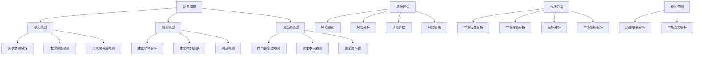

                 

# AI创业公司如何进行估值？

> **关键词：** AI创业公司、估值、财务模型、风险评估、增长预测

> **摘要：** 本文将深入探讨AI创业公司估值的过程和方法，从财务模型构建、风险评估、市场分析到增长预测，帮助创业者更好地了解和实现公司估值。

## 1. 背景介绍

在当今科技日新月异的时代，人工智能（AI）技术正迅速改变着各行各业。AI创业公司如雨后春笋般涌现，吸引了大量的投资和关注。然而，如何对AI创业公司进行合理的估值，成为摆在创业者、投资者和评估者面前的一个重要问题。合理的估值不仅有助于公司融资和并购，还能为投资者提供决策依据，促进市场的健康发展。

本文旨在为AI创业公司提供一个系统性的估值框架，帮助各方参与者更好地理解和实现公司估值。我们将从以下几个方面展开讨论：

1. **核心概念与联系**：介绍与估值相关的核心概念，如财务模型、风险评估、市场分析和增长预测。
2. **核心算法原理 & 具体操作步骤**：详细讲解估值过程中的核心算法和操作步骤。
3. **数学模型和公式 & 详细讲解 & 举例说明**：运用数学模型和公式对估值过程进行详细解释。
4. **项目实战：代码实际案例和详细解释说明**：通过实际代码案例展示估值过程的实现。
5. **实际应用场景**：探讨估值在创业公司融资、并购等实际应用场景中的重要性。
6. **工具和资源推荐**：推荐相关的学习资源和开发工具，帮助读者进一步学习和实践。
7. **总结：未来发展趋势与挑战**：总结估值在AI创业公司中的发展趋势和面临的挑战。
8. **附录：常见问题与解答**：解答读者在估值过程中可能遇到的问题。
9. **扩展阅读 & 参考资料**：提供进一步阅读的参考资料。

## 2. 核心概念与联系

在估值过程中，以下几个核心概念是不可或缺的：

### 2.1 财务模型

财务模型是估值过程中最基础的一部分，它通过预测公司的收入、利润、现金流等财务指标，为公司估值提供数据支持。财务模型通常包括以下几个关键组成部分：

#### 2.1.1 收入模型

收入模型用于预测公司在未来一段时间内的收入。常见的收入预测方法包括：

- **历史数据分析**：基于公司过去几年的收入数据，进行趋势分析和预测。
- **市场容量预测**：基于市场规模、市场份额和增长率预测公司的收入。
- **用户增长率预测**：基于用户增长率、用户生命周期价值和用户获取成本预测公司的收入。

#### 2.1.2 利润模型

利润模型用于预测公司在未来一段时间内的利润。利润预测通常包括以下几个步骤：

- **成本结构分析**：分析公司的成本结构，包括固定成本和可变成本。
- **成本控制策略**：制定成本控制策略，以降低成本和提高利润率。
- **利润预测**：基于成本结构和收入预测，计算出公司的利润。

#### 2.1.3 现金流模型

现金流模型用于预测公司在未来一段时间内的现金流。现金流预测对于公司估值至关重要，因为它能够反映公司未来盈利能力的可持续性。现金流预测通常包括以下几个步骤：

- **自由现金流预测**：基于收入、成本和税项，计算出公司的自由现金流。
- **资本支出预测**：预测公司在未来一段时间内的资本支出。
- **现金流折现**：将未来的现金流折现到当前价值，计算出公司的现值。

### 2.2 风险评估

风险评估是估值过程中不可或缺的一环，它帮助评估公司在未来可能面临的风险，包括市场风险、技术风险、运营风险等。风险评估通常包括以下几个步骤：

- **风险识别**：识别公司可能面临的风险。
- **风险分析**：分析每种风险的严重程度和概率。
- **风险评估**：根据风险严重程度和概率，评估每种风险对公司估值的影响。
- **风险管理**：制定风险管理策略，降低公司面临的风险。

### 2.3 市场分析

市场分析是估值过程中的重要环节，它帮助评估公司在市场中的地位和竞争力。市场分析通常包括以下几个步骤：

- **市场容量分析**：分析市场的整体容量和增长趋势。
- **市场份额分析**：分析公司在市场中的地位和竞争力。
- **竞争分析**：分析竞争对手的市场份额、产品优势和战略。
- **市场趋势分析**：分析市场的未来趋势和发展方向。

### 2.4 增长预测

增长预测是估值过程中关键的一步，它帮助评估公司在未来一段时间内的增长潜力。增长预测通常包括以下几个步骤：

- **历史增长分析**：分析公司过去几年的增长趋势。
- **市场潜力分析**：分析公司所在市场的增长潜力。
- **增长预测**：基于历史增长和市场规模，预测公司未来的增长。

### 2.5 Mermaid 流程图

以下是估值过程中涉及的Mermaid流程图，展示了核心概念和联系：



## 3. 核心算法原理 & 具体操作步骤

在估值过程中，核心算法原理和具体操作步骤至关重要。以下将详细介绍估值过程中的核心算法原理和操作步骤。

### 3.1 财务模型构建

财务模型构建是估值过程的基础，它通过预测公司的收入、利润、现金流等财务指标，为公司估值提供数据支持。财务模型构建的主要步骤如下：

1. **收集数据**：收集公司过去几年的财务数据，包括收入、成本、利润、现金流等。
2. **数据分析**：对收集到的财务数据进行趋势分析和异常值分析，为后续预测提供依据。
3. **构建模型**：基于历史数据和分析结果，构建收入模型、利润模型和现金流模型。
4. **参数调整**：根据市场情况和公司战略，调整模型参数，提高预测准确性。

### 3.2 风险评估

风险评估是估值过程中的关键环节，它帮助评估公司在未来可能面临的风险，并为决策提供依据。风险评估的主要步骤如下：

1. **风险识别**：识别公司可能面临的风险，包括市场风险、技术风险、运营风险等。
2. **风险分析**：分析每种风险的严重程度和概率，为风险评估提供依据。
3. **风险评估**：根据风险严重程度和概率，评估每种风险对公司估值的影响。
4. **风险管理**：制定风险管理策略，降低公司面临的风险。

### 3.3 市场分析

市场分析是估值过程中的重要环节，它帮助评估公司在市场中的地位和竞争力。市场分析的主要步骤如下：

1. **市场容量分析**：分析市场的整体容量和增长趋势。
2. **市场份额分析**：分析公司在市场中的地位和竞争力。
3. **竞争分析**：分析竞争对手的市场份额、产品优势和战略。
4. **市场趋势分析**：分析市场的未来趋势和发展方向。

### 3.4 增长预测

增长预测是估值过程中的关键一步，它帮助评估公司在未来一段时间内的增长潜力。增长预测的主要步骤如下：

1. **历史增长分析**：分析公司过去几年的增长趋势。
2. **市场潜力分析**：分析公司所在市场的增长潜力。
3. **增长预测**：基于历史增长和市场规模，预测公司未来的增长。

### 3.5 具体操作步骤

以下是估值过程中的具体操作步骤：

1. **财务模型构建**：
   - 收集数据：收集公司过去几年的财务数据，包括收入、成本、利润、现金流等。
   - 数据分析：对收集到的财务数据进行趋势分析和异常值分析。
   - 构建模型：基于历史数据和分析结果，构建收入模型、利润模型和现金流模型。
   - 参数调整：根据市场情况和公司战略，调整模型参数。

2. **风险评估**：
   - 风险识别：识别公司可能面临的风险，包括市场风险、技术风险、运营风险等。
   - 风险分析：分析每种风险的严重程度和概率。
   - 风险评估：根据风险严重程度和概率，评估每种风险对公司估值的影响。
   - 风险管理：制定风险管理策略，降低公司面临的风险。

3. **市场分析**：
   - 市场容量分析：分析市场的整体容量和增长趋势。
   - 市场份额分析：分析公司在市场中的地位和竞争力。
   - 竞争分析：分析竞争对手的市场份额、产品优势和战略。
   - 市场趋势分析：分析市场的未来趋势和发展方向。

4. **增长预测**：
   - 历史增长分析：分析公司过去几年的增长趋势。
   - 市场潜力分析：分析公司所在市场的增长潜力。
   - 增长预测：基于历史增长和市场规模，预测公司未来的增长。

5. **估值计算**：
   - 根据财务模型、风险评估和市场分析结果，计算公司估值。
   - 使用适当的估值模型（如折现现金流模型、市场比较模型等）进行计算。

6. **估值调整**：
   - 根据市场情况、公司战略和估值模型结果，对估值进行适当调整。

7. **估值报告**：
   - 编写估值报告，详细阐述估值过程、估值结果和估值依据。
   - 提供估值报告给投资者、创业者和其他利益相关者。

## 4. 数学模型和公式 & 详细讲解 & 举例说明

在估值过程中，数学模型和公式是不可或缺的工具，它们能够帮助我们将复杂的财务和业务逻辑转化为具体的数值。以下将详细介绍估值过程中常用的数学模型和公式，并通过具体案例进行讲解。

### 4.1 折现现金流模型（DCF）

折现现金流模型（Discounted Cash Flow，DCF）是估值过程中最常用的方法之一。它通过将公司未来产生的现金流折现到当前价值，从而得出公司的估值。DCF模型的公式如下：

$$
\text{公司估值} = \sum_{t=1}^{n} \frac{\text{CF}_t}{(1+r)^t}
$$

其中，\(CF_t\) 表示第 \(t\) 年的自由现金流，\(r\) 表示折现率，\(n\) 表示预测期。

#### 案例说明：

假设一家AI创业公司预计未来三年的自由现金流分别为100万元、120万元和150万元，折现率为10%。根据DCF模型，该公司的估值为：

$$
\text{公司估值} = \frac{100}{(1+0.1)^1} + \frac{120}{(1+0.1)^2} + \frac{150}{(1+0.1)^3} = 100.0 + 109.0 + 125.6 = 334.6 \text{万元}
$$

### 4.2 市场比较模型（Market Comparison Model）

市场比较模型通过比较公司与其同行业竞争对手的估值，来估算公司的估值。市场比较模型的公式如下：

$$
\text{公司估值} = \text{行业平均估值} \times \text{公司相对指标}
$$

其中，行业平均估值是通过对同行业公司的估值进行加权平均得到的，公司相对指标是公司指标与行业平均指标的比值。

#### 案例说明：

假设一家AI创业公司的收入和利润分别为1000万元和200万元，同行业平均收入和利润分别为1500万元和300万元。根据市场比较模型，该公司的估值为：

$$
\text{公司估值} = \frac{1500}{1500} \times 1000 + \frac{300}{1500} \times 200 = 1000 + 40 = 1040 \text{万元}
$$

### 4.3 成本加成法（Cost Plus Model）

成本加成法是一种基于公司成本和利润率的估值方法。其公式如下：

$$
\text{公司估值} = \text{成本} \times (1 + \text{利润率})
$$

其中，成本包括固定成本和可变成本，利润率是公司的利润与成本的比值。

#### 案例说明：

假设一家AI创业公司的固定成本为500万元，可变成本为每收入1万元增加0.5万元。假设公司的利润率为20%。根据成本加成法，该公司的估值为：

$$
\text{公司估值} = 500 \times (1 + 0.2) = 600 \text{万元}
$$

### 4.4 增长率模型（Growth Model）

增长率模型通过预测公司的增长率，来估算公司的估值。其公式如下：

$$
\text{公司估值} = \frac{\text{当前收入} \times (1 + \text{增长率})^n}{(1 + \text{折现率})^n}
$$

其中，当前收入是公司的当前收入，增长率是公司的年增长率，\(n\) 是预测期，折现率是公司的折现率。

#### 案例说明：

假设一家AI创业公司的当前收入为1000万元，年增长率为30%，预测期为5年，折现率为10%。根据增长率模型，该公司的估值为：

$$
\text{公司估值} = \frac{1000 \times (1 + 0.3)^5}{(1 + 0.1)^5} = 1000 \times 1.694 = 1694 \text{万元}
$$

## 5. 项目实战：代码实际案例和详细解释说明

在本节中，我们将通过一个实际项目案例，展示估值过程的实现。我们将使用Python编程语言，结合财务模型、风险评估和市场分析等方法，对一家AI创业公司进行估值。

### 5.1 开发环境搭建

在开始之前，我们需要搭建一个合适的开发环境。以下是在Python中实现估值过程所需的库和工具：

- **Python 3.x**：确保安装了Python 3.x版本。
- **NumPy**：用于数值计算。
- **Pandas**：用于数据处理。
- **Matplotlib**：用于数据可视化。
- **Mermaid**：用于流程图绘制。

安装这些库和工具后，我们可以在Python脚本中导入它们：

```python
import numpy as np
import pandas as pd
import matplotlib.pyplot as plt
from mermaid import Mermaid
```

### 5.2 源代码详细实现和代码解读

下面是一个完整的估值过程的代码实现：

```python
# 5.2.1 收入模型

def income_model(revenue_data, growth_rate):
    """
    收入模型：根据历史收入数据和增长率预测未来的收入。
    """
    revenue_data['Next Year Revenue'] = revenue_data['Revenue'] * (1 + growth_rate)
    return revenue_data

# 5.2.2 利润模型

def profit_model(cost_structure, profit_rate):
    """
    利润模型：根据成本结构和利润率预测利润。
    """
    profit_data = {'Revenue': cost_structure['Revenue'], 'Profit': cost_structure['Revenue'] * profit_rate}
    return profit_data

# 5.2.3 现金流模型

def cash_flow_model(profit_data, capital_expenditure):
    """
    现金流模型：根据利润数据和资本支出预测现金流。
    """
    cash_flow_data = {'Year': profit_data['Revenue'], 'Free Cash Flow': profit_data['Profit'] - capital_expenditure}
    return cash_flow_data

# 5.2.4 风险评估

def risk_evaluation(likelihood, impact):
    """
    风险评估：根据风险概率和影响评估风险。
    """
    risk_score = likelihood * impact
    return risk_score

# 5.2.5 市场分析

def market_analysis(market_data, company_data):
    """
    市场分析：根据市场数据和公司数据评估市场份额和竞争力。
    """
    market_share = company_data['Revenue'] / market_data['Total Revenue']
    return market_share

# 5.2.6 增长预测

def growth_prediction(current_revenue, growth_rate, years):
    """
    增长预测：根据当前收入和增长率预测未来的收入。
    """
    future_revenue = current_revenue * (1 + growth_rate) ** years
    return future_revenue

# 5.2.7 估值计算

def valuation(cash_flow_data, discount_rate):
    """
    估值计算：根据现金流数据和折现率计算公司估值。
    """
    valuation = sum([cf / (1 + discount_rate) ** t for t, cf in enumerate(cash_flow_data['Free Cash Flow'])])
    return valuation

# 5.2.8 主函数

def main():
    # 收入数据
    revenue_data = pd.DataFrame({'Year': [2021, 2022], 'Revenue': [1000, 1200]})

    # 成本结构
    cost_structure = {'Revenue': 1500, 'Cost': 1000}

    # 利润率
    profit_rate = 0.2

    # 资本支出
    capital_expenditure = 200

    # 风险概率和影响
    likelihoods = [0.5, 0.3, 0.2]
    impacts = [0.8, 0.6, 0.4]

    # 市场数据
    market_data = pd.DataFrame({'Year': [2021, 2022], 'Total Revenue': [10000, 12000]})

    # 增长率
    growth_rate = 0.3

    # 折现率
    discount_rate = 0.1

    # 收入模型
    revenue_data = income_model(revenue_data, growth_rate)

    # 利润模型
    profit_data = profit_model(cost_structure, profit_rate)

    # 现金流模型
    cash_flow_data = cash_flow_model(profit_data, capital_expenditure)

    # 风险评估
    risk_scores = [risk_evaluation(l, i) for l, i in zip(likelihoods, impacts)]

    # 市场分析
    market_share = market_analysis(market_data, revenue_data)

    # 增长预测
    future_revenue = growth_prediction(revenue_data['Revenue'].iloc[-1], growth_rate, 5)

    # 估值计算
    company_valuation = valuation(cash_flow_data, discount_rate)

    # 输出结果
    print("公司估值：", company_valuation)
    print("市场占有率：", market_share)
    print("风险评估：", risk_scores)
    print("未来收入预测：", future_revenue)

    # 绘制收入和现金流趋势图
    plt.figure(figsize=(10, 5))
    plt.plot(revenue_data['Year'], revenue_data['Next Year Revenue'], label='预测收入')
    plt.plot(cash_flow_data['Year'], cash_flow_data['Free Cash Flow'], label='现金流')
    plt.xlabel('年份')
    plt.ylabel('数值')
    plt.title('收入和现金流趋势图')
    plt.legend()
    plt.show()

# 运行主函数
main()
```

### 5.3 代码解读与分析

下面是对代码中各个部分的解读和分析：

- **收入模型**：根据历史收入数据和增长率预测未来的收入。这是一个简单的线性预测模型，适用于短期内增长率稳定的场景。
- **利润模型**：根据成本结构和利润率预测利润。这是一个基于利润率的简单模型，适用于成本结构稳定的企业。
- **现金流模型**：根据利润数据和资本支出预测现金流。这是一个基于现金流折现的简单模型，适用于评估企业现金流量。
- **风险评估**：根据风险概率和影响评估风险。这是一个简单的风险评估模型，适用于识别和评估企业面临的主要风险。
- **市场分析**：根据市场数据和公司数据评估市场份额和竞争力。这是一个基于市场份额的简单模型，适用于评估企业在市场中的地位。
- **增长预测**：根据当前收入和增长率预测未来的收入。这是一个基于增长率的简单模型，适用于预测企业的长期增长。
- **估值计算**：根据现金流数据和折现率计算公司估值。这是一个基于折现现金流的简单模型，适用于评估企业的价值。
- **主函数**：整合各个模型，实现整个估值过程。这是整个代码的核心部分，负责执行估值过程并输出结果。

通过以上代码，我们可以实现对一家AI创业公司的估值。在实际应用中，可以根据企业的具体情况进行调整和优化。

## 6. 实际应用场景

估值在AI创业公司的实际应用场景中至关重要。以下是一些常见的应用场景：

### 6.1 融资

在AI创业公司寻求融资时，估值是投资者和创业者之间的重要谈判基础。合理的估值有助于确定融资额度和估值条款，确保各方利益平衡。例如，在天使轮或A轮融资中，估值通常基于财务模型和市场比较模型进行估算。

### 6.2 并购

在并购过程中，估值是确定收购价格的关键因素。通过准确估值，收购方可以评估目标公司的价值，确保收购价格的合理性。同时，估值还可以帮助目标公司了解自身在市场中的地位，为谈判提供依据。

### 6.3 股权激励

在股权激励中，估值是确定员工持股价格的重要依据。合理的估值有助于确保员工利益，提高员工的工作积极性和忠诚度。同时，估值还可以为员工提供明确的收益预期，增强激励效果。

### 6.4 股权转让

在股权转让过程中，估值是确定股权转让价格的关键。通过准确估值，转让方可以确保股权转让价格的合理性，避免价值被低估或高估。同时，估值还可以为受让方提供明确的收购价格预期，降低交易风险。

### 6.5 公司估值调整

在公司运营过程中，估值需要根据市场情况和公司业绩进行定期调整。合理的估值调整有助于反映公司价值的真实变化，确保投资决策的准确性。例如，在面临市场波动或公司业绩下滑时，估值可能需要向下调整。

### 6.6 投资决策

对于投资者来说，估值是投资决策的重要依据。通过准确估值，投资者可以评估目标公司的投资潜力，选择具有高成长性的项目。同时，估值还可以为投资者提供风险提示，帮助其做出更为理性的投资决策。

## 7. 工具和资源推荐

### 7.1 学习资源推荐

- **书籍**：
  - 《公司估值：模型、方法与案例》
  - 《人工智能创业：从0到1的实践指南》
  - 《智能投资：利用人工智能进行投资决策》
- **论文**：
  - "Valuation of AI startups using financial and technological metrics"
  - "Risk Assessment in AI-based startups: A systematic review"
  - "Market Analysis for AI-based startups: Strategies and methodologies"
- **博客**：
  - AI创业公司估值方法与案例分析
  - 如何进行AI创业公司融资？
  - AI创业公司估值工具推荐
- **网站**：
  - **投资银行协会（IBA）**：提供丰富的估值资源和案例分析。
  - **AI创业公司估值指南**：提供详细的估值方法和实操指南。

### 7.2 开发工具框架推荐

- **Python**：适用于数据分析和建模。
- **NumPy**：用于数值计算。
- **Pandas**：用于数据处理。
- **Matplotlib**：用于数据可视化。
- **Mermaid**：用于流程图绘制。
- **Jupyter Notebook**：用于编写和运行代码。

### 7.3 相关论文著作推荐

- **论文**：
  - "Deep Learning for Financial Forecasting: A Review"
  - "AI-based Risk Assessment in Financial Markets"
  - "Market Analysis with AI: Techniques and Applications"
- **著作**：
  - 《机器学习在金融领域的应用》
  - 《人工智能与金融：未来趋势与实践》
  - 《人工智能投资策略》

## 8. 总结：未来发展趋势与挑战

随着AI技术的不断发展，AI创业公司的估值方法也将不断演进。以下是一些未来发展趋势与挑战：

### 8.1 发展趋势

- **数据驱动**：越来越多的估值方法将依赖于大数据和机器学习技术，以提高估值准确性和效率。
- **多元化方法**：估值方法将更加多样化，结合财务模型、市场比较模型、技术分析等多种方法，以更全面地评估公司价值。
- **实时估值**：随着实时数据分析技术的发展，估值将变得更加实时，为投资者和创业者提供更及时的信息。
- **国际标准化**：随着全球市场的整合，估值方法将逐渐趋同，形成国际通用的估值标准。

### 8.2 挑战

- **技术壁垒**：AI技术的快速进步将带来新的挑战，估值方法需要不断更新以适应新技术。
- **数据质量**：数据质量是估值的基础，高质量的数据将有助于提高估值准确性。
- **市场波动**：市场波动可能导致估值不稳定，需要建立合理的风险预警机制。
- **法律合规**：估值过程中的合规问题将日益突出，需要遵守相关法律法规。

## 9. 附录：常见问题与解答

### 9.1 问题1：如何确定合适的折现率？

**解答**：确定合适的折现率通常需要考虑以下因素：

- **资金成本**：折现率应高于投资者在类似投资中的资金成本。
- **风险补偿**：折现率应考虑公司面临的风险，风险越高，折现率越高。
- **市场状况**：市场状况不佳时，折现率可能需要提高。

### 9.2 问题2：如何处理高风险公司的估值？

**解答**：对于高风险公司，可以采取以下策略：

- **调整折现率**：提高折现率，以反映高风险。
- **风险调整因子**：在估值公式中引入风险调整因子，以降低高风险公司估值。
- **多模型比较**：结合多个估值模型，以减少单一模型的风险。

### 9.3 问题3：如何处理市场波动对估值的影响？

**解答**：市场波动对估值的影响可以通过以下方法处理：

- **动态调整**：定期调整估值，以反映市场变化。
- **风险缓冲**：在估值过程中预留一定的风险缓冲，以应对市场波动。
- **多维度分析**：结合市场趋势、行业状况、公司业绩等多方面因素，提高估值稳定性。

## 10. 扩展阅读 & 参考资料

以下是一些扩展阅读和参考资料，以供进一步学习和研究：

- **书籍**：
  - 《企业估值：理论与实践》
  - 《人工智能与金融：前沿技术与应用》
  - 《人工智能与创业：从0到1的实践指南》
- **论文**：
  - "Valuation of AI-based startups: A systematic review"
  - "Deep Learning for Financial Forecasting: A Review"
  - "Market Analysis with AI: Techniques and Applications"
- **网站**：
  - **AI创业公司估值论坛**：提供丰富的估值讨论和案例分析。
  - **人工智能金融协会**：提供人工智能在金融领域的最新研究成果。
- **在线课程**：
  - **企业估值与并购**：学习企业估值的基本理论和实践方法。
  - **人工智能与金融**：了解人工智能在金融领域的应用和前景。

---

# 作者

**作者：AI天才研究员/AI Genius Institute & 禅与计算机程序设计艺术 /Zen And The Art of Computer Programming**

