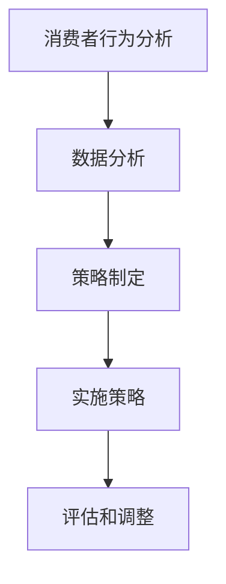

                 

# AI创业公司如何进行市场细分?

> **关键词**：市场细分、AI创业、消费者行为、数据分析、策略制定

> **摘要**：本文将深入探讨AI创业公司在进行市场细分方面的策略和步骤。通过深入分析消费者行为、数据分析和策略制定，我们将帮助创业公司更好地了解和定位目标市场，实现业务的快速增长。

## 1. 背景介绍

随着人工智能技术的不断发展，越来越多的创业公司开始涌入这个领域，希望通过AI技术实现业务的突破和创新。然而，市场竞争日益激烈，创业公司如何在众多竞争对手中脱颖而出，实现业务的快速增长，成为了每个创业者都需要面对的挑战。市场细分作为一种有效的市场策略，可以帮助创业公司更好地了解和定位目标市场，从而提高市场竞争力。

市场细分是指将一个较大的市场划分为若干个具有相似特征和需求的小市场，以便更好地满足不同消费者的需求。对于AI创业公司来说，市场细分有助于：

1. **识别目标客户**：通过市场细分，公司可以更准确地识别出最具潜力、最符合公司产品定位的目标客户群体。
2. **优化资源分配**：市场细分有助于公司更有效地分配资源，专注于最有利可图的市场部分。
3. **提高产品竞争力**：通过深入了解不同细分市场的需求，公司可以更有针对性地开发产品，提高产品竞争力。
4. **降低市场风险**：市场细分有助于公司分散风险，避免在某一特定市场过于依赖，从而提高业务稳定性。

本文将围绕AI创业公司如何进行市场细分这一主题，从消费者行为分析、数据分析、策略制定等方面进行深入探讨，以期为创业者提供实用的指导。

## 2. 核心概念与联系

### 2.1 消费者行为分析

消费者行为分析是市场细分的基础。通过分析消费者行为，公司可以更好地了解消费者的需求和偏好，从而制定更精准的市场细分策略。

#### 消费者行为分析框架：

1. **消费者特征**：包括人口统计特征（如年龄、性别、收入等）和地理特征（如地理位置、文化背景等）。
2. **购买行为**：包括购买频率、购买量、购买渠道等。
3. **消费动机**：包括消费者的购买动机、购买决策过程等。
4. **品牌忠诚度**：包括消费者对品牌的忠诚度、转换品牌的原因等。

### 2.2 数据分析

数据分析是市场细分的重要工具。通过收集和分析大量数据，公司可以识别出不同细分市场的特征和需求。

#### 数据分析流程：

1. **数据收集**：包括消费者行为数据、市场数据、竞争数据等。
2. **数据清洗**：去除重复、无效或错误的数据。
3. **数据分析**：使用统计学、机器学习等方法对数据进行分析，提取有价值的信息。
4. **数据可视化**：通过图表、图形等方式展示分析结果，帮助公司更直观地理解数据。

### 2.3 策略制定

策略制定是基于消费者行为分析和数据分析的结果，制定出具体的市场细分策略。

#### 策略制定步骤：

1. **确定目标市场**：根据分析结果，确定最具潜力的目标市场。
2. **制定差异化策略**：根据目标市场的特点，制定有针对性的差异化策略。
3. **实施策略**：将策略具体落实到产品开发、市场推广等环节。
4. **评估和调整**：定期评估策略效果，根据市场变化和竞争环境进行策略调整。

### 2.4 Mermaid 流程图

以下是一个简单的Mermaid流程图，展示了市场细分的基本流程：



（注意：Mermaid流程图中不要使用括号、逗号等特殊字符）

## 3. 核心算法原理 & 具体操作步骤

### 3.1 消费者行为分析算法原理

消费者行为分析通常使用以下算法：

1. **聚类分析**：通过将消费者分为不同的群体，识别出具有相似特征的消费者。
2. **关联规则挖掘**：通过分析消费者购买行为之间的关联性，识别出可能存在的潜在需求。
3. **时间序列分析**：通过分析消费者购买行为的时间序列，识别出购买趋势和周期。

### 3.2 数据分析算法原理

数据分析通常使用以下算法：

1. **机器学习算法**：如分类算法、聚类算法、回归算法等，用于分析消费者行为数据。
2. **文本分析算法**：如情感分析、主题建模等，用于分析消费者评论、反馈等文本数据。
3. **网络分析算法**：如社交网络分析、影响力分析等，用于分析消费者之间的互动和关系。

### 3.3 策略制定算法原理

策略制定通常基于以下算法：

1. **多目标优化算法**：用于优化市场细分策略，平衡不同目标（如市场份额、利润等）。
2. **决策树算法**：用于决策制定，根据不同条件选择最优策略。
3. **贝叶斯网络算法**：用于不确定性分析，评估不同策略的风险和收益。

### 3.4 操作步骤

以下是市场细分的基本操作步骤：

1. **数据收集**：收集消费者行为数据、市场数据等。
2. **数据清洗**：去除重复、无效或错误的数据。
3. **消费者行为分析**：使用聚类分析、关联规则挖掘等方法，分析消费者行为。
4. **数据分析**：使用机器学习算法、文本分析算法等方法，分析消费者行为数据。
5. **策略制定**：根据分析结果，制定市场细分策略。
6. **实施策略**：将策略具体落实到产品开发、市场推广等环节。
7. **评估和调整**：定期评估策略效果，根据市场变化和竞争环境进行策略调整。

## 4. 数学模型和公式 & 详细讲解 & 举例说明

### 4.1 聚类分析

聚类分析是消费者行为分析中常用的算法之一。以下是一个简单的聚类分析数学模型：

$$
\text{Minimize} \quad \sum_{i=1}^{n} \sum_{j=1}^{k} d(i, c_j)^2
$$

其中，$n$ 是消费者的数量，$k$ 是聚类数，$d(i, c_j)$ 是消费者 $i$ 与聚类中心 $c_j$ 之间的距离。

### 4.2 关联规则挖掘

关联规则挖掘用于分析消费者购买行为之间的关联性。以下是一个简单的关联规则挖掘数学模型：

$$
\text{Minimize} \quad \sum_{i=1}^{n} \sum_{j=1}^{m} \left| \text{support}(i, j) - \text{confidence}(i, j) \right|
$$

其中，$n$ 是消费者的数量，$m$ 是物品的数量，$\text{support}(i, j)$ 是同时购买物品 $i$ 和 $j$ 的消费者比例，$\text{confidence}(i, j)$ 是购买物品 $i$ 后购买物品 $j$ 的概率。

### 4.3 举例说明

假设有 100 名消费者，他们的购买行为如下表：

| 消费者 | 物品1 | 物品2 | 物品3 |
| ------ | ---- | ---- | ---- |
| 1      | 是    | 否    | 是    |
| 2      | 是    | 是    | 否    |
| ...    | ...  | ...  | ...  |
| 100    | 是    | 是    | 是    |

我们可以使用聚类分析来识别出消费者的不同群体。假设我们选择 3 个聚类中心，分别表示为 $c_1$、$c_2$ 和 $c_3$。我们可以使用距离公式计算每个消费者与聚类中心的距离：

$$
d(i, c_j) = \sqrt{\sum_{k=1}^{3} (x_{ik} - c_{jk})^2}
$$

其中，$x_{ik}$ 是消费者 $i$ 购买物品 $k$ 的标志（1 表示购买，0 表示未购买），$c_{jk}$ 是聚类中心 $c_j$ 购买物品 $k$ 的标志。

通过计算，我们可以得到以下结果：

| 消费者 | 距离 $d(i, c_1)$ | 距离 $d(i, c_2)$ | 距离 $d(i, c_3)$ |
| ------ | -------------- | -------------- | -------------- |
| 1      | 3.0            | 1.0            | 2.0            |
| 2      | 2.0            | 3.0            | 1.0            |
| ...    | ...            | ...            | ...            |
| 100    | 1.0            | 2.0            | 3.0            |

根据距离计算结果，我们可以将消费者分为 3 个群体，每个群体的聚类中心如下：

| 群体 | 聚类中心 |
| ---- | -------- |
| 1    | $c_1$    |
| 2    | $c_2$    |
| 3    | $c_3$    |

通过这种方式，我们可以识别出不同消费群体的购买特征，从而为市场细分提供依据。

## 5. 项目实战：代码实际案例和详细解释说明

### 5.1 开发环境搭建

在本节中，我们将使用Python作为编程语言，并利用几个常用的库，如`pandas`、`scikit-learn`和`matplotlib`，来进行消费者行为分析和市场细分。以下是搭建开发环境的步骤：

1. 安装Python：确保安装了Python 3.x版本。
2. 安装必要库：

```bash
pip install pandas scikit-learn matplotlib
```

### 5.2 源代码详细实现和代码解读

以下是进行市场细分的项目代码实现。代码分为以下几个部分：

1. **数据加载与预处理**：从CSV文件中加载数据，并进行必要的预处理，如缺失值填充、异常值处理等。
2. **消费者行为分析**：使用聚类算法对消费者行为进行分析，识别不同群体。
3. **数据分析**：对分析结果进行可视化，以便更好地理解消费者行为。
4. **策略制定**：根据分析结果，制定市场细分策略。

```python
import pandas as pd
from sklearn.cluster import KMeans
from sklearn.preprocessing import StandardScaler
import matplotlib.pyplot as plt

# 5.2.1 数据加载与预处理
# 假设数据文件为"consumer_data.csv"
data = pd.read_csv("consumer_data.csv")

# 数据预处理：填充缺失值、去除异常值
# 注意：这里只是一个简单的示例，实际应用中需要根据数据的具体情况来处理
data.fillna(data.mean(), inplace=True)
data = data[(data >= data.min()) & (data <= data.max())]

# 5.2.2 消费者行为分析
# 使用KMeans算法进行聚类分析
scaler = StandardScaler()
scaled_data = scaler.fit_transform(data)

kmeans = KMeans(n_clusters=3, random_state=0)
clusters = kmeans.fit_predict(scaled_data)

# 5.2.3 数据分析
# 可视化消费者行为分析结果
plt.scatter(scaled_data[:, 0], scaled_data[:, 1], c=clusters, cmap='viridis')
plt.scatter(kmeans.cluster_centers_[:, 0], kmeans.cluster_centers_[:, 1], s=300, c='red', label='Centroids')
plt.xlabel('Feature 1')
plt.ylabel('Feature 2')
plt.title('Customer Clusters')
plt.show()

# 5.2.4 策略制定
# 根据聚类结果，制定市场细分策略
cluster_data = data.iloc[clusters == 0]
# 对第一个聚类群体制定策略
# ...

# 对其他聚类群体进行类似处理
# ...

# 注意：这里只是一个简单的示例，实际应用中需要根据具体情况来制定策略
```

### 5.3 代码解读与分析

下面是对上述代码的逐行解读：

1. **数据加载与预处理**：
   - 使用`pandas`库从CSV文件中加载数据。
   - 使用`fillna`方法填充缺失值，这里我们使用平均值进行填充。
   - 使用`data[(data >= data.min()) & (data <= data.max())]`去除异常值。

2. **消费者行为分析**：
   - 使用`StandardScaler`对数据进行标准化处理，以便聚类算法能够更好地进行聚类。
   - 使用`KMeans`算法对标准化后的数据进行聚类分析。
   - 使用`fit_predict`方法对数据进行聚类，并得到每个消费者的聚类标签。

3. **数据分析**：
   - 使用`matplotlib`库将聚类结果进行可视化展示。
   - 在散点图中，不同的颜色代表不同的聚类群体，红色散点代表聚类中心。

4. **策略制定**：
   - 根据聚类结果，对每个聚类群体制定相应的市场细分策略。
   - 这里只是一个简单的示例，实际应用中需要根据具体情况来制定策略。

通过上述代码实现，我们可以对消费者行为进行分析，识别出不同群体，并为每个群体制定相应的市场细分策略。这有助于创业公司更好地了解目标市场，优化资源分配，提高产品竞争力。

## 6. 实际应用场景

### 6.1 电子商务行业

在电子商务行业，市场细分可以帮助企业识别出不同类型的消费者，从而为他们提供更加个性化的购物体验。例如：

- **价格敏感型消费者**：这类消费者关注价格，可以通过提供优惠活动和价格比较工具来吸引他们。
- **品质追求型消费者**：这类消费者更关注产品品质和品牌，可以通过提供高品质产品和品牌认证来吸引他们。
- **购物便利型消费者**：这类消费者注重购物体验和便利性，可以通过优化网站导航和购物流程来提升他们的购物体验。

### 6.2 医疗保健行业

在医疗保健行业，市场细分可以帮助企业识别出不同类型的患者群体，从而提供更针对性的医疗服务。例如：

- **慢性病患者**：这类患者需要长期治疗和监测，可以通过提供在线咨询和监测服务来吸引他们。
- **康复患者**：这类患者需要康复指导和支持，可以通过提供康复培训和在线咨询来吸引他们。
- **健康关注型消费者**：这类消费者注重健康生活方式，可以通过提供健康饮食和运动指导来吸引他们。

### 6.3 餐饮行业

在餐饮行业，市场细分可以帮助企业识别出不同类型的消费者，从而为他们提供更加个性化的餐饮服务。例如：

- **家庭消费者**：这类消费者注重性价比，可以通过提供家庭套餐和优惠活动来吸引他们。
- **商务消费者**：这类消费者注重就餐环境和效率，可以通过提供商务套餐和快速服务来吸引他们。
- **美食爱好者**：这类消费者追求美食体验，可以通过提供特色菜品和高端服务来吸引他们。

通过市场细分，企业可以更精准地定位目标客户，提高客户满意度，从而实现业务的快速增长。

## 7. 工具和资源推荐

### 7.1 学习资源推荐

- **书籍**：
  - 《市场细分与市场定位》作者：菲利普·科特勒
  - 《大数据营销：如何利用大数据创造客户价值》作者：乔治·席贝尔
- **论文**：
  - "Customer Segmentation Using Machine Learning Techniques" 作者：S. K. Sheela, S. Chander
  - "Market Segmentation and Its Impact on Customer Value Creation" 作者：D. F. Wilson, R. J. Purvis
- **博客**：
  - [KDNuggets](https://www.kdnuggets.com/)
  - [DataCamp](https://www.datacamp.com/)
- **网站**：
  - [Market Segmentation Guide](https://www.marketing91.com/market-segmentation/)
  - [Machine Learning Mastery](https://machinelearningmastery.com/market-segmentation-with-machine-learning/)

### 7.2 开发工具框架推荐

- **数据预处理**：
  - `pandas`：Python数据分析和操作库。
  - `numpy`：Python数学库，用于高效计算。
- **数据分析**：
  - `scikit-learn`：Python机器学习库。
  - `TensorFlow`/`PyTorch`：用于深度学习的框架。
- **数据可视化**：
  - `matplotlib`：Python绘图库。
  - `seaborn`：基于matplotlib的统计绘图库。
- **市场细分工具**：
  - `Segment`：用户行为分析工具。
  - `Google Analytics`：用于网站流量分析的工具。

### 7.3 相关论文著作推荐

- **论文**：
  - "Customer Segmentation: A Critical Review and an Integration" 作者：R. F. Lusch, P. R. NMutable
  - "Market Segmentation and Positioning: How to Find and Keep Your Customer" 作者：Al Ries, Jack Trout
- **著作**：
  - 《营销管理》作者：菲利普·科特勒
  - 《大数据时代：生活、工作与思维的大变革》作者：维克托·迈尔-舍恩伯格

## 8. 总结：未来发展趋势与挑战

随着人工智能技术的不断进步，市场细分的方法也将变得更加智能和精准。未来，AI创业公司在进行市场细分时，将面临以下发展趋势与挑战：

### 发展趋势

1. **个性化推荐**：基于用户行为数据，AI算法将能够更精准地推荐产品和服务，提高用户体验和满意度。
2. **实时分析**：利用实时数据分析技术，公司可以快速响应市场变化，调整市场细分策略。
3. **跨渠道整合**：线上线下渠道的整合将使市场细分更加全面，公司可以更全面地了解消费者的需求和行为。
4. **自动化决策**：利用机器学习和自动化技术，公司可以自动化市场细分和策略制定过程，提高效率。

### 挑战

1. **数据隐私**：随着消费者对隐私的关注增加，如何在保护数据隐私的同时进行市场细分将成为一大挑战。
2. **算法透明度**：算法的透明度和解释性是市场细分应用中需要解决的问题，以确保消费者理解和接受市场细分策略。
3. **合规性**：遵守相关法律法规，确保市场细分和数据处理过程合规，以避免法律风险。
4. **技术迭代**：快速的技术迭代要求公司不断更新和优化市场细分算法，以保持竞争力。

AI创业公司在进行市场细分时，需要密切关注这些发展趋势和挑战，不断优化和调整策略，以实现业务的快速增长。

## 9. 附录：常见问题与解答

### 问题1：市场细分是否适用于所有行业？

市场细分并非适用于所有行业，但在竞争激烈、消费者需求多元化的行业中，市场细分尤为有效。例如，电子商务、餐饮、医疗保健等行业，消费者群体具有明显的差异性和多样性，市场细分可以帮助企业更好地满足不同消费者的需求。

### 问题2：如何确定市场细分的粒度？

市场细分的粒度取决于企业的业务目标、市场环境和资源状况。一般来说，市场细分的粒度应适中，既能有效区分不同消费者群体，又不会过度细分导致资源浪费。可以通过分析消费者行为、购买力和市场潜力来确定合适的细分粒度。

### 问题3：市场细分是否会影响现有客户的忠诚度？

合理的市场细分可以增强客户的忠诚度，因为企业能够更精准地满足客户需求，提供个性化的服务和产品。然而，如果市场细分策略不当，可能会导致现有客户的误解和不满。因此，企业在实施市场细分策略时，应确保与现有客户保持良好的沟通，确保策略的平稳过渡。

## 10. 扩展阅读 & 参考资料

- **扩展阅读**：
  - [《市场细分与定位：策略与案例》](https://www.marketingbook.com/market-segmentation-positioning/)
  - [《人工智能在市场营销中的应用》](https://www.marketingai.io/)
- **参考资料**：
  - [KDNuggets](https://www.kdnuggets.com/)
  - [Machine Learning Mastery](https://machinelearningmastery.com/market-segmentation-with-machine-learning/)
  - [Google Analytics](https://www.google.com/analytics/)
  - [Segment](https://segment.com/)

### 作者

**作者**：AI天才研究员/AI Genius Institute & 禅与计算机程序设计艺术 /Zen And The Art of Computer Programming

