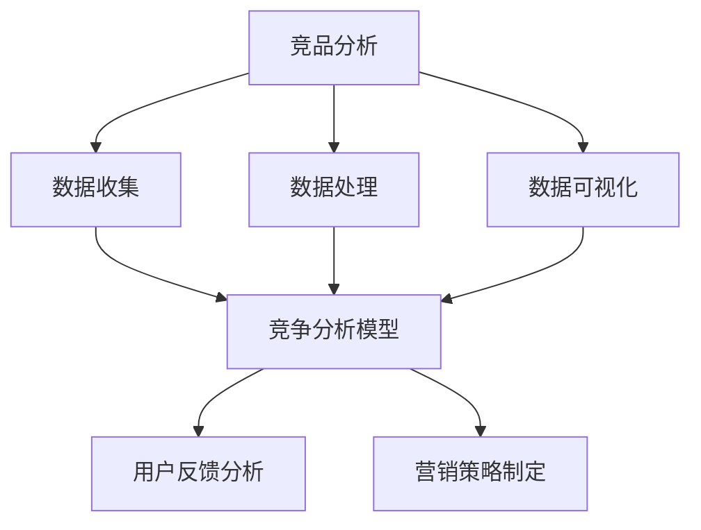

                 

### 1. 背景介绍

在当今的科技浪潮中，人工智能（AI）已经成为了推动各行各业的创新引擎。随着越来越多的创业公司投身于人工智能领域，如何在激烈的市场竞争中脱颖而出成为了每个公司都需要面对的重要课题。其中，竞品分析作为企业战略规划中的关键环节，能够帮助创业公司了解竞争对手的产品特点、市场定位、用户反馈等，从而制定出更加科学、有效的市场策略。

竞品分析的重要性在于，它不仅可以帮助企业了解自身与竞争对手之间的差距，还可以从中找到自身的竞争优势和改进空间。通过竞品分析，创业公司可以：

1. **了解市场动态**：掌握行业内的最新趋势和变化，把握市场机遇。
2. **定位产品特点**：明确产品在市场中的定位，发现差异化竞争点。
3. **制定营销策略**：基于竞品数据，制定更有针对性的市场营销方案。
4. **优化产品功能**：通过分析用户需求和竞品功能，不断迭代产品，提升用户体验。

本文将围绕“AI创业公司如何进行竞品分析”这一主题，详细探讨竞品分析的方法、步骤以及实施策略。希望通过本文的阐述，能够帮助AI创业公司在激烈的市场竞争中找到自己的立足点，实现持续发展。

### 2. 核心概念与联系

在深入探讨如何进行竞品分析之前，我们首先需要了解几个核心概念及其相互联系。以下是本次讨论将涉及到的核心概念和其关系：

#### 2.1. 竞品分析的概念

**竞品分析**，即竞争对手分析，是通过系统的方法和工具来收集、分析和解读竞争对手的产品、服务、市场策略等方面的信息，以帮助自己制定更有针对性的策略。在AI创业公司的背景下，竞品分析尤为关键，因为AI领域的创新速度极快，竞争也异常激烈。

#### 2.2. 数据收集与处理

**数据收集与处理**是竞品分析的基础。创业公司需要通过各种渠道收集关于竞争对手的数据，如产品功能、市场表现、用户评价等。随后，通过数据处理和清洗，将数据转化为可分析的形式。

#### 2.3. 数据可视化

**数据可视化**是将处理后的数据通过图表、图形等形式展示出来，使得分析结果更加直观易懂。数据可视化工具如Tableau、Power BI等，能够帮助创业者快速发现数据中的模式和趋势。

#### 2.4. 竞争分析模型

**竞争分析模型**是竞品分析的核心，它包括市场定位分析、SWOT分析、波特五力模型等。这些模型可以帮助创业者从不同角度评估竞争对手的优势和劣势，找出自身的定位和策略。

#### 2.5. 用户反馈分析

**用户反馈分析**是了解用户需求和满意度的重要途径。通过分析用户评价、反馈和建议，创业公司可以不断优化产品，提升用户体验。

#### 2.6. 营销策略制定

**营销策略制定**是竞品分析的最终目标之一。基于竞品分析结果，创业公司可以制定出更有针对性的营销策略，包括产品定价、渠道选择、促销活动等。

#### 2.7. Mermaid 流程图

为了更好地理解上述概念之间的联系，我们使用Mermaid绘制了一个简化的流程图：



通过这个流程图，我们可以看到竞品分析各个环节之间的紧密联系，以及它们如何共同作用于企业的战略决策。

### 3. 核心算法原理 & 具体操作步骤

在进行竞品分析时，核心算法的选择和应用至关重要。以下将介绍几种常见的竞品分析算法及其具体操作步骤：

#### 3.1. SWOT分析算法

**SWOT分析**是一种常用的竞争分析模型，用于评估企业的优势（Strengths）、劣势（Weaknesses）、机会（Opportunities）和威胁（Threats）。其具体操作步骤如下：

1. **确定评估对象**：明确需要分析的竞争对手及其产品。
2. **收集数据**：通过市场调研、用户反馈等方式收集竞争对手的信息。
3. **建立SWOT矩阵**：将收集到的信息填写到SWOT矩阵中，分别对应四个方面。
4. **分析结果**：对SWOT矩阵进行深入分析，找出竞争对手的优势和劣势，以及自身的机会和威胁。
5. **制定策略**：根据分析结果，制定相应的市场策略和产品改进方案。

#### 3.2. 波特五力模型算法

**波特五力模型**是分析市场竞争结构的一种常用工具，用于评估行业内的竞争程度。其具体操作步骤如下：

1. **确定研究对象**：明确需要分析的竞争对手和市场环境。
2. **收集数据**：通过市场调研、行业报告等方式收集相关数据。
3. **计算五力指标**：分别计算供应商谈判力、买家谈判力、替代品威胁、市场新进入者威胁和现有竞争者竞争程度。
4. **分析结果**：根据五力指标分析行业的竞争状况，找出企业的竞争优势和潜在威胁。
5. **制定策略**：基于分析结果，制定相应的竞争策略和市场定位。

#### 3.3. 用户反馈分析算法

**用户反馈分析**是了解用户需求和满意度的重要方法。以下是具体的操作步骤：

1. **数据收集**：通过用户调查、反馈论坛、社交媒体等方式收集用户反馈。
2. **数据预处理**：清洗和整理收集到的数据，去除噪声和重复信息。
3. **文本分析**：使用自然语言处理技术对文本数据进行分析，提取关键信息和情感倾向。
4. **建立反馈模型**：根据分析结果，建立用户反馈模型，识别用户的主要需求和痛点。
5. **优化产品**：根据用户反馈模型，对产品进行优化和改进，提升用户体验。

#### 3.4. 数据可视化算法

**数据可视化**是将分析结果以图形化方式展示，使得数据更加直观易懂。以下是常用的数据可视化算法：

1. **图表选择**：根据数据类型和分析目标选择合适的图表类型，如柱状图、饼图、折线图等。
2. **数据清洗**：确保数据质量，去除异常值和噪声。
3. **数据整合**：将不同来源的数据整合到一个图表中，便于综合分析。
4. **设计优化**：根据人机交互原则，设计图表的布局和视觉元素，提升可读性。
5. **动态交互**：使用交互式数据可视化工具，如D3.js、Plotly等，提供动态交互体验。

通过以上算法的应用，AI创业公司可以系统、全面地开展竞品分析，为企业的战略决策提供有力支持。

### 4. 数学模型和公式 & 详细讲解 & 举例说明

在竞品分析中，数学模型和公式常常用于量化分析结果，从而提供更精确的决策依据。以下将介绍几种常用的数学模型和公式，并进行详细讲解和举例说明。

#### 4.1. SWOT分析中的定量评估模型

**SWOT分析**中的优势（Strengths）和劣势（Weaknesses）可以通过定量评估模型进行量化。常用的模型有：

**加权评分法**：对每个因素进行评分，并赋予相应的权重。计算公式如下：

$$
\text{评估分数} = \sum (\text{因素评分} \times \text{权重})
$$

**举例**：假设我们对一家AI创业公司的产品进行SWOT分析，以下是其部分因素及其评分和权重：

| 因素         | 评分 | 权重 |
|--------------|------|------|
| 技术实力     | 8    | 0.3  |
| 市场份额     | 6    | 0.2  |
| 用户满意度   | 7    | 0.3  |
| 资金实力     | 5    | 0.2  |

根据加权评分法计算评估分数：

$$
\text{评估分数} = (8 \times 0.3) + (6 \times 0.2) + (7 \times 0.3) + (5 \times 0.2) = 2.4 + 1.2 + 2.1 + 1 = 6.7
$$

#### 4.2. 波特五力模型中的市场占有率计算公式

**波特五力模型**中的市场占有率可以通过以下公式计算：

$$
\text{市场占有率} = \frac{\text{企业市场份额}}{\text{行业总市场份额}}
$$

**举例**：假设一家AI创业公司的市场份额为1000万元，而整个行业的总市场份额为1亿元。则其市场占有率为：

$$
\text{市场占有率} = \frac{1000}{10000} = 0.1 = 10\%
$$

#### 4.3. 用户反馈分析中的情感倾向评分模型

**用户反馈分析**中，情感倾向可以通过以下模型进行评分：

**情感倾向评分**：对用户的反馈进行情感分析，得出正负面情感的得分。常用的模型有：

- **二分类评分**：分为正面和负面，分别赋值1和-1。
- **五分类评分**：分为非常正面、正面、中性、负面、非常负面，分别赋值5、3、0、-3、-5。

**举例**：假设我们对100条用户反馈进行情感分析，其中50条为正面反馈，50条为负面反馈。则正面反馈得分为：

$$
\text{正面得分} = 50 \times 1 = 50
$$

负面反馈得分为：

$$
\text{负面得分} = 50 \times (-1) = -50
$$

总得分：

$$
\text{总得分} = 50 + (-50) = 0
$$

#### 4.4. 数据可视化中的图表选择模型

**数据可视化**中，图表的选择可以通过以下模型进行优化：

**图表选择模型**：根据数据类型和分析目标选择最合适的图表类型。常见的模型有：

- **基于数据类型的图表选择**：如柱状图适用于离散型数据，折线图适用于时间序列数据。
- **基于分析目标的图表选择**：如散点图适用于关系分析，饼图适用于占比分析。

**举例**：假设我们需要分析一家AI创业公司的月销售额数据，可以选择以下图表：

- **柱状图**：展示各月的销售额对比。
- **折线图**：展示销售额的时间趋势。
- **饼图**：展示各月销售额在总销售额中的占比。

通过上述数学模型和公式的应用，AI创业公司可以更加精确地进行竞品分析，从而为企业的决策提供有力支持。

### 5. 项目实战：代码实际案例和详细解释说明

为了更好地理解如何进行竞品分析，下面我们将通过一个实际项目案例来展示代码实现过程，并对关键部分进行详细解释说明。

#### 5.1 开发环境搭建

首先，我们需要搭建一个适合进行竞品分析的开发环境。以下是一个基本的开发环境配置：

- **操作系统**：Ubuntu 20.04
- **编程语言**：Python 3.8
- **依赖库**：requests、BeautifulSoup、Pandas、Matplotlib、Numpy

安装依赖库：

```bash
pip install requests beautifulsoup4 pandas matplotlib numpy
```

#### 5.2 源代码详细实现和代码解读

以下是一个简单的竞品分析代码示例，用于收集和解析竞争对手的产品信息，并进行基本的数据分析。

```python
import requests
from bs4 import BeautifulSoup
import pandas as pd
import matplotlib.pyplot as plt

# 定义函数：获取网页内容
def get_web_content(url):
    headers = {'User-Agent': 'Mozilla/5.0'}
    response = requests.get(url, headers=headers)
    if response.status_code == 200:
        return response.text
    else:
        return None

# 定义函数：解析产品信息
def parse_product_info(html_content):
    soup = BeautifulSoup(html_content, 'html.parser')
    product_list = []

    # 假设每个产品的信息都在class为"product-item"的div元素中
    product_items = soup.find_all('div', class_='product-item')
    for item in product_items:
        product_name = item.find('h2').text.strip()
        product_price = item.find('span', class_='price').text.strip()
        product_list.append([product_name, product_price])

    return product_list

# 定义函数：数据分析
def analyze_product_data(product_data):
    df = pd.DataFrame(product_data, columns=['Product Name', 'Price'])
    df['Price'] = df['Price'].str.replace(',', '').astype(float)
    
    # 统计产品数量
    total_products = df.shape[0]
    print(f"Total products: {total_products}")

    # 绘制价格分布图
    df['Price'].hist(bins=20)
    plt.title('Price Distribution')
    plt.xlabel('Price')
    plt.ylabel('Frequency')
    plt.show()

    # 计算平均价格
    average_price = df['Price'].mean()
    print(f"Average price: {average_price:.2f}")

# 定义函数：主程序
def main():
    url = 'https://example.com/products'
    html_content = get_web_content(url)
    if html_content:
        product_data = parse_product_info(html_content)
        analyze_product_data(product_data)
    else:
        print("Failed to retrieve web content.")

if __name__ == '__main__':
    main()
```

#### 5.3 代码解读与分析

- **get_web_content函数**：这个函数用于获取指定网页的内容。它通过requests库发送HTTP GET请求，并检查响应状态码。如果状态码为200（表示请求成功），则返回网页内容；否则返回None。

- **parse_product_info函数**：这个函数负责解析网页内容，提取产品信息。它使用BeautifulSoup库解析HTML内容，并找到所有class为"product-item"的div元素。然后，它提取每个元素中的产品名称和价格，并存储到一个列表中。

- **analyze_product_data函数**：这个函数对提取的产品数据进行基本分析。首先，它将产品数据转换为Pandas DataFrame，并进行必要的预处理，如去除逗号并转换为浮点数。然后，它统计产品数量、绘制价格分布图、计算平均价格等。

- **main函数**：这个函数是主程序入口，它首先调用get_web_content函数获取网页内容，然后调用parse_product_info和analyze_product_data函数对产品信息进行分析。

通过上述代码示例，我们展示了如何使用Python和相关库进行基本的竞品分析。在实际应用中，我们可以根据具体需求扩展和优化代码，如添加更多数据源、改进解析算法、增加可视化功能等。

### 6. 实际应用场景

竞品分析在AI创业公司中的实际应用场景非常广泛，以下是几个典型的应用场景：

#### 6.1. 产品优化

通过竞品分析，AI创业公司可以了解竞争对手的产品功能、性能、用户体验等，从而找到自身的不足之处并进行优化。例如，如果竞争对手的产品在语音识别方面表现优异，而自己的产品在此方面存在明显差距，那么可以通过增加训练数据、优化算法等方式来提升语音识别能力。

#### 6.2. 营销策略制定

竞品分析可以帮助AI创业公司了解竞争对手的营销策略，包括产品定价、推广渠道、促销活动等。基于这些信息，公司可以制定出更有针对性的营销策略，提高市场占有率。例如，如果竞争对手在社交媒体上进行了大量推广，而自己在此方面投入较少，那么可以加大对社交媒体的营销力度。

#### 6.3. 投资与融资

竞品分析还可以帮助AI创业公司在投资与融资过程中做出更明智的决策。通过分析竞争对手的融资情况、投资方、估值等，公司可以了解市场对同类产品的认可程度，从而为自己的融资策略提供依据。例如，如果竞争对手成功获得了高估值融资，那么自己也可以尝试寻求同类投资机会。

#### 6.4. 市场定位

竞品分析有助于AI创业公司明确自身的市场定位，避免与竞争对手正面冲突。通过分析竞争对手的产品特点、目标用户群体等，公司可以找到自身在市场中的差异化竞争优势，从而在市场中找到立足点。例如，如果竞争对手主要面向企业客户，那么自己的产品可以针对个人用户进行差异化设计。

#### 6.5. 合作伙伴选择

通过竞品分析，AI创业公司可以了解行业内的合作伙伴和潜在合作伙伴。在选择合作伙伴时，公司可以根据竞品分析结果，优先考虑与在技术、市场等方面具有互补优势的企业合作。例如，如果竞争对手与某家技术公司合作，那么自己也可以考虑与该技术公司建立合作关系。

#### 6.6. 法律合规与风险管理

竞品分析还可以帮助AI创业公司识别潜在的法律合规风险和市场竞争风险。通过分析竞争对手的产品和服务，公司可以发现可能违反法律法规的方面，并提前采取防范措施。例如，如果竞争对手的产品涉及隐私侵犯或数据泄露等问题，那么自己也需要对相关风险进行评估和防范。

总之，竞品分析在AI创业公司中的应用场景非常广泛，它不仅可以帮助公司了解市场动态、优化产品、制定策略，还可以在投资、合作、合规等方面提供有力支持。通过充分利用竞品分析，AI创业公司可以在激烈的市场竞争中找到自己的发展路径，实现持续成长。

### 7. 工具和资源推荐

在进行竞品分析时，选择合适的工具和资源至关重要。以下是一些推荐的工具和资源，涵盖从数据分析到工具框架，以及相关的论文和著作。

#### 7.1 学习资源推荐

1. **书籍**：
   - 《数据分析思维实战：商业分析从入门到精通》
   - 《Python数据分析：从基础到实践》
   - 《数据挖掘：实用工具与技术》

2. **在线课程**：
   - Coursera上的《数据科学专项课程》
   - edX上的《机器学习基础课程》
   - Udacity的《数据科学家纳米学位》

3. **论文和博客**：
   - arXiv上的机器学习与数据挖掘相关论文
   - Medium上的数据分析与AI博客
   - AI科技大本营的技术文章

#### 7.2 开发工具框架推荐

1. **数据分析工具**：
   - Pandas：Python的数据分析库，适用于数据处理和分析。
   - NumPy：Python的科学计算库，提供多维数组对象和矩阵运算功能。
   - Matplotlib/Seaborn：Python的可视化库，用于生成各种类型的图表。

2. **爬虫工具**：
   - Scrapy：Python的爬虫框架，适用于大规模网络数据的抓取和分析。
   - Beautiful Soup：Python的HTML解析库，用于从网页中提取数据。

3. **机器学习框架**：
   - TensorFlow：谷歌开发的开源机器学习框架，适用于构建和训练复杂的深度学习模型。
   - PyTorch：Facebook开发的深度学习库，具有灵活性和易用性。

4. **数据可视化工具**：
   - Tableau：专业的数据可视化工具，适用于企业级数据分析。
   - Power BI：微软的数据分析工具，提供丰富的可视化功能。
   - D3.js：JavaScript的可视化库，适用于创建动态交互式图表。

#### 7.3 相关论文著作推荐

1. **论文**：
   - "Deep Learning for Text Classification"（深度学习在文本分类中的应用）
   - "Data-Driven Approach for Identifying Competitive Advantage in Product Market"（数据驱动的产品市场竞争优势识别方法）

2. **著作**：
   - 《机器学习实战》：提供了丰富的实践案例，适用于初学者。
   - 《数据挖掘：实用工具与技术》：详细介绍了数据挖掘的工具和技术。

通过利用这些工具和资源，AI创业公司可以更加高效地进行竞品分析，从而在激烈的市场竞争中占据有利地位。

### 8. 总结：未来发展趋势与挑战

在人工智能（AI）创业领域，竞品分析作为一种关键的竞争策略，正逐渐成为企业战略规划的核心环节。未来，随着AI技术的不断进步和市场环境的变化，竞品分析将呈现出以下发展趋势：

#### 8.1 数据驱动分析

随着大数据和机器学习的普及，竞品分析将更加依赖于数据驱动的方法。创业公司将能够通过更加精确的数据收集和分析，获取更深入的竞争情报，从而制定更加科学和有效的策略。

#### 8.2 自动化与智能化

自动化和智能化工具将大大提高竞品分析的效率。例如，利用自然语言处理（NLP）技术自动化分析用户评论和社交媒体数据，或使用机器学习算法预测市场趋势和用户需求。这将使得竞品分析更加快速和准确。

#### 8.3 综合性分析

未来，竞品分析将不再局限于单一的产品或功能比较，而是更加注重综合性的分析。这包括市场趋势、用户行为、供应链等多个维度的综合评估，为企业提供全方位的竞争情报。

#### 8.4 个性化与定制化

随着市场细分和用户需求的多样化，竞品分析将更加注重个性化与定制化。创业公司将根据不同用户群体的需求和偏好，进行有针对性的竞品分析，从而制定更符合市场需求的策略。

然而，随着竞品分析的不断发展，创业公司也将面临一系列挑战：

#### 8.5 数据隐私与安全

在收集和分析大量数据的过程中，数据隐私和安全问题将成为重要的挑战。创业公司需要确保数据的安全性和合规性，以避免法律风险和用户信任问题。

#### 8.6 算法透明度

随着机器学习算法在竞品分析中的应用越来越广泛，算法的透明度和解释性将成为重要的讨论话题。创业公司需要确保算法的决策过程是可解释的，以便用户和监管机构能够理解和接受。

#### 8.7 市场动态变化

市场环境瞬息万变，创业公司需要快速适应市场变化，调整竞品分析策略。同时，全球化和竞争加剧也将使得市场动态更加复杂，要求创业公司具备更高的应变能力。

总之，未来AI创业公司在进行竞品分析时，需要充分利用先进的技术手段，同时应对各种挑战，以实现持续发展和市场竞争力。

### 9. 附录：常见问题与解答

在实施竞品分析过程中，AI创业公司可能会遇到一些常见的问题。以下是对这些问题的解答，以帮助创业公司更好地理解和应对这些问题。

#### 9.1. 如何确定竞品分析的优先级？

确定竞品分析的优先级需要考虑以下几个因素：

1. **市场规模**：优先分析市场份额大、影响深远的竞争对手。
2. **公司战略**：根据公司的发展战略和目标，确定哪些竞品对公司最为重要。
3. **市场变化**：关注市场热点和趋势，优先分析快速变化或新兴领域的竞品。
4. **资源限制**：根据公司资源和时间安排，合理分配竞品分析的优先级。

#### 9.2. 竞品分析的频率应该如何安排？

竞品分析的频率应该根据市场变化和公司需求来调整。以下是一些常见的分析频率：

- **每月**：对于市场变化快、竞争激烈的领域，每月进行一次竞品分析。
- **每季度**：对于市场相对稳定的领域，每季度进行一次竞品分析。
- **每年**：对于长期规划和市场策略，每年进行一次全面竞品分析。

#### 9.3. 如何确保竞品分析的数据准确性？

确保竞品分析的数据准确性需要以下几个步骤：

1. **数据源选择**：选择可靠、权威的数据源，如市场研究报告、行业数据库等。
2. **数据验证**：对收集的数据进行验证，排除错误和不完整的数据。
3. **数据清洗**：使用数据清洗技术，去除噪声和重复数据，确保数据质量。
4. **定期更新**：定期更新数据，确保分析的时效性和准确性。

#### 9.4. 竞品分析报告如何撰写？

撰写竞品分析报告需要遵循以下步骤：

1. **明确目的**：确定报告的目的和受众，为报告内容提供方向。
2. **结构规划**：根据分析结果，规划报告的结构，包括摘要、背景、分析方法、结果和结论等。
3. **数据展示**：使用图表、图形等可视化工具，清晰地展示分析结果。
4. **详细解读**：对分析结果进行详细解读，提供专业的分析和建议。
5. **结论和建议**：总结分析结果，提出具体的策略和建议。

#### 9.5. 如何应对竞品分析的挑战？

应对竞品分析的挑战，需要以下几个策略：

1. **保持灵活**：根据市场变化，灵活调整竞品分析策略和方法。
2. **加强数据安全**：确保数据收集、存储和分析过程中的安全性和合规性。
3. **持续学习**：不断学习和掌握新的技术和工具，提高竞品分析能力。
4. **合作与共享**：与其他公司、学术机构和行业专家合作，共享资源，共同应对挑战。

通过上述策略和解答，AI创业公司可以更加有效地实施竞品分析，为企业的战略决策提供有力支持。

### 10. 扩展阅读 & 参考资料

对于希望进一步深入研究和学习竞品分析的读者，以下是一些推荐的扩展阅读和参考资料：

#### 10.1. 书籍推荐

1. 《大数据分析：实战：策略、技术和工具》
   - 作者：Lee Giles
   - 简介：全面介绍了大数据分析的理论和实践方法，适合对大数据和数据分析有兴趣的读者。

2. 《机器学习实战》
   - 作者：Peter Harrington
   - 简介：通过实际案例讲解机器学习的基本概念和方法，适合初学者和有一定基础的读者。

3. 《深度学习》（Deep Learning）
   - 作者：Ian Goodfellow、Yoshua Bengio、Aaron Courville
   - 简介：深度学习领域的经典教材，详细介绍了深度学习的理论、算法和应用。

#### 10.2. 在线课程

1. Coursera上的《数据科学专项课程》
   - 简介：涵盖数据科学的基础知识和实际应用，适合想要系统学习数据科学的读者。

2. edX上的《机器学习基础课程》
   - 简介：从基础知识到高级应用，详细介绍机器学习的相关概念和技术。

3. Udacity的《数据科学家纳米学位》
   - 简介：通过项目驱动的学习方式，帮助学员掌握数据科学的核心技能。

#### 10.3. 论文和报告

1. "Deep Learning for Text Classification"（深度学习在文本分类中的应用）
   - 简介：详细介绍了深度学习在文本分类领域的应用和实现方法。

2. "Data-Driven Approach for Identifying Competitive Advantage in Product Market"（数据驱动的产品市场竞争优势识别方法）
   - 简介：探讨了如何利用数据分析方法识别和利用市场中的竞争优势。

3. "Competitive Analysis of AI Companies in the Healthcare Industry"（医疗行业人工智能公司的竞争分析）
   - 简介：分析了医疗行业AI公司的竞争态势和主要策略。

#### 10.4. 网站和博客

1. arXiv：提供大量的机器学习和数据科学领域的预印本论文。
   - 网址：[https://arxiv.org/](https://arxiv.org/)

2. Medium上的数据分析与AI博客
   - 网址：[https://medium.com/topic/data-science](https://medium.com/topic/data-science)
   - 简介：涵盖了数据分析、机器学习和AI领域的最新研究和应用。

3. AI科技大本营的技术文章
   - 网址：[https://www.aisdc.cn/](https://www.aisdc.cn/)
   - 简介：提供关于AI技术、应用和趋势的深入分析。

通过阅读和参考这些资料，读者可以更全面地了解竞品分析的最新理论和实践，为自己的研究和工作提供有益的指导。

