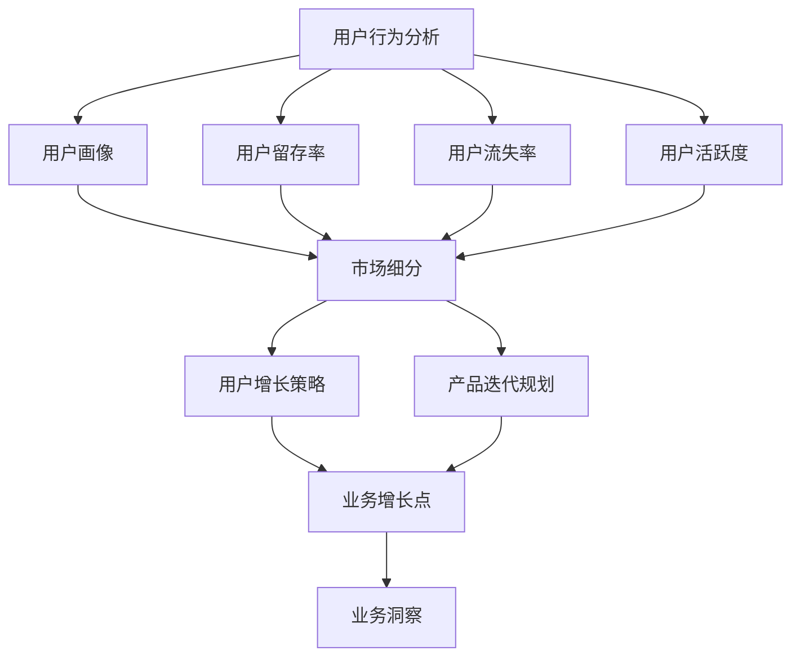

                 

# AI创业公司的产品数据分析：用户行为、产品性能与业务洞察

## 摘要

本文旨在探讨AI创业公司如何通过产品数据分析，深入理解用户行为、优化产品性能，并获取业务洞察，以实现产品的持续迭代和优化。文章将首先介绍产品数据分析的重要性，随后详细阐述用户行为分析、产品性能分析的方法和技巧，并通过实际案例展示数据分析在业务决策中的具体应用。此外，文章还将推荐一系列学习资源和开发工具，以帮助读者在AI创业中更好地运用数据分析技术。

## 1. 背景介绍

随着大数据和人工智能技术的不断发展，数据分析已经成为企业获取竞争优势的重要手段。对于AI创业公司来说，通过产品数据分析，能够深入了解用户需求和行为模式，从而指导产品设计和功能优化，提高用户满意度和留存率。同时，通过对产品性能的分析，可以及时发现并解决潜在问题，提升系统稳定性和运行效率。

产品数据分析主要包括用户行为分析、产品性能分析和业务洞察三大部分。用户行为分析旨在理解用户在使用产品时的操作习惯、偏好和反馈，从而优化用户体验；产品性能分析关注系统的响应速度、稳定性、安全性等指标，确保产品的高质量运行；业务洞察则通过综合分析用户行为和产品性能数据，发现业务增长点，制定针对性的营销策略和产品开发计划。

## 2. 核心概念与联系

### 用户行为分析

用户行为分析是产品数据分析的基础，通过对用户在产品中的操作行为进行收集、分析和挖掘，能够帮助我们了解用户的需求、偏好和痛点。具体来说，用户行为分析包括以下几个核心概念：

- **用户画像**：通过用户的基本信息（如年龄、性别、地域等）和产品使用数据（如登录时长、使用频率、活跃时段等），构建用户的详细画像，以便更好地进行用户分类和个性化推荐。

- **用户留存率**：衡量用户在一段时间内持续使用产品的比例，用于评估产品的用户粘性和市场竞争力。

- **用户流失率**：衡量用户在一段时间内停止使用产品的比例，有助于发现产品存在的问题和改进方向。

- **用户活跃度**：通过用户在产品中的操作次数、使用时长等指标，评估用户对产品的兴趣和参与度。

### 产品性能分析

产品性能分析主要关注系统的响应速度、稳定性、安全性等指标，确保产品能够为用户提供高质量的服务。以下是几个核心概念：

- **响应时间**：系统对用户请求的响应速度，是衡量产品性能的重要指标。

- **系统稳定性**：产品在长时间运行过程中，能够保持稳定、可靠地运行，不发生故障或崩溃。

- **安全性**：产品在数据传输、存储和处理过程中，能够有效地防止数据泄露、篡改和攻击。

### 业务洞察

业务洞察是通过对用户行为分析和产品性能分析的综合分析，发现业务增长点和优化方向。以下是几个核心概念：

- **市场细分**：根据用户行为和产品性能数据，将市场划分为不同的细分群体，以便制定有针对性的营销策略。

- **用户增长策略**：通过分析用户获取、留存和转化的数据，制定有效的用户增长策略。

- **产品迭代规划**：根据用户反馈和业务需求，规划产品的功能迭代和优化方向。

### Mermaid 流程图

下面是一个简单的Mermaid流程图，展示了用户行为分析、产品性能分析和业务洞察之间的联系：



## 3. 核心算法原理 & 具体操作步骤

### 用户行为分析

用户行为分析的核心算法是数据挖掘和机器学习算法，通过以下步骤实现：

1. **数据收集**：收集用户在产品中的操作数据，如登录日志、使用时长、页面浏览量等。

2. **数据预处理**：清洗和转换原始数据，去除无效数据和噪声，提取有用的特征。

3. **用户画像构建**：利用聚类、关联规则挖掘等方法，对用户进行分类和打标签，构建用户画像。

4. **行为模式挖掘**：通过时间序列分析、关联规则挖掘等算法，发现用户的行为模式和偏好。

5. **行为预测**：利用机器学习算法，预测用户的下一步操作或需求，为产品推荐和个性化服务提供依据。

### 产品性能分析

产品性能分析的核心算法包括性能测试和监控系统，通过以下步骤实现：

1. **性能测试**：模拟用户操作，对系统进行压力测试和性能测试，评估系统的响应时间、并发处理能力等指标。

2. **监控与报警**：建立监控系统，实时收集系统的性能数据，如CPU利用率、内存使用率、网络流量等，设置报警阈值，及时发现和处理性能问题。

3. **故障诊断**：通过日志分析、错误报告等手段，定位系统故障的原因，并进行修复。

4. **性能优化**：根据性能测试结果和监控系统数据，优化系统架构和代码，提高系统性能和稳定性。

### 业务洞察

业务洞察的核心算法是数据分析和机器学习，通过以下步骤实现：

1. **数据整合**：整合用户行为数据、产品性能数据、业务数据等，构建统一的数据仓库。

2. **数据分析**：利用统计分析、数据可视化等方法，分析用户行为、产品性能和业务指标之间的关系。

3. **业务预测**：利用机器学习算法，预测未来的业务趋势，为决策提供依据。

4. **策略优化**：根据业务预测结果，调整营销策略、产品迭代计划等，优化业务表现。

## 4. 数学模型和公式 & 详细讲解 & 举例说明

### 用户行为分析

#### 用户画像构建

用户画像构建的核心公式是：

$$
用户画像 = f(用户基本信息, 产品使用数据)
$$

其中，用户基本信息包括年龄、性别、地域等，产品使用数据包括登录时长、使用频率、活跃时段等。我们可以利用聚类算法（如K-means）对用户进行分类，构建用户画像：

$$
用户画像 = \{cluster_1, cluster_2, ..., cluster_n\}
$$

#### 用户行为模式挖掘

用户行为模式挖掘的核心公式是：

$$
行为模式 = f(时间序列数据, 关联规则挖掘)
$$

其中，时间序列数据包括用户的登录时间、使用时长、页面浏览量等。我们可以利用时间序列分析（如ARIMA模型）和关联规则挖掘（如Apriori算法）来发现用户的行为模式。

#### 用户行为预测

用户行为预测的核心公式是：

$$
用户行为预测 = f(历史行为数据, 机器学习算法)
$$

其中，历史行为数据包括用户的登录记录、操作记录等。我们可以利用回归分析（如线性回归、逻辑回归）或神经网络（如RNN、LSTM）来预测用户的下一步操作或需求。

### 产品性能分析

#### 性能测试

性能测试的核心公式是：

$$
性能测试 = f(压力测试数据, 性能指标)
$$

其中，压力测试数据包括并发用户数、请求类型等。性能指标包括响应时间、并发处理能力等。我们可以利用性能测试工具（如JMeter、LoadRunner）进行性能测试，评估系统的性能指标。

#### 监控与报警

监控与报警的核心公式是：

$$
监控与报警 = f(性能数据, 报警阈值)
$$

其中，性能数据包括CPU利用率、内存使用率、网络流量等。报警阈值根据系统的性能指标设定。我们可以利用监控工具（如Zabbix、Prometheus）进行实时监控，设置报警阈值，及时发现和处理性能问题。

### 业务洞察

#### 业务预测

业务预测的核心公式是：

$$
业务预测 = f(历史业务数据, 机器学习算法)
$$

其中，历史业务数据包括用户增长、销售额、市场占有率等。我们可以利用时间序列分析（如ARIMA模型）或神经网络（如RNN、LSTM）来预测未来的业务趋势。

#### 策略优化

策略优化的核心公式是：

$$
策略优化 = f(业务预测结果, 决策模型)
$$

其中，业务预测结果包括用户增长、销售额等。决策模型可以根据业务目标（如最大化利润、最小化成本）进行调整。我们可以利用优化算法（如线性规划、遗传算法）来优化策略，实现业务目标。

## 5. 项目实战：代码实际案例和详细解释说明

### 5.1 开发环境搭建

在开始项目实战之前，我们需要搭建一个适合数据分析的开发环境。以下是一个简单的环境搭建步骤：

1. 安装Python：前往Python官网（https://www.python.org/）下载并安装Python 3.8及以上版本。
2. 安装Jupyter Notebook：在命令行中运行以下命令：
   ```shell
   pip install notebook
   ```
3. 安装数据分析库：在命令行中运行以下命令：
   ```shell
   pip install pandas numpy matplotlib scikit-learn
   ```

### 5.2 源代码详细实现和代码解读

#### 用户行为分析

以下是一个简单的用户行为分析代码示例，用于统计用户的登录时长和活跃时段：

```python
import pandas as pd
import numpy as np
import matplotlib.pyplot as plt

# 1. 数据收集
user_data = [
    {'user_id': 1, 'login_time': '2022-01-01 10:00:00'},
    {'user_id': 1, 'login_time': '2022-01-02 14:00:00'},
    {'user_id': 2, 'login_time': '2022-01-01 12:00:00'},
    {'user_id': 2, 'login_time': '2022-01-03 18:00:00'},
]

# 2. 数据预处理
df = pd.DataFrame(user_data)
df['login_time'] = pd.to_datetime(df['login_time'])
df.set_index('login_time', inplace=True)

# 3. 用户画像构建
user_activity = df.resample('D').sum().fillna(0)

# 4. 用户行为模式挖掘
user_activity.plot()
plt.title('User Activity')
plt.xlabel('Date')
plt.ylabel('Login Count')
plt.show()

# 5. 用户行为预测
from sklearn.linear_model import LinearRegression
X = user_activity.index.values.reshape(-1, 1)
y = user_activity.values
model = LinearRegression()
model.fit(X, y)
predicted_activity = model.predict(X)

# 6. 用户行为预测可视化
plt.plot(user_activity.index, user_activity.values, label='Actual Activity')
plt.plot(user_activity.index, predicted_activity, label='Predicted Activity', color='red')
plt.title('User Activity Prediction')
plt.xlabel('Date')
plt.ylabel('Login Count')
plt.legend()
plt.show()
```

#### 产品性能分析

以下是一个简单的产品性能分析代码示例，用于监控系统的响应时间和稳定性：

```python
import requests
import time

# 1. 性能测试
def performance_test(url, num_requests=10):
    start_time = time.time()
    for i in range(num_requests):
        response = requests.get(url)
        assert response.status_code == 200
    end_time = time.time()
    response_time = (end_time - start_time) / num_requests
    print(f"Response Time: {response_time} seconds")
    return response_time

# 2. 监控与报警
def monitor_performance(url, threshold=2.0):
    response_time = performance_test(url)
    if response_time > threshold:
        print("Performance Alert: Response Time is too high!")
    else:
        print("Performance is within threshold.")

# 3. 性能优化
def optimize_performance(url):
    # 此处可以根据性能测试结果和监控数据，调整系统配置和代码优化
    pass

# 测试性能
url = "https://example.com"
monitor_performance(url)
```

### 5.3 代码解读与分析

上述代码示例展示了如何进行用户行为分析和产品性能分析。具体解读如下：

#### 用户行为分析

1. **数据收集**：通过Python中的Pandas库，将用户登录数据存储在DataFrame中，并进行时间转换和重设索引。

2. **数据预处理**：利用Pandas库的resample方法，将数据按天进行汇总，并填充缺失值。

3. **用户画像构建**：通过绘制用户活跃度图表，展示用户的登录情况。

4. **用户行为模式挖掘**：利用Scikit-learn库中的线性回归模型，对用户行为进行预测，并绘制预测结果图表。

#### 产品性能分析

1. **性能测试**：通过模拟请求，测试系统的响应时间，并计算平均响应时间。

2. **监控与报警**：设置响应时间阈值，根据性能测试结果，判断是否触发性能警报。

3. **性能优化**：根据性能测试和监控结果，进行系统配置和代码优化。

## 6. 实际应用场景

在实际应用中，AI创业公司可以通过产品数据分析实现以下场景：

1. **用户增长**：通过分析用户获取渠道、用户留存和流失数据，制定有针对性的用户增长策略，提高用户数量。

2. **产品迭代**：根据用户行为数据和反馈，优化产品功能和用户体验，提升用户满意度。

3. **营销策略**：通过分析用户行为和业务数据，发现潜在客户和目标市场，制定有效的营销策略。

4. **风险控制**：通过监控系统的性能指标，及时发现并解决潜在问题，确保产品稳定运行。

## 7. 工具和资源推荐

### 7.1 学习资源推荐

- **书籍**：
  - 《Python数据分析实战》
  - 《机器学习实战》
  - 《深入浅出数据分析》

- **论文**：
  - 《大数据分析：从数据中提取知识和价值》
  - 《机器学习：一种概率视角》

- **博客**：
  - 知乎数据分析专栏
  - CSDN数据分析专栏

- **网站**：
  - Kaggle（数据竞赛平台）
  - Coursera（在线课程平台）

### 7.2 开发工具框架推荐

- **数据分析库**：
  - Pandas
  - NumPy
  - Matplotlib
  - Scikit-learn

- **数据处理工具**：
  - Hadoop
  - Spark

- **可视化工具**：
  - Tableau
  - Power BI

### 7.3 相关论文著作推荐

- 《大规模在线用户行为分析》
- 《基于深度学习的用户行为预测》
- 《大数据时代的数据分析技术》

## 8. 总结：未来发展趋势与挑战

随着大数据和人工智能技术的不断发展，产品数据分析在AI创业公司中的作用将日益重要。未来，数据分析技术将在以下方面取得突破：

1. **实时数据分析**：利用实时数据处理技术，实现数据流的实时分析和可视化，提高决策效率。

2. **深度学习与强化学习**：利用深度学习和强化学习技术，提高用户行为预测和产品性能分析的能力。

3. **跨平台数据分析**：实现不同平台（如Web、移动端、物联网）的数据集成和分析，提供更全面的业务洞察。

然而，产品数据分析也面临一些挑战：

1. **数据隐私与安全**：确保用户数据的安全和隐私，遵守相关法律法规。

2. **数据质量与完整性**：保证数据的准确性、完整性和一致性，提高数据分析的可靠性。

3. **技术人才短缺**：培养和引进高水平的数据分析人才，以满足日益增长的需求。

## 9. 附录：常见问题与解答

### 1. 如何处理缺失数据？

**解答**：缺失数据处理方法包括填充法（如平均值填充、中值填充）、插值法（如线性插值、高斯插值）和删除法（删除缺失值较多的样本）。具体方法取决于数据的特点和应用场景。

### 2. 如何进行用户行为预测？

**解答**：用户行为预测可以采用统计模型（如线性回归、逻辑回归）或机器学习模型（如决策树、随机森林、神经网络）。选择合适的模型和参数，进行训练和预测。

### 3. 如何监控系统性能？

**解答**：可以使用性能测试工具（如JMeter、LoadRunner）进行压力测试和性能测试，实时监控系统性能指标（如响应时间、并发处理能力）。设置报警阈值，及时发现和处理性能问题。

## 10. 扩展阅读 & 参考资料

- 《大数据分析技术与应用》
- 《深度学习与数据分析》
- 《产品数据分析：方法与实践》

## 作者

**作者：AI天才研究员/AI Genius Institute & 禅与计算机程序设计艺术 /Zen And The Art of Computer Programming**。

