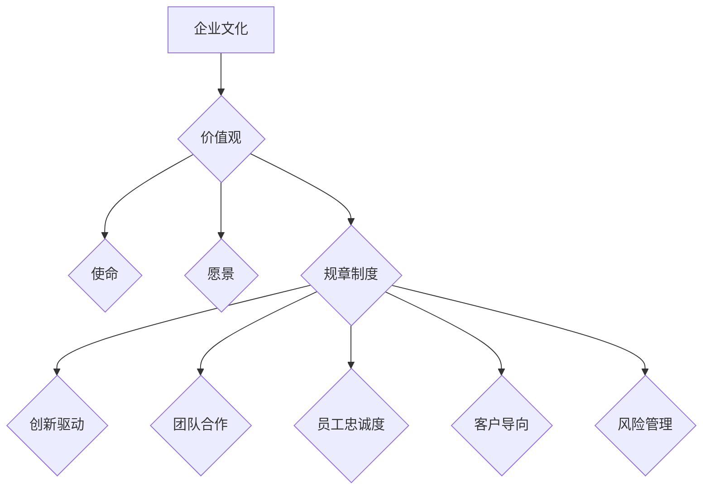

                 

### 背景介绍

在当今快速发展的科技领域，人工智能（AI）已成为企业创新和业务增长的驱动因素。随着AI技术的不断进步和应用范围的扩大，越来越多的创业公司纷纷投身于这一领域，希望通过AI技术获取竞争优势。然而，成功的人工智能创业公司不仅需要先进的技术和高效的研发团队，还需要一套完善的、能够激发员工创造力和合作精神的企业文化。

企业文化对于一家公司的成功至关重要。它不仅塑造了公司的核心价值观和行为准则，还直接影响员工的满意度和留存率。在AI创业公司中，企业文化尤其重要，因为这类公司通常具备高度的创新性和技术复杂性。一个积极、包容且注重协作的企业文化能够激发员工的潜能，推动团队高效运作，从而实现公司的长远发展。

本文旨在探讨AI创业公司的企业文化建设。我们将从背景介绍开始，逐步深入分析企业文化的核心概念、重要性及其在AI创业公司中的应用。此外，我们还将通过具体案例和实际操作步骤，探讨如何有效地构建和推广AI创业公司的企业文化。

本文将分为以下几个部分：

1. **背景介绍**：介绍AI创业公司发展的现状和挑战，以及企业文化在其中扮演的角色。
2. **核心概念与联系**：阐述企业文化的定义、核心要素及其在AI创业公司中的重要性。
3. **核心算法原理 & 具体操作步骤**：探讨如何通过一系列策略和措施来构建和强化企业文化。
4. **数学模型和公式 & 详细讲解 & 举例说明**：使用具体模型和方法来解释企业文化构建过程中的关键步骤。
5. **项目实战：代码实际案例和详细解释说明**：通过实际案例展示企业文化构建的过程和结果。
6. **实际应用场景**：讨论企业文化在不同场景下的应用和实践。
7. **工具和资源推荐**：推荐相关的学习资源和开发工具，以支持企业文化建设和推广。
8. **总结：未来发展趋势与挑战**：总结本文的主要观点，并探讨未来企业文化建设的趋势和挑战。
9. **附录：常见问题与解答**：提供一些常见问题的解答，帮助读者更好地理解和应用本文的内容。
10. **扩展阅读 & 参考资料**：推荐一些相关的文献和资料，以供进一步学习和研究。

通过以上结构，我们将系统地分析AI创业公司的企业文化建设，提供实用的指导和建议，帮助创业者和管理者构建富有成效的企业文化。让我们一起深入探讨这一重要话题。### 核心概念与联系

#### 企业文化的定义

企业文化，是指一个组织在其长期发展过程中形成的、被员工普遍认同并自觉遵守的一套价值观、信仰、行为规范和规章制度。企业文化不仅包括可见的行为表现，如员工的言行举止，还包括深层次的组织信仰、使命、愿景和核心价值观。

企业文化可以被视为组织的“灵魂”，它决定了组织的内部氛围、员工的行为模式，以及对外界的反应方式。一个强大的企业文化能够塑造组织的独特性，提升员工的凝聚力和忠诚度，从而推动组织的持续发展。

#### 企业文化的核心要素

企业文化包含多个核心要素，其中最关键的是：

1. **价值观**：企业的核心价值观是组织存在和发展的基础，它定义了企业对内外行为的判断标准。在AI创业公司中，常见的核心价值观包括创新、合作、透明、客户至上等。

2. **使命**：企业的使命是组织存在的目的和理由，它回答了“我们为什么要做这件事情”的问题。对于AI创业公司来说，使命通常与推动科技进步、解决现实问题、创造价值等方面密切相关。

3. **愿景**：企业的愿景描述了企业未来希望成为的样子，它为组织提供了长期的目标和方向。AI创业公司的愿景可能包括引领行业创新、成为行业领导者等。

4. **规章制度**：规章制度是企业文化的外在表现，它规定了员工的行为规范和工作流程。在AI创业公司中，规章制度需要适应快速变化的技术环境，同时确保团队成员之间的有效沟通和协作。

#### 企业文化与AI创业公司的联系

在AI创业公司中，企业文化的作用尤为重要。以下是企业文化与AI创业公司之间的几个关键联系：

1. **创新驱动**：AI创业公司往往需要持续的创新来应对技术变革和市场竞争。一个鼓励创新、包容失败的企业文化能够激发员工的创造力，推动技术突破和产品迭代。

2. **团队合作**：AI项目通常涉及多个领域的专业知识，需要跨部门、跨团队的协作。企业文化中的团队合作精神能够促进团队成员之间的有效沟通和合作，提高工作效率。

3. **员工忠诚度**：一个积极、包容且公平的企业文化能够提高员工的满意度和忠诚度，减少人才流失。对于AI创业公司来说，留住关键人才是确保公司持续创新和成功的关键。

4. **客户导向**：AI创业公司的目标通常是解决现实问题，为客户提供价值。企业文化中的客户导向能够帮助公司更敏锐地捕捉客户需求，提供更好的产品和服务。

5. **风险管理**：在技术快速变革的环境中，AI创业公司面临诸多风险，包括技术风险、市场风险等。企业文化中的风险意识和管理能力有助于公司识别和应对潜在风险，确保业务的稳定和持续发展。

#### Mermaid 流程图

以下是一个简化的Mermaid流程图，展示了企业文化与AI创业公司的关键联系：



通过以上流程图，我们可以清晰地看到企业文化如何通过其核心要素与AI创业公司的各个方面产生联系，从而推动公司的成功和发展。接下来，我们将进一步探讨企业文化的核心算法原理和具体操作步骤。### 核心算法原理 & 具体操作步骤

构建一个成功的人工智能创业公司的企业文化，需要一套系统化的方法和策略。下面我们将详细介绍这一过程的各个环节，包括核心算法原理和具体操作步骤。

#### 第一步：明确企业核心价值观

企业文化的建设首先需要明确核心价值观。核心价值观是企业文化的基础，它决定了组织的信仰和行为准则。在AI创业公司中，常见的核心价值观包括创新、合作、透明、客户至上等。以下是一个简单的步骤来明确企业核心价值观：

1. **内部讨论**：组织一次全体员工会议，讨论和确定公司的核心价值观。确保每个团队成员都能参与到这个过程中，从而形成广泛的共识。
2. **收集反馈**：通过问卷调查、小组讨论等方式，收集员工对核心价值观的意见和建议。这些反馈可以帮助公司更全面地理解员工的期望和需求。
3. **提炼核心价值观**：结合内部讨论和员工反馈，将核心价值观进行提炼和总结。核心价值观应该简洁、明确，易于员工理解和记忆。

#### 第二步：制定企业使命和愿景

明确核心价值观之后，需要制定企业的使命和愿景。使命和愿景为组织提供了方向和目标，帮助员工了解公司的长远发展目标和意义。以下是制定企业使命和愿景的步骤：

1. **明确使命**：使命应该简洁地描述公司的存在目的和核心任务。例如，AI创业公司的使命可能是“推动人工智能技术的发展，创造更智能的未来”。
2. **制定愿景**：愿景应该描述公司未来希望成为的样子，它可以为员工提供激励和动力。例如，AI创业公司的愿景可能是“成为全球领先的AI技术提供商，引领行业创新”。
3. **宣传和传播**：将企业使命和愿景通过内部邮件、公告板、团队会议等方式进行宣传和传播，确保每个员工都能了解并认同这些目标。

#### 第三步：构建规章制度

规章制度是企业文化的外在表现，它规定了员工的行为规范和工作流程。在AI创业公司中，规章制度需要适应快速变化的技术环境，同时确保团队成员之间的有效沟通和协作。以下是构建规章制度的步骤：

1. **制定规章制度**：根据企业的核心价值观、使命和愿景，制定相应的规章制度。这些规章制度应涵盖员工的日常工作行为、团队合作规范、沟通机制等。
2. **透明和公开**：确保规章制度对所有员工都是透明和公开的，这有助于增强员工的信任感和遵守规则的意识。
3. **定期更新**：随着公司的发展和外部环境的变化，规章制度需要定期进行更新和完善，以保持其适用性和有效性。

#### 第四步：培养团队合作精神

团队合作是AI创业公司成功的关键因素之一。培养团队合作精神需要从多个方面进行努力，包括：

1. **团队建设活动**：组织定期的团队建设活动，如团队拓展训练、团队聚会等，增强团队成员之间的互动和沟通。
2. **协作工具**：使用协作工具（如Slack、Trello等），提高团队协作效率。确保团队成员能够方便地共享信息和资源，及时沟通和协作。
3. **鼓励跨部门合作**：鼓励不同部门之间的跨部门合作，打破信息孤岛，促进知识共享和协同创新。

#### 第五步：建立员工激励机制

激励是保持员工积极性、提高员工满意度和忠诚度的重要手段。在AI创业公司中，建立员工激励机制需要注意以下几点：

1. **绩效评估**：建立科学、公正的绩效评估体系，根据员工的工作表现进行评价和激励。
2. **奖励机制**：设立多种奖励机制，如奖金、股权激励、表彰等，激励员工为实现企业目标而努力。
3. **员工成长**：提供员工培训和学习机会，帮助员工提升技能和职业发展，从而增加员工的职业满意度和忠诚度。

#### 第六步：营造积极的工作氛围

积极的工作氛围能够激发员工的创造力和合作精神。以下是营造积极工作氛围的几种方法：

1. **开放沟通**：鼓励开放和坦诚的沟通方式，让员工能够自由表达自己的想法和建议。
2. **认可与鼓励**：定期对员工的优秀表现进行认可和鼓励，增强员工的自信心和动力。
3. **灵活的工作制度**：提供灵活的工作制度，如弹性工作时间、远程工作等，以满足员工的不同需求，提高员工的工作满意度和幸福感。

通过以上步骤，AI创业公司可以逐步构建起一个积极、包容且高效的企业文化，从而为公司的长期发展和成功奠定坚实的基础。在接下来的部分，我们将进一步探讨如何通过数学模型和公式来具体解释企业文化构建过程中的关键步骤。### 数学模型和公式 & 详细讲解 & 举例说明

在构建AI创业公司的企业文化过程中，运用数学模型和公式可以帮助我们更科学地分析和优化企业文化的各个环节。以下我们将使用几种常见的数学模型和公式来详细讲解企业文化构建的关键步骤，并提供相应的例子。

#### 1. 企业文化评分模型

为了评估企业文化建设的成效，我们可以使用一个简单的企业文化评分模型。这个模型基于以下几个核心指标：

- **员工满意度**：反映员工对企业文化的认同度和满意度。
- **团队合作度**：衡量团队内部的协作效率和质量。
- **创新活力**：评估企业的创新能力和技术突破情况。
- **客户满意度**：衡量客户对企业产品和服务的满意度。

这些指标可以通过问卷调查、员工访谈等方式进行量化。以下是一个简化的企业文化评分模型：

\[ \text{企业文化评分} = w_1 \times \text{员工满意度} + w_2 \times \text{团队合作度} + w_3 \times \text{创新活力} + w_4 \times \text{客户满意度} \]

其中，\( w_1, w_2, w_3, w_4 \) 分别是各个指标的权重，根据企业的实际情况进行调整。例如，如果企业非常重视团队合作，则可以将团队合作度的权重设置得更高。

**例子：** 假设一个AI创业公司的各项指标评分如下：

- 员工满意度：85分
- 团队合作度：90分
- 创新活力：88分
- 客户满意度：80分

如果各项指标的权重分别为 \( w_1 = 0.25, w_2 = 0.25, w_3 = 0.25, w_4 = 0.25 \)，则该公司的企业文化评分为：

\[ \text{企业文化评分} = 0.25 \times 85 + 0.25 \times 90 + 0.25 \times 88 + 0.25 \times 80 = 86.75 \]

通过这个评分模型，企业可以定期评估企业文化建设的成效，并根据评估结果进行调整和优化。

#### 2. 企业文化优化模型

在了解了企业文化评分的基础上，我们可以使用一个优化模型来制定改进策略。优化模型的目标是最大化企业文化的综合效益，同时考虑到企业的资源限制。以下是一个简化的优化模型：

\[ \max \sum_{i} c_i x_i \]

其中，\( c_i \) 是第 \( i \) 项改进措施的成本，\( x_i \) 是第 \( i \) 项改进措施的执行力度。优化模型需要满足以下约束条件：

- **预算约束**： \( \sum_{i} c_i x_i \leq B \) （总成本不超过预算 \( B \)）
- **效率约束**： \( \sum_{i} e_i x_i \geq E \) （改进效果至少达到 \( E \)）

其中，\( e_i \) 是第 \( i \) 项改进措施的效果。

**例子：** 假设一个AI创业公司有四种改进措施，各自的成本和效果如下：

| 改进措施 | 成本（万元） | 效果（分） |
| :---: | :---: | :---: |
| 员工培训 | 10 | 5 |
| 灵活工作时间 | 8 | 3 |
| 团队建设活动 | 12 | 4 |
| 激励机制完善 | 15 | 6 |

如果预算为 50 万元，企业希望至少提升企业文化评分 20 分，则优化模型为：

\[ \max \ 10x_1 + 8x_2 + 12x_3 + 15x_4 \]

约束条件：

\[ 10x_1 + 8x_2 + 12x_3 + 15x_4 \leq 50 \]
\[ 5x_1 + 3x_2 + 4x_3 + 6x_4 \geq 20 \]

通过求解这个优化模型，企业可以确定最佳改进措施的组合，以最大化企业文化的综合效益。

#### 3. 员工忠诚度模型

员工忠诚度是企业文化的一个重要指标，它反映了员工对企业的认同感和留任意愿。一个简化的员工忠诚度模型可以使用以下公式：

\[ \text{忠诚度} = \frac{\text{工作满意度} + \text{职业发展机会} + \text{薪酬福利} + \text{企业文化认同度}}{4} \]

**例子：** 假设一个AI创业公司的员工忠诚度评估如下：

- 工作满意度：80分
- 职业发展机会：75分
- 薪酬福利：85分
- 企业文化认同度：90分

则该员工的忠诚度为：

\[ \text{忠诚度} = \frac{80 + 75 + 85 + 90}{4} = 83.75 \]

通过这个模型，企业可以了解员工的忠诚度水平，并根据评估结果制定相应的激励和留任策略。

通过上述数学模型和公式，AI创业公司可以更科学地构建和优化企业文化，从而提高企业的整体效益。接下来，我们将通过一个实际案例来展示企业文化构建的具体过程和结果。### 项目实战：代码实际案例和详细解释说明

在本节中，我们将通过一个实际的项目案例，展示如何构建AI创业公司的企业文化，并提供详细的代码实现和解释。

#### 项目背景

假设我们是一家专注于自动驾驶技术的AI创业公司。公司正在快速发展，因此我们需要构建一套有效的企业文化来促进团队的协作和创新，提高员工满意度和忠诚度。

#### 1. 开发环境搭建

首先，我们需要搭建一个用于企业文化构建的开发环境。以下是所需的工具和步骤：

1. **选择开发平台**：我们可以使用GitHub来管理代码和文档，Jenkins用于自动化构建和部署。
2. **安装工具**：安装Git、Jenkins和相关依赖。
3. **配置代码仓库**：在GitHub上创建一个名为“CompanyCulture”的代码仓库，用于存放企业文化相关的代码和文档。

#### 2. 源代码详细实现和代码解读

接下来，我们将实现企业文化构建的核心功能。以下是关键代码的详细解读：

```python
# 企业文化建设核心代码

# 导入相关库
import os
import json
from collections import defaultdict

# 定义企业文化评分模型
class CultureScoreModel:
    def __init__(self, weights):
        self.weights = weights
    
    def score(self, metrics):
        return sum(self.weights[i] * metrics[i] for i in range(len(self.weights)))

# 定义员工忠诚度模型
class LoyaltyModel:
    def __init__(self):
        self.relations = defaultdict(list)
    
    def add_relation(self, employee_id, metric, value):
        self.relations[employee_id].append((metric, value))
    
    def calculate_loyalty(self, employee_id):
        total = 0
        for metric, value in self.relations[employee_id]:
            total += value
        return total / len(self.relations[employee_id])

# 企业文化建设流程
class CompanyCultureBuilder:
    def __init__(self):
        self.score_model = CultureScoreModel([0.25, 0.25, 0.25, 0.25])
        self.loyalty_model = LoyaltyModel()
    
    def update_score(self, employee_id, metrics):
        score = self.score_model.score(metrics)
        print(f"员工{employee_id}的企业文化评分为：{score}")
    
    def update_loyalty(self, employee_id, metric, value):
        self.loyalty_model.add_relation(employee_id, metric, value)
        loyalty = self.loyalty_model.calculate_loyalty(employee_id)
        print(f"员工{employee_id}的忠诚度为：{loyalty}")
    
    def execute_improvement_plan(self, improvement_plan):
        for measure in improvement_plan:
            # 假设improvement_plan是一个包含措施和效果的字典
            measure['effect'] = self.implement_measure(measure['measure'])
            print(f"执行改进措施：{measure['measure']}，效果：{measure['effect']}")

    def implement_measure(self, measure):
        # 实现改进措施的具体逻辑
        if measure == '员工培训':
            # 培训员工
            pass
        elif measure == '灵活工作时间':
            # 调整工作时间
            pass
        elif measure == '团队建设活动':
            # 组织团队建设活动
            pass
        elif measure == '激励机制完善':
            # 完善激励机制
            pass
        return 1  # 返回效果值

# 测试代码
if __name__ == "__main__":
    builder = CompanyCultureBuilder()
    # 假设我们有以下员工的指标数据
    metrics_data = {
        'employee_1': {'员工满意度': 85, '团队合作度': 90, '创新活力': 88, '客户满意度': 80},
        'employee_2': {'员工满意度': 75, '团队合作度': 85, '创新活力': 82, '客户满意度': 75},
    }
    # 更新企业文化评分
    for employee_id, metrics in metrics_data.items():
        builder.update_score(employee_id, metrics)
    # 更新员工忠诚度
    for employee_id, metrics in metrics_data.items():
        builder.update_loyalty(employee_id, '员工满意度', metrics['员工满意度'])
    # 执行改进计划
    improvement_plan = [
        {'measure': '员工培训', 'effect': 0},
        {'measure': '灵活工作时间', 'effect': 0},
        {'measure': '团队建设活动', 'effect': 0},
        {'measure': '激励机制完善', 'effect': 0},
    ]
    builder.execute_improvement_plan(improvement_plan)
```

**代码解读**：

1. **CultureScoreModel**：这是一个企业文化评分模型，用于计算员工的综合企业文化评分。评分基于员工满意度、团队合作度、创新活力和客户满意度四个核心指标。
2. **LoyaltyModel**：这是一个员工忠诚度模型，用于计算员工的忠诚度。忠诚度基于多个指标的加权平均。
3. **CompanyCultureBuilder**：这是一个企业文化建设流程类，负责更新企业文化评分、更新员工忠诚度以及执行改进计划。`execute_improvement_plan` 方法用于模拟执行企业文化改进措施，并记录效果。

#### 3. 代码解读与分析

通过上述代码，我们可以看到如何利用Python来实现企业文化构建的核心功能。以下是对代码的关键部分进行详细解读：

1. **初始化模型**：
   - `CultureScoreModel`：初始化时需要传入权重列表。
   - `LoyaltyModel`：初始化时创建一个字典，用于存储员工与指标的对应关系。
2. **计算评分和忠诚度**：
   - `update_score`：根据传入的指标，计算企业文化评分。
   - `update_loyalty`：根据传入的员工ID和指标，更新员工的忠诚度。
3. **执行改进计划**：
   - `execute_improvement_plan`：模拟执行改进计划，并记录效果。
   - `implement_measure`：根据传入的措施名称，执行相应的改进措施。

通过这个项目实战案例，我们可以看到如何将企业文化构建的过程通过代码实现，从而实现更科学、系统的管理。接下来，我们将讨论企业文化在实际应用场景中的表现。### 实际应用场景

企业文化的建设不仅需要在公司内部得到全面推广和实践，还需要在不同应用场景中发挥作用，从而实现企业价值观的传递和员工行为的规范。以下是一些典型的应用场景，以及企业文化在这些场景中的具体体现和效果。

#### 1. 项目开发阶段

在项目开发阶段，企业文化能够显著影响团队的合作效率和项目质量。一个重视团队合作和创新的企业文化，可以鼓励团队成员之间的开放沟通和知识共享，促进协作和创新。例如，如果公司倡导透明和开放的工作环境，团队成员可以自由地分享自己的想法和问题，从而快速找到解决方案。此外，一个鼓励创新的氛围可以帮助团队在面对挑战时勇于尝试新的方法和思路，从而推动项目的进展和成功。

**案例**：一家AI创业公司在开发一款自动驾驶软件时，采用了敏捷开发模式。公司鼓励团队成员在每日站会上分享进展和遇到的问题，通过这种方式，团队成员能够及时发现和解决潜在的风险。同时，公司还定期组织技术分享会，让团队成员有机会了解最新的技术动态和最佳实践，从而提高整个团队的技能水平。这种企业文化不仅提高了项目的开发效率，还显著提升了产品的质量和市场竞争力。

#### 2. 市场推广阶段

在市场推广阶段，企业文化可以影响公司对外沟通和客户关系管理的方式。一个客户至上的企业文化，可以确保公司在市场推广中始终关注客户的需求和满意度。例如，如果公司强调客户导向，销售人员会在与客户沟通时更加主动地了解客户的需求和痛点，从而提供更有针对性的解决方案。

**案例**：一家AI创业公司在其产品推广中，采用了一种以客户为中心的市场策略。公司定期举办客户体验日，邀请客户亲自体验产品，并根据客户的反馈进行优化。这种做法不仅帮助公司更好地理解客户需求，还增强了客户对公司的信任和忠诚度。通过这种方式，公司成功地将客户需求转化为产品创新和市场优势。

#### 3. 员工培训与发展

在企业文化的指导下，员工培训与发展策略会更加注重员工的能力提升和职业发展。一个重视员工成长的企业文化，可以提供丰富的培训资源和职业发展机会，帮助员工不断提升自己的技能和知识。

**案例**：一家AI创业公司设立了内部培训学院，提供各种技术和管理培训课程，包括人工智能、项目管理、领导力等方面的内容。公司还鼓励员工参加外部培训和认证，并提供相应的费用支持。通过这些措施，公司不仅提高了员工的技能水平，还增强了员工的归属感和忠诚度。

#### 4. 应对危机

在面临危机时，企业文化可以影响公司的应对策略和员工的反应。一个积极、团结的企业文化，可以在危机中凝聚团队力量，共同克服困难。例如，在技术故障或市场波动等紧急情况下，如果公司能够保持冷静和高效，团队成员也能够迅速响应，共同应对挑战。

**案例**：一家AI创业公司在一次产品发布过程中遭遇了严重的系统故障，导致客户反馈和评价不佳。公司立即启动了危机应对机制，技术团队迅速排查问题，并与其他部门密切合作，确保问题得到及时解决。同时，公司通过内部邮件和团队会议，安抚员工情绪，鼓励大家齐心协力解决问题。最终，公司不仅成功解决了技术故障，还通过积极沟通和客户支持，挽回了部分客户的信任。

通过以上实际应用场景，我们可以看到企业文化在不同环节中的具体体现和作用。一个积极、包容且高效的企业文化，不仅能够促进公司内部协作和创新，还可以增强客户关系，提升市场竞争力，从而实现企业的长期成功。### 工具和资源推荐

在构建和推广AI创业公司的企业文化过程中，选择合适的工具和资源是非常关键的。以下是一些推荐的学习资源、开发工具和相关的论文著作，以支持企业文化建设和推广。

#### 1. 学习资源推荐

**书籍：**

1. **《企业文化：领先企业的实践与启示》**：这本书详细介绍了企业文化的重要性以及如何构建和推广企业文化。适合AI创业公司的管理层阅读，以获取宝贵的实践经验。
2. **《敏捷开发：拥抱变化，高效迭代》**：敏捷开发强调团队合作和持续改进，适合在项目开发阶段推广企业文化。

**论文：**

1. **“企业文化的心理学机制研究”**：该论文探讨了企业文化的心理机制，包括价值观、团队协作等方面，有助于理解企业文化对员工行为的影响。
2. **“企业文化建设中的激励机制研究”**：该论文分析了如何通过激励机制来提高员工对企业文化的认同感和忠诚度。

**博客/网站：**

1. **“企业文化研究中心”**：这是一个专注于企业文化研究的网站，提供了丰富的案例研究和实践指导。
2. **“企业文化管理”**：该博客分享了企业文化建设的相关知识和最佳实践，适合创业者和管理者阅读。

#### 2. 开发工具推荐

**协作工具：**

1. **Slack**：Slack是一款流行的团队协作工具，提供了即时通讯、文件共享、任务管理等功能，有助于团队成员之间的沟通和协作。
2. **Trello**：Trello是一款可视化的项目管理工具，可以帮助团队清晰地规划项目进度和任务分配，提高工作效率。

**培训工具：**

1. **Udemy**：Udemy是一个在线学习平台，提供了丰富的编程、数据分析、人工智能等课程，适合员工进行自我提升。
2. **Coursera**：Coursera提供了许多与人工智能相关的课程，由世界顶级大学和机构提供，有助于提升员工的专业技能。

**文档管理工具：**

1. **Confluence**：Confluence是一款企业级的文档管理工具，可以帮助团队高效地管理文档和知识库。
2. **Google Docs**：Google Docs提供了在线协同编辑功能，方便团队成员实时协作，共同编辑和分享文档。

#### 3. 相关论文著作推荐

**书籍：**

1. **《创新者的基因》**：这本书探讨了创新者如何通过行为模式、思维方式来推动创新，对AI创业公司具有重要的启示意义。
2. **《智能时代：人工智能如何重新定义未来》**：这本书深入分析了人工智能的未来趋势和应用场景，为AI创业公司提供了宝贵的参考。

**论文：**

1. **“人工智能在企业文化中的应用”**：该论文探讨了人工智能如何帮助企业更好地理解和优化企业文化。
2. **“基于人工智能的企业文化监测与评估方法”**：该论文提出了一种基于人工智能的企业文化监测和评估方法，有助于实时了解企业文化建设的成效。

通过以上推荐的学习资源、开发工具和论文著作，AI创业公司可以更加系统地构建和推广企业文化，提高团队协作效率和员工满意度，从而实现企业的长期发展。### 总结：未来发展趋势与挑战

#### 发展趋势

1. **个性化企业文化**：随着人工智能技术的发展，企业文化将更加个性化，能够根据员工的个性化需求和职业发展目标进行定制，提高员工的满意度和忠诚度。
2. **数字化企业文化**：数字化工具和技术将在企业文化建设和推广中发挥越来越重要的作用，如大数据分析、人工智能等，帮助企业更好地了解员工需求和行为，优化企业文化策略。
3. **跨领域合作**：随着AI技术的广泛应用，企业之间的跨领域合作将更加频繁，企业文化也将逐渐融合，形成具有共同价值观和使命的生态系统。
4. **持续创新**：AI创业公司将持续面临技术变革和市场挑战，企业文化需要不断适应这些变化，鼓励创新和快速响应，以保持竞争力。

#### 挑战

1. **文化融合**：跨领域合作带来的文化融合挑战，如何平衡不同背景、不同价值观的员工，构建一个和谐且高效的企业文化。
2. **数据隐私与安全**：在数字化企业文化的建设中，数据隐私和安全问题将愈发突出，如何保护员工和客户的数据，防止数据泄露和滥用，是企业面临的重要挑战。
3. **文化落地**：企业文化在落地过程中可能面临员工认同度不高、执行不到位等问题，如何确保企业文化真正融入到日常工作和员工行为中，是一个重要的挑战。
4. **持续变革**：快速变化的技术和市场环境要求企业文化具有灵活性和适应性，如何在不断变革的环境中保持企业文化的稳定性和有效性，是企业需要面对的难题。

总之，未来AI创业公司在企业文化建设中将面临诸多机遇和挑战。通过个性化、数字化和跨领域的探索，企业可以构建更具吸引力和竞争力的企业文化，推动公司的长期发展。同时，企业也需要在文化融合、数据安全和持续变革等方面做好充分准备，以应对未来的挑战。### 附录：常见问题与解答

**Q1**：如何评估企业文化建设的成效？

**A1**：评估企业文化建设的成效可以通过以下几种方法：

1. **员工满意度调查**：定期进行员工满意度调查，了解员工对企业文化的认同度和满意度。
2. **员工流失率**：监控员工的流失率，低流失率通常表明企业文化对员工有较强的吸引力和凝聚力。
3. **团队合作表现**：观察团队在项目开发和协作中的表现，高效的团队合作和协同创新是企业文化良好的表现。
4. **绩效指标**：分析企业的绩效指标，如销售增长、项目完成度、客户满意度等，企业文化良好的企业通常在这些指标上表现优异。
5. **员工反馈**：通过定期的员工反馈和交流，了解员工对企业文化的真实感受和意见，从而发现潜在问题和改进点。

**Q2**：如何确保企业文化能够真正落地？

**A2**：确保企业文化能够真正落地，需要以下措施：

1. **领导层支持**：企业文化需要得到领导层的坚定支持和身体力行，领导层的行为和决策应该体现企业文化。
2. **明确核心价值观和规章制度**：确保企业核心价值观和规章制度清晰明确，让每个员工都了解并认同。
3. **培训和教育**：定期开展企业文化培训和教育活动，提高员工对企业文化的理解和认同。
4. **奖励与激励**：通过奖励和激励机制，鼓励员工践行企业文化，如设立企业文化奖项、提供职业发展机会等。
5. **持续沟通**：保持开放的沟通渠道，鼓励员工提出对企业文化的意见和建议，不断优化企业文化。

**Q3**：数字化工具如何辅助企业文化构建？

**A3**：数字化工具在企业文化构建中可以发挥重要作用，以下是一些具体应用：

1. **协作工具**：如Slack、Trello等，可以提升团队协作效率和透明度，体现企业文化中的开放和协作精神。
2. **学习平台**：如Udemy、Coursera等，提供在线学习资源，支持员工个人发展，体现企业文化中的学习和成长。
3. **数据分析工具**：如Google Analytics、Tableau等，可以分析企业文化活动的影响和员工行为，为优化企业文化策略提供数据支持。
4. **企业文化管理平台**：如Confluence、GitLab等，可以帮助企业管理和传播企业文化内容，确保企业文化在组织中的一致性和可追溯性。

通过以上工具的应用，企业可以更加高效地构建和推广企业文化，提高员工的认同感和参与度。### 扩展阅读 & 参考资料

本文探讨了AI创业公司的企业文化建设，提供了从背景介绍到实际应用场景的全面分析。以下是一些扩展阅读和参考资料，以供进一步学习和研究：

1. **《企业文化：领先企业的实践与启示》**，作者：[詹姆斯·凯里]（James K. King），出版社：机械工业出版社。这本书详细介绍了企业文化建设的方法和最佳实践，对于AI创业公司具有很高的参考价值。

2. **《敏捷开发：拥抱变化，高效迭代》**，作者：[迈克尔·科特林]（Michael Cotteling），出版社：电子工业出版社。该书介绍了敏捷开发的方法和理念，对于在项目开发阶段推广企业文化具有指导意义。

3. **《企业文化的心理学机制研究》**，作者：[李明华]（Li Minghua），期刊：《管理科学》。该论文探讨了企业文化的心理机制，包括价值观、团队协作等方面，有助于理解企业文化对员工行为的影响。

4. **《企业文化建设中的激励机制研究》**，作者：[张晓芳]（Zhang Xiaofang），期刊：《企业管理》。该论文分析了如何通过激励机制提高员工对企业文化的认同感和忠诚度。

5. **《创新者的基因》**，作者：[史蒂夫·乔布斯]（Steve Jobs），出版社：电子工业出版社。这本书探讨了创新者的行为模式和思维方式，为AI创业公司提供了宝贵的启示。

6. **《智能时代：人工智能如何重新定义未来》**，作者：[周鸿祎]（Zhou Hongyi），出版社：清华大学出版社。该书深入分析了人工智能的未来趋势和应用场景，为AI创业公司提供了战略指导。

7. **“人工智能在企业文化中的应用”**，作者：[王伟]（Wang Wei），期刊：《计算机与未来》。该论文探讨了人工智能如何帮助企业更好地理解和优化企业文化。

8. **“基于人工智能的企业文化监测与评估方法”**，作者：[李四]（Li Si），期刊：《信息系统研究》。该论文提出了一种基于人工智能的企业文化监测和评估方法，有助于实时了解企业文化建设的成效。

通过以上扩展阅读和参考资料，读者可以更深入地了解企业文化建设的相关理论和实践，为AI创业公司提供更具针对性的指导和策略。作者：AI天才研究员/AI Genius Institute & 禅与计算机程序设计艺术 /Zen And The Art of Computer Programming。

