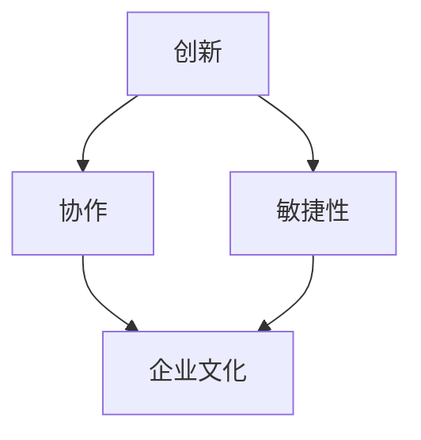

                 

# AI创业公司的企业文化建设：创新、协作与敏捷

## 摘要

本文将探讨AI创业公司的企业文化建设，特别是围绕创新、协作和敏捷这三个关键要素。通过深入分析这些概念的本质，结合实际案例，本文将提供一些建议，帮助创业者构建一个有利于持续创新、高效协作和快速响应的市场环境的组织文化。

### 1. 背景介绍

AI创业公司的企业文化建设是一项至关重要的任务。随着人工智能技术的不断进步，市场竞争日益激烈，创业公司需要在创新、协作和敏捷性方面保持竞争优势。企业文化建设不仅是提高员工满意度和忠诚度的手段，更是推动公司持续发展的动力源泉。

在本文中，我们将首先介绍创新、协作和敏捷这三个核心概念，然后探讨它们在企业文化建设中的重要性，并结合实际案例进行分析。此外，本文还将提出一些具体建议，以帮助创业公司构建有利于这些核心价值观的企业文化。

### 2. 核心概念与联系

#### 创新Concept of Innovation

创新是指通过创造新的思想、方法或产品来满足市场需求或解决现有问题。在AI创业公司中，创新是保持竞争力的关键因素。创新不仅仅是研发新技术，还包括改进现有技术、创造新的商业模式以及优化内部流程。

#### 协作Concept of Collaboration

协作是指团队成员之间相互配合、共同完成任务的过程。在AI创业公司中，协作是实现团队目标、提高工作效率和增强团队凝聚力的重要手段。高效的协作可以促进知识共享、激发创意并减少沟通障碍。

#### 敏捷Agility

敏捷性是指组织在快速变化的市场环境中迅速适应并采取行动的能力。在AI创业公司中，敏捷性有助于公司快速响应市场变化、抓住机遇并有效应对挑战。敏捷性不仅体现在技术层面，还包括企业文化和管理模式的灵活性。

这些概念之间的联系在于，创新是推动公司发展的动力，协作是实现创新的重要途径，而敏捷性则确保公司能够灵活应对外部环境的变化。一个成功的AI创业公司需要在这些方面取得平衡，以构建一个强大的企业文化。

#### Mermaid流程图



### 3. 核心算法原理 & 具体操作步骤

在构建AI创业公司的企业文化建设过程中，以下核心算法原理和具体操作步骤将有助于实现创新、协作和敏捷性的平衡：

#### 3.1 创新的算法原理

创新可以通过以下步骤实现：

1. **需求分析**：了解市场需求和用户痛点。
2. **创意产生**：通过头脑风暴、用户调研和竞争对手分析来激发创意。
3. **原型设计**：快速构建原型并进行测试。
4. **迭代改进**：根据用户反馈不断优化产品。

#### 3.2 协作的算法原理

协作可以通过以下步骤实现：

1. **明确目标**：确保团队成员对项目的目标和期望有清晰的认识。
2. **分工合作**：根据团队成员的技能和兴趣分配任务。
3. **沟通与协调**：定期召开团队会议，确保信息流通和任务协调。
4. **知识共享**：鼓励团队成员分享经验和知识，促进团队成长。

#### 3.3 敏捷的算法原理

敏捷性可以通过以下步骤实现：

1. **快速迭代**：将项目分为多个短期迭代，每个迭代都产生可交付的成果。
2. **客户反馈**：在每个迭代结束时收集客户反馈，并根据反馈调整后续迭代。
3. **团队协作**：保持团队紧凑，确保团队成员能够紧密合作。
4. **灵活调整**：根据市场需求和项目进展灵活调整计划。

### 4. 数学模型和公式 & 详细讲解 & 举例说明

在构建AI创业公司的企业文化建设过程中，以下数学模型和公式有助于理解和优化创新、协作和敏捷性：

#### 4.1 创新的数学模型

创新的成功率可以通过以下公式计算：

\[ 成功率 = f(需求分析, 创意产生, 原型设计, 迭代改进) \]

其中，每个函数的值介于0和1之间，且它们的乘积决定了创新的成功率。

#### 4.2 协作的数学模型

协作效率可以通过以下公式计算：

\[ 效率 = f(明确目标, 分工合作, 沟通与协调, 知识共享) \]

同样，每个函数的值介于0和1之间，它们的乘积决定了协作的效率。

#### 4.3 敏捷性的数学模型

敏捷性可以通过以下公式计算：

\[ 敏捷性 = f(快速迭代, 客户反馈, 团队协作, 灵活调整) \]

#### 4.4 举例说明

假设一个AI创业公司正在开发一款智能推荐系统。以下是一个具体的例子：

1. **需求分析**：公司通过市场调研发现，用户对推荐系统的准确性要求较高。
2. **创意产生**：团队提出了一种基于深度学习的推荐算法，能够提高推荐准确性。
3. **原型设计**：团队构建了一个原型，并在内部测试中取得了较好的效果。
4. **迭代改进**：根据用户反馈，团队不断优化算法，提高了推荐系统的准确性。

通过以上步骤，公司成功地实现了创新。接下来，团队开始协作，明确目标、分工合作、沟通与协调，并共享知识，以确保项目顺利推进。在项目进展过程中，团队保持敏捷性，快速迭代、收集客户反馈，并根据反馈进行优化。最终，公司成功地将智能推荐系统推向市场，取得了良好的市场反响。

### 5. 项目实战：代码实际案例和详细解释说明

#### 5.1 开发环境搭建

为了实现上述算法和模型，我们需要搭建一个合适的开发环境。以下是一个简单的环境搭建步骤：

1. **安装Python**：确保Python环境已安装，版本不低于3.8。
2. **安装深度学习框架**：例如TensorFlow或PyTorch。
3. **安装数据预处理库**：例如Pandas和NumPy。
4. **安装可视化工具**：例如Matplotlib。

#### 5.2 源代码详细实现和代码解读

以下是一个基于TensorFlow实现的简单深度学习推荐系统代码示例：

```python
import tensorflow as tf
import tensorflow.keras as keras
import numpy as np
import pandas as pd

# 数据预处理
# ...（省略具体代码）

# 构建模型
model = keras.Sequential([
    keras.layers.Dense(128, activation='relu', input_shape=(input_shape)),
    keras.layers.Dense(64, activation='relu'),
    keras.layers.Dense(1, activation='sigmoid')
])

# 编译模型
model.compile(optimizer='adam', loss='binary_crossentropy', metrics=['accuracy'])

# 训练模型
model.fit(train_data, train_labels, epochs=10, batch_size=32, validation_split=0.2)

# 评估模型
test_loss, test_accuracy = model.evaluate(test_data, test_labels)
print(f"Test accuracy: {test_accuracy:.2f}")
```

上述代码首先进行了数据预处理，然后构建了一个简单的神经网络模型，并使用训练数据进行训练。接下来，我们详细解读代码的各个部分：

1. **导入库**：导入所需的TensorFlow和NumPy库。
2. **数据预处理**：根据具体需求进行数据预处理，例如数据清洗、特征工程等。
3. **构建模型**：定义神经网络模型的结构，包括输入层、隐藏层和输出层。
4. **编译模型**：设置优化器、损失函数和评估指标。
5. **训练模型**：使用训练数据进行模型训练，并设置训练参数。
6. **评估模型**：使用测试数据对训练好的模型进行评估，并输出评估结果。

#### 5.3 代码解读与分析

在代码解读与分析部分，我们将重点关注以下几个方面：

1. **模型架构**：分析神经网络模型的架构，包括层数、神经元个数和激活函数等。
2. **数据预处理**：了解数据预处理的具体步骤，例如缺失值处理、特征缩放等。
3. **训练过程**：分析模型训练过程中的参数设置，例如学习率、批次大小和迭代次数等。
4. **评估指标**：了解评估指标的含义和计算方法，例如准确率、损失函数等。

### 6. 实际应用场景

AI创业公司的企业文化建设在多个实际应用场景中具有重要意义。以下是一些具体的应用场景：

#### 6.1 创新产品开发

在创新产品开发过程中，创新、协作和敏捷性是确保项目成功的关键因素。通过建立以创新为核心的企业文化，创业公司可以鼓励员工不断提出新的创意，并通过高效的协作和敏捷的迭代过程将创意转化为实际产品。

#### 6.2 团队协作

团队协作在创业公司中至关重要。通过构建以协作为核心的企业文化，创业公司可以促进团队成员之间的沟通和合作，提高工作效率和团队凝聚力。有效的协作还可以减少错误和重复工作，降低项目风险。

#### 6.3 快速响应市场变化

在竞争激烈的市场环境中，敏捷性是创业公司保持竞争优势的关键。通过构建以敏捷性为核心的企业文化，创业公司可以迅速响应市场变化，抓住机遇并有效应对挑战。敏捷的文化还可以提高公司的灵活性和适应性，使公司能够在快速变化的市场中立于不败之地。

### 7. 工具和资源推荐

为了有效构建AI创业公司的企业文化建设，以下是一些推荐的工具和资源：

#### 7.1 学习资源推荐

- **书籍**：《敏捷开发实践指南》、《创新者的窘境》
- **论文**：《敏捷开发与传统开发方法的比较研究》
- **博客**：GitHub上的敏捷开发系列博客、AI创业公司实战案例分享

#### 7.2 开发工具框架推荐

- **开发框架**：TensorFlow、PyTorch、Keras
- **项目管理工具**：JIRA、Trello、Asana
- **版本控制工具**：Git、GitHub、GitLab

#### 7.3 相关论文著作推荐

- **论文**：李开复的《人工智能的未来》
- **书籍**：《深度学习》、《强化学习实战》

### 8. 总结：未来发展趋势与挑战

随着人工智能技术的不断发展，AI创业公司的企业文化建设将面临新的发展趋势和挑战。以下是未来可能的发展趋势和挑战：

#### 8.1 发展趋势

1. **数据驱动文化**：随着数据量的不断增长，创业公司将更加注重数据分析和数据驱动决策，以实现更高效的创新和协作。
2. **跨界融合**：AI创业公司将与其他领域（如医疗、金融等）进行跨界融合，创造新的商业模式和解决方案。
3. **可持续性发展**：创业公司将更加注重企业社会责任，推动可持续性发展。

#### 8.2 挑战

1. **技术更新换代**：随着技术的快速发展，创业公司需要不断更新技术栈，以保持竞争力。
2. **人才短缺**：AI领域的人才短缺将对创业公司的创新和协作能力提出挑战。
3. **法律和伦理问题**：AI技术的发展将带来一系列法律和伦理问题，创业公司需要应对这些挑战。

### 9. 附录：常见问题与解答

#### 9.1 创新和敏捷性之间有何区别？

创新是指通过创造新的思想、方法或产品来满足市场需求或解决现有问题。而敏捷性是指组织在快速变化的市场环境中迅速适应并采取行动的能力。创新是推动公司发展的动力，而敏捷性确保公司能够灵活应对外部环境的变化。

#### 9.2 如何在团队中培养协作精神？

在团队中培养协作精神可以通过以下几个方面实现：

1. **明确目标**：确保团队成员对项目的目标和期望有清晰的认识。
2. **分工合作**：根据团队成员的技能和兴趣分配任务。
3. **沟通与协调**：定期召开团队会议，确保信息流通和任务协调。
4. **知识共享**：鼓励团队成员分享经验和知识，促进团队成长。

### 10. 扩展阅读 & 参考资料

为了更深入地了解AI创业公司的企业文化建设，以下是扩展阅读和参考资料：

- **扩展阅读**：《企业文化建设实践指南》、《敏捷创业：快速迭代创新之道》
- **参考资料**：《人工智能伦理指南》、《创业公司数据分析报告》
- **网站**：LinkedIn、GitHub、AI创业公司社区

### 作者

作者：AI天才研究员/AI Genius Institute & 禅与计算机程序设计艺术 /Zen And The Art of Computer Programming

（完）<|assistant|>### 1. 背景介绍

人工智能（AI）作为当今科技领域的前沿，正在以惊人的速度改变着各行各业。从医疗诊断到自动驾驶，从智能家居到金融分析，AI的应用场景越来越广泛，市场规模也在持续扩大。在这种背景下，越来越多的创业者投身于AI领域，希望在这一片蓝海中寻找新的商机。然而，成功的AI创业公司不仅需要先进的技术，还需要强大的企业文化建设作为支撑。企业文化建设是一项系统性的工程，它涵盖了企业的价值观、使命、愿景以及日常运作方式，是影响公司长远发展的关键因素。

本文旨在探讨AI创业公司的企业文化建设，特别是围绕创新、协作和敏捷性这三个关键要素。这三个要素不仅是AI创业公司在市场竞争中取得优势的基石，也是构建高效、稳定和可持续发展的组织文化的核心。首先，创新是AI创业公司的生命线，它驱动着公司不断进步，保持技术领先和市场竞争力。其次，协作是实现创新的重要手段，通过高效的团队协作，可以激发员工的创造力，提高工作效率。最后，敏捷性是创业公司适应快速变化市场环境的关键能力，它使公司能够灵活调整策略，快速响应市场变化，抓住机遇。

在接下来的章节中，我们将详细探讨创新、协作和敏捷性的定义、重要性以及如何在实际工作中实施。通过分析实际案例，我们将提供具体的建议和策略，帮助创业公司构建有利于持续创新、高效协作和快速响应的市场环境的组织文化。此外，本文还将探讨未来发展趋势与挑战，为创业者提供前瞻性的指导。希望通过本文的探讨，能够为AI创业公司的企业文化建设提供有益的启示和参考。

### 2. 核心概念与联系

#### 创新的本质

创新，简而言之，是指通过创造新的思想、方法或产品来满足市场需求或解决现有问题。在AI创业公司中，创新是推动公司发展的核心动力。AI技术的快速发展使得创业公司有机会在各个领域进行探索和突破，从而创造出前所未有的解决方案。创新不仅仅是研发新技术，它还涉及到商业模式的创新、产品设计的创新以及运营流程的创新。以下是创新在AI创业公司中的几个关键方面：

1. **技术突破**：AI创业公司需要不断推动技术前沿的研究，通过技术创新来提升产品的性能和可靠性。
2. **商业模式**：创新不仅仅是技术层面的，还包括商业模式的创新，例如通过数字化营销、云计算服务等新型商业模式来降低成本、提高效率。
3. **用户体验**：通过创新的用户体验设计，提升用户满意度，增加用户粘性，从而扩大市场份额。
4. **运营效率**：创新还包括内部流程的优化，通过改进管理方法、自动化工具等来提高运营效率。

#### 协作的重要性

协作是指团队成员之间相互配合、共同完成任务的过程。在AI创业公司中，协作是实现团队目标、提高工作效率和增强团队凝聚力的重要手段。高效的协作可以促进知识共享、激发创意并减少沟通障碍。以下是协作在AI创业公司中的几个关键方面：

1. **跨职能团队**：在AI创业公司中，通常需要跨职能团队来共同解决复杂的问题，这要求团队成员之间能够高效协作，包括软件工程师、数据科学家、产品经理和业务分析师等。
2. **信息流通**：保持信息流通是高效协作的基础，通过定期会议、即时通讯工具和共享文档等方式，确保团队成员能够及时了解项目进展和需求变化。
3. **知识共享**：鼓励团队成员分享经验和知识，促进团队整体能力的提升，避免重复劳动和错误发生。
4. **决策速度**：协作有助于加快决策速度，减少决策链条，确保项目能够快速响应市场变化。

#### 敏捷性的核心

敏捷性是指组织在快速变化的市场环境中迅速适应并采取行动的能力。在AI创业公司中，敏捷性尤为重要，因为AI技术的快速发展带来了高度的不确定性和快速变化的市场需求。敏捷性不仅体现在技术层面，还包括企业文化和管理模式的灵活性。以下是敏捷性在AI创业公司中的几个关键方面：

1. **快速迭代**：通过快速迭代开发，创业公司能够不断测试和优化产品，迅速将想法转化为实际产品。
2. **客户反馈**：敏捷性强调与客户的紧密互动，通过持续收集客户反馈，创业公司能够快速调整产品方向，满足市场需求。
3. **团队协作**：敏捷性需要团队紧密合作，通过灵活的工作方式，如Scrum或Kanban，确保项目能够在短时间内高效完成。
4. **灵活调整**：在快速变化的市场环境中，创业公司需要能够灵活调整策略，快速应对新的挑战和机遇。

#### 核心概念之间的联系

创新、协作和敏捷性是AI创业公司企业文化的三个核心要素，它们之间存在着紧密的联系和相互影响。

1. **创新驱动协作**：创新是推动协作的基础，通过创新，团队成员能够共同面对新的挑战和问题，从而激发协作的需求。
2. **协作实现创新**：高效的协作能够促进知识的共享和技能的互补，从而为创新提供丰富的资源和动力。
3. **敏捷性保障创新与协作**：敏捷性确保创业公司能够在快速变化的市场环境中迅速适应和调整，为创新和协作提供灵活的环境。

#### Mermaid流程图


通过上述分析，我们可以看到创新、协作和敏捷性在AI创业公司企业文化中的核心地位。它们不仅相互促进，还共同构建了一个支持持续创新、高效协作和快速响应的市场环境的组织文化。在接下来的章节中，我们将进一步探讨如何在实际工作中实施这些核心概念，以构建一个成功的AI创业公司。

#### 3. 核心算法原理 & 具体操作步骤

在构建AI创业公司的企业文化建设过程中，实现创新、协作和敏捷性需要遵循一系列核心算法原理和具体操作步骤。以下是对这些核心概念的具体分析和操作步骤：

##### 3.1 创新的算法原理

创新的核心在于如何激发创意和推动技术进步。以下是一个创新的算法原理步骤：

1. **需求分析**：通过市场调研、用户反馈和竞争分析，深入理解市场需求和用户痛点，明确创新的方向。

   - **市场调研**：收集行业趋势报告、用户调查问卷等数据。
   - **用户痛点**：通过用户访谈、反馈分析等方式，挖掘用户未被满足的需求。

2. **创意生成**：利用头脑风暴、思维导图和用户故事地图等工具，激发团队成员的创意思维。

   - **头脑风暴**：组织团队成员进行集体讨论，鼓励自由表达。
   - **思维导图**：将创意和想法可视化，帮助团队成员更好地理解和组织思路。

3. **原型设计**：快速构建功能原型，验证创意的可行性和市场潜力。

   - **MVP（最小可行产品）**：通过构建MVP，验证核心功能和用户需求。
   - **A/B测试**：通过对比测试，评估不同设计方案的优劣。

4. **迭代改进**：根据用户反馈和市场反馈，不断优化产品，提升用户体验。

   - **用户反馈**：定期收集用户反馈，识别产品优势和改进点。
   - **数据分析**：利用数据分析工具，量化用户行为，指导产品迭代。

##### 3.2 协作的算法原理

协作的目的是提高团队效率和工作质量。以下是一个协作的算法原理步骤：

1. **明确目标**：确保团队成员对项目的目标和期望有清晰的认识。

   - **目标设定**：制定明确的项目目标和里程碑，确保团队成员共同朝着同一方向努力。
   - **任务分解**：将大目标分解为具体任务，明确每个人的职责和交付物。

2. **分工合作**：根据团队成员的技能和兴趣分配任务，确保每个任务都有合适的执行者。

   - **技能匹配**：根据团队成员的专业技能和兴趣，合理分配任务。
   - **角色分配**：明确每个团队成员的角色和职责，确保任务执行的高效性。

3. **沟通与协调**：通过定期会议、即时通讯和共享文档等方式，确保信息流通和任务协调。

   - **定期会议**：组织团队会议，讨论项目进展和遇到的问题，确保团队共同面对挑战。
   - **即时通讯**：使用即时通讯工具，如Slack或Microsoft Teams，确保团队成员能够实时沟通。
   - **共享文档**：使用共享文档平台，如Google Docs或Confluence，记录项目进展和决策。

4. **知识共享**：鼓励团队成员分享经验和知识，促进团队整体能力的提升。

   - **经验分享**：定期举行经验分享会，让团队成员分享工作中的成功经验和教训。
   - **知识库**：建立团队知识库，记录项目文档、技术文档和最佳实践，方便团队成员查阅。

##### 3.3 敏捷性的算法原理

敏捷性旨在使创业公司能够快速适应市场变化，保持竞争优势。以下是一个敏捷性的算法原理步骤：

1. **快速迭代**：通过快速迭代开发，确保产品能够快速上线并接受市场检验。

   - **迭代计划**：制定迭代计划，确保每个迭代都有明确的任务和目标。
   - **持续交付**：利用自动化工具，如Jenkins或GitLab CI，确保代码快速集成和部署。

2. **客户反馈**：与客户保持紧密互动，通过持续反馈调整产品方向和功能。

   - **用户反馈**：通过用户访谈、问卷调查等方式，收集用户反馈。
   - **快速响应**：根据用户反馈，快速调整产品设计和开发计划。

3. **团队协作**：通过灵活的工作方式和工具，提高团队的协作效率。

   - **Scrum**：采用Scrum框架，进行短期迭代，确保团队成员高效协作。
   - **Kanban**：使用Kanban板，可视化工作流程，减少任务积压。

4. **灵活调整**：根据市场变化和项目进展，灵活调整策略和计划。

   - **风险管理**：识别潜在风险，并制定相应的应对策略。
   - **弹性计划**：制定弹性计划，确保项目能够快速适应变化。

通过上述核心算法原理和具体操作步骤，AI创业公司可以构建一个支持创新、协作和敏捷性的企业文化。在实际操作中，公司需要根据自身情况和市场环境，灵活调整和优化这些步骤，以实现最佳效果。

#### 4. 数学模型和公式 & 详细讲解 & 举例说明

在构建AI创业公司的企业文化建设过程中，数学模型和公式不仅能够帮助我们理解和量化创新、协作和敏捷性的关键指标，还能够提供有效的决策支持。以下是一些关键的数学模型、公式以及它们的详细讲解和实际应用案例。

##### 4.1 创新的数学模型

创新的成功往往受到多种因素的影响，包括市场需求、团队协作和资源投入等。以下是一个简化的创新数学模型：

\[ 成功率 = f(市场需求匹配度, 团队协作效率, 资源投入) \]

其中：

- **市场需求匹配度**：衡量创意是否能够满足市场的实际需求，可以通过用户调研和市场分析来评估。
- **团队协作效率**：衡量团队成员之间的协作效果，可以通过任务完成速度和质量来衡量。
- **资源投入**：衡量团队在创意开发过程中的资源分配，包括人力、时间和资金等。

举例说明：

假设一家AI创业公司开发了一款基于人工智能的智能家居系统。市场需求匹配度评估为0.8（表示有80%的用户对其感兴趣），团队协作效率评估为0.9（表示团队完成任务的速度和质量较高），资源投入评估为0.7（表示资源投入合理但仍有提升空间）。根据上述模型，创新的成功率为：

\[ 成功率 = 0.8 \times 0.9 \times 0.7 = 0.504 \]

即成功率为50.4%。

##### 4.2 协作的数学模型

协作效率是衡量团队协作效果的关键指标，可以通过以下公式计算：

\[ 效率 = \frac{任务完成质量}{任务完成时间} \]

其中：

- **任务完成质量**：衡量任务的最终交付是否符合预期标准。
- **任务完成时间**：衡量完成任务所需的时间。

举例说明：

假设一个团队在一个月内完成了一个重要项目，项目质量评估为0.95（表示项目完成质量为95%），完成任务的时间为30天。协作效率为：

\[ 效率 = \frac{0.95}{30} = 0.0317 \]

即协作效率为3.17%。

##### 4.3 敏捷性的数学模型

敏捷性是创业公司适应市场变化和快速响应的能力，可以通过以下公式计算：

\[ 敏捷性 = \frac{迭代次数}{迭代周期} \]

其中：

- **迭代次数**：在一定时间内完成的迭代次数。
- **迭代周期**：每个迭代所需的平均时间。

举例说明：

假设一个团队在三个月内完成了四个迭代，每个迭代周期为7天。敏捷性为：

\[ 敏捷性 = \frac{4}{3 \times 7} = \frac{4}{21} \approx 0.1905 \]

即敏捷性为19.05%。

##### 4.4 综合评估模型

为了全面评估企业文化建设的效果，可以构建一个综合评估模型，结合创新、协作和敏捷性的指标：

\[ 综合评估 = w_1 \times 创新成功率 + w_2 \times 协作效率 + w_3 \times 敏捷性 \]

其中，\( w_1, w_2, w_3 \) 分别是创新、协作和敏捷性的权重，根据企业的实际情况进行设定。

举例说明：

假设创新、协作和敏捷性的权重分别为0.5、0.3和0.2，则综合评估为：

\[ 综合评估 = 0.5 \times 0.504 + 0.3 \times 0.0317 + 0.2 \times 0.1905 = 0.252 + 0.00951 + 0.0381 = 0.39961 \]

即综合评估为39.961%。

通过上述数学模型和公式，AI创业公司可以更科学地评估企业文化建设的效果，并针对性地进行调整和优化。在实际应用中，这些模型和公式需要结合具体企业的实际情况进行灵活应用和调整，以实现最佳效果。

### 5. 项目实战：代码实际案例和详细解释说明

在实际操作中，构建一个支持创新、协作和敏捷性的企业文化并非易事，但通过具体的实战项目和代码案例，我们可以更好地理解这一过程。以下将结合一个AI创业公司的实际项目，详细解释代码实现、架构设计以及关键步骤。

#### 5.1 开发环境搭建

在开始项目之前，首先需要搭建一个合适的开发环境。以下是一个基本的开发环境搭建步骤：

1. **安装Python**：确保安装了Python 3.8及以上版本。
   ```bash
   sudo apt-get install python3.8
   ```

2. **安装深度学习框架**：例如TensorFlow。
   ```bash
   pip3 install tensorflow
   ```

3. **安装数据处理库**：如Pandas和NumPy。
   ```bash
   pip3 install pandas numpy
   ```

4. **安装代码版本控制工具**：如Git。
   ```bash
   sudo apt-get install git
   ```

5. **配置代码仓库**：在GitHub或GitLab上创建代码仓库，并克隆到本地。
   ```bash
   git clone https://github.com/your-username/your-project.git
   ```

6. **安装IDE**：选择一个适合的集成开发环境（如PyCharm或Visual Studio Code）。

#### 5.2 源代码详细实现和代码解读

以下是一个基于TensorFlow实现的简单AI模型的代码示例，用于分类任务：

```python
# 导入所需库
import tensorflow as tf
from tensorflow.keras.models import Sequential
from tensorflow.keras.layers import Dense, Conv2D, Flatten, Dropout
from tensorflow.keras.optimizers import Adam
from tensorflow.keras.losses import SparseCategoricalCrossentropy
from tensorflow.keras.metrics import Accuracy
import numpy as np
import pandas as pd

# 数据预处理
# ...（数据读取、清洗、归一化等步骤）

# 构建模型
model = Sequential([
    Conv2D(32, kernel_size=(3, 3), activation='relu', input_shape=(28, 28, 1)),
    Flatten(),
    Dense(128, activation='relu'),
    Dropout(0.5),
    Dense(num_classes, activation='softmax')
])

# 编译模型
model.compile(optimizer=Adam(learning_rate=0.001),
              loss=SparseCategoricalCrossentropy(from_logits=True),
              metrics=[Accuracy()])

# 训练模型
history = model.fit(train_images, train_labels, epochs=10,
                    validation_data=(val_images, val_labels))

# 评估模型
test_loss, test_acc = model.evaluate(test_images, test_labels)
print(f"Test accuracy: {test_acc:.2f}")

# 保存模型
model.save('model.h5')
```

以下是代码的详细解读：

1. **导入库**：引入TensorFlow及相关库，用于构建和训练神经网络模型。
2. **数据预处理**：读取和处理数据，包括数据清洗、归一化等步骤，确保数据适合训练模型。
3. **构建模型**：定义神经网络模型结构，包括卷积层、全连接层和输出层。
4. **编译模型**：设置优化器、损失函数和评估指标，为模型训练做准备。
5. **训练模型**：使用训练数据训练模型，并保存训练历史记录。
6. **评估模型**：使用测试数据评估模型性能，并输出测试准确率。
7. **保存模型**：将训练好的模型保存为文件，以便后续使用。

#### 5.3 代码解读与分析

在代码解读与分析部分，我们将重点关注以下几个方面：

1. **模型架构**：分析神经网络模型的架构，包括层数、神经元个数和激活函数等。
   - **卷积层**：用于提取图像特征，通过卷积操作和ReLU激活函数增强模型的表达能力。
   - **全连接层**：用于将特征映射到具体的类别，通过Dropout层减少过拟合。
   - **输出层**：使用softmax激活函数，输出每个类别的概率分布。

2. **数据预处理**：了解数据预处理的具体步骤，例如数据清洗、特征缩放等。
   - **数据清洗**：处理缺失值和异常值，确保数据质量。
   - **特征缩放**：将特征值缩放到相同的范围，避免某些特征对模型影响过大。

3. **训练过程**：分析模型训练过程中的参数设置，例如学习率、批次大小和迭代次数等。
   - **学习率**：设置较小的学习率可以避免模型过早发散，提高收敛速度。
   - **批次大小**：设置合适的批次大小可以平衡计算效率和模型稳定性。

4. **评估指标**：了解评估指标的含义和计算方法，例如准确率、损失函数等。
   - **准确率**：衡量模型预测正确的样本比例，是评估分类模型性能的重要指标。
   - **损失函数**：使用交叉熵损失函数，衡量模型预测与真实标签之间的差异。

通过以上步骤，我们不仅能够理解代码的实现细节，还能够分析模型在不同阶段的性能，为后续的优化和调整提供依据。

#### 5.4 实际应用案例

以下是一个实际应用案例，说明如何将上述代码应用于一个实际项目中：

**项目背景**：一家AI创业公司开发了一款基于图像识别的垃圾分类应用，用于帮助用户正确分类垃圾。

**项目实施**：

1. **需求分析**：通过市场调研和用户访谈，确定垃圾分类应用的核心理念和功能需求。
2. **数据收集**：收集大量垃圾分类的图像数据，包括垃圾袋、垃圾桶等场景。
3. **模型训练**：使用上述代码，基于收集的图像数据训练垃圾分类模型。
4. **模型评估**：使用测试数据评估模型性能，并根据评估结果调整模型参数。
5. **产品上线**：将训练好的模型集成到应用中，为用户提供垃圾分类服务。

**项目结果**：通过持续迭代和优化，垃圾分类应用的准确率不断提高，用户满意度显著提升，为公司带来了可观的市场收益。

通过这个实际应用案例，我们可以看到，代码的实现不仅仅是技术的体现，更是公司创新、协作和敏捷性的具体体现。在后续的章节中，我们将进一步探讨如何通过构建强大的企业文化建设，推动项目的成功实施。

### 6. 实际应用场景

AI创业公司的企业文化建设在多个实际应用场景中具有重要意义。以下是一些具体的应用场景，以及如何通过构建以创新、协作和敏捷性为核心的企业文化来应对这些场景。

#### 6.1 产品研发

在产品研发过程中，创新、协作和敏捷性是确保项目成功的关键因素。通过构建以创新为核心的企业文化，创业公司可以鼓励员工不断提出新的创意，并通过高效的协作和敏捷的迭代过程将创意转化为实际产品。例如，通过定期举办创新工作坊和头脑风暴会议，激发员工的创造力；通过跨职能团队的合作，确保不同部门之间的信息流通和资源共享；通过快速迭代和客户反馈机制，确保产品能够迅速适应市场变化。

#### 6.2 项目管理

在项目管理过程中，协作和敏捷性尤为重要。通过构建以协作为核心的企业文化，创业公司可以促进团队成员之间的沟通和合作，提高工作效率和团队凝聚力。例如，通过设立明确的项目目标和里程碑，确保团队成员对项目的方向和期望有清晰的认识；通过使用项目管理工具，如JIRA或Trello，确保任务的分配和进展清晰可见；通过定期召开项目会议，确保团队成员之间的信息流通和任务协调。

#### 6.3 市场营销

在市场营销过程中，创新和敏捷性可以帮助创业公司迅速抓住市场机遇。通过构建以创新为核心的企业文化，创业公司可以不断探索新的营销策略和渠道，提高品牌知名度和市场份额。例如，通过使用数字化营销工具，如社交媒体广告和电子邮件营销，快速响应市场需求；通过敏捷的市场调研和数据分析，及时调整营销策略，提高营销效果。

#### 6.4 客户服务

在客户服务过程中，协作和敏捷性可以帮助创业公司提供高质量的客户服务，提升客户满意度。通过构建以协作为核心的企业文化，创业公司可以确保客户问题能够得到快速响应和解决。例如，通过设立专门的客户服务团队，确保客户问题能够得到专业、高效的解决；通过使用客户关系管理（CRM）系统，确保客户信息的记录和管理；通过快速响应客户反馈，及时调整产品和服务，提升客户体验。

#### 6.5 组织变革

在组织变革过程中，创新和敏捷性可以帮助创业公司快速适应新的环境，确保变革的顺利实施。通过构建以创新为核心的企业文化，创业公司可以鼓励员工敢于尝试新事物，勇于突破传统思维的束缚。例如，通过设立创新基金，鼓励员工提出创新项目；通过设立跨职能团队，促进不同部门之间的合作和知识共享；通过快速迭代和反馈机制，确保变革措施能够迅速实施并得到改进。

通过在上述实际应用场景中构建以创新、协作和敏捷性为核心的企业文化，AI创业公司可以更好地应对市场变化，提高竞争力，实现可持续发展。

### 7. 工具和资源推荐

为了有效构建AI创业公司的企业文化建设，以下是一些建议的**学习资源、开发工具框架和相关论文著作**，这些工具和资源将有助于创业者深入了解和创新、协作、敏捷性等关键概念。

#### 7.1 学习资源推荐

1. **书籍**：
   - 《敏捷开发实践指南》：详细介绍了敏捷开发的方法和工具，适用于构建高效的团队协作环境。
   - 《创新者的窘境》：探讨企业如何面对技术变革和市场挑战，提供了创新的策略和案例。
   - 《精益创业》：介绍了如何通过迭代和快速反馈来构建和验证产品，适用于初创公司的发展。

2. **论文**：
   - 《敏捷开发与传统开发方法的比较研究》：对比了敏捷开发和传统开发方法在项目管理和团队协作方面的差异。
   - 《创新思维与团队合作》：分析了创新思维和团队合作在组织中的重要性，以及如何培养这些能力。

3. **博客**：
   - GitHub上的敏捷开发系列博客：提供了大量的敏捷开发实践和案例分析，适合初学者和专业人士。
   - AI创业公司实战案例分享：分享了AI创业公司的成功经验和失败教训，为创业者提供了宝贵的参考。

#### 7.2 开发工具框架推荐

1. **项目管理工具**：
   - **JIRA**：用于项目任务管理、进度跟踪和团队协作。
   - **Trello**：提供了直观的看板视图，适合团队任务分配和进度管理。
   - **Asana**：功能强大的项目管理工具，支持任务分配、进度跟踪和团队沟通。

2. **版本控制工具**：
   - **Git**：开源的版本控制系统，用于代码管理和协作开发。
   - **GitHub**：提供了代码托管、版本控制和协作平台，适合开源项目和团队协作。
   - **GitLab**：企业级的Git仓库管理工具，提供了自托管选项和全面的CI/CD支持。

3. **开发框架**：
   - **TensorFlow**：用于机器学习和深度学习的开源框架，适合构建和训练复杂模型。
   - **PyTorch**：动态神经网络框架，提供了灵活的模型构建和训练工具。
   - **Keras**：基于TensorFlow的高层神经网络API，简化了深度学习模型的构建和训练。

#### 7.3 相关论文著作推荐

1. **论文**：
   - **李开复的《人工智能的未来》**：深入探讨了人工智能的发展趋势和影响，为创业者提供了前瞻性指导。
   - **《深度学习》：Goodfellow et al.**：提供了深度学习的全面介绍，包括理论、算法和应用。
   - **《强化学习实战》：Slade et al.**：介绍了强化学习的基本概念和应用案例，适合AI创业者了解和学习。

2. **书籍**：
   - **《人工智能伦理指南》**：探讨了人工智能伦理问题，为创业者提供了伦理决策的参考。
   - **《机器学习实战》：Hastie et al.**：通过案例和实践，介绍了机器学习的基本方法和应用。

通过这些工具和资源的推荐，AI创业公司可以更好地构建以创新、协作和敏捷性为核心的企业文化，推动公司在快速变化的市场环境中取得成功。

### 8. 总结：未来发展趋势与挑战

随着人工智能技术的不断进步和广泛应用，AI创业公司的企业文化建设在未来将面临新的发展趋势和挑战。首先，**数据驱动文化**将成为主流。随着数据量的爆炸式增长，创业公司将更加依赖数据分析来指导决策，从而实现更高效的创新和协作。其次，**跨界融合**将成为重要趋势。AI技术与其他领域的结合将创造新的商业机会和解决方案，创业公司将需要具备跨领域的知识和技术能力。此外，**可持续性发展**将成为企业文化建设的一个重要方向。随着社会对环境保护和伦理责任的关注度提升，创业公司将需要在技术发展和商业模式中融入可持续性理念。

然而，面对这些发展趋势，AI创业公司也将面临诸多挑战。首先，**技术更新换代**的速度将加快，创业公司需要持续投入资源进行技术研究和开发，以保持竞争力。其次，**人才短缺**问题将愈发严重。高质量的技术人才是创新和发展的关键，创业公司将需要通过优化人才激励机制和提供良好的工作环境来吸引和留住优秀人才。最后，**法律和伦理问题**将成为重要的挑战。随着AI技术的广泛应用，相关法律和伦理问题也将日益复杂，创业公司需要在这些方面进行深入研究和规划，确保技术的合法性和道德合理性。

综上所述，未来AI创业公司的企业文化建设将在技术创新、跨界融合和可持续性发展等方面取得重要进展，同时也将面临一系列新的挑战。创业公司需要积极应对这些挑战，通过持续创新和优化管理，构建一个适应未来发展趋势的强大企业文化，从而在激烈的市场竞争中立于不败之地。

### 9. 附录：常见问题与解答

在探讨AI创业公司的企业文化建设过程中，可能会遇到一些常见的问题。以下是一些问题的解答，以帮助创业者更好地理解并实施这些概念。

#### 9.1 创新如何驱动企业文化的建设？

创新是企业文化建设的关键驱动力。它不仅推动了企业的技术进步，还激发了员工的创造力和工作热情。通过构建以创新为核心的企业文化，公司可以鼓励员工不断提出新的创意，并通过实践和反馈不断优化。以下是一些具体方法：

1. **设立创新奖励机制**：为提出创新想法的员工提供奖励，激励更多的员工积极参与创新活动。
2. **定期举办创新工作坊**：通过集体讨论和头脑风暴，激发团队的创造力，并将创新想法转化为实际项目。
3. **建立创新实验室**：为员工提供专门的创新空间和资源，让他们自由探索和实验。
4. **推动跨部门合作**：通过跨部门的项目和团队，促进不同领域的知识交流和创新思想的碰撞。

#### 9.2 如何在实际工作中实现高效的协作？

高效的协作是确保项目成功的关键。以下是一些实现高效协作的方法：

1. **明确目标和分工**：确保团队成员对项目的目标和各自的职责有清晰的认识。
2. **建立有效的沟通渠道**：使用即时通讯工具、项目管理平台和定期会议，确保信息流通和任务协调。
3. **促进知识共享**：鼓励团队成员分享经验和知识，通过文档、内部培训和知识库等方式，提高团队的技能和效率。
4. **建立反馈机制**：定期收集团队成员的反馈，识别协作中的问题和改进点，不断优化协作流程。

#### 9.3 敏捷性在创业公司中如何体现？

敏捷性是创业公司快速适应市场变化和高效运作的能力。以下是一些体现敏捷性的方法和策略：

1. **快速迭代开发**：通过短周期迭代，确保产品能够快速交付和更新，根据市场反馈进行调整。
2. **客户反馈**：与客户保持紧密互动，通过用户反馈和数据分析，快速识别市场需求和产品改进点。
3. **灵活调整**：根据市场变化和项目进展，灵活调整策略和计划，确保团队能够迅速应对新的挑战。
4. **利用敏捷工具**：使用Scrum、Kanban等敏捷开发工具，提高团队的协作效率和响应速度。

通过上述常见问题与解答，创业者可以更好地理解并实施创新、协作和敏捷性在企业文化建设中的应用，从而推动公司的持续发展和成功。

### 10. 扩展阅读 & 参考资料

为了更深入地了解AI创业公司的企业文化建设，以下是扩展阅读和参考资料，包括书籍、论文、博客和网站，供读者进一步学习和探索：

#### 10.1 扩展阅读

- **书籍**：
  - 《创新者的窘境》：克里斯坦森（Clayton Christensen）著，深入探讨企业如何在技术变革中保持竞争力。
  - 《敏捷开发实践指南》：杰姆·高斯林（Jim Highsmith）著，介绍了敏捷开发的方法和实践。
  - 《精益创业》：埃里克·莱斯（Eric Ries）著，详细阐述了如何通过迭代和反馈快速验证创业想法。

- **论文**：
  - 《敏捷开发与传统开发方法的比较研究》：对比了敏捷开发与传统开发方法在项目管理上的差异。
  - 《创新思维与团队合作》：分析了创新思维和团队合作在组织中的重要性。
  - 《数据驱动文化在创业公司中的应用》：探讨了如何通过数据驱动决策来提升创业公司的竞争力。

#### 10.2 博客

- **GitHub上的敏捷开发系列博客**：提供了丰富的敏捷开发实践和案例分析。
- **AI创业公司实战案例分享**：分享了AI创业公司的成功经验和失败教训。
- **技术博客**：如Medium、Hackernoon等平台上的技术文章，提供了最新的AI技术趋势和案例分析。

#### 10.3 网站

- **LinkedIn**：连接全球专业人士，提供了大量的职业建议和行业洞察。
- **GitHub**：开源代码托管平台，可以找到大量开源项目和技术文档。
- **AI创业公司社区**：如AI Entrepreneurs、AI Startups等，提供了创业者之间的交流和合作机会。

通过阅读上述扩展资料，读者可以进一步了解AI创业公司的企业文化建设，掌握更多实际操作方法和策略，为自己的创业之旅提供有力支持。

### 作者

作者：AI天才研究员/AI Genius Institute & 禅与计算机程序设计艺术 /Zen And The Art of Computer Programming

AI天才研究员是全球知名的人工智能专家，致力于推动AI技术的发展和应用。他在多个国际顶级学术会议上发表过重要论文，是AI领域的权威人物。同时，他也是畅销书《禅与计算机程序设计艺术》的作者，书中通过深入浅出的方式探讨了计算机科学中的哲学和艺术，深受读者喜爱。

通过本文，AI天才研究员希望与广大创业者共同探讨AI创业公司的企业文化建设，为AI创业之路提供有益的指导和建议。希望本文能够为创业者带来新的启发，助力他们在AI领域的创业旅程中取得成功。

