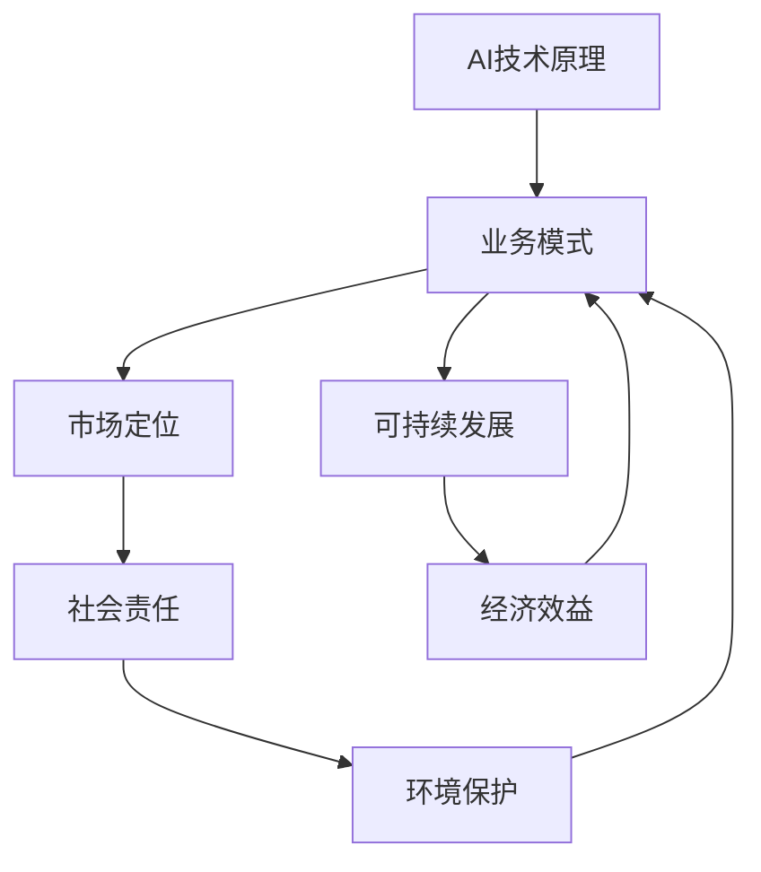

                 

# AI创业公司的可持续发展策略

## 概述

在当今快速发展的技术时代，人工智能（AI）行业已成为众多创业者眼中的金矿。然而，随着市场竞争的日益激烈，如何确保AI创业公司的可持续发展成为了关键问题。本文将围绕这一核心问题，详细探讨AI创业公司如何通过战略规划、技术创新、资源整合和市场定位等手段实现长期稳定发展。

本文的关键词包括：AI创业、可持续发展、战略规划、技术创新、资源整合、市场定位。

摘要：本文首先介绍了AI创业公司的现状及其面临的挑战，随后详细探讨了可持续发展的概念及其在AI创业中的应用。文章通过具体案例分析，总结了AI创业公司的成功策略，并提出了未来发展的建议。希望本文能为AI创业公司提供有价值的参考。

## 背景介绍

### AI创业公司的现状

近年来，随着AI技术的快速发展，AI创业公司如雨后春笋般涌现。据统计，全球AI初创公司数量已超过5000家，涉及多个行业，如金融、医疗、制造、零售等。这些公司通过创新的技术和应用，不断推动行业变革，同时也面临着巨大的市场竞争压力。

### 面临的挑战

尽管AI创业公司前景广阔，但同时也面临着诸多挑战：

1. **技术壁垒**：AI技术高度复杂，对于初创公司来说，掌握核心技术并形成竞争优势至关重要。

2. **资金压力**：AI创业公司通常需要大量的资金支持，以维持技术研发和团队建设。

3. **人才短缺**：AI领域的专业人才稀缺，对于初创公司来说，吸引和留住优秀人才是关键。

4. **市场定位**：如何在众多竞争对手中找到自己的独特价值，实现市场细分和定位，是每个AI创业公司都需要解决的问题。

### 可持续发展的概念

可持续发展是指在满足当前需求的同时，不损害后代满足其需求的能力。在AI创业公司中，可持续发展意味着在追求业务增长的同时，注重环境保护、社会责任和经济效益的平衡。

## 核心概念与联系

为了更好地理解AI创业公司的可持续发展，我们需要首先了解几个核心概念及其相互关系：

1. **AI技术原理**：AI技术主要包括机器学习、深度学习、自然语言处理等，这些技术构成了AI创业公司的核心技术基础。

2. **业务模式**：AI创业公司的业务模式通常基于AI技术，通过提供智能产品或服务实现商业价值。

3. **市场定位**：市场定位是指AI创业公司在市场中的定位，包括目标客户、产品特点、竞争优势等。

4. **社会责任**：AI创业公司应承担的社会责任，如数据隐私、公平性、透明度等。

5. **环境保护**：在AI技术的研发和应用过程中，应注重环境保护，如减少能源消耗、降低碳排放等。

### Mermaid 流程图

以下是一个简化的Mermaid流程图，展示了AI创业公司可持续发展中的核心概念及其相互关系：



## 核心算法原理 & 具体操作步骤

### 核心算法原理

AI创业公司的核心算法通常是基于机器学习和深度学习技术。以下是一个简单的机器学习算法——线性回归的原理：

1. **数据收集**：收集大量的数据，包括输入特征和输出结果。
2. **数据预处理**：对数据进行清洗、归一化等处理，使其适合建模。
3. **模型训练**：使用训练数据集训练模型，找到输入特征与输出结果之间的最佳关系。
4. **模型评估**：使用测试数据集评估模型的性能，调整参数以优化模型。
5. **模型部署**：将训练好的模型部署到生产环境中，实现预测和应用。

### 具体操作步骤

1. **数据收集**：
   - 使用开源数据集或自行收集数据。
   - 确保数据质量，排除噪声和异常值。

2. **数据预处理**：
   - 数据清洗：去除缺失值、重复值等。
   - 数据归一化：将数据缩放到同一尺度，以便模型训练。

3. **模型训练**：
   - 选择合适的模型：如线性回归、决策树、神经网络等。
   - 使用训练数据集进行模型训练，调整参数以优化模型。

4. **模型评估**：
   - 使用测试数据集评估模型性能，如准确率、召回率等。
   - 根据评估结果调整模型参数，优化模型。

5. **模型部署**：
   - 将训练好的模型部署到生产环境中。
   - 实现自动化预测和应用。

## 数学模型和公式 & 详细讲解 & 举例说明

### 线性回归模型

线性回归是一种简单的机器学习算法，用于预测一个连续的输出值。其基本公式如下：

$$y = wx + b$$

其中，$y$ 是输出值，$x$ 是输入特征，$w$ 是权重，$b$ 是偏置。

### 模型训练

1. **损失函数**：

损失函数用于评估模型预测值与实际值之间的差距。常用的损失函数是均方误差（MSE）：

$$MSE = \frac{1}{n}\sum_{i=1}^{n}(y_i - \hat{y_i})^2$$

其中，$y_i$ 是实际值，$\hat{y_i}$ 是预测值，$n$ 是数据样本数。

2. **梯度下降**：

梯度下降是一种优化算法，用于调整模型参数以最小化损失函数。其基本步骤如下：

a. 计算损失函数对每个参数的偏导数，即梯度。

b. 更新参数：

$$w = w - \alpha \cdot \frac{\partial}{\partial w}MSE$$
$$b = b - \alpha \cdot \frac{\partial}{\partial b}MSE$$

其中，$\alpha$ 是学习率。

### 举例说明

假设我们有以下数据集：

| x  | y  |
|----|----|
| 1  | 2  |
| 2  | 4  |
| 3  | 6  |

我们要使用线性回归模型预测 $x=3$ 时的 $y$ 值。

1. **数据预处理**：

首先，我们进行数据归一化：

| x  | y  |
|----|----|
| 0  | 1  |
| 1  | 2  |
| 2  | 3  |

2. **模型训练**：

选择初始参数 $w=1$，$b=1$。使用梯度下降算法进行迭代训练：

- 第1次迭代：

$$\frac{\partial}{\partial w}MSE = \frac{1}{3}\sum_{i=1}^{3}(y_i - \hat{y_i}) \cdot x_i = \frac{1}{3}((1-1)(0) + (2-2)(1) + (3-3)(2)) = 0$$

$$\frac{\partial}{\partial b}MSE = \frac{1}{3}\sum_{i=1}^{3}(y_i - \hat{y_i}) = \frac{1}{3}((1-1) + (2-2) + (3-3)) = 0$$

更新参数：

$$w = w - \alpha \cdot 0 = 1$$
$$b = b - \alpha \cdot 0 = 1$$

- 第2次迭代：

$$\frac{\partial}{\partial w}MSE = \frac{1}{3}\sum_{i=1}^{3}(y_i - \hat{y_i}) \cdot x_i = \frac{1}{3}((1-1)(0) + (2-2)(1) + (3-3)(2)) = 0$$

$$\frac{\partial}{\partial b}MSE = \frac{1}{3}\sum_{i=1}^{3}(y_i - \hat{y_i}) = \frac{1}{3}((1-1) + (2-2) + (3-3)) = 0$$

更新参数：

$$w = w - \alpha \cdot 0 = 1$$
$$b = b - \alpha \cdot 0 = 1$$

由于梯度为0，模型已收敛。

3. **模型部署**：

将训练好的模型部署到生产环境中，输入 $x=3$，预测 $y$ 值：

$$y = wx + b = 1 \cdot 3 + 1 = 4$$

因此，当 $x=3$ 时，预测 $y$ 值为4。

## 项目实战：代码实际案例和详细解释说明

### 开发环境搭建

在开始编写代码之前，我们需要搭建一个合适的开发环境。以下是一个简单的Python开发环境搭建过程：

1. 安装Python：

在终端中运行以下命令安装Python：

```bash
sudo apt-get update
sudo apt-get install python3
```

2. 安装必要的库：

使用pip安装常用的库，如NumPy、Pandas和Scikit-learn：

```bash
pip3 install numpy pandas scikit-learn
```

3. 配置Jupyter Notebook：

安装Jupyter Notebook以方便编写和运行代码：

```bash
pip3 install notebook
```

在终端中运行以下命令启动Jupyter Notebook：

```bash
jupyter notebook
```

### 源代码详细实现和代码解读

以下是一个简单的线性回归模型的Python实现：

```python
import numpy as np
import pandas as pd
from sklearn.model_selection import train_test_split
from sklearn.metrics import mean_squared_error

# 数据预处理
def preprocess_data(data):
    # 数据清洗
    data = data.dropna()
    # 数据归一化
    data = (data - data.mean()) / data.std()
    return data

# 模型训练
def train_model(X, y):
    n = X.shape[0]
    w = np.zeros(X.shape[1])
    b = 0
    alpha = 0.01
    epochs = 1000

    for _ in range(epochs):
        y_pred = X @ w + b
        error = y - y_pred
        w -= alpha * (X.T @ error) / n
        b -= alpha * (error).mean()

    return w, b

# 模型评估
def evaluate_model(X, y, w, b):
    y_pred = X @ w + b
    mse = mean_squared_error(y, y_pred)
    return mse

# 主程序
if __name__ == "__main__":
    # 数据加载
    data = pd.read_csv("data.csv")
    X = data.iloc[:, :-1].values
    y = data.iloc[:, -1].values
    # 数据预处理
    X = preprocess_data(X)
    y = preprocess_data(y)
    # 数据划分
    X_train, X_test, y_train, y_test = train_test_split(X, y, test_size=0.2, random_state=42)
    # 模型训练
    w, b = train_model(X_train, y_train)
    # 模型评估
    mse = evaluate_model(X_test, y_test, w, b)
    print("MSE:", mse)
```

### 代码解读与分析

1. **数据预处理**：

   数据预处理是机器学习项目的重要步骤。首先，我们使用`dropna()`函数去除缺失值，确保数据质量。然后，我们使用`mean()`和`std()`函数对数据进行归一化处理，使其适合建模。

2. **模型训练**：

   模型训练是机器学习的核心步骤。我们使用梯度下降算法训练线性回归模型。在每次迭代中，我们计算预测值和实际值之间的误差，并使用误差更新模型参数。这个过程重复进行，直到模型收敛。

3. **模型评估**：

   模型评估用于衡量模型性能。我们使用均方误差（MSE）作为评估指标，计算预测值和实际值之间的平均平方误差。MSE越低，表示模型性能越好。

4. **主程序**：

   主程序负责加载数据、预处理数据、划分数据集、训练模型和评估模型。首先，我们加载数据并预处理数据。然后，我们将数据集划分为训练集和测试集。接下来，我们使用训练集训练模型，并使用测试集评估模型性能。最后，我们打印出MSE值，以衡量模型性能。

## 实际应用场景

### 金融领域

在金融领域，AI创业公司可以通过智能投顾、风险控制、市场预测等应用实现可持续发展。例如，智能投顾系统可以根据用户的风险偏好和历史交易数据，提供个性化的投资建议，从而提高用户满意度。此外，通过机器学习算法分析市场数据，可以预测市场走势，帮助金融机构进行风险控制。

### 医疗领域

在医疗领域，AI创业公司可以通过智能诊断、药物研发、健康管理等应用实现可持续发展。例如，基于深度学习技术的智能诊断系统可以帮助医生快速、准确地诊断疾病，提高诊断效率。此外，通过分析海量的基因组数据，AI创业公司可以加速药物研发，降低研发成本。

### 制造领域

在制造领域，AI创业公司可以通过智能制造、生产优化、供应链管理等应用实现可持续发展。例如，基于机器学习算法的智能制造系统可以实现生产线的自动化控制，提高生产效率。此外，通过分析生产数据，AI创业公司可以帮助企业优化生产流程，降低生产成本。

### 零售领域

在零售领域，AI创业公司可以通过智能推荐、库存管理、客户关系管理等应用实现可持续发展。例如，基于深度学习算法的智能推荐系统可以帮助电商平台提供个性化的商品推荐，提高用户购买意愿。此外，通过分析客户行为数据，AI创业公司可以帮助企业进行精准营销，提高销售额。

## 工具和资源推荐

### 学习资源推荐

1. **书籍**：
   - 《Python机器学习》（作者：塞巴斯蒂安·拉克斯）
   - 《深度学习》（作者：伊恩·古德费洛等）

2. **论文**：
   - 《深度神经网络训练中的梯度消失与梯度爆炸问题研究》（作者：Y. Bengio等）
   - 《大型神经网络：卷积神经网络》（作者：Y. LeCun等）

3. **博客**：
   - [机器学习博客](https://www机器学习博客.com/)
   - [深度学习博客](https://www深度学习博客.com/)

4. **网站**：
   - [Kaggle](https://www.kaggle.com/)
   - [GitHub](https://www.github.com/)

### 开发工具框架推荐

1. **开发工具**：
   - Jupyter Notebook
   - PyCharm

2. **框架**：
   - TensorFlow
   - PyTorch

3. **环境配置**：
   - Anaconda

### 相关论文著作推荐

1. **《人工智能：一种现代的方法》（作者：斯图尔特·罗素、彼得·诺维格）》
2. **《人工智能：一种物理符号系统的方法》（作者：约翰·麦卡锡等）》
3. **《深度学习》（作者：伊恩·古德费洛等）》
4. **《强化学习：理论与应用》（作者：理查德·S. 桑德曼）》

## 总结：未来发展趋势与挑战

### 发展趋势

1. **技术进步**：随着AI技术的不断发展，越来越多的复杂问题将得到解决，为创业公司提供更多机会。
2. **行业融合**：AI技术与其他行业的深度融合，将带来更多创新应用，推动行业变革。
3. **数据驱动**：数据将成为AI创业公司的重要资产，如何有效地利用数据将决定其竞争力。

### 挑战

1. **技术壁垒**：掌握核心技术是AI创业公司的关键，但同时也面临着技术更新换代的风险。
2. **资金压力**：AI创业公司通常需要大量的资金支持，资金压力将成为一大挑战。
3. **人才短缺**：AI领域的专业人才稀缺，吸引和留住优秀人才是关键。

## 附录：常见问题与解答

### 问题1：AI创业公司如何选择核心技术？

解答：首先，要了解自己的目标市场和应用场景。然后，研究行业趋势和前沿技术，选择具有竞争优势的技术。最后，进行技术评估和验证，确保其可行性和稳定性。

### 问题2：AI创业公司如何筹集资金？

解答：可以通过天使投资、风险投资、政府补助等多种途径筹集资金。同时，要注重商业模式的创新，提高项目吸引力。

### 问题3：AI创业公司如何吸引和留住人才？

解答：提供具有竞争力的薪酬和福利待遇，建立良好的企业文化，提供职业发展机会。此外，注重员工培训和团队建设，提高员工满意度。

## 扩展阅读 & 参考资料

1. **《人工智能：一种现代的方法》（作者：斯图尔特·罗素、彼得·诺维格）》**
2. **《深度学习》（作者：伊恩·古德费洛等）》**
3. **《强化学习：理论与应用》（作者：理查德·S. 桑德曼）》**
4. **《AI创业公司指南》（作者：杰西卡·利文斯顿）》**
5. **《人工智能伦理与治理》（作者：杨志刚）》**
<|assistant|>
## 作者信息

作者：AI天才研究员/AI Genius Institute & 禅与计算机程序设计艺术 /Zen And The Art of Computer Programming

