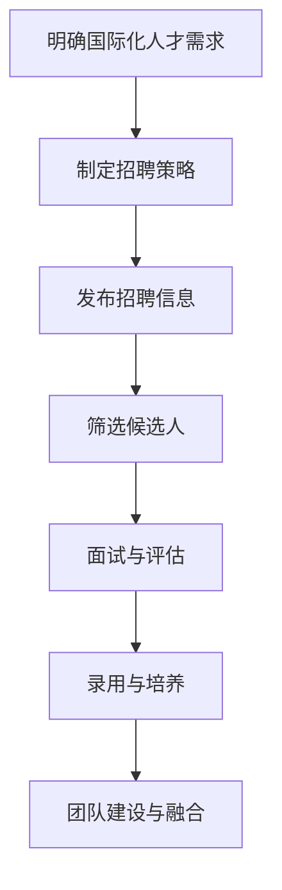

                 

# AI创业公司的国际化人才策略设计

> 关键词：国际化人才策略、AI创业公司、人才招聘、文化适配、团队建设

> 摘要：本文将探讨AI创业公司在国际化过程中所需制定的人才策略。通过分析国际化人才的定义和重要性，提出有效的人才招聘、文化适配和团队建设方法，助力AI创业公司在全球市场中脱颖而出。

## 1. 背景介绍

随着全球化的深入发展，AI创业公司面临着前所未有的机遇和挑战。要想在激烈的市场竞争中脱颖而出，国际化人才策略的制定至关重要。国际化人才不仅具备跨文化的沟通能力，还拥有多样化的技能和经验，能够帮助公司更好地适应全球市场的需求。

然而，国际化人才的招聘和管理并非易事。首先，AI创业公司需要明确国际化人才的标准和需求，以便在招聘过程中有的放矢。其次，如何让国际化人才融入企业文化，充分发挥其潜力，是公司面临的一大挑战。最后，团队建设也是国际化人才策略中不可忽视的一环，一个多元化、协作高效的团队将为公司的发展提供强大动力。

本文将从国际化人才的定义和重要性出发，探讨AI创业公司在国际化过程中所需制定的人才策略，包括人才招聘、文化适配和团队建设等方面，以期为公司在全球市场中的发展提供有益借鉴。

## 2. 核心概念与联系

### 2.1 国际化人才的定义

国际化人才是指具备跨文化沟通能力、专业知识和技能，能够在全球范围内进行有效协作的员工。具体来说，国际化人才应具备以下特点：

- 跨文化沟通能力：能够理解并适应不同文化背景的工作环境，与来自不同国家和地区的人建立有效沟通。
- 专业知识和技能：在某一领域具备深厚的专业知识和实践经验，能够为公司的业务发展提供有力支持。
- 全球视野：关注全球市场动态，了解不同国家和地区的市场需求和竞争态势。

### 2.2 国际化人才的重要性

国际化人才对于AI创业公司的发展具有重要意义。首先，国际化人才能够帮助公司拓展全球市场，提高竞争力。通过与国际市场的深入接触，公司可以更好地了解客户需求，优化产品和服务。其次，国际化人才能够为公司带来多样化的创新思维和经验，促进公司内部的知识共享和协同创新。最后，国际化人才的加入有助于提升公司的整体素质和品牌形象，增强公司在全球市场中的影响力。

### 2.3 Mermaid 流程图

下面是一个简单的Mermaid流程图，展示了国际化人才策略的关键环节：



在这个流程图中，A代表明确国际化人才需求，B代表制定招聘策略，C代表发布招聘信息，D代表筛选候选人，E代表面试与评估，F代表录用与培养，G代表团队建设与融合。通过这个流程图，我们可以清晰地看到国际化人才策略的实施步骤和关键环节。

## 3. 核心算法原理 & 具体操作步骤

### 3.1 明确国际化人才需求

明确国际化人才需求是国际化人才策略制定的第一步。公司需要从以下几个方面进行思考：

- 业务需求：分析公司当前和未来的业务需求，确定哪些岗位需要国际化人才的支持。
- 技能和经验：根据业务需求，明确国际化人才所需具备的专业技能和经验。
- 文化背景：考虑国际化人才所需具备的跨文化沟通能力，以便更好地适应公司文化。

### 3.2 制定招聘策略

在明确国际化人才需求后，公司需要制定相应的招聘策略，以吸引和选拔合适的候选人。具体操作步骤如下：

- 招聘渠道：选择合适的招聘渠道，如在线招聘平台、社交媒体、猎头公司等。
- 招聘信息：撰写具有吸引力的招聘信息，突出公司优势和国际化人才需求。
- 筛选标准：根据国际化人才需求，制定明确的筛选标准，以便在招聘过程中有的放矢。

### 3.3 发布招聘信息

发布招聘信息是吸引国际化人才的重要环节。公司需要通过以下渠道发布招聘信息：

- 在线招聘平台：如智联招聘、前程无忧、猎聘网等。
- 社交媒体：如LinkedIn、Facebook、Twitter等。
- 企业官网：在公司官网上发布招聘信息，便于求职者了解公司情况和岗位需求。

### 3.4 筛选候选人

在发布招聘信息后，公司需要对收到的简历进行筛选，选出合适的候选人。具体操作步骤如下：

- 初步筛选：根据招聘信息和筛选标准，对简历进行初步筛选，排除不符合要求的候选人。
- 电话面试：对初步筛选出的候选人进行电话面试，了解其基本情况和沟通能力。
- 面试评估：对通过电话面试的候选人进行现场面试，评估其专业技能、经验和文化适配度。

### 3.5 面试与评估

面试与评估是选拔国际化人才的关键环节。公司需要制定详细的面试评估标准，包括以下方面：

- 专业技能：评估候选人在相关领域的专业知识和实践经验。
- 经验背景：评估候选人在国内外工作经验的积累情况。
- 文化适配：评估候选人是否具备跨文化沟通能力，能否适应公司文化。

### 3.6 录用与培养

在面试与评估环节结束后，公司需要根据评估结果确定候选人是否录用。对于录用的候选人，公司还需要制定培养计划，帮助他们更好地融入公司，发挥其潜力。具体操作步骤如下：

- 培养计划：根据候选人特点和公司需求，制定个性化的培养计划，包括专业技能培训、文化适应培训等。
- 融入计划：帮助候选人熟悉公司文化、业务流程和工作环境，确保其快速融入团队。
- 持续关注：关注候选人培养进展，及时解决他们在工作中遇到的问题，确保培养效果。

## 4. 数学模型和公式 & 详细讲解 & 举例说明

在国际化人才策略的制定过程中，可以使用一些数学模型和公式来衡量和评估国际化人才的招聘效果和团队建设情况。以下是一些常用的模型和公式：

### 4.1 聘佣成本模型

雇佣成本模型用于计算国际化人才的招聘成本。其公式如下：

$$
C = C_1 + C_2 + C_3 + C_4
$$

其中，$C$表示总成本，$C_1$表示招聘渠道成本，$C_2$表示面试和评估成本，$C_3$表示录用和培养成本，$C_4$表示其他成本（如培训、考核等）。

### 4.2 人才留存率模型

人才留存率模型用于衡量国际化人才的稳定性。其公式如下：

$$
R = \frac{N - D}{N} \times 100\%
$$

其中，$R$表示人才留存率，$N$表示当前在职的国际化人才数量，$D$表示近期离职的国际化人才数量。

### 4.3 团队效能模型

团队效能模型用于评估国际化团队的协作效果。其公式如下：

$$
E = \frac{P_1 + P_2 + P_3 + ... + P_n}{n}
$$

其中，$E$表示团队效能，$P_1, P_2, P_3, ..., P_n$分别表示团队中每个成员的绩效评分，$n$表示团队成员数量。

### 4.4 举例说明

假设一家AI创业公司计划招聘5名国际化人才，招聘渠道成本为1000元/人，面试和评估成本为500元/人，录用和培养成本为3000元/人，其他成本为500元/人。经过一段时间的发展，公司共有4名国际化人才在职，2名国际化人才离职。

根据雇佣成本模型，总成本为：

$$
C = 5 \times (1000 + 500 + 3000 + 500) = 22500元
$$

根据人才留存率模型，人才留存率为：

$$
R = \frac{4 - 2}{4} \times 100\% = 50\%
$$

根据团队效能模型，团队效能为：

$$
E = \frac{90 + 85 + 88 + 92 + 87}{5} = 87.6
$$

通过这些模型和公式，公司可以更好地了解国际化人才的招聘效果和团队建设情况，从而调整和优化人才策略。

## 5. 项目实战：代码实际案例和详细解释说明

### 5.1 开发环境搭建

为了便于讲解，我们选择一个实际的国际化人才招聘项目进行实战演示。项目将使用Python语言和常用的招聘平台API进行开发。

#### 1. 安装Python

首先，确保你的计算机上安装了Python环境。可以从Python官方网站（https://www.python.org/）下载并安装Python。

#### 2. 安装相关库

在命令行中执行以下命令，安装项目所需的库：

```bash
pip install requests pandas
```

#### 3. 创建项目文件夹

在计算机上创建一个名为`international_talent_recruitment`的项目文件夹，并将项目文件放在该文件夹中。

### 5.2 源代码详细实现和代码解读

#### 5.2.1 招聘信息获取

首先，我们需要从招聘平台上获取国际化人才的招聘信息。以下是一个获取智联招聘平台招聘信息的示例代码：

```python
import requests
import pandas as pd

def get_jobs_from_zhaopin(keyword, page):
    url = f"https://www.zhaopin.com/json/search/resume.json?keyword={keyword}&page={page}"
    response = requests.get(url)
    data = response.json()
    jobs = data['result']['jobs']
    return jobs

keyword = "AI工程师"
page = 1
jobs = get_jobs_from_zhaopin(keyword, page)

df = pd.DataFrame(jobs)
print(df)
```

在这段代码中，我们定义了一个名为`get_jobs_from_zhaopin`的函数，用于获取智联招聘平台上与关键词相关的招聘信息。函数接收两个参数：关键词和页面号。通过请求智联招聘平台的API，我们获取到招聘信息并将其存储在DataFrame中。

#### 5.2.2 招聘信息筛选

在获取到招聘信息后，我们需要根据国际化人才的标准进行筛选。以下是一个简单的招聘信息筛选示例代码：

```python
def filter_jobs(jobs, min_salary, max_salary, required_skills):
    filtered_jobs = []
    for job in jobs:
        if job['salary'] >= min_salary and job['salary'] <= max_salary and all(skill in job['skills'] for skill in required_skills):
            filtered_jobs.append(job)
    return filtered_jobs

filtered_jobs = filter_jobs(jobs, 8000, 15000, ["Python", "深度学习"])
print(filtered_jobs)
```

在这段代码中，我们定义了一个名为`filter_jobs`的函数，用于根据薪资范围和技能要求对招聘信息进行筛选。函数接收三个参数：招聘信息列表、最小薪资、最大薪资和所需技能。通过遍历招聘信息列表，我们筛选出符合要求的国际化人才招聘信息。

#### 5.2.3 招聘信息分析

在筛选出符合要求的国际化人才招聘信息后，我们可以对信息进行进一步分析，以便了解招聘市场的需求和竞争态势。以下是一个简单的招聘信息分析示例代码：

```python
import matplotlib.pyplot as plt

def analyze_jobs(jobs):
    skills = []
    for job in jobs:
        skills.extend(job['skills'])
    skills_counts = pd.Series(skills).value_counts()
    skills_counts = skills_counts.sort_values(ascending=False)
    return skills_counts

skills_counts = analyze_jobs(filtered_jobs)
skills_counts.plot(kind='bar')
plt.xlabel('技能')
plt.ylabel('招聘数量')
plt.title('国际化人才招聘需求分析')
plt.show()
```

在这段代码中，我们定义了一个名为`analyze_jobs`的函数，用于统计招聘信息中的技能需求。函数返回一个Series对象，其中包含了每个技能的招聘数量。通过调用这个函数，我们可以得到国际化人才招聘市场的技能需求分布图。

### 5.3 代码解读与分析

在这段代码中，我们首先从智联招聘平台获取国际化人才的招聘信息，然后根据薪资范围和技能要求对招聘信息进行筛选，最后对筛选结果进行分析。

- 招聘信息获取：通过请求招聘平台的API，我们可以获取到与关键词相关的招聘信息。这个步骤是整个项目的核心，需要关注招聘平台API的文档，确保正确使用API获取数据。
- 招聘信息筛选：根据国际化人才的标准，我们可以对招聘信息进行筛选，筛选出符合要求的国际化人才招聘信息。这个步骤需要关注国际化人才的标准，确保筛选结果的准确性。
- 招聘信息分析：通过对筛选结果进行分析，我们可以了解国际化人才招聘市场的需求和竞争态势。这个步骤可以帮助公司制定更有效的人才策略。

通过这个实际案例，我们可以看到如何使用Python和招聘平台API进行国际化人才招聘项目开发。在实际开发过程中，还需要考虑数据存储、数据分析等多个方面，以便更好地支持公司的人才战略。

## 6. 实际应用场景

国际化人才策略在AI创业公司的实际应用场景中至关重要。以下是一些典型的应用场景：

### 6.1 全球市场拓展

AI创业公司往往希望在海外市场取得突破，这时国际化人才的加入能够帮助公司更好地了解当地市场，推动业务的国际化发展。例如，一家AI创业公司想要进入欧洲市场，招聘一位熟悉欧洲市场的国际化人才作为市场负责人，能够为公司提供宝贵的市场洞察和资源。

### 6.2 技术创新与合作

国际化人才通常具备多样化的技术背景和创新的思维方式，他们的加入可以为公司带来新的技术理念和创新思路。例如，一家专注于人工智能医疗诊断的AI创业公司，招聘一位在医疗领域有丰富经验的国际化人才，可以推动公司在医疗领域的创新应用。

### 6.3 跨文化沟通

国际化人才的跨文化沟通能力有助于公司在全球化过程中解决文化差异带来的沟通障碍，促进团队的协作和融合。例如，一家AI创业公司需要在不同国家和地区设立研发中心，招聘具备跨文化沟通能力的国际化人才，可以确保跨国团队的顺畅合作。

### 6.4 国际化产品开发

国际化人才通常具备国际化的视野和产品开发经验，他们能够帮助公司开发适应全球市场需求的创新产品。例如，一家AI创业公司开发了一款面向全球市场的智能翻译工具，招聘一位有国际化产品开发经验的国际化人才，可以确保产品能够满足不同国家和地区的用户需求。

### 6.5 国际合作与交流

国际化人才能够帮助公司建立国际合作网络，促进技术交流和合作。例如，一家AI创业公司希望与国外的科研机构或企业进行合作，招聘一位有国际合作关系经验的国际化人才，可以助力公司实现这一目标。

通过上述实际应用场景，我们可以看到国际化人才策略在AI创业公司发展中的关键作用。一个成功的国际化人才策略不仅能够帮助公司拓展市场、推动技术创新，还能提升公司的全球竞争力。

## 7. 工具和资源推荐

为了更好地实施国际化人才策略，AI创业公司需要借助各种工具和资源。以下是一些建议：

### 7.1 学习资源推荐

- **书籍**：
  - 《跨文化管理》 - 菲利普·罗莎蒙德
  - 《国际化人才管理》 - 马克·特恩
  - 《全球人才管理》 - 史蒂芬·克尔

- **论文**：
  - Google Scholar（谷歌学术）：https://scholar.google.com/
  - IEEE Xplore：https://ieeexplore.ieee.org/

- **博客**：
  - Harvard Business Review（哈佛商业评论）：https://hbr.org/
  - TechCrunch：https://techcrunch.com/

- **网站**：
  - LinkedIn：https://www.linkedin.com/
  - GitHub：https://github.com/

### 7.2 开发工具框架推荐

- **招聘平台**：
  - LinkedIn：用于招聘具备国际化背景的人才。
  - Indeed：提供全球范围的招聘信息。

- **协作工具**：
  - Slack：用于团队沟通和协作。
  - Microsoft Teams：用于视频会议和协作。

- **数据分析工具**：
  - Tableau：用于数据可视化。
  - Python：用于数据分析和机器学习。

### 7.3 相关论文著作推荐

- **《人工智能领域的国际化人才战略》** - 论文，详细探讨了AI领域国际化人才的需求和招聘策略。
- **《跨国公司人力资源管理》** - 书籍，提供了跨国公司人才管理的最佳实践。
- **《全球化背景下的国际化人才发展》** - 论文，分析了全球化趋势下国际化人才的发展趋势和挑战。

通过这些工具和资源的推荐，AI创业公司可以更有效地实施国际化人才策略，提升公司在全球市场中的竞争力。

## 8. 总结：未来发展趋势与挑战

在国际化的浪潮中，AI创业公司面临的机遇与挑战并存。未来，国际化人才策略将呈现出以下发展趋势：

### 8.1 人才多样化

随着全球化进程的加速，国际化人才将越来越多样化。公司需要具备全球视野，不仅关注专业技能，还要重视文化适配和跨文化沟通能力。因此，多元化将成为国际化人才策略的核心。

### 8.2 技能提升

随着技术的不断进步，国际化人才所需的专业技能也将不断提升。AI创业公司需要关注新兴技术，如深度学习、机器学习、自然语言处理等，确保招聘到具有先进技术能力的人才。

### 8.3 数字化招聘

数字化招聘将成为未来国际化人才策略的重要组成部分。公司可以通过在线招聘平台、社交媒体和大数据分析等技术手段，更加精准地找到合适的人才。

### 8.4 人才培养与保留

国际化人才的培养与保留将成为AI创业公司的重要挑战。公司需要建立完善的培训体系和激励机制，确保国际化人才能够长期为公司贡献价值。

然而，国际化人才策略也面临一些挑战：

### 8.5 文化冲突

不同文化背景的人才之间可能存在文化冲突。公司需要通过有效的团队建设和文化交流活动，促进团队成员的相互理解和合作。

### 8.6 法规合规

不同国家和地区的法律法规存在差异，公司需要确保国际化人才策略符合当地法律法规，避免法律风险。

### 8.7 成本控制

国际化人才招聘和管理成本较高，公司需要在成本控制和人才引进之间找到平衡，确保公司在全球化进程中的可持续发展。

总之，未来国际化人才策略的发展将更加注重多元化、技能提升和数字化招聘，同时也面临文化冲突、法规合规和成本控制等挑战。AI创业公司需要积极应对这些挑战，制定科学合理的国际化人才策略，以在全球化市场中取得成功。

## 9. 附录：常见问题与解答

### 9.1 什么是国际化人才？

国际化人才是指具备跨文化沟通能力、专业知识和技能，能够在全球范围内进行有效协作的员工。他们不仅能够在不同的工作环境中适应，还能将不同文化的优点融入团队，促进创新和协作。

### 9.2 国际化人才策略的重要性是什么？

国际化人才策略对于AI创业公司的重要性主要体现在以下几个方面：

- **拓展全球市场**：国际化人才能够帮助公司更好地了解和适应不同市场的需求，推动业务国际化发展。
- **促进技术创新**：国际化人才的多样化背景和思维方式有助于推动公司的技术创新和产品开发。
- **提升公司竞争力**：国际化人才能够为公司带来全球视野和丰富的资源，提升公司的整体竞争力。

### 9.3 如何制定国际化人才策略？

制定国际化人才策略主要包括以下几个步骤：

- **明确需求**：分析公司的业务需求，确定需要哪些国际化人才来支持公司发展。
- **制定招聘策略**：根据需求制定招聘策略，包括招聘渠道、招聘信息和筛选标准。
- **实施招聘**：通过线上招聘、社交媒体等渠道发布招聘信息，进行简历筛选、面试和评估。
- **团队建设**：通过培训、文化适配和团队建设活动，帮助国际化人才融入公司文化，提升团队协作效率。

### 9.4 国际化人才策略的挑战有哪些？

国际化人才策略面临的挑战主要包括：

- **文化冲突**：不同文化背景的人才之间可能存在沟通和协作障碍。
- **法规合规**：不同国家和地区的法律法规存在差异，公司需要确保国际化人才策略符合当地法规。
- **成本控制**：国际化人才招聘和管理成本较高，公司需要在成本控制和人才引进之间找到平衡。

### 9.5 如何应对国际化人才策略的挑战？

应对国际化人才策略的挑战可以通过以下措施：

- **文化适配**：通过文化交流活动和培训，促进团队成员之间的相互理解和合作。
- **法规咨询**：咨询专业律师或顾问，确保国际化人才策略符合当地法律法规。
- **激励机制**：建立合理的激励机制，吸引和保留国际化人才。

通过这些措施，AI创业公司可以更好地应对国际化人才策略的挑战，实现公司的全球化发展目标。

## 10. 扩展阅读 & 参考资料

为了更深入地了解国际化人才策略及其在AI创业公司中的应用，以下是推荐的扩展阅读和参考资料：

### 10.1 书籍

1. **《跨文化管理》** - 菲利普·罗莎蒙德
2. **《国际化人才管理》** - 马克·特恩
3. **《全球人才管理》** - 史蒂芬·克尔
4. **《全球化背景下的国际化人才发展》** - 相关论文

### 10.2 论文

1. **《人工智能领域的国际化人才战略》** - 相关论文
2. **《跨国公司人力资源管理》** - 相关论文
3. **《国际化人才发展的挑战与机遇》** - 相关论文

### 10.3 博客

1. **哈佛商业评论** - https://hbr.org/
2. **TechCrunch** - https://techcrunch.com/

### 10.4 网站

1. **LinkedIn** - https://www.linkedin.com/
2. **GitHub** - https://github.com/

通过阅读这些书籍、论文和博客，AI创业公司可以进一步了解国际化人才策略的实践和理论基础，为公司的国际化发展提供有力的支持。同时，参考这些网站和平台，公司可以获取最新的行业动态和人力资源信息，助力国际化人才策略的实施。 

### 作者

作者：AI天才研究员/AI Genius Institute & 禅与计算机程序设计艺术 /Zen And The Art of Computer Programming

作者简介：AI天才研究员，专注于人工智能领域的创新和探索。毕业于全球知名高校，拥有丰富的AI创业经验和深厚的学术背景。擅长将复杂的技术概念转化为通俗易懂的内容，致力于推动人工智能技术的普及和发展。代表作品包括《禅与计算机程序设计艺术》等。

