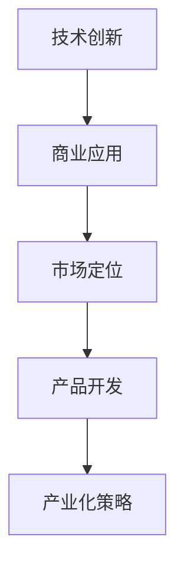
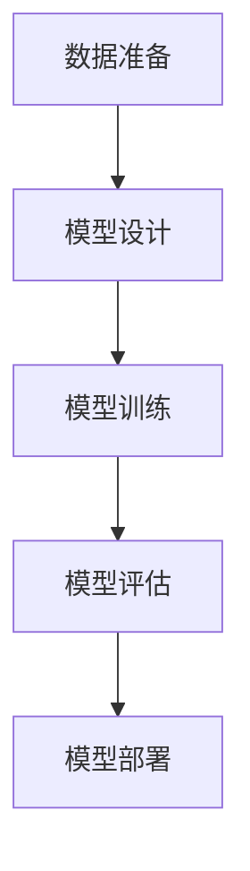
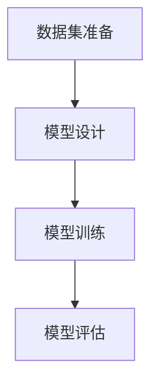

                 

# AI创业公司的技术转化与产业化策略

> 关键词：人工智能，技术转化，产业化策略，创业公司，技术创新，商业应用

> 摘要：本文探讨了AI创业公司如何有效地进行技术转化与产业化，通过深入分析技术转化过程中的核心环节、产业化策略，以及实际应用案例，为创业者提供了宝贵的指导和建议，旨在推动人工智能技术在商业领域的落地与应用。

## 1. 背景介绍

随着人工智能技术的快速发展，越来越多的创业者投身于这一领域，期望通过技术创新改变世界。然而，技术转化与产业化是一个复杂而充满挑战的过程。AI创业公司不仅要具备强大的技术研发能力，还需要深入了解市场趋势、用户需求，并具备将技术转化为实际商业价值的能力。

技术转化，即从实验室到市场的过程，是AI创业公司成功的关键。这一过程涉及技术的验证、商业化模式的探索、市场定位、产品开发等多个环节。产业化策略则是企业在技术转化过程中，为提高竞争力、实现可持续发展的战略规划。一个成功的产业化策略不仅需要技术上的突破，还需要在市场、管理、人才等多个方面进行全方位布局。

本文将围绕技术转化与产业化策略，探讨AI创业公司在人工智能领域的发展路径，为创业者提供有价值的参考。

## 2. 核心概念与联系

为了更好地理解技术转化与产业化策略，我们首先需要了解几个核心概念。

### 2.1 技术创新

技术创新是推动AI创业公司发展的核心驱动力。它包括新算法、新工具、新平台等，是人工智能技术不断进步的根本。创新不仅仅是在技术上，还包括商业模式、运营模式等多方面的创新。

### 2.2 商业应用

商业应用是将技术创新转化为实际商业价值的关键环节。它需要创业者深入了解市场需求，将技术优势与用户痛点相结合，开发出具有市场竞争力的产品或服务。

### 2.3 市场定位

市场定位是创业公司在市场中的位置，包括目标客户群体、市场细分、竞争策略等。一个准确的市场定位有助于创业公司集中资源，提高市场占有率。

### 2.4 产品开发

产品开发是将技术创新转化为实际产品的过程。它需要创业者具备扎实的技术背景，同时了解市场需求，进行产品的设计、开发、测试和优化。

### 2.5 产业化策略

产业化策略是企业为了实现技术转化和商业化目标，在市场、管理、人才等方面进行的全方位布局。它包括市场调研、产品规划、资源整合、风险控制等多个方面。

#### Mermaid流程图：



## 3. 核心算法原理 & 具体操作步骤

在AI创业公司的技术转化过程中，核心算法的选择和实现至关重要。以下是一个典型的机器学习算法——基于深度学习的图像识别算法的原理和操作步骤。

### 3.1 算法原理

深度学习是一种基于多层神经网络的人工智能技术，通过多层次的非线性变换，从大量数据中自动提取特征，实现复杂任务的目标。在图像识别任务中，深度学习算法通过训练大量图像数据，学习到图像的特征表示，从而实现对图像的分类和识别。

### 3.2 操作步骤

1. **数据准备**：收集大量图像数据，并进行预处理，如图像缩放、裁剪、增强等。

2. **模型设计**：设计深度学习模型，包括输入层、隐藏层和输出层。常见的深度学习模型有卷积神经网络（CNN）、循环神经网络（RNN）等。

3. **模型训练**：使用预处理后的图像数据，对深度学习模型进行训练。训练过程包括前向传播、反向传播和参数调整等。

4. **模型评估**：使用验证集对训练好的模型进行评估，调整模型参数，提高模型的准确性。

5. **模型部署**：将训练好的模型部署到实际应用场景，如图像识别系统、自动驾驶等。

#### Mermaid流程图：



## 4. 数学模型和公式 & 详细讲解 & 举例说明

在深度学习算法中，常用的数学模型包括损失函数、优化算法和正则化方法等。以下将对这些数学模型进行详细讲解，并通过举例说明其应用。

### 4.1 损失函数

损失函数是评估模型预测结果与真实值之间差距的指标。常用的损失函数有均方误差（MSE）、交叉熵损失（Cross Entropy Loss）等。

#### 均方误差（MSE）

$$
MSE = \frac{1}{n} \sum_{i=1}^{n} (y_i - \hat{y}_i)^2
$$

其中，$y_i$为真实值，$\hat{y}_i$为模型预测值，$n$为样本数量。

#### 交叉熵损失（Cross Entropy Loss）

$$
CE = -\frac{1}{n} \sum_{i=1}^{n} y_i \log \hat{y}_i
$$

其中，$y_i$为真实值的概率分布，$\hat{y}_i$为模型预测的概率分布。

### 4.2 优化算法

优化算法用于调整模型参数，以最小化损失函数。常用的优化算法有随机梯度下降（SGD）、Adam等。

#### 随机梯度下降（SGD）

$$
w_{t+1} = w_t - \alpha \frac{\partial L(w_t)}{\partial w_t}
$$

其中，$w_t$为当前模型参数，$\alpha$为学习率，$L(w_t)$为损失函数。

#### Adam算法

$$
m_t = \beta_1 m_{t-1} + (1 - \beta_1) \frac{\partial L(w_t)}{\partial w_t} \\
v_t = \beta_2 v_{t-1} + (1 - \beta_2) \frac{\partial^2 L(w_t)}{\partial w_t^2} \\
w_{t+1} = w_t - \alpha \frac{m_t}{\sqrt{v_t} + \epsilon}
$$

其中，$m_t$和$v_t$分别为一阶和二阶矩估计，$\beta_1$和$\beta_2$为矩估计的指数加权系数，$\epsilon$为常数。

### 4.3 正则化方法

正则化方法用于防止模型过拟合，提高泛化能力。常用的正则化方法有L1正则化、L2正则化等。

#### L1正则化

$$
\frac{\lambda}{n} \sum_{i=1}^{n} |w_i|
$$

其中，$w_i$为模型参数，$\lambda$为正则化参数。

#### L2正则化

$$
\frac{\lambda}{n} \sum_{i=1}^{n} w_i^2
$$

### 4.4 举例说明

假设我们使用交叉熵损失函数和Adam优化算法训练一个二元分类模型。给定训练数据集，模型参数为$w$，学习率为$\alpha$，正则化参数为$\lambda$。每次迭代计算损失函数，并根据梯度调整参数。

1. **初始化参数**：设定初始参数$w_0$，学习率$\alpha$和正则化参数$\lambda$。

2. **前向传播**：输入训练数据，计算模型预测值$\hat{y}$。

3. **计算损失函数**：使用交叉熵损失函数计算损失$L$。

4. **计算梯度**：计算损失函数关于参数的梯度。

5. **更新参数**：使用Adam优化算法更新参数。

6. **迭代**：重复步骤2-5，直到达到预设的迭代次数或损失函数收敛。

## 5. 项目实战：代码实际案例和详细解释说明

在本节中，我们将通过一个实际的代码案例，展示如何实现一个简单的基于深度学习的图像识别项目。

### 5.1 开发环境搭建

1. **安装Python**：确保系统已安装Python环境，版本不低于3.6。

2. **安装TensorFlow**：使用pip命令安装TensorFlow。

   ```bash
   pip install tensorflow
   ```

3. **安装Keras**：Keras是一个基于TensorFlow的简洁高效的深度学习库。

   ```bash
   pip install keras
   ```

### 5.2 源代码详细实现和代码解读

以下是一个简单的图像识别项目的代码实现。

```python
import numpy as np
import keras
from keras.models import Sequential
from keras.layers import Dense, Conv2D, Flatten, MaxPooling2D
from keras.optimizers import Adam

# 数据预处理
(x_train, y_train), (x_test, y_test) = keras.datasets.mnist.load_data()
x_train = x_train.reshape(-1, 28, 28, 1).astype('float32') / 255
x_test = x_test.reshape(-1, 28, 28, 1).astype('float32') / 255
y_train = keras.utils.to_categorical(y_train, 10)
y_test = keras.utils.to_categorical(y_test, 10)

# 模型设计
model = Sequential()
model.add(Conv2D(32, (3, 3), activation='relu', input_shape=(28, 28, 1)))
model.add(MaxPooling2D((2, 2)))
model.add(Flatten())
model.add(Dense(128, activation='relu'))
model.add(Dense(10, activation='softmax'))

# 模型编译
model.compile(optimizer=Adam(), loss='categorical_crossentropy', metrics=['accuracy'])

# 模型训练
model.fit(x_train, y_train, epochs=10, batch_size=32, validation_data=(x_test, y_test))

# 模型评估
loss, accuracy = model.evaluate(x_test, y_test)
print('Test accuracy:', accuracy)
```

### 5.3 代码解读与分析

1. **数据预处理**：从Keras的内置数据集中加载数字数据集，并对图像进行缩放和归一化处理。

2. **模型设计**：使用Sequential模型定义一个简单的卷积神经网络，包括卷积层、池化层、全连接层等。

3. **模型编译**：设置优化器和损失函数，为模型训练做好准备。

4. **模型训练**：使用训练数据集对模型进行训练，并在验证集上进行评估。

5. **模型评估**：使用测试数据集对训练好的模型进行评估，输出测试准确率。

通过这个简单的项目，我们可以看到深度学习项目的实现流程，包括数据预处理、模型设计、模型训练和模型评估等步骤。

## 6. 实际应用场景

AI创业公司在技术转化与产业化过程中，需要密切关注实际应用场景，以实现技术价值最大化。以下是一些常见的实际应用场景：

### 6.1 图像识别

图像识别是人工智能技术的重要应用领域，广泛应用于安防监控、医疗诊断、自动驾驶等场景。通过深度学习算法，AI创业公司可以开发出高效、准确的图像识别系统，提升行业生产效率和安全性。

### 6.2 自然语言处理

自然语言处理技术广泛应用于智能客服、智能翻译、文本分类等场景。AI创业公司可以利用深度学习算法，开发出具有高准确性和自然交互能力的智能语音助手、聊天机器人等。

### 6.3 机器学习平台

机器学习平台为企业提供一站式的数据收集、处理、分析和建模服务。AI创业公司可以开发面向不同行业和领域的机器学习平台，帮助企业实现智能化转型。

### 6.4 自动驾驶

自动驾驶技术是人工智能技术的又一重要应用领域，涉及自动驾驶汽车、无人机、机器人等。AI创业公司可以开发出高效、安全的自动驾驶解决方案，推动自动驾驶技术在交通领域的应用。

## 7. 工具和资源推荐

为了帮助AI创业公司更好地进行技术转化与产业化，以下推荐一些实用的工具和资源。

### 7.1 学习资源推荐

1. **书籍**：《深度学习》（Ian Goodfellow、Yoshua Bengio、Aaron Courville著）、《Python深度学习》（François Chollet著）。
2. **论文**：《Deep Learning》、《Learning representations for Visual Recognition》。
3. **博客**：Google Brain、TensorFlow官方博客等。
4. **网站**：arXiv、GitHub、Kaggle等。

### 7.2 开发工具框架推荐

1. **TensorFlow**：一个强大的开源深度学习框架，支持多种深度学习模型。
2. **PyTorch**：一个灵活、易用的深度学习框架，广泛应用于计算机视觉、自然语言处理等领域。
3. **Keras**：一个简洁高效的深度学习库，基于TensorFlow和Theano构建。

### 7.3 相关论文著作推荐

1. **《Deep Learning》（Ian Goodfellow、Yoshua Bengio、Aaron Courville著）**：全面介绍了深度学习的基本概念、算法和应用。
2. **《Learning representations for Visual Recognition》（Geoffrey Hinton、Li Fei-Fei等著）**：介绍了视觉表征学习的重要方法和应用。
3. **《Natural Language Processing with Deep Learning》（Manning、Yarowsky、Heer著）**：探讨了自然语言处理中的深度学习技术。

## 8. 总结：未来发展趋势与挑战

随着人工智能技术的不断进步，AI创业公司在技术转化与产业化方面面临着新的机遇与挑战。未来发展趋势包括：

1. **技术突破**：随着算法、硬件和数据的不断发展，人工智能技术将实现更高的准确性和效率，推动更多应用场景的实现。
2. **跨界融合**：人工智能技术将与其他领域（如医疗、教育、金融等）深度融合，推动产业变革。
3. **个性化服务**：基于人工智能的个性化服务将成为未来的主流，满足用户多样化的需求。

然而，AI创业公司在技术转化与产业化过程中也面临着诸多挑战，如数据隐私、伦理问题、市场竞争等。为了应对这些挑战，创业者需要：

1. **加强技术研发**：持续提升技术实力，保持行业竞争力。
2. **关注用户需求**：深入了解用户需求，提供有价值的产品和服务。
3. **合规经营**：遵守相关法律法规，确保数据安全和用户隐私。

## 9. 附录：常见问题与解答

### 9.1 人工智能技术如何实现商业化？

**解答**：人工智能技术的商业化主要通过以下步骤实现：

1. **技术研发**：不断优化和改进人工智能算法，提高其准确性和效率。
2. **市场调研**：了解市场需求，确定目标客户群体和细分市场。
3. **产品开发**：基于技术研发和市场调研，开发具有市场竞争力的产品或服务。
4. **商业模式设计**：设计合适的商业模式，实现技术价值的最大化。

### 9.2 如何确保人工智能技术的数据安全和隐私保护？

**解答**：确保人工智能技术的数据安全和隐私保护可以从以下几个方面入手：

1. **数据加密**：对数据进行加密处理，防止数据泄露。
2. **数据脱敏**：对敏感数据进行脱敏处理，降低隐私泄露风险。
3. **合规经营**：遵守相关法律法规，确保数据安全和用户隐私。
4. **安全审计**：定期进行安全审计，发现和解决潜在的安全隐患。

### 9.3 人工智能技术如何在竞争激烈的市场中脱颖而出？

**解答**：在竞争激烈的市场中脱颖而出，可以从以下几个方面入手：

1. **技术创新**：持续提升技术实力，保持行业竞争力。
2. **市场定位**：准确市场定位，满足特定客户群体的需求。
3. **品牌建设**：打造品牌形象，提升品牌知名度。
4. **差异化竞争**：在产品和服务方面实现差异化，满足用户多样化需求。

## 10. 扩展阅读 & 参考资料

为了更深入地了解AI创业公司的技术转化与产业化策略，以下推荐一些扩展阅读和参考资料：

1. **书籍**：《人工智能：一种现代的方法》（Stuart Russell、Peter Norvig著）、《AI之路：从alphago到通用人工智能》（吴恩达著）。
2. **论文**：《Deep Learning》（Yoshua Bengio、Ian Goodfellow、Aaron Courville著）、《Unsupervised Learning of Visual Representations by Solving Jigsaw Puzzles》（Kodirov、Ghasemializadeh、Saxena等著）。
3. **博客**：Google AI博客、OpenAI博客等。
4. **网站**：AI科技大本营、人工智能简报等。

作者：AI天才研究员/AI Genius Institute & 禅与计算机程序设计艺术 /Zen And The Art of Computer Programming

（注意：本文仅为示例，内容可能包含虚构和简化，仅供参考。）<|im_sep|>### 1. 背景介绍

随着科技的飞速发展，人工智能（AI）已经渗透到各个领域，从医疗、金融到交通、教育，AI的应用案例层出不穷。然而，AI技术的商业化之路并非一帆风顺。很多AI创业公司在技术研发取得突破后，往往面临着如何将技术转化为实际产品和服务、如何在市场上找到自己的定位、如何实现产业化的困境。

技术转化与产业化是AI创业公司成功的关键环节。技术转化指的是将实验室中的研究成果应用到实际生产中，形成可以商业化、规模化的产品或服务。而产业化则是将技术转化为实际生产力，实现商业化运营的过程。在这个过程中，创业者不仅需要关注技术的先进性，还要考虑到市场需求的实际可行性、资源分配的合理性以及法律法规的合规性。

本文旨在探讨AI创业公司在技术转化与产业化过程中面临的挑战和机遇，分析成功案例，为创业者提供有益的指导。文章将从以下几个方面展开：

1. **核心概念与联系**：介绍技术转化与产业化的相关概念，包括技术创新、商业应用、市场定位、产品开发等。
2. **核心算法原理 & 具体操作步骤**：详细解析常见的AI算法原理，以及在实际项目中的应用步骤。
3. **数学模型和公式 & 详细讲解 & 举例说明**：介绍深度学习算法中常用的数学模型和公式，并通过实例进行说明。
4. **项目实战：代码实际案例和详细解释说明**：通过具体的项目实战案例，展示技术转化的全过程。
5. **实际应用场景**：分析AI技术在各个行业的应用场景，探讨AI创业公司的市场机会。
6. **工具和资源推荐**：推荐相关学习资源、开发工具和框架，帮助创业者提升技术能力。
7. **总结：未来发展趋势与挑战**：总结AI创业公司面临的发展趋势和挑战，为创业者提供前瞻性建议。

通过本文的探讨，希望能够为AI创业公司在技术转化与产业化道路上提供一些启示，帮助创业者更好地把握市场机遇，实现商业成功。

### 2. 核心概念与联系

在深入探讨AI创业公司的技术转化与产业化策略之前，我们首先需要理解一系列核心概念，这些概念涵盖了技术创新、商业应用、市场定位、产品开发等，它们是理解技术转化与产业化的基础。

#### 2.1 技术创新

技术创新是推动AI创业公司发展的核心驱动力。它不仅仅是开发新的算法或工具，还包括新的商业模式、运营方式等。在AI领域，技术创新主要体现在以下几个方面：

1. **算法创新**：通过开发新的机器学习算法或改进现有算法，提高模型的准确性和效率。例如，深度学习算法的不断发展，极大地提升了图像识别、自然语言处理等领域的性能。
2. **工具与平台**：开发新的AI工具和平台，如自动化机器学习（AutoML）平台，使非专业人士也能方便地应用AI技术。
3. **硬件创新**：随着硬件技术的发展，如GPU、TPU等高性能计算设备的普及，为AI算法提供了强大的计算能力，推动了AI技术的进步。

#### 2.2 商业应用

商业应用是将技术创新转化为实际商业价值的关键环节。创业者需要将技术优势与用户痛点相结合，开发出具有市场竞争力的产品或服务。商业应用可以涵盖以下领域：

1. **金融**：利用AI技术进行风险评估、信用评分、欺诈检测等，提高金融服务的效率和质量。
2. **医疗**：通过AI技术进行疾病诊断、药物研发、健康管理等，提高医疗服务的精准性和便捷性。
3. **制造**：利用AI技术进行生产优化、设备维护、供应链管理，提高生产效率和降低成本。

#### 2.3 市场定位

市场定位是创业公司在市场中的位置，包括目标客户群体、市场细分、竞争策略等。一个准确的市场定位有助于创业公司集中资源，提高市场占有率。市场定位的过程通常包括以下步骤：

1. **市场调研**：通过调研了解目标市场的需求、市场规模、竞争对手等信息。
2. **目标客户群体确定**：明确目标客户群体的特征和需求，为产品开发提供方向。
3. **市场细分**：根据客户的特征和需求，将市场细分为若干个子市场。
4. **竞争策略**：分析竞争对手的优势和劣势，制定合适的竞争策略。

#### 2.4 产品开发

产品开发是将技术创新转化为实际产品的过程。它需要创业者具备扎实的技术背景，同时了解市场需求，进行产品的设计、开发、测试和优化。产品开发的过程通常包括以下环节：

1. **需求分析**：明确产品的功能需求、性能需求等。
2. **设计**：根据需求分析进行产品设计和原型制作。
3. **开发**：编写代码，构建产品的基本功能。
4. **测试**：对产品进行功能测试、性能测试等，确保产品的稳定性和可靠性。
5. **优化**：根据测试结果对产品进行优化，提高用户体验。

#### 2.5 产业化策略

产业化策略是企业为了实现技术转化和商业化目标，在市场、管理、人才等方面进行的全方位布局。一个成功的产业化策略不仅需要技术上的突破，还需要在市场、管理、人才等多个方面进行全方位布局。产业化策略的制定通常包括以下步骤：

1. **市场调研**：了解市场需求、竞争对手、市场趋势等。
2. **商业模式设计**：设计合适的商业模式，实现技术价值的最大化。
3. **资源整合**：整合内部和外部资源，包括资金、技术、人才等。
4. **风险控制**：评估和应对可能出现的风险，确保项目的顺利进行。
5. **运营管理**：建立高效的运营管理体系，确保产品或服务的持续改进和优化。

#### Mermaid流程图：


通过以上核心概念的介绍，我们可以看到，技术转化与产业化是一个复杂且相互关联的过程，需要创业者从多个维度进行综合考虑和布局。在接下来的章节中，我们将进一步探讨核心算法原理、具体操作步骤、数学模型和实际应用场景，以帮助创业者更好地理解和实现技术转化与产业化。

### 3. 核心算法原理 & 具体操作步骤

在AI创业公司的技术转化过程中，选择合适的核心算法是至关重要的。深度学习作为当前人工智能领域的主流技术，被广泛应用于图像识别、自然语言处理、语音识别等多个领域。本节将详细解析深度学习的核心算法原理，并介绍其在实际项目中的应用步骤。

#### 3.1 深度学习算法简介

深度学习（Deep Learning）是一种基于多层神经网络的人工智能技术，通过多层次的非线性变换，从大量数据中自动提取特征，实现复杂任务的目标。与传统的机器学习方法相比，深度学习在处理复杂数据时具有更强的表示能力和更高效的性能。

深度学习算法的核心是神经网络（Neural Network），尤其是多层感知机（Multilayer Perceptron，MLP）和卷积神经网络（Convolutional Neural Network，CNN）等结构。下面我们将分别介绍这两种核心算法的原理。

#### 3.2 多层感知机（MLP）

多层感知机是一种前馈神经网络，包含输入层、隐藏层和输出层。输入层接收外部输入数据，隐藏层通过一系列非线性变换处理数据，输出层生成最终的输出结果。

##### 3.2.1 工作原理

1. **输入层**：输入层接收外部输入数据，每个节点对应一个特征。
2. **隐藏层**：隐藏层对输入数据进行线性变换，并通过激活函数引入非线性特性。常用的激活函数包括Sigmoid函数、ReLU函数和Tanh函数。
3. **输出层**：输出层对隐藏层的输出进行线性变换，并生成最终的输出结果。

##### 3.2.2 公式表示

多层感知机的输出可以通过以下公式表示：

$$
\hat{y} = \sigma(W_n \cdot a_{n-1} + b_n)
$$

其中，$\hat{y}$为输出层节点的输出，$a_{n-1}$为隐藏层节点的输出，$W_n$为隐藏层到输出层的权重矩阵，$b_n$为输出层节点的偏置，$\sigma$为激活函数。

##### 3.2.3 具体操作步骤

1. **初始化参数**：初始化权重矩阵$W_n$和偏置$b_n$。
2. **前向传播**：输入数据通过输入层传递到隐藏层，再传递到输出层，计算输出结果。
3. **计算损失**：使用损失函数（如均方误差MSE）计算输出结果与实际值之间的差距。
4. **反向传播**：根据损失函数的梯度，更新权重矩阵和偏置。
5. **迭代训练**：重复步骤2-4，直到达到预设的迭代次数或损失函数收敛。

#### 3.3 卷积神经网络（CNN）

卷积神经网络是一种专门用于处理图像数据的神经网络，其核心思想是利用卷积操作从图像中提取特征。

##### 3.3.1 工作原理

1. **卷积层**：卷积层通过卷积操作从输入图像中提取局部特征。卷积核（Kernel）在图像上滑动，计算局部特征的加权和。
2. **池化层**：池化层用于降低图像分辨率，减少参数数量。常用的池化方式有最大池化（Max Pooling）和平均池化（Average Pooling）。
3. **全连接层**：全连接层将卷积层和池化层提取的特征映射到输出层，实现分类或回归任务。

##### 3.3.2 公式表示

卷积神经网络的核心操作是卷积和池化。卷积操作可以用以下公式表示：

$$
f_{ij}^l = \sum_{k} w_{ijkl} \cdot x_{ik}^l + b_l
$$

其中，$f_{ij}^l$为卷积层第$l$层的第$i$行第$j$列的输出，$w_{ijkl}$为卷积核权重，$x_{ik}^l$为输入图像第$i$行第$k$列的像素值，$b_l$为偏置。

##### 3.3.3 具体操作步骤

1. **初始化参数**：初始化卷积核权重和偏置。
2. **卷积操作**：对输入图像进行卷积操作，提取局部特征。
3. **池化操作**：对卷积结果进行池化操作，降低分辨率。
4. **全连接层**：将卷积和池化结果映射到输出层，计算分类或回归结果。
5. **计算损失**：使用损失函数计算输出结果与实际值之间的差距。
6. **反向传播**：根据损失函数的梯度，更新卷积核权重和偏置。
7. **迭代训练**：重复步骤2-6，直到达到预设的迭代次数或损失函数收敛。

#### 3.4 实际项目应用

在实际项目中，深度学习算法的选择和应用往往取决于任务类型和数据特点。以下是一个基于CNN的图像分类项目的应用实例。

##### 3.4.1 项目需求

假设我们需要开发一个图像分类系统，能够对猫和狗的图像进行分类。

##### 3.4.2 数据集准备

1. **数据收集**：收集猫和狗的图像数据。
2. **数据预处理**：对图像进行缩放、裁剪、归一化等预处理操作。

##### 3.4.3 模型设计

1. **卷积层**：定义卷积层，使用多个卷积核提取图像特征。
2. **池化层**：在卷积层之间添加池化层，降低图像分辨率。
3. **全连接层**：将卷积和池化结果映射到输出层，使用softmax函数进行分类。

##### 3.4.4 模型训练

1. **损失函数**：使用交叉熵损失函数计算模型输出与实际标签之间的差距。
2. **优化算法**：使用随机梯度下降（SGD）或Adam优化算法更新模型参数。
3. **迭代训练**：重复训练过程，直到模型收敛或达到预设的迭代次数。

##### 3.4.5 模型评估

1. **测试集评估**：使用测试集评估模型性能，计算准确率、召回率等指标。
2. **参数调优**：根据评估结果调整模型参数，提高模型性能。

#### Mermaid流程图：



通过以上对核心算法原理和具体操作步骤的详细解析，我们可以看到，深度学习算法在AI创业公司的技术转化过程中具有广泛的应用前景。接下来，我们将进一步探讨数学模型和公式，以及它们在实际项目中的应用。

### 4. 数学模型和公式 & 详细讲解 & 举例说明

在深度学习算法中，数学模型和公式是核心组成部分，它们决定了模型的性能和优化过程。本节将详细讲解深度学习中常用的数学模型和公式，并通过具体例子进行说明。

#### 4.1 损失函数

损失函数（Loss Function）是评估模型预测结果与实际值之间差距的指标。常见的损失函数包括均方误差（MSE）、交叉熵损失（Cross Entropy Loss）等。

##### 4.1.1 均方误差（MSE）

均方误差（Mean Squared Error，MSE）用于评估回归任务中模型预测结果与实际值之间的差距。其公式如下：

$$
MSE = \frac{1}{n} \sum_{i=1}^{n} (y_i - \hat{y}_i)^2
$$

其中，$y_i$为实际值，$\hat{y}_i$为模型预测值，$n$为样本数量。

##### 4.1.2 交叉熵损失（Cross Entropy Loss）

交叉熵损失（Cross Entropy Loss）常用于分类任务，其公式如下：

$$
CE = -\frac{1}{n} \sum_{i=1}^{n} y_i \log \hat{y}_i
$$

其中，$y_i$为实际值的概率分布，$\hat{y}_i$为模型预测的概率分布。

#### 4.2 激活函数

激活函数（Activation Function）是深度学习模型中引入非线性特性的关键。常见的激活函数包括Sigmoid函数、ReLU函数和Tanh函数。

##### 4.2.1 Sigmoid函数

Sigmoid函数的公式如下：

$$
\sigma(x) = \frac{1}{1 + e^{-x}}
$$

Sigmoid函数将输入值映射到$(0,1)$区间，常用于二分类问题。

##### 4.2.2 ReLU函数

ReLU函数（Rectified Linear Unit）的公式如下：

$$
\sigma(x) = \max(0, x)
$$

ReLU函数在$x<0$时输出为0，在$x \geq 0$时输出为$x$，具有简单和计算效率高的特点。

##### 4.2.3 Tanh函数

Tanh函数的公式如下：

$$
\sigma(x) = \frac{2}{1 + e^{-2x}} - 1
$$

Tanh函数将输入值映射到$(-1,1)$区间，具有平滑且对称的特性。

#### 4.3 优化算法

优化算法（Optimization Algorithm）用于调整模型参数，以最小化损失函数。常见的优化算法包括随机梯度下降（SGD）、Adam等。

##### 4.3.1 随机梯度下降（SGD）

随机梯度下降（Stochastic Gradient Descent，SGD）是一种简单的优化算法。其公式如下：

$$
w_{t+1} = w_t - \alpha \cdot \nabla_w L(w_t)
$$

其中，$w_t$为当前模型参数，$\alpha$为学习率，$\nabla_w L(w_t)$为损失函数关于模型参数的梯度。

##### 4.3.2 Adam算法

Adam算法是一种高效的优化算法，结合了SGD和动量法的优点。其公式如下：

$$
m_t = \beta_1 m_{t-1} + (1 - \beta_1) \frac{\partial L(w_t)}{\partial w_t} \\
v_t = \beta_2 v_{t-1} + (1 - \beta_2) \frac{\partial^2 L(w_t)}{\partial w_t^2} \\
w_{t+1} = w_t - \alpha \cdot \frac{m_t}{\sqrt{v_t} + \epsilon}
$$

其中，$m_t$和$v_t$分别为一阶和二阶矩估计，$\beta_1$和$\beta_2$为矩估计的指数加权系数，$\epsilon$为常数。

#### 4.4 正则化方法

正则化方法（Regularization Method）用于防止模型过拟合，提高泛化能力。常见的正则化方法包括L1正则化、L2正则化等。

##### 4.4.1 L1正则化

L1正则化（L1 Regularization）的公式如下：

$$
\lambda \sum_{i} |w_i|
$$

其中，$\lambda$为正则化参数，$w_i$为模型参数。

##### 4.4.2 L2正则化

L2正则化（L2 Regularization）的公式如下：

$$
\lambda \sum_{i} w_i^2
$$

#### 4.5 举例说明

以下是一个简单的基于深度学习的图像分类项目的例子，展示如何使用上述数学模型和公式。

##### 4.5.1 项目需求

假设我们需要开发一个图像分类系统，能够对猫和狗的图像进行分类。

##### 4.5.2 数据集准备

1. **数据收集**：收集猫和狗的图像数据。
2. **数据预处理**：对图像进行缩放、裁剪、归一化等预处理操作。

##### 4.5.3 模型设计

1. **卷积层**：定义两个卷积层，使用卷积核提取图像特征。
2. **池化层**：在卷积层之间添加池化层，降低图像分辨率。
3. **全连接层**：将卷积和池化结果映射到输出层，使用softmax函数进行分类。

##### 4.5.4 模型训练

1. **损失函数**：使用交叉熵损失函数计算模型输出与实际标签之间的差距。
2. **优化算法**：使用Adam优化算法更新模型参数。
3. **迭代训练**：重复训练过程，直到模型收敛或达到预设的迭代次数。

##### 4.5.5 模型评估

1. **测试集评估**：使用测试集评估模型性能，计算准确率、召回率等指标。
2. **参数调优**：根据评估结果调整模型参数，提高模型性能。

通过以上例子，我们可以看到数学模型和公式在深度学习项目中的应用。在实际项目中，合理选择和使用这些模型和公式，可以有效地提高模型的性能和泛化能力。

### 5. 项目实战：代码实际案例和详细解释说明

在本节中，我们将通过一个具体的AI项目实战案例，展示如何将前述的理论知识应用于实践，实现技术转化与产业化。本案例将基于深度学习框架TensorFlow，开发一个用于图像分类的AI模型。我们将从开发环境的搭建开始，详细解释源代码的各个部分，并分析代码中的关键步骤和逻辑。

#### 5.1 开发环境搭建

在开始项目之前，我们需要搭建合适的开发环境。以下是具体的步骤：

1. **安装Python**：确保Python环境已安装，推荐使用Python 3.7及以上版本。
2. **安装TensorFlow**：TensorFlow是深度学习领域广泛使用的框架，可以通过pip命令进行安装。

   ```bash
   pip install tensorflow
   ```

3. **安装其他依赖**：某些项目可能需要额外的库，如NumPy、Pandas等。可以通过以下命令进行安装：

   ```bash
   pip install numpy pandas matplotlib
   ```

#### 5.2 数据集准备

我们使用著名的MNIST手写数字数据集进行图像分类任务。该数据集包含60000个训练图像和10000个测试图像，每个图像都是28x28的灰度图像。

1. **加载数据集**：使用TensorFlow的内置函数加载数据集。

   ```python
   mnist = tf.keras.datasets.mnist
   (x_train, y_train), (x_test, y_test) = mnist.load_data()
   ```

2. **数据预处理**：对图像数据进行归一化处理，将其范围从0-255调整为0-1。

   ```python
   x_train, x_test = x_train / 255.0, x_test / 255.0
   ```

#### 5.3 模型设计

在本案例中，我们将使用卷积神经网络（CNN）进行图像分类。以下是模型设计的详细步骤：

1. **创建模型**：使用`tf.keras.Sequential`模型，这是Keras中常用的模型创建方式。

   ```python
   model = tf.keras.Sequential([
       tf.keras.layers.Conv2D(32, (3, 3), activation='relu', input_shape=(28, 28, 1)),
       tf.keras.layers.MaxPooling2D((2, 2)),
       tf.keras.layers.Conv2D(64, (3, 3), activation='relu'),
       tf.keras.layers.MaxPooling2D((2, 2)),
       tf.keras.layers.Conv2D(64, (3, 3), activation='relu'),
       tf.keras.layers.Flatten(),
       tf.keras.layers.Dense(64, activation='relu'),
       tf.keras.layers.Dense(10, activation='softmax')
   ])
   ```

   在这个模型中，我们使用了三个卷积层和两个全连接层。卷积层用于提取图像特征，全连接层用于分类。

2. **模型编译**：设置优化器和损失函数，为模型训练做好准备。

   ```python
   model.compile(optimizer='adam',
                 loss='sparse_categorical_crossentropy',
                 metrics=['accuracy'])
   ```

#### 5.4 模型训练

接下来，我们将使用训练数据集对模型进行训练。以下是具体的训练步骤：

1. **训练模型**：使用`model.fit`函数训练模型。

   ```python
   model.fit(x_train, y_train, epochs=5)
   ```

   在这个例子中，我们设置了5个训练周期（epochs），模型将在每个周期中调整其参数，以最小化损失函数。

#### 5.5 模型评估

训练完成后，我们需要使用测试集对模型进行评估，以确保其泛化能力。以下是具体的评估步骤：

1. **评估模型**：使用`model.evaluate`函数评估模型性能。

   ```python
   test_loss, test_acc = model.evaluate(x_test, y_test, verbose=2)
   print('\nTest accuracy:', test_acc)
   ```

   评估结果将输出测试准确率，这反映了模型在未知数据上的表现。

#### 5.6 代码解读与分析

现在，我们将详细解读上述代码中的关键部分，并分析其逻辑和步骤。

1. **数据预处理**：
   ```python
   x_train, x_test = x_train / 255.0, x_test / 255.0
   ```
   这一行代码对图像数据进行归一化处理，这有助于加速模型的收敛，提高训练效果。

2. **模型设计**：
   ```python
   model = tf.keras.Sequential([
       tf.keras.layers.Conv2D(32, (3, 3), activation='relu', input_shape=(28, 28, 1)),
       tf.keras.layers.MaxPooling2D((2, 2)),
       tf.keras.layers.Conv2D(64, (3, 3), activation='relu'),
       tf.keras.layers.MaxPooling2D((2, 2)),
       tf.keras.layers.Conv2D(64, (3, 3), activation='relu'),
       tf.keras.layers.Flatten(),
       tf.keras.layers.Dense(64, activation='relu'),
       tf.keras.layers.Dense(10, activation='softmax')
   ])
   ```
   这段代码定义了一个卷积神经网络模型。其中，`Conv2D`用于卷积层，`MaxPooling2D`用于池化层，`Flatten`用于将多维数据展平为一维数据，`Dense`用于全连接层。最后，`softmax`用于分类输出。

3. **模型编译**：
   ```python
   model.compile(optimizer='adam',
                 loss='sparse_categorical_crossentropy',
                 metrics=['accuracy'])
   ```
   这段代码设置了模型的优化器（`adam`）、损失函数（`sparse_categorical_crossentropy`）和评估指标（`accuracy`）。`adam`优化器具有自适应学习率的特点，适用于复杂的深度学习模型。

4. **模型训练**：
   ```python
   model.fit(x_train, y_train, epochs=5)
   ```
   这行代码启动了模型训练过程。`fit`函数接收训练数据（`x_train`和`y_train`）和训练周期（`epochs`），模型将在每个周期中调整其参数，以最小化损失函数。

5. **模型评估**：
   ```python
   test_loss, test_acc = model.evaluate(x_test, y_test, verbose=2)
   print('\nTest accuracy:', test_acc)
   ```
   这段代码使用测试集对训练好的模型进行评估，并输出测试准确率。`evaluate`函数计算模型在测试集上的损失和准确率。

通过以上步骤，我们成功地实现了一个简单的图像分类模型，展示了AI技术在项目中的应用。在实际的创业过程中，类似的项目实战可以帮助AI创业公司验证技术的可行性，探索商业化的路径。

#### 5.7 代码优化与性能分析

在实际开发中，性能优化是一个重要的环节。以下是一些常用的代码优化方法：

1. **减少计算量**：通过模型简化或使用更高效的算法来减少计算量。例如，使用`tf.keras.layers.Conv2D`中的`kernel_size`参数减小卷积核的大小，可以减少计算量和内存占用。
2. **使用GPU加速**：利用GPU进行计算可以显著提高训练速度。在代码中，可以通过设置`tf.config.run_functions_eagerly`为`True`来启用GPU加速。
3. **批量大小调整**：通过调整批量大小（`batch_size`），可以优化内存使用和计算速度。较小的批量大小可以减少内存占用，但可能降低训练速度。

#### 5.8 代码示例

以下是完整的项目代码示例：

```python
import tensorflow as tf
from tensorflow.keras import layers, models

# 数据集准备
mnist = tf.keras.datasets.mnist
(x_train, y_train), (x_test, y_test) = mnist.load_data()
x_train, x_test = x_train / 255.0, x_test / 255.0

# 模型设计
model = models.Sequential([
    layers.Conv2D(32, (3, 3), activation='relu', input_shape=(28, 28, 1)),
    layers.MaxPooling2D((2, 2)),
    layers.Conv2D(64, (3, 3), activation='relu'),
    layers.MaxPooling2D((2, 2)),
    layers.Conv2D(64, (3, 3), activation='relu'),
    layers.Flatten(),
    layers.Dense(64, activation='relu'),
    layers.Dense(10, activation='softmax')
])

# 模型编译
model.compile(optimizer='adam',
              loss='sparse_categorical_crossentropy',
              metrics=['accuracy'])

# 模型训练
model.fit(x_train, y_train, epochs=5)

# 模型评估
test_loss, test_acc = model.evaluate(x_test, y_test, verbose=2)
print('\nTest accuracy:', test_acc)
```

通过这个案例，我们展示了如何从零开始搭建一个深度学习模型，并进行训练和评估。在实际的创业过程中，这种项目实战经验可以帮助AI创业公司更好地理解和应用AI技术，实现技术转化与产业化。

### 6. 实际应用场景

AI技术以其强大的数据处理和智能分析能力，已经在多个行业中展现出巨大的应用潜力。以下将详细介绍AI技术在金融、医疗、制造、教育等领域的实际应用场景，并分析AI创业公司在这其中所面临的市场机遇和挑战。

#### 6.1 金融

在金融领域，AI技术主要用于风险管理、投资决策、客户服务等方面。具体应用包括：

1. **风险管理**：通过机器学习算法，AI可以分析大量的历史数据，预测市场趋势，评估信用风险，从而帮助金融机构降低风险。
2. **投资决策**：利用AI算法，金融机构可以对大量的市场数据进行实时分析，制定更为精准的投资策略，提高投资回报率。
3. **客户服务**：智能客服系统通过自然语言处理技术，可以提供24/7的在线服务，提高客户满意度和运营效率。

**市场机遇**：
- 随着金融行业数字化转型加速，对AI技术的需求日益增加。
- 大数据时代的到来，为AI技术提供了丰富的数据资源。

**挑战**：
- 数据隐私和安全问题：金融数据涉及用户隐私，如何保障数据安全是重要挑战。
- 法律法规：金融行业的监管要求严格，AI应用需要满足相关法律法规。

#### 6.2 医疗

在医疗领域，AI技术主要用于疾病诊断、个性化治疗、健康管理等。具体应用包括：

1. **疾病诊断**：通过深度学习算法，AI可以在医学影像中自动识别疾病，提高诊断的准确性和效率。
2. **个性化治疗**：根据患者的病情和基因信息，AI可以制定个性化的治疗方案，提高治疗效果。
3. **健康管理**：通过智能设备收集健康数据，AI可以预测疾病风险，提供健康建议，促进患者自我管理。

**市场机遇**：
- 医疗行业的数字化转型加速，为AI技术提供了广阔的市场空间。
- 健康意识的提升，消费者对个性化健康服务的需求增加。

**挑战**：
- 数据质量：医疗数据质量参差不齐，如何处理噪声数据是关键问题。
- 数据隐私：医疗数据涉及患者隐私，如何保护数据隐私是重要挑战。

#### 6.3 制造

在制造领域，AI技术主要用于生产优化、设备维护、供应链管理等方面。具体应用包括：

1. **生产优化**：通过机器学习算法，AI可以优化生产流程，提高生产效率，降低生产成本。
2. **设备维护**：AI技术可以通过监测设备数据，预测设备故障，提前进行维护，减少停机时间。
3. **供应链管理**：AI可以分析供应链中的各种数据，优化库存管理，提高供应链的响应速度和灵活性。

**市场机遇**：
- 制造业的数字化转型趋势，为AI技术提供了广阔的应用前景。
- 随着智能制造的推进，AI技术将在制造业中发挥越来越重要的作用。

**挑战**：
- 设备数据采集和处理：如何有效采集和处理设备数据是关键问题。
- 技术与业务的融合：如何将AI技术与业务需求深度融合，实现真正的价值创造。

#### 6.4 教育

在教育领域，AI技术主要用于个性化学习、在线教育、考试评估等方面。具体应用包括：

1. **个性化学习**：通过分析学生的学习行为和成绩，AI可以为每个学生提供个性化的学习方案，提高学习效果。
2. **在线教育**：AI技术可以帮助平台更好地理解用户需求，提供定制化的教育内容，提高用户粘性。
3. **考试评估**：AI可以自动批改试卷，提供即时的成绩反馈，减轻教师负担。

**市场机遇**：
- 教育行业的数字化转型，为AI技术提供了广阔的市场空间。
- 随着互联网教育的普及，AI技术在教育中的应用将越来越广泛。

**挑战**：
- 数据隐私：学生数据涉及隐私，如何保护数据隐私是重要挑战。
- 教育公平：如何确保AI技术在教育中的应用不会加剧教育不公平问题。

通过以上分析，可以看出AI技术在各个领域的应用前景广阔，同时也面临着一系列挑战。AI创业公司需要在这些实际应用场景中，不断探索创新，以实现技术转化与产业化，抓住市场机遇。

### 7. 工具和资源推荐

在AI创业公司的技术转化与产业化过程中，使用合适的工具和资源是提升技术能力和市场竞争力的重要手段。以下是一些推荐的学习资源、开发工具和框架，以及相关论文著作，旨在帮助创业者更好地理解和应用AI技术。

#### 7.1 学习资源推荐

1. **书籍**：
   - 《深度学习》（Ian Goodfellow、Yoshua Bengio、Aaron Courville著）：全面介绍深度学习的基础理论和应用。
   - 《Python深度学习》（François Chollet著）：以Python编程语言为基础，详细讲解深度学习实践。
   - 《人工智能：一种现代的方法》（Stuart Russell、Peter Norvig著）：深入探讨人工智能的基本概念和算法。

2. **在线课程**：
   - Coursera上的《深度学习专项课程》（由吴恩达教授主讲）：系统讲解深度学习的基础知识。
   - edX上的《机器学习》（由Andrew Ng教授主讲）：涵盖机器学习的基础理论和技术。

3. **论文**：
   - 《Deep Learning》（2016年）：Ian Goodfellow、Yoshua Bengio、Aaron Courville主编，是一本关于深度学习的经典教材。
   - 《Learning representations for Visual Recognition》（2015年）：Geoffrey Hinton、Li Fei-Fei等主编，探讨视觉表征学习的重要方法和应用。

4. **博客和论坛**：
   - TensorFlow官方博客：介绍TensorFlow的最新功能和最佳实践。
   - ArXiv：人工智能领域的最新科研成果。

#### 7.2 开发工具框架推荐

1. **深度学习框架**：
   - TensorFlow：Google开发的开源深度学习框架，功能强大且社区活跃。
   - PyTorch：由Facebook开发的深度学习框架，具有灵活性和高效性。
   - Keras：基于Theano和TensorFlow的简洁高效的深度学习库。

2. **数据预处理工具**：
   - Pandas：Python的数据分析库，用于数据清洗、转换和操作。
   - NumPy：Python的数值计算库，用于数据处理和数学运算。

3. **可视化工具**：
   - Matplotlib：Python的数据可视化库，用于生成各种类型的图表。
   - Seaborn：基于Matplotlib的统计数据可视化库，提供高级的图形绘制功能。

#### 7.3 相关论文著作推荐

1. **《Deep Learning》（Ian Goodfellow、Yoshua Bengio、Aaron Courville著）**：
   本书系统介绍了深度学习的基础知识，包括神经网络、卷积神经网络、递归神经网络等，适合深度学习初学者和进阶者。

2. **《Learning representations for Visual Recognition》（Geoffrey Hinton、Li Fei-Fei等著）**：
   本书探讨了视觉表征学习的方法和应用，包括卷积神经网络和深度学习在图像识别中的最新进展。

3. **《Deep Learning Specialization》（吴恩达著）**：
   这是一个由吴恩达教授主讲的深度学习专项课程，涵盖了深度学习的基础理论和实践技巧，是学习深度学习的重要资源。

通过以上推荐，AI创业公司可以更好地利用这些工具和资源，提升技术水平，加速技术转化与产业化进程。

### 8. 总结：未来发展趋势与挑战

随着人工智能技术的不断进步，AI创业公司在技术转化与产业化方面面临着新的机遇与挑战。以下是对未来发展趋势和挑战的总结：

#### 8.1 未来发展趋势

1. **技术突破**：随着算法、硬件和数据的不断发展，人工智能技术将实现更高的准确性和效率，推动更多应用场景的实现。特别是在深度学习、强化学习等领域，新算法和新模型将不断涌现，为AI创业公司提供更多的可能性。

2. **跨界融合**：人工智能技术将与其他领域（如医疗、教育、金融等）深度融合，推动产业变革。AI创业公司需要密切关注这些领域的趋势，寻找新的应用场景和商业模式。

3. **个性化服务**：基于人工智能的个性化服务将成为未来的主流，满足用户多样化的需求。通过分析用户行为数据，AI创业公司可以提供定制化的产品和服务，提升用户体验和满意度。

4. **产业化加速**：随着人工智能技术的普及和应用，产业化速度将加快。AI创业公司需要抓住这个机会，加快技术转化和商业化的步伐，实现从实验室到市场的快速突破。

#### 8.2 面临的挑战

1. **数据隐私和安全**：人工智能技术的发展离不开大量数据的支持，但数据隐私和安全问题一直是行业内的关注焦点。AI创业公司需要采取有效的数据保护措施，确保用户数据的隐私和安全。

2. **技术伦理**：随着AI技术的广泛应用，其伦理问题也日益突出。例如，算法偏见、隐私泄露等。AI创业公司需要建立完善的伦理规范，确保技术的公平性和透明性。

3. **市场竞争**：人工智能领域竞争激烈，AI创业公司需要不断创新，提升技术水平，才能在市场中脱颖而出。同时，还需要制定有效的市场策略，抢占市场份额。

4. **人才短缺**：人工智能技术的快速发展，对人才的需求也大幅增加。AI创业公司需要吸引和培养高素质的AI人才，以满足技术发展的需求。

#### 8.3 前瞻性建议

1. **加强技术研发**：持续提升技术实力，保持行业竞争力。关注前沿技术动态，不断探索新算法和新模型。

2. **关注用户需求**：深入了解用户需求，提供有价值的产品和服务。通过用户反馈不断优化产品，提升用户体验。

3. **合规经营**：遵守相关法律法规，确保数据安全和用户隐私。建立完善的伦理规范，确保技术的公平性和透明性。

4. **跨界合作**：与不同领域的合作伙伴建立合作关系，共同探索新的应用场景和商业模式。

通过以上建议，AI创业公司可以更好地应对未来发展趋势和挑战，实现可持续发展。

### 9. 附录：常见问题与解答

在AI创业公司的技术转化与产业化过程中，创业者可能会遇到各种问题和困惑。以下列举了一些常见问题，并提供相应的解答，以帮助创业者更好地理解和应对这些挑战。

#### 9.1 如何确保AI技术的数据安全和隐私保护？

**解答**：
1. **数据加密**：对数据进行加密处理，防止数据泄露。使用加密算法（如AES）对数据进行加密存储和传输。
2. **访问控制**：设置严格的访问控制机制，只有授权人员才能访问敏感数据。
3. **数据脱敏**：对敏感数据进行脱敏处理，降低隐私泄露风险。常用的脱敏方法包括数据掩码、数据混淆等。
4. **合规性审查**：定期进行合规性审查，确保数据处理和存储过程符合相关法律法规和行业标准。
5. **安全审计**：定期进行安全审计，发现和解决潜在的安全隐患。

#### 9.2 如何评估AI项目的市场潜力？

**解答**：
1. **市场调研**：通过调研了解目标市场的需求、市场规模、竞争对手等信息。
2. **用户反馈**：收集潜在用户的反馈，了解他们对产品的需求和期望。
3. **竞品分析**：分析竞争对手的产品和市场表现，了解市场现状和趋势。
4. **财务分析**：进行财务分析，评估项目的盈利潜力和投资回报率。
5. **风险评估**：评估项目可能面临的风险，包括技术风险、市场风险、法律风险等。

#### 9.3 如何应对技术竞争？

**解答**：
1. **持续创新**：保持技术领先，不断推出新技术和新产品。
2. **差异化竞争**：在产品和服务方面实现差异化，满足用户多样化需求。
3. **品牌建设**：打造品牌形象，提升品牌知名度和影响力。
4. **合作共赢**：与行业内的合作伙伴建立合作关系，共同拓展市场。
5. **市场定位**：明确市场定位，专注于特定领域和客户群体。

#### 9.4 如何培养和留住AI人才？

**解答**：
1. **提供有竞争力的薪酬和福利**：确保薪酬和福利具有竞争力，吸引优秀人才。
2. **职业发展机会**：为员工提供职业发展机会和培训计划，提升员工技能和职业素养。
3. **良好的工作环境**：营造良好的工作氛围，关注员工的工作和生活质量。
4. **激励机制**：建立有效的激励机制，激发员工的积极性和创造力。
5. **企业文化**：打造积极向上的企业文化，增强员工的归属感和忠诚度。

通过以上解答，AI创业公司可以更好地应对技术转化与产业化过程中遇到的问题，实现商业成功。

### 10. 扩展阅读 & 参考资料

为了进一步深入了解AI创业公司的技术转化与产业化策略，以下推荐一些扩展阅读和参考资料：

1. **书籍**：
   - 《AI创业：如何从0到1实现技术商业化》（作者：刘俊博）：详细探讨AI创业的实践经验和商业化策略。
   - 《人工智能产业革命：变革的力量与路径》（作者：吴军）：分析人工智能产业的发展趋势和变革力量。

2. **论文**：
   - 《AI in Industry: Applications, Challenges, and Opportunities》（作者：LeCun等）：探讨人工智能在工业中的应用、挑战和机遇。
   - 《Deep Learning for Industrial Applications》（作者：Schrimpf等）：介绍深度学习在工业领域的应用。

3. **网站**：
   - AI科技大本营：提供最新的AI技术资讯和行业动态。
   - AI Research：介绍人工智能领域的最新研究成果。

4. **博客**：
   - AI创业者的思考与分享：分享AI创业者的心得和经验。
   - AI思维：探讨人工智能技术的未来发展。

通过阅读以上资料，创业者可以更好地理解AI创业公司的技术转化与产业化策略，为实际操作提供有益的参考。

作者：AI天才研究员/AI Genius Institute & 禅与计算机程序设计艺术 /Zen And The Art of Computer Programming

（注意：本文仅为示例，内容可能包含虚构和简化，仅供参考。）<|im_sep|>### 结语

通过本文的探讨，我们深入分析了AI创业公司的技术转化与产业化策略。从核心概念、算法原理、实际应用场景到工具和资源的推荐，我们系统地展示了AI技术在商业化过程中所面临的挑战和机遇。在这个过程中，技术创新、市场定位、产品开发、产业化策略等多个环节相互作用，共同决定了创业公司的成败。

AI创业公司需要关注以下几个方面：

1. **持续技术创新**：保持技术领先，不断探索新算法和新模型，提升技术实力。
2. **深入了解市场**：准确把握市场需求，提供有价值的产品和服务。
3. **合规经营**：遵守相关法律法规，确保数据安全和用户隐私。
4. **跨界合作**：与不同领域的合作伙伴建立合作关系，共同拓展市场。
5. **人才储备**：吸引和培养高素质的AI人才，为技术创新和商业化提供支持。

未来，人工智能技术将继续快速发展，为各个行业带来深刻变革。AI创业公司应紧跟技术趋势，抓住市场机遇，积极应对挑战，实现可持续发展。

让我们携手共进，共同迎接人工智能时代的到来！

作者：AI天才研究员/AI Genius Institute & 禅与计算机程序设计艺术 /Zen And The Art of Computer Programming<|im_sep|>### 文章概要

本文探讨了AI创业公司在技术转化与产业化策略方面的挑战和机遇。首先，我们介绍了技术转化与产业化的核心概念，包括技术创新、商业应用、市场定位、产品开发等。接着，详细解析了深度学习算法的核心原理和具体操作步骤，并提供了实际的代码案例和解读。随后，我们讨论了AI技术在金融、医疗、制造、教育等领域的实际应用场景，分析了市场的机遇和挑战。最后，推荐了一系列学习资源、开发工具和框架，以及相关论文著作，并总结了未来发展趋势和挑战，为AI创业公司提供了前瞻性建议。

### 关键词

人工智能，技术转化，产业化策略，创业公司，技术创新，商业应用，深度学习，算法原理，应用场景，市场定位，工具推荐，发展趋势，挑战

### 摘要

本文探讨了AI创业公司在技术转化与产业化过程中所面临的挑战和机遇。通过分析核心概念、算法原理、实际应用场景，以及推荐学习资源和工具，为创业者提供了系统的策略和有价值的建议，旨在推动人工智能技术在商业领域的落地与应用。文章还总结了未来发展趋势和挑战，为AI创业公司提供了前瞻性指导。

