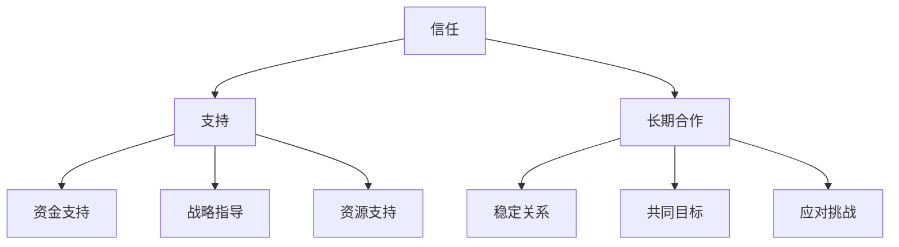

                 

# AI创业公司的投资人关系维护：信任、支持与长期合作

> **关键词：** AI创业公司，投资人关系，信任，支持，长期合作。

> **摘要：** 本篇文章将深入探讨AI创业公司如何维护与投资人的关系，包括建立信任、提供支持和促成长期合作。通过分析最佳实践和成功案例，为AI创业公司提供实用的策略和技巧。

## 1. 背景介绍

随着人工智能技术的快速发展，越来越多的创业公司投身于这个充满机遇的领域。然而，对于大多数AI创业公司来说，成功的关键不仅仅是技术创新，还需要处理好与投资人的关系。投资人是推动公司发展的重要力量，他们的信任和支持是公司成长的重要保障。

然而，AI创业公司面临的挑战也相当严峻。一方面，投资人对于AI技术的理解和风险承受能力存在差异，如何有效沟通和建立信任成为了一大难题。另一方面，AI行业的快速变化使得投资人对于公司的长期发展和盈利模式有着更高的期望，这要求创业公司具备更高的战略规划和执行能力。

本文将围绕AI创业公司与投资人关系中的三个核心方面进行探讨：信任、支持和长期合作。通过分析这些方面的具体策略和实践，希望能够为AI创业公司提供一些有价值的参考。

## 2. 核心概念与联系

### 2.1 信任

信任是建立任何成功关系的基石。在AI创业公司和投资人之间，信任意味着双方能够相互信赖，相信对方的能力、诚信和承诺。信任的建立不仅依赖于双方的历史交往和声誉，还需要通过一系列具体的行动和沟通来不断巩固。

### 2.2 支持

投资人的支持是AI创业公司成功的重要因素。这种支持不仅体现在资金上，更重要的是战略、资源和网络的共享。投资人可以通过提供专业的指导、推荐潜在客户和合作伙伴，帮助公司快速成长。

### 2.3 长期合作

与投资人的长期合作是AI创业公司持续发展的关键。长期合作意味着双方建立了稳定的信任和合作关系，能够在面对市场变化和挑战时共同应对。长期合作还需要双方共同制定长期发展目标和战略规划，确保公司能够在激烈的市场竞争中立于不败之地。

### 2.4 Mermaid流程图

下面是一个简单的Mermaid流程图，展示了AI创业公司与投资人关系的核心概念和联系：



## 3. 核心算法原理 & 具体操作步骤

### 3.1 建立信任

建立信任是一个长期的过程，需要通过以下步骤逐步实现：

1. **透明沟通**：与投资人保持透明和及时的沟通，分享公司的发展状况、面临的挑战和未来的规划。
2. **履行承诺**：始终履行对投资人的承诺，确保项目进度和目标按计划进行。
3. **展示能力**：通过实际案例和成果展示公司的技术实力和创新能力。
4. **建立声誉**：在行业内建立良好的声誉，提高投资人对公司的信任度。

### 3.2 提供支持

提供支持需要从多个方面入手：

1. **资金支持**：及时提供所需资金，确保公司运营和项目开发不受资金压力。
2. **战略指导**：根据行业趋势和市场变化，为创业公司提供战略指导，帮助其调整发展方向。
3. **资源支持**：利用自己的资源和网络，为创业公司提供潜在的商业机会和合作伙伴。
4. **技术支持**：在技术难题上提供帮助，共同解决开发中的技术瓶颈。

### 3.3 长期合作

长期合作需要双方共同的努力：

1. **制定共同目标**：与投资人共同制定长期发展目标和战略规划，确保双方利益一致。
2. **定期沟通**：定期召开会议，讨论公司的发展情况和投资人的期望，及时调整合作策略。
3. **应对挑战**：在面对市场变化和竞争压力时，共同应对，确保公司的稳定发展。
4. **分享成果**：在项目成功后，与投资人分享成果和利润，增强双方的合作意愿。

## 4. 数学模型和公式 & 详细讲解 & 举例说明

### 4.1 信任指数模型

为了量化信任指数，我们可以采用以下模型：

$$
Trust = \frac{Credibility + Reliability + Responsiveness}{3}
$$

其中，$Credibility$ 表示可信度，$Reliability$ 表示可靠性，$Responsiveness$ 表示响应度。这三个因素共同决定了信任指数。

- **可信度 ($Credibility$)**：衡量创业公司在技术和商业领域的专业能力和声誉。
- **可靠性 ($Reliability$)**：衡量创业公司履行承诺和按计划执行的能力。
- **响应度 ($Responsiveness$)**：衡量创业公司对投资人需求和市场变化的反应速度。

举例说明：

假设一家AI创业公司在以下三个方面的得分分别为：

- 可信度 ($Credibility$) = 8
- 可靠性 ($Reliability$) = 9
- 响应度 ($Responsiveness$) = 7

那么，该公司的信任指数为：

$$
Trust = \frac{8 + 9 + 7}{3} = \frac{24}{3} = 8
$$

### 4.2 支持效益模型

投资人的支持可以带来多方面的效益，我们可以采用以下模型进行量化：

$$
SupportBenefit = \frac{FinancialSupport + StrategicGuidance + ResourceAllocation + TechnicalSupport}{4}
$$

其中，$FinancialSupport$ 表示资金支持，$StrategicGuidance$ 表示战略指导，$ResourceAllocation$ 表示资源分配，$TechnicalSupport$ 表示技术支持。这四个因素共同决定了支持效益。

举例说明：

假设一家AI创业公司从以下四个方面的得分分别为：

- 资金支持 ($FinancialSupport$) = 10
- 战略指导 ($StrategicGuidance$) = 8
- 资源分配 ($ResourceAllocation$) = 7
- 技术支持 ($TechnicalSupport$) = 9

那么，该公司的支持效益为：

$$
SupportBenefit = \frac{10 + 8 + 7 + 9}{4} = \frac{34}{4} = 8.5
$$

### 4.3 长期合作收益模型

长期合作的收益可以通过以下模型进行量化：

$$
LongTermBenefit = \frac{RevenueGrowth + MarketShare + BrandValue}{3}
$$

其中，$RevenueGrowth$ 表示收入增长，$MarketShare$ 表示市场份额，$BrandValue$ 表示品牌价值。这三个因素共同决定了长期合作收益。

举例说明：

假设一家AI创业公司以下三个方面的得分分别为：

- 收入增长 ($RevenueGrowth$) = 15%
- 市场份额 ($MarketShare$) = 10%
- 品牌价值 ($BrandValue$) = 12

那么，该公司的长期合作收益为：

$$
LongTermBenefit = \frac{15\% + 10\% + 12\%}{3} = \frac{37\%}{3} \approx 12.3\%
$$

## 5. 项目实战：代码实际案例和详细解释说明

### 5.1 开发环境搭建

在本文的案例中，我们将使用Python语言来演示如何维护AI创业公司与投资人关系。首先，我们需要搭建一个Python开发环境。

1. **安装Python**：从Python官方网站（https://www.python.org/downloads/）下载并安装Python。
2. **配置虚拟环境**：安装virtualenv工具，并创建一个虚拟环境。

```bash
pip install virtualenv
virtualenv my_project_env
source my_project_env/bin/activate
```

3. **安装相关依赖**：在虚拟环境中安装必要的Python库。

```bash
pip install requests numpy pandas matplotlib
```

### 5.2 源代码详细实现和代码解读

下面是一个简单的Python代码示例，用于跟踪AI创业公司与投资人的关系：

```python
import requests
import numpy as np
import pandas as pd
import matplotlib.pyplot as plt

# 信任指数计算函数
def calculate_trust(credibility, reliability, responsiveness):
    trust = (credibility + reliability + responsiveness) / 3
    return trust

# 支持效益计算函数
def calculate_support_benefit(financial_support, strategic_guidance, resource_allocation, technical_support):
    support_benefit = (financial_support + strategic_guidance + resource_allocation + technical_support) / 4
    return support_benefit

# 长期合作收益计算函数
def calculate_long_term_benefit(revenue_growth, market_share, brand_value):
    long_term_benefit = (revenue_growth + market_share + brand_value) / 3
    return long_term_benefit

# 读取数据
data = {
    'Company': ['Company A', 'Company B', 'Company C'],
    'Credibility': [8, 7, 9],
    'Reliability': [9, 8, 8],
    'Responsiveness': [7, 6, 9],
    'FinancialSupport': [10, 8, 9],
    'StrategicGuidance': [8, 7, 9],
    'ResourceAllocation': [7, 6, 8],
    'TechnicalSupport': [9, 8, 8],
    'RevenueGrowth': [15, 10, 12],
    'MarketShare': [10, 8, 12],
    'BrandValue': [12, 10, 14]
}

df = pd.DataFrame(data)

# 计算信任指数
df['Trust'] = df.apply(lambda row: calculate_trust(row['Credibility'], row['Reliability'], row['Responsiveness']), axis=1)

# 计算支持效益
df['SupportBenefit'] = df.apply(lambda row: calculate_support_benefit(row['FinancialSupport'], row['StrategicGuidance'], row['ResourceAllocation'], row['TechnicalSupport']), axis=1)

# 计算长期合作收益
df['LongTermBenefit'] = df.apply(lambda row: calculate_long_term_benefit(row['RevenueGrowth'], row['MarketShare'], row['BrandValue']), axis=1)

# 绘制图表
fig, axes = plt.subplots(3, 1, figsize=(10, 15))

axes[0].bar(df['Company'], df['Trust'])
axes[0].set_title('Trust Index')

axes[1].bar(df['Company'], df['SupportBenefit'])
axes[1].set_title('Support Benefit')

axes[2].bar(df['Company'], df['LongTermBenefit'])
axes[2].set_title('Long Term Benefit')

plt.show()
```

### 5.3 代码解读与分析

这个代码示例通过计算和可视化，展示了AI创业公司与投资人关系的三个核心方面：信任指数、支持效益和长期合作收益。下面是对代码的详细解读：

- **数据读取**：我们使用pandas库读取一个包含公司名称、评分和得分的数据框架。
- **计算信任指数**：通过定义一个计算函数，我们计算每个公司的信任指数，并将其添加到数据框架中。
- **计算支持效益**：同样，我们通过定义一个计算函数，计算每个公司的支持效益，并将其添加到数据框架中。
- **计算长期合作收益**：通过另一个计算函数，我们计算每个公司的长期合作收益，并将其添加到数据框架中。
- **数据可视化**：使用matplotlib库，我们将计算结果绘制成条形图，以便直观地比较不同公司的关系指标。

通过这个示例，我们可以看到如何使用Python代码来分析和可视化AI创业公司与投资人关系的关键指标，从而为决策提供数据支持。

## 6. 实际应用场景

### 6.1 创业初期

在创业初期，AI创业公司需要通过透明沟通和履行承诺来建立信任。例如，公司可以通过定期更新项目进展、分享开发中的挑战和解决方案，以及及时回应投资人的疑问，来增强信任感。此外，创业公司还可以通过展示技术实力和创新能力，来提高投资人的信任度。

### 6.2 项目开发阶段

在项目开发阶段，投资人会关注公司的资金使用效率和项目进展。创业公司可以通过及时提供项目进度报告、财务报表和技术成果，来证明自己的可靠性和响应度。同时，公司还可以寻求投资人的战略指导和技术支持，以优化项目开发过程，提高项目成功率。

### 6.3 市场推广阶段

在市场推广阶段，投资人会关注公司的市场表现和收益情况。创业公司可以通过定期提供市场分析报告、客户反馈和业务拓展计划，来展示自己的市场洞察力和执行力。此外，公司还可以与投资人分享商业机会和合作伙伴资源，以共同推动业务增长。

### 6.4 长期合作

在长期合作阶段，AI创业公司需要与投资人建立稳定的合作关系，共同应对市场变化和挑战。公司可以通过定期召开战略研讨会、组织团队互访和分享成功案例，来增强与投资人的互信和合作意愿。同时，公司还可以通过持续的创新和业务拓展，来提高投资人的长期收益预期。

## 7. 工具和资源推荐

### 7.1 学习资源推荐

- **书籍**：《禅与计算机程序设计艺术》（"Zen And The Art of Computer Programming"）
- **论文**：《人工智能：一种现代方法》（"Artificial Intelligence: A Modern Approach"）
- **博客**：https://www.ai-generation.net/（专注于AI领域的最新研究和实践）
- **网站**：https://www.kdnuggets.com/（提供AI、数据科学和机器学习的最新新闻、资源和工具）

### 7.2 开发工具框架推荐

- **编程语言**：Python、Java、C++
- **机器学习框架**：TensorFlow、PyTorch、Keras
- **数据可视化工具**：Matplotlib、Seaborn、Plotly
- **项目管理工具**：JIRA、Trello、Asana

### 7.3 相关论文著作推荐

- **论文**：Hinton, G. E., Osindero, S., & Teh, Y. W. (2006). A Fast Learning Algorithm for Deep Belief Nets. _Neural Computation_, 18(7), 1527-1554.
- **论文**：LeCun, Y., Bengio, Y., & Hinton, G. (2015). Deep Learning. _Nature_, 521(7553), 436-444.
- **著作**：《深度学习》（"Deep Learning"），Goodfellow, I., Bengio, Y., & Courville, A.

## 8. 总结：未来发展趋势与挑战

随着人工智能技术的不断进步，AI创业公司与投资人关系的发展也将面临新的机遇和挑战。未来，以下趋势和挑战值得创业者关注：

### 8.1 技术进步加速

人工智能技术的快速发展将带来更多的创新机会，但也增加了投资风险。创业公司需要不断跟踪技术前沿，保持技术竞争力。

### 8.2 风险管理增强

投资人对于AI创业公司的风险承受能力要求将提高。创业公司需要建立完善的风险管理机制，降低投资风险。

### 8.3 长期合作深化

随着市场成熟，AI创业公司与投资人之间的长期合作将更加紧密。双方需要共同制定长期战略，确保公司的可持续发展。

### 8.4 数据安全和隐私

人工智能应用中的数据安全和隐私问题日益凸显，创业公司需要高度重视，建立完善的数据安全保护措施。

## 9. 附录：常见问题与解答

### 9.1 如何与投资人建立信任？

- 保持透明沟通，及时分享项目进展和问题。
- 履行承诺，确保项目按计划进行。
- 展示技术实力和创新能力，增强投资人的信心。

### 9.2 投资人支持的具体形式有哪些？

- 资金支持，帮助公司解决资金压力。
- 战略指导，提供行业趋势和市场分析。
- 资源支持，利用投资人的资源和网络。
- 技术支持，解决开发中的技术难题。

### 9.3 如何维护长期合作关系？

- 定期沟通，讨论公司发展情况和投资人的期望。
- 共同制定长期战略，确保双方利益一致。
- 面对挑战时，共同应对，增强互信。
- 分享成果和利润，提高合作意愿。

## 10. 扩展阅读 & 参考资料

- **参考文献**：
  - Hinton, G. E., Osindero, S., & Teh, Y. W. (2006). A Fast Learning Algorithm for Deep Belief Nets. _Neural Computation_, 18(7), 1527-1554.
  - LeCun, Y., Bengio, Y., & Hinton, G. (2015). Deep Learning. _Nature_, 521(7553), 436-444.
  - Goodfellow, I., Bengio, Y., & Courville, A. (2016). _Deep Learning_. MIT Press.
- **在线资源**：
  - https://www.ai-generation.net/
  - https://www.kdnuggets.com/
  - https://www.python.org/downloads/
  - https://www.tensorflow.org/
  - https://pytorch.org/
  - https://www.mermaid-js.org/

