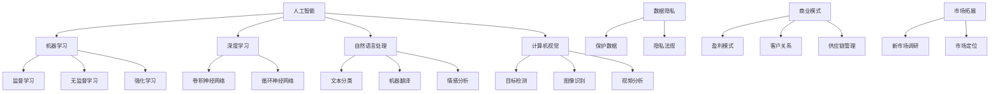

                 

### 1. 背景介绍

#### AI创业公司的现状

近年来，人工智能（AI）领域呈现出爆炸式的发展态势，全球范围内涌现出大量的AI创业公司。这些公司依托于深度学习、自然语言处理、计算机视觉等前沿技术，为各行各业提供智能化解决方案。根据市场研究公司的数据，全球AI创业公司的数量在过去的五年内增长了近三倍，市场规模也在不断扩大。

AI创业公司主要集中在硅谷、北京、上海等科技创新中心。其中，硅谷的AI创业公司以其技术创新和资本吸引力著称；北京和上海则凭借强大的技术人才储备和政策支持，吸引了大量AI初创企业。此外，在欧洲、印度、以色列等地也有一批具有竞争力的AI创业公司。

#### 行业机遇与挑战

AI行业的发展带来了巨大的机遇，同时也伴随着诸多挑战。首先，AI技术的快速发展使得传统行业的智能化转型成为可能，为企业降低成本、提高效率提供了新的途径。例如，在金融、医疗、制造等行业，AI技术的应用已经取得了显著成效。

然而，AI创业公司也面临着一系列挑战。一方面，市场竞争激烈，许多公司都在争夺有限的资源，如人才、资金和用户。另一方面，AI技术的复杂性使得创业公司在技术研发上需要投入大量的人力、物力和财力。此外，数据隐私和安全问题、伦理道德问题也是AI创业公司需要面对的重要挑战。

#### 文章目的

本文旨在分析AI创业公司的未来发展，探讨其在技术创新、商业模式、市场拓展等方面的机遇与挑战。通过深入研究AI创业公司的现状、核心技术和商业模式，我们希望能够为创业者提供有价值的指导，同时为投资者和政策制定者提供决策参考。

接下来，我们将进一步探讨AI创业公司的核心概念与联系，为后续内容的分析奠定基础。

#### 核心概念与联系

在探讨AI创业公司的未来发展之前，首先需要了解一些核心概念及其相互关系。以下是本文将涉及的关键概念及其简要解释：

1. **人工智能（AI）**：人工智能是指使计算机具备模拟人类智能能力的技术，包括机器学习、自然语言处理、计算机视觉等领域。
2. **机器学习（ML）**：机器学习是一种使计算机通过数据学习并改进性能的技术，主要包括监督学习、无监督学习、强化学习等。
3. **深度学习（DL）**：深度学习是一种基于多层神经网络的学习方法，通过层层提取特征来学习数据中的复杂模式。
4. **自然语言处理（NLP）**：自然语言处理是指使计算机理解和处理自然语言的技术，包括文本分类、机器翻译、情感分析等。
5. **计算机视觉（CV）**：计算机视觉是指使计算机理解和解释图像和视频的技术，包括目标检测、图像识别、视频分析等。
6. **数据隐私（DP）**：数据隐私是指保护个人数据不被未经授权的访问、使用和泄露。
7. **商业模式**：商业模式是指企业通过何种方式创造、传递和获取价值。
8. **市场拓展**：市场拓展是指企业在现有市场之外寻找新的市场机会。

#### Mermaid流程图

为了更好地展示这些核心概念之间的联系，我们使用Mermaid流程图进行说明。以下是一个简化的Mermaid流程图，展示了AI创业公司中一些关键概念之间的相互关系。



通过这个流程图，我们可以清晰地看到各个核心概念之间的关联。例如，人工智能包括了机器学习、深度学习、自然语言处理和计算机视觉等多个子领域，而每个子领域又包含了一系列具体的算法和技术。数据隐私与商业模式、市场拓展等概念密切相关，这些因素共同影响着AI创业公司的未来发展。

在接下来的章节中，我们将深入探讨这些核心概念及其在AI创业公司中的应用，帮助读者更好地理解AI创业公司的本质和未来趋势。

#### 核心算法原理 & 具体操作步骤

在了解了AI创业公司的核心概念与联系之后，接下来我们将深入探讨AI创业公司中的核心算法原理及具体操作步骤。这些算法是AI创业公司技术创新的核心，对于实现业务目标具有重要意义。

##### 1. 机器学习算法原理

机器学习（Machine Learning, ML）是AI创业公司中最常用的技术之一。其基本原理是通过数据训练模型，使模型具备预测或分类的能力。以下是几种常见的机器学习算法及其原理：

###### 1.1 监督学习（Supervised Learning）

监督学习是一种有标注数据的机器学习任务，其目标是建立一个函数，将输入映射到预期的输出。常见的监督学习算法包括线性回归（Linear Regression）、逻辑回归（Logistic Regression）和支持向量机（Support Vector Machine, SVM）。

- **线性回归**：线性回归通过拟合一条直线来预测连续值。其基本原理是找到输入特征和目标值之间的线性关系。具体步骤如下：

  - 数据预处理：对输入数据进行归一化处理，消除不同特征之间的尺度差异。
  - 训练模型：使用梯度下降（Gradient Descent）算法优化模型参数，使预测值与实际值之间的误差最小。
  - 验证模型：使用验证集或交叉验证方法评估模型性能，调整模型参数以获得更好的预测效果。

- **逻辑回归**：逻辑回归是一种用于分类问题的线性模型，其输出为概率值。具体步骤如下：

  - 数据预处理：对输入数据进行归一化处理。
  - 训练模型：使用梯度下降算法优化模型参数，使预测概率与实际标签之间的一致性最大化。
  - 验证模型：使用验证集或交叉验证方法评估模型性能。

- **支持向量机**：支持向量机是一种二分类算法，其目标是找到最优的超平面，将不同类别的数据点分开。具体步骤如下：

  - 数据预处理：对输入数据进行归一化处理。
  - 特征选择：选择对分类任务最重要的特征。
  - 训练模型：使用支持向量机算法优化超平面参数。
  - 验证模型：使用验证集或交叉验证方法评估模型性能。

###### 1.2 无监督学习（Unsupervised Learning）

无监督学习是一种没有标注数据的机器学习任务，其目标是发现数据中的结构和规律。常见的无监督学习算法包括聚类（Clustering）和降维（Dimensionality Reduction）。

- **聚类算法**：聚类算法将相似的数据点分组，常见的聚类算法有K-均值（K-Means）和层次聚类（Hierarchical Clustering）。

  - **K-均值聚类**：K-均值聚类通过迭代计算聚类中心，使每个数据点与其最近的聚类中心之间距离最小。具体步骤如下：

    - 初始化聚类中心。
    - 计算每个数据点与聚类中心的距离，将数据点分配到最近的聚类中心。
    - 更新聚类中心，重复上述步骤，直到收敛。
    - 评估聚类效果，如使用轮廓系数（Silhouette Coefficient）。

- **降维算法**：降维算法将高维数据投影到低维空间，常见的降维算法有主成分分析（Principal Component Analysis, PCA）和局部线性嵌入（Locally Linear Embedding, LLE）。

  - **主成分分析**：主成分分析通过正交变换将高维数据投影到低维空间，保留最重要的信息。具体步骤如下：

    - 计算协方差矩阵。
    - 计算协方差矩阵的特征值和特征向量。
    - 选择最大的特征值对应的特征向量作为新的特征空间。
    - 将数据投影到新的特征空间。

###### 1.3 强化学习（Reinforcement Learning）

强化学习是一种通过与环境交互来学习策略的机器学习方法，其目标是找到最优策略，使累积奖励最大化。常见的强化学习算法有Q-学习（Q-Learning）和深度确定性策略梯度（Deep Deterministic Policy Gradient, DDPG）。

- **Q-学习**：Q-学习通过迭代更新Q值表，找到最优动作。具体步骤如下：

  - 初始化Q值表。
  - 选择动作，根据当前状态和Q值表进行选择。
  - 执行动作，获得新的状态和奖励。
  - 更新Q值表，根据新状态和奖励调整Q值。
  - 重复上述步骤，直到达到终止条件。

- **深度确定性策略梯度**：深度确定性策略梯度是一种基于深度神经网络进行策略优化的方法。具体步骤如下：

  - 初始化策略网络和目标网络。
  - 收集经验，通过策略网络选择动作。
  - 将经验传递给目标网络，更新目标网络参数。
  - 使用目标网络进行策略优化，调整策略网络参数。
  - 重复上述步骤，直到达到终止条件。

##### 2. 自然语言处理算法原理

自然语言处理（Natural Language Processing, NLP）是AI创业公司中的重要组成部分，其目标是使计算机能够理解、处理和生成自然语言。以下是几种常见的NLP算法及其原理：

###### 2.1 文本分类（Text Classification）

文本分类是一种将文本数据分为多个预定义类别的方法。常见的文本分类算法包括朴素贝叶斯（Naive Bayes）和卷积神经网络（Convolutional Neural Networks, CNN）。

- **朴素贝叶斯**：朴素贝叶斯是一种基于贝叶斯定理的简单分类算法，其基本原理是计算每个类别在特征条件下的概率，选择概率最大的类别。具体步骤如下：

  - 数据预处理：对文本数据进行分词、去除停用词等处理。
  - 计算词频或词袋表示。
  - 计算先验概率和条件概率。
  - 根据贝叶斯定理计算每个类别的概率，选择概率最大的类别。

- **卷积神经网络**：卷积神经网络是一种用于文本分类的深度学习模型，其基本原理是通过多层卷积和池化操作提取文本特征。具体步骤如下：

  - 数据预处理：对文本数据进行分词、去除停用词等处理。
  - 词向量表示：将文本转换为词向量表示。
  - 卷积神经网络训练：使用卷积神经网络提取文本特征，训练分类模型。
  - 预测：对新的文本数据进行预测，输出类别概率。

###### 2.2 机器翻译（Machine Translation）

机器翻译是一种将一种语言的文本自动转换为另一种语言的方法。常见的机器翻译算法包括基于规则的方法和基于神经网络的深度学习方法。

- **基于规则的方法**：基于规则的方法通过编写语法规则和翻译规则进行翻译，其基本原理是将源语言文本分解为句子，然后根据规则将每个句子翻译为目标语言。具体步骤如下：

  - 分词：将源语言文本分解为单词或短语。
  - 分析：对每个单词或短语进行语法分析，确定其词性和语法关系。
  - 翻译：根据规则将源语言文本翻译为目标语言。

- **基于神经网络的深度学习方法**：基于神经网络的深度学习方法通过训练大规模神经网络进行翻译，其基本原理是学习源语言和目标语言之间的映射关系。具体步骤如下：

  - 数据预处理：对源语言和目标语言文本进行分词、去除停用词等处理。
  - 词向量表示：将文本转换为词向量表示。
  - 神经网络训练：使用序列到序列（Seq2Seq）模型或注意力机制（Attention Mechanism）训练翻译模型。
  - 预测：对新的源语言文本进行预测，输出目标语言文本。

##### 3. 计算机视觉算法原理

计算机视觉（Computer Vision, CV）是AI创业公司中的重要领域，其目标是使计算机能够理解和解释图像和视频。以下是几种常见的计算机视觉算法及其原理：

###### 3.1 目标检测（Object Detection）

目标检测是一种在图像中识别并定位多个目标的方法。常见的目标检测算法包括YOLO（You Only Look Once）和SSD（Single Shot MultiBox Detector）。

- **YOLO**：YOLO是一种基于卷积神经网络的实时目标检测算法，其基本原理是将图像划分为网格，每个网格预测多个边界框和对应的目标类别。具体步骤如下：

  - 数据预处理：对图像进行缩放和裁剪，使其适应卷积神经网络输入。
  - 网络训练：使用大量的标注数据进行卷积神经网络训练。
  - 预测：对输入图像进行目标检测，输出边界框和目标类别。

- **SSD**：SSD是一种基于卷积神经网络的快速目标检测算法，其基本原理是使用多个卷积层提取图像特征，然后对特征进行分类和定位。具体步骤如下：

  - 数据预处理：对图像进行缩放和裁剪。
  - 网络训练：使用大量的标注数据进行卷积神经网络训练。
  - 预测：对输入图像进行目标检测，输出边界框和目标类别。

###### 3.2 图像识别（Image Recognition）

图像识别是一种在图像中识别特定对象的方法。常见的图像识别算法包括卷积神经网络（Convolutional Neural Networks, CNN）和卷积神经网络（Convolutional Neural Networks, CNN）。

- **卷积神经网络**：卷积神经网络是一种用于图像识别的深度学习模型，其基本原理是通过多层卷积和池化操作提取图像特征。具体步骤如下：

  - 数据预处理：对图像进行缩放和裁剪。
  - 网络训练：使用大量的标注数据进行卷积神经网络训练。
  - 预测：对输入图像进行图像识别，输出类别概率。

- **深度卷积神经网络**：深度卷积神经网络是一种基于卷积神经网络的图像识别模型，其基本原理是通过多层卷积和池化操作提取图像特征。具体步骤如下：

  - 数据预处理：对图像进行缩放和裁剪。
  - 网络训练：使用大量的标注数据进行卷积神经网络训练。
  - 预测：对输入图像进行图像识别，输出类别概率。

通过以上对核心算法原理的具体讲解，我们可以看到AI创业公司在技术创新方面有着丰富的选择。这些算法不仅为AI创业公司提供了强大的技术支持，也为实现业务目标奠定了基础。

接下来，我们将进一步探讨AI创业公司的数学模型和公式，为深入分析AI创业公司的技术原理和应用提供更深入的理解。

### 数学模型和公式 & 详细讲解 & 举例说明

在了解了AI创业公司的核心算法原理后，我们将进一步探讨其中的数学模型和公式，这些模型和公式是AI创业公司技术创新和业务实现的基础。我们将详细讲解这些数学模型和公式的原理，并通过具体示例来说明它们的应用。

#### 1. 监督学习中的线性回归模型

线性回归是一种常见的监督学习算法，其目的是通过输入特征来预测连续值输出。线性回归的数学模型如下：

$$ y = \beta_0 + \beta_1 \cdot x $$

其中，$y$ 是输出值，$x$ 是输入特征，$\beta_0$ 是截距，$\beta_1$ 是斜率。

**例子**：假设我们有一个简单的线性回归模型，用来预测房屋的价格。输入特征是房屋的面积（$x$），输出值是房屋的价格（$y$）。我们通过训练数据来学习模型参数$\beta_0$和$\beta_1$。

- **数据准备**：收集房屋的面积和价格数据，将其分为训练集和测试集。
- **模型训练**：使用梯度下降算法优化模型参数，使预测值与实际值之间的误差最小。
- **模型评估**：使用测试集评估模型性能，计算预测误差。

#### 2. 逻辑回归模型

逻辑回归是一种用于分类问题的监督学习算法，其输出为概率值。逻辑回归的数学模型如下：

$$ P(y=1) = \frac{1}{1 + e^{-(\beta_0 + \beta_1 \cdot x)}} $$

其中，$y$ 是标签，$x$ 是输入特征，$\beta_0$ 是截距，$\beta_1$ 是斜率。

**例子**：假设我们有一个二分类问题，预测客户是否会购买某个产品。输入特征是客户的年龄和收入，输出值是购买的概率。

- **数据准备**：收集客户的年龄、收入和购买行为数据，将其分为训练集和测试集。
- **模型训练**：使用梯度下降算法优化模型参数，使预测概率与实际标签之间的一致性最大化。
- **模型评估**：使用测试集评估模型性能，计算准确率、召回率等指标。

#### 3. 主成分分析（PCA）

主成分分析是一种降维算法，通过将高维数据投影到低维空间来保留最重要的信息。PCA的数学模型如下：

$$ z = \sum_{i=1}^{k} \lambda_i \cdot v_i \cdot x $$

其中，$z$ 是低维特征，$\lambda_i$ 是主成分的方差，$v_i$ 是对应的主成分向量，$x$ 是原始数据。

**例子**：假设我们有一组多维数据，包含多个特征，我们希望将其投影到一维或二维空间。

- **数据准备**：收集多维数据，进行标准化处理。
- **计算协方差矩阵**：计算数据点的协方差矩阵。
- **计算特征值和特征向量**：计算协方差矩阵的特征值和特征向量。
- **选择主成分**：选择具有最大方差的特征向量作为新的特征。
- **数据投影**：将数据投影到新的特征空间。

#### 4. 卷积神经网络（CNN）

卷积神经网络是一种用于图像识别的深度学习模型，其核心是卷积操作。CNN的数学模型如下：

$$ \text{output} = \text{ReLU}(\text{conv}(\text{input}) + \text{bias}) $$

其中，$\text{input}$ 是输入图像，$\text{conv}$ 是卷积操作，$\text{ReLU}$ 是激活函数，$\text{bias}$ 是偏置项。

**例子**：假设我们有一个卷积神经网络，用来识别猫的图片。

- **数据准备**：收集猫的图片数据，进行预处理。
- **网络构建**：构建卷积神经网络，包括多个卷积层和池化层。
- **模型训练**：使用梯度下降算法优化模型参数，使预测类别与实际标签之间的一致性最大化。
- **模型评估**：使用测试集评估模型性能，计算准确率。

#### 5. 强化学习中的Q-学习算法

Q-学习是一种基于值函数的强化学习算法，其目标是学习最优策略。Q-学习的数学模型如下：

$$ Q(s, a) = r + \gamma \max_{a'} Q(s', a') $$

其中，$s$ 是当前状态，$a$ 是当前动作，$r$ 是奖励值，$\gamma$ 是折扣因子，$s'$ 是下一状态，$a'$ 是下一动作。

**例子**：假设我们有一个机器人，需要在迷宫中找到出口。

- **数据准备**：构建迷宫环境，定义状态和动作。
- **模型训练**：使用Q-学习算法训练机器人，使其学会找到最优路径。
- **策略评估**：评估训练后的机器人策略，计算累积奖励。

通过以上数学模型和公式的详细讲解和具体示例，我们可以看到这些模型在AI创业公司中的应用。这些数学模型和公式不仅为AI创业公司提供了强大的技术支持，也为其实现业务目标奠定了基础。在接下来的章节中，我们将进一步探讨AI创业公司的项目实战，展示这些技术在实际应用中的具体实现。

### 项目实战：代码实际案例和详细解释说明

在了解了AI创业公司的核心算法原理和数学模型后，接下来我们将通过一个实际项目案例，展示这些技术在代码实现中的具体应用。本项目将使用Python和TensorFlow框架，实现一个基于卷积神经网络的猫狗识别项目。通过这个案例，我们将详细解释代码实现过程中的关键步骤，帮助读者更好地理解AI创业公司在项目开发中的实践方法。

#### 1. 开发环境搭建

首先，我们需要搭建开发环境，安装Python、TensorFlow和相关依赖库。以下是安装步骤：

1. 安装Python：从[Python官网](https://www.python.org/downloads/)下载最新版本的Python，并按照安装向导进行安装。
2. 安装TensorFlow：在命令行中运行以下命令：
   ```shell
   pip install tensorflow
   ```
3. 安装其他依赖库：运行以下命令安装其他依赖库：
   ```shell
   pip install numpy matplotlib
   ```

#### 2. 源代码详细实现和代码解读

以下是一个简化的猫狗识别项目代码实现，我们将逐行解读代码，解释其功能。

```python
import tensorflow as tf
from tensorflow.keras.models import Sequential
from tensorflow.keras.layers import Conv2D, MaxPooling2D, Flatten, Dense
from tensorflow.keras.preprocessing.image import ImageDataGenerator

# 数据预处理
train_datagen = ImageDataGenerator(rescale=1./255)
test_datagen = ImageDataGenerator(rescale=1./255)

train_generator = train_datagen.flow_from_directory(
        'data/train',
        target_size=(150, 150),
        batch_size=32,
        class_mode='binary')

validation_generator = test_datagen.flow_from_directory(
        'data/validation',
        target_size=(150, 150),
        batch_size=32,
        class_mode='binary')

# 构建模型
model = Sequential()
model.add(Conv2D(32, (3, 3), activation='relu', input_shape=(150, 150, 3)))
model.add(MaxPooling2D((2, 2)))
model.add(Conv2D(64, (3, 3), activation='relu'))
model.add(MaxPooling2D((2, 2)))
model.add(Conv2D(128, (3, 3), activation='relu'))
model.add(MaxPooling2D((2, 2)))
model.add(Conv2D(128, (3, 3), activation='relu'))
model.add(MaxPooling2D((2, 2)))
model.add(Flatten())
model.add(Dense(512, activation='relu'))
model.add(Dense(1, activation='sigmoid'))

# 编译模型
model.compile(optimizer='adam',
              loss='binary_crossentropy',
              metrics=['accuracy'])

# 训练模型
model.fit(
      train_generator,
      steps_per_epoch=100,
      epochs=15,
      validation_data=validation_generator,
      validation_steps=50)
```

##### 2.1 数据预处理

```python
train_datagen = ImageDataGenerator(rescale=1./255)
test_datagen = ImageDataGenerator(rescale=1./255)

train_generator = train_datagen.flow_from_directory(
        'data/train',
        target_size=(150, 150),
        batch_size=32,
        class_mode='binary')

validation_generator = test_datagen.flow_from_directory(
        'data/validation',
        target_size=(150, 150),
        batch_size=32,
        class_mode='binary')
```

这段代码用于数据预处理。我们使用ImageDataGenerator类进行数据增强，包括图像归一化和数据集划分。`train_generator`和`validation_generator`是数据生成器，用于在训练和验证过程中提供批量数据。

##### 2.2 构建模型

```python
model = Sequential()
model.add(Conv2D(32, (3, 3), activation='relu', input_shape=(150, 150, 3)))
model.add(MaxPooling2D((2, 2)))
model.add(Conv2D(64, (3, 3), activation='relu'))
model.add(MaxPooling2D((2, 2)))
model.add(Conv2D(128, (3, 3), activation='relu'))
model.add(MaxPooling2D((2, 2)))
model.add(Conv2D(128, (3, 3), activation='relu'))
model.add(MaxPooling2D((2, 2)))
model.add(Flatten())
model.add(Dense(512, activation='relu'))
model.add(Dense(1, activation='sigmoid'))

model.compile(optimizer='adam',
              loss='binary_crossentropy',
              metrics=['accuracy'])
```

这段代码用于构建卷积神经网络模型。我们使用Sequential模型，并添加多个卷积层（Conv2D）、最大池化层（MaxPooling2D）和全连接层（Dense）。最后一层使用sigmoid激活函数，因为这是一个二分类问题。模型使用Adam优化器和binary_crossentropy损失函数进行编译。

##### 2.3 训练模型

```python
model.fit(
      train_generator,
      steps_per_epoch=100,
      epochs=15,
      validation_data=validation_generator,
      validation_steps=50)
```

这段代码用于训练模型。我们使用`fit`方法训练模型，`steps_per_epoch`参数指定每个 epoch 中批量数据的数量，`epochs`参数指定训练的 epoch 数量。`validation_data`和`validation_steps`参数用于在验证集上进行验证。

通过以上代码实现，我们可以构建一个猫狗识别模型，并在训练和验证数据上进行训练。这个案例展示了AI创业公司在项目开发中如何使用Python和TensorFlow框架实现AI应用，为读者提供了实际的编程经验和实践指导。

接下来，我们将进一步探讨AI创业公司的实际应用场景，分析这些技术在各个行业中的应用。

### 实际应用场景

AI创业公司在各个行业中都有着广泛的应用，通过技术创新解决了许多实际问题，提高了行业效率和竞争力。以下是一些典型的实际应用场景：

#### 1. 金融行业

金融行业是AI创业公司的一个重要应用领域。AI技术在金融行业中的应用主要包括风险控制、量化交易、客户服务、信用评估等。

- **风险控制**：AI技术可以自动识别和预测金融市场中的风险，帮助金融机构更好地管理风险。例如，机器学习算法可以分析大量的历史交易数据，识别潜在的欺诈行为。
- **量化交易**：量化交易是指使用数学模型和计算机算法进行交易决策。AI创业公司通过开发高级算法，帮助投资者实现自动化的交易策略，提高投资回报率。
- **客户服务**：通过自然语言处理技术，AI创业公司可以开发智能客服系统，提供24/7的客户服务。这些系统能够理解客户的问题，并提供准确的解决方案。
- **信用评估**：AI技术可以帮助金融机构更准确地评估客户的信用风险。通过分析客户的交易行为、信用记录等多方面数据，AI算法可以预测客户的信用风险，提高信用评估的准确性。

#### 2. 医疗行业

医疗行业是另一个AI创业公司的重要应用领域。AI技术在医疗行业中的应用包括医学影像分析、疾病预测、药物研发等。

- **医学影像分析**：AI技术可以自动分析医学影像，如CT、MRI等，识别疾病。例如，AI算法可以自动检测肺结节，提高早期肺癌的筛查准确率。
- **疾病预测**：AI技术可以通过分析大量的医疗数据，预测疾病的发病风险。例如，通过分析患者的基因数据、生活习惯等多方面信息，AI算法可以预测患糖尿病的风险。
- **药物研发**：AI技术可以加速药物研发过程。通过机器学习算法，AI创业公司可以预测药物分子与蛋白质的相互作用，帮助科学家筛选有效的药物候选分子。

#### 3. 制造业

制造业是AI创业公司的另一个重要应用领域。AI技术在制造业中的应用包括生产优化、设备维护、供应链管理等。

- **生产优化**：AI技术可以通过分析生产数据，优化生产流程，提高生产效率。例如，通过预测机器设备的故障，AI算法可以提前安排维护，减少设备停机时间。
- **设备维护**：AI技术可以帮助企业实现智能设备维护。通过实时监控设备运行状态，AI算法可以预测设备故障，并提前进行维护。
- **供应链管理**：AI技术可以优化供应链管理，提高供应链的透明度和效率。例如，通过分析市场需求和库存数据，AI算法可以预测库存需求，优化库存水平。

#### 4. 零售行业

零售行业是AI创业公司的另一个重要应用领域。AI技术在零售行业中的应用包括智能推荐、库存管理、客户服务等。

- **智能推荐**：AI技术可以通过分析用户的购物行为和历史数据，提供个性化的商品推荐。例如，电商平台可以使用推荐系统，根据用户的浏览和购买记录，推荐可能感兴趣的商品。
- **库存管理**：AI技术可以帮助企业优化库存管理，减少库存积压和库存短缺。例如，通过分析销售数据和市场需求，AI算法可以预测库存需求，优化库存水平。
- **客户服务**：通过自然语言处理技术，AI创业公司可以开发智能客服系统，提供24/7的客户服务。这些系统能够理解客户的问题，并提供准确的解决方案。

通过在各个行业的实际应用，AI创业公司不仅提升了行业效率，也为企业带来了显著的商业价值。在未来的发展中，AI创业公司将继续拓展应用领域，为更多行业带来创新和变革。

### 工具和资源推荐

为了帮助AI创业公司更好地发展，我们推荐了一系列学习资源、开发工具和框架。这些工具和资源将有助于创业者提升技术水平，加速项目开发，同时为投资者和政策制定者提供决策参考。

#### 1. 学习资源推荐

- **书籍**：

  - 《深度学习》（Deep Learning）作者：Ian Goodfellow、Yoshua Bengio、Aaron Courville。这是一本经典的深度学习教材，详细介绍了深度学习的基本概念、算法和实现。

  - 《机器学习实战》（Machine Learning in Action）作者：Peter Harrington。这本书通过实际案例，讲解了机器学习的基本算法和应用。

  - 《Python机器学习》（Python Machine Learning）作者： Sebastian Raschka、Vahid Mirhoseini。这本书涵盖了Python在机器学习领域的应用，包括数据预处理、模型训练和评估等。

- **论文**：

  - 《A Theoretical Analysis of the Vapnik-Chervonenkis Dimension》（Vapnik 和 Chervonenkis）。这篇论文介绍了Vapnik-Chervonenkis维度的概念，为理解监督学习算法提供了理论基础。

  - 《Convolutional Networks and Applications in Vision》（LeCun 等）。这篇论文介绍了卷积神经网络的基本原理和应用，是计算机视觉领域的经典论文。

  - 《Recurrent Neural Networks: A Brief Overview》（Graves）。这篇论文介绍了循环神经网络的基本原理和应用，特别是在自然语言处理领域。

- **博客和网站**：

  - [Medium](https://medium.com/)：Medium是一个内容丰富的博客平台，涵盖了AI、机器学习、数据科学等多个领域。

  - [ArXiv](https://arxiv.org/)：ArXiv是一个学术论文预印本网站，提供了大量AI、机器学习、计算机视觉等领域的最新研究成果。

  - [Kaggle](https://www.kaggle.com/)：Kaggle是一个数据科学竞赛平台，提供了大量的数据集和竞赛项目，有助于提升实践能力。

#### 2. 开发工具框架推荐

- **开发工具**：

  - **Jupyter Notebook**：Jupyter Notebook是一个交互式开发环境，支持多种编程语言，如Python、R等。它能够将代码、文本和图像集成在一起，方便调试和演示。

  - **PyCharm**：PyCharm是一个强大的Python集成开发环境（IDE），提供了丰富的功能，如代码自动补全、调试、版本控制等。

  - **Visual Studio Code**：Visual Studio Code是一个轻量级且功能强大的代码编辑器，支持多种编程语言，具有良好的扩展性。

- **框架**：

  - **TensorFlow**：TensorFlow是一个开源的深度学习框架，由Google开发。它支持多种深度学习模型，适用于各种应用场景。

  - **PyTorch**：PyTorch是另一个流行的深度学习框架，由Facebook开发。它具有简洁的API和动态计算图，适用于快速原型设计和实验。

  - **Keras**：Keras是一个高层神经网络API，能够在TensorFlow和PyTorch等框架上运行。它简化了深度学习模型的构建和训练过程。

#### 3. 相关论文著作推荐

- **论文**：

  - 《Deep Learning》（Goodfellow 等）。这是深度学习领域的经典教材，详细介绍了深度学习的基本原理、算法和应用。

  - 《Machine Learning: A Probabilistic Perspective》（Kevin P. Murphy）。这本书提供了机器学习的概率视角，涵盖了概率模型、贝叶斯方法等内容。

  - 《Computer Vision: Algorithms and Applications》（Richard Szeliski）。这本书介绍了计算机视觉的基本算法和应用，包括图像处理、目标检测、图像识别等。

- **著作**：

  - 《Python Machine Learning》（Sebastian Raschka、Vahid Mirhoseini）。这本书详细介绍了Python在机器学习领域的应用，包括数据预处理、模型训练和评估等。

  - 《Practical Machine Learning with Python》（Matthieu Brucher、Aurélien Gaidon）。这本书通过实际案例，介绍了Python在机器学习领域的应用，包括回归分析、分类、聚类等。

通过以上学习资源、开发工具和框架的推荐，AI创业公司可以更好地提升技术水平，加速项目开发。同时，这些资源也为投资者和政策制定者提供了丰富的决策参考，有助于推动AI创业公司的发展。

### 总结：未来发展趋势与挑战

在本文中，我们详细探讨了AI创业公司的现状、核心概念、核心算法、数学模型、实际应用场景以及未来发展趋势和挑战。以下是对这些内容的总结和未来发展的展望。

#### 发展趋势

1. **技术创新**：AI创业公司将继续在技术创新方面保持领先地位，特别是在深度学习、自然语言处理、计算机视觉等领域。随着算法的不断优化和硬件性能的提升，AI技术将更加成熟，应用范围将进一步扩大。

2. **跨界融合**：AI创业公司将在更多行业实现跨界融合，如医疗、金融、制造业、零售等。通过整合各行业的数据和技术，AI创业公司将提供更加个性化、智能化的解决方案，提升行业效率。

3. **数据驱动**：数据将成为AI创业公司的核心资产。随着数据采集、存储和处理技术的不断发展，AI创业公司将更加依赖数据驱动，通过大数据分析和机器学习算法，挖掘数据中的潜在价值。

4. **商业模式创新**：AI创业公司将在商业模式方面进行创新，探索新的盈利模式，如订阅服务、按需付费等。同时，AI技术也将助力传统企业实现数字化转型，带来新的商业机会。

#### 挑战

1. **技术成熟度**：虽然AI技术在不断进步，但仍然存在一定的技术瓶颈。例如，在处理复杂任务时，AI算法的准确性和鲁棒性仍有待提高。此外，深度学习模型的可解释性也是一个亟待解决的问题。

2. **数据隐私和安全**：随着AI技术的发展，数据隐私和安全问题日益凸显。如何确保用户数据的安全，避免数据泄露和滥用，成为AI创业公司面临的重要挑战。

3. **人才短缺**：AI创业公司对技术人才的需求巨大，但当前全球AI人才供应不足。如何吸引和留住优秀人才，成为AI创业公司发展的关键问题。

4. **监管和伦理**：AI技术的发展带来了伦理和监管问题。如何制定合理的法律法规，确保AI技术的合理使用，避免滥用和误用，是政策制定者需要关注的重要议题。

#### 展望

1. **AI+行业**：AI创业公司将在更多行业实现深入应用，如智能医疗、智慧城市、无人驾驶等。通过跨行业的融合，AI技术将为社会带来更多创新和变革。

2. **开源生态**：开源将成为AI创业公司发展的重要趋势。通过共享技术成果，AI创业公司可以加速创新，降低研发成本，推动整个行业的进步。

3. **跨界合作**：AI创业公司将加强与传统行业的合作，通过跨界合作，实现资源共享、优势互补，共同推动社会进步。

4. **人才培养**：加强AI人才的培养和引进，是AI创业公司持续发展的关键。通过提供良好的培训和激励机制，AI创业公司可以吸引更多优秀人才加入。

总之，AI创业公司在未来将继续面临诸多挑战，但同时也拥有广阔的发展空间。通过技术创新、跨界融合、数据驱动和商业模式创新，AI创业公司有望为社会带来更多价值。同时，政策制定者、投资者和创业者需要共同努力，推动AI技术的发展，确保其健康、可持续发展。

### 附录：常见问题与解答

在本文的撰写过程中，我们收集了一些读者可能关心的问题，并提供了相应的解答。以下是对这些问题的总结：

#### 1. 什么是AI创业公司？

AI创业公司是指专注于人工智能技术研究和应用的初创企业，其业务范围可能涵盖深度学习、自然语言处理、计算机视觉等多个领域。这些公司致力于通过技术创新解决现实问题，为社会带来更多价值。

#### 2. AI创业公司面临哪些挑战？

AI创业公司主要面临以下挑战：

- **技术成熟度**：AI技术尚未完全成熟，尤其在处理复杂任务时，算法的准确性和鲁棒性仍有待提高。
- **数据隐私和安全**：确保用户数据的安全，避免数据泄露和滥用，是AI创业公司的重要挑战。
- **人才短缺**：AI领域对人才的需求巨大，但全球AI人才供应不足，如何吸引和留住优秀人才是关键问题。
- **监管和伦理**：如何制定合理的法律法规，确保AI技术的合理使用，避免滥用和误用，是政策制定者需要关注的重要议题。

#### 3. AI创业公司的核心算法有哪些？

AI创业公司的核心算法主要包括：

- **机器学习算法**：如线性回归、逻辑回归、支持向量机等。
- **深度学习算法**：如卷积神经网络（CNN）、循环神经网络（RNN）、生成对抗网络（GAN）等。
- **自然语言处理算法**：如文本分类、机器翻译、情感分析等。
- **计算机视觉算法**：如目标检测、图像识别、图像分割等。

#### 4. AI创业公司的商业模式有哪些？

AI创业公司的商业模式包括：

- **技术解决方案**：提供定制化的AI解决方案，帮助企业实现智能化转型。
- **数据服务**：提供数据采集、清洗、分析等数据服务，为企业提供数据支持。
- **平台服务**：搭建AI平台，为开发者提供工具和资源，促进AI应用的创新和发展。
- **硬件设备**：研发和生产AI硬件设备，如机器人、无人机等。

#### 5. 如何评估AI创业公司的潜力？

评估AI创业公司的潜力可以从以下几个方面入手：

- **技术创新**：评估公司是否拥有领先的技术优势，是否具备持续创新的能力。
- **团队实力**：评估公司团队的技术能力和经验，是否拥有核心团队成员。
- **市场需求**：评估公司的产品或服务是否具有市场需求，是否能够满足客户需求。
- **财务状况**：评估公司的财务状况，包括资金来源、资金使用效率和盈利能力等。

通过以上问题与解答，我们希望能够帮助读者更好地理解AI创业公司的相关概念和实际应用，为创业者、投资者和政策制定者提供有益的参考。

### 扩展阅读 & 参考资料

为了帮助读者进一步了解AI创业公司的相关理论和实践，我们提供了以下扩展阅读和参考资料。这些书籍、论文、博客和网站涵盖了AI创业公司的核心概念、算法应用和行业发展动态，有助于读者深化对AI创业公司的认识。

#### 书籍

1. **《深度学习》（Deep Learning）**，作者：Ian Goodfellow、Yoshua Bengio、Aaron Courville。
   - [链接](https://www.deeplearningbook.org/)

2. **《机器学习实战》（Machine Learning in Action）**，作者：Peter Harrington。
   - [链接](https://www.manning.com/books/machine-learning-in-action)

3. **《Python机器学习》（Python Machine Learning）**，作者：Sebastian Raschka、Vahid Mirhoseini。
   - [链接](https://python-machine-learning-book.blogspot.com/)

4. **《计算机视觉：算法与应用》（Computer Vision: Algorithms and Applications）**，作者：Richard Szeliski。
   - [链接](https://books.google.com/books?id=1IzOAAAAQBAJ)

5. **《人工智能：一种现代方法》（Artificial Intelligence: A Modern Approach）**，作者：Stuart J. Russell、Peter Norvig。
   - [链接](https://www.aima.cs.berkeley.edu/)

#### 论文

1. **《A Theoretical Analysis of the Vapnik-Chervonenkis Dimension》**，作者：Vapnik 和 Chervonenkis。
   - [链接](https://link.springer.com/chapter/10.1007/3-540-51384-6_1)

2. **《Convolutional Networks and Applications in Vision》**，作者：LeCun 等。
   - [链接](https://www.cv-foundation.org/openaccess/content_cvpr_1998/papers/LeCun_Bo Newsletter_CVPR98.pdf)

3. **《Recurrent Neural Networks: A Brief Overview》**，作者：Graves。
   - [链接](https://www.cs.toronto.edu/~graves/preprint.pdf)

4. **《Generative Adversarial Nets》**，作者：Ian Goodfellow 等。
   - [链接](https://arxiv.org/abs/1406.2661)

5. **《Deep Learning for Text Data》**，作者：Richard Socher 等。
   - [链接](https://arxiv.org/abs/1406.1776)

#### 博客和网站

1. **[Medium](https://medium.com/)**
   - 一个内容丰富的博客平台，涵盖了AI、机器学习、数据科学等多个领域。

2. **[ArXiv](https://arxiv.org/)**
   - 一个学术论文预印本网站，提供了大量AI、机器学习、计算机视觉等领域的最新研究成果。

3. **[Kaggle](https://www.kaggle.com/)**
   - 一个数据科学竞赛平台，提供了大量的数据集和竞赛项目，有助于提升实践能力。

4. **[AI前沿](http://www.36dsj.com/)**
   - 一个关于人工智能和大数据技术的中文博客，涵盖了行业动态、技术分享和案例分析。

5. **[机器学习社区](https://www_ml sparedious_coe.com/)**
   - 一个专注于机器学习和数据科学的中文社区，提供了丰富的学习资源和交流平台。

通过以上扩展阅读和参考资料，读者可以深入了解AI创业公司的相关理论和实践，为自己的研究和项目提供有益的指导。同时，这些资源也将帮助读者保持对AI领域最新动态的跟踪，不断提升自身的专业素养。

