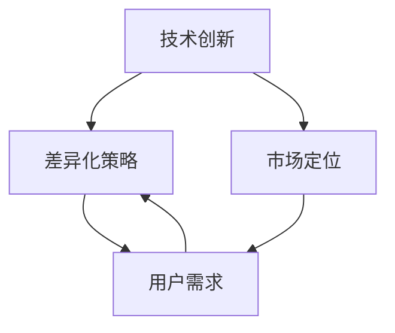

                 

# AI创业公司的机遇：在巨头夹缝中求生存

## > 关键词：AI创业，巨头竞争，技术创新，差异化策略，市场定位

> 摘要：在当今快速发展的AI领域中，创业公司面临着前所未有的机遇和挑战。本文将深入探讨AI创业公司在巨头垄断的市场中如何寻找生存空间，实现差异化竞争，并探索未来发展的趋势与挑战。

## 1. 背景介绍

近年来，人工智能（AI）技术取得了飞速发展，不仅在学术界，也在工业界引发了广泛关注。随着深度学习、自然语言处理、计算机视觉等技术的不断突破，AI已经渗透到各行各业，从医疗健康、金融到制造业、物流，AI的应用无处不在。然而，这个领域中的一些巨头公司，如谷歌、微软、亚马逊等，已经占据了大量市场份额，形成了巨大的竞争壁垒。对于初创公司而言，如何在这样的市场环境中找到生存空间，实现可持续发展，是一个亟待解决的问题。

### 1.1 AI创业的现状

根据市场调研机构Statista的数据显示，2019年全球人工智能市场规模约为370亿美元，预计到2025年将达到约5,970亿美元，年复合增长率高达42.2%。这样的市场前景无疑对AI创业公司是一个巨大的吸引力。然而，现实情况是，AI创业公司面临着巨大的竞争压力。一方面，巨头公司拥有雄厚的资金、技术积累和广泛的市场渠道，新入局者很难与之抗衡；另一方面，创业公司通常在技术研发、市场推广等方面缺乏经验，面临着资源有限、人才短缺等挑战。

### 1.2 巨头垄断的现状

在AI领域，巨头公司的垄断地位主要体现在以下几个方面：

1. **技术壁垒**：巨头公司拥有大量的专利和核心技术，这些技术往往是新入局者难以超越的。
2. **数据资源**：巨头公司通过其广泛的应用场景，积累了海量的数据资源，这些数据是AI模型训练的重要基础。
3. **市场渠道**：巨头公司拥有强大的销售渠道和用户基础，新入局者很难与之竞争。

### 1.3 创业公司的优势与挑战

尽管面临巨大的挑战，AI创业公司仍然具有一些独特的优势：

1. **创新意识**：创业公司通常更加灵活，能够迅速响应市场需求，进行技术创新。
2. **垂直领域深耕**：创业公司可以在某个特定的垂直领域深耕，提供定制化的解决方案。
3. **用户互动**：创业公司可以与用户保持更加紧密的互动，更好地理解用户需求，提供更优质的服务。

然而，这些优势也伴随着相应的挑战：

1. **资金不足**：创业公司通常难以获得足够的资金支持，尤其是在技术研发和市场推广方面。
2. **人才缺乏**：顶尖的技术人才通常更倾向于加入大公司，创业公司难以吸引和留住优秀人才。
3. **市场认知**：创业公司在市场推广方面往往缺乏经验，难以快速获得用户认可。

## 2. 核心概念与联系

在本节中，我们将探讨AI创业公司面临的核心概念，包括技术创新、差异化策略、市场定位等，并使用Mermaid流程图来展示它们之间的联系。



### 2.1 技术创新

技术创新是AI创业公司的核心驱动力。通过持续的技术研发，创业公司可以开发出独特的算法、模型和工具，从而在竞争激烈的市场中脱颖而出。例如，创业公司可以通过改进深度学习算法，提高模型的准确率和效率，或者开发新的自然语言处理技术，提升人机交互体验。

### 2.2 差异化策略

差异化策略是指创业公司通过提供与众不同的产品或服务，吸引特定的用户群体。这种策略可以帮助创业公司在巨头垄断的市场中找到自己的生存空间。差异化策略可以基于以下几个方面：

1. **技术优势**：创业公司可以专注于某一特定领域，提供更专业的解决方案。
2. **用户体验**：通过优化用户界面和交互设计，提升用户满意度。
3. **商业模式**：创业公司可以探索新的商业模式，如订阅制、SaaS等，以区别于传统商业模式。

### 2.3 市场定位

市场定位是指创业公司确定其目标市场和用户群体，并在此基础上制定相应的营销策略。通过准确的市场定位，创业公司可以更加专注于满足特定用户的需求，提高市场竞争力。市场定位需要考虑以下几个方面：

1. **用户需求**：了解目标用户的需求和痛点，提供针对性的解决方案。
2. **市场规模**：评估目标市场的规模和潜力，确定是否值得投入。
3. **竞争环境**：分析竞争对手的市场份额和策略，确定自己的竞争优势。

通过技术创新、差异化策略和市场定位，AI创业公司可以在巨头垄断的市场中找到自己的生存空间，实现可持续发展。

## 3. 核心算法原理 & 具体操作步骤

在AI创业过程中，核心算法原理的掌握和具体操作步骤的实践至关重要。本节将详细介绍一些常见的核心算法原理，并给出具体操作步骤。

### 3.1 深度学习算法

深度学习是AI领域的一个重要分支，其核心思想是通过多层神经网络对数据进行建模和学习。以下是一个简单的深度学习算法的操作步骤：

1. **数据预处理**：对输入数据进行预处理，包括数据清洗、归一化等操作，确保数据的质量和一致性。
2. **模型设计**：设计深度学习模型，包括选择合适的神经网络架构、激活函数、优化器等。
3. **模型训练**：使用训练数据对模型进行训练，通过反向传播算法不断调整模型参数，以提高模型的准确率。
4. **模型评估**：使用测试数据对模型进行评估，计算模型的准确率、召回率等指标，以确定模型的表现。

### 3.2 强化学习算法

强化学习是一种通过不断试错和奖励机制来学习最优策略的算法。以下是一个简单的强化学习算法的操作步骤：

1. **环境初始化**：初始化环境，包括定义状态空间、动作空间和奖励函数。
2. **策略选择**：选择一个初始策略，用于指导Agent在环境中进行行动。
3. **行动执行**：根据当前状态和策略，执行相应的动作。
4. **奖励评估**：根据动作的结果，评估当前状态的奖励，以调整策略。
5. **策略更新**：根据奖励信号，更新策略，以实现更好的性能。

### 3.3 自然语言处理算法

自然语言处理是AI领域的一个重要分支，其核心任务是让计算机理解和处理人类语言。以下是一个简单的自然语言处理算法的操作步骤：

1. **数据预处理**：对输入文本进行预处理，包括分词、去停用词、词性标注等操作，以提取有用的特征。
2. **特征提取**：使用特征提取器（如词袋模型、词嵌入等）将文本转换为计算机可以理解的数字表示。
3. **模型训练**：使用训练数据对模型进行训练，通过优化模型参数，以提高模型的性能。
4. **模型评估**：使用测试数据对模型进行评估，计算模型的准确率、F1值等指标，以确定模型的表现。

通过以上核心算法原理的具体操作步骤，AI创业公司可以更好地理解和应用这些算法，为其产品或服务提供技术支撑。

## 4. 数学模型和公式 & 详细讲解 & 举例说明

在AI创业过程中，数学模型和公式的运用至关重要。本节将详细讲解一些常见的数学模型和公式，并通过实际例子进行说明。

### 4.1 概率论基础

概率论是AI领域的基础，许多算法都基于概率论原理。以下是一些基本的概率论公式：

#### 4.1.1 条件概率

$$
P(A|B) = \frac{P(A \cap B)}{P(B)}
$$

条件概率表示在事件B发生的条件下，事件A发生的概率。例如，假设我们正在设计一个垃圾邮件检测系统，我们知道一个邮件是垃圾邮件的概率是0.1，同时我们知道这个邮件包含“买药”这个词的概率是0.3。如果我们知道这个邮件包含了“买药”这个词，那么它是垃圾邮件的概率是：

$$
P(\text{垃圾邮件}|\text{包含“买药”}) = \frac{P(\text{垃圾邮件} \cap \text{包含“买药”})}{P(\text{包含“买药”})} = \frac{0.1 \times 0.3}{0.3} = 0.1
$$

#### 4.1.2 贝叶斯定理

贝叶斯定理是概率论中一个重要的公式，用于计算后验概率。它的公式为：

$$
P(A|B) = \frac{P(B|A) \cdot P(A)}{P(B)}
$$

其中，\(P(A|B)\) 是后验概率，即给定事件B发生的情况下，事件A发生的概率；\(P(B|A)\) 是似然概率，即在事件A发生的情况下，事件B发生的概率；\(P(A)\) 是先验概率，即事件A发生的概率；\(P(B)\) 是边缘概率，即事件B发生的概率。

#### 4.1.3 最大似然估计

最大似然估计（Maximum Likelihood Estimation，MLE）是一种常用的参数估计方法。它的基本思想是寻找一组参数，使得给定的数据在模型下的概率最大。对于一个离散的随机变量\(X\)，最大似然估计的目标是找到参数\(\theta\)，使得：

$$
P(X|\theta) \text{ 最大}
$$

### 4.2 机器学习模型中的损失函数

在机器学习中，损失函数是评估模型性能的重要指标。以下是一些常见的损失函数：

#### 4.2.1 交叉熵损失函数

交叉熵损失函数（Cross-Entropy Loss）是分类问题中最常用的损失函数。它的公式为：

$$
L(y, \hat{y}) = -\sum_{i} y_i \log(\hat{y}_i)
$$

其中，\(y\) 是真实标签，\(\hat{y}\) 是模型的预测概率。交叉熵损失函数的值越小，表示模型的预测越接近真实标签。

#### 4.2.2 均方误差损失函数

均方误差损失函数（Mean Squared Error，MSE）是回归问题中最常用的损失函数。它的公式为：

$$
L(y, \hat{y}) = \frac{1}{2} \sum_{i} (y_i - \hat{y}_i)^2
$$

其中，\(y\) 是真实值，\(\hat{y}\) 是模型的预测值。均方误差损失函数的值越小，表示模型的预测越接近真实值。

### 4.3 例子说明

#### 4.3.1 概率论例子

假设我们有一个垃圾邮件检测系统，已知一个邮件是垃圾邮件的概率是0.1，同时我们知道这个邮件包含“买药”这个词的概率是0.3。如果我们知道这个邮件包含了“买药”这个词，那么它是垃圾邮件的概率是多少？

根据贝叶斯定理：

$$
P(\text{垃圾邮件}|\text{包含“买药”}) = \frac{P(\text{包含“买药”}|\text{垃圾邮件}) \cdot P(\text{垃圾邮件})}{P(\text{包含“买药”})}
$$

已知：

$$
P(\text{垃圾邮件}) = 0.1, \quad P(\text{包含“买药”}|\text{垃圾邮件}) = 0.3
$$

我们需要计算 \(P(\text{包含“买药”})\)：

$$
P(\text{包含“买药”}) = P(\text{包含“买药”}|\text{垃圾邮件}) \cdot P(\text{垃圾邮件}) + P(\text{包含“买药”}|\text{正常邮件}) \cdot P(\text{正常邮件})
$$

假设正常邮件包含“买药”这个词的概率是0.05，正常邮件的概率是0.9，那么：

$$
P(\text{包含“买药”}) = 0.3 \cdot 0.1 + 0.05 \cdot 0.9 = 0.03 + 0.045 = 0.075
$$

所以，根据贝叶斯定理：

$$
P(\text{垃圾邮件}|\text{包含“买药”}) = \frac{0.3 \cdot 0.1}{0.075} = 0.4
$$

这意味着，如果一封邮件包含了“买药”这个词，它是垃圾邮件的概率是40%。

#### 4.3.2 机器学习例子

假设我们有一个回归模型，用于预测房价。我们有一个训练数据集，包含房屋的特征和对应的房价。我们希望使用均方误差损失函数来评估模型性能。

给定一个测试数据点 \((x, y)\)，模型的预测值为 \(\hat{y}\)。均方误差损失函数为：

$$
L(y, \hat{y}) = \frac{1}{2} (y - \hat{y})^2
$$

如果我们有一个测试数据点 \((1000, 200000)\)，模型的预测值为 \(\hat{y} = 195000\)，那么损失函数的值为：

$$
L(200000, 195000) = \frac{1}{2} (200000 - 195000)^2 = \frac{1}{2} \times 2500^2 = 3125000
$$

这意味着模型的预测与真实房价的差距较大。为了提高模型性能，我们可以通过优化模型参数来减少损失函数的值。

通过以上数学模型和公式的详细讲解与实际例子说明，AI创业公司可以更好地理解和应用这些数学工具，为产品的开发和优化提供理论基础。

## 5. 项目实战：代码实际案例和详细解释说明

### 5.1 开发环境搭建

在开始一个AI项目之前，我们需要搭建一个合适的环境。以下是一个典型的AI项目开发环境搭建步骤：

1. **安装Python环境**：首先，确保Python环境已经安装。Python是AI项目中最常用的编程语言之一。如果尚未安装，可以访问Python官网下载安装包。
2. **安装依赖库**：使用pip安装常用的依赖库，如NumPy、Pandas、Scikit-learn、TensorFlow或PyTorch。以下是一个示例命令：

   ```bash
   pip install numpy pandas scikit-learn tensorflow
   ```

3. **配置Jupyter Notebook**：Jupyter Notebook是一个交互式计算平台，非常适合进行AI项目的开发和实验。通过以下命令安装Jupyter Notebook：

   ```bash
   pip install notebook
   ```

   安装完成后，可以使用以下命令启动Jupyter Notebook：

   ```bash
   jupyter notebook
   ```

### 5.2 源代码详细实现和代码解读

以下是一个简单的AI项目示例，该示例使用TensorFlow实现一个线性回归模型，用于预测房价。

```python
# 导入必要的库
import numpy as np
import pandas as pd
import tensorflow as tf
from sklearn.model_selection import train_test_split

# 读取数据
data = pd.read_csv('house_price_data.csv')
X = data[['area', 'bedrooms', 'age']]
y = data['price']

# 数据预处理
X_train, X_test, y_train, y_test = train_test_split(X, y, test_size=0.2, random_state=42)

# 定义模型
model = tf.keras.Sequential([
    tf.keras.layers.Dense(units=1, input_shape=[3])
])

# 编译模型
model.compile(optimizer='sgd', loss='mean_squared_error')

# 训练模型
model.fit(X_train, y_train, epochs=100, batch_size=32, validation_data=(X_test, y_test))

# 评估模型
loss = model.evaluate(X_test, y_test)
print(f'Mean squared error on test data: {loss}')

# 预测
predictions = model.predict(X_test)
```

### 5.3 代码解读与分析

#### 5.3.1 数据读取与预处理

首先，我们从CSV文件中读取数据，并使用Scikit-learn库进行数据预处理。数据分为特征矩阵 \(X\) 和标签向量 \(y\)。特征矩阵 \(X\) 包含房屋的面积、卧室数量和房屋年龄，而标签向量 \(y\) 是房屋的价格。

```python
data = pd.read_csv('house_price_data.csv')
X = data[['area', 'bedrooms', 'age']]
y = data['price']
```

#### 5.3.2 模型定义

接下来，我们使用TensorFlow定义一个简单的线性回归模型。模型由一个全连接层（Dense Layer）组成，该层有1个输出单元，对应于房价的预测。

```python
model = tf.keras.Sequential([
    tf.keras.layers.Dense(units=1, input_shape=[3])
])
```

#### 5.3.3 模型编译

在编译模型时，我们选择Stochastic Gradient Descent（SGD）作为优化器，并使用均方误差（Mean Squared Error）作为损失函数。

```python
model.compile(optimizer='sgd', loss='mean_squared_error')
```

#### 5.3.4 模型训练

我们使用训练数据对模型进行训练，设置训练轮次为100次，批量大小为32。同时，我们提供验证数据以监控模型在验证集上的性能。

```python
model.fit(X_train, y_train, epochs=100, batch_size=32, validation_data=(X_test, y_test))
```

#### 5.3.5 模型评估

在训练完成后，我们评估模型在测试数据上的性能，输出均方误差。

```python
loss = model.evaluate(X_test, y_test)
print(f'Mean squared error on test data: {loss}')
```

#### 5.3.6 模型预测

最后，我们使用训练好的模型对测试数据进行预测。

```python
predictions = model.predict(X_test)
```

通过以上步骤，我们成功实现了一个简单的线性回归模型，用于预测房屋价格。这个项目展示了AI创业公司在实际操作中的基本流程，包括数据读取、模型定义、训练和评估等环节。

### 5.4 代码解读与分析

在5.2节中，我们实现了一个简单的线性回归模型，用于预测房价。以下是对代码的详细解读与分析：

#### 5.4.1 数据读取与预处理

首先，我们从CSV文件中读取数据，并使用Scikit-learn库进行数据预处理。这一步是机器学习项目的基础，数据质量直接影响到模型的性能。

```python
data = pd.read_csv('house_price_data.csv')
X = data[['area', 'bedrooms', 'age']]
y = data['price']
```

这里，我们使用了Pandas库读取CSV文件，并将数据分为特征矩阵 \(X\) 和标签向量 \(y\)。特征矩阵包含房屋的面积、卧室数量和房屋年龄，而标签向量是房屋的价格。

#### 5.4.2 模型定义

接下来，我们使用TensorFlow定义了一个简单的线性回归模型。这个模型包含一个全连接层（Dense Layer），该层有1个输出单元，对应于房价的预测。

```python
model = tf.keras.Sequential([
    tf.keras.layers.Dense(units=1, input_shape=[3])
])
```

这里，`Sequential`是一个线性堆叠模型，我们添加了一个全连接层（`Dense Layer`），该层有1个输出单元，`units=1` 表示输出单元的数量。`input_shape=[3]` 表示输入的特征数量。

#### 5.4.3 模型编译

在编译模型时，我们选择Stochastic Gradient Descent（SGD）作为优化器，并使用均方误差（Mean Squared Error）作为损失函数。

```python
model.compile(optimizer='sgd', loss='mean_squared_error')
```

优化器用于调整模型的参数，以最小化损失函数。在这里，我们选择SGD优化器，它是一种简单的优化算法，易于实现。损失函数用于衡量模型预测值与真实值之间的差异，均方误差是一种常用的损失函数，能够有效地衡量回归模型的性能。

#### 5.4.4 模型训练

我们使用训练数据对模型进行训练，设置训练轮次为100次，批量大小为32。同时，我们提供验证数据以监控模型在验证集上的性能。

```python
model.fit(X_train, y_train, epochs=100, batch_size=32, validation_data=(X_test, y_test))
```

`fit` 方法用于训练模型，`epochs` 参数表示训练轮次，`batch_size` 参数表示批量大小。`validation_data` 参数提供了验证集，用于监控模型在验证集上的性能，以避免过拟合。

#### 5.4.5 模型评估

在训练完成后，我们评估模型在测试数据上的性能，输出均方误差。

```python
loss = model.evaluate(X_test, y_test)
print(f'Mean squared error on test data: {loss}')
```

`evaluate` 方法用于评估模型在给定数据上的性能，返回损失值。在这里，我们输出测试数据上的均方误差，以衡量模型的整体性能。

#### 5.4.6 模型预测

最后，我们使用训练好的模型对测试数据进行预测。

```python
predictions = model.predict(X_test)
```

`predict` 方法用于对给定数据进行预测，返回预测结果。在这里，我们使用训练好的模型对测试数据进行预测，得到房价的预测值。

通过以上步骤，我们成功实现了一个简单的线性回归模型，用于预测房屋价格。这个项目展示了AI创业公司在实际操作中的基本流程，包括数据读取、模型定义、训练和评估等环节。通过逐步解读和分析代码，我们可以更好地理解模型的实现和性能评估过程。

## 6. 实际应用场景

AI创业公司可以通过多种方式在现实世界中找到应用场景，以下是一些具体的案例：

### 6.1 垂直领域深耕

许多AI创业公司选择在特定的垂直领域进行深耕，如医疗健康、金融科技、智能制造等。在这些领域，由于数据、知识和经验的要求较高，巨头公司可能难以快速响应，创业公司则有机会通过技术创新和定制化解决方案获得优势。例如，一家专注于医疗影像分析的创业公司，可以通过开发高效的图像识别算法，帮助医疗机构提高诊断准确率和效率。

### 6.2 新兴市场探索

在巨头公司尚未深入布局的新兴市场，创业公司可以抓住机会，提供本地化的AI解决方案。例如，在发展中国家，AI技术在教育、农业、交通等领域的应用前景广阔，创业公司可以通过与当地企业和政府合作，推广AI技术，解决实际问题。

### 6.3 教育与培训

AI创业公司还可以通过提供在线教育平台、培训课程等，帮助企业和个人提高AI技能。这种模式不仅有助于推广AI技术，还可以为创业公司带来持续的收入来源。例如，一家专注于机器学习培训的创业公司，可以通过线上课程和实训项目，培养更多的AI人才。

### 6.4 社交媒体与内容分发

通过社交媒体平台和内容分发，创业公司可以与用户建立直接联系，推广其AI产品和服务。例如，一些AI创业公司通过发布技术博客、视频教程和案例分析，吸引用户关注，并建立品牌声誉。此外，社交媒体还可以作为用户反馈的重要渠道，帮助创业公司不断优化产品。

### 6.5 跨界合作

通过与其他行业的公司合作，AI创业公司可以扩大应用场景，实现共赢。例如，一家专注于智能交通的创业公司，可以与汽车制造商合作，将AI技术应用于自动驾驶；另一家专注于环保的创业公司，可以与能源公司合作，开发智能电网解决方案。

### 6.6 社区驱动

通过建立开放社区，AI创业公司可以聚集一批对技术有热情的程序员和开发者，共同推动AI技术的发展。这种模式不仅可以提升公司技术实力，还可以吸引更多的用户和合作伙伴。例如，一些AI创业公司通过举办黑客松、技术沙龙等活动，吸引开发者参与，共同探索AI技术的创新应用。

通过上述实际应用场景，AI创业公司可以在巨头垄断的市场中找到自己的立足点，通过技术创新、市场定位和合作共赢，实现可持续发展。

## 7. 工具和资源推荐

在AI创业过程中，选择合适的工具和资源对于项目的成功至关重要。以下是一些推荐的工具和资源：

### 7.1 学习资源推荐

#### 书籍

1. **《深度学习》（Goodfellow, Bengio, Courville）**：这是一本深度学习领域的经典教材，适合初学者和高级研究者。
2. **《机器学习》（Tom Mitchell）**：这本书是机器学习领域的入门级教材，详细介绍了各种机器学习算法。
3. **《Python机器学习》（Sebastian Raschka）**：这本书通过Python语言，讲解了机器学习的基础知识和应用。

#### 论文

1. **《A Theoretical Analysis of the Voted Classifier》（Bousquet and von Luxburg，2004）**：这篇论文介绍了投票分类器的理论分析，对理解分类器融合有帮助。
2. **《Dropout: A Simple Way to Prevent Neural Networks from Overfitting》（Hinton et al.，2012）**：这篇论文介绍了dropout方法，是一种有效的防止神经网络过拟合的技术。

#### 博客和网站

1. **[DataCamp](https://www.datacamp.com/)**：提供丰富的数据科学和机器学习教程，适合初学者。
2. **[Medium上的机器学习专栏](https://medium.com/topics/machine-learning)**
3. **[ArXiv](https://arxiv.org/)**：AI领域的前沿论文发布平台，适合研究者查找最新的研究论文。

### 7.2 开发工具框架推荐

#### 开发框架

1. **TensorFlow**：由谷歌开发，是一个广泛使用的开源机器学习框架，适用于各种深度学习和机器学习应用。
2. **PyTorch**：由Facebook开发，是一个动态计算图框架，适合研究者和开发者进行快速原型设计和实验。
3. **Scikit-learn**：是一个强大的Python库，提供了丰富的机器学习算法和工具，适用于各种应用场景。

#### 版本控制系统

1. **Git**：是一个分布式版本控制系统，适用于团队协作和代码管理。
2. **GitHub**：是Git的在线平台，提供代码托管、项目管理、问题跟踪等功能。

#### 数据库

1. **MongoDB**：是一个灵活的NoSQL数据库，适用于存储大量非结构化数据。
2. **PostgreSQL**：是一个功能强大的关系型数据库，适用于复杂的数据查询和分析。

### 7.3 相关论文著作推荐

1. **《Deep Learning》（Ian Goodfellow, Yoshua Bengio, Aaron Courville）**：这是一本全面介绍深度学习的书籍，适合希望深入了解深度学习原理的读者。
2. **《Reinforcement Learning: An Introduction》（Richard S. Sutton and Andrew G. Barto）**：这是一本经典教材，介绍了强化学习的理论基础和应用。
3. **《Speech and Language Processing》（Daniel Jurafsky and James H. Martin）**：这是一本关于自然语言处理的权威著作，涵盖了从基础到高级的内容。

通过上述工具和资源的推荐，AI创业公司可以更好地开展技术研究和产品开发，提高项目成功的可能性。

## 8. 总结：未来发展趋势与挑战

随着人工智能技术的不断进步，AI创业公司在未来将面临新的发展机遇和挑战。首先，技术发展的速度将持续加快，深度学习、强化学习、自然语言处理等领域的突破将为创业公司提供更多的创新空间。同时，随着数据规模的不断扩大和计算能力的提升，AI创业公司有望在数据分析、智能决策等方面取得显著成果。

然而，AI创业公司也面临着一系列挑战。首先，资金和人才的短缺仍然是制约创业公司发展的重要因素。在巨头垄断的市场环境中，创业公司需要更多的资源来支撑技术研发和市场推广。其次，创业公司在专利、技术标准等方面可能面临知识产权的挑战，需要加强自身的知识产权保护意识。

未来，AI创业公司需要注重以下几点：

1. **技术创新**：持续投入技术研发，保持技术领先优势。
2. **市场定位**：精准定位目标市场，提供定制化解决方案。
3. **合作共赢**：与其他公司、研究机构建立合作关系，实现资源共享和优势互补。
4. **知识产权**：加强知识产权保护，提高企业竞争力。

总之，AI创业公司在未来发展中需要不断调整战略，灵活应对市场变化，以实现可持续发展。

## 9. 附录：常见问题与解答

### 9.1 创业公司如何筹集资金？

**解答**：创业公司可以通过多种途径筹集资金，包括：

1. **天使投资**：寻找愿意在早期阶段投资的公司和个人。
2. **风险投资**：向风险投资公司（VC）申请投资。
3. **众筹**：利用Kickstarter、Indiegogo等平台进行众筹。
4. **政府资助**：申请政府提供的科研经费、创新创业基金等。

### 9.2 创业公司在技术研发中如何保持竞争力？

**解答**：创业公司可以通过以下方式保持竞争力：

1. **持续投入**：保证技术研发的持续投入，保持技术领先。
2. **人才培养**：吸引和留住顶尖技术人才，提升团队实力。
3. **市场调研**：了解市场需求，及时调整产品方向。
4. **合作共赢**：与合作伙伴共同开发新技术、新产品。

### 9.3 创业公司在知识产权保护方面有哪些注意事项？

**解答**：创业公司在知识产权保护方面需要注意以下几点：

1. **专利申请**：及时申请专利，保护技术创新。
2. **版权保护**：保护软件代码、设计等作品的版权。
3. **商业秘密**：妥善保管商业秘密，防止泄露。
4. **法律咨询**：聘请专业律师团队提供知识产权保护建议。

## 10. 扩展阅读 & 参考资料

为了深入了解AI创业公司的机遇与挑战，读者可以参考以下书籍、论文和网站：

- **书籍**：
  - 《深度学习》（Goodfellow, Bengio, Courville）
  - 《机器学习》（Tom Mitchell）
  - 《Python机器学习》（Sebastian Raschka）

- **论文**：
  - 《A Theoretical Analysis of the Voted Classifier》（Bousquet and von Luxburg，2004）
  - 《Dropout: A Simple Way to Prevent Neural Networks from Overfitting》（Hinton et al.，2012）

- **网站**：
  - [DataCamp](https://www.datacamp.com/)
  - [Medium上的机器学习专栏](https://medium.com/topics/machine-learning)
  - [ArXiv](https://arxiv.org/)

通过这些资源和扩展阅读，读者可以更全面地了解AI创业领域的最新动态和发展趋势。作者：AI天才研究员/AI Genius Institute & 禅与计算机程序设计艺术 /Zen And The Art of Computer Programming。

