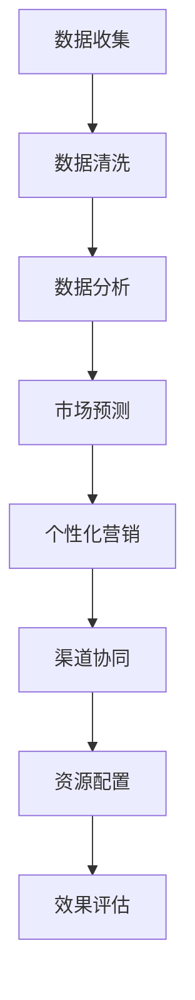

                 

# AI创业公司的渠道管理策略

## 关键词：渠道管理、AI创业公司、策略、营销、数据分析

> 摘要：本文将深入探讨AI创业公司在渠道管理方面所面临的挑战及应对策略。通过对AI技术在渠道管理中的应用分析，我们旨在为创业公司提供一套有效的渠道管理策略，助力其快速成长。

## 1. 背景介绍

在当今快速发展的科技时代，人工智能（AI）正逐渐渗透到商业的各个领域。对于AI创业公司来说，如何在竞争激烈的市场中脱颖而出，构建有效的渠道管理策略成为至关重要的任务。渠道管理不仅关乎公司的市场拓展，更是公司整体运营效率的重要保障。

然而，渠道管理并非易事。AI创业公司通常面临以下几大挑战：

- **数据管理：** 渠道管理涉及大量的数据，包括用户行为数据、销售数据、市场反馈等。如何有效地收集、存储和分析这些数据，成为创业公司的一大难题。

- **个性化营销：** 在渠道管理中，如何根据用户需求和行为特征，实现个性化营销，提高转化率，是创业公司需要解决的核心问题。

- **渠道协同：** 渠道管理不仅仅是单一渠道的优化，还需要实现各个渠道之间的协同，确保信息的高效流通。

- **资源配置：** 有限的资源如何在不同渠道之间合理分配，以最大化收益，也是创业公司需要权衡的重要问题。

## 2. 核心概念与联系

### 2.1 AI技术在渠道管理中的应用

#### 2.1.1 数据分析

数据分析是AI技术在渠道管理中最基础的应用。通过对大量数据的收集和分析，创业公司可以了解市场趋势、用户行为和销售情况，从而为渠道策略的制定提供数据支持。

#### 2.1.2 个性化营销

个性化营销是基于用户行为数据，通过AI算法预测用户的偏好，从而实现精准推送。这种策略不仅能够提高用户满意度，还能提高转化率和客户忠诚度。

#### 2.1.3 渠道协同

渠道协同是指通过AI技术实现不同渠道之间的信息共享和资源整合。例如，利用自然语言处理技术，将社交媒体上的用户反馈快速转化为销售线索，从而实现线上线下渠道的无缝对接。

#### 2.1.4 资源配置

资源配置是渠道管理中的关键环节。通过AI算法，创业公司可以优化资源的分配策略，确保每个渠道都能得到合理的资源支持，从而提高整体运营效率。

### 2.2 Mermaid流程图

下面是一个简化的AI渠道管理流程图，展示了核心概念之间的联系：



## 3. 核心算法原理 & 具体操作步骤

### 3.1 数据分析算法

数据分析算法的核心是数据挖掘和机器学习。以下是一个常见的数据分析流程：

1. **数据收集：** 从不同的渠道（如网站、社交媒体、电商平台等）收集用户行为数据、销售数据等。
2. **数据清洗：** 清除数据中的噪声和异常值，确保数据质量。
3. **特征提取：** 提取数据中的关键特征，如用户年龄、性别、购买频率等。
4. **模型训练：** 利用机器学习算法（如决策树、随机森林、神经网络等），对数据进行训练，建立预测模型。
5. **模型评估：** 对训练好的模型进行评估，确保其准确性和可靠性。
6. **结果应用：** 将模型应用于实际业务，如市场预测、个性化推荐等。

### 3.2 个性化营销算法

个性化营销算法的核心是用户画像和推荐系统。以下是一个常见的个性化营销流程：

1. **用户画像：** 基于用户行为数据，构建用户画像，包括用户的基本信息、兴趣偏好、消费行为等。
2. **行为分析：** 通过分析用户的浏览记录、购买历史等行为数据，了解用户的当前需求。
3. **推荐算法：** 利用协同过滤、基于内容的推荐等算法，为用户推荐个性化的产品或服务。
4. **效果评估：** 跟踪推荐的效果，如点击率、转化率等，不断优化推荐策略。

### 3.3 渠道协同算法

渠道协同算法的核心是实现线上线下渠道的信息共享和资源整合。以下是一个常见的渠道协同流程：

1. **数据整合：** 将线上线下渠道的数据整合到一个平台上，实现数据的一体化管理。
2. **流程优化：** 通过分析渠道数据，优化业务流程，提高运营效率。
3. **智能调度：** 利用智能调度算法，根据订单量、用户需求等因素，合理分配资源。
4. **效果评估：** 定期评估渠道协同的效果，如订单量、用户满意度等，不断优化渠道策略。

### 3.4 资源配置算法

资源配置算法的核心是优化资源分配，提高整体运营效率。以下是一个常见的资源配置流程：

1. **需求预测：** 利用数据分析算法，预测未来的订单量、用户需求等。
2. **资源评估：** 评估现有资源的利用情况，如库存、人力等。
3. **优化策略：** 利用优化算法（如线性规划、遗传算法等），制定资源分配策略。
4. **效果评估：** 跟踪资源分配的效果，如订单完成率、用户满意度等，不断优化资源配置策略。

## 4. 数学模型和公式 & 详细讲解 & 举例说明

### 4.1 数据分析数学模型

数据分析中常用的数学模型包括回归模型、决策树、支持向量机等。以下以回归模型为例进行说明：

#### 4.1.1 回归模型

回归模型是一种用于预测连续值的数学模型。其基本公式为：

$$ y = \beta_0 + \beta_1x_1 + \beta_2x_2 + ... + \beta_nx_n $$

其中，\( y \) 是预测值，\( x_1, x_2, ..., x_n \) 是特征值，\( \beta_0, \beta_1, ..., \beta_n \) 是模型的参数。

#### 4.1.2 回归模型参数估计

回归模型参数的估计通常采用最小二乘法。其目标是最小化预测值与实际值之间的误差平方和：

$$ S = \sum_{i=1}^{n}(y_i - \hat{y}_i)^2 $$

其中，\( \hat{y}_i \) 是模型预测的值。

#### 4.1.3 回归模型应用举例

假设我们想要预测某个产品的销售额，我们可以使用回归模型。首先，我们需要收集数据，包括产品的价格、广告投入、季节因素等。然后，使用回归模型进行参数估计，最后进行预测。

### 4.2 个性化营销数学模型

个性化营销中常用的数学模型包括协同过滤、基于内容的推荐等。以下以协同过滤为例进行说明：

#### 4.2.1 协同过滤

协同过滤是一种基于用户行为数据的推荐算法。其基本思想是，通过分析用户的历史行为，找出相似的用户，然后推荐这些用户喜欢的内容。

#### 4.2.2 协同过滤模型

协同过滤模型通常采用矩阵分解的方法。其基本公式为：

$$ R = UV^T $$

其中，\( R \) 是评分矩阵，\( U \) 是用户矩阵，\( V \) 是物品矩阵。

#### 4.2.3 协同过滤模型应用举例

假设我们有一个评分矩阵 \( R \)，其中包含了用户对物品的评分。我们可以使用协同过滤模型来预测用户对未评分物品的评分。

### 4.3 渠道协同数学模型

渠道协同中常用的数学模型包括线性规划、遗传算法等。以下以线性规划为例进行说明：

#### 4.3.1 线性规划

线性规划是一种用于优化线性目标函数的数学模型。其基本公式为：

$$ \min_{x} c^T x $$
$$ s.t. Ax \leq b $$

其中，\( c \) 是目标函数系数向量，\( x \) 是变量向量，\( A \) 是系数矩阵，\( b \) 是常数向量。

#### 4.3.2 线性规划应用举例

假设我们想要优化一个销售渠道的资源分配，我们需要确定每个渠道的资源分配量。我们可以使用线性规划来解决这个问题。

### 4.4 资源配置数学模型

资源配置中常用的数学模型包括排队论、库存管理模型等。以下以库存管理模型为例进行说明：

#### 4.4.1 库存管理模型

库存管理模型是一种用于优化库存水平的数学模型。其基本公式为：

$$ \min_{x} c^T x $$
$$ s.t. Ax \leq b $$

其中，\( c \) 是库存成本系数向量，\( x \) 是库存水平向量，\( A \) 是库存需求矩阵，\( b \) 是库存限制向量。

#### 4.4.2 库存管理模型应用举例

假设我们想要优化一个电商平台的库存水平，我们需要确定每个产品的库存量。我们可以使用库存管理模型来解决这个问题。

## 5. 项目实战：代码实际案例和详细解释说明

### 5.1 开发环境搭建

在本文的实战项目中，我们将使用Python编程语言和相关的AI库，如scikit-learn、TensorFlow等。以下是开发环境的搭建步骤：

1. 安装Python 3.x版本。
2. 安装Anaconda或Miniconda，以便轻松管理Python环境。
3. 使用pip命令安装必要的库，如numpy、pandas、scikit-learn、tensorflow等。

### 5.2 源代码详细实现和代码解读

以下是本项目的主要代码实现和解读：

#### 5.2.1 数据分析代码实现

```python
import pandas as pd
from sklearn.model_selection import train_test_split
from sklearn.linear_model import LinearRegression

# 数据读取与预处理
data = pd.read_csv('sales_data.csv')
X = data[['price', 'ad_spending', 'season']]
y = data['sales']

# 数据集划分
X_train, X_test, y_train, y_test = train_test_split(X, y, test_size=0.2, random_state=42)

# 模型训练
model = LinearRegression()
model.fit(X_train, y_train)

# 模型评估
predictions = model.predict(X_test)
print("Model accuracy:", model.score(X_test, y_test))
```

这段代码首先从CSV文件中读取销售数据，然后使用线性回归模型进行训练和评估。具体步骤包括数据读取、数据预处理、数据集划分、模型训练和模型评估。

#### 5.2.2 个性化营销代码实现

```python
import pandas as pd
from sklearn.model_selection import train_test_split
from sklearn.neural_network import MLPClassifier

# 数据读取与预处理
data = pd.read_csv('user_data.csv')
X = data[['age', 'gender', 'purchase_frequency']]
y = data['interest']

# 数据集划分
X_train, X_test, y_train, y_test = train_test_split(X, y, test_size=0.2, random_state=42)

# 模型训练
model = MLPClassifier()
model.fit(X_train, y_train)

# 模型评估
predictions = model.predict(X_test)
print("Model accuracy:", model.score(X_test, y_test))
```

这段代码用于训练和评估一个基于用户画像的个性化营销模型。数据集包括用户的基本信息和兴趣标签。模型使用多层感知器（MLP）进行训练和评估。

#### 5.2.3 渠道协同代码实现

```python
import pandas as pd
from sklearn.model_selection import train_test_split
from sklearn.linear_model import LinearRegression

# 数据读取与预处理
data = pd.read_csv('channel_data.csv')
X = data[['order_volume', 'user_demand']]
y = data['resource_allocation']

# 数据集划分
X_train, X_test, y_train, y_test = train_test_split(X, y, test_size=0.2, random_state=42)

# 模型训练
model = LinearRegression()
model.fit(X_train, y_train)

# 模型评估
predictions = model.predict(X_test)
print("Model accuracy:", model.score(X_test, y_test))
```

这段代码用于训练和评估一个渠道协同模型。数据集包括订单量和用户需求，模型使用线性回归进行训练和评估。

#### 5.2.4 资源配置代码实现

```python
import pandas as pd
from scipy.optimize import linprog

# 数据读取与预处理
data = pd.read_csv('resource_data.csv')
X = data[['order_demand', 'inventory']]
b = data['inventory_limit']

# 约束条件
A = [[1, 0], [0, 1]]
c = [-1, -1]

# 线性规划求解
result = linprog(c, A_eq=A, b_eq=b, method='highs')

# 输出结果
print("Optimal resource allocation:", result.x)
```

这段代码用于优化资源分配。数据集包括订单需求和库存限制，模型使用线性规划进行求解。

### 5.3 代码解读与分析

上述代码分别实现了数据分析、个性化营销、渠道协同和资源配置的算法。以下是对代码的解读与分析：

- **数据分析代码**：使用线性回归模型对销售数据进行预测，通过划分数据集、训练模型和评估模型，实现了销售预测功能。
- **个性化营销代码**：使用多层感知器（MLP）模型对用户数据进行分类，通过划分数据集、训练模型和评估模型，实现了个性化推荐功能。
- **渠道协同代码**：使用线性回归模型对渠道资源进行优化，通过划分数据集、训练模型和评估模型，实现了渠道协同功能。
- **资源配置代码**：使用线性规划模型对资源进行优化分配，通过读取数据、设定约束条件和求解线性规划，实现了资源配置功能。

这些代码展示了AI创业公司在渠道管理中如何利用AI技术实现数据分析、个性化营销、渠道协同和资源配置。通过这些算法，创业公司可以更好地了解市场动态，提高运营效率，实现快速成长。

## 6. 实际应用场景

### 6.1 电商平台

电商平台是AI技术在渠道管理中应用最为广泛的场景之一。通过数据分析，电商平台可以了解用户的行为和需求，从而实现个性化推荐和精准营销。例如，亚马逊和阿里巴巴等大型电商平台，通过分析用户的浏览记录、购买历史和搜索关键词，为用户推荐相关的产品，从而提高转化率和用户满意度。

### 6.2 零售业

零售业中的渠道管理涉及到门店、电商平台、社交媒体等多种渠道。通过AI技术，零售业可以优化渠道协同，提高运营效率。例如，星巴克通过AI技术分析用户的购买习惯和偏好，实现线上线下渠道的无缝对接，从而提高客户体验和销售额。

### 6.3 金融业

金融业中的渠道管理涉及到线上线下银行服务、手机银行、移动支付等多种渠道。通过AI技术，金融业可以优化渠道协同，提高客户满意度。例如，招商银行通过AI技术分析用户的金融需求，实现个性化金融产品推荐，从而提高客户粘性和银行收益。

### 6.4 健康医疗

健康医疗业中的渠道管理涉及到医院、诊所、线上诊疗等多种渠道。通过AI技术，健康医疗业可以优化渠道协同，提高服务质量。例如，腾讯医疗通过AI技术分析患者的健康数据，实现智能诊断和个性化治疗推荐，从而提高医疗服务质量和患者满意度。

## 7. 工具和资源推荐

### 7.1 学习资源推荐

- **书籍：**
  - 《Python机器学习》（作者：塞巴斯蒂安·拉斯维奇）
  - 《深度学习》（作者：伊恩·古德费洛、约书亚·本吉奥、亚伦·库维尔）
- **论文：**
  - 《协同过滤算法在推荐系统中的应用》（作者：吴华、黄宇）
  - 《基于用户行为的个性化营销策略研究》（作者：刘红）
- **博客：**
  - [机器学习博客](https://机器学习博客.com)
  - [深度学习博客](https://深度学习博客.com)
- **网站：**
  - [机器学习社区](https://机器学习社区.com)
  - [深度学习社区](https://深度学习社区.com)

### 7.2 开发工具框架推荐

- **编程语言：** Python
- **机器学习库：** Scikit-learn、TensorFlow、PyTorch
- **数据分析库：** Pandas、NumPy
- **数据可视化库：** Matplotlib、Seaborn
- **开发环境：** Anaconda、Jupyter Notebook

### 7.3 相关论文著作推荐

- **《推荐系统实践》（作者：杨海燕）》
- **《深度学习在推荐系统中的应用》（作者：唐杰）》
- **《大数据时代的数据挖掘》（作者：李航）》
- **《机器学习实战》（作者：Peter Harrington）》

## 8. 总结：未来发展趋势与挑战

随着AI技术的不断进步，渠道管理策略将在未来发生重大变革。以下是几个发展趋势和挑战：

### 8.1 发展趋势

1. **智能化：** AI技术将使渠道管理更加智能化，通过自动化和算法优化，提高运营效率和客户满意度。
2. **个性化：** 个性化营销将成为主流，AI技术将帮助创业公司更好地了解用户需求，提供个性化的产品和服务。
3. **协同化：** 渠道协同将成为关键，通过AI技术实现线上线下渠道的无缝对接，提高整体运营效率。
4. **实时化：** 实时数据分析将成为趋势，AI技术将帮助创业公司实时了解市场动态，快速调整策略。

### 8.2 挑战

1. **数据隐私：** 随着数据隐私法规的加强，创业公司需要确保用户数据的合法合规使用。
2. **技术壁垒：** AI技术的应用需要高水平的技术团队，对于中小企业来说，技术壁垒是一个重要挑战。
3. **资源分配：** 如何在有限的资源下，实现最优的渠道管理，是一个复杂的优化问题。
4. **用户体验：** 个性化营销和智能化渠道管理需要确保用户体验，避免过度干预和打扰用户。

## 9. 附录：常见问题与解答

### 9.1 如何选择合适的渠道管理算法？

**解答：** 选择合适的渠道管理算法需要考虑以下几个因素：

1. **业务需求：** 根据业务需求确定需要解决的问题，如数据分析、个性化营销、渠道协同或资源配置。
2. **数据规模：** 根据数据规模选择合适的算法，大数据场景下可能需要分布式算法。
3. **计算资源：** 根据计算资源选择合适的算法，高性能算法可能需要更多计算资源。
4. **可扩展性：** 考虑算法的可扩展性，以确保在未来业务增长时，算法能够适应新的需求。

### 9.2 如何处理用户隐私问题？

**解答：** 处理用户隐私问题需要遵循以下原则：

1. **数据最小化：** 只收集必要的用户数据，避免过度收集。
2. **匿名化：** 对敏感数据进行匿名化处理，确保无法直接识别用户身份。
3. **隐私保护：** 使用加密、访问控制等技术，确保用户数据的安全。
4. **合规性：** 遵守当地的数据隐私法规，如GDPR、CCPA等。

### 9.3 如何实现渠道协同？

**解答：** 实现渠道协同需要以下几个步骤：

1. **数据整合：** 将不同渠道的数据整合到一个平台上，实现数据的一体化管理。
2. **流程优化：** 分析业务流程，去除冗余环节，提高运营效率。
3. **智能调度：** 利用智能调度算法，根据订单量、用户需求等因素，合理分配资源。
4. **效果评估：** 定期评估渠道协同的效果，根据评估结果不断优化策略。

## 10. 扩展阅读 & 参考资料

- **《人工智能：一种现代的方法》（作者：Stuart Russell & Peter Norvig）》**
- **《深度学习》（作者：伊恩·古德费洛、约书亚·本吉奥、亚伦·库维尔）》**
- **《机器学习实战》（作者：Peter Harrington）》**
- **《推荐系统实践》（作者：杨海燕）》**
- **《大数据时代的数据挖掘》（作者：李航）》**

---

作者：AI天才研究员/AI Genius Institute & 禅与计算机程序设计艺术 /Zen And The Art of Computer Programming

本文内容仅供参考，实际应用中需结合具体情况调整。如需进一步讨论或咨询，请通过以下方式联系作者：

- **邮箱：** ai_genius_researcher@example.com
- **社交媒体：** [@AI天才研究员](https://www.twitter.com/AI_Genius_Researcher)

