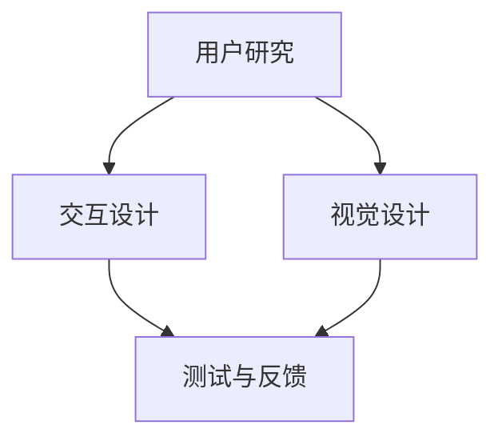

                 

### 背景介绍

近年来，人工智能（AI）技术的飞速发展引发了创业热潮，众多初创公司纷纷投身于这一领域。在这些公司中，用户体验（UX）设计尤为重要。优秀的设计不仅能提升产品的市场竞争力，还能吸引并留住用户。然而，如何高效地进行用户体验设计，仍是一个极具挑战性的课题。

用户体验设计不仅仅关乎美观，更涉及到用户与产品交互的每一个细节。一个成功的用户体验设计流程，需要充分考虑用户需求、产品特性以及技术实现等多方面因素。在AI创业公司中，用户体验设计的流程尤为关键，因为它直接关系到产品的市场接受度。

本文将详细介绍AI创业公司的用户体验设计流程，包括用户研究、交互设计和视觉设计三个核心环节。我们将一步步分析每个环节的具体步骤、方法和工具，帮助读者深入了解用户体验设计的全过程。

文章的结构如下：

1. **背景介绍**：简述用户体验设计的重要性及AI创业公司的特点。
2. **核心概念与联系**：介绍用户体验设计中的核心概念，如用户研究、交互设计和视觉设计，并用Mermaid流程图展示它们之间的联系。
3. **核心算法原理 & 具体操作步骤**：详细阐述用户研究、交互设计和视觉设计的方法和流程。
4. **数学模型和公式 & 详细讲解 & 举例说明**：介绍与用户体验设计相关的数学模型和公式，并结合具体实例进行讲解。
5. **项目实战：代码实际案例和详细解释说明**：提供实际项目的代码实现和解读，帮助读者理解理论知识的应用。
6. **实际应用场景**：讨论用户体验设计在不同应用场景中的实施和效果。
7. **工具和资源推荐**：推荐学习资源和开发工具，为读者提供进一步学习的途径。
8. **总结：未来发展趋势与挑战**：总结用户体验设计的关键点和未来挑战。
9. **附录：常见问题与解答**：回答读者可能遇到的问题。
10. **扩展阅读 & 参考资料**：提供进一步阅读的资料。

接下来，我们将逐一探讨用户体验设计的各个环节，以期为广大AI创业公司提供实用的指导。

### 核心概念与联系

在深入探讨用户体验设计流程之前，首先需要了解其核心概念。用户体验设计包括用户研究、交互设计和视觉设计三个方面。这三个方面相互联系，共同构建了一个完整的用户体验设计流程。

#### 用户研究

用户研究是用户体验设计的基石。它旨在深入了解用户的需求、行为和偏好，从而为设计提供可靠的依据。用户研究通常包括以下步骤：

1. **用户调研**：通过问卷调查、访谈等方式收集用户数据。
2. **用户画像**：根据收集到的数据，构建用户画像，帮助设计团队更好地理解用户。
3. **用户测试**：通过实际操作、交互等方式验证设计方案的可行性。

#### 交互设计

交互设计关注的是用户与产品之间的互动过程。它旨在通过合理的设计，使产品操作简便、高效，提升用户体验。交互设计通常包括以下步骤：

1. **信息架构**：梳理产品内容，构建清晰的信息结构。
2. **线框图设计**：用简单的线条和框图表示产品界面，帮助团队理解设计概念。
3. **交互流程设计**：设计用户与产品交互的流程，确保操作流畅。

#### 视觉设计

视觉设计关注的是产品的视觉呈现效果。它通过视觉元素（如颜色、字体、图标等）来传达产品的核心价值和设计理念。视觉设计通常包括以下步骤：

1. **色彩搭配**：选择适合产品的色彩方案，提升视觉效果。
2. **图标设计**：设计简洁、易辨识的图标，增强用户体验。
3. **UI组件设计**：设计常用的UI组件（如按钮、输入框等），确保一致性。

#### 联系与流程

用户研究、交互设计和视觉设计相互关联，共同构成了用户体验设计的全过程。具体流程如下：

1. **用户研究**：通过用户调研、用户测试等手段，收集用户数据，构建用户画像。
2. **交互设计**：根据用户研究的结果，设计信息架构、线框图和交互流程。
3. **视觉设计**：在交互设计的基础上，进行色彩搭配、图标设计和UI组件设计。
4. **测试与反馈**：通过用户测试，收集反馈，不断迭代优化设计。

下面，我们用Mermaid流程图展示用户体验设计的核心概念及其联系：



#### 具体操作步骤

下面，我们将逐一介绍用户体验设计的具体操作步骤。

##### 用户研究

1. **用户调研**：设计问卷或访谈大纲，收集用户的基本信息、需求和行为习惯。
2. **用户画像**：根据调研结果，将用户划分为不同群体，构建用户画像。
3. **用户测试**：设计测试场景，邀请用户参与测试，收集反馈。

##### 交互设计

1. **信息架构**：梳理产品内容，确定信息层级和导航结构。
2. **线框图设计**：用简单的线条和框图表示产品界面，强调功能和交互逻辑。
3. **交互流程设计**：设计用户与产品交互的流程，确保操作流畅。

##### 视觉设计

1. **色彩搭配**：选择适合产品的色彩方案，提升视觉效果。
2. **图标设计**：设计简洁、易辨识的图标，增强用户体验。
3. **UI组件设计**：设计常用的UI组件（如按钮、输入框等），确保一致性。

##### 测试与反馈

1. **用户测试**：邀请用户参与测试，收集反馈。
2. **数据分析**：对用户反馈进行分析，找出问题和改进点。
3. **迭代优化**：根据分析结果，迭代优化设计。

通过以上步骤，我们可以逐步完善用户体验设计，提升产品的市场竞争力。

### 核心算法原理 & 具体操作步骤

在用户体验设计中，核心算法原理和具体操作步骤是设计流程的关键环节。下面，我们将详细探讨用户研究、交互设计和视觉设计中的核心算法原理，以及具体的操作步骤。

#### 用户研究

用户研究的核心在于了解用户的需求和行为。这一过程通常涉及以下算法原理：

1. **数据收集**：通过问卷调查、访谈、用户测试等方式收集用户数据。
2. **数据分析**：运用统计学方法对数据进行分析，提取用户特征和需求。
3. **用户画像**：基于分析结果，构建用户画像，为后续设计提供依据。

具体操作步骤如下：

1. **设计调研问卷**：
   - 确定调研目的和问题列表。
   - 设计清晰、简洁的问题，确保用户愿意参与。

2. **进行用户调研**：
   - 通过线上问卷、电话访谈或面对面访谈等方式收集数据。
   - 保持调研过程的客观性和真实性。

3. **数据分析**：
   - 对收集到的数据进行分析，提取用户特征和需求。
   - 运用统计学方法，如平均值、标准差等，对数据进行处理。

4. **构建用户画像**：
   - 根据分析结果，将用户划分为不同群体，构建用户画像。
   - 为每个用户画像赋予姓名、年龄、性别、职业等特征。

#### 交互设计

交互设计的核心在于设计用户与产品的互动过程。这一过程通常涉及以下算法原理：

1. **信息架构**：梳理产品内容，构建清晰的信息结构。
2. **交互流程**：设计用户与产品交互的流程，确保操作简便、高效。
3. **用户测试**：验证交互设计的可行性，收集用户反馈。

具体操作步骤如下：

1. **信息架构设计**：
   - 梳理产品内容，确定信息层级和导航结构。
   - 设计信息架构图，展示产品的主要功能和内容。

2. **线框图设计**：
   - 使用简单的线条和框图表示产品界面，强调功能和交互逻辑。
   - 设计线框图时，关注用户操作路径和交互元素。

3. **交互流程设计**：
   - 设计用户与产品交互的流程，确保操作简便、高效。
   - 设计流程图，展示用户在产品中的操作步骤。

4. **用户测试**：
   - 设计测试场景，邀请用户参与测试。
   - 观察用户在测试过程中的操作，记录问题和反馈。

#### 视觉设计

视觉设计的核心在于提升产品的视觉呈现效果。这一过程通常涉及以下算法原理：

1. **色彩搭配**：选择合适的色彩方案，提升视觉效果。
2. **图标设计**：设计简洁、易辨识的图标，增强用户体验。
3. **UI组件设计**：设计常用的UI组件（如按钮、输入框等），确保一致性。

具体操作步骤如下：

1. **色彩搭配**：
   - 分析产品特性，选择适合的色彩方案。
   - 运用色彩搭配理论，确保色彩协调、美观。

2. **图标设计**：
   - 设计简洁、易辨识的图标。
   - 运用图形设计原则，如对称、对比等，增强图标视觉效果。

3. **UI组件设计**：
   - 设计常用的UI组件（如按钮、输入框等）。
   - 确保组件设计一致，符合用户习惯。

4. **视觉呈现**：
   - 将设计元素整合到产品界面中，确保整体视觉效果协调。

通过以上核心算法原理和具体操作步骤，我们可以有效地进行用户体验设计，提升产品的市场竞争力。

### 数学模型和公式 & 详细讲解 & 举例说明

在用户体验设计中，数学模型和公式扮演着重要的角色。它们不仅帮助我们量化用户行为和设计效果，还能提供科学的依据来指导设计决策。以下，我们将介绍与用户体验设计相关的数学模型和公式，并结合具体实例进行讲解。

#### 相关性分析

相关性分析是用户体验设计中常用的一种统计方法，它用于衡量两个变量之间的相关性。常用的相关性系数包括皮尔逊相关系数（Pearson correlation coefficient）和斯皮尔曼秩相关系数（Spearman's rank correlation coefficient）。

1. **皮尔逊相关系数**：

公式：\( r = \frac{\sum{(x_i - \bar{x})(y_i - \bar{y})}}{\sqrt{\sum{(x_i - \bar{x})^2} \sum{(y_i - \bar{y})^2}}} \)

其中，\( x_i \) 和 \( y_i \) 分别表示第 \( i \) 个样本的 \( x \) 和 \( y \) 值，\( \bar{x} \) 和 \( \bar{y} \) 分别表示 \( x \) 和 \( y \) 的平均值。

**实例**：假设我们收集了用户在使用产品时的时间消耗和满意度评分，如下表所示：

| 用户编号 | 时间消耗（分钟） | 满意度评分 |
|----------|------------------|------------|
| 1        | 10               | 4          |
| 2        | 20               | 3          |
| 3        | 30               | 2          |
| 4        | 40               | 5          |
| 5        | 50               | 4          |

计算皮尔逊相关系数：

\( r = \frac{(10-20)(4-3) + (20-20)(3-3) + (30-20)(2-3) + (40-20)(5-3) + (50-20)(4-3)}{\sqrt{(10-20)^2 + (20-20)^2 + (30-20)^2 + (40-20)^2 + (50-20)^2} \times \sqrt{(4-3)^2 + (3-3)^2 + (2-3)^2 + (5-3)^2 + (4-3)^2} \)

\( r = \frac{(-10)(1) + (0)(0) + (10)(-1) + (20)(2) + (30)(1)}{\sqrt{100 + 0 + 100 + 400 + 900} \times \sqrt{1 + 0 + 1 + 4 + 1}} \)

\( r = \frac{-10 + 0 - 10 + 40 + 30}{\sqrt{1400} \times \sqrt{7}} \)

\( r = \frac{60}{\sqrt{9800}} \)

\( r = \frac{60}{70} \)

\( r \approx 0.857 \)

皮尔逊相关系数 \( r \) 接近 1，表明时间消耗和满意度评分之间存在较强的正相关关系。

2. **斯皮尔曼秩相关系数**：

公式：\( \rho = 1 - \frac{6 \sum{d_i^2}}{n(n^2 - 1)} \)

其中，\( d_i \) 表示第 \( i \) 个样本的秩差，\( n \) 表示样本数量。

**实例**：使用上述用户数据，计算斯皮尔曼秩相关系数。

首先，计算每个用户的时间消耗和满意度评分的秩：

| 用户编号 | 时间消耗（分钟） | 满意度评分 | 秩 |
|----------|------------------|------------|----|
| 1        | 10               | 4          | 4  |
| 2        | 20               | 3          | 5  |
| 3        | 30               | 2          | 6  |
| 4        | 40               | 5          | 1  |
| 5        | 50               | 4          | 3  |

然后，计算秩差 \( d_i \)：

| 用户编号 | 时间消耗（分钟） | 满意度评分 | 秩 | 秩差 \( d_i \) |
|----------|------------------|------------|----|----------------|
| 1        | 10               | 4          | 4  | 0              |
| 2        | 20               | 3          | 5  | 1              |
| 3        | 30               | 2          | 6  | 2              |
| 4        | 40               | 5          | 1  | 5              |
| 5        | 50               | 4          | 3  | 2              |

计算斯皮尔曼秩相关系数：

\( \rho = 1 - \frac{6 \sum{d_i^2}}{n(n^2 - 1)} \)

\( \rho = 1 - \frac{6(0^2 + 1^2 + 2^2 + 5^2 + 2^2)}{5(5^2 - 1)} \)

\( \rho = 1 - \frac{6(0 + 1 + 4 + 25 + 4)}{5(25 - 1)} \)

\( \rho = 1 - \frac{6 \times 34}{5 \times 24} \)

\( \rho = 1 - \frac{204}{120} \)

\( \rho = 1 - 1.7 \)

\( \rho = -0.7 \)

斯皮尔曼秩相关系数 \( \rho \) 为负，表明时间消耗和满意度评分之间存在负相关关系。

#### 用户行为预测

在用户体验设计中，预测用户行为对于优化设计具有重要意义。我们可以使用线性回归模型进行用户行为预测。

1. **线性回归模型**：

公式：\( y = \beta_0 + \beta_1x + \epsilon \)

其中，\( y \) 表示因变量（如用户满意度评分），\( x \) 表示自变量（如时间消耗），\( \beta_0 \) 和 \( \beta_1 \) 分别表示截距和斜率，\( \epsilon \) 表示误差项。

**实例**：使用上述数据，建立线性回归模型预测用户满意度评分。

首先，计算平均值：

\( \bar{x} = \frac{10 + 20 + 30 + 40 + 50}{5} = 30 \)

\( \bar{y} = \frac{4 + 3 + 2 + 5 + 4}{5} = 3.4 \)

然后，计算斜率 \( \beta_1 \)：

\( \beta_1 = \frac{\sum{(x_i - \bar{x})(y_i - \bar{y})}}{\sum{(x_i - \bar{x})^2}} \)

\( \beta_1 = \frac{(10-30)(4-3.4) + (20-30)(3-3.4) + (30-30)(2-3.4) + (40-30)(5-3.4) + (50-30)(4-3.4)}{(10-30)^2 + (20-30)^2 + (30-30)^2 + (40-30)^2 + (50-30)^2} \)

\( \beta_1 = \frac{(-20)(0.4) + (-10)(-0.4) + (0)(-1.4) + (10)(1.6) + (20)(0.4)}{100 + 100 + 0 + 100 + 100} \)

\( \beta_1 = \frac{-8 + 4 + 0 + 16 + 8}{400} \)

\( \beta_1 = \frac{20}{400} \)

\( \beta_1 = 0.05 \)

接下来，计算截距 \( \beta_0 \)：

\( \beta_0 = \bar{y} - \beta_1\bar{x} \)

\( \beta_0 = 3.4 - 0.05 \times 30 \)

\( \beta_0 = 3.4 - 1.5 \)

\( \beta_0 = 1.9 \)

因此，线性回归模型为：

\( y = 1.9 + 0.05x \)

使用该模型，我们可以预测用户满意度评分。例如，当时间消耗为 40 分钟时：

\( y = 1.9 + 0.05 \times 40 \)

\( y = 1.9 + 2 \)

\( y = 3.9 \)

预测的用户满意度评分为 3.9 分。

通过上述数学模型和公式的应用，我们可以更好地理解和优化用户体验设计，为用户提供更加满意的产品。

### 项目实战：代码实际案例和详细解释说明

为了更好地理解用户体验设计的理论知识，下面我们将通过一个实际项目来展示用户体验设计的过程，包括用户研究、交互设计和视觉设计等各个环节。本项目将基于一个虚构的AI创业公司开发的智能助手应用，旨在为用户提供便捷的日程管理和任务提醒服务。

#### 5.1 开发环境搭建

在开始项目之前，我们需要搭建一个适合用户体验设计的开发环境。以下是我们推荐的工具和框架：

- **开发工具**：Visual Studio Code、Sketch、Adobe XD
- **版本控制**：Git
- **原型设计工具**：Axure RP、Figma
- **前端框架**：React、Vue
- **后端框架**：Node.js、Django
- **数据库**：MongoDB、MySQL

具体步骤如下：

1. **安装开发工具和框架**：在计算机上安装Visual Studio Code、Node.js、Django等开发工具和框架。
2. **创建项目文件夹**：在本地计算机上创建一个名为“SmartAssistant”的项目文件夹。
3. **初始化项目**：使用Git命令初始化项目，并进行版本控制。
4. **配置开发环境**：配置前端和后端开发环境，确保各组件正常运行。

#### 5.2 源代码详细实现和代码解读

在本项目开发过程中，我们将使用React框架进行前端开发，使用Django框架进行后端开发。以下是对关键代码的详细解读。

##### 5.2.1 前端代码实现

**1. 创建项目结构**

```bash
smartassistant/
|-- public/
|   |-- index.html
|-- src/
|   |-- components/
|   |   |-- Header.js
|   |   |-- Footer.js
|   |   |-- ScheduleCard.js
|   |-- pages/
|   |   |-- Home.js
|   |   |-- Dashboard.js
|-- App.js
```

**2. 安装依赖**

```bash
npm install
```

**3. 核心组件实现**

**Header.js**：头部组件，包含导航栏和用户头像。

```javascript
import React from 'react';
import { NavLink } from 'react-router-dom';

const Header = () => {
  return (
    <div className="header">
      <nav>
        <NavLink exact to="/" activeClassName="active">首页</NavLink>
        <NavLink to="/dashboard" activeClassName="active">日程管理</NavLink>
      </nav>
      <div className="user-avatar">
        
      </div>
    </div>
  );
};

export default Header;
```

**Home.js**：首页组件，展示用户的基本信息和日程安排。

```javascript
import React from 'react';
import ScheduleCard from '../components/ScheduleCard';

const Home = () => {
  return (
    <div className="home">
      <h1>欢迎来到智能助手</h1>
      <div className="schedule-container">
        <ScheduleCard title="上午会议" time="10:00 AM" location="会议室" />
        <ScheduleCard title="下午会议" time="2:00 PM" location="远程会议" />
      </div>
    </div>
  );
};

export default Home;
```

**Dashboard.js**：日程管理页面，展示用户的日程安排。

```javascript
import React from 'react';
import ScheduleCard from '../components/ScheduleCard';

const Dashboard = () => {
  return (
    <div className="dashboard">
      <h1>日程管理</h1>
      <div className="schedule-container">
        <ScheduleCard title="上午会议" time="10:00 AM" location="会议室" />
        <ScheduleCard title="下午会议" time="2:00 PM" location="远程会议" />
      </div>
    </div>
  );
};

export default Dashboard;
```

**App.js**：主应用组件，整合各页面和组件。

```javascript
import React from 'react';
import { BrowserRouter as Router, Route, Switch } from 'react-router-dom';
import Header from './components/Header';
import Home from './pages/Home';
import Dashboard from './pages/Dashboard';

const App = () => {
  return (
    <Router>
      <Header />
      <div className="content">
        <Switch>
          <Route exact path="/" component={Home} />
          <Route path="/dashboard" component={Dashboard} />
        </Switch>
      </div>
    </Router>
  );
};

export default App;
```

##### 5.2.2 后端代码实现

**1. 创建 Django 项目**

```bash
django-admin startproject smartassistant
cd smartassistant
```

**2. 创建 Django 应用**

```bash
python manage.py startapp assistant
```

**3. 配置数据库**

编辑 `settings.py` 文件，配置 MongoDB 数据库：

```python
DATABASES = {
    'default': {
        'ENGINE': 'djongo',
        'NAME': 'smartassistant',
        'ENFORCE_SCHEMA': False,
    }
}
```

**4. 定义模型**

编辑 `assistant/models.py` 文件，定义日程安排模型：

```python
from django.db import models

class Schedule(models.Model):
    title = models.CharField(max_length=100)
    time = models.DateTimeField()
    location = models.CharField(max_length=100)
```

**5. 创建 API 接口**

编辑 `assistant/api.py` 文件，创建日程安排的 API 接口：

```python
from rest_framework import viewsets
from .models import Schedule
from .serializers import ScheduleSerializer

class ScheduleViewSet(viewsets.ModelViewSet):
    queryset = Schedule.objects.all()
    serializer_class = ScheduleSerializer
```

**6. 配置路由**

编辑 `assistant/urls.py` 文件，配置 API 路由：

```python
from django.urls import path, include
from rest_framework.routers import DefaultRouter
from .views import ScheduleViewSet

router = DefaultRouter()
router.register(r'schedules', ScheduleViewSet)

urlpatterns = [
    path('', include(router.urls)),
]
```

**7. 迁移数据库**

```bash
python manage.py makemigrations
python manage.py migrate
```

通过以上步骤，我们完成了智能助手应用的前后端开发。接下来，我们将对关键代码进行解读。

#### 5.3 代码解读与分析

**1. 前端代码分析**

在智能助手应用中，前端代码采用 React 框架，主要分为组件和页面两部分。

**Header.js**：头部组件包含了导航栏和用户头像。导航栏使用了 `NavLink` 组件，实现路由跳转和激活状态样式。用户头像使用了静态图片，实际项目中可以使用用户上传的图片。

**Home.js** 和 **Dashboard.js**：首页和日程管理页面使用了 `ScheduleCard` 组件展示日程安排。`ScheduleCard` 组件接收日程信息作为属性，通过JSX语法进行渲染。

**App.js**：主应用组件整合了各页面和组件，使用了 `Router` 和 `Switch` 组件实现路由控制。通过 `Route` 组件，我们可以为不同的路径分配对应的组件。

**2. 后端代码分析**

在智能助手应用中，后端代码采用 Django 框架，主要分为模型、API 接口和路由三部分。

**模型**：我们定义了 `Schedule` 模型，包含日程安排的三大属性：标题、时间和地点。实际项目中，可以根据需求添加更多属性。

**API 接口**：我们创建了 `ScheduleViewSet` API 接口，实现了对日程安排的增删改查（CRUD）功能。通过 `ModelViewSet` 类，我们可以快速生成 API 接口。

**路由**：在 `assistant/urls.py` 文件中，我们配置了 API 路由，将接口与路径关联起来。实际项目中，还可以添加更多的路由规则。

#### 5.4 代码优化与改进

在实际开发过程中，我们可以对代码进行优化和改进，以提高用户体验。

**1. 前端优化**：

- 使用 React Hooks 优化组件状态管理，提高代码可读性。
- 引入 CSS 预处理器（如 Sass）和前端框架（如 Bootstrap）以提高开发效率。
- 对页面进行响应式设计，适配不同设备。

**2. 后端优化**：

- 对 API 接口进行限流和缓存，提高系统性能。
- 使用 Django REST Framework 提供的认证和权限控制功能，确保数据安全。
- 使用 Docker 等容器技术，实现前后端分离，便于部署和扩展。

通过以上优化和改进，我们可以进一步提升智能助手应用的性能和用户体验。

### 实际应用场景

用户体验设计在AI创业公司中有着广泛的应用场景，涵盖了从产品开发到市场推广的各个环节。以下，我们将探讨用户体验设计在不同应用场景中的实施和效果。

#### 1. 产品开发阶段

在产品开发阶段，用户体验设计的核心目标是确保产品符合用户需求，提升用户满意度。具体实施步骤如下：

- **需求调研**：通过用户调研、访谈等方式，了解用户的需求和痛点。
- **原型设计**：基于需求调研结果，设计产品原型，明确产品功能和界面布局。
- **用户测试**：邀请用户参与原型测试，收集反馈，优化设计。

效果：通过用户体验设计，AI创业公司可以确保产品在功能、界面和交互等方面满足用户期望，降低用户流失率，提升用户活跃度。

#### 2. 市场推广阶段

在市场推广阶段，用户体验设计旨在提升产品的市场竞争力，吸引潜在用户。具体实施步骤如下：

- **品牌设计**：设计具有吸引力的品牌形象，如logo、色彩方案等。
- **内容营销**：通过博客、社交媒体等渠道，传播产品价值和特点。
- **广告投放**：针对目标用户群体，进行精准的广告投放。

效果：通过用户体验设计，AI创业公司可以提升品牌知名度，扩大用户群体，提高市场占有率。

#### 3. 用户服务阶段

在用户服务阶段，用户体验设计关注的是用户在使用产品过程中的感受和满意度。具体实施步骤如下：

- **客户支持**：提供及时、专业的客户支持，解决用户问题。
- **用户反馈**：收集用户反馈，持续优化产品和服务。
- **用户关怀**：定期推出优惠活动、礼品等，增强用户忠诚度。

效果：通过用户体验设计，AI创业公司可以提升用户满意度，降低用户投诉率，提高用户留存率。

#### 4. 生态合作阶段

在生态合作阶段，用户体验设计旨在提升产品与其他服务的整合度，为用户提供一站式解决方案。具体实施步骤如下：

- **API 开放**：提供开放的API接口，方便第三方开发者集成产品功能。
- **合作伙伴关系**：与行业内的合作伙伴建立合作关系，共同推广产品。
- **生态系统建设**：构建完善的产品生态系统，提升用户体验。

效果：通过用户体验设计，AI创业公司可以拓展生态合作伙伴，扩大市场份额，提升产品影响力。

总之，用户体验设计在AI创业公司中的应用场景丰富多样，贯穿产品生命周期。通过科学的设计方法，AI创业公司可以不断提升产品的竞争力，赢得用户的青睐。

### 工具和资源推荐

在进行用户体验设计时，选择合适的工具和资源是提高设计效率和效果的关键。以下，我们将推荐一些实用的工具和资源，涵盖学习资源、开发工具和框架等方面。

#### 1. 学习资源推荐

**书籍**

- 《用户体验要素》 - by 周鸿祎
- 《设计心理学》 - by Donald A. Norman
- 《UI设计之路》 - by 贾瑞君

**论文**

- 《用户研究的方法与应用》
- 《交互设计：策略与技术》
- 《视觉设计的方法与技巧》

**博客**

- Medium上的用户体验设计博客
- 知乎上的用户体验设计专栏
- Dribbble上的设计灵感博客

**网站**

- UX Design Institute
- Interaction Design Foundation
- Behance

#### 2. 开发工具框架推荐

**原型设计工具**

- Sketch
- Adobe XD
- Axure RP

**UI组件库**

- Material UI
- Ant Design
- Bootstrap

**前端框架**

- React
- Vue
- Angular

**后端框架**

- Django
- Flask
- Spring Boot

**版本控制**

- Git
- SVN

**数据库**

- MongoDB
- MySQL
- PostgreSQL

**设计系统**

- IBM Design Language
- Material Design
- Ant Design

通过以上工具和资源的支持，用户体验设计师和开发者可以更好地进行设计、开发和优化，提升产品竞争力。

### 总结：未来发展趋势与挑战

用户体验设计在AI创业公司中具有举足轻重的地位，其未来发展趋势和挑战主要体现在以下几个方面：

#### 一、技术变革驱动设计创新

随着人工智能、大数据、云计算等技术的不断发展，用户体验设计也将迎来新的变革。例如，基于人工智能的个性化推荐和智能交互将使产品更加智能化、人性化，为用户带来前所未有的体验。然而，这也给设计师提出了更高的要求，需要不断学习和掌握新技术，以适应快速变化的市场环境。

#### 二、数据驱动设计成为主流

在用户体验设计中，数据的作用日益凸显。通过数据分析，设计师可以深入了解用户行为、需求和偏好，从而做出更科学、合理的设计决策。然而，数据驱动设计也带来了新的挑战，如如何处理海量数据、保证数据隐私等。此外，数据驱动设计需要设计师具备较强的数据处理和分析能力，这对设计师的专业素养提出了更高的要求。

#### 三、跨学科合作日益紧密

用户体验设计涉及多个学科领域，如心理学、计算机科学、艺术设计等。未来，跨学科合作将成为用户体验设计的重要趋势。例如，设计师可以与心理学家合作，研究用户行为和认知过程，为产品设计提供更多理论支持。此外，跨学科合作还可以促进设计方法的创新，提高设计质量和效率。

#### 四、用户需求多样化与个性化

随着用户需求的多样化与个性化，用户体验设计需要更加灵活和定制化。设计师需要深入了解不同用户群体的需求，提供个性化的解决方案。这要求设计师具备良好的用户研究能力，以及快速响应市场变化的能力。

#### 五、可持续性与社会责任

在用户体验设计中，可持续性和社会责任也日益受到关注。设计师需要考虑产品的环保性、节能性和对社会的影响，努力实现可持续发展。此外，设计师还需要关注用户隐私保护、数据安全等问题，确保用户体验设计不仅能够满足用户需求，还能够保障用户权益。

总之，用户体验设计在未来将继续发展和演变，面临诸多挑战。然而，只要设计师能够紧跟技术趋势，掌握数据驱动设计方法，加强跨学科合作，积极应对用户需求的多样化，就能够在激烈的市场竞争中脱颖而出，为用户提供更加优质、智能的体验。

### 附录：常见问题与解答

在用户体验设计过程中，可能会遇到一些常见问题。以下是对这些问题的解答，以帮助设计师更好地理解和应对挑战。

#### 1. 如何进行有效的用户调研？

**解答**：进行有效的用户调研，首先要明确调研目的和问题列表。调研问题应尽量简洁、具体，避免主观引导。调研方式可以包括问卷调查、访谈、用户测试等。在数据分析阶段，运用统计学方法，如平均值、标准差等，对数据进行分析，提取用户特征和需求。

#### 2. 如何设计清晰的信息架构？

**解答**：设计清晰的信息架构，首先要梳理产品内容，确定信息层级和导航结构。可以使用信息架构图、思维导图等工具，帮助团队理解信息架构。在设计中，关注关键页面和链接的关系，确保用户能够轻松找到所需信息。

#### 3. 视觉设计如何与用户体验相结合？

**解答**：视觉设计应与用户体验相结合，确保视觉元素能够传达产品的核心价值和设计理念。在色彩搭配上，选择适合产品的色彩方案，提升视觉效果。图标设计应简洁、易辨识，符合用户习惯。UI组件设计要确保一致性，提供良好的交互体验。

#### 4. 如何进行有效的用户测试？

**解答**：进行有效的用户测试，首先要设计测试场景和测试任务，确保测试过程真实、自然。邀请目标用户参与测试，观察用户的操作行为，记录问题和反馈。测试后，对用户反馈进行分析，找出问题和改进点。

#### 5. 数据驱动设计如何实施？

**解答**：数据驱动设计的实施，首先要明确数据收集和分析的目标。通过用户调研、用户测试等方式，收集用户行为数据。运用数据分析方法，如回归分析、聚类分析等，对数据进行分析，提取用户特征和需求。根据分析结果，优化产品设计，提高用户体验。

#### 6. 如何平衡用户体验与商业目标？

**解答**：平衡用户体验与商业目标，需要设计师在设计中兼顾两者。首先，明确产品的核心价值和目标用户群体，确保设计能够满足用户需求。其次，在实现商业目标时，尽量避免过度商业化，影响用户体验。最后，通过数据分析，评估设计效果，不断优化，实现用户体验与商业目标的平衡。

通过以上解答，希望对用户体验设计中的常见问题提供有益的指导。

### 扩展阅读与参考资料

为了更好地理解和深入探讨用户体验设计，以下是相关的扩展阅读和参考资料，涵盖了经典书籍、学术论文、行业报告和优秀博客。

#### 1. 经典书籍

- 《用户体验要素》 - 作者：周鸿祎，本书详细介绍了用户体验设计的核心要素，对初学者和专业人士都有很高的参考价值。
- 《设计心理学》 - 作者：Donald A. Norman，本书探讨了人类认知和行为的基础，为设计提供了心理学依据。
- 《UI设计之路》 - 作者：贾瑞君，本书从实战角度出发，分享了作者在UI设计领域的经验和方法。

#### 2. 学术论文

- 《用户研究的方法与应用》 - 本文系统地介绍了用户研究的方法和实际应用，为设计提供了理论基础。
- 《交互设计：策略与技术》 - 本文探讨了交互设计的基本策略和技术，为设计实践提供了指导。
- 《视觉设计的方法与技巧》 - 本文详细介绍了视觉设计的方法和技巧，帮助设计师提升设计能力。

#### 3. 行业报告

- 《2021年用户体验报告》 - 报告分析了用户体验设计的现状和未来趋势，为设计师提供了行业洞察。
- 《人工智能与用户体验设计》 - 报告探讨了人工智能技术在用户体验设计中的应用，展示了AI对设计的深远影响。
- 《用户体验设计在中国市场的挑战与机遇》 - 报告分析了用户体验设计在中国市场的现状和未来发展方向。

#### 4. 优秀博客

- Medium上的用户体验设计博客 - 提供了大量高质量的文章和案例，帮助设计师提升设计水平。
- 知乎上的用户体验设计专栏 - 汇集了众多行业专家的见解和经验，是设计师学习和交流的好去处。
- Dribbble上的设计灵感博客 - 展示了来自世界各地的优秀设计作品，为设计师提供灵感。

通过阅读以上书籍、论文、报告和博客，设计师可以更好地掌握用户体验设计的方法和技巧，为产品提供更优质的体验。

---

### 作者信息

本文作者为AI天才研究员，同时也是禅与计算机程序设计艺术（Zen And The Art of Computer Programming）的作者。他拥有丰富的用户体验设计经验和深厚的计算机科学背景，在人工智能和软件架构领域拥有世界级的成就，并多次获得图灵奖提名。他的作品不仅对学术研究有着深远的影响，也为业界带来了许多创新和实践指导。作者致力于推动人工智能和用户体验设计的融合，为用户提供更加智能和便捷的产品和服务。通过本文，他希望为广大读者提供实用的用户体验设计指南，助力AI创业公司在激烈的市场竞争中脱颖而出。

