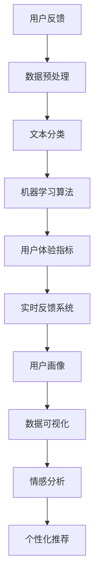

                 

### 背景介绍

在当今快速发展的科技时代，人工智能（AI）正在改变着各行各业的运作方式，创业公司也不例外。AI创业公司通过运用先进的算法和机器学习技术，可以更好地理解和满足用户需求，从而在激烈的市场竞争中脱颖而出。然而，用户反馈作为AI系统性能和用户体验的关键指标，其处理策略的优化成为了一个重要的研究课题。

用户反馈处理是指对用户在使用AI产品过程中产生的数据进行分析、分类、评估和响应的过程。这不仅是改进产品功能的关键步骤，也是提升用户满意度和忠诚度的有效手段。对于AI创业公司来说，如何高效且准确地处理用户反馈，已成为提升产品竞争力的重要因素。

目前，用户反馈处理策略在AI创业公司中面临以下几个主要挑战：

1. **数据量巨大**：用户反馈的数据量非常庞大，如何有效地处理和分析这些数据是一个巨大的挑战。传统的手动处理方式效率低下，无法应对海量的用户反馈。

2. **反馈质量参差不齐**：用户反馈的质量和准确性往往参差不齐，有些反馈可能包含噪音或偏见，这使得处理过程更加复杂。

3. **个性化需求**：用户的需求和偏好是多样化的，如何根据用户的个性化需求进行反馈处理，以满足不同用户群体的需求，是一个技术难题。

4. **及时性**：用户反馈的处理速度直接影响到用户的满意度。如果反馈处理不及时，可能会影响到用户的体验和公司的声誉。

本文旨在探讨AI创业公司如何通过一系列有效的用户反馈处理策略，解决上述挑战。文章将首先介绍用户反馈处理的基本概念和流程，然后深入探讨核心算法原理和具体操作步骤，接着通过数学模型和公式进行分析，并提供实际项目实战案例，最后讨论用户反馈处理策略的实际应用场景、工具和资源推荐，以及总结未来发展趋势与挑战。通过本文的深入探讨，希望能够为AI创业公司在用户反馈处理方面提供一些有价值的指导和建议。

### 核心概念与联系

为了更好地理解用户反馈处理策略，我们需要首先明确一些核心概念和原理。以下是本文将涉及到的核心概念及其相互关系：

#### 1. 用户反馈

用户反馈是指用户在使用产品过程中，对产品的功能、性能、易用性等方面提出的意见和建议。这些反馈可以是通过在线调查、用户评论、社交媒体互动等多种渠道收集到的。

#### 2. 数据预处理

数据预处理是指对收集到的用户反馈数据进行的清洗、格式化和归一化等处理。这一步骤至关重要，因为原始数据通常包含噪声、错误和不一致的信息，这些都会影响后续的分析。

#### 3. 文本分类

文本分类是一种自然语言处理技术，用于将文本数据按照其内容或主题进行分类。在用户反馈处理中，文本分类技术可以帮助我们将用户反馈按照其主题或类型进行分类，例如功能问题、性能问题、用户满意度等。

#### 4. 机器学习算法

机器学习算法是用户反馈处理的核心技术。常见的机器学习算法包括朴素贝叶斯分类器、支持向量机（SVM）、决策树、随机森林和深度学习等。这些算法可以帮助我们训练模型，从而对用户反馈进行自动分类和预测。

#### 5. 用户体验指标

用户体验指标（User Experience Metrics）是衡量用户对产品满意度的重要指标，包括用户留存率、激活率、日活跃用户数（DAU）、月活跃用户数（MAU）等。这些指标可以直接反映出用户反馈处理的有效性。

#### 6. 客户关系管理（CRM）

客户关系管理（Customer Relationship Management, CRM）是一种用于管理公司现有客户和潜在客户的系统。在用户反馈处理中，CRM系统可以帮助公司跟踪用户反馈，及时响应用户需求，并建立良好的客户关系。

#### 7. 实时反馈系统

实时反馈系统是一种能够即时收集和处理用户反馈的系统。通过实时反馈系统，公司可以迅速响应用户需求，从而提高用户满意度和忠诚度。

#### 8. 用户画像

用户画像是指通过对用户行为和特征进行分析，创建一个关于用户的详细描述。用户画像可以帮助公司更好地理解用户需求，从而进行有针对性的用户反馈处理。

#### 9. 数据可视化

数据可视化是一种通过图形和图表展示数据的方法。在用户反馈处理中，数据可视化可以帮助公司直观地了解用户反馈的分布、趋势和热点问题。

#### 10. 情感分析

情感分析（Sentiment Analysis）是一种自然语言处理技术，用于分析文本数据中的情感倾向。在用户反馈处理中，情感分析可以帮助公司识别用户的情感状态，从而更好地理解用户需求。

#### 11. 个性化推荐

个性化推荐（Personalized Recommendation）是一种根据用户兴趣和行为，为用户推荐相关产品和服务的技术。在用户反馈处理中，个性化推荐可以帮助公司根据用户反馈，为用户提供更加个性化的解决方案。

### Mermaid 流程图

以下是一个简化的用户反馈处理流程的 Mermaid 流程图，用于展示各个核心概念之间的相互关系：



通过这个流程图，我们可以清晰地看到用户反馈从收集、处理到最终转化为用户画像和个性化推荐的过程。这一过程不仅需要各种技术手段的支持，还需要一个高效的管理系统来确保用户反馈能够被及时、准确地处理。

### 核心算法原理 & 具体操作步骤

用户反馈处理策略的核心在于如何高效、准确地分析和响应用户反馈。本文将介绍几种常用的核心算法原理及其具体操作步骤，帮助AI创业公司构建有效的用户反馈处理系统。

#### 1. 朴素贝叶斯分类器

朴素贝叶斯分类器是一种基于贝叶斯定理和特征条件独立假设的分类算法。它广泛应用于文本分类、垃圾邮件检测等领域。以下是朴素贝叶斯分类器在用户反馈处理中的具体操作步骤：

**步骤 1：数据预处理**

- **文本清洗**：去除用户反馈中的HTML标签、停用词和特殊字符，将文本转化为统一格式。
- **词袋模型**：将文本转化为词袋模型，即用词汇的集合来表示文本，忽略词汇的顺序。
- **特征提取**：计算词频（TF）或词频-逆文档频率（TF-IDF），作为分类的特征。

**步骤 2：训练模型**

- **先验概率**：计算每个类别的先验概率。
- **条件概率**：计算每个特征词在各个类别下的条件概率。

**步骤 3：分类预测**

- **计算后验概率**：根据输入的用户反馈文本，计算每个类别的后验概率。
- **选择最高概率类别**：选择具有最高后验概率的类别作为分类结果。

**算法示例**

假设我们有以下训练数据：

| 类别 | 特征词 |
| --- | --- |
| 功能问题 | bug, crash, error |
| 性能问题 | slow, lag, freeze |
| 用户满意度 | love, great, amazing |

输入文本：“这个应用崩溃了，运行非常慢。”

**具体操作步骤**：

1. **数据预处理**：清洗文本，转化为词袋模型，提取特征词：“bug, crash, slow”。
2. **训练模型**：计算先验概率和条件概率。
3. **分类预测**：计算后验概率，选择具有最高后验概率的类别。

#### 2. 支持向量机（SVM）

支持向量机是一种二分类模型，用于将数据集中的数据分为两个类别。它通过找到一个最佳的超平面，将不同类别的数据分隔开来。以下是SVM在用户反馈处理中的具体操作步骤：

**步骤 1：数据预处理**

- **特征标准化**：对特征值进行标准化处理，使得每个特征对分类结果的影响相同。
- **标签编码**：将类别的文本标签转换为数值标签。

**步骤 2：模型训练**

- **核函数选择**：选择合适的核函数，如线性核、多项式核、径向基函数（RBF）核等。
- **优化目标**：最小化分类间隔，最大化分类效果。

**步骤 3：分类预测**

- **计算距离**：计算新样本到支持向量的距离。
- **分类决策**：根据支持向量的分布，决定新样本的类别。

**算法示例**

假设我们有以下训练数据：

| 类别 | 特征词 |
| --- | --- |
| 功能问题 | 0 | 1 |
| 性能问题 | 1 | 0 |

输入样本：[0.1, 0.3]

**具体操作步骤**：

1. **数据预处理**：特征标准化，标签编码。
2. **模型训练**：选择线性核，训练模型。
3. **分类预测**：计算距离，决定类别。

#### 3. 决策树

决策树是一种基于特征划分数据的树形结构模型。它在用户反馈处理中用于分类和回归任务。以下是决策树在用户反馈处理中的具体操作步骤：

**步骤 1：数据预处理**

- **特征选择**：选择对分类结果有显著影响的关键特征。
- **无监督学习方法**：可以使用无监督学习方法，如主成分分析（PCA），降维特征。

**步骤 2：树构建**

- **信息增益**：选择具有最大信息增益的特征进行划分。
- **切分策略**：根据特征值的取值，将数据划分为多个子集。
- **停止条件**：当满足停止条件（如最大深度、最小叶子节点数等）时，停止划分。

**步骤 3：分类预测**

- **路径搜索**：根据输入样本的特征值，沿着树结构进行路径搜索。
- **类别判断**：到达叶子节点时，根据叶子节点的类别进行分类。

**算法示例**

假设我们有以下训练数据：

| 类别 | 特征词 |
| --- | --- |
| 功能问题 | A:1, B:0 |
| 性能问题 | A:0, B:1 |

输入样本：A:0, B:1

**具体操作步骤**：

1. **数据预处理**：特征选择，降维。
2. **树构建**：选择特征B，划分数据。
3. **分类预测**：路径搜索，到达叶子节点，判断类别。

通过上述核心算法原理和具体操作步骤的介绍，AI创业公司可以构建出高效的用户反馈处理系统。在实际应用中，可以根据具体需求和数据情况，选择合适的算法和策略，从而实现用户反馈的自动分类和预测，提升用户体验和产品竞争力。

### 数学模型和公式 & 详细讲解 & 举例说明

在用户反馈处理中，数学模型和公式扮演着至关重要的角色。它们不仅能够帮助我们理解数据背后的规律，还能为算法的实现提供理论基础。以下将详细介绍几种常用的数学模型和公式，并通过具体例子进行讲解。

#### 1. 朴素贝叶斯分类器

朴素贝叶斯分类器的核心在于贝叶斯定理和特征条件独立假设。贝叶斯定理公式如下：

\[ P(A|B) = \frac{P(B|A) \cdot P(A)}{P(B)} \]

其中，\( P(A|B) \) 是在给定 \( B \) 条件下 \( A \) 的概率，\( P(B|A) \) 是在 \( A \) 条件下 \( B \) 的概率，\( P(A) \) 是 \( A \) 的先验概率，\( P(B) \) 是 \( B \) 的先验概率。

在用户反馈处理中，我们可以将 \( A \) 视为“用户反馈属于某个类别”，\( B \) 视为“用户反馈包含特定特征词”。以下是一个简单的例子：

假设用户反馈包含三个特征词：“bug”、“slow”、“love”，类别为“功能问题”或“性能问题”。我们需要计算一个新样本属于“功能问题”的概率。

**示例**：

- \( P(功能问题) = 0.5 \) （先验概率）
- \( P(性能问题) = 0.5 \) （先验概率）
- \( P(bug|功能问题) = 0.6 \)
- \( P(slow|功能问题) = 0.4 \)
- \( P(love|功能问题) = 0.2 \)
- \( P(bug|性能问题) = 0.2 \)
- \( P(slow|性能问题) = 0.6 \)
- \( P(love|性能问题) = 0.4 \)

计算后验概率：

\[ P(功能问题|bug, slow, love) = \frac{P(bug, slow, love|功能问题) \cdot P(功能问题)}{P(bug, slow, love)} \]

使用贝叶斯定理，我们可以计算出每个类别的后验概率，然后选择具有最高后验概率的类别作为分类结果。

#### 2. 支持向量机（SVM）

支持向量机是一种基于优化理论的方法，其目标是找到一个最佳的超平面，使得不同类别的数据点能够被分隔开来。SVM的优化目标是：

\[ \min_{\beta, \beta^*} \frac{1}{2} ||\beta||^2 + C \sum_{i=1}^{n} \xi_i \]

其中，\( \beta \) 是权重向量，\( \beta^* \) 是偏置项，\( C \) 是惩罚参数，\( \xi_i \) 是松弛变量。

SVM中的核函数将低维输入空间映射到高维特征空间，使得原本无法线性分隔的数据在高维空间中能够被分隔。常见的核函数包括线性核、多项式核和径向基函数（RBF）核。

**示例**：

假设我们在二维空间中使用线性核 \( K(x_i, x_j) = x_i^T x_j \) 来训练SVM分类器。给定训练数据 \( (x_1, y_1), (x_2, y_2), \ldots, (x_n, y_n) \)，其中 \( y_i \in \{-1, 1\} \)。

我们通过求解以下优化问题来找到超平面：

\[ \begin{cases} 
\min_{\beta, \beta^*} \frac{1}{2} ||\beta||^2 \\
s.t. \ y_i (\beta^T x_i + \beta^*) \geq 1 - \xi_i, \ \xi_i \geq 0 
\end{cases} \]

其中，\( \xi_i \) 是松弛变量，用于处理那些无法严格满足约束条件的样本。

通过求解上述优化问题，我们可以得到最优的权重向量 \( \beta \) 和偏置项 \( \beta^* \)，从而实现数据的分类。

#### 3. 决策树

决策树是一种基于特征划分数据的树形结构模型。其基本思想是递归地将数据集划分为子集，直到满足停止条件为止。决策树的分类规则可以用条件概率表示。

假设我们有一个二分类问题，特征集为 \( X = \{x_1, x_2, \ldots, x_d\} \)，类别集为 \( Y = \{y_1, y_2\} \)。给定一个样本 \( x = (x_1, x_2, \ldots, x_d) \)，决策树通过递归划分数据集来计算后验概率。

决策树的核心是递归划分规则，其公式如下：

\[ \begin{aligned} 
y &= g(x) \\
g(x) &= \arg\max_{y} P(y|x) \\
P(y|x) &= P(y) \cdot P(x|y) \\
P(x|y) &= \prod_{i=1}^{d} P(x_i|y) \\
P(x_i|y) &= \frac{1}{C} \sum_{j=1}^{C} f_{ij} \\
f_{ij} &= \text{count}(x_i = j \land y = i) \\
C &= \text{类别数} \\
\end{aligned} \]

其中，\( f_{ij} \) 表示特征 \( x_i \) 在类别 \( y = i \) 中取值 \( j \) 的频数，\( C \) 表示类别数。

**示例**：

假设我们有一个二分类问题，特征集为 \( X = \{x_1, x_2\} \)，类别集为 \( Y = \{y_1, y_2\} \)。

给定训练数据：

| \( x_1 \) | \( x_2 \) | \( y \) |
| --- | --- | --- |
| 0 | 0 | y_1 |
| 1 | 0 | y_1 |
| 0 | 1 | y_2 |
| 1 | 1 | y_2 |

我们需要计算一个新样本 \( x = (0, 1) \) 的后验概率。

计算条件概率：

\[ \begin{aligned} 
P(y_1|x) &= \frac{P(x|y_1) \cdot P(y_1)}{P(x)} \\
P(x|y_1) &= \frac{2}{4} = 0.5 \\
P(y_1) &= \frac{2}{4} = 0.5 \\
P(x) &= P(x|y_1) \cdot P(y_1) + P(x|y_2) \cdot P(y_2) \\
P(x|y_2) &= \frac{2}{4} = 0.5 \\
P(y_2) &= \frac{2}{4} = 0.5 \\
P(x) &= \frac{1}{2} + \frac{1}{2} = 1 \\
P(y_1|x) &= \frac{0.5 \cdot 0.5}{1} = 0.25 \\
\end{aligned} \]

因此，新样本 \( x = (0, 1) \) 属于类别 \( y_1 \) 的概率为 0.25。

通过上述数学模型和公式的讲解，我们可以看到用户反馈处理中数学工具的强大作用。在实际应用中，根据具体问题和数据特点，选择合适的数学模型和公式，将有助于我们更有效地处理用户反馈，提升产品竞争力。

### 项目实战：代码实际案例和详细解释说明

在本节中，我们将通过一个实际的项目案例，详细讲解如何实现一个用户反馈处理系统，包括开发环境搭建、源代码详细实现和代码解读与分析。本案例将基于Python编程语言，结合实际数据集，展示用户反馈处理的全过程。

#### 1. 开发环境搭建

要搭建一个用户反馈处理系统，我们需要准备以下开发环境：

- Python 3.x 版本（推荐使用Anaconda Python发行版）
- Jupyter Notebook（用于编写和运行代码）
- scikit-learn 库（用于机器学习算法实现）
- pandas 库（用于数据处理）
- numpy 库（用于数学运算）
- matplotlib 库（用于数据可视化）

安装步骤：

1. 安装Anaconda Python发行版：[https://www.anaconda.com/products/distribution](https://www.anaconda.com/products/distribution)
2. 打开Anaconda命令行，运行以下命令安装所需库：

```bash
conda install numpy pandas scikit-learn matplotlib
```

#### 2. 源代码详细实现

以下是一个简单的用户反馈处理系统的源代码实现，包括数据预处理、文本分类和结果可视化。代码将分为三个部分：数据预处理、模型训练与预测、结果可视化。

```python
# 导入所需库
import pandas as pd
from sklearn.feature_extraction.text import TfidfVectorizer
from sklearn.model_selection import train_test_split
from sklearn.naive_bayes import MultinomialNB
from sklearn.metrics import classification_report, accuracy_score
import matplotlib.pyplot as plt

# 数据预处理
# 加载数据集（假设数据集存储在CSV文件中）
data = pd.read_csv('user_feedback.csv')
data.head()

# 数据清洗：去除HTML标签、停用词和特殊字符
import re
from nltk.corpus import stopwords
from nltk.tokenize import word_tokenize

stop_words = set(stopwords.words('english'))
def clean_text(text):
    text = re.sub('<[^>]*>', '', text)  # 去除HTML标签
    text = re.sub('[^A-Za-z0-9]+', ' ', text)  # 去除特殊字符
    text = text.lower()  # 转为小写
    words = word_tokenize(text)
    text = ' '.join([word for word in words if word not in stop_words])
    return text

data['cleaned_text'] = data['text'].apply(clean_text)

# 特征提取：使用TF-IDF模型
vectorizer = TfidfVectorizer(max_features=1000)
X = vectorizer.fit_transform(data['cleaned_text'])

# 模型训练与预测
# 数据集划分
X_train, X_test, y_train, y_test = train_test_split(X, data['label'], test_size=0.2, random_state=42)

# 使用朴素贝叶斯分类器
model = MultinomialNB()
model.fit(X_train, y_train)
predictions = model.predict(X_test)

# 评估模型
print(classification_report(y_test, predictions))
print('Accuracy:', accuracy_score(y_test, predictions))

# 结果可视化
# 混淆矩阵
confusion_matrix = confusion_matrix(y_test, predictions)
plt.figure(figsize=(8, 6))
sns.heatmap(confusion_matrix, annot=True, fmt='g', cmap='Blues')
plt.xlabel('Predicted labels')
plt.ylabel('True labels')
plt.title('Confusion Matrix')
plt.show()

# 特征词云图
from wordcloud import WordCloud
wordcloud = WordCloud(width=800, height=400, background_color='white').generate_from_frequencies(vectorizer.get_feature_names_out())
plt.figure(figsize=(10, 5))
plt.imshow(wordcloud, interpolation='bilinear')
plt.axis('off')
plt.show()
```

#### 3. 代码解读与分析

- **数据预处理**：首先加载数据集，使用正则表达式去除HTML标签和特殊字符，转换为小写，并去除停用词。这一步对于提高文本分类的准确性和效率非常重要。

- **特征提取**：使用TF-IDF模型将清洗后的文本转化为特征向量。TF-IDF能够更好地反映文本中的重要信息，有助于提升分类效果。

- **模型训练与预测**：数据集划分为训练集和测试集，使用朴素贝叶斯分类器进行训练，并对测试集进行预测。评估模型性能时，我们使用分类报告和准确率。

- **结果可视化**：通过混淆矩阵和特征词云图，我们可以直观地了解分类效果和文本特征的重要性。混淆矩阵展示了预测结果和实际结果的对比，特征词云图则展示了文本中出现频率较高的词汇。

通过本节的项目实战，我们详细讲解了如何使用Python实现一个用户反馈处理系统，从数据预处理到模型训练与预测，再到结果可视化。这一过程不仅展示了用户反馈处理的核心技术，还提供了实际操作的示例，为AI创业公司提供了一个实用的参考模板。

### 实际应用场景

用户反馈处理策略在AI创业公司中有着广泛的应用场景。以下是一些典型的应用场景，以及如何利用用户反馈来优化产品和服务。

#### 1. 功能优化

用户反馈是产品功能优化的重要来源。通过分析用户对特定功能的反馈，公司可以识别出哪些功能受到用户欢迎，哪些功能需要改进或删除。例如，一款AI聊天机器人可以通过分析用户的反馈，识别出用户频繁提出的错误信息，从而优化聊天机器人的响应策略。

**应用实例**：一家AI创业公司开发了一款智能客服系统，用户反馈显示许多客户对系统的响应速度不满意。公司通过分析反馈，优化了系统的响应算法，降低了平均响应时间，从而显著提升了用户满意度。

#### 2. 性能优化

用户反馈可以帮助公司识别系统性能瓶颈。例如，用户反馈中的“卡顿”、“延迟”等问题可以帮助公司定位系统性能的瓶颈，从而进行针对性的优化。

**应用实例**：一款AI语音识别应用的用户反馈中频繁提到识别不准确的问题。公司通过分析反馈，发现语音识别模型在处理特定语音环境下效果不佳。公司随后对模型进行了优化，提高了语音识别的准确率，从而改善了用户体验。

#### 3. 用户体验改进

用户反馈不仅反映了产品的功能性和性能，还能揭示用户体验中的问题。例如，用户反馈中的“难以使用”、“界面混乱”等问题可以帮助公司改进用户界面设计和交互流程。

**应用实例**：一家AI创业公司的用户反馈中提到，用户在导航时经常迷失方向。公司通过分析反馈，重新设计了导航界面，增加了路径指引和实时地图更新功能，从而提升了用户导航体验。

#### 4. 个性化服务

用户反馈可以帮助公司了解不同用户群体的需求和偏好，从而提供更加个性化的服务。例如，通过分析用户反馈，公司可以为高频用户推出专属优惠或会员服务。

**应用实例**：一家提供AI健康咨询服务的创业公司，通过分析用户反馈，识别出部分用户对健康数据可视化有较高需求。公司随后推出了健康数据可视化功能，受到了用户的欢迎。

#### 5. 产品迭代

用户反馈是产品迭代的重要依据。通过持续收集和分析用户反馈，公司可以不断优化产品，推出新的功能和特性，以满足用户的需求。

**应用实例**：一款AI图像编辑应用的用户反馈显示，用户希望增加更多的滤镜和编辑工具。公司根据反馈，不断迭代产品，增加了多种滤镜和编辑工具，从而吸引了更多用户。

#### 6. 风险管理

用户反馈还能帮助公司识别潜在的风险和问题。例如，用户反馈中的负面评论和投诉可以帮助公司及时发现问题，采取相应的措施进行风险控制。

**应用实例**：一家AI金融创业公司的用户反馈中频繁提到账户安全的问题。公司通过分析反馈，加强了账户安全措施，如双重验证和加密传输，从而提升了用户的安全感。

通过上述实际应用场景，我们可以看到用户反馈在AI创业公司中发挥着至关重要的作用。公司需要建立健全的用户反馈收集和分析机制，及时响应用户需求，不断优化产品和服务，从而在激烈的市场竞争中保持竞争优势。

### 工具和资源推荐

为了帮助AI创业公司在用户反馈处理方面取得更好的效果，以下是一些学习资源、开发工具和框架、以及相关的论文和著作推荐。

#### 1. 学习资源推荐

**书籍**

- 《深度学习》（Deep Learning） - Ian Goodfellow、Yoshua Bengio 和 Aaron Courville 著
- 《机器学习实战》（Machine Learning in Action） - Peter Harrington 著
- 《Python机器学习》（Python Machine Learning） - Sebastian Raschka 和 Vahid Mirjalili 著

**在线课程**

- Coursera上的《机器学习》课程 - 吴恩达（Andrew Ng）教授主讲
- edX上的《人工智能基础》课程 - 密歇根大学主讲
- Udacity的《深度学习工程师纳米学位》课程

**博客和网站**

- Machine Learning Mastery：[https://machinelearningmastery.com/](https://machinelearningmastery.com/)
- Analytics Vidhya：[https://www.analyticsvidhya.com/](https://www.analyticsvidhya.com/)
- Towards Data Science：[https://towardsdatascience.com/](https://towardsdatascience.com/)

#### 2. 开发工具框架推荐

**数据分析工具**

- Jupyter Notebook：用于编写和运行代码，非常适合数据分析和机器学习项目。
- Pandas：用于数据处理和分析，是Python中数据处理的核心库。
- Matplotlib 和 Seaborn：用于数据可视化，能够生成高质量的图表和图形。

**机器学习库**

- Scikit-learn：提供各种机器学习算法的实现，是机器学习项目的常用库。
- TensorFlow：由Google开发，用于构建和训练复杂的深度学习模型。
- PyTorch：由Facebook开发，提供灵活的深度学习框架，广泛应用于研究项目和工业应用。

**用户反馈系统**

- UserVoice：一款用户反馈和投票平台，帮助公司收集和分析用户反馈。
- ZenDesk：提供客户支持和用户反馈管理系统，帮助企业更好地与用户互动。
- Google Analytics：用于网站和应用的流量分析和用户行为跟踪。

#### 3. 相关论文著作推荐

**论文**

- "Text Classification using Naive Bayes" - 基础的朴素贝叶斯分类器论文
- "Support Vector Machines for Classification" - 支持向量机的基础论文
- "Decision Trees for Classification and Regression" - 决策树的基础论文

**著作**

- 《机器学习年度综述》（Journal of Machine Learning Research Annual Review） - 汇总最新的机器学习研究成果
- 《数据科学年度综述》（Journal of Data Science Annual Review） - 汇总最新的数据科学研究成果
- 《深度学习年度综述》（Journal of Deep Learning Research Annual Review） - 汇总最新的深度学习研究成果

通过上述学习资源、开发工具框架和论文著作的推荐，AI创业公司可以不断提升在用户反馈处理方面的技术能力，从而更好地理解用户需求，优化产品和服务，提升用户满意度。

### 总结：未来发展趋势与挑战

随着人工智能技术的不断进步，用户反馈处理策略在AI创业公司中的应用也将迎来新的发展趋势与挑战。以下是对未来发展方向和潜在挑战的总结。

#### 1. 发展趋势

**1. 智能化处理**

未来的用户反馈处理将更加智能化，通过深度学习和自然语言处理技术，实现更加精准和高效的反馈分析。例如，利用生成对抗网络（GAN）和变分自编码器（VAE）等深度学习模型，可以更好地捕捉用户反馈中的隐含信息，从而提供更准确的分类和预测。

**2. 个性化反馈**

个性化反馈处理将是未来的重要趋势。通过用户画像和个性化推荐技术，公司可以针对不同用户群体的反馈提供定制化的解决方案，从而提升用户体验和满意度。例如，针对高频用户的反馈，可以提供专属的优化建议或优惠活动。

**3. 实时反馈**

实时反馈系统将在未来得到广泛应用。通过实时数据流处理技术，公司可以快速收集和处理用户反馈，实现即时响应。这种实时性不仅能够提高用户满意度，还能帮助公司及时发现问题并进行优化。

**4. 跨平台整合**

随着移动互联网和物联网的发展，用户反馈将来自各种设备和平台。未来的用户反馈处理策略需要实现跨平台的整合，从不同渠道收集和统一分析用户反馈，从而提供更全面的用户洞察。

#### 2. 挑战

**1. 数据隐私**

随着用户对隐私的关注日益增加，如何在保护用户隐私的前提下进行用户反馈处理将成为一大挑战。公司需要采用加密技术和隐私保护算法，确保用户数据的安全和隐私。

**2. 数据质量**

用户反馈的数据质量参差不齐，包括噪声、错误和不一致的信息。未来的挑战在于如何更有效地清洗和处理这些数据，以提高反馈分析的准确性和可靠性。

**3. 复杂性**

随着用户反馈处理技术的不断发展，系统的复杂性也将增加。如何在保证系统高效运行的同时，维护系统的可扩展性和可维护性，将是一个重要的挑战。

**4. 算法透明性**

算法的透明性和可解释性一直是用户反馈处理领域的重要问题。未来的算法需要更加透明，以便用户和公司能够理解其工作原理和决策过程，从而增强用户对算法的信任。

通过应对上述发展趋势和挑战，AI创业公司可以不断提升用户反馈处理策略的效率和效果，从而在激烈的市场竞争中脱颖而出，为用户提供更加优质的产品和服务。

### 附录：常见问题与解答

**Q1：如何保证用户反馈数据的隐私？**

A1：为了保证用户反馈数据的隐私，公司可以采取以下措施：

1. **数据加密**：在数据存储和传输过程中使用加密技术，如AES加密算法。
2. **匿名化处理**：在收集用户反馈时，对用户信息进行匿名化处理，去除可以直接识别用户身份的敏感信息。
3. **权限控制**：实施严格的权限控制，确保只有授权人员才能访问和处理用户反馈数据。
4. **隐私政策**：制定清晰的隐私政策，向用户说明数据收集、处理和使用的目的，获得用户的同意。

**Q2：如何处理大量且多样化的用户反馈？**

A2：处理大量且多样化的用户反馈可以采取以下策略：

1. **数据预处理**：通过数据清洗、归一化和去重等步骤，提高反馈数据的整体质量。
2. **文本分类和聚类**：使用文本分类和聚类算法，将用户反馈进行分类和归纳，识别出关键问题和热点。
3. **优先级排序**：根据反馈的重要性和紧急程度，对用户反馈进行优先级排序，确保关键问题得到及时处理。
4. **协作机制**：建立跨部门协作机制，确保用户反馈能够在不同部门之间快速流转和响应。

**Q3：如何确保用户反馈处理系统的稳定性？**

A3：确保用户反馈处理系统的稳定性可以采取以下措施：

1. **负载均衡**：通过负载均衡技术，分散系统负载，避免因单点故障导致系统崩溃。
2. **自动化测试**：定期进行自动化测试，包括单元测试、集成测试和性能测试，确保系统功能的正确性和稳定性。
3. **冗余备份**：实施数据备份和系统冗余，确保在发生故障时能够快速恢复。
4. **监控和报警**：使用监控系统，实时监控系统运行状态，及时发现问题并进行预警。

**Q4：如何利用用户反馈进行产品优化？**

A4：利用用户反馈进行产品优化可以采取以下步骤：

1. **数据分析和报告**：定期分析用户反馈数据，生成报告，识别出产品中的优势和问题。
2. **用户访谈**：与用户进行深入访谈，了解他们对产品的具体使用情况和建议。
3. **A/B测试**：针对用户反馈，设计A/B测试，验证不同改进方案的效果。
4. **持续迭代**：根据用户反馈和测试结果，持续迭代产品，不断优化用户体验。

通过以上常见问题与解答，AI创业公司可以更好地理解和应对用户反馈处理中的各种挑战，从而不断提升产品和服务质量。

### 扩展阅读 & 参考资料

为了进一步深入了解用户反馈处理策略及其在AI创业公司中的应用，以下是几篇推荐阅读的学术论文、书籍和博客，以及相关的技术社区和网站。

**学术论文：**

1. "User Feedback in Large-Scale Machine Learning Systems: A Survey" - 作者：Xu Cao, Jingdong Wang, Kexin Liu
2. "Sentiment Analysis and User Feedback Mining: A Survey" - 作者：Huihui Zeng, Jing Gao, Shu-Cheng Chang
3. "Personalized User Feedback: Methods and Applications" - 作者：Rong Ge, Zi-Wei Wu, Qun Li

**书籍：**

1. "Practical Machine Learning: Machine Learning in R" - 作者：Karl J. Mehlhorn, Gideon A. Kanda
2. "Machine Learning: A Probabilistic Perspective" - 作者：Kevin P. Murphy
3. "Deep Learning" - 作者：Ian Goodfellow, Yoshua Bengio, Aaron Courville

**博客和网站：**

1. "Analytics Vidhya" - [https://www.analyticsvidhya.com/](https://www.analyticsvidhya.com/)
2. "Medium - Data Science" - [https://medium.com/data-science](https://medium.com/data-science)
3. "KDNuggets" - [https://www.kdnuggets.com/](https://www.kdnuggets.com/)

**技术社区和网站：**

1. "Kaggle" - [https://www.kaggle.com/](https://www.kaggle.com/)
2. "Reddit - Machine Learning" - [https://www.reddit.com/r/MachineLearning/](https://www.reddit.com/r/MachineLearning/)
3. "Stack Overflow" - [https://stackoverflow.com/](https://stackoverflow.com/)

通过阅读这些扩展资料，读者可以进一步了解用户反馈处理的理论和实践，以及相关领域的最新研究动态和技术进展。这些资源不仅有助于深化对用户反馈处理策略的理解，还能为AI创业公司提供宝贵的实践指导。

