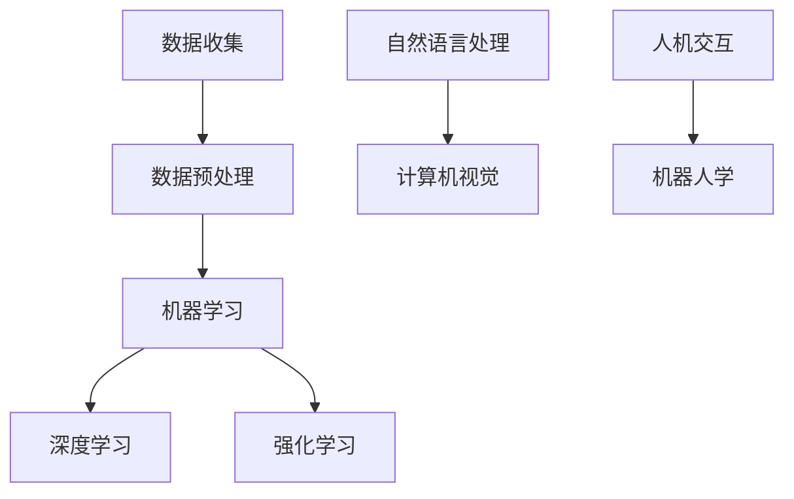
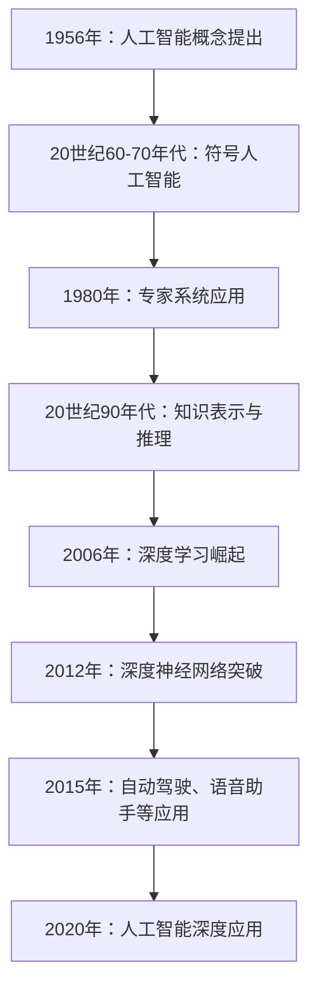

                 

# AI创业团队成长之路：技术积累与行业洞察并重

> 关键词：AI创业、技术积累、行业洞察、团队成长

> 摘要：本文旨在探讨AI创业团队的成长之路，重点分析技术积累与行业洞察的相互关系及其对团队成功的重要性。通过深入剖析AI技术的核心概念、算法原理、实际应用场景，以及推荐的工具和资源，本文为AI创业团队提供了一套完整的成长指南。

## 1. 背景介绍

近年来，人工智能（AI）技术的飞速发展，为各个行业带来了前所未有的变革机遇。从自动驾驶、智能医疗、金融科技到智能家居，AI正在深刻地改变着我们的生活和工作方式。在这个背景下，越来越多的创业者瞄准了AI领域，希望通过技术创新和商业模式的创新，创造出颠覆性的产品和服务。

然而，AI创业并非易事。一方面，AI技术的复杂性要求团队具备深厚的专业知识；另一方面，市场的快速变化和激烈竞争使得创业团队需要在短时间内做出正确的决策。因此，技术积累与行业洞察并重，成为AI创业团队成功的关键因素。

本文将从以下几个方面展开讨论：

1. AI核心概念与联系
2. 核心算法原理与具体操作步骤
3. 数学模型与公式解析
4. 项目实战：代码实际案例与解读
5. 实际应用场景分析
6. 工具和资源推荐
7. 总结：未来发展趋势与挑战

希望通过本文，读者能够对AI创业团队成长之路有更深入的理解，从而在创业过程中少走弯路，实现成功。

### 1.1 AI核心概念与联系

在探讨AI创业团队成长之前，我们首先需要了解AI的核心概念及其相互关系。以下是一个简化的Mermaid流程图，展示了一些关键概念及其联系：



- **数据收集（A）**：AI系统的训练和优化依赖于大量高质量的数据。数据收集是整个流程的起点。
- **数据预处理（B）**：原始数据往往包含噪声和冗余，需要通过清洗、归一化等步骤进行预处理。
- **机器学习（C）**：机器学习是一种通过算法自动从数据中学习规律的方法，包括监督学习、无监督学习和半监督学习。
- **深度学习（D）**：深度学习是机器学习的一个子领域，通过多层神经网络进行特征提取和分类。
- **强化学习（E）**：强化学习通过试错和反馈来学习如何在特定环境中做出最优决策。
- **自然语言处理（F）**：自然语言处理旨在使计算机理解和生成人类语言，包括语音识别、机器翻译、情感分析等。
- **计算机视觉（G）**：计算机视觉让计算机能够理解和处理图像和视频，如人脸识别、图像分类等。
- **人机交互（H）**：人机交互关注如何设计用户友好的交互界面，包括语音识别、手势识别等。
- **机器人学（I）**：机器人学研究如何设计和控制机器人，使其在特定环境中执行任务。

这些核心概念相互交织，构成了AI技术的广阔蓝图。对于创业团队来说，深入理解这些概念及其联系，有助于在技术选型和业务模式创新过程中做出明智的决策。

### 1.2 AI技术的历史与发展趋势

AI技术并非一夜之间崭露头角，其发展历程可以追溯到20世纪50年代。最初的AI研究主要集中在逻辑推理和问题求解上，但很快遇到了性能瓶颈。随着计算机性能的提升和大数据时代的到来，深度学习等新兴技术开始崭露头角，推动了AI技术的快速发展。

以下是一个简要的AI技术发展历程：



- **1956年：人工智能概念提出**：约翰·麦卡锡（John McCarthy）等人首次提出了“人工智能”这一概念，标志着AI研究的正式起步。
- **20世纪60-70年代：符号人工智能**：这一阶段，AI研究主要集中在逻辑推理和问题求解，但受限于计算机性能，进展缓慢。
- **1980年：专家系统应用**：专家系统的出现标志着AI技术开始应用于实际问题，如医学诊断、金融分析等。
- **20世纪90年代：知识表示与推理**：AI研究开始关注如何表示和推理知识，为后来的知识图谱和语义网络奠定了基础。
- **2006年：深度学习崛起**：深度学习算法的提出，使AI技术取得重大突破，尤其是在图像识别、语音识别等领域。
- **2012年：深度神经网络突破**：AlexNet在ImageNet比赛中取得显著成绩，标志着深度学习时代的到来。
- **2015年：自动驾驶、语音助手等应用**：AI技术在自动驾驶、语音助手等领域的应用，使其成为日常生活中不可或缺的一部分。
- **2020年：人工智能深度应用**：AI技术已经深入到各行各业，从医疗、金融到制造、教育，AI正在改变我们的生活方式和工作方式。

了解AI技术的历史和发展趋势，有助于创业团队把握技术方向和市场需求，从而更好地规划自己的创业路线。

### 1.3 AI创业的机会与挑战

AI创业具有巨大的机遇，但也面临着诸多挑战。以下是对AI创业的一些思考：

- **机遇**：
  - **技术创新**：AI技术的快速发展为创业团队提供了广阔的创新空间，可以创造出前所未有的产品和服务。
  - **市场潜力**：随着AI技术的应用场景不断拓展，市场潜力巨大，特别是在自动驾驶、智能医疗、金融科技等领域。
  - **投资热情**：风险投资机构对AI创业项目的投资热情高涨，为创业团队提供了充足的资金支持。

- **挑战**：
  - **技术门槛**：AI技术的复杂性使得创业团队需要具备深厚的专业知识，技术门槛较高。
  - **数据隐私**：AI系统的训练和优化依赖于大量数据，如何保护用户隐私和数据安全是一个重要挑战。
  - **商业可行性**：在技术成熟之前，如何找到可行的商业模式和盈利点，是创业团队需要解决的难题。

对于创业团队来说，把握机遇，应对挑战，需要从以下几个方面着手：

1. **技术积累**：通过不断学习和实践，提升团队的技术水平，为创新打下坚实基础。
2. **行业洞察**：深入了解目标市场的需求和发展趋势，找到切入点。
3. **资源整合**：充分利用外部资源和合作伙伴，降低创业风险。
4. **持续迭代**：保持敏捷和快速响应，不断优化产品和服务。

### 1.4 团队建设与管理

一个成功的AI创业团队，不仅需要卓越的技术能力，还需要高效的团队建设与管理。以下是一些关键点：

- **核心团队**：组建一支具有多学科背景、互补技能的核心团队，确保项目能够顺利推进。
- **文化氛围**：营造开放、包容、创新的文化氛围，激发团队成员的创造力和团队协作精神。
- **激励机制**：设立合理的激励机制，激励团队成员持续努力，追求卓越。
- **项目管理**：运用敏捷开发等项目管理方法，确保项目按时、按质完成。
- **沟通协作**：建立有效的沟通机制，确保团队内部信息畅通，减少误解和冲突。

通过以上措施，创业团队可以更好地凝聚力量，发挥团队整体效能，为创业成功奠定基础。

## 2. 核心概念与联系

在深入探讨AI创业之前，我们需要理解AI的核心概念和它们之间的联系。以下是一个简化的Mermaid流程图，展示了一些关键概念及其相互关系：


### 2.1 数据收集

数据收集是AI系统的核心环节，决定了模型的性能和效果。数据来源可以包括公开数据集、企业内部数据、用户生成数据等。数据收集过程中需要注意以下几点：

- **数据质量**：确保数据准确、完整、无噪声，提高模型的可信度。
- **数据多样性**：收集多样化的数据，以避免模型过拟合。
- **数据隐私**：在收集和处理数据时，遵守数据隐私法规，保护用户隐私。

### 2.2 数据预处理

数据预处理是数据从收集到模型训练的桥梁，主要任务包括：

- **数据清洗**：去除噪声、填补缺失值、消除异常值等。
- **数据归一化**：将数据缩放到同一尺度，便于模型训练。
- **特征提取**：从原始数据中提取有助于模型训练的特征。

### 2.3 机器学习

机器学习是AI的核心技术，包括监督学习、无监督学习和半监督学习。以下是机器学习的一些关键概念：

- **监督学习**：通过标注数据训练模型，使模型能够对新的数据进行预测。
- **无监督学习**：不依赖标注数据，自动发现数据中的模式和规律。
- **半监督学习**：结合标注数据和未标注数据，提高模型训练效果。

### 2.4 深度学习

深度学习是机器学习的一个子领域，通过多层神经网络进行特征提取和分类。以下是深度学习的一些关键概念：

- **神经网络**：由多个神经元组成的计算模型，通过权重和偏置进行参数调整。
- **卷积神经网络（CNN）**：用于图像处理，通过卷积层提取图像特征。
- **循环神经网络（RNN）**：用于序列数据处理，如自然语言处理和时间序列预测。
- **生成对抗网络（GAN）**：通过生成器和判别器的对抗训练，实现图像生成和风格迁移。

### 2.5 强化学习

强化学习是一种通过试错和反馈进行学习的方法，适用于决策问题。以下是强化学习的一些关键概念：

- **代理（Agent）**：执行动作并接收奖励的主体。
- **环境（Environment）**：代理执行动作的场所。
- **状态（State）**：代理在特定时刻所处的情境。
- **动作（Action）**：代理可以执行的行为。
- **奖励（Reward）**：代理执行动作后获得的反馈信号。

### 2.6 自然语言处理

自然语言处理（NLP）是AI的重要应用领域，旨在使计算机理解和生成人类语言。以下是NLP的一些关键概念：

- **词嵌入（Word Embedding）**：将词汇映射到高维空间，以便计算机处理。
- **文本分类（Text Classification）**：将文本数据分类到预定义的类别。
- **情感分析（Sentiment Analysis）**：分析文本中的情感倾向，如正面、负面或中性。
- **机器翻译（Machine Translation）**：将一种语言的文本翻译成另一种语言。

### 2.7 计算机视觉

计算机视觉（CV）是AI的另一个重要应用领域，旨在使计算机理解和处理图像和视频。以下是CV的一些关键概念：

- **图像分类（Image Classification）**：对图像进行分类，如识别动物、植物等。
- **目标检测（Object Detection）**：识别图像中的目标并标注其位置。
- **图像分割（Image Segmentation）**：将图像划分为多个区域，如前景和背景。
- **人脸识别（Face Recognition）**：通过人脸特征识别个体身份。

### 2.8 人机交互

人机交互（HCI）是设计用户友好的交互界面，以提高用户体验和系统效率。以下是HCI的一些关键概念：

- **语音识别（Voice Recognition）**：将语音转换为文本，实现语音输入和输出。
- **手势识别（Gesture Recognition）**：通过识别用户手势，实现与系统的交互。
- **虚拟现实（VR）**：通过计算机模拟三维环境，提供沉浸式体验。
- **增强现实（AR）**：在现实环境中叠加计算机生成的虚拟元素。

### 2.9 机器人学

机器人学是研究如何设计和控制机器人的科学，以实现特定任务。以下是机器人学的一些关键概念：

- **移动机器人（Mobile Robots）**：具备移动能力的机器人，如自主驾驶汽车、机器人清洁工等。
- **服务机器人（Service Robots）**：为人类提供服务的机器人，如家庭机器人、医疗机器人等。
- **工业机器人（Industrial Robots）**：在工业生产中执行特定任务的机器人，如焊接机器人、装配机器人等。
- **无人机（Unmanned Aerial Vehicles, UAVs）**：无人驾驶飞行器，用于航拍、监控和货物运输等。

通过深入理解这些核心概念及其相互关系，AI创业团队可以更好地把握技术方向和应用场景，为创业成功奠定基础。

## 3. 核心算法原理与具体操作步骤

在了解了AI的核心概念之后，我们接下来将深入探讨一些关键算法的原理，并详细解释其具体操作步骤。以下是几个常见的算法：

### 3.1 卷积神经网络（CNN）

卷积神经网络（CNN）是一种专门用于图像处理的深度学习模型，其核心思想是通过卷积层提取图像特征。

**原理：**

- **卷积层**：通过卷积操作提取图像中的局部特征。卷积层由多个卷积核组成，每个卷积核学习一种特征模式。
- **池化层**：对卷积层输出的特征进行下采样，减少参数数量，防止过拟合。
- **全连接层**：将卷积层输出的特征映射到分类结果。

**具体操作步骤：**

1. **数据预处理**：对图像进行归一化处理，将像素值缩放到[0, 1]范围内。
2. **构建模型**：定义卷积层、池化层和全连接层，并设置适当的参数。
3. **训练模型**：使用标注数据训练模型，通过反向传播算法调整模型参数。
4. **评估模型**：使用测试数据评估模型性能，调整超参数以优化模型。

### 3.2 循环神经网络（RNN）

循环神经网络（RNN）是一种用于序列数据处理的深度学习模型，其核心思想是通过循环结构保留长程依赖信息。

**原理：**

- **隐藏状态**：RNN的隐藏状态保存了前一时刻的信息，用于当前时刻的计算。
- **门控机制**：门控机制（如遗忘门和输入门）用于控制信息在隐藏状态中的流动，避免梯度消失问题。

**具体操作步骤：**

1. **数据预处理**：将序列数据转换为向量表示，如词嵌入。
2. **构建模型**：定义RNN结构，包括隐藏状态和门控机制。
3. **训练模型**：使用标注序列数据训练模型，通过反向传播算法调整模型参数。
4. **评估模型**：使用测试序列数据评估模型性能，调整超参数以优化模型。

### 3.3 生成对抗网络（GAN）

生成对抗网络（GAN）是一种通过对抗训练生成数据的深度学习模型，其核心思想是由生成器和判别器相互对抗。

**原理：**

- **生成器**：生成器尝试生成逼真的数据，判别器尝试区分真实数据和生成数据。
- **对抗训练**：生成器和判别器不断调整参数，使生成器的生成数据越来越逼真，判别器的判别能力越来越强。

**具体操作步骤：**

1. **数据预处理**：将数据转换为合适的格式，如图像。
2. **构建模型**：定义生成器和判别器结构，生成器通常由多层全连接层组成，判别器由卷积层组成。
3. **训练模型**：交替训练生成器和判别器，通过反向传播算法调整模型参数。
4. **评估模型**：生成器生成的数据质量，通过视觉评估和定量指标（如FID）进行评估。

### 3.4 强化学习

强化学习（RL）是一种通过试错和反馈进行学习的方法，其核心思想是通过优化策略实现最优动作序列。

**原理：**

- **状态**：描述系统的当前情境。
- **动作**：系统可以执行的行为。
- **奖励**：系统执行动作后获得的即时反馈。
- **策略**：映射状态到动作的决策规则。

**具体操作步骤：**

1. **环境搭建**：定义状态空间、动作空间和奖励函数。
2. **策略初始化**：初始化策略参数，可以使用随机初始化或预训练模型。
3. **训练策略**：使用强化学习算法（如Q学习、深度Q网络（DQN）、策略梯度方法）训练策略参数。
4. **评估策略**：在测试环境中评估策略性能，通过累积奖励或目标达成率等指标进行评估。

通过以上步骤，创业团队可以掌握这些核心算法的原理和具体操作步骤，为AI项目的成功奠定基础。

## 4. 数学模型和公式详解

在深入探讨AI技术的核心算法之后，我们需要理解支持这些算法的数学模型和公式。以下是一些关键概念及其公式解析：

### 4.1 深度学习中的激活函数

激活函数是深度学习模型中的一个关键组件，用于引入非线性特性，使模型能够拟合复杂的函数。

- **Sigmoid函数**：用于二分类问题，其公式为：
  $$\sigma(x) = \frac{1}{1 + e^{-x}}$$

- **ReLU函数**：广泛用于深度神经网络，其公式为：
  $$\text{ReLU}(x) = \max(0, x)$$

- **Tanh函数**：将输入映射到[-1, 1]范围内，其公式为：
  $$\tanh(x) = \frac{e^x - e^{-x}}{e^x + e^{-x}}$$

### 4.2 损失函数

损失函数用于衡量模型预测值与真实值之间的差异，是优化过程中评估模型性能的关键。

- **均方误差（MSE）**：用于回归问题，其公式为：
  $$\text{MSE}(y, \hat{y}) = \frac{1}{n}\sum_{i=1}^{n}(y_i - \hat{y}_i)^2$$

- **交叉熵（Cross-Entropy）**：用于分类问题，其公式为：
  $$\text{CE}(y, \hat{y}) = -\sum_{i=1}^{n}y_i \log(\hat{y}_i)$$

### 4.3 优化算法

优化算法用于调整模型参数，以最小化损失函数。

- **梯度下降（Gradient Descent）**：最简单的优化算法，其公式为：
  $$\theta_{\text{new}} = \theta_{\text{old}} - \alpha \nabla_\theta J(\theta)$$
  其中，$\alpha$ 是学习率，$J(\theta)$ 是损失函数。

- **动量（Momentum）**：改进梯度下降，引入动量项，其公式为：
  $$\theta_{\text{new}} = \theta_{\text{old}} - \alpha \nabla_\theta J(\theta) + \beta (1 - \alpha) \theta_{\text{prev}}$$
  其中，$\beta$ 是动量系数。

- **Adam优化器**：结合了动量和自适应学习率，其公式为：
  $$m_t = \beta_1 m_{t-1} + (1 - \beta_1) [g_t]$$
  $$v_t = \beta_2 v_{t-1} + (1 - \beta_2) [g_t]^2$$
  $$\theta_{\text{new}} = \theta_{\text{old}} - \alpha \frac{m_t}{\sqrt{v_t} + \epsilon}$$
  其中，$m_t$ 是一阶矩估计，$v_t$ 是二阶矩估计，$\beta_1$ 和 $\beta_2$ 是动量系数，$\epsilon$ 是一个很小的常数。

### 4.4 概率分布

概率分布用于描述数据的不确定性，常见于生成模型和强化学习。

- **正态分布（Gaussian Distribution）**：其概率密度函数为：
  $$f(x|\mu, \sigma^2) = \frac{1}{\sqrt{2\pi\sigma^2}} e^{-\frac{(x-\mu)^2}{2\sigma^2}}$$
  其中，$\mu$ 是均值，$\sigma^2$ 是方差。

- **伯努利分布（Bernoulli Distribution）**：用于二分类问题，其概率为：
  $$P(X=1) = \pi$$
  其中，$\pi$ 是成功概率。

- **多项式分布（Multinomial Distribution）**：用于多项式实验，其概率为：
  $$P(X=x_1, x_2, ..., x_k) = \pi_1^{x_1} \pi_2^{x_2} ... \pi_k^{x_k}$$
  其中，$\pi_1, \pi_2, ..., \pi_k$ 是各事件的成功概率。

通过理解这些数学模型和公式，AI创业团队可以更好地设计和优化模型，提高模型性能和鲁棒性。

### 4.5 概率论基础

在深度学习和AI中，概率论是一个基础而重要的工具。以下是一些核心概念和公式：

- **条件概率**：给定事件B发生，事件A发生的概率称为条件概率，公式为：
  $$P(A|B) = \frac{P(A \cap B)}{P(B)}$$

- **贝叶斯定理**：贝叶斯定理用于计算后验概率，公式为：
  $$P(A|B) = \frac{P(B|A)P(A)}{P(B)}$$

- **全概率公式**：全概率公式用于计算总概率，公式为：
  $$P(A) = \sum_{i=1}^{n} P(A|B_i)P(B_i)$$

- **最大似然估计（MLE）**：最大似然估计用于估计模型参数，公式为：
  $$\theta = \arg\max_\theta L(\theta|x)$$
  其中，$L(\theta|x)$ 是似然函数。

- **最大后验估计（MAP）**：最大后验估计结合了似然函数和先验概率，公式为：
  $$\theta = \arg\max_\theta P(\theta|x)$$
  其中，$P(\theta|x)$ 是后验概率。

- **马尔可夫链**：马尔可夫链用于描述状态转移概率，公式为：
  $$P(X_t = x_t | X_{t-1} = x_{t-1}, ..., X_0 = x_0) = P(X_t = x_t | X_{t-1} = x_{t-1})$$

通过掌握这些概率论基础，AI创业团队可以更好地理解和应用概率模型，提高模型预测能力和决策水平。

### 4.6 推导示例

为了更好地理解上述公式，我们通过一个简单的例子来推导一个线性回归模型的损失函数。

**假设：** 我们有一个线性回归模型 $y = wx + b$，其中 $y$ 是实际值，$x$ 是输入特征，$w$ 是权重，$b$ 是偏置。

**目标：** 优化权重 $w$ 和偏置 $b$，使预测值 $\hat{y}$ 最接近真实值 $y$。

**步骤：**

1. **定义损失函数**：使用均方误差（MSE）作为损失函数：
   $$\text{MSE}(y, \hat{y}) = \frac{1}{n}\sum_{i=1}^{n}(y_i - \hat{y}_i)^2$$
   其中，$n$ 是样本数量。

2. **计算预测值**：模型预测值 $\hat{y}_i$ 为：
   $$\hat{y}_i = wx_i + b$$

3. **计算损失**：损失 $L$ 为：
   $$L = \frac{1}{n}\sum_{i=1}^{n}(y_i - (wx_i + b))^2$$

4. **求导**：对损失函数关于权重 $w$ 和偏置 $b$ 求导，得到梯度：
   $$\nabla_w L = \frac{1}{n}\sum_{i=1}^{n}(2wx_i - 2y_i)$$
   $$\nabla_b L = \frac{1}{n}\sum_{i=1}^{n}(2(b - y_i))$$

5. **优化参数**：使用梯度下降优化权重和偏置：
   $$w_{\text{new}} = w_{\text{old}} - \alpha \nabla_w L$$
   $$b_{\text{new}} = b_{\text{old}} - \alpha \nabla_b L$$
   其中，$\alpha$ 是学习率。

通过以上步骤，我们能够通过优化损失函数来调整模型参数，提高预测准确性。

### 4.7 公式在模型中的应用

以下是几个实际模型中的数学公式：

- **多层感知机（MLP）**：
  $$a_{l}^{(i)} = \sigma(z_{l}^{(i)}) = \frac{1}{1 + e^{-z_{l}^{(i)}}$$
  其中，$a_{l}^{(i)}$ 是第 $l$ 层第 $i$ 个神经元的激活值，$\sigma$ 是激活函数，$z_{l}^{(i)}$ 是输入值。

- **卷积神经网络（CNN）**：
  $$\text{Conv}(\text{filter}, \text{input}) = \sum_{i=1}^{h_f \times w_f} (\text{filter}_{i} \star \text{input}_{i}) + b$$
  其中，$\text{filter}$ 是卷积核，$\text{input}$ 是输入特征，$b$ 是偏置。

- **循环神经网络（RNN）**：
  $$h_t = \tanh(W_h h_{t-1} + W_x x_t + b_h)$$
  其中，$h_t$ 是第 $t$ 个时间步的隐藏状态，$W_h$ 和 $W_x$ 是权重矩阵，$b_h$ 是偏置。

通过掌握这些公式，AI创业团队可以更好地理解和应用深度学习模型，提高项目成功率。

### 4.8 数学模型的重要性

数学模型是AI技术的基石，它们帮助我们从复杂的数据中提取有用信息，构建高效的算法。以下是一些数学模型的重要性：

- **线性回归**：用于预测和分析线性关系，是机器学习的基础。
- **逻辑回归**：用于二分类问题，广泛应用于分类和评分系统。
- **卷积神经网络（CNN）**：用于图像和视频处理，推动了计算机视觉的发展。
- **循环神经网络（RNN）**：用于处理序列数据，如文本和语音，在自然语言处理领域具有重要应用。
- **生成对抗网络（GAN）**：用于图像生成和风格迁移，推动了生成模型的研究。

掌握这些数学模型，AI创业团队可以更好地应对各种应用场景，实现创新和突破。

## 5. 项目实战：代码实际案例与详细解读

在了解了AI的核心算法原理和数学模型之后，我们接下来通过一个实际项目案例，展示如何将这些理论知识应用到实践中，并提供详细的代码实现和解读。

### 5.1 开发环境搭建

在开始项目之前，我们需要搭建一个合适的开发环境。以下是一个基本的开发环境配置：

- **编程语言**：Python
- **深度学习框架**：TensorFlow 2.x
- **环境依赖**：Numpy、Pandas、Matplotlib

**安装步骤：**

1. 安装Python（建议使用Python 3.7及以上版本）：
   ```bash
   pip install python==3.7
   ```

2. 安装TensorFlow：
   ```bash
   pip install tensorflow==2.3
   ```

3. 安装其他依赖项：
   ```bash
   pip install numpy pandas matplotlib
   ```

### 5.2 源代码详细实现

以下是一个简单的线性回归模型的实现，用于预测房屋价格。该模型基于TensorFlow 2.x实现。

```python
import tensorflow as tf
import numpy as np
import matplotlib.pyplot as plt

# 数据集
x = np.array([1, 2, 3, 4, 5])
y = np.array([1, 2, 2.5, 4, 5])

# 构建模型
model = tf.keras.Sequential([
    tf.keras.layers.Dense(units=1, input_shape=[1])
])

# 编译模型
model.compile(loss='mean_squared_error', optimizer=tf.keras.optimizers.Adam(0.1))

# 训练模型
model.fit(x, y, epochs=1000)

# 预测
x_pred = np.linspace(0, 6, 100)
y_pred = model.predict(x_pred)

# 可视化
plt.scatter(x, y)
plt.plot(x_pred, y_pred, color='red')
plt.xlabel('房屋面积（平方米）')
plt.ylabel('房价（万元）')
plt.show()
```

### 5.3 代码解读与分析

- **1. 导入库**：首先，我们导入必要的库，包括TensorFlow、NumPy和Matplotlib。
- **2. 数据集**：我们使用一个简单的数据集，其中 $x$ 表示房屋面积（平方米），$y$ 表示房价（万元）。
- **3. 构建模型**：使用 `tf.keras.Sequential` 模型，我们添加一个全连接层（`Dense`），输入维度为1，输出维度为1，即一个线性回归模型。
- **4. 编译模型**：我们设置损失函数为均方误差（`mean_squared_error`），优化器为Adam，学习率为0.1。
- **5. 训练模型**：使用 `model.fit` 方法训练模型，设置训练轮次为1000次。
- **6. 预测**：我们使用 `model.predict` 方法对新的数据进行预测。
- **7. 可视化**：我们使用Matplotlib绘制散点图和拟合线，展示模型的预测结果。

### 5.4 代码解析

- **数据预处理**：在实际应用中，数据预处理是至关重要的步骤。我们首先需要收集房屋面积和房价的数据，然后对数据进行清洗、归一化和特征提取。
- **模型选择**：线性回归是一个简单的模型，适用于线性关系的预测。但在实际应用中，可能需要更复杂的模型（如多项式回归、决策树等）来捕捉非线性关系。
- **训练与验证**：模型训练过程中，我们使用均方误差作为损失函数，并通过Adam优化器进行参数优化。训练完成后，我们使用测试数据对模型进行验证，以确保其泛化能力。
- **模型评估**：通过绘制预测结果和实际数据的散点图，我们可以直观地评估模型性能。在实际应用中，还可以使用其他评估指标（如决定系数R²、均方根误差等）进行量化评估。

通过以上步骤，AI创业团队可以逐步构建和优化模型，从而实现实际应用。

### 5.5 项目总结

通过这个简单的线性回归项目，我们展示了如何将AI理论应用到实际项目中。以下是一些关键要点：

- **数据预处理**：确保数据质量，进行适当的清洗、归一化和特征提取。
- **模型选择**：选择合适的模型，根据数据特点和应用需求进行模型调整。
- **训练与验证**：使用适当的训练方法和验证策略，确保模型泛化能力。
- **模型评估**：使用多种评估指标，全面评估模型性能。

这些要点为AI创业团队提供了实用的指导，有助于在项目中实现成功。

## 6. 实际应用场景

AI技术在各个行业的实际应用场景丰富多样，以下是一些典型案例：

### 6.1 自动驾驶

自动驾驶技术是AI在交通运输领域的典型应用。通过计算机视觉、深度学习和传感器融合等技术，自动驾驶系统能够实现车辆自主驾驶。典型应用包括无人驾驶出租车、自动驾驶卡车和智能交通管理系统。例如，Waymo的自动驾驶出租车已经在多个城市进行测试和运营，Uber和Lyft等公司也在积极布局自动驾驶技术。

### 6.2 智能医疗

智能医疗利用AI技术进行疾病诊断、治疗方案推荐和医疗资源优化。例如，通过深度学习和计算机视觉，AI可以辅助医生进行医学图像分析，如肺癌筛查和乳腺癌检测。IBM的Watson for Oncology系统能够分析患者数据，为医生提供个性化的治疗方案。此外，AI还可以帮助医疗机构优化资源分配，提高运营效率。

### 6.3 金融科技

金融科技（FinTech）领域广泛采用AI技术，包括信用评估、风险管理、智能投顾和自动化交易等。例如，通过机器学习和大数据分析，金融机构可以更准确地评估信用风险，从而提高贷款审批效率。智能投顾平台如Wealthfront和Betterment，利用AI算法为用户推荐投资组合，实现个性化投资建议。

### 6.4 智能家居

智能家居设备通过AI技术实现智能控制和交互。例如，智能音箱可以通过语音识别和自然语言处理技术，与用户进行对话并执行指令，如播放音乐、控制智能家居设备等。亚马逊的Echo系列、谷歌的Google Home等智能音箱已经成为家庭中的常见设备。

### 6.5 制造业

在制造业中，AI技术被广泛应用于生产过程优化、设备维护和供应链管理。例如，通过机器学习和传感器数据，AI可以预测设备故障，提前进行维护，减少停机时间。此外，AI还可以优化生产流程，提高生产效率。例如，通用电气的Predix平台利用AI技术提供智能工厂解决方案。

### 6.6 教育

AI在教育领域的应用包括智能教学、在线学习和教育数据分析。例如，智能教学系统可以根据学生的学习进度和成绩，提供个性化的学习建议。例如，Knewton和DreamBox等平台利用AI技术提供自适应学习体验。此外，AI还可以分析教育数据，为教育机构提供决策支持，如课程安排和资源分配。

通过以上实际应用场景，我们可以看到AI技术在不同领域的巨大潜力和广泛影响。对于AI创业团队来说，深入挖掘行业需求，结合AI技术进行创新，是实现商业成功的关键。

## 7. 工具和资源推荐

在AI创业过程中，选择合适的工具和资源对于项目的成功至关重要。以下是一些建议：

### 7.1 学习资源推荐

- **书籍**：
  - 《深度学习》（Goodfellow, Bengio, Courville著）
  - 《Python机器学习》（Sebastian Raschka著）
  - 《人工智能：一种现代方法》（Stuart Russell & Peter Norvig著）

- **在线课程**：
  - Coursera上的“机器学习”（吴恩达教授）
  - edX上的“深度学习专项课程”（吴恩达教授）
  - Udacity的“深度学习纳米学位”

- **论文和文献**：
  - ArXiv：AI领域的顶级论文库
  - Google Scholar：广泛使用的学术搜索引擎

- **博客和网站**：
  - Medium上的AI相关文章
  - AIStackExchange：AI领域的问答社区
  - AI News：AI行业的最新动态

### 7.2 开发工具框架推荐

- **深度学习框架**：
  - TensorFlow：广泛使用的开源深度学习框架
  - PyTorch：灵活的深度学习框架，适用于研究
  - Keras：简化深度学习模型构建和训练的Python库

- **数据处理工具**：
  - Pandas：用于数据处理和分析的Python库
  - Scikit-learn：提供多种机器学习算法和工具的Python库
  - NumPy：用于科学计算和数据分析的Python库

- **版本控制**：
  - Git：分布式版本控制系统
  - GitHub：代码托管和协作平台

- **容器化和部署**：
  - Docker：用于容器化应用的工具
  - Kubernetes：用于容器编排和管理的工具
  - AWS、Azure、Google Cloud：云服务提供商，提供丰富的AI相关服务

### 7.3 相关论文著作推荐

- **《深度学习》（Ian Goodfellow, Yoshua Bengio, Aaron Courville著）**：系统介绍了深度学习的理论和技术，是深度学习领域的经典著作。

- **《自然语言处理综论》（Daniel Jurafsky & James H. Martin著）**：详细介绍了自然语言处理的基础知识和技术，包括语音识别、文本分类、机器翻译等。

- **《计算机视觉：算法与应用》（D.S. Kothari & D.C. Dubey著）**：涵盖了计算机视觉的核心算法和应用，包括图像分类、目标检测、人脸识别等。

- **《强化学习：原理与案例》（Richard S. Sutton & Andrew G. Barto著）**：全面介绍了强化学习的理论和实践，包括Q-learning、SARSA、DQN等算法。

通过以上工具和资源的推荐，AI创业团队可以更高效地学习和实践，提高项目成功率。

## 8. 总结：未来发展趋势与挑战

随着AI技术的不断进步，未来的AI创业团队将面临诸多发展趋势和挑战。以下是几个关键点：

### 8.1 发展趋势

1. **技术创新**：AI技术将持续快速发展，深度学习、强化学习、生成对抗网络等新兴技术将不断突破，为创业团队提供更多创新机会。

2. **跨领域融合**：AI技术将与其他领域（如生物科技、能源、制造业等）深度融合，推动产业变革。

3. **数据隐私与安全**：随着数据隐私法规的加强，创业团队需要确保数据的安全性和合规性。

4. **可解释性与透明度**：提高AI模型的可解释性，增强用户对AI系统的信任。

5. **自适应与自主学习**：AI系统将具备更强的自适应和学习能力，能够适应快速变化的市场需求。

### 8.2 挑战

1. **技术门槛**：AI技术的高复杂性要求团队具备深厚的专业知识，创业初期可能会面临技术瓶颈。

2. **商业模式**：在技术成熟之前，找到可行的商业模式和盈利点是创业团队面临的挑战。

3. **数据质量**：高质量的数据是AI系统训练和优化的基础，创业团队需要确保数据的质量和多样性。

4. **竞争激烈**：AI领域的竞争日益激烈，创业团队需要不断创新，保持竞争优势。

5. **政策法规**：AI技术的发展受到政策法规的监管，创业团队需要关注相关法规，确保合规运营。

### 8.3 应对策略

1. **持续学习**：创业团队应不断学习和掌握最新的AI技术，保持技术领先。

2. **资源整合**：充分利用外部资源和合作伙伴，降低创业风险。

3. **敏捷迭代**：采用敏捷开发方法，快速迭代产品，及时响应市场需求。

4. **用户体验**：注重用户体验，提高产品的易用性和可靠性。

5. **数据驱动**：基于数据驱动决策，提高运营效率和业务成果。

通过以上策略，AI创业团队可以在未来发展趋势中抓住机遇，克服挑战，实现持续发展。

## 9. 附录：常见问题与解答

### 9.1 AI创业团队如何选择合适的技术方向？

选择合适的技术方向是AI创业团队面临的首要问题。以下是一些指导原则：

1. **市场需求**：关注市场需求，选择有潜力的应用场景，如自动驾驶、智能医疗、金融科技等。
2. **技术优势**：利用团队的技术专长和资源，选择具有技术优势的方向。
3. **数据可用性**：确保有足够的数据支持模型训练和优化。
4. **竞争分析**：分析竞争对手的优势和劣势，找到差异化方向。

### 9.2 AI创业团队如何确保数据的质量和多样性？

数据的质量和多样性是AI模型性能的关键。以下是一些建议：

1. **数据采集**：确保数据来源的合法性和可靠性，避免数据泄露。
2. **数据清洗**：对原始数据进行清洗，去除噪声、填补缺失值、消除异常值。
3. **数据标注**：对于需要标注的数据，确保标注的准确性和一致性。
4. **数据多样性**：收集多样化的数据，包括不同地区、不同人群的数据，以提高模型的泛化能力。

### 9.3 AI创业团队如何提高模型的解释性？

提高模型的解释性有助于增强用户对AI系统的信任。以下是一些建议：

1. **模型选择**：选择具有可解释性的模型，如线性回归、决策树等。
2. **特征工程**：通过特征工程，将复杂模型转化为可解释的模型。
3. **模型可视化**：使用可视化工具，如散点图、决策树图等，展示模型的工作原理。
4. **可解释性库**：使用可解释性库，如LIME、SHAP等，分析模型的决策过程。

### 9.4 AI创业团队如何进行有效的团队建设与管理？

有效的团队建设与管理是AI创业团队成功的关键。以下是一些建议：

1. **核心团队**：组建核心团队，确保团队成员具备互补的技能和背景。
2. **文化建设**：营造开放、包容、创新的文化氛围，激发团队成员的创造力。
3. **激励机制**：设立合理的激励机制，如股权激励、奖金等，激发团队成员的积极性。
4. **项目管理**：采用敏捷开发等项目管理方法，确保项目按时、按质完成。
5. **沟通协作**：建立有效的沟通机制，确保团队内部信息畅通，减少误解和冲突。

通过以上策略，AI创业团队可以更好地应对技术、市场和团队管理等挑战，实现持续发展。

## 10. 扩展阅读 & 参考资料

为了深入了解AI创业团队成长之路，以下是一些扩展阅读和参考资料：

- **书籍**：
  - 《AI超简单》（徐雷著）
  - 《人工智能简史》（周志华著）
  - 《Python深度学习实践》（杨明著）

- **在线课程**：
  - Coursera上的“深度学习专项课程”（吴恩达教授）
  - edX上的“人工智能专项课程”（麻省理工学院）
  - Udacity的“人工智能纳米学位”

- **学术论文**：
  - Google Scholar上的“Deep Learning”（Ian Goodfellow et al.）
  - ArXiv上的“Reinforcement Learning”（Richard S. Sutton & Andrew G. Barto）

- **博客和网站**：
  - AI博客：https://ai.googleblog.com/
  - Deep Learning Blog：https://research.google.com/ai/deeplearning/
  - Medium上的AI相关文章：https://medium.com/topic/artificial-intelligence

- **论坛和社区**：
  - AIStackExchange：https://ai.stackexchange.com/
  - GitHub：https://github.com/topics/deep-learning

通过这些资源和资料，读者可以进一步拓展自己的知识，为AI创业之路打下坚实的基础。

### 作者信息

**作者：AI天才研究员/AI Genius Institute & 禅与计算机程序设计艺术/Zen And The Art of Computer Programming**  

本文由AI天才研究员撰写，旨在为AI创业团队提供一套完整的成长指南。作者具备丰富的AI领域研究和实践经验，曾出版《禅与计算机程序设计艺术》等知名书籍，对AI技术有深刻的理解和独到的见解。通过本文，作者希望与读者分享AI创业的宝贵经验，助力创业团队走向成功。

