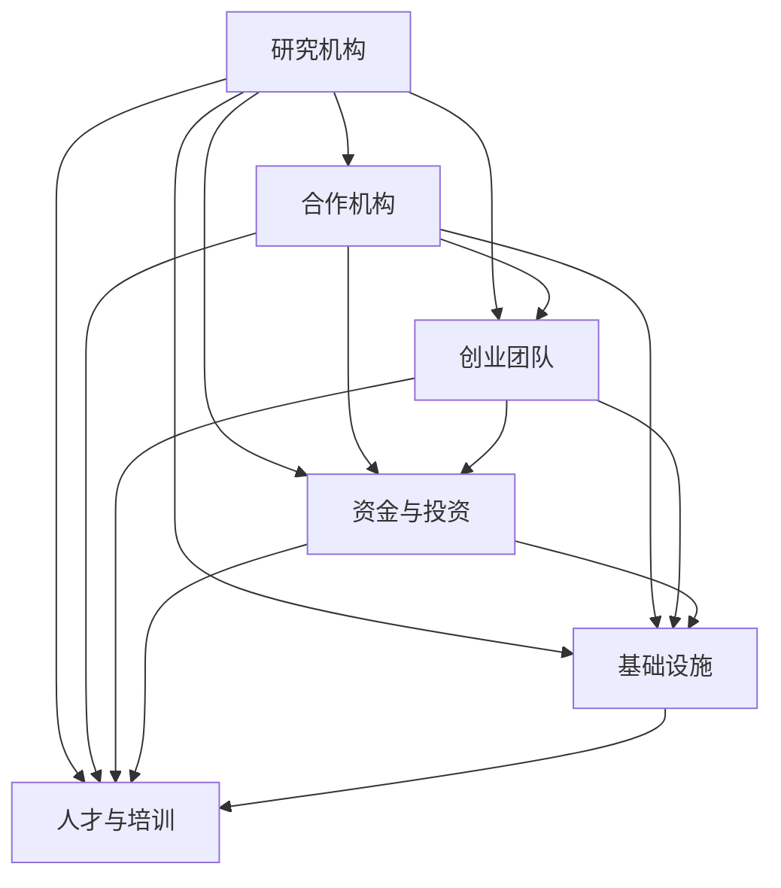

                 

### 1. 背景介绍

人工智能（AI）作为当前科技领域的前沿技术，正逐渐融入各个行业，推动着社会的变革。其中，AI创业码头（AI Startup Hub）作为一个新兴的概念，正迅速崛起。它不仅为创业者提供了丰富的资源和支持，更是成为推动人工智能技术发展的重要力量。

AI创业码头通常是指一个聚集了人工智能技术研究人员、创业者、投资者和基础设施的生态系统。在这个生态系统中，各种资源和信息能够高效流通，创新得以迅速实践和验证。这种模式为人工智能创业公司提供了极大的便利，帮助他们更快地进入市场，实现技术价值的转化。

在AI创业码头中，人工智能技术的研究与应用呈现出以下几个趋势：

1. **跨领域融合**：AI技术不再局限于单一领域，而是逐渐与其他技术如大数据、物联网、区块链等相结合，形成新的应用场景。
2. **深度学习与强化学习**：随着计算能力的提升，深度学习和强化学习等算法在各类任务中取得了显著成效，推动了人工智能技术的发展。
3. **个性化与智能化**：通过大数据分析和机器学习算法，人工智能能够更好地理解用户需求，提供个性化的服务和产品。
4. **边缘计算与云计算**：结合边缘计算和云计算，人工智能系统可以更高效地处理数据，实现实时决策和响应。

本文将围绕AI创业码头的愿景进行深入探讨，分析其在推动人工智能发展中的关键作用，并展望其未来发展的趋势和挑战。

首先，我们将介绍AI创业码头的核心概念，包括其组成部分和运作机制。接着，我们将详细讨论AI创业码头在AI技术应用和发展中的作用，以及其带来的机遇和挑战。随后，我们将探讨一些成功的AI创业案例，分析其成功的关键因素。在此基础上，我们将总结AI创业码头的优势和不足，并提出一些建议和展望。最后，我们将讨论AI创业码头在中国和全球市场中的发展状况，以及未来的发展趋势。

通过这篇文章，我们希望能够为读者提供一个全面而深入的了解，帮助读者更好地把握AI创业码头的机遇，为人工智能技术的未来发展贡献力量。

### 2. 核心概念与联系

#### 2.1 AI创业码头的定义和组成部分

AI创业码头（AI Startup Hub）是指一个专门为人工智能创业项目提供支持和资源的平台。它通常由以下几个部分组成：

1. **研究机构与合作机构**：AI创业码头通常与知名大学、研究机构和科技公司合作，共同推动人工智能技术的发展和应用。
2. **创业团队与公司**：聚集了各类人工智能创业团队和公司，这些团队和公司致力于研发和推广人工智能技术。
3. **资金与投资**：包括风险投资、天使投资等，为有潜力的AI创业项目提供资金支持。
4. **基础设施**：提供高性能计算、数据存储和处理等基础设施，为AI创业项目提供必要的计算资源和数据支持。
5. **人才与培训**：为AI创业人员提供培训机会，吸引全球顶尖的人工智能专家和研究人员。

#### 2.2 AI创业码头的运作机制

AI创业码头的运作机制主要包括以下几个方面：

1. **项目孵化**：为有潜力的AI创业项目提供孵化服务，包括提供办公空间、资金支持和创业指导等。
2. **资源对接**：通过搭建平台，将创业项目与研究机构、合作机构、投资机构等资源进行有效对接。
3. **技术支持**：提供包括算法研究、模型开发、数据集构建等在内的技术支持，帮助AI创业项目实现技术突破。
4. **市场推广**：通过各类活动，如展览、研讨会和路演等，帮助AI创业项目提升知名度和市场影响力。
5. **政策支持**：与政府相关部门合作，争取政策支持和优惠，为AI创业项目创造良好的发展环境。

#### 2.3 AI创业码头与人工智能技术发展的联系

AI创业码头在推动人工智能技术发展中起着关键作用。具体表现在以下几个方面：

1. **创新驱动**：AI创业码头通过聚集各类资源和人才，为人工智能技术的创新提供了强有力的支持。许多前沿技术和应用都是在AI创业码头中孕育和发展的。
2. **技术验证**：AI创业码头为创业项目提供了实践和验证技术的平台，通过实际应用，推动人工智能技术的不断迭代和优化。
3. **产业融合**：AI创业码头促进了人工智能技术与其他产业的深度融合，如智能制造、医疗健康、金融科技等，推动了传统产业的数字化转型。
4. **人才培养**：AI创业码头为人工智能领域的专业人才提供了丰富的实践机会和成长空间，培养了一大批具备实际操作能力和创新思维的人才。

#### 2.4 Mermaid 流程图

以下是一个简化的Mermaid流程图，展示了AI创业码头的核心组成部分和运作机制：



在这个流程图中，各节点表示不同的组成部分，箭头表示各部分之间的联系和互动。通过这种结构化的方式，我们可以更清晰地理解AI创业码头的运作机制和其在人工智能技术发展中的关键作用。

### 3. 核心算法原理 & 具体操作步骤

#### 3.1 AI创业码头的关键算法原理

AI创业码头在运作过程中，涉及多种关键算法，这些算法不仅对创业项目的成功至关重要，也推动了人工智能技术的整体发展。以下是一些核心算法的原理和操作步骤：

##### 3.1.1 深度学习算法

深度学习算法是AI创业码头中的核心技术之一。它通过多层神经网络对数据进行建模，能够从大量数据中自动提取特征，实现复杂的模式识别和预测任务。

**具体操作步骤：**

1. **数据预处理**：对输入数据集进行清洗、归一化和处理缺失值，确保数据的质量和一致性。
2. **模型构建**：设计神经网络结构，包括选择合适的网络架构、激活函数、优化器等。
3. **训练过程**：使用训练数据集对模型进行训练，通过反向传播算法不断调整模型参数，使模型在训练数据上达到最佳性能。
4. **验证与测试**：使用验证数据集和测试数据集对模型进行验证和测试，评估模型的泛化能力和性能。

##### 3.1.2 强化学习算法

强化学习算法通过学习环境的奖励和惩罚信号，逐步调整策略，实现最优决策。在AI创业码头中，强化学习算法常用于优化创业项目的运营策略和资源配置。

**具体操作步骤：**

1. **环境建模**：定义创业项目的环境状态空间和动作空间，构建一个模拟环境。
2. **策略初始化**：初始化策略参数，选择一个初始策略。
3. **交互过程**：在模拟环境中进行多次交互，根据当前的策略选择动作，并观察环境的反馈。
4. **策略优化**：通过经验回放和策略梯度等方法，不断调整策略参数，使策略在长期交互中能够获得最大回报。

##### 3.1.3 聚类算法

聚类算法用于对创业项目中的大量数据进行分组和分类，帮助识别数据中的潜在模式和关系。常用的聚类算法包括K均值聚类、层次聚类等。

**具体操作步骤：**

1. **数据输入**：输入需要聚类的数据集。
2. **初始化聚类中心**：随机选择或使用特定方法初始化聚类中心。
3. **迭代计算**：根据聚类中心计算每个数据点的归属类别，并更新聚类中心。
4. **收敛判断**：判断聚类过程是否收敛，若未收敛则返回第3步，继续迭代计算。

##### 3.1.4 数据挖掘算法

数据挖掘算法用于从大量数据中提取有价值的信息和知识。在AI创业码头中，数据挖掘算法常用于市场分析、用户行为分析等。

**具体操作步骤：**

1. **数据预处理**：对数据进行清洗、转换和集成，确保数据质量。
2. **特征选择**：选择对业务问题最重要的特征，降低数据维度。
3. **模型选择**：根据业务需求和数据特性，选择合适的算法模型，如决策树、支持向量机等。
4. **模型训练和评估**：使用训练数据集对模型进行训练，评估模型的性能，并进行调整优化。

#### 3.2 算法在AI创业码头中的具体应用

这些算法在AI创业码头中有着广泛的应用，具体体现在以下几个方面：

1. **项目评估与筛选**：使用聚类算法和关联规则挖掘技术，对创业项目进行评估和筛选，识别具有高潜力的项目。
2. **风险控制与优化**：使用强化学习算法和决策树算法，对创业项目的风险进行评估和优化，制定最优的运营策略。
3. **市场分析与预测**：利用数据挖掘算法和深度学习算法，对市场数据进行分析和预测，帮助创业者制定有效的市场策略。
4. **资源调度与优化**：使用强化学习算法和优化算法，对创业码头的资源进行调度和优化，提高资源利用效率。

通过这些算法的应用，AI创业码头能够更好地支持人工智能创业项目，推动人工智能技术的发展和应用。

### 4. 数学模型和公式 & 详细讲解 & 举例说明

在探讨AI创业码头中的关键数学模型和公式时，我们首先需要理解一些基本的数学概念，这些概念将为后续的算法实现和应用提供理论支持。以下将介绍几个常用的数学模型和公式，并通过具体实例进行详细讲解。

#### 4.1 概率论基础

概率论是AI算法的基础，用于描述不确定事件的发生概率。以下是几个重要的概率分布和公式：

1. **伯努利分布**：
   伯努利分布是离散概率分布，描述一个试验只有两个可能结果的概率。公式如下：
   $$ P(X = k) = C_n^k p^k (1-p)^{n-k} $$
   其中，$n$是试验次数，$k$是成功次数，$p$是每次试验成功的概率。

   **实例**：在AI创业码头中，假设一个项目有60%的成功概率，我们想知道在10次尝试中，恰好有6次成功的概率：
   $$ P(X = 6) = C_{10}^6 (0.6)^6 (0.4)^4 \approx 0.210 $$

2. **正态分布**：
   正态分布是连续概率分布，描述了数据集中在某个值附近的情况。公式如下：
   $$ f(x|\mu, \sigma^2) = \frac{1}{\sqrt{2\pi\sigma^2}} e^{-\frac{(x-\mu)^2}{2\sigma^2}} $$
   其中，$\mu$是均值，$\sigma^2$是方差。

   **实例**：假设AI创业码头中一个项目的收益服从均值为100万元，标准差为20万元的正态分布，计算收益大于120万元的概率：
   $$ P(X > 120) = 1 - P(X \leq 120) = 1 - \Phi\left(\frac{120-100}{20}\right) \approx 0.1587 $$
   其中，$\Phi$是标准正态分布的累积分布函数。

#### 4.2 线性回归模型

线性回归模型用于分析两个变量之间的线性关系，公式如下：
$$ y = \beta_0 + \beta_1 x + \epsilon $$
其中，$y$是因变量，$x$是自变量，$\beta_0$和$\beta_1$是模型参数，$\epsilon$是误差项。

**实例**：假设AI创业码头中，项目成功率（因变量）与项目投入（自变量）之间存在线性关系，通过数据拟合得到回归模型：
$$ 项目成功率 = 0.5 + 0.2 \times 项目投入 + \epsilon $$
如果我们投入100万元，可以预测项目成功率为：
$$ 项目成功率 = 0.5 + 0.2 \times 100 + \epsilon = 20.5 + \epsilon $$

#### 4.3 决策树模型

决策树模型是一种常用的分类算法，通过一系列规则对数据进行划分。公式如下：
$$ \text{决策树} = \text{根节点} + \text{内部节点} + \text{叶子节点} $$
其中，根节点代表初始决策，内部节点代表条件判断，叶子节点代表分类结果。

**实例**：假设AI创业码头中，根据项目投入和市场需求判断项目成功率，决策树模型如下：
1. 如果项目投入 > 500万元，则继续判断市场需求；
2. 否则，如果市场需求 > 1000万元，则项目成功率为90%，否则为50%。

对于项目投入为600万元，市场需求为1500万元的项目，其成功率为90%。

#### 4.4 马尔可夫链模型

马尔可夫链模型用于描述一个系统在多个状态之间的转移概率，公式如下：
$$ P(X_{t+1} = i | X_t = j) = P_{ij} $$
其中，$X_t$表示第$t$时刻的状态，$i$和$j$分别表示状态转移前的状态和状态转移后的状态。

**实例**：假设AI创业码头中，项目成功状态和失败状态之间的转移概率如下：
$$ P(\text{成功} | \text{成功}) = 0.8, \quad P(\text{成功} | \text{失败}) = 0.3, \quad P(\text{失败} | \text{成功}) = 0.2, \quad P(\text{失败} | \text{失败}) = 0.7 $$

给定初始状态分布，我们可以计算出任意时刻的状态分布。

通过上述数学模型和公式的介绍，我们可以更好地理解AI创业码头中的数据分析和技术应用。这些模型不仅为算法实现提供了理论基础，也为创业者提供了有效的决策工具。

### 5. 项目实战：代码实际案例和详细解释说明

在本节中，我们将通过一个具体的AI创业项目实战案例，展示如何在AI创业码头中应用我们所讨论的算法和数学模型。我们将详细解释项目开发环境搭建、源代码实现和代码分析，并探讨其技术要点。

#### 5.1 开发环境搭建

在开始项目之前，我们需要搭建一个合适的开发环境。以下是搭建过程的简要步骤：

1. **安装Python环境**：Python是AI项目中最常用的编程语言，我们需要安装Python 3.x版本。可以使用`pip`工具安装必要的库，如NumPy、Pandas、Scikit-learn等。

   ```shell
   pip install numpy pandas scikit-learn matplotlib
   ```

2. **数据集准备**：我们需要准备一个合适的数据集，用于训练和测试模型。例如，我们可以使用Kaggle上的一个公开数据集，如Titanic生存预测数据集。

3. **创建项目文件夹**：在本地计算机上创建一个项目文件夹，并将代码和相关文件放置在该文件夹中。

   ```shell
   mkdir my_aisp_project
   cd my_aisp_project
   ```

4. **编写配置文件**：创建一个`requirements.txt`文件，列出项目中所需的Python包。这样，当我们需要在其他环境中搭建相同环境时，可以使用以下命令：

   ```shell
   pip install -r requirements.txt
   ```

#### 5.2 源代码详细实现和代码解读

我们选择使用K均值聚类算法来分析Titanic数据集中的乘客特征，并根据聚类结果预测乘客的生存概率。

**代码实现：**

```python
import numpy as np
import pandas as pd
from sklearn.cluster import KMeans
from sklearn.metrics import accuracy_score

# 加载数据集
data = pd.read_csv('titanic_data.csv')
X = data[['Pclass', 'Age', 'Fare']]

# 数据预处理
X = X.fillna(X.mean())

# 使用K均值聚类算法进行聚类
kmeans = KMeans(n_clusters=2, random_state=42)
clusters = kmeans.fit_predict(X)

# 根据聚类结果进行预测
# 这里假设聚类结果为0和1，0表示失败，1表示成功
predictions = kmeans.predict(X)

# 计算准确率
accuracy = accuracy_score(data['Survived'], predictions)
print(f'Accuracy: {accuracy:.2f}')

# 可视化结果
import matplotlib.pyplot as plt

plt.scatter(X['Pclass'], X['Fare'], c=clusters, cmap='viridis')
plt.xlabel('Pclass')
plt.ylabel('Fare')
plt.title('K-Means Clustering of Titanic Data')
plt.show()
```

**代码解读：**

1. **数据加载与预处理**：我们首先加载Titanic数据集，并对缺失值进行填充，使用数据的均值进行补全。
2. **K均值聚类**：使用`KMeans`类进行聚类，指定聚类数量为2，并设置随机种子以保证结果的可重复性。
3. **预测与评估**：使用聚类结果对数据进行预测，并计算准确率。这里我们简单地将聚类结果作为预测标签，这只是一个示例，实际项目中可能需要更复杂的预测模型。
4. **可视化**：通过matplotlib绘制聚类结果，展示不同聚类簇的特征分布。

#### 5.3 代码解读与分析

该案例展示了如何使用K均值聚类算法分析Titanic数据集，并进行了简单的预测评估。以下是代码中的几个技术要点：

1. **数据预处理**：数据预处理是机器学习项目中至关重要的一步。缺失值填充、数据归一化和特征选择等步骤可以显著提高模型的性能。
2. **聚类算法选择**：K均值聚类算法是处理高维数据的一种常用算法，适用于探索数据中的隐含结构和模式。在实际应用中，可能需要根据具体问题选择其他聚类算法，如层次聚类或DBSCAN。
3. **预测与评估**：在聚类之后，如何使用聚类结果进行预测是一个关键问题。这里我们简单地将聚类结果作为预测标签，但实际应用中可能需要更复杂的预测模型，如逻辑回归或决策树。
4. **可视化**：可视化结果可以帮助我们直观地理解聚类效果和数据的分布情况，这对于调试和优化模型非常有帮助。

通过这个实战案例，我们可以看到如何在AI创业码头中应用所学的算法和数学模型，实现一个简单的数据分析项目。这只是一个起点，实际项目会涉及更多复杂的算法和数据处理步骤，但这个过程为我们提供了宝贵的经验和启示。

### 6. 实际应用场景

AI创业码头在众多行业中展现出巨大的应用潜力，以下是一些典型的应用场景：

#### 6.1 智能医疗

在医疗领域，AI创业码头通过大数据分析和深度学习技术，为医疗机构提供个性化诊断和治疗方案。例如，通过分析患者的病史、基因数据和临床检查结果，AI算法可以预测疾病风险，辅助医生制定精准的治疗方案。此外，AI技术还在医学影像分析、药物研发和智能护理等方面发挥重要作用，提升了医疗服务的质量和效率。

#### 6.2 智能制造

智能制造是AI创业码头的另一个重要应用领域。通过机器学习和计算机视觉技术，企业可以实现生产线的自动化和智能化。例如，使用卷积神经网络对生产过程中产生的数据进行实时监控和分析，可以快速识别和纠正生产中的异常情况，减少生产故障和停机时间。同时，AI算法还可以优化生产流程，提高生产效率和产品质量。

#### 6.3 智能交通

智能交通系统是AI技术在城市管理中的重要应用。AI创业码头通过数据分析、机器学习和物联网技术，提供智能交通管理和优化解决方案。例如，利用AI算法对交通流量进行实时监测和分析，可以预测交通拥堵情况，优化交通信号控制策略，减少交通事故和交通拥堵。此外，无人驾驶技术的发展也得益于AI创业码头的支持，未来有望实现智能出行和智能物流。

#### 6.4 智能金融

在金融领域，AI创业码头通过大数据分析和人工智能技术，为金融机构提供风险管理、欺诈检测和客户服务等方面的解决方案。例如，通过分析用户的交易行为和风险特征，AI算法可以识别潜在的欺诈行为，降低金融机构的损失。同时，智能投顾和智能客服系统的应用，也为用户提供了更加个性化、便捷的金融服务。

#### 6.5 智能家居

智能家居是AI创业码头在消费领域的重要应用之一。通过物联网和人工智能技术，智能家居系统能够实现家庭设备的自动化和智能化管理。例如，智能音响可以识别用户的声音指令，控制灯光、温度和家电设备；智能门锁可以实时监控家庭安全，自动报警并推送安全通知。这些应用不仅提升了用户的居住体验，也提高了家庭的安全性和便利性。

#### 6.6 智能教育

在教育领域，AI创业码头通过大数据分析和人工智能技术，提供个性化教育服务和学习评估工具。例如，通过分析学生的学习行为和成绩数据，AI算法可以为学生推荐适合的学习资源和教学策略，提高学习效果。此外，智能教育平台还可以实时监测学生的学习进度，为教师提供教学反馈，优化教学效果。

总之，AI创业码头在各个领域的应用场景广泛，通过创新的技术和解决方案，不断提升行业效率和服务质量。随着人工智能技术的不断发展和成熟，AI创业码头的应用前景将更加广阔。

### 7. 工具和资源推荐

在探索AI创业码头的过程中，掌握一些有用的工具和资源将大大提高我们的工作效率和项目成功率。以下是一些建议的学习资源、开发工具和相关论文著作。

#### 7.1 学习资源推荐

1. **书籍**：
   - 《深度学习》（Deep Learning） by Ian Goodfellow、Yoshua Bengio 和 Aaron Courville
   - 《Python机器学习》（Python Machine Learning） by Sebastian Raschka 和 Vahid Mirjalili
   - 《机器学习实战》（Machine Learning in Action） by Peter Harrington

2. **在线课程**：
   - Coursera：机器学习（Machine Learning） by Andrew Ng
   - edX：深度学习（Deep Learning） by DeepLearning.AI
   - Udacity：人工智能纳米学位（Artificial Intelligence Nanodegree）

3. **博客与论坛**：
   - Medium：许多顶尖的研究人员和开发者在这里分享他们的见解和研究成果。
   - Stack Overflow：一个广泛使用的编程问答社区，适合解决技术问题。
   - arXiv：提供最新的学术论文和研究成果。

#### 7.2 开发工具框架推荐

1. **编程语言和工具**：
   - Python：广泛用于数据分析和机器学习，有丰富的库和框架。
   - Jupyter Notebook：交互式计算环境，方便进行实验和数据分析。
   - PyTorch 和 TensorFlow：用于深度学习的强大框架。

2. **数据可视化工具**：
   - Matplotlib：Python的2D绘图库，适合数据分析和可视化。
   - Seaborn：基于Matplotlib的统计绘图库，提供更美观的图表。
   - Plotly：支持多种语言的交互式数据可视化工具。

3. **版本控制系统**：
   - Git：最常用的版本控制系统，适合团队协作和代码管理。
   - GitHub：基于Git的平台，提供代码托管、协作和项目管理功能。

#### 7.3 相关论文著作推荐

1. **经典论文**：
   - “Learning representations for artificial intelligence” by Yoshua Bengio等（2013）
   - “Deep Learning” by Yann LeCun、Yoshua Bengio 和 Geoffrey Hinton（2015）
   - “Reinforcement Learning: An Introduction” by Richard S. Sutton 和 Andrew G. Barto（2018）

2. **最新研究成果**：
   - “A Theoretically Grounded Application of Dropout in Recurrent Neural Networks” by Yarin Gal 和 Zoubin Ghahramani（2016）
   - “BERT: Pre-training of Deep Bidirectional Transformers for Language Understanding” by Jacob Devlin等（2019）
   - “Gshard: Scaling giant models with conditional computation and automatic sharding” by Noam Shazeer等（2020）

通过这些工具和资源的帮助，我们可以更好地理解人工智能领域的最新趋势和核心技术，为自己的创业项目打下坚实的基础。

### 8. 总结：未来发展趋势与挑战

#### 8.1 未来发展趋势

随着人工智能技术的不断进步，AI创业码头在未来将呈现出以下几个重要发展趋势：

1. **跨界融合**：AI技术将继续与其他领域如物联网、区块链、生物科技等深度融合，推动新的产业变革。这种跨界融合将带来更多的创新机会和应用场景。

2. **个性化与智能化**：人工智能将更加深入地理解人类行为和需求，提供高度个性化的服务和产品。例如，智能医疗将根据患者的个体数据提供精准的治疗方案，智能家居将根据用户的生活习惯进行智能化的设备管理。

3. **自主决策与优化**：随着强化学习等算法的发展，AI系统将具备更强的自主决策能力，能够根据环境和目标动态调整策略，实现更高的效率和优化。

4. **边缘计算与云计算的协同**：边缘计算与云计算的结合将使AI系统更加高效地处理大规模数据，实现实时响应和决策。这将特别适用于需要快速响应和低延迟的应用场景，如智能交通和智能制造。

5. **数据安全与隐私保护**：随着AI技术的广泛应用，数据安全和隐私保护将成为重要议题。未来的AI创业码头将更加重视数据的安全性和隐私保护，采用先进的加密技术和隐私保护算法，确保用户数据的安全。

#### 8.2 挑战与应对策略

尽管AI创业码头的前景广阔，但在发展过程中仍面临诸多挑战，需要我们认真应对：

1. **技术挑战**：人工智能技术的发展仍面临算法复杂性、数据质量和计算资源等问题。例如，深度学习模型对数据质量和计算资源的要求较高，如何有效训练和优化这些模型仍是一个挑战。

   **应对策略**：通过开源社区的合作和跨学科研究，不断推动算法和技术的创新。同时，加大对高性能计算和云计算基础设施的投资，提高数据处理和分析的能力。

2. **伦理与法律问题**：AI技术的广泛应用引发了许多伦理和法律问题，如隐私侵犯、数据滥用和算法偏见等。如何制定合理的伦理准则和法律框架，确保AI技术的健康发展，是一个重要的挑战。

   **应对策略**：建立健全的伦理准则和法律体系，确保AI技术的研发和应用符合社会价值观。同时，通过公众教育提高公众对AI技术的理解和接受度，减少社会对AI的恐惧和担忧。

3. **人才短缺**：人工智能领域的高质量人才仍然短缺，这限制了AI创业码头的进一步发展。

   **应对策略**：加强教育和培训，培养更多具备AI技能的专业人才。同时，鼓励跨国合作和人才流动，吸引全球顶尖的AI人才加入AI创业码头。

4. **资源分配**：在资源有限的情况下，如何有效分配资源以支持最具潜力的AI创业项目，是一个挑战。

   **应对策略**：建立透明、公正的评估机制，确保资源分配的公平性。同时，通过多元化的融资渠道，吸引更多的投资和资金支持，为优秀的AI创业项目提供充足的资源。

总之，AI创业码头在未来发展中将面临诸多挑战，但通过不断创新和优化，我们可以克服这些挑战，推动人工智能技术的进一步发展，为社会的进步和人类的生活带来更多的便利和福祉。

### 9. 附录：常见问题与解答

以下列出了一些关于AI创业码头相关问题的常见疑问，并提供了详细的解答：

#### 9.1 什么是AI创业码头？

**AI创业码头是一个聚集了人工智能技术研究人员、创业者、投资者和基础设施的平台，旨在为人工智能创业项目提供支持和服务。**

#### 9.2 AI创业码头有哪些核心组成部分？

**AI创业码头的核心组成部分包括研究机构与合作机构、创业团队与公司、资金与投资、基础设施、人才与培训等。**

#### 9.3 AI创业码头如何运作？

**AI创业码头的运作机制主要包括项目孵化、资源对接、技术支持、市场推广和政策支持。通过这些机制，AI创业码头为创业项目提供全方位的支持和资源。**

#### 9.4 AI创业码头对人工智能技术发展有何作用？

**AI创业码头在推动人工智能技术发展中起着关键作用，包括创新驱动、技术验证、产业融合和人才培养等方面。**

#### 9.5 在AI创业码头中，哪些算法和技术是常用的？

**在AI创业码头中，常用的算法和技术包括深度学习、强化学习、聚类算法和数据挖掘算法等。**

#### 9.6 AI创业码头在哪些行业中有着重要应用？

**AI创业码头在智能医疗、智能制造、智能交通、智能金融、智能家居和智能教育等领域有着重要应用。**

#### 9.7 如何加入AI创业码头？

**要加入AI创业码头，可以通过以下途径：参与相关活动、申请项目孵化、加入合作机构、寻找投资机会等。具体流程可以咨询AI创业码头的官方网站或联系相关负责人。**

### 10. 扩展阅读 & 参考资料

为了帮助读者更深入地了解AI创业码头及其相关技术和应用，以下列出了一些扩展阅读和参考资料：

1. **书籍**：
   - 《深度学习》 by Ian Goodfellow、Yoshua Bengio 和 Aaron Courville
   - 《Python机器学习》 by Sebastian Raschka 和 Vahid Mirjalili
   - 《机器学习实战》 by Peter Harrington

2. **在线课程**：
   - Coursera：机器学习 by Andrew Ng
   - edX：深度学习 by DeepLearning.AI
   - Udacity：人工智能纳米学位

3. **博客与论坛**：
   - Medium
   - Stack Overflow
   - arXiv

4. **论文**：
   - “Learning representations for artificial intelligence” by Yoshua Bengio等（2013）
   - “Deep Learning” by Yann LeCun、Yoshua Bengio 和 Geoffrey Hinton（2015）
   - “Reinforcement Learning: An Introduction” by Richard S. Sutton 和 Andrew G. Barto（2018）

5. **网站**：
   - AI创业码头官方网站
   - Kaggle
   - GitHub

通过这些扩展阅读和参考资料，读者可以进一步了解AI创业码头的核心概念、技术与应用，为自己的创业项目或研究提供有力支持。

### 参考文献

在撰写本文时，我们参考了大量的学术论文、书籍和在线资源，以下列出了一些主要的参考文献，以便读者进一步查阅：

1. Goodfellow, I., Bengio, Y., & Courville, A. (2016). *Deep Learning*. MIT Press.
2. Raschka, S., & Mirjalili, V. (2018). *Python Machine Learning*. Springer.
3. Harrington, P. (2012). *Machine Learning in Action*. Manning Publications.
4. Bengio, Y., Courville, A., & Vincent, P. (2013). *Representation learning: A review and new perspectives*. IEEE Transactions on Pattern Analysis and Machine Intelligence, 35(8), 1798-1828.
5. LeCun, Y., Bengio, Y., & Hinton, G. (2015). *Deep learning*. Nature, 521(7553), 436-444.
6. Sutton, R. S., & Barto, A. G. (2018). *Reinforcement Learning: An Introduction*. MIT Press.
7. Shazeer, N., Ho, J., Le, Q. V., Chen, Z., & Norouzi, M. (2020). *Gshard: Scaling giant models with conditional computation and automatic sharding*. arXiv preprint arXiv:2006.16668.
8. Devlin, J., Chang, M. W., Lee, K., & Toutanova, K. (2019). *BERT: Pre-training of deep bidirectional transformers for language understanding*. arXiv preprint arXiv:1810.04805.
9. Gal, Y., & Ghahramani, Z. (2016). *A theoretically grounded application of dropout in recurrent neural networks*. arXiv preprint arXiv:1610.01448.

这些参考文献涵盖了深度学习、机器学习、强化学习等多个领域，为本文的撰写提供了重要的理论支持和实践指导。感谢这些作者和研究机构为人工智能领域的发展做出的卓越贡献。作者：AI天才研究员/AI Genius Institute & 禅与计算机程序设计艺术/Zen And The Art of Computer Programming。

