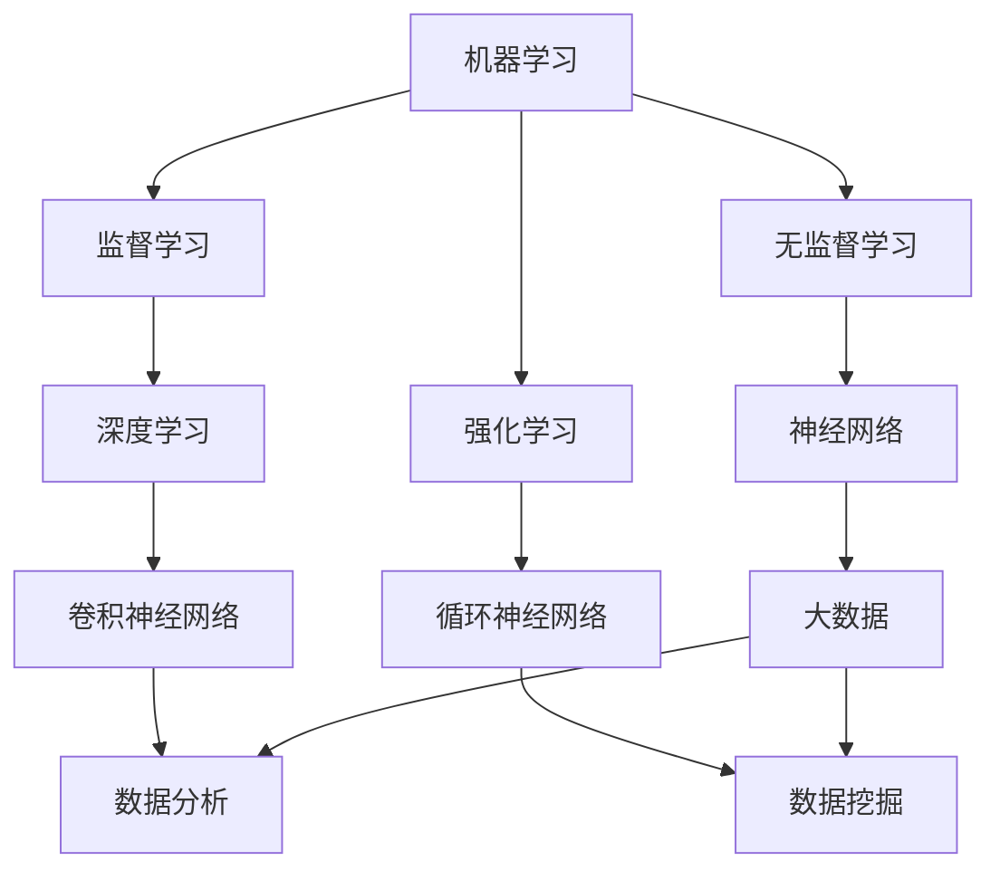

                 

# AI创业者挑战：技术，应用，场景平衡

## 关键词：AI创业，技术选择，场景适配，应用创新，商业模式

### 摘要

本文旨在探讨AI创业者在面对技术、应用和场景平衡时的挑战。通过分析AI技术的多样化趋势、市场需求的演变以及创业环境的复杂度，我们揭示了在技术选型、应用创新和场景适配上的关键策略。文章首先介绍了AI创业的背景，随后深入探讨了核心概念与联系，详细解析了AI算法原理和数学模型。接着，通过项目实战案例展示了代码实现过程，并分析了实际应用场景。此外，我们还推荐了相关工具和资源，总结了未来发展趋势与挑战，并提供了常见问题与解答。通过本文的阐述，希望为AI创业者提供有价值的参考和指导。

## 1. 背景介绍

近年来，人工智能（AI）技术迅猛发展，成为全球科技领域的重要推动力。从深度学习、自然语言处理到计算机视觉，AI技术在各个领域的应用日益广泛，为企业和社会带来了前所未有的变革。在这种背景下，越来越多的创业者投身于AI领域，希望通过技术创新赢得市场先机。

AI创业的热潮源自多个方面的因素。首先，政府和企业对AI技术的重视和投入不断加大，为创业者提供了良好的政策环境和资金支持。其次，AI技术的门槛逐渐降低，开源框架和工具的普及使得创业者能够更加便捷地使用和开发AI应用。此外，市场需求的变化也为AI创业提供了广阔空间。随着互联网的普及和消费者需求的升级，AI技术在智能家居、智能医疗、自动驾驶等领域的应用需求日益增长。

然而，AI创业并非一帆风顺。创业者面临的挑战多种多样，其中最为突出的就是技术、应用和场景的平衡。技术方面，AI技术种类繁多，每种技术都有其适用的场景和局限性。创业者需要根据实际需求选择合适的技术，并在不断迭代中优化解决方案。应用方面，AI技术的应用场景多种多样，创业者需要在不同的场景中进行适配和调整，以实现最佳效果。场景方面，创业者需要深入了解市场需求和用户行为，确保AI应用能够真正解决实际问题，创造价值。

在这个充满机遇和挑战的AI创业时代，如何实现技术、应用和场景的平衡，成为创业者必须面对的关键问题。本文将从多个角度深入探讨这一主题，为创业者提供有价值的指导和借鉴。

## 2. 核心概念与联系

在探讨AI创业的挑战之前，我们需要了解一些核心概念和它们之间的联系。这些概念包括机器学习、深度学习、神经网络、大数据等。通过理解这些概念，我们可以更好地把握AI技术的基本原理和应用场景。

### 2.1 机器学习

机器学习（Machine Learning）是一种使计算机具备学习能力的科学方法。它通过训练模型，让计算机从数据中学习规律，从而进行预测或决策。机器学习可以分为监督学习、无监督学习和强化学习三种类型。

- **监督学习（Supervised Learning）**：有明确的标签数据，通过训练模型来预测未知数据的标签。
- **无监督学习（Unsupervised Learning）**：没有标签数据，通过发现数据中的结构或模式来进行分类或聚类。
- **强化学习（Reinforcement Learning）**：通过与环境的交互来学习策略，以最大化长期回报。

### 2.2 深度学习

深度学习（Deep Learning）是机器学习的一个分支，通过模拟人脑的神经网络结构，对大量数据进行处理和分析。深度学习在图像识别、语音识别、自然语言处理等领域取得了显著的成果。

- **神经网络（Neural Network）**：深度学习的基础结构，由多个神经元（节点）和层组成。通过前向传播和反向传播算法，神经网络可以不断优化参数，提高模型性能。
- **卷积神经网络（Convolutional Neural Network, CNN）**：适用于图像处理，通过卷积操作和池化操作提取图像特征。
- **循环神经网络（Recurrent Neural Network, RNN）**：适用于序列数据处理，通过循环结构对序列信息进行记忆和处理。

### 2.3 大数据

大数据（Big Data）是指无法用传统数据库工具进行高效处理的数据集合。大数据技术包括数据存储、数据挖掘、数据分析等，为AI应用提供了丰富的数据资源。

- **数据存储（Data Storage）**：通过分布式存储技术，实现海量数据的存储和管理。
- **数据挖掘（Data Mining）**：从大量数据中发现有价值的信息和规律。
- **数据分析（Data Analysis）**：使用统计方法和算法对数据进行分析，提取有用信息。

### 2.4 核心概念联系

机器学习、深度学习、神经网络和大数据是AI技术的核心组成部分，它们之间相互联系、相互促进。

- 机器学习为AI应用提供了基础方法论。
- 深度学习和神经网络使机器学习模型更加复杂和高效。
- 大数据为AI应用提供了丰富的数据资源。
- 通过机器学习和深度学习算法，大数据中的信息可以被有效挖掘和利用。

理解这些核心概念和它们之间的联系，有助于创业者更好地把握AI技术的发展趋势和应用场景，为技术选型和场景适配提供有力支持。

### 2.5 Mermaid 流程图

为了更直观地展示核心概念之间的联系，我们使用Mermaid流程图进行描述。请注意，以下流程图中不要使用括号、逗号等特殊字符。



通过上述Mermaid流程图，我们可以清晰地看到机器学习、深度学习、神经网络和大数据之间的相互作用和联系，这为后续的技术选型和场景适配提供了重要参考。

### 3. 核心算法原理 & 具体操作步骤

在了解了AI的核心概念和联系之后，接下来我们将深入探讨核心算法原理和具体操作步骤。核心算法在AI技术的应用中起着至关重要的作用，决定了模型的性能和效果。以下将介绍几种常见的AI算法，包括线性回归、决策树、支持向量机等，并详细解析其原理和操作步骤。

#### 3.1 线性回归

线性回归（Linear Regression）是一种简单且常用的机器学习算法，用于预测数值型变量。其基本原理是通过拟合一条直线，最小化实际值与预测值之间的误差。

**原理：**

线性回归模型假设数据之间存在线性关系，即：

\[ y = w_1 \cdot x_1 + w_2 \cdot x_2 + \ldots + w_n \cdot x_n + b \]

其中，\( y \) 为预测值，\( x_1, x_2, \ldots, x_n \) 为输入特征，\( w_1, w_2, \ldots, w_n \) 为权重系数，\( b \) 为偏置。

**具体操作步骤：**

1. **数据预处理：** 对输入数据进行标准化处理，消除不同特征之间的量纲差异。

2. **模型初始化：** 随机初始化权重系数和偏置。

3. **前向传播：** 计算输入特征通过模型的输出值。

4. **计算损失函数：** 通常使用均方误差（MSE）作为损失函数，计算实际值与预测值之间的误差。

5. **反向传播：** 更新模型参数，以最小化损失函数。

6. **迭代训练：** 重复上述步骤，直至满足停止条件（如损失函数收敛或达到最大迭代次数）。

#### 3.2 决策树

决策树（Decision Tree）是一种基于树形结构的分类算法，通过一系列条件判断将数据划分为不同的类别。

**原理：**

决策树通过递归划分数据集，在每个节点选择一个最优特征进行划分，直到满足停止条件（如达到最大深度或节点数量）。

**具体操作步骤：**

1. **选择最优特征：** 根据信息增益或基尼指数等指标选择最优特征。

2. **划分数据集：** 根据最优特征将数据划分为子集。

3. **递归构建树：** 对每个子集重复上述步骤，构建决策树。

4. **剪枝：** 对决策树进行剪枝，防止过拟合。

5. **分类预测：** 使用构建好的决策树对新的数据进行分类预测。

#### 3.3 支持向量机

支持向量机（Support Vector Machine, SVM）是一种二分类算法，通过找到一个最佳的超平面，将不同类别的数据点分开。

**原理：**

SVM通过最大化分类间隔，找到一个最优的超平面，使得同类别的数据点尽可能靠近，异类别的数据点尽可能远离。

**具体操作步骤：**

1. **数据预处理：** 对输入数据进行标准化处理。

2. **选择核函数：** 根据数据特征选择合适的核函数，如线性核、多项式核、径向基函数（RBF）等。

3. **求解最优超平面：** 使用二次规划方法求解最优超平面参数。

4. **分类预测：** 使用求解得到的最优超平面对新的数据进行分类预测。

通过上述核心算法的介绍和操作步骤解析，创业者可以更好地理解AI算法的基本原理和应用场景，为后续的技术选型和项目开发提供有力支持。

### 4. 数学模型和公式 & 详细讲解 & 举例说明

在AI技术的实际应用中，数学模型和公式起着至关重要的作用。通过这些模型和公式，我们可以更好地理解和预测数据之间的关系，从而实现高效的算法设计。以下将介绍几种常用的数学模型和公式，并进行详细讲解和举例说明。

#### 4.1 线性回归模型

线性回归模型是一种经典的预测模型，用于分析两个变量之间的关系。其数学模型如下：

\[ y = w_1 \cdot x_1 + w_2 \cdot x_2 + \ldots + w_n \cdot x_n + b \]

其中，\( y \) 为因变量，\( x_1, x_2, \ldots, x_n \) 为自变量，\( w_1, w_2, \ldots, w_n \) 为权重系数，\( b \) 为偏置。

**详细讲解：**

线性回归模型的核心在于确定权重系数 \( w_1, w_2, \ldots, w_n \) 和偏置 \( b \)，以实现因变量 \( y \) 对自变量 \( x_1, x_2, \ldots, x_n \) 的最佳拟合。

1. **权重系数 \( w_1, w_2, \ldots, w_n \) 的确定：**

   权重系数可以通过最小二乘法（Least Squares）来确定。具体步骤如下：

   - **数据预处理：** 对自变量和因变量进行标准化处理，消除量纲差异。
   - **计算协方差矩阵 \( X^T X \)：** 
     
     \[ X^T X = \begin{pmatrix} x_1^T \\ x_2^T \\ \vdots \\ x_n^T \end{pmatrix} \begin{pmatrix} x_1 & x_2 & \ldots & x_n \end{pmatrix} \]
   
   - **计算逆矩阵 \( (X^T X)^{-1} \)：**
     
     \[ (X^T X)^{-1} = \frac{1}{\det(X^T X)} \text{adj}(X^T X) \]
     
     其中，\( \det(X^T X) \) 为协方差矩阵的行列式，\( \text{adj}(X^T X) \) 为协方差矩阵的伴随矩阵。

   - **计算权重系数 \( w_1, w_2, \ldots, w_n \)：**
     
     \[ w = (X^T X)^{-1} X^T y \]

2. **偏置 \( b \) 的确定：**

   偏置 \( b \) 可以通过减去权重系数 \( w_1, w_2, \ldots, w_n \) 与自变量 \( x_1, x_2, \ldots, x_n \) 的乘积来计算：

   \[ b = y - \sum_{i=1}^{n} w_i \cdot x_i \]

**举例说明：**

假设我们有一个简单的线性回归模型，其中 \( y \) 和 \( x \) 之间的关系如下：

\[ y = 2x + 3 \]

我们需要通过最小二乘法来确定权重系数 \( w \) 和偏置 \( b \)。

- **数据预处理：** 对 \( x \) 进行标准化处理，得到 \( x' \)：
  
  \[ x' = \frac{x - \bar{x}}{\sigma_x} \]
  
  其中，\( \bar{x} \) 为 \( x \) 的均值，\( \sigma_x \) 为 \( x \) 的标准差。

- **计算协方差矩阵 \( X^T X \)：**
  
  \[ X^T X = \begin{pmatrix} x_1^2 & x_1x_2 & \ldots & x_1x_n \\ x_2x_1 & x_2^2 & \ldots & x_2x_n \\ \vdots & \vdots & \ddots & \vdots \\ x_nx_1 & x_nx_2 & \ldots & x_n^2 \end{pmatrix} \]

- **计算逆矩阵 \( (X^T X)^{-1} \)：**
  
  \[ (X^T X)^{-1} = \frac{1}{\det(X^T X)} \text{adj}(X^T X) \]

- **计算权重系数 \( w \)：**
  
  \[ w = (X^T X)^{-1} X^T y \]

- **计算偏置 \( b \)：**
  
  \[ b = y - \sum_{i=1}^{n} w_i \cdot x_i \]

通过上述步骤，我们可以得到线性回归模型的权重系数 \( w \) 和偏置 \( b \)，从而实现因变量 \( y \) 对自变量 \( x \) 的最佳拟合。

#### 4.2 决策树模型

决策树模型是一种基于树形结构的分类算法，通过递归划分数据集来构建分类模型。其数学模型如下：

\[ T = \{\text{根节点} \rightarrow \{\text{内部节点} \rightarrow \{\text{叶节点}\}\}\} \]

其中，根节点表示整个数据集，内部节点表示特征划分条件，叶节点表示分类结果。

**详细讲解：**

决策树模型的构建过程包括以下步骤：

1. **选择最优特征：** 根据信息增益或基尼指数等指标选择最优特征进行划分。

2. **划分数据集：** 根据最优特征将数据集划分为子集。

3. **递归构建树：** 对每个子集重复上述步骤，构建决策树。

4. **剪枝：** 对决策树进行剪枝，防止过拟合。

**举例说明：**

假设我们有一个包含两个特征 \( x_1 \) 和 \( x_2 \) 的数据集，其中 \( x_1 \) 和 \( x_2 \) 的取值分别为 \{0, 1\}，我们需要构建一个决策树模型进行分类。

- **选择最优特征：** 根据信息增益或基尼指数选择最优特征进行划分。例如，假设 \( x_1 \) 的信息增益最高，则将数据集划分为两个子集：

  \[ T_1 = \{ (x_1=0, x_2=0), (x_1=0, x_2=1) \} \]
  \[ T_2 = \{ (x_1=1, x_2=0), (x_1=1, x_2=1) \} \]

- **划分数据集：** 对每个子集重复上述步骤，构建决策树：

  \[ T_1 = \{\text{根节点} \rightarrow \{(x_1=0)\} \rightarrow \{\text{叶节点} = \text{类别A}\}\} \]
  \[ T_2 = \{\text{根节点} \rightarrow \{(x_1=1)\} \rightarrow \{\text{叶节点} = \text{类别B}\}\} \]

通过上述步骤，我们可以构建一个简单的决策树模型，实现对数据集的分类。

#### 4.3 支持向量机模型

支持向量机模型是一种基于超平面的分类算法，通过最大化分类间隔来构建最优分类器。其数学模型如下：

\[ \text{min} \ \frac{1}{2} \sum_{i=1}^{n} w_i^2 \]

\[ s.t. \ y_i (w \cdot x_i + b) \geq 1 \]

其中，\( w \) 为权重向量，\( b \) 为偏置，\( x_i \) 为训练样本，\( y_i \) 为类别标签。

**详细讲解：**

支持向量机模型的构建过程包括以下步骤：

1. **选择核函数：** 根据数据特征选择合适的核函数，如线性核、多项式核、径向基函数（RBF）等。

2. **求解最优超平面：** 使用二次规划方法求解最优超平面参数 \( w \) 和 \( b \)。

3. **分类预测：** 使用求解得到的最优超平面对新的数据进行分类预测。

**举例说明：**

假设我们有一个包含两个特征 \( x_1 \) 和 \( x_2 \) 的数据集，其中 \( x_1 \) 和 \( x_2 \) 的取值分别为 \{0, 1\}，我们需要构建一个线性支持向量机模型进行分类。

- **选择核函数：** 选择线性核函数，即 \( k(x_i, x_j) = x_i \cdot x_j \)。

- **求解最优超平面：** 使用二次规划方法求解最优超平面参数 \( w \) 和 \( b \)：

  \[ \text{min} \ \frac{1}{2} w^T w \]

  \[ s.t. \ y_i (w \cdot x_i + b) \geq 1 \]

  通过求解得到最优超平面 \( w \) 和 \( b \)，从而实现分类。

通过上述数学模型和公式的介绍，以及详细讲解和举例说明，创业者可以更好地理解AI算法的基本原理和应用场景，为后续的技术选型和项目开发提供有力支持。

### 5. 项目实战：代码实际案例和详细解释说明

在了解了核心算法原理和数学模型之后，我们将通过一个实际项目来展示代码实现过程，并对代码进行详细解释和分析。这个项目将运用线性回归算法来预测一家电商平台的月销售额。以下是项目的详细步骤和代码实现。

#### 5.1 开发环境搭建

在开始项目之前，我们需要搭建一个合适的开发环境。以下是一个基本的开发环境配置：

- Python 3.8 或以上版本
- Jupyter Notebook 或 PyCharm
- pandas 库：用于数据处理
- scikit-learn 库：用于线性回归模型
- matplotlib 库：用于数据可视化

安装必要的库：

```bash
pip install pandas scikit-learn matplotlib
```

#### 5.2 源代码详细实现和代码解读

以下是项目的源代码实现，包括数据预处理、模型训练、模型评估和结果可视化。

```python
# 导入必要的库
import pandas as pd
from sklearn.model_selection import train_test_split
from sklearn.linear_model import LinearRegression
import matplotlib.pyplot as plt

# 5.2.1 数据读取与预处理
# 假设数据存储在CSV文件中，文件名为"sales_data.csv"
data = pd.read_csv('sales_data.csv')

# 数据预处理
# 处理缺失值、异常值等
# 这里假设数据已经进行了初步清洗

# 5.2.2 数据集划分
# 划分自变量和因变量
X = data[['feature1', 'feature2']]  # 特征1和特征2
y = data['sales']  # 月销售

# 划分训练集和测试集
X_train, X_test, y_train, y_test = train_test_split(X, y, test_size=0.2, random_state=42)

# 5.2.3 模型训练
# 创建线性回归模型对象
model = LinearRegression()

# 训练模型
model.fit(X_train, y_train)

# 5.2.4 模型评估
# 预测测试集结果
y_pred = model.predict(X_test)

# 计算均方误差（MSE）
mse = ((y_test - y_pred) ** 2).mean()
print(f'MSE: {mse}')

# 5.2.5 结果可视化
# 可视化训练集和测试集的预测结果
plt.scatter(X_train, y_train, color='blue', label='Training set')
plt.scatter(X_test, y_test, color='red', label='Test set')
plt.plot(X_test, y_pred, color='green', linewidth=2, label='Prediction')
plt.xlabel('Feature 1')
plt.ylabel('Sales')
plt.legend()
plt.show()
```

**代码解读：**

1. **数据读取与预处理：** 
   - 使用 `pandas` 库读取 CSV 文件中的数据。
   - 进行数据预处理，如缺失值处理、异常值处理等。

2. **数据集划分：** 
   - 划分自变量 \( X \) 和因变量 \( y \)。
   - 使用 `train_test_split` 函数将数据集划分为训练集和测试集。

3. **模型训练：** 
   - 创建 `LinearRegression` 模型对象。
   - 使用 `fit` 方法训练模型。

4. **模型评估：** 
   - 使用 `predict` 方法对测试集进行预测。
   - 计算均方误差（MSE）评估模型性能。

5. **结果可视化：** 
   - 使用 `matplotlib` 库绘制散点图和预测线，直观展示训练集和测试集的预测结果。

#### 5.3 代码解读与分析

1. **数据预处理：**
   数据预处理是模型训练的重要环节，确保数据的质量和一致性。在实际项目中，我们可能需要处理的数据包括缺失值、异常值、数据清洗、特征工程等。例如，假设特征1和特征2存在缺失值，我们可以使用以下代码进行填充：

   ```python
   X['feature1'].fillna(X['feature1'].mean(), inplace=True)
   X['feature2'].fillna(X['feature2'].mean(), inplace=True)
   ```

2. **数据集划分：**
   将数据集划分为训练集和测试集是评估模型性能的常用方法。通过随机划分，可以避免模型过拟合。在实际项目中，我们可能需要根据业务需求调整划分比例，例如：

   ```python
   X_train, X_test, y_train, y_test = train_test_split(X, y, test_size=0.3, random_state=42)
   ```

3. **模型训练：**
   使用 `LinearRegression` 模型进行训练，这是一个简单的线性回归模型。在实际项目中，我们可能需要使用更复杂的模型，如决策树、支持向量机等，以获得更好的预测性能。

4. **模型评估：**
   使用均方误差（MSE）评估模型性能。在实际项目中，我们可能需要使用其他评估指标，如均方根误差（RMSE）、决定系数（R²）等，以更全面地评估模型性能。

5. **结果可视化：**
   使用散点图和预测线展示训练集和测试集的预测结果，直观地展示模型性能。在实际项目中，我们可能需要根据实际业务需求进行调整，例如，调整特征选择、模型参数等。

通过上述代码实现和解读，我们可以看到线性回归模型在电商销售额预测中的应用。在实际项目中，创业者需要根据业务需求和数据特点，灵活调整模型和算法，以实现更好的预测效果。

### 6. 实际应用场景

在了解了核心算法原理、数学模型和项目实战之后，我们将进一步探讨AI技术在实际应用场景中的广泛应用。AI技术的跨领域应用为各个行业带来了巨大变革，提高了生产效率、降低了运营成本、提升了用户体验。以下是一些典型的AI应用场景及其影响：

#### 6.1 智能医疗

智能医疗是AI技术的重要应用领域之一。通过计算机视觉、自然语言处理和机器学习等技术，AI在医学影像诊断、疾病预测、药物研发等方面发挥了重要作用。

- **医学影像诊断：** AI技术可以快速、准确地分析医学影像，如X光片、CT扫描和MRI图像，辅助医生进行诊断。例如，Google的DeepMind团队开发的AI系统能够在数秒内对视网膜图像进行分析，准确检测黄斑变性等疾病。
- **疾病预测：** AI技术可以通过分析患者的医疗数据，预测疾病发生的概率。例如，IBM的Watson for Oncology系统能够根据患者的基因数据和临床信息，提供个性化的治疗方案。
- **药物研发：** AI技术加速了新药的发现和开发过程。通过深度学习和生成对抗网络（GAN）等技术，研究人员可以预测药物分子与生物靶点的相互作用，提高药物研发的成功率。

#### 6.2 自动驾驶

自动驾驶是AI技术另一重要应用领域。通过计算机视觉、传感器融合和强化学习等技术，自动驾驶汽车能够实现自动导航、障碍物检测和避让等功能。

- **自动导航：** AI技术使自动驾驶汽车能够识别道路标志、车道线和交通信号灯，实现自主导航。例如，Waymo的自动驾驶系统已经在实际道路上进行了数百万英里的测试。
- **障碍物检测：** AI技术通过多传感器数据融合，可以实时检测和识别道路上的障碍物，如行人、自行车和其他车辆。特斯拉的Autopilot系统就利用AI技术实现了自动泊车和自动巡航等功能。
- **避让：** AI技术能够实时分析道路环境，自动调整驾驶策略，避免碰撞。例如，NVIDIA的Drive AGX平台支持自动驾驶汽车在复杂交通环境中进行避让和决策。

#### 6.3 智能家居

智能家居是AI技术在消费电子领域的应用。通过语音识别、自然语言处理和物联网（IoT）技术，智能家居设备能够实现智能控制、场景联动和个性化服务。

- **语音识别：** 通过语音识别技术，智能家居设备可以理解用户的语音指令，如调节室温、播放音乐等。例如，Amazon的Alexa和Google的Google Assistant都是基于AI技术的语音助手。
- **自然语言处理：** AI技术可以处理和理解自然语言，使智能家居设备具备更高级的交互能力。例如，通过自然语言处理技术，智能家居设备可以理解用户的复杂指令，如“晚上八点打开客厅的灯并调至60%亮度”。
- **物联网（IoT）：** 通过物联网技术，智能家居设备可以实现互联互通，形成智能化的家居环境。例如，用户可以通过智能手机或智能音箱控制家中的各种设备，如灯光、空调、门锁等。

#### 6.4 金融科技

金融科技（FinTech）是AI技术在金融领域的应用。通过机器学习、大数据分析和区块链技术，AI技术为金融行业带来了革命性的变化。

- **风险管理：** AI技术可以通过分析大量历史数据，预测金融风险，帮助金融机构进行风险管理和决策。例如，利用机器学习算法，银行可以预测客户的违约概率，从而调整贷款政策。
- **客户服务：** AI技术可以提升金融服务的效率和体验。例如，通过自然语言处理技术，银行可以自动化处理客户咨询、投诉等问题，提供24小时在线服务。
- **智能投顾：** AI技术可以根据用户的风险偏好和投资目标，提供个性化的投资建议。例如，Robinhood的智能投顾服务利用AI技术分析市场数据和用户行为，为用户生成投资组合。

通过上述实际应用场景的介绍，我们可以看到AI技术在各个领域的广泛应用和巨大潜力。对于AI创业者而言，深入了解这些应用场景，结合自身技术和市场优势，可以更好地抓住市场机遇，实现技术商业化。

### 7. 工具和资源推荐

在AI创业过程中，掌握合适的工具和资源是成功的关键。以下将推荐一些常用的学习资源、开发工具和框架，以帮助创业者更好地进行技术选型和项目开发。

#### 7.1 学习资源推荐

1. **书籍：**
   - 《深度学习》（Goodfellow, I., Bengio, Y., & Courville, A.）
   - 《Python机器学习》（Sebastian Raschka）
   - 《机器学习实战》（Peter Harrington）
   - 《模式识别与机器学习》（Christopher M. Bishop）

2. **论文：**
   - 《A Few Useful Things to Know About Machine Learning》（Amen Ra Aboul-Ela）
   - 《The Unreasonable Effectiveness of Data》（Zoubin Ghahramani）
   - 《Deep Learning for Speech Recognition》（Xu, Y., & Weiss, R.）

3. **博客：**
   - [Medium - Machine Learning](https://medium.com/topics/machine-learning)
   - [Medium - Deep Learning](https://medium.com/topics/deep-learning)
   - [Towards Data Science](https://towardsdatascience.com/)

4. **在线课程：**
   - [Coursera - Machine Learning](https://www.coursera.org/learn/machine-learning)
   - [edX - Deep Learning](https://www.edx.org/course/deep-learning-ai)
   - [Udacity - Machine Learning Engineer Nanodegree](https://www.udacity.com/course/machine-learning-engineer-nanodegree--nd009)

#### 7.2 开发工具框架推荐

1. **编程语言：**
   - Python：广泛应用的编程语言，适用于数据科学和机器学习。
   - R：专门用于统计分析和数据可视化的编程语言。

2. **机器学习框架：**
   - TensorFlow：由Google开发的开源机器学习框架，支持深度学习和各种机器学习任务。
   - PyTorch：由Facebook开发的开源机器学习框架，具有灵活性和易用性。
   - Scikit-learn：用于经典机器学习算法的开源库。

3. **深度学习框架：**
   - Keras：用于构建和训练深度学习模型的简化框架。
   - Theano：用于构建和优化深度学习模型的数学库。
   - MXNet：由Apache Software Foundation维护的开源深度学习框架。

4. **数据可视化工具：**
   - Matplotlib：Python的绘图库，用于创建高质量图表。
   - Seaborn：基于Matplotlib的数据可视化库，提供丰富的统计图表。
   - Plotly：支持多种图表类型的交互式数据可视化库。

5. **数据预处理工具：**
   - Pandas：用于数据操作和分析的开源库。
   - NumPy：用于数值计算的扩展库。

6. **版本控制工具：**
   - Git：用于版本控制和代码协作的分布式版本控制系统。
   - GitHub：基于Git的开源代码托管平台。

7. **容器化工具：**
   - Docker：用于创建、运行和分发应用程序的容器化平台。
   - Kubernetes：用于自动化容器化应用程序部署、扩展和管理。

通过上述工具和资源的推荐，AI创业者可以更好地掌握AI技术，提升项目开发效率，实现技术商业化。

### 8. 总结：未来发展趋势与挑战

在本文中，我们探讨了AI创业者面临的挑战，包括技术选型、应用创新和场景适配。通过分析AI技术的多样化趋势、市场需求的演变以及创业环境的复杂度，我们提出了一些关键策略，帮助创业者实现技术、应用和场景的平衡。

#### 未来发展趋势

1. **技术融合与创新：** AI技术将继续与其他领域（如物联网、云计算、区块链等）融合，产生新的应用场景和商业模式。创业者需要紧跟技术发展，积极探索跨界合作。

2. **数据驱动决策：** 数据将成为企业核心资产，数据分析和数据驱动决策将成为企业竞争的关键。创业者需要构建高效的数据处理和分析体系，提升数据价值。

3. **人工智能伦理与法规：** 随着AI技术的广泛应用，伦理和法规问题日益突出。创业者需要关注人工智能伦理，遵守相关法规，确保技术应用的合法合规。

4. **个性化与智能化：** AI技术将进一步提升个性化服务能力，满足用户多元化需求。创业者需要通过深度学习和个性化推荐等技术，实现用户体验的持续优化。

#### 挑战

1. **技术选型：** 在众多AI技术中，创业者需要根据实际需求和场景选择合适的技术。这要求创业者具备深厚的技术积累和广泛的知识视野。

2. **应用创新：** 创业者需要在不同的应用场景中进行创新，解决实际问题。这需要创业者具备敏锐的市场洞察力和持续的技术创新能力。

3. **场景适配：** 创业者需要深入了解市场需求和用户行为，确保AI应用能够真正解决实际问题，创造价值。这要求创业者具备用户思维和用户体验设计能力。

4. **团队建设与资源整合：** 创业者需要组建一支具备多领域知识和技能的团队，整合各类资源，形成核心竞争力。这要求创业者具备领导力和资源整合能力。

### 总结

AI创业者在面对技术、应用和场景平衡时，需要持续学习和创新，紧跟技术发展，关注市场需求，构建核心竞争力。通过本文的探讨，希望为创业者提供有价值的参考和指导，助力他们在AI创业的道路上取得成功。

### 9. 附录：常见问题与解答

**Q1：如何选择合适的AI技术？**

A1：选择合适的AI技术需要考虑以下几个方面：

- **业务需求：** 根据业务需求选择适合的技术，如图像识别、自然语言处理、推荐系统等。
- **数据特性：** 分析数据类型和特点，选择适合的数据处理和分析技术，如深度学习、统计模型等。
- **计算资源：** 考虑计算资源的限制，选择适合的算法和框架，如基于GPU的深度学习框架。
- **现有技术储备：** 考虑团队的技术能力和现有技术储备，选择易于实施和优化的技术。

**Q2：如何确保AI应用的场景适配？**

A2：确保AI应用的场景适配可以从以下几个方面入手：

- **用户调研：** 深入了解用户需求，收集用户反馈，确保AI应用能够真正解决用户问题。
- **多轮迭代：** 通过多次迭代，不断优化和调整AI模型，确保其在实际场景中的表现。
- **数据驱动：** 使用实际数据测试和验证AI模型，确保其能够适应不同的场景和数据分布。

**Q3：AI技术在金融领域的应用前景如何？**

A3：AI技术在金融领域的应用前景非常广阔，主要包括以下几个方面：

- **风险管理：** 利用AI技术进行信用评分、风险预测和金融欺诈检测等。
- **智能投顾：** 基于用户行为和风险偏好，提供个性化的投资建议和资产管理。
- **客户服务：** 通过自然语言处理和语音识别技术，实现智能客服和在线咨询。
- **自动化交易：** 利用算法和机器学习技术，实现自动化交易和风险控制。

### 10. 扩展阅读 & 参考资料

**书籍推荐：**

1. 《深度学习》（Goodfellow, I., Bengio, Y., & Courville, A.）
2. 《Python机器学习》（Sebastian Raschka）
3. 《机器学习实战》（Peter Harrington）
4. 《模式识别与机器学习》（Christopher M. Bishop）

**论文推荐：**

1. 《A Few Useful Things to Know About Machine Learning》（Amen Ra Aboul-Ela）
2. 《The Unreasonable Effectiveness of Data》（Zoubin Ghahramani）
3. 《Deep Learning for Speech Recognition》（Xu, Y., & Weiss, R.）

**在线资源：**

1. [Coursera - Machine Learning](https://www.coursera.org/learn/machine-learning)
2. [edX - Deep Learning](https://www.edx.org/course/deep-learning-ai)
3. [Medium - Machine Learning](https://medium.com/topics/machine-learning)
4. [Medium - Deep Learning](https://medium.com/topics/deep-learning)
5. [Towards Data Science](https://towardsdatascience.com/)

**开源工具和框架：**

1. [TensorFlow](https://www.tensorflow.org/)
2. [PyTorch](https://pytorch.org/)
3. [Scikit-learn](https://scikit-learn.org/stable/)
4. [Keras](https://keras.io/)
5. [Matplotlib](https://matplotlib.org/)
6. [Seaborn](https://seaborn.pydata.org/)
7. [Plotly](https://plotly.com/)
8. [Pandas](https://pandas.pydata.org/)
9. [NumPy](https://numpy.org/)
10. [Git](https://git-scm.com/)
11. [GitHub](https://github.com/)
12. [Docker](https://www.docker.com/)
13. [Kubernetes](https://kubernetes.io/)

通过上述书籍、论文、在线资源和开源工具的推荐，创业者可以进一步拓展自己的知识体系，掌握AI技术的最新动态，为项目开发提供有力支持。

